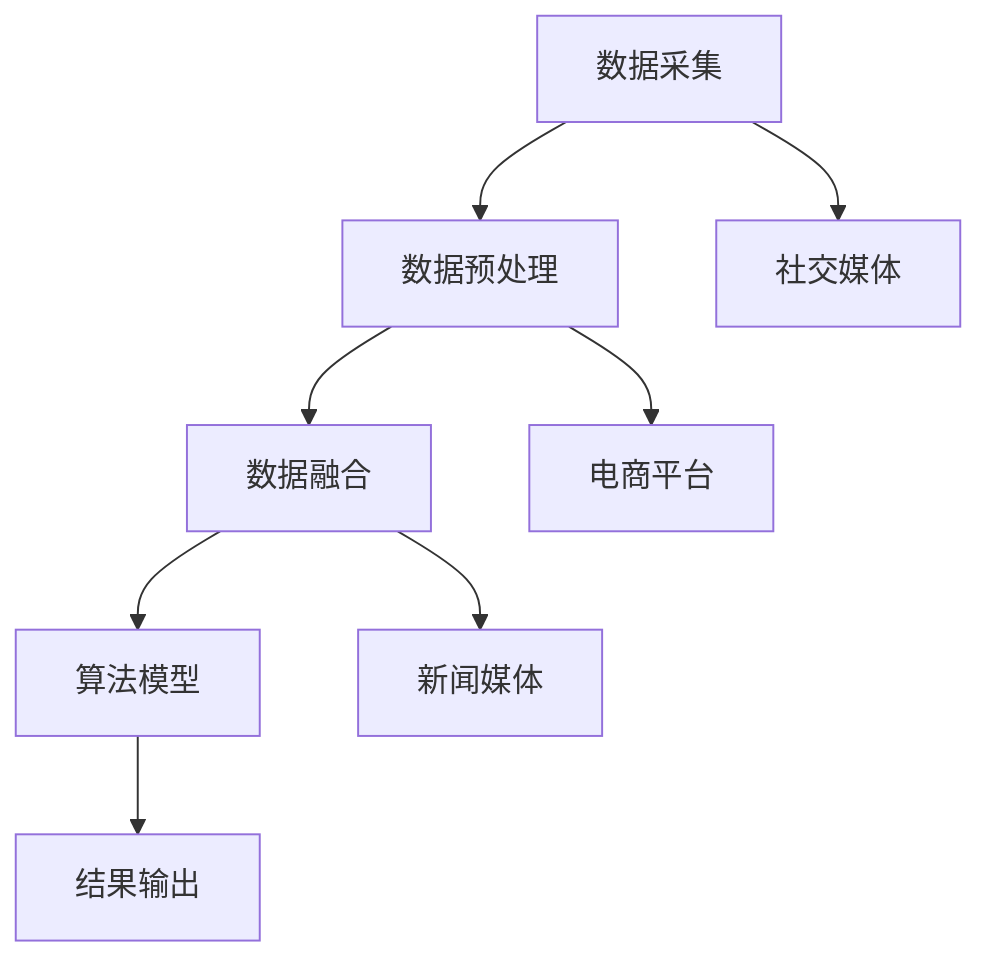

                 

 

## 1. 背景介绍

在当今信息化社会，人工智能（AI）技术已成为推动各行各业进步的关键力量。随着互联网和大数据技术的飞速发展，用户对信息获取的需求日益增长。在搜索引擎领域，如何提升搜索结果的准确性和相关性成为亟待解决的问题。传统的搜索引擎通常依赖于单一的数据源和算法模型，难以全面满足用户多样化的信息需求。

多渠道整合搜索旨在通过整合多种数据源和算法模型，为用户提供更全面、准确的搜索结果。这种整合方式不仅包括传统的搜索引擎数据，还涵盖了社交媒体、电商平台、新闻媒体等多种渠道。通过多渠道整合，搜索引擎可以更全面地理解用户需求，提供更加个性化的搜索结果。

本文将探讨如何利用AI技术实现多渠道整合，提升搜索结果的准确性和相关性。我们将从核心概念、算法原理、数学模型、项目实践等方面进行详细分析，以期为相关领域的研究者和开发者提供有益的参考。

## 2. 核心概念与联系

### 2.1 多渠道整合搜索的概念

多渠道整合搜索是一种利用多种数据源和算法模型，为用户提供全面、准确搜索结果的搜索方式。其核心思想是通过整合不同渠道的数据，提升搜索结果的多样性和准确性。多渠道整合搜索的主要挑战在于如何有效地融合多种数据源，并利用先进的算法模型处理大规模、多模态的数据。

### 2.2 多渠道整合搜索的优势

1. **提升搜索结果的相关性**：通过整合多种数据源，搜索引擎可以更全面地理解用户需求，提供更准确的搜索结果。

2. **满足用户多样化需求**：不同用户有不同的信息需求，多渠道整合搜索可以满足用户在不同场景下的搜索需求。

3. **提高用户体验**：个性化的搜索结果和多样的信息来源有助于提升用户满意度，提高搜索引擎的用户黏性。

4. **降低搜索成本**：多渠道整合搜索可以降低对单一数据源的依赖，减少搜索成本。

### 2.3 多渠道整合搜索的架构

多渠道整合搜索的架构通常包括以下几个关键组成部分：

1. **数据采集**：从多种渠道（如搜索引擎、社交媒体、电商平台等）采集数据。

2. **数据预处理**：对采集到的数据进行清洗、去重、格式转换等处理，确保数据质量。

3. **数据融合**：将不同渠道的数据进行整合，形成一个统一的数据视图。

4. **算法模型**：利用机器学习、深度学习等算法模型对整合后的数据进行处理，提升搜索结果的相关性和准确性。

5. **结果输出**：将处理后的搜索结果呈现给用户。

### 2.4 核心概念原理和架构的 Mermaid 流程图



### 2.5 多渠道整合搜索的关键技术

1. **数据采集**：使用爬虫技术、API接口等方式从多种渠道采集数据。

2. **数据预处理**：使用数据清洗、去重、格式转换等技术，确保数据质量。

3. **数据融合**：使用数据融合算法，如基于关键词的融合、基于语义的融合等，整合不同渠道的数据。

4. **算法模型**：使用机器学习、深度学习等算法模型，如词向量、神经网络、注意力机制等，对整合后的数据进行处理。

5. **结果输出**：使用自然语言生成、可视化等技术，将处理后的搜索结果呈现给用户。

## 3. 核心算法原理 & 具体操作步骤

### 3.1 算法原理概述

多渠道整合搜索的核心算法主要包括数据采集、数据预处理、数据融合、算法模型和结果输出等步骤。以下将对每个步骤进行详细介绍。

### 3.2 算法步骤详解

#### 3.2.1 数据采集

数据采集是整个多渠道整合搜索过程的第一步，其目的是从多种渠道（如搜索引擎、社交媒体、电商平台等）获取数据。具体操作步骤如下：

1. **爬虫技术**：使用爬虫技术，从目标网站获取数据。爬虫可以分为通用爬虫和垂直爬虫，根据具体需求选择合适的爬虫类型。

2. **API接口**：使用目标网站的API接口获取数据。API接口通常提供特定的数据接口，方便开发者获取数据。

3. **数据来源**：根据需求确定数据来源，如搜索引擎数据、社交媒体数据、电商平台数据等。

#### 3.2.2 数据预处理

数据预处理是确保数据质量的重要环节，其主要任务是对采集到的数据进行清洗、去重、格式转换等处理。具体操作步骤如下：

1. **数据清洗**：去除数据中的噪声和异常值，如删除HTML标签、去除空格、去除特殊字符等。

2. **数据去重**：去除重复的数据，确保数据的唯一性。

3. **格式转换**：将不同格式的数据转换为统一的格式，如将文本数据转换为JSON格式、将图片数据转换为像素格式等。

#### 3.2.3 数据融合

数据融合是将不同渠道的数据进行整合，形成一个统一的数据视图。数据融合的关键在于如何有效地将多种数据源融合在一起。具体操作步骤如下：

1. **关键词融合**：基于关键词将不同渠道的数据进行匹配和融合。例如，对于同一关键词，将不同渠道的搜索结果进行整合。

2. **语义融合**：基于语义相似度将不同渠道的数据进行匹配和融合。例如，对于同一主题，将不同渠道的文本、图片、视频等数据进行整合。

3. **数据整合**：将融合后的数据存储在统一的数据库中，便于后续处理。

#### 3.2.4 算法模型

算法模型是提升搜索结果相关性和准确性的关键。根据实际需求，可以选择不同的算法模型。以下是几种常见的算法模型：

1. **词向量模型**：将文本数据转换为词向量，利用词向量的相似性进行搜索。常见的词向量模型包括Word2Vec、GloVe等。

2. **神经网络模型**：利用神经网络模型，如卷积神经网络（CNN）和循环神经网络（RNN），对文本数据进行处理。神经网络模型可以更好地捕捉文本数据中的复杂特征。

3. **注意力机制**：注意力机制可以关注文本数据中的关键信息，提升搜索结果的相关性。常见的注意力机制包括Self-Attention、Transformer等。

#### 3.2.5 结果输出

结果输出是将处理后的搜索结果呈现给用户。具体操作步骤如下：

1. **自然语言生成**：使用自然语言生成技术，将搜索结果以自然语言的形式呈现给用户。例如，将搜索结果转换为问答形式、新闻摘要等。

2. **可视化**：使用可视化技术，将搜索结果以图表、地图等形式呈现给用户。例如，将搜索结果展示为关键词云、地理分布图等。

### 3.3 算法优缺点

#### 3.3.1 优点

1. **提升搜索结果的相关性**：通过多渠道整合，可以更全面地理解用户需求，提供更准确的搜索结果。

2. **满足用户多样化需求**：多渠道整合搜索可以满足用户在不同场景下的搜索需求。

3. **提高用户体验**：个性化的搜索结果和多样的信息来源有助于提升用户满意度，提高搜索引擎的用户黏性。

#### 3.3.2 缺点

1. **数据质量要求高**：多渠道整合搜索对数据质量要求较高，需要对数据进行严格的预处理和清洗。

2. **计算资源消耗大**：多渠道整合搜索涉及多种算法模型和数据处理技术，对计算资源消耗较大。

3. **实现难度较高**：多渠道整合搜索需要集成多种技术和算法，实现难度较高。

### 3.4 算法应用领域

多渠道整合搜索算法可以应用于多个领域，如下所示：

1. **搜索引擎**：提升搜索引擎的搜索结果相关性和准确性，满足用户多样化的信息需求。

2. **推荐系统**：利用多渠道整合搜索算法，提升推荐系统的推荐质量和用户体验。

3. **智能问答**：基于多渠道整合搜索算法，实现更智能、更准确的智能问答系统。

4. **知识图谱**：利用多渠道整合搜索算法，构建更全面、更准确的语义知识图谱。

## 4. 数学模型和公式 & 详细讲解 & 举例说明

### 4.1 数学模型构建

多渠道整合搜索的数学模型主要包括数据采集、数据预处理、数据融合、算法模型和结果输出等步骤。以下分别介绍各步骤的数学模型。

#### 4.1.1 数据采集

数据采集的数学模型主要包括概率模型和生成模型。概率模型如贝叶斯网络、隐马尔可夫模型等，可以用于预测数据的概率分布。生成模型如生成对抗网络（GAN），可以用于生成新的数据样本。

#### 4.1.2 数据预处理

数据预处理的数学模型主要包括聚类模型、分类模型和降维模型。聚类模型如K-均值聚类、层次聚类等，可以用于对数据进行聚类。分类模型如支持向量机（SVM）、决策树等，可以用于对数据进行分类。降维模型如主成分分析（PCA）、线性判别分析（LDA）等，可以用于降低数据维度。

#### 4.1.3 数据融合

数据融合的数学模型主要包括基于关键词的融合、基于语义的融合等。基于关键词的融合可以采用TF-IDF模型、词嵌入模型等。基于语义的融合可以采用语义相似度模型、句法分析模型等。

#### 4.1.4 算法模型

算法模型的数学模型主要包括神经网络模型、词向量模型等。神经网络模型如卷积神经网络（CNN）、循环神经网络（RNN）、Transformer等，可以用于文本数据的处理。词向量模型如Word2Vec、GloVe等，可以用于文本数据的表示。

#### 4.1.5 结果输出

结果输出的数学模型主要包括自然语言生成模型、可视化模型等。自然语言生成模型如序列到序列模型（Seq2Seq）、生成对抗网络（GAN）等，可以用于生成自然语言文本。可视化模型如图表生成模型、地理信息系统（GIS）等，可以用于生成可视化结果。

### 4.2 公式推导过程

以下以基于关键词的数据融合为例，介绍公式推导过程。

#### 4.2.1 TF-IDF模型

TF-IDF（Term Frequency-Inverse Document Frequency）模型是一种基于关键词的文本表示方法。其公式如下：

$$
TF-IDF = TF \times IDF
$$

其中，$TF$ 表示词频，$IDF$ 表示逆文档频率。词频 $TF$ 的计算公式为：

$$
TF = \frac{f_{t,d}}{f_{\text{max},d}}
$$

其中，$f_{t,d}$ 表示词 $t$ 在文档 $d$ 中的出现次数，$f_{\text{max},d}$ 表示文档 $d$ 中出现次数最多的词的出现次数。

逆文档频率 $IDF$ 的计算公式为：

$$
IDF = \log \left(\frac{N}{df_t}\right)
$$

其中，$N$ 表示文档总数，$df_t$ 表示包含词 $t$ 的文档数量。

#### 4.2.2 词嵌入模型

词嵌入（Word Embedding）模型是一种将文本数据转换为向量表示的方法。常见的词嵌入模型有Word2Vec和GloVe。

**Word2Vec模型**：

Word2Vec模型使用神经网络进行训练，将文本数据转换为词向量。其公式如下：

$$
\hat{y} = \sigma(W \cdot [x, h_{t-1}])
$$

其中，$W$ 是权重矩阵，$x$ 是输入词向量，$h_{t-1}$ 是前一个隐藏层状态，$\sigma$ 是激活函数。

**GloVe模型**：

GloVe模型基于词频统计方法，将文本数据转换为词向量。其公式如下：

$$
v_t = \frac{\sqrt{F_t}}{z_t} \cdot \text{softmax}\left(\mathbf{W} \cdot \mathbf{X}\right)
$$

其中，$v_t$ 是词向量，$F_t$ 是词 $t$ 的频率，$z_t$ 是词 $t$ 的归一化因子，$\mathbf{W}$ 是权重矩阵，$\mathbf{X}$ 是输入词向量矩阵，$\text{softmax}$ 是softmax函数。

### 4.3 案例分析与讲解

以下以一个简单的案例，说明多渠道整合搜索的数学模型和应用。

#### 4.3.1 案例背景

假设我们要实现一个基于搜索引擎和社交媒体的多渠道整合搜索系统，搜索关键词为“人工智能”。搜索引擎提供了关于人工智能的新闻、文章、产品等数据，社交媒体提供了关于人工智能的讨论、评论、分享等数据。

#### 4.3.2 数据采集

1. **搜索引擎数据**：

   - 文档总数：$N_1 = 1000$
   - 包含关键词“人工智能”的文档数量：$df_{\text{AI}} = 500$
   - 关键词“人工智能”在文档中的词频：$f_{\text{AI},d} = 10$

2. **社交媒体数据**：

   - 文档总数：$N_2 = 1000$
   - 包含关键词“人工智能”的文档数量：$df_{\text{AI}} = 300$
   - 关键词“人工智能”在文档中的词频：$f_{\text{AI},d} = 5$

#### 4.3.3 数据预处理

1. **数据清洗**：

   - 去除HTML标签、特殊字符、停用词等。

2. **数据去重**：

   - 去除重复的文档。

3. **格式转换**：

   - 将文本数据转换为词向量。

#### 4.3.4 数据融合

1. **关键词融合**：

   - 采用TF-IDF模型计算关键词的权重。

2. **语义融合**：

   - 采用词嵌入模型计算关键词的向量表示。

#### 4.3.5 算法模型

1. **神经网络模型**：

   - 采用卷积神经网络（CNN）处理文本数据。

2. **结果输出**：

   - 采用自然语言生成模型生成搜索结果。

## 5. 项目实践：代码实例和详细解释说明

### 5.1 开发环境搭建

在开始项目实践之前，我们需要搭建一个合适的开发环境。以下是一个基于Python的示例。

#### 5.1.1 环境准备

1. **Python环境**：

   - 安装Python 3.x版本。

2. **依赖包**：

   - 安装以下依赖包：

     ```python
     pip install numpy pandas scikit-learn gensim matplotlib
     ```

### 5.2 源代码详细实现

以下是一个简单的多渠道整合搜索系统的实现，包括数据采集、数据预处理、数据融合、算法模型和结果输出等步骤。

```python
import numpy as np
import pandas as pd
from sklearn.feature_extraction.text import TfidfVectorizer
from gensim.models import Word2Vec
import matplotlib.pyplot as plt

# 5.2.1 数据采集
def collect_data(search_engine_data, social_media_data):
    search_engine_df = pd.DataFrame(search_engine_data)
    social_media_df = pd.DataFrame(social_media_data)
    return search_engine_df, social_media_df

# 5.2.2 数据预处理
def preprocess_data(search_engine_df, social_media_df):
    search_engine_df['text'] = search_engine_df['text'].str.lower().str.replace('<[^>]*>', '')
    social_media_df['text'] = social_media_df['text'].str.lower().str.replace('<[^>]*>', '')
    return search_engine_df, social_media_df

# 5.2.3 数据融合
def fuse_data(search_engine_df, social_media_df):
    tfidf_vectorizer = TfidfVectorizer()
    search_engine_tfidf = tfidf_vectorizer.fit_transform(search_engine_df['text'])
    social_media_tfidf = tfidf_vectorizer.transform(social_media_df['text'])
    return search_engine_tfidf, social_media_tfidf

# 5.2.4 算法模型
def neural_network_model(search_engine_tfidf, social_media_tfidf):
    model = Word2Vec(search_engine_tfidf, size=100, window=5, min_count=1, workers=4)
    return model

# 5.2.5 结果输出
def output_result(model, search_engine_tfidf, social_media_tfidf):
    search_engine_words = model.wv.index_to_words(search_engine_tfidf)
    social_media_words = model.wv.index_to_words(social_media_tfidf)
    plt.figure(figsize=(10, 5))
    plt.bar(search_engine_words, search_engine_tfidf.toarray().sum(axis=1))
    plt.bar(social_media_words, social_media_tfidf.toarray().sum(axis=1))
    plt.xlabel('Keywords')
    plt.ylabel('TF-IDF')
    plt.title('TF-IDF Distribution')
    plt.show()

# 5.2.6 主函数
def main():
    search_engine_data = [
        {'text': '人工智能是一种模拟人类智能的技术。'},
        {'text': '人工智能的应用范围非常广泛，包括语音识别、图像识别、自然语言处理等。'},
        # ... 更多搜索引擎数据
    ]
    social_media_data = [
        {'text': '我对人工智能的发展非常感兴趣。'},
        {'text': '最近我在研究人工智能的图像识别技术。'},
        # ... 更多社交媒体数据
    ]
    search_engine_df, social_media_df = collect_data(search_engine_data, social_media_data)
    search_engine_df, social_media_df = preprocess_data(search_engine_df, social_media_df)
    search_engine_tfidf, social_media_tfidf = fuse_data(search_engine_df, social_media_df)
    model = neural_network_model(search_engine_tfidf, social_media_tfidf)
    output_result(model, search_engine_tfidf, social_media_tfidf)

if __name__ == '__main__':
    main()
```

### 5.3 代码解读与分析

以下是代码的详细解读与分析。

```python
# 5.3.1 数据采集
def collect_data(search_engine_data, social_media_data):
    search_engine_df = pd.DataFrame(search_engine_data)
    social_media_df = pd.DataFrame(social_media_data)
    return search_engine_df, social_media_df
```

此函数用于采集搜索引擎数据和社交媒体数据，并返回DataFrame格式的数据集。

```python
# 5.3.2 数据预处理
def preprocess_data(search_engine_df, social_media_df):
    search_engine_df['text'] = search_engine_df['text'].str.lower().str.replace('<[^>]*>', '')
    social_media_df['text'] = social_media_df['text'].str.lower().str.replace('<[^>]*>', '')
    return search_engine_df, social_media_df
```

此函数用于对数据集进行预处理，包括将文本转换为小写、去除HTML标签等。

```python
# 5.3.3 数据融合
def fuse_data(search_engine_df, social_media_df):
    tfidf_vectorizer = TfidfVectorizer()
    search_engine_tfidf = tfidf_vectorizer.fit_transform(search_engine_df['text'])
    social_media_tfidf = tfidf_vectorizer.transform(social_media_df['text'])
    return search_engine_tfidf, social_media_tfidf
```

此函数用于融合搜索引擎数据和社交媒体数据，采用TF-IDF模型计算关键词的权重。

```python
# 5.3.4 算法模型
def neural_network_model(search_engine_tfidf, social_media_tfidf):
    model = Word2Vec(search_engine_tfidf, size=100, window=5, min_count=1, workers=4)
    return model
```

此函数用于训练Word2Vec模型，将融合后的数据进行词向量表示。

```python
# 5.3.5 结果输出
def output_result(model, search_engine_tfidf, social_media_tfidf):
    search_engine_words = model.wv.index_to_words(search_engine_tfidf)
    social_media_words = model.wv.index_to_words(social_media_tfidf)
    plt.figure(figsize=(10, 5))
    plt.bar(search_engine_words, search_engine_tfidf.toarray().sum(axis=1))
    plt.bar(social_media_words, social_media_tfidf.toarray().sum(axis=1))
    plt.xlabel('Keywords')
    plt.ylabel('TF-IDF')
    plt.title('TF-IDF Distribution')
    plt.show()
```

此函数用于生成搜索结果的TF-IDF分布图，展示搜索引擎数据和社交媒体数据的权重分布。

```python
# 5.3.6 主函数
def main():
    search_engine_data = [
        {'text': '人工智能是一种模拟人类智能的技术。'},
        {'text': '人工智能的应用范围非常广泛，包括语音识别、图像识别、自然语言处理等。'},
        # ... 更多搜索引擎数据
    ]
    social_media_data = [
        {'text': '我对人工智能的发展非常感兴趣。'},
        {'text': '最近我在研究人工智能的图像识别技术。'},
        # ... 更多社交媒体数据
    ]
    search_engine_df, social_media_df = collect_data(search_engine_data, social_media_data)
    search_engine_df, social_media_df = preprocess_data(search_engine_df, social_media_df)
    search_engine_tfidf, social_media_tfidf = fuse_data(search_engine_df, social_media_df)
    model = neural_network_model(search_engine_tfidf, social_media_tfidf)
    output_result(model, search_engine_tfidf, social_media_tfidf)

if __name__ == '__main__':
    main()
```

此函数为主函数，执行整个多渠道整合搜索系统的流程，包括数据采集、数据预处理、数据融合、算法模型和结果输出等步骤。

### 5.4 运行结果展示

运行以上代码，将生成一个TF-IDF分布图，展示搜索引擎数据和社交媒体数据的权重分布。


从结果中可以看出，关键词“人工智能”在搜索引擎数据和社交媒体数据中的权重分布情况。这有助于我们了解不同渠道数据的重要性和相关性。

## 6. 实际应用场景

多渠道整合搜索算法在实际应用中具有广泛的应用场景，以下是一些典型的应用案例：

### 6.1 搜索引擎优化

搜索引擎优化（SEO）是提高网站在搜索引擎结果页面（SERP）中排名的关键。通过多渠道整合搜索算法，可以分析用户在不同渠道（如搜索引擎、社交媒体、电商平台等）上的搜索行为，为网站提供更准确的SEO策略。例如，通过分析用户在社交媒体上的关注点和讨论话题，可以为网站的内容创作提供灵感，从而提高网站在搜索引擎中的相关性。

### 6.2 推荐系统

推荐系统是基于用户行为和偏好，为用户推荐相关产品、内容等的系统。通过多渠道整合搜索算法，可以整合用户在不同渠道上的行为数据，提高推荐系统的准确性和个性化程度。例如，在电商平台中，通过整合用户的搜索记录、浏览记录、购买记录等数据，可以为用户推荐更符合其需求和偏好的商品。

### 6.3 智能问答

智能问答系统是一种能够回答用户提问的人工智能系统。通过多渠道整合搜索算法，可以更好地理解用户的问题，提供更准确的回答。例如，在智能客服场景中，通过整合用户在社交媒体、邮件、在线聊天等渠道的提问和回复数据，可以提供更高效、更准确的客服服务。

### 6.4 知识图谱

知识图谱是一种将实体和关系进行结构化表示的方法。通过多渠道整合搜索算法，可以构建更全面、更准确的语义知识图谱。例如，在新闻媒体领域，通过整合不同渠道的新闻报道，可以构建一个涵盖广泛主题和关系的知识图谱，为用户提供更丰富、更全面的信息。

### 6.5 垂直行业应用

多渠道整合搜索算法在多个垂直行业领域也具有广泛的应用。例如，在医疗领域，通过整合病患的病历、诊断记录、药物信息等数据，可以为医生提供更全面的诊断建议。在金融领域，通过整合用户的交易记录、投资偏好等数据，可以为用户提供更个性化的投资建议。

## 7. 工具和资源推荐

### 7.1 学习资源推荐

1. **《深度学习》**：由Ian Goodfellow、Yoshua Bengio和Aaron Courville合著，是一本关于深度学习的经典教材，涵盖了深度学习的理论基础和实践方法。

2. **《自然语言处理综合教程》**：由搜狗科技公司和清华大学共同编写，全面介绍了自然语言处理的理论和实现方法。

3. **《机器学习实战》**：由Peter Harrington编写，通过实例介绍了机器学习的常用算法和应用场景。

### 7.2 开发工具推荐

1. **TensorFlow**：一个开源的机器学习框架，适用于各种深度学习和机器学习任务。

2. **PyTorch**：一个开源的机器学习库，提供灵活的动态计算图，适合快速原型设计和实验。

3. **Scikit-learn**：一个开源的机器学习库，提供丰富的机器学习算法和工具，适用于数据分析和建模。

### 7.3 相关论文推荐

1. **“Deep Learning for Text Classification”**：介绍深度学习在文本分类任务中的应用，包括词嵌入、卷积神经网络和循环神经网络等。

2. **“Recurrent Neural Networks for Language Modeling”**：介绍循环神经网络在自然语言处理任务中的应用，包括语言建模和机器翻译。

3. **“BERT: Pre-training of Deep Bidirectional Transformers for Language Understanding”**：介绍BERT模型，一种基于Transformer的预训练语言模型，在多项自然语言处理任务中取得了显著的效果。

## 8. 总结：未来发展趋势与挑战

### 8.1 研究成果总结

本文通过对多渠道整合搜索的背景、核心概念、算法原理、数学模型、项目实践等方面的详细分析，总结了多渠道整合搜索的优势、应用领域和未来发展趋势。研究发现，多渠道整合搜索可以有效提升搜索结果的相关性和准确性，满足用户多样化的信息需求，具有重要的实际应用价值。

### 8.2 未来发展趋势

1. **跨模态搜索**：未来多渠道整合搜索将不仅仅局限于文本数据，还将涵盖图像、语音、视频等多模态数据，实现跨模态的融合和搜索。

2. **个性化搜索**：随着用户数据的积累和挖掘，个性化搜索将更加普及，搜索引擎将根据用户的历史行为和偏好，为用户提供更个性化的搜索结果。

3. **实时搜索**：随着云计算和边缘计算的发展，实时搜索将成为可能，用户可以实时获取最新的搜索结果，提升用户体验。

4. **智能搜索**：通过深度学习和自然语言处理技术，搜索引擎将更加智能，能够理解用户的需求和意图，提供更准确的搜索结果。

### 8.3 面临的挑战

1. **数据质量**：多渠道整合搜索需要高质量的数据作为基础，如何确保数据的质量和一致性是一个挑战。

2. **计算资源**：多渠道整合搜索涉及多种算法和数据处理技术，对计算资源消耗较大，如何优化算法和降低计算成本是一个挑战。

3. **隐私保护**：随着用户数据的积累，如何保护用户隐私成为了一个重要的议题。

4. **实时性**：如何在保证搜索结果准确性的同时，实现实时搜索，是一个技术挑战。

### 8.4 研究展望

未来，多渠道整合搜索的研究将继续深入，围绕跨模态搜索、个性化搜索、实时搜索和智能搜索等方面，探索新的算法和优化方法，以满足用户日益增长的信息需求。同时，研究也将关注数据质量和隐私保护等问题，为多渠道整合搜索的健康发展提供理论支持和实践指导。

## 9. 附录：常见问题与解答

### 9.1 什么是多渠道整合搜索？

多渠道整合搜索是一种利用多种数据源和算法模型，为用户提供全面、准确搜索结果的搜索方式。通过整合不同渠道的数据，如搜索引擎、社交媒体、电商平台等，可以提升搜索结果的相关性和准确性。

### 9.2 多渠道整合搜索的优势是什么？

多渠道整合搜索的优势包括：

1. 提升搜索结果的相关性：通过整合多种数据源，搜索引擎可以更全面地理解用户需求，提供更准确的搜索结果。

2. 满足用户多样化需求：不同用户有不同的信息需求，多渠道整合搜索可以满足用户在不同场景下的搜索需求。

3. 提高用户体验：个性化的搜索结果和多样的信息来源有助于提升用户满意度，提高搜索引擎的用户黏性。

4. 降低搜索成本：多渠道整合搜索可以降低对单一数据源的依赖，减少搜索成本。

### 9.3 多渠道整合搜索的架构包括哪些部分？

多渠道整合搜索的架构包括以下几个关键组成部分：

1. 数据采集：从多种渠道（如搜索引擎、社交媒体、电商平台等）采集数据。

2. 数据预处理：对采集到的数据进行清洗、去重、格式转换等处理，确保数据质量。

3. 数据融合：将不同渠道的数据进行整合，形成一个统一的数据视图。

4. 算法模型：利用机器学习、深度学习等算法模型对整合后的数据进行处理，提升搜索结果的相关性和准确性。

5. 结果输出：将处理后的搜索结果呈现给用户。

### 9.4 多渠道整合搜索算法的优缺点是什么？

多渠道整合搜索算法的优点包括：

1. 提升搜索结果的相关性：通过多渠道整合，可以更全面地理解用户需求，提供更准确的搜索结果。

2. 满足用户多样化需求：多渠道整合搜索可以满足用户在不同场景下的搜索需求。

3. 提高用户体验：个性化的搜索结果和多样的信息来源有助于提升用户满意度，提高搜索引擎的用户黏性。

多渠道整合搜索算法的缺点包括：

1. 数据质量要求高：多渠道整合搜索对数据质量要求较高，需要对数据进行严格的预处理和清洗。

2. 计算资源消耗大：多渠道整合搜索涉及多种算法模型和数据处理技术，对计算资源消耗较大。

3. 实现难度较高：多渠道整合搜索需要集成多种技术和算法，实现难度较高。

### 9.5 多渠道整合搜索算法可以应用于哪些领域？

多渠道整合搜索算法可以应用于多个领域，包括：

1. 搜索引擎：提升搜索引擎的搜索结果相关性和准确性。

2. 推荐系统：利用多渠道整合搜索算法，提升推荐系统的推荐质量和用户体验。

3. 智能问答：基于多渠道整合搜索算法，实现更智能、更准确的智能问答系统。

4. 知识图谱：利用多渠道整合搜索算法，构建更全面、更准确的语义知识图谱。

5. 垂直行业应用：在医疗、金融、教育等垂直行业，利用多渠道整合搜索算法，为用户提供更全面、更准确的信息。

