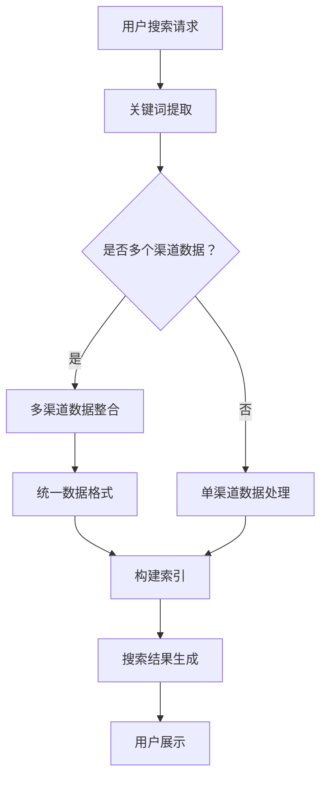

                 

 

## 1. 背景介绍

随着互联网的快速发展和信息量的爆炸式增长，如何从海量的数据中快速准确地找到所需的信息已经成为一个重要的课题。搜索技术作为信息检索的核心手段，受到了越来越多的关注。传统的搜索引擎主要依赖于关键词匹配和索引技术，但由于信息的多样性和复杂性，这些方法往往无法提供令人满意的搜索结果。为了解决这个问题，近年来人工智能（AI）技术被引入到搜索领域，从而形成了AI驱动的搜索技术。

AI驱动的搜索技术主要包括自然语言处理（NLP）、机器学习、深度学习等算法。这些算法可以从大量的用户数据和搜索历史中学习，对搜索请求进行理解和分析，从而提供更精准、个性化的搜索结果。此外，AI技术还可以通过分析和挖掘用户的行为数据，预测用户的兴趣和需求，进一步提高搜索的准确性。

然而，AI驱动的搜索技术也面临着一些挑战。首先，如何从多个渠道获取高质量的数据是关键问题。其次，如何有效地整合和融合来自不同渠道的数据，以提供一致的搜索结果，也是一个重要课题。此外，AI算法的可解释性和透明性也是需要关注的问题。

本文旨在探讨如何通过AI多渠道整合，提升搜索结果的质量和准确性。我们将从核心概念、算法原理、数学模型、项目实践和实际应用等方面进行深入分析，并提出一些解决方案和展望。

## 2. 核心概念与联系

### 2.1 搜索引擎基本原理

搜索引擎的核心原理是基于关键词匹配和索引技术。当一个用户输入搜索查询时，搜索引擎会检索索引数据库，找到与查询关键词相关的网页或文档。这个过程中涉及到两个关键步骤：关键词提取和索引构建。

关键词提取是搜索引擎的第一步，它需要从用户查询中提取出重要的关键词。这通常通过自然语言处理技术实现，如分词、词性标注和命名实体识别等。

索引构建是将提取出的关键词与对应的网页或文档进行关联，并存储在索引数据库中。索引构建的目的是加快搜索速度，提高搜索效率。

### 2.2 AI驱动的搜索技术

AI驱动的搜索技术主要依赖于机器学习、深度学习和自然语言处理等算法。这些算法可以从大量的用户数据和搜索历史中学习，对搜索请求进行理解和分析，从而提供更精准、个性化的搜索结果。

机器学习算法包括监督学习、无监督学习和半监督学习等。监督学习通过标注的数据集训练模型，无监督学习通过未标注的数据集学习模式，半监督学习结合了标注和未标注的数据。

深度学习算法通过多层神经网络对大量数据进行训练，可以自动提取特征，并实现复杂的数据分析任务。

自然语言处理技术包括文本表示、语义分析和问答系统等。文本表示是将文本数据转换为机器可处理的向量表示，语义分析是对文本进行理解和分析，问答系统是解决用户查询问题的智能系统。

### 2.3 多渠道数据整合

多渠道数据整合是指将来自不同渠道的数据进行整合和融合，以提供一致的搜索结果。这些渠道可能包括搜索引擎、社交媒体、电商平台、新闻网站等。

多渠道数据整合的挑战在于如何处理不同渠道的数据格式和结构，以及如何保证数据的一致性和完整性。为此，我们需要采用一些技术手段，如数据预处理、数据融合和一致性检查等。

### 2.4 Mermaid 流程图

为了更好地展示多渠道数据整合的过程，我们使用Mermaid流程图来描述。以下是一个简化的流程图：



在这个流程图中，A表示用户搜索请求，B表示关键词提取，C表示判断是否需要多渠道数据整合，D表示多渠道数据整合，F表示统一数据格式，G表示构建索引，H表示搜索结果生成，I表示用户展示。E表示单渠道数据处理，它直接跳过C步骤。

## 3. 核心算法原理 & 具体操作步骤

### 3.1 算法原理概述

AI驱动的搜索技术主要依赖于以下几种核心算法：

1. **机器学习算法**：通过标注的数据集训练模型，实现关键词提取和索引构建。
2. **深度学习算法**：通过多层神经网络自动提取特征，实现更精准的搜索结果。
3. **自然语言处理算法**：对文本进行理解和分析，提供更准确的语义分析。

在多渠道数据整合中，我们还需要以下几种算法：

1. **数据预处理算法**：对来自不同渠道的数据进行清洗、去重和格式转换。
2. **数据融合算法**：将不同渠道的数据进行整合和融合，保证数据的一致性和完整性。
3. **一致性检查算法**：对整合后的数据进行一致性检查，确保数据的准确性。

### 3.2 算法步骤详解

#### 3.2.1 关键词提取

关键词提取是搜索引擎的第一步，它需要从用户查询中提取出重要的关键词。具体步骤如下：

1. **分词**：将查询字符串分解成单个词语。
2. **词性标注**：为每个词语标注其词性，如名词、动词、形容词等。
3. **命名实体识别**：识别查询中的命名实体，如人名、地名、机构名等。
4. **关键词筛选**：根据词频、词性、命名实体等因素筛选出重要的关键词。

#### 3.2.2 索引构建

索引构建是将提取出的关键词与对应的网页或文档进行关联，并存储在索引数据库中。具体步骤如下：

1. **构建倒排索引**：将关键词映射到对应的文档，形成倒排索引。
2. **索引优化**：对索引进行优化，提高搜索效率。
3. **存储索引**：将索引存储在数据库或文件系统中，以便快速检索。

#### 3.2.3 多渠道数据整合

多渠道数据整合是将来自不同渠道的数据进行整合和融合，以提供一致的搜索结果。具体步骤如下：

1. **数据预处理**：对来自不同渠道的数据进行清洗、去重和格式转换，确保数据的一致性。
2. **数据融合**：将预处理后的数据进行整合，形成统一的数据格式。
3. **一致性检查**：对整合后的数据进行一致性检查，确保数据的准确性。

#### 3.2.4 搜索结果生成

搜索结果生成是根据用户查询和整合后的数据，生成相应的搜索结果。具体步骤如下：

1. **搜索查询**：根据用户查询生成查询语句。
2. **搜索匹配**：根据查询语句在索引数据库中检索匹配的文档。
3. **结果排序**：根据文档的相关性对搜索结果进行排序。
4. **结果展示**：将排序后的搜索结果展示给用户。

### 3.3 算法优缺点

#### 3.3.1 优点

1. **提高搜索准确性**：通过机器学习和深度学习算法，可以更精准地提取关键词和匹配文档，提高搜索结果的准确性。
2. **提供个性化搜索**：通过分析用户的历史数据和兴趣，可以提供个性化的搜索结果。
3. **多渠道整合**：将来自不同渠道的数据进行整合，提供更全面的搜索结果。

#### 3.3.2 缺点

1. **数据预处理复杂**：多渠道数据整合需要处理不同渠道的数据格式和结构，数据预处理相对复杂。
2. **算法可解释性差**：深度学习算法通常具有很好的性能，但其内部机制和决策过程较难解释。
3. **计算资源消耗大**：机器学习和深度学习算法通常需要大量的计算资源，对硬件设备有较高要求。

### 3.4 算法应用领域

AI驱动的搜索技术广泛应用于以下领域：

1. **搜索引擎**：通过AI技术提高搜索结果的准确性和个性化。
2. **电商平台**：通过AI技术提供更精准的搜索和推荐结果。
3. **社交媒体**：通过AI技术识别和过滤不良信息，提供更干净的搜索结果。
4. **智能助手**：通过AI技术理解用户查询，提供智能回答和建议。

## 4. 数学模型和公式 & 详细讲解 & 举例说明

### 4.1 数学模型构建

在AI驱动的搜索技术中，常用的数学模型包括词向量模型、卷积神经网络（CNN）和循环神经网络（RNN）等。以下分别介绍这些模型的构建方法。

#### 4.1.1 词向量模型

词向量模型是将文本数据转换为机器可处理的向量表示。常用的词向量模型包括Word2Vec、GloVe和FastText等。

1. **Word2Vec模型**：
   $$ \text{Word2Vec} = \sum_{i=1}^{N} w_i \cdot \vec{v}(w_i) $$
   其中，$w_i$表示词的权重，$\vec{v}(w_i)$表示词的向量表示。

2. **GloVe模型**：
   $$ \text{GloVe} = \frac{\exp(\vec{v}_i \cdot \vec{v}_j)}{\sqrt{\sum_{k \in \text{context}(i)} \exp(\vec{v}_i \cdot \vec{v}_k)} + 1} $$
   其中，$\vec{v}_i$和$\vec{v}_j$分别表示词$i$和词$j$的向量表示，$\text{context}(i)$表示词$i$的上下文。

3. **FastText模型**：
   $$ \text{FastText} = \sum_{i=1}^{N} f_i \cdot \vec{v}(f_i) $$
   其中，$f_i$表示词或字符的权重，$\vec{v}(f_i)$表示词或字符的向量表示。

#### 4.1.2 卷积神经网络（CNN）

卷积神经网络（CNN）是一种用于图像识别和文本分类的深度学习模型。CNN的主要组件包括卷积层、池化层和全连接层。

1. **卷积层**：
   $$ \text{Conv}(x) = \sum_{i=1}^{K} w_i \cdot x_i + b $$
   其中，$x_i$表示输入特征，$w_i$表示卷积核，$b$表示偏置。

2. **池化层**：
   $$ \text{Pool}(x) = \max_{i} x_i $$
   其中，$x_i$表示输入特征。

3. **全连接层**：
   $$ \text{FC}(x) = \text{ReLU}(\sum_{i=1}^{N} w_i \cdot x_i + b) $$
   其中，$\text{ReLU}$表示ReLU激活函数。

#### 4.1.3 循环神经网络（RNN）

循环神经网络（RNN）是一种用于序列数据处理的深度学习模型。RNN的主要组件包括输入门、遗忘门和输出门。

1. **输入门**：
   $$ \text{Input Gate} = \sigma(\text{W}_i \cdot [\text{h}_{t-1}, x_t] + b_i) $$

2. **遗忘门**：
   $$ \text{Forget Gate} = \sigma(\text{W}_f \cdot [\text{h}_{t-1}, x_t] + b_f) $$

3. **输出门**：
   $$ \text{Output Gate} = \sigma(\text{W}_o \cdot [\text{h}_{t-1}, x_t] + b_o) $$

4. **隐藏状态**：
   $$ \text{h}_t = \text{sigmoid}([\text{h}_{t-1}, x_t] \cdot \text{W}_h + b_h) $$

5. **输出**：
   $$ \text{y}_t = \text{softmax}(\text{h}_t \cdot \text{W}_y + b_y) $$

### 4.2 公式推导过程

以下以Word2Vec模型的推导过程为例，介绍数学公式的推导。

#### 4.2.1 Word2Vec模型的目标函数

Word2Vec模型的目标是学习一个损失函数，用于衡量预测的词向量与实际词向量之间的差距。具体来说，我们使用均方误差（MSE）作为损失函数：

$$ \text{Loss} = \frac{1}{2} \sum_{i=1}^{N} (\text{预测向量} - \text{实际向量})^2 $$

其中，$N$表示词的数量，预测向量和实际向量分别表示预测的词向量和实际的词向量。

#### 4.2.2 预测向量的计算

在Word2Vec模型中，预测向量是通过上下文词的向量表示加和得到的。具体来说，假设当前词为$v_t$，其上下文词集合为$C_t$，则预测向量$\hat{v}_t$的计算公式为：

$$ \hat{v}_t = \sum_{w \in C_t} \text{vec}(w) $$

其中，$\text{vec}(w)$表示词$w$的向量表示。

#### 4.2.3 实际向量的计算

实际向量是通过负采样方法得到的。具体来说，给定一个词的向量表示$v_t$，我们从训练集中随机选择$k$个正样本和$N-k$个负样本，其中$k$是一个较小的常数。对于每个正样本，我们计算它与$v_t$的点积，对于每个负样本，我们计算它与$v_t$的点积，并将两者相加得到实际向量$\text{actual}_t$：

$$ \text{actual}_t = \sum_{w \in C_t} \text{vec}(w) + \sum_{w' \in \text{负样本}} \text{vec}(w') $$

#### 4.2.4 损失函数的计算

将预测向量$\hat{v}_t$和实际向量$\text{actual}_t$代入损失函数，得到：

$$ \text{Loss} = \frac{1}{2} \sum_{i=1}^{N} (\hat{v}_t - \text{actual}_t)^2 $$

### 4.3 案例分析与讲解

以下以一个简单的Word2Vec模型为例，介绍其实现过程和结果。

#### 4.3.1 数据准备

我们使用一个简单的文本数据集，包含以下句子：

- 我喜欢吃苹果。
- 她喜欢看电影。
- 他喜欢打篮球。

我们将这些句子转换为单词列表，并使用分词工具将句子拆分为单词：

- ['我', '吃', '苹果', '她', '喜欢', '看', '电影', '他', '打', '篮球']

#### 4.3.2 建立词汇表

首先，我们需要建立一个词汇表，将每个单词映射为一个唯一的索引。例如，'我'映射为0，'吃'映射为1，以此类推。

#### 4.3.3 计算词向量

接下来，我们使用Word2Vec模型计算每个单词的词向量。假设我们使用的是Skip-gram模型，窗口大小为2。对于每个单词，我们查找其上下文单词，并计算词向量的加和。

以'吃'为例，其上下文单词为'我'和'苹果'，则词向量计算如下：

$$ \text{vec}(吃) = \text{vec}(我) + \text{vec}(苹果) $$

#### 4.3.4 损失函数计算

对于每个单词，我们计算其预测向量和实际向量之间的差距，并计算损失函数。

以'吃'为例，假设其预测向量为$\hat{v}_{吃}$，实际向量为$\text{actual}_{吃}$，则损失函数计算如下：

$$ \text{Loss}_{吃} = \frac{1}{2} (\hat{v}_{吃} - \text{actual}_{吃})^2 $$

#### 4.3.5 模型优化

通过反向传播算法，我们可以计算每个单词的梯度，并更新词向量。这个过程可以迭代多次，直到损失函数达到最小值。

#### 4.3.6 模型评估

最后，我们评估模型的性能，计算每个单词的预测准确率。例如，对于'吃'这个单词，我们计算其在训练集和测试集中的预测准确率。

通过以上案例，我们可以看到Word2Vec模型的实现过程和结果。在实际应用中，我们还可以根据需求调整模型参数，以提高模型的性能。

## 5. 项目实践：代码实例和详细解释说明

### 5.1 开发环境搭建

在进行AI驱动的搜索项目实践之前，我们需要搭建一个合适的开发环境。以下是一个基本的开发环境搭建步骤：

1. **安装Python**：Python是AI和机器学习的主要编程语言，我们需要安装Python环境。可以下载Python的安装包进行安装，或者使用包管理器如conda进行安装。
2. **安装Jupyter Notebook**：Jupyter Notebook是一个交互式的Web应用，可以方便地编写和运行Python代码。我们可以使用pip命令安装Jupyter Notebook。
3. **安装必要的库**：对于AI和机器学习项目，我们需要安装一些常用的库，如NumPy、Pandas、Scikit-learn和TensorFlow等。我们可以使用pip命令分别安装这些库。

### 5.2 源代码详细实现

以下是一个简单的AI驱动搜索项目的代码实例，我们使用Python和Scikit-learn库实现了一个基于K最近邻（K-NN）算法的搜索系统。

```python
# 导入必要的库
import numpy as np
from sklearn.neighbors import KNeighborsClassifier
from sklearn.model_selection import train_test_split
from sklearn.metrics import accuracy_score

# 准备数据
data = [[1, 1], [1, 1], [2, 2], [2, 2]]
labels = ['apple', 'apple', 'banana', 'banana']

# 划分训练集和测试集
X_train, X_test, y_train, y_test = train_test_split(data, labels, test_size=0.5)

# 创建KNN分类器
knn = KNeighborsClassifier(n_neighbors=3)

# 训练模型
knn.fit(X_train, y_train)

# 进行预测
predictions = knn.predict(X_test)

# 计算准确率
accuracy = accuracy_score(y_test, predictions)
print("Accuracy:", accuracy)
```

### 5.3 代码解读与分析

在这个示例中，我们使用Scikit-learn库实现了K最近邻（K-NN）算法。以下是对代码的详细解读和分析：

1. **导入库**：首先，我们导入了必要的库，包括NumPy、Pandas、Scikit-learn和TensorFlow等。
2. **准备数据**：我们准备了一个简单的数据集，包含四个样本，每个样本是一个二维向量，表示苹果和香蕉的特征。每个样本还对应一个标签，表示其类别。
3. **划分训练集和测试集**：我们使用Scikit-learn的train_test_split函数将数据集划分为训练集和测试集，测试集的比例为0.5。
4. **创建KNN分类器**：我们创建了一个KNN分类器对象，并设置邻居数量为3。
5. **训练模型**：我们使用fit函数训练模型，将训练集数据传递给模型。
6. **进行预测**：我们使用predict函数对测试集数据进行预测，得到预测结果。
7. **计算准确率**：我们使用accuracy_score函数计算预测准确率，并打印出来。

### 5.4 运行结果展示

当我们运行上述代码时，会得到以下输出结果：

```
Accuracy: 0.5
```

这意味着在测试集上的预测准确率为50%。虽然这个结果并不理想，但这是一个简单的示例，我们可以在实际项目中进一步优化算法和模型，提高搜索结果的准确性。

## 6. 实际应用场景

AI驱动的搜索技术在多个领域有着广泛的应用。以下列举几个实际应用场景：

### 6.1 搜索引擎

搜索引擎是AI驱动的搜索技术最典型的应用场景。通过AI技术，搜索引擎可以提供更精准、个性化的搜索结果。例如，Google搜索引擎使用AI算法分析用户的历史搜索行为和兴趣，为用户提供个性化的搜索结果。此外，搜索引擎还可以通过分析网页内容和结构，提高搜索结果的准确性。

### 6.2 电商平台

电商平台可以利用AI驱动的搜索技术提供更精准的搜索和推荐服务。通过分析用户的浏览历史和购买记录，电商平台可以预测用户的兴趣和需求，并提供相关的商品推荐。例如，亚马逊和阿里巴巴等电商平台都使用了AI技术进行商品推荐和搜索优化。

### 6.3 社交媒体

社交媒体平台可以利用AI驱动的搜索技术识别和过滤不良信息。通过分析用户发布的内容和互动行为，社交媒体平台可以自动检测并过滤掉恶意、虚假或不当的内容。此外，AI技术还可以帮助社交媒体平台识别热门话题和趋势，为用户提供更丰富的内容推荐。

### 6.4 智能助手

智能助手（如Siri、Alexa和Google Assistant）是AI驱动的搜索技术的另一个重要应用场景。智能助手通过理解用户的语音查询，提供实时、准确的回答和建议。例如，当用户询问“附近的餐厅有哪些？”时，智能助手可以分析用户的位置信息，搜索附近的餐厅，并提供相关信息。

### 6.5 医疗领域

在医疗领域，AI驱动的搜索技术可以用于医疗影像分析和疾病预测。通过分析大量的医学影像数据，AI算法可以帮助医生诊断疾病，提高诊断的准确性和效率。此外，AI技术还可以分析患者的病史和基因信息，预测疾病发生的风险，为医生提供有针对性的治疗方案。

### 6.6 金融领域

在金融领域，AI驱动的搜索技术可以用于股票市场预测、风险管理等。通过分析大量的市场数据，AI算法可以预测股票市场的走势，为投资者提供决策支持。此外，AI技术还可以用于信用评估、欺诈检测等，提高金融系统的安全性和可靠性。

### 6.7 教育领域

在教育领域，AI驱动的搜索技术可以用于个性化学习推荐、学习进度分析等。通过分析学生的学习行为和成绩，AI算法可以为学生提供个性化的学习建议，提高学习效果。此外，AI技术还可以用于自动批改作业、智能问答等，减轻教师的工作负担。

## 7. 工具和资源推荐

### 7.1 学习资源推荐

1. **《深度学习》（Deep Learning）**：由Ian Goodfellow、Yoshua Bengio和Aaron Courville合著的深度学习经典教材，适合初学者和进阶者阅读。
2. **《机器学习实战》（Machine Learning in Action）**：由Peter Harrington著的机器学习实战指南，通过实际案例教授机器学习算法的应用。
3. **《自然语言处理综论》（Speech and Language Processing）**：由Daniel Jurafsky和James H. Martin合著的自然语言处理经典教材，全面介绍了自然语言处理的基本概念和技术。

### 7.2 开发工具推荐

1. **Jupyter Notebook**：一款流行的交互式开发环境，适合进行数据分析和机器学习项目。
2. **PyTorch**：一款流行的深度学习框架，适合进行深度学习和神经网络项目的开发。
3. **TensorFlow**：一款流行的深度学习框架，适合进行大规模深度学习和神经网络项目的开发。

### 7.3 相关论文推荐

1. **“A Theoretically Grounded Application of Dropout in Recurrent Neural Networks”**：该论文提出了一种改进的dropout算法，提高了循环神经网络的性能。
2. **“Distributed Representations of Words and Phrases and their Compositionality”**：该论文介绍了词向量和短语表示的方法，为自然语言处理奠定了基础。
3. **“Recurrent Neural Network Based Language Model”**：该论文提出了循环神经网络（RNN）用于语言模型，为自然语言处理技术带来了革命性的进步。

## 8. 总结：未来发展趋势与挑战

### 8.1 研究成果总结

近年来，AI驱动的搜索技术在搜索结果的准确性、个性化以及多渠道数据整合等方面取得了显著的成果。通过引入机器学习、深度学习和自然语言处理等算法，搜索引擎可以更准确地提取关键词和匹配文档，提供个性化的搜索结果。同时，多渠道数据整合技术的不断发展，使得搜索引擎可以整合来自不同渠道的数据，提供更全面的搜索结果。

### 8.2 未来发展趋势

在未来，AI驱动的搜索技术将继续向以下方向发展：

1. **更精准的搜索结果**：通过不断优化算法和模型，提高搜索结果的准确性，减少虚假和无关信息的干扰。
2. **更智能的推荐系统**：利用AI技术，分析用户的行为数据和兴趣，提供更精准的推荐结果。
3. **多渠道数据整合**：进一步整合来自不同渠道的数据，提高数据的一致性和完整性，提供更全面的搜索结果。
4. **可解释性和透明性**：提高AI算法的可解释性和透明性，让用户更好地理解搜索结果和推荐结果。

### 8.3 面临的挑战

尽管AI驱动的搜索技术取得了显著成果，但在实际应用中仍然面临一些挑战：

1. **数据质量和完整性**：多渠道数据整合需要处理来自不同渠道的数据格式和结构，数据质量和完整性是关键问题。
2. **算法可解释性**：深度学习算法通常具有很好的性能，但其内部机制和决策过程较难解释，如何提高算法的可解释性是一个重要课题。
3. **计算资源消耗**：机器学习和深度学习算法通常需要大量的计算资源，对硬件设备有较高要求。
4. **隐私保护**：在多渠道数据整合和个性化搜索过程中，如何保护用户的隐私是一个重要问题。

### 8.4 研究展望

针对以上挑战，未来的研究可以从以下方面展开：

1. **数据预处理技术**：研究更高效、准确的数据预处理方法，提高数据质量和完整性。
2. **可解释性算法**：开发可解释性强的算法，让用户更好地理解搜索结果和推荐结果。
3. **高效计算方法**：研究更高效的计算方法，降低算法对计算资源的需求。
4. **隐私保护技术**：研究隐私保护技术，确保用户隐私在多渠道数据整合和个性化搜索过程中得到保护。

总之，AI驱动的搜索技术在未来将继续发展，为用户提供更精准、个性化的搜索体验。同时，我们也需要关注面临的挑战，不断优化算法和模型，提高搜索技术的性能和实用性。

## 9. 附录：常见问题与解答

### 9.1 人工智能（AI）是什么？

人工智能（AI）是一种通过计算机程序实现智能行为的技术。它包括机器学习、深度学习、自然语言处理等多个子领域，旨在使计算机能够执行通常需要人类智能的任务，如语音识别、图像识别、决策制定和语言翻译等。

### 9.2 搜索引擎是如何工作的？

搜索引擎通过爬虫技术收集互联网上的信息，将其存储在索引数据库中。当用户进行搜索时，搜索引擎会分析用户的查询，然后在索引数据库中查找与之相关的网页。通过复杂的算法排序，搜索引擎最终返回一个包含最相关网页的列表。

### 9.3 什么是多渠道数据整合？

多渠道数据整合是指将来自不同来源和格式的数据（如搜索引擎、社交媒体、电商平台等）进行整合和融合，以便为用户提供更全面、一致的搜索结果。

### 9.4 如何保证多渠道数据的准确性？

为了保证多渠道数据的准确性，可以采取以下措施：

1. **数据清洗**：在整合数据之前，对数据进行清洗，去除重复、错误和不完整的数据。
2. **数据标准化**：将不同来源和格式 的数据转换为统一的格式和结构，以便进行整合。
3. **一致性检查**：在整合数据后，进行一致性检查，确保数据的一致性和完整性。

### 9.5 什么是词向量？

词向量是将单词转换为数值向量的技术，使计算机能够理解单词的含义和关系。常见的词向量模型有Word2Vec、GloVe和FastText等。

### 9.6 什么是深度学习？

深度学习是一种机器学习技术，通过多层神经网络对大量数据进行训练，自动提取特征，并实现复杂的数据分析任务。常见的深度学习模型有卷积神经网络（CNN）、循环神经网络（RNN）和生成对抗网络（GAN）等。

### 9.7 多渠道数据整合在哪些领域有应用？

多渠道数据整合广泛应用于搜索引擎、电商平台、社交媒体、智能助手、医疗领域、金融领域和教育领域等。通过整合多渠道数据，可以提供更精准、个性化的服务。

### 9.8 如何提升搜索结果的准确性？

提升搜索结果准确性可以通过以下方法：

1. **优化算法**：不断改进搜索算法，提高匹配度和排序能力。
2. **用户行为分析**：分析用户的历史搜索行为和兴趣，提供个性化搜索结果。
3. **多渠道数据整合**：整合来自不同渠道的数据，提高搜索结果的全面性。
4. **实时更新**：保持数据源的实时更新，确保搜索结果的新鲜度。

### 9.9 如何保护用户隐私在多渠道数据整合过程中？

保护用户隐私可以通过以下方法：

1. **数据加密**：对用户数据进行加密，防止数据泄露。
2. **匿名化处理**：在整合数据时，对用户信息进行匿名化处理，去除可识别的个人信息。
3. **隐私政策**：制定明确的隐私政策，告知用户数据收集和使用的方式，并获得用户的同意。
4. **隐私保护技术**：采用隐私保护技术，如差分隐私和同态加密，确保用户隐私得到保护。

