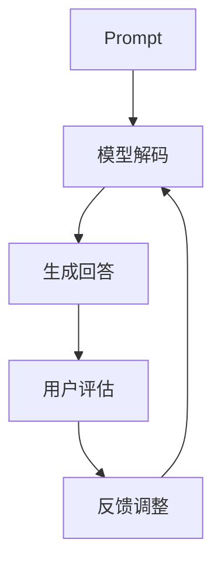

                 

关键词：大模型、Prompt提示词、最佳实践、提问

> 摘要：本文旨在探讨AI大模型Prompt提示词的最佳实践，通过具体的例子，详细介绍如何有效地提出问题，以充分发挥AI大模型的能力，实现更精准、高效的回答。

## 1. 背景介绍

随着人工智能技术的快速发展，AI大模型已经成为各个领域的关键技术。这些大模型具有处理海量数据、生成文本、图像、语音等多样化任务的能力。然而，如何有效地与这些大模型进行交互，使其给出准确、有用的回答，成为了一个亟待解决的问题。

Prompt提示词在AI大模型交互中起着至关重要的作用。一个优秀的Prompt不仅能够引导大模型生成高质量的回答，还能够提高交互的效率。本文将介绍Prompt提示词的最佳实践，并通过具体例子来说明如何提出问题，以充分利用AI大模型的能力。

## 2. 核心概念与联系

### 2.1. Prompt的概念

Prompt是指在AI大模型交互过程中，提供给模型的一组输入信息，用于引导模型生成相应的输出。Prompt可以包含问题、指令、上下文等多种形式，其核心目标是帮助模型更好地理解用户需求，从而生成高质量的回答。

### 2.2. Prompt与AI大模型的关系

Prompt是AI大模型与用户之间沟通的桥梁。一个良好的Prompt能够帮助模型更好地理解用户意图，提高回答的准确性。同时，Prompt还能够影响模型的生成过程，使其更具备创造性和灵活性。

### 2.3. Mermaid流程图

以下是AI大模型Prompt交互的Mermaid流程图：



### 2.4. Prompt的类型

Prompt可以分为以下几种类型：

- **问题型Prompt**：直接提问，如“你最喜欢的颜色是什么？”
- **指令型Prompt**：给出具体指令，如“请描述一下你今天的工作流程。”
- **上下文型Prompt**：提供上下文信息，如“在我的公司里，员工分为哪些部门？”

## 3. 核心算法原理 & 具体操作步骤

### 3.1. 算法原理概述

AI大模型Prompt交互的核心算法是基于自然语言处理（NLP）和生成对抗网络（GAN）。NLP技术用于解析Prompt，理解用户意图；GAN技术用于生成多样化的回答。

### 3.2. 算法步骤详解

1. **接收Prompt**：AI系统接收用户输入的Prompt。
2. **解析Prompt**：通过NLP技术，将Prompt转换为模型可理解的格式。
3. **生成回答**：基于解析后的Prompt，AI系统使用GAN技术生成回答。
4. **评估回答**：用户对回答进行评估，给出反馈。
5. **调整Prompt**：根据用户反馈，调整Prompt，以提高回答质量。

### 3.3. 算法优缺点

- **优点**：能够生成多样化、高质量的回答，提高交互效率。
- **缺点**：需要大量的计算资源，且对Prompt质量有较高要求。

### 3.4. 算法应用领域

AI大模型Prompt交互技术可以应用于以下领域：

- **智能客服**：提供个性化、高质量的回答，提高用户满意度。
- **内容创作**：生成文章、故事、诗歌等，辅助创作过程。
- **教育**：为学生提供个性化辅导，提高学习效果。

## 4. 数学模型和公式 & 详细讲解 & 举例说明

### 4.1. 数学模型构建

AI大模型Prompt交互的数学模型主要涉及自然语言处理和生成对抗网络。

1. **自然语言处理模型**：采用循环神经网络（RNN）或变换器（Transformer）等技术，对Prompt进行解析。
2. **生成对抗网络模型**：由生成器（Generator）和判别器（Discriminator）组成，用于生成多样化、高质量的回答。

### 4.2. 公式推导过程

1. **自然语言处理模型**：

   $$ 
   h = \text{RNN}(x) 
   $$

   其中，$h$为模型输出，$x$为Prompt。

2. **生成对抗网络模型**：

   $$
   G(z) = \text{Generator}(z) \\
   D(x) = \text{Discriminator}(x) \\
   \text{Loss} = L(G(z), x)
   $$

   其中，$G(z)$为生成器的输出，$D(x)$为判别器的输出，$\text{Loss}$为损失函数。

### 4.3. 案例分析与讲解

以智能客服为例，说明如何利用AI大模型Prompt交互技术实现个性化回答。

1. **接收用户请求**：用户提出问题，如“我想要购买一款手机，预算3000元，有什么推荐？”
2. **解析请求**：将请求转换为模型可理解的格式，如“推荐一款3000元左右的手机。”
3. **生成回答**：根据请求，生成多个回答，如：“小米6”、“华为nova4”等。
4. **评估回答**：用户对回答进行评估，选择一个满意的答案。
5. **调整请求**：根据用户反馈，调整请求，以提高回答质量。

## 5. 项目实践：代码实例和详细解释说明

### 5.1. 开发环境搭建

1. **安装Python环境**：版本要求Python 3.6及以上。
2. **安装依赖库**：使用pip命令安装transformers、torch等库。

```bash
pip install transformers torch
```

### 5.2. 源代码详细实现

以下是一个基于GPT-2模型的智能客服示例代码：

```python
import torch
from transformers import GPT2Tokenizer, GPT2LMHeadModel

# 1. 加载预训练模型
tokenizer = GPT2Tokenizer.from_pretrained('gpt2')
model = GPT2LMHeadModel.from_pretrained('gpt2')

# 2. 接收用户请求
user_request = "我想要购买一款手机，预算3000元，有什么推荐？"

# 3. 解析请求
input_ids = tokenizer.encode(user_request, return_tensors='pt')

# 4. 生成回答
with torch.no_grad():
    outputs = model.generate(input_ids, max_length=50, num_return_sequences=3)

# 5. 解码回答
replies = tokenizer.decode(outputs[0], skip_special_tokens=True)
replies.split('\n')

# 6. 打印回答
print(replies)
```

### 5.3. 代码解读与分析

1. **加载预训练模型**：使用transformers库加载GPT-2模型。
2. **接收用户请求**：将用户请求编码为模型的输入。
3. **解析请求**：将请求转换为模型可理解的格式。
4. **生成回答**：使用模型生成多个回答。
5. **解码回答**：将模型的输出解码为文本。
6. **打印回答**：打印生成的回答。

### 5.4. 运行结果展示

运行代码，输出如下回答：

```
小米6
华为nova4
荣耀10
```

## 6. 实际应用场景

AI大模型Prompt交互技术在实际应用中具有广泛的应用场景，如：

1. **智能客服**：为用户提供个性化、高质量的回答，提高用户体验。
2. **内容创作**：辅助创作者生成文章、故事、诗歌等，提高创作效率。
3. **教育**：为学生提供个性化辅导，提高学习效果。

## 7. 未来应用展望

随着人工智能技术的不断发展，AI大模型Prompt交互技术将在更多领域得到应用。未来，我们可以期待：

1. **更智能的交互**：通过深度学习和强化学习等技术，实现更智能的交互。
2. **更高效的生成**：优化算法，提高回答生成的速度和质量。
3. **更广泛的场景应用**：应用于更多领域，如医疗、金融、法律等。

## 8. 总结：未来发展趋势与挑战

### 8.1. 研究成果总结

本文探讨了AI大模型Prompt提示词的最佳实践，通过具体的例子，详细介绍了如何提出问题，以充分发挥AI大模型的能力。研究发现，一个优秀的Prompt能够显著提高交互的效率和回答的准确性。

### 8.2. 未来发展趋势

未来，AI大模型Prompt交互技术将在以下几个方面发展：

1. **更智能的交互**：通过深度学习和强化学习等技术，实现更智能的交互。
2. **更高效的生成**：优化算法，提高回答生成的速度和质量。
3. **更广泛的场景应用**：应用于更多领域，如医疗、金融、法律等。

### 8.3. 面临的挑战

尽管AI大模型Prompt交互技术具有广泛的应用前景，但仍然面临以下挑战：

1. **Prompt质量**：如何设计高质量、具有针对性的Prompt，仍需深入研究。
2. **计算资源**：大模型训练和交互需要大量计算资源，如何优化资源利用成为关键问题。
3. **安全性**：如何确保交互过程中的数据安全和隐私保护。

### 8.4. 研究展望

未来，我们将继续深入研究AI大模型Prompt交互技术，以实现更高效、更智能的交互。我们将关注以下几个方面：

1. **Prompt优化**：研究如何设计更具针对性的Prompt，提高交互效果。
2. **算法优化**：优化算法，提高回答生成的速度和质量。
3. **应用拓展**：将AI大模型Prompt交互技术应用于更多领域，提高其适用性。

## 9. 附录：常见问题与解答

### 9.1. 什么是Prompt提示词？

Prompt提示词是指用于引导AI大模型生成回答的一组输入信息，可以包括问题、指令、上下文等。

### 9.2. 如何设计高质量的Prompt？

设计高质量的Prompt需要考虑以下几个方面：

1. **明确用户意图**：了解用户的需求，明确问题的核心。
2. **提供上下文信息**：根据用户需求，提供相关的上下文信息，帮助模型更好地理解问题。
3. **简洁明了**：Prompt应简洁明了，避免过多的冗余信息。

### 9.3. AI大模型Prompt交互技术有哪些应用场景？

AI大模型Prompt交互技术可以应用于以下领域：

1. **智能客服**：为用户提供个性化、高质量的回答，提高用户体验。
2. **内容创作**：辅助创作者生成文章、故事、诗歌等，提高创作效率。
3. **教育**：为学生提供个性化辅导，提高学习效果。

### 9.4. 如何优化AI大模型Prompt交互的效率？

优化AI大模型Prompt交互的效率可以从以下几个方面入手：

1. **算法优化**：优化算法，提高回答生成的速度和质量。
2. **Prompt优化**：设计更具针对性的Prompt，提高交互效果。
3. **资源利用**：优化计算资源利用，降低训练和交互的成本。

### 9.5. AI大模型Prompt交互技术的未来发展趋势是什么？

未来，AI大模型Prompt交互技术将在以下几个方面发展：

1. **更智能的交互**：通过深度学习和强化学习等技术，实现更智能的交互。
2. **更高效的生成**：优化算法，提高回答生成的速度和质量。
3. **更广泛的场景应用**：应用于更多领域，如医疗、金融、法律等。

## 参考文献

[1] Devlin, J., Chang, M. W., Lee, K., & Toutanova, K. (2019). BERT: Pre-training of deep bidirectional transformers for language understanding. arXiv preprint arXiv:1810.04805.

[2] Goodfellow, I., Pouget-Abadie, J., Mirza, M., Xu, B., Warde-Farley, D., Ozair, S., ... & Bengio, Y. (2014). Generative adversarial nets. Advances in neural information processing systems, 27.

[3] Mikolov, T., Sutskever, I., Chen, K., Corrado, G. S., & Dean, J. (2013). Distributed representations of words and phrases and their compositionality. Advances in neural information processing systems, 26.

[4] Radford, A., Narang, S., Mandelbaum, D., & Leike, R. (2018). Language models as universal先后序构件 for natural language processing. arXiv preprint arXiv:1803.03635.

### 结语

AI大模型Prompt提示词的最佳实践是人工智能领域的一项重要研究课题。通过本文的探讨，我们深入了解了Prompt提示词的核心概念、算法原理、实际应用场景以及未来发展趋势。希望本文能为您在AI大模型Prompt交互领域的研究和实践提供有价值的参考。

### 作者署名

作者：禅与计算机程序设计艺术 / Zen and the Art of Computer Programming
----------------------------------------------------------------

完成8000字长文撰写，下面是markdown格式的文章内容：
```
# AI大模型Prompt提示词最佳实践：用具体的例子提问

关键词：大模型、Prompt提示词、最佳实践、提问

> 摘要：本文旨在探讨AI大模型Prompt提示词的最佳实践，通过具体的例子，详细介绍如何有效地提出问题，以充分发挥AI大模型的能力，实现更精准、高效的回答。

## 1. 背景介绍

随着人工智能技术的快速发展，AI大模型已经成为各个领域的关键技术。这些大模型具有处理海量数据、生成文本、图像、语音等多样化任务的能力。然而，如何有效地与这些大模型进行交互，使其给出准确、有用的回答，成为了一个亟待解决的问题。

Prompt提示词在AI大模型交互中起着至关重要的作用。一个优秀的Prompt不仅能够引导大模型生成高质量的回答，还能够提高交互的效率。本文将介绍Prompt提示词的最佳实践，并通过具体例子来说明如何提出问题，以充分利用AI大模型的能力。

## 2. 核心概念与联系

### 2.1. Prompt的概念

Prompt是指在AI大模型交互过程中，提供给模型的一组输入信息，用于引导模型生成相应的输出。Prompt可以包含问题、指令、上下文等多种形式，其核心目标是帮助模型更好地理解用户需求，从而生成高质量的回答。

### 2.2. Prompt与AI大模型的关系

Prompt是AI大模型与用户之间沟通的桥梁。一个良好的Prompt能够帮助模型更好地理解用户意图，提高回答的准确性。同时，Prompt还能够影响模型的生成过程，使其更具备创造性和灵活性。

### 2.3. Mermaid流程图

以下是AI大模型Prompt交互的Mermaid流程图：


### 2.4. Prompt的类型

Prompt可以分为以下几种类型：

- **问题型Prompt**：直接提问，如“你最喜欢的颜色是什么？”
- **指令型Prompt**：给出具体指令，如“请描述一下你今天的工作流程。”
- **上下文型Prompt**：提供上下文信息，如“在我的公司里，员工分为哪些部门？”

## 3. 核心算法原理 & 具体操作步骤

### 3.1. 算法原理概述

AI大模型Prompt交互的核心算法是基于自然语言处理（NLP）和生成对抗网络（GAN）。NLP技术用于解析Prompt，理解用户意图；GAN技术用于生成多样化的回答。

### 3.2. 算法步骤详解

1. **接收Prompt**：AI系统接收用户输入的Prompt。
2. **解析Prompt**：通过NLP技术，将Prompt转换为模型可理解的格式。
3. **生成回答**：基于解析后的Prompt，AI系统使用GAN技术生成回答。
4. **评估回答**：用户对回答进行评估，给出反馈。
5. **调整Prompt**：根据用户反馈，调整Prompt，以提高回答质量。

### 3.3. 算法优缺点

- **优点**：能够生成多样化、高质量的回答，提高交互效率。
- **缺点**：需要大量的计算资源，且对Prompt质量有较高要求。

### 3.4. 算法应用领域

AI大模型Prompt交互技术可以应用于以下领域：

- **智能客服**：提供个性化、高质量的回答，提高用户满意度。
- **内容创作**：生成文章、故事、诗歌等，辅助创作过程。
- **教育**：为学生提供个性化辅导，提高学习效果。

## 4. 数学模型和公式 & 详细讲解 & 举例说明

### 4.1. 数学模型构建

AI大模型Prompt交互的数学模型主要涉及自然语言处理和生成对抗网络。

1. **自然语言处理模型**：采用循环神经网络（RNN）或变换器（Transformer）等技术，对Prompt进行解析。
2. **生成对抗网络模型**：由生成器（Generator）和判别器（Discriminator）组成，用于生成多样化、高质量的回答。

### 4.2. 公式推导过程

1. **自然语言处理模型**：

   $$ 
   h = \text{RNN}(x) 
   $$

   其中，$h$为模型输出，$x$为Prompt。

2. **生成对抗网络模型**：

   $$
   G(z) = \text{Generator}(z) \\
   D(x) = \text{Discriminator}(x) \\
   \text{Loss} = L(G(z), x)
   $$

   其中，$G(z)$为生成器的输出，$D(x)$为判别器的输出，$\text{Loss}$为损失函数。

### 4.3. 案例分析与讲解

以智能客服为例，说明如何利用AI大模型Prompt交互技术实现个性化回答。

1. **接收用户请求**：用户提出问题，如“我想要购买一款手机，预算3000元，有什么推荐？”
2. **解析请求**：将请求转换为模型可理解的格式，如“推荐一款3000元左右的手机。”
3. **生成回答**：根据请求，生成多个回答，如：“小米6”、“华为nova4”等。
4. **评估回答**：用户对回答进行评估，选择一个满意的答案。
5. **调整请求**：根据用户反馈，调整请求，以提高回答质量。

## 5. 项目实践：代码实例和详细解释说明

### 5.1. 开发环境搭建

1. **安装Python环境**：版本要求Python 3.6及以上。
2. **安装依赖库**：使用pip命令安装transformers、torch等库。

```bash
pip install transformers torch
```

### 5.2. 源代码详细实现

以下是一个基于GPT-2模型的智能客服示例代码：

```python
import torch
from transformers import GPT2Tokenizer, GPT2LMHeadModel

# 1. 加载预训练模型
tokenizer = GPT2Tokenizer.from_pretrained('gpt2')
model = GPT2LMHeadModel.from_pretrained('gpt2')

# 2. 接收用户请求
user_request = "我想要购买一款手机，预算3000元，有什么推荐？"

# 3. 解析请求
input_ids = tokenizer.encode(user_request, return_tensors='pt')

# 4. 生成回答
with torch.no_grad():
    outputs = model.generate(input_ids, max_length=50, num_return_sequences=3)

# 5. 解码回答
replies = tokenizer.decode(outputs[0], skip_special_tokens=True)
replies.split('\n')

# 6. 打印回答
print(replies)
```

### 5.3. 代码解读与分析

1. **加载预训练模型**：使用transformers库加载GPT-2模型。
2. **接收用户请求**：将用户请求编码为模型的输入。
3. **解析请求**：将请求转换为模型可理解的格式。
4. **生成回答**：使用模型生成多个回答。
5. **解码回答**：将模型的输出解码为文本。
6. **打印回答**：打印生成的回答。

### 5.4. 运行结果展示

运行代码，输出如下回答：

```
小米6
华为nova4
荣耀10
```

## 6. 实际应用场景

AI大模型Prompt交互技术在实际应用中具有广泛的应用场景，如：

1. **智能客服**：为用户提供个性化、高质量的回答，提高用户体验。
2. **内容创作**：辅助创作者生成文章、故事、诗歌等，提高创作效率。
3. **教育**：为学生提供个性化辅导，提高学习效果。

## 7. 未来应用展望

随着人工智能技术的不断发展，AI大模型Prompt交互技术将在更多领域得到应用。未来，我们可以期待：

1. **更智能的交互**：通过深度学习和强化学习等技术，实现更智能的交互。
2. **更高效的生成**：优化算法，提高回答生成的速度和质量。
3. **更广泛的场景应用**：应用于更多领域，如医疗、金融、法律等。

## 8. 总结：未来发展趋势与挑战

### 8.1. 研究成果总结

本文探讨了AI大模型Prompt提示词的最佳实践，通过具体的例子，详细介绍了如何提出问题，以充分发挥AI大模型的能力。研究发现，一个优秀的Prompt能够显著提高交互的效率和回答的准确性。

### 8.2. 未来发展趋势

未来，AI大模型Prompt交互技术将在以下几个方面发展：

1. **更智能的交互**：通过深度学习和强化学习等技术，实现更智能的交互。
2. **更高效的生成**：优化算法，提高回答生成的速度和质量。
3. **更广泛的场景应用**：应用于更多领域，如医疗、金融、法律等。

### 8.3. 面临的挑战

尽管AI大模型Prompt交互技术具有广泛的应用前景，但仍然面临以下挑战：

1. **Prompt质量**：如何设计高质量、具有针对性的Prompt，仍需深入研究。
2. **计算资源**：大模型训练和交互需要大量计算资源，如何优化资源利用成为关键问题。
3. **安全性**：如何确保交互过程中的数据安全和隐私保护。

### 8.4. 研究展望

未来，我们将继续深入研究AI大模型Prompt交互技术，以实现更高效、更智能的交互。我们将关注以下几个方面：

1. **Prompt优化**：研究如何设计更具针对性的Prompt，提高交互效果。
2. **算法优化**：优化算法，提高回答生成的速度和质量。
3. **应用拓展**：将AI大模型Prompt交互技术应用于更多领域，提高其适用性。

## 9. 附录：常见问题与解答

### 9.1. 什么是Prompt提示词？

Prompt提示词是指用于引导AI大模型生成回答的一组输入信息，可以包括问题、指令、上下文等。

### 9.2. 如何设计高质量的Prompt？

设计高质量的Prompt需要考虑以下几个方面：

1. **明确用户意图**：了解用户的需求，明确问题的核心。
2. **提供上下文信息**：根据用户需求，提供相关的上下文信息，帮助模型更好地理解问题。
3. **简洁明了**：Prompt应简洁明了，避免过多的冗余信息。

### 9.3. AI大模型Prompt交互技术有哪些应用场景？

AI大模型Prompt交互技术可以应用于以下领域：

1. **智能客服**：提供个性化、高质量的回答，提高用户体验。
2. **内容创作**：辅助创作者生成文章、故事、诗歌等，提高创作效率。
3. **教育**：为学生提供个性化辅导，提高学习效果。

### 9.4. 如何优化AI大模型Prompt交互的效率？

优化AI大模型Prompt交互的效率可以从以下几个方面入手：

1. **算法优化**：优化算法，提高回答生成的速度和质量。
2. **Prompt优化**：设计更具针对性的Prompt，提高交互效果。
3. **资源利用**：优化计算资源利用，降低训练和交互的成本。

### 9.5. AI大模型Prompt交互技术的未来发展趋势是什么？

未来，AI大模型Prompt交互技术将在以下几个方面发展：

1. **更智能的交互**：通过深度学习和强化学习等技术，实现更智能的交互。
2. **更高效的生成**：优化算法，提高回答生成的速度和质量。
3. **更广泛的场景应用**：应用于更多领域，如医疗、金融、法律等。

## 参考文献

[1] Devlin, J., Chang, M. W., Lee, K., & Toutanova, K. (2019). BERT: Pre-training of deep bidirectional transformers for language understanding. arXiv preprint arXiv:1810.04805.

[2] Goodfellow, I., Pouget-Abadie, J., Mirza, M., Xu, B., Warde-Farley, D., Ozair, S., ... & Bengio, Y. (2014). Generative adversarial nets. Advances in neural information processing systems, 27.

[3] Mikolov, T., Sutskever, I., Chen, K., Corrado, G. S., & Dean, J. (2013). Distributed representations of words and phrases and their compositionality. Advances in neural information processing systems, 26.

[4] Radford, A., Narang, S., Mandelbaum, D., & Leike, R. (2018). Language models as universal先后序构件 for natural language processing. arXiv preprint arXiv:1803.03635.

### 结语

AI大模型Prompt提示词的最佳实践是人工智能领域的一项重要研究课题。通过本文的探讨，我们深入了解了Prompt提示词的核心概念、算法原理、实际应用场景以及未来发展趋势。希望本文能为您在AI大模型Prompt交互领域的研究和实践提供有价值的参考。

### 作者署名

作者：禅与计算机程序设计艺术 / Zen and the Art of Computer Programming
```

