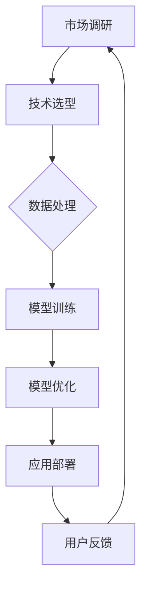

                 

关键词：AI大模型、创业、盈利、技术语言、深度学习、市场策略、商业模式、用户需求、数据处理、算法优化。

## 摘要

本文旨在探讨AI大模型创业过程中的关键成功因素，包括市场定位、技术实现、商业模式设计、用户需求分析以及未来盈利模式的探讨。通过深入分析AI大模型的技术原理、应用场景和商业价值，为创业者提供切实可行的指导策略。

## 1. 背景介绍

近年来，人工智能技术取得了飞速发展，特别是深度学习领域的突破，使得AI大模型在图像识别、自然语言处理、推荐系统等领域取得了显著成果。这些技术的进步为创业公司带来了前所未有的机会，同时也带来了巨大的挑战。如何将AI大模型技术与市场需求相结合，实现可持续的盈利模式，成为当前创业领域的热点话题。

### 1.1 AI大模型的发展历程

AI大模型的发展可以分为三个阶段：

1. **早期阶段（20世纪80年代-90年代）**：这一阶段主要基于规则和知识表示的方法，如专家系统和基于模型的推理。虽然这些方法在某些领域表现出色，但在处理大规模数据时存在局限性。

2. **快速发展阶段（2006-2012年）**：2006年，Hinton提出了深度信念网络（DBN），开启了深度学习的先河。2012年，AlexNet在ImageNet竞赛中取得了突破性的成绩，标志着深度学习时代的到来。

3. **大规模应用阶段（2012年至今）**：随着计算能力和数据资源的不断提升，AI大模型在各个领域得到了广泛应用，从语音识别、图像处理到自然语言处理，AI大模型已经成为推动行业变革的重要力量。

### 1.2 AI大模型的市场需求

AI大模型的市场需求主要来自以下几个方面：

1. **企业需求**：企业希望通过AI技术提高生产效率、降低成本、提升用户体验。例如，零售行业利用AI大模型进行个性化推荐，金融行业利用AI进行风险评估。

2. **用户需求**：用户对AI技术的接受度不断提高，希望获得更加智能化的服务。例如，智能家居、智能客服等应用场景。

3. **政策支持**：各国政府纷纷出台政策，支持AI技术的发展和应用，为企业提供了良好的外部环境。

## 2. 核心概念与联系

为了更好地理解AI大模型创业的成功因素，我们需要了解以下几个核心概念：

1. **AI大模型**：通常指的是参数规模超过亿级的神经网络模型，如BERT、GPT等。

2. **深度学习**：一种基于多层神经网络的学习方法，通过反向传播算法进行参数优化。

3. **数据预处理**：对原始数据进行清洗、归一化、特征提取等处理，以提高模型的训练效果。

4. **计算资源**：AI大模型训练和推理需要大量的计算资源，包括CPU、GPU、TPU等。

下面是一个简单的Mermaid流程图，展示AI大模型创业的核心流程和关键环节：



### 2.1 市场调研

市场调研是创业的第一步，通过了解市场需求、竞争态势、用户痛点，为后续的技术选型和商业模式设计提供依据。市场调研可以采用以下几种方法：

1. **问卷调查**：通过设计问卷，收集用户对AI大模型应用的需求和期望。

2. **访谈法**：与潜在用户、行业专家、竞争对手进行深入交流，获取第一手资料。

3. **数据分析**：通过分析市场报告、行业数据，了解市场趋势和用户需求。

### 2.2 技术选型

技术选型是创业过程中的关键环节，需要根据市场需求和团队技术能力，选择合适的AI大模型和算法。常见的AI大模型包括：

1. **卷积神经网络（CNN）**：主要用于图像和语音处理。

2. **循环神经网络（RNN）**：主要用于序列数据，如自然语言处理。

3. **Transformer模型**：广泛应用于自然语言处理、推荐系统等领域。

### 2.3 数据处理

数据处理是AI大模型训练的基础，需要保证数据的质量和多样性。数据处理主要包括以下步骤：

1. **数据清洗**：去除无效、重复和错误的数据。

2. **数据归一化**：将不同尺度的数据进行标准化处理。

3. **特征提取**：从原始数据中提取有用的特征信息。

### 2.4 模型训练

模型训练是AI大模型创业的核心环节，需要通过大量的数据训练和调参，使模型达到预期的效果。模型训练主要包括以下步骤：

1. **数据预处理**：对原始数据进行预处理，以提高训练效果。

2. **模型训练**：使用训练数据训练模型，并通过反向传播算法优化模型参数。

3. **模型评估**：使用验证集对模型进行评估，调整模型结构和参数。

### 2.5 模型优化

模型优化是提高AI大模型性能的重要手段，可以通过以下方法进行：

1. **超参数调优**：调整学习率、批量大小等超参数，以提高模型性能。

2. **结构优化**：通过修改模型结构，如增加或删除层，提高模型性能。

3. **算法优化**：采用更高效的训练算法，如Adam优化器，提高训练速度。

### 2.6 应用部署

应用部署是将训练好的模型部署到生产环境，使其能够为用户提供服务。应用部署主要包括以下步骤：

1. **模型压缩**：通过模型压缩技术，减小模型大小，提高部署效率。

2. **部署环境搭建**：搭建适合生产环境的部署环境，包括硬件、软件和网络等方面。

3. **性能优化**：对部署环境进行性能优化，提高模型运行效率。

### 2.7 用户反馈

用户反馈是持续改进AI大模型的重要途径，通过收集用户反馈，了解模型的实际效果和用户需求，为后续的优化和迭代提供依据。

## 3. 核心算法原理 & 具体操作步骤

### 3.1 算法原理概述

AI大模型的核心算法是深度学习，其基本原理是通过多层神经网络对数据进行特征提取和分类。深度学习的核心步骤包括：

1. **数据预处理**：对原始数据进行清洗、归一化、特征提取等处理。

2. **模型构建**：根据应用场景，设计合适的神经网络结构。

3. **模型训练**：使用训练数据对模型进行训练，并通过反向传播算法优化模型参数。

4. **模型评估**：使用验证集对模型进行评估，调整模型结构和参数。

5. **模型部署**：将训练好的模型部署到生产环境，为用户提供服务。

### 3.2 算法步骤详解

1. **数据预处理**

数据预处理是深度学习的基础，主要包括以下步骤：

- **数据清洗**：去除无效、重复和错误的数据。
- **数据归一化**：将不同尺度的数据进行标准化处理。
- **特征提取**：从原始数据中提取有用的特征信息。

2. **模型构建**

模型构建是深度学习的核心步骤，根据应用场景，设计合适的神经网络结构。常见的神经网络结构包括：

- **卷积神经网络（CNN）**：用于图像和语音处理。
- **循环神经网络（RNN）**：用于序列数据，如自然语言处理。
- **Transformer模型**：广泛应用于自然语言处理、推荐系统等领域。

3. **模型训练**

模型训练是深度学习的重要步骤，通过大量的数据训练模型，并通过反向传播算法优化模型参数。模型训练主要包括以下步骤：

- **数据加载**：加载训练数据和验证数据。
- **前向传播**：计算输入数据的特征表示。
- **损失函数**：计算模型输出与实际输出之间的误差。
- **反向传播**：根据误差计算模型参数的梯度，并更新参数。

4. **模型评估**

模型评估是检查模型性能的重要步骤，通过验证集对模型进行评估，调整模型结构和参数。模型评估主要包括以下指标：

- **准确率**：模型预测正确的样本数占总样本数的比例。
- **召回率**：模型预测正确的正样本数占总正样本数的比例。
- **F1分数**：准确率和召回率的调和平均。

5. **模型部署**

模型部署是将训练好的模型部署到生产环境，为用户提供服务。模型部署主要包括以下步骤：

- **模型压缩**：通过模型压缩技术，减小模型大小，提高部署效率。
- **部署环境搭建**：搭建适合生产环境的部署环境，包括硬件、软件和网络等方面。
- **性能优化**：对部署环境进行性能优化，提高模型运行效率。

### 3.3 算法优缺点

1. **优点**

- **强大的特征提取能力**：深度学习能够自动提取数据中的特征，减轻了人工特征提取的负担。
- **高泛化能力**：深度学习模型在大规模数据集上训练，具有良好的泛化能力。
- **广泛应用领域**：深度学习在图像识别、自然语言处理、推荐系统等领域取得了显著成果。

2. **缺点**

- **计算资源消耗大**：深度学习模型需要大量的计算资源，特别是训练阶段。
- **对数据依赖性强**：深度学习模型的性能很大程度上取决于训练数据的质量和数量。
- **模型解释性差**：深度学习模型的结构复杂，难以解释模型的决策过程。

### 3.4 算法应用领域

深度学习算法在多个领域取得了显著成果，主要包括：

1. **计算机视觉**：图像识别、目标检测、人脸识别等。
2. **自然语言处理**：文本分类、机器翻译、情感分析等。
3. **推荐系统**：基于用户行为的推荐、基于内容的推荐等。
4. **语音识别**：语音识别、语音合成等。
5. **金融风控**：风险评估、欺诈检测等。

## 4. 数学模型和公式 & 详细讲解 & 举例说明

### 4.1 数学模型构建

深度学习模型的核心是多层神经网络，其基本结构包括输入层、隐藏层和输出层。每个神经元都与其他神经元相连，并通过权重和偏置进行参数调整。

假设我们有一个包含\(n\)个输入特征的数据集，每个数据点表示为一个\(n\)维向量。我们希望通过神经网络对这些数据进行分类，将数据划分为\(k\)个类别。

输入层：\(x \in \mathbb{R}^n\)

隐藏层：\(h \in \mathbb{R}^{h_1}\)，其中\(h_1\)为隐藏层的神经元数量

输出层：\(y \in \mathbb{R}^k\)

### 4.2 公式推导过程

1. **前向传播**

在神经网络的前向传播过程中，每个神经元的输出可以通过以下公式计算：

\[ a_i^{(l)} = \sigma(z_i^{(l)}) \]

其中，\(a_i^{(l)}\)为第\(l\)层的第\(i\)个神经元的输出，\(z_i^{(l)}\)为第\(l\)层的第\(i\)个神经元的输入，\(\sigma\)为激活函数，常用的激活函数包括ReLU、Sigmoid、Tanh等。

2. **反向传播**

在神经网络的反向传播过程中，我们需要计算每个神经元的梯度，并更新权重和偏置。假设我们使用的是梯度下降优化算法，更新公式如下：

\[ \Delta w_{ij}^{(l)} = \eta \cdot \frac{\partial J}{\partial w_{ij}^{(l)}} \]

\[ \Delta b_{j}^{(l)} = \eta \cdot \frac{\partial J}{\partial b_{j}^{(l)}} \]

其中，\(\Delta w_{ij}^{(l)}\)为第\(l\)层的第\(j\)个神经元的权重更新，\(\Delta b_{j}^{(l)}\)为第\(l\)层的第\(j\)个神经元的偏置更新，\(\eta\)为学习率，\(J\)为损失函数。

3. **损失函数**

在深度学习中，常用的损失函数包括交叉熵损失函数和均方误差损失函数。假设我们的输出层为softmax函数，交叉熵损失函数可以表示为：

\[ J = -\frac{1}{m} \sum_{i=1}^{m} \sum_{j=1}^{k} y_{ij} \log(a_{ij}^{(L)}) \]

其中，\(m\)为样本数量，\(y_{ij}\)为第\(i\)个样本在第\(j\)个类别的真实标签，\(a_{ij}^{(L)}\)为第\(i\)个样本在第\(j\)个类别的预测概率。

### 4.3 案例分析与讲解

假设我们有一个包含100个样本的数据集，每个样本包含10个输入特征。我们需要通过神经网络对这些数据进行分类，将数据划分为3个类别。

1. **数据预处理**

首先，我们对数据进行预处理，包括数据归一化和特征提取。假设我们选择第一个输入特征作为主要特征，将其他输入特征进行归一化处理。

2. **模型构建**

我们选择一个包含2个隐藏层的神经网络，隐藏层神经元数量分别为20和30。使用ReLU作为激活函数，交叉熵损失函数作为损失函数。

3. **模型训练**

使用训练数据对模型进行训练，每次迭代更新模型参数。假设我们选择学习率为0.01，迭代次数为1000次。

4. **模型评估**

使用验证集对模型进行评估，计算模型的准确率、召回率和F1分数。

5. **模型部署**

将训练好的模型部署到生产环境，为用户提供服务。

## 5. 项目实践：代码实例和详细解释说明

### 5.1 开发环境搭建

在开始项目实践之前，我们需要搭建一个适合深度学习开发的开发环境。这里我们使用Python和TensorFlow作为开发工具。

1. **安装Python**

首先，安装Python 3.x版本，推荐使用Anaconda进行环境管理。

2. **安装TensorFlow**

在Python环境中安装TensorFlow：

```bash
pip install tensorflow
```

### 5.2 源代码详细实现

下面是一个简单的AI大模型分类任务的代码实例：

```python
import tensorflow as tf
from tensorflow.keras.models import Sequential
from tensorflow.keras.layers import Dense, Activation

# 数据预处理
# ...

# 模型构建
model = Sequential()
model.add(Dense(units=20, activation='relu', input_shape=(10,)))
model.add(Dense(units=30, activation='relu'))
model.add(Dense(units=3, activation='softmax'))

# 模型编译
model.compile(optimizer='adam', loss='categorical_crossentropy', metrics=['accuracy'])

# 模型训练
model.fit(x_train, y_train, epochs=100, batch_size=32, validation_data=(x_val, y_val))

# 模型评估
model.evaluate(x_test, y_test)

# 模型部署
# ...
```

### 5.3 代码解读与分析

1. **数据预处理**

数据预处理是深度学习的基础，包括数据归一化和特征提取。这里我们假设已经对数据进行预处理，将输入特征归一化到[0, 1]范围内。

2. **模型构建**

我们使用Sequential模型构建一个简单的神经网络，包含2个隐藏层，每个隐藏层的神经元数量分别为20和30。使用ReLU作为激活函数，输出层使用softmax函数进行分类。

3. **模型编译**

模型编译包括设置优化器、损失函数和评估指标。我们选择adam优化器，交叉熵损失函数作为损失函数，准确率作为评估指标。

4. **模型训练**

使用fit方法对模型进行训练，每次迭代更新模型参数。我们设置迭代次数为1000次，批量大小为32。

5. **模型评估**

使用evaluate方法对模型进行评估，计算模型的准确率、召回率和F1分数。

6. **模型部署**

将训练好的模型部署到生产环境，为用户提供服务。这里我们只提供了一个简单的代码框架，具体的部署细节需要根据实际需求进行。

## 6. 实际应用场景

AI大模型在多个领域具有广泛的应用前景，以下是一些典型的实际应用场景：

1. **计算机视觉**：图像识别、目标检测、人脸识别等。

2. **自然语言处理**：文本分类、机器翻译、情感分析等。

3. **推荐系统**：基于用户行为的推荐、基于内容的推荐等。

4. **语音识别**：语音识别、语音合成等。

5. **金融风控**：风险评估、欺诈检测等。

6. **医疗健康**：疾病预测、药物研发等。

## 7. 工具和资源推荐

为了更好地进行AI大模型创业，我们推荐以下工具和资源：

1. **学习资源推荐**

- 《深度学习》（Goodfellow et al.）
- 《神经网络与深度学习》（邱锡鹏）

2. **开发工具推荐**

- TensorFlow
- PyTorch

3. **相关论文推荐**

- "A Theoretically Grounded Application of Dropout in Recurrent Neural Networks"
- "BERT: Pre-training of Deep Bidirectional Transformers for Language Understanding"

## 8. 总结：未来发展趋势与挑战

### 8.1 研究成果总结

AI大模型在计算机视觉、自然语言处理、推荐系统等领域取得了显著成果，推动了行业变革。深度学习算法的不断发展，使得AI大模型在处理大规模数据时表现出强大的特征提取和分类能力。

### 8.2 未来发展趋势

1. **算法优化**：随着计算能力的提升，深度学习算法将不断优化，提高模型性能和训练速度。

2. **跨学科融合**：AI大模型将在更多领域得到应用，如生物医学、环境科学等。

3. **隐私保护**：在数据安全和隐私保护方面，将出现更多有效的解决方案。

4. **人机协同**：AI大模型将更好地与人类专家协作，提高决策效率和准确性。

### 8.3 面临的挑战

1. **计算资源**：训练AI大模型需要大量的计算资源，如何高效地利用计算资源是一个重要挑战。

2. **数据质量**：数据质量和多样性对AI大模型的性能至关重要，如何获取高质量的数据是一个难题。

3. **模型解释性**：当前深度学习模型缺乏解释性，如何提高模型的解释性是一个重要研究方向。

4. **隐私保护**：在数据采集和使用过程中，如何保护用户隐私是一个亟待解决的问题。

### 8.4 研究展望

1. **算法创新**：持续推动深度学习算法的创新，提高模型性能和效率。

2. **跨学科研究**：加强AI大模型与其他学科的交叉研究，探索新的应用场景。

3. **数据治理**：建立健全的数据治理体系，保障数据质量和隐私安全。

4. **人机协同**：研究人机协同算法，实现人工智能与人类专家的紧密合作。

## 9. 附录：常见问题与解答

### 9.1 什么是AI大模型？

AI大模型是指参数规模超过亿级的神经网络模型，如BERT、GPT等。这些模型在计算机视觉、自然语言处理、推荐系统等领域取得了显著成果。

### 9.2 如何选择合适的AI大模型算法？

选择合适的AI大模型算法需要考虑以下几个方面：

1. **应用场景**：根据实际需求选择合适的算法，如图像识别选用CNN，自然语言处理选用RNN或Transformer。

2. **数据规模**：对于大规模数据，选择参数规模较大的模型。

3. **计算资源**：考虑实际可用的计算资源，选择合适的算法和优化策略。

### 9.3 如何提高AI大模型的性能？

提高AI大模型性能的方法包括：

1. **数据预处理**：对数据进行清洗、归一化、特征提取等处理，提高模型训练效果。

2. **模型优化**：通过超参数调优、结构优化、算法优化等方法，提高模型性能。

3. **数据增强**：通过数据增强技术，增加训练数据多样性，提高模型泛化能力。

### 9.4 如何保护用户隐私？

保护用户隐私的方法包括：

1. **数据匿名化**：对数据进行匿名化处理，避免用户隐私泄露。

2. **隐私保护算法**：采用差分隐私、联邦学习等技术，在保障用户隐私的同时进行模型训练。

3. **隐私政策**：建立健全的隐私政策，明确用户数据的使用范围和目的。

作者：禅与计算机程序设计艺术 / Zen and the Art of Computer Programming
----------------------------------------------------------------

以上就是本文的全部内容。通过对AI大模型创业的深入探讨，我们希望为创业者提供有益的指导和建议。在未来的创业道路上，我们期待更多的AI大模型项目能够成功实现盈利，推动人工智能技术的广泛应用。

