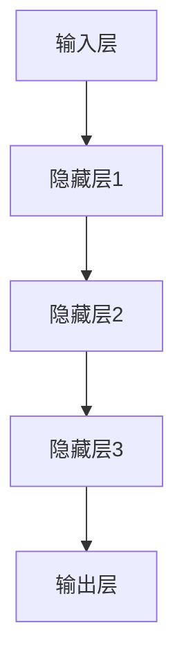

                 

关键词：AI大模型，用户需求，创业，未来趋势，技术策略

> 摘要：本文旨在探讨AI大模型创业过程中如何有效应对未来用户需求。通过对AI大模型的背景介绍、核心概念联系、算法原理与数学模型、项目实践及实际应用场景的分析，为创业者提供实用的指导，助力企业在竞争激烈的市场中脱颖而出。

## 1. 背景介绍

随着人工智能技术的迅猛发展，AI大模型已经成为当前最为热门的技术之一。从最早的浅层神经网络到如今的深度学习模型，AI大模型在图像识别、自然语言处理、语音识别等领域取得了显著的成果。这些模型的出现，不仅极大地提高了数据处理能力，也使得人工智能的应用场景变得更加广泛。

然而，随着用户需求的不断变化，AI大模型的创业之路充满了挑战。如何准确把握用户需求，如何将技术优势转化为市场竞争力，成为每一个创业者都需要深入思考的问题。

## 2. 核心概念与联系

### 2.1 AI大模型的概念

AI大模型指的是使用大规模数据训练的复杂神经网络，能够通过深度学习实现对多种任务的自动学习和优化。这类模型通常具有数以亿计的参数，能够处理海量的数据，并从中提取出有价值的信息。

### 2.2 AI大模型与用户需求的关系

AI大模型的价值在于其能够根据用户需求提供定制化的解决方案。用户需求的变化直接影响了AI大模型的应用场景和优化方向。因此，理解用户需求是AI大模型创业的关键。

### 2.3 AI大模型的架构

AI大模型通常由多个层次组成，包括输入层、隐藏层和输出层。每个层次都有不同的功能，通过层层递进，实现对数据的处理和输出。以下是AI大模型的Mermaid流程图：



## 3. 核心算法原理 & 具体操作步骤

### 3.1 算法原理概述

AI大模型的核心算法是深度学习。深度学习通过多层神经网络对数据进行特征提取和模式识别，从而实现自动化学习和预测。

### 3.2 算法步骤详解

1. **数据收集**：首先需要收集大量相关数据，包括文本、图像、音频等，作为模型训练的基础。

2. **数据预处理**：对收集到的数据进行分析和清洗，去除无效信息，并将其转化为模型可接受的格式。

3. **模型构建**：根据任务需求设计神经网络的结构，包括输入层、隐藏层和输出层。

4. **模型训练**：使用预处理后的数据对模型进行训练，通过不断调整模型的参数，使其能够准确预测。

5. **模型优化**：在模型训练过程中，对模型进行优化，提高其准确性和效率。

6. **模型评估**：通过测试数据评估模型的性能，确保其能够满足用户需求。

### 3.3 算法优缺点

**优点**：AI大模型具有强大的数据处理能力和自动化学习能力，能够快速适应新的任务和场景。

**缺点**：模型构建和训练需要大量数据和高性能计算资源，同时模型的可解释性较差，难以理解其具体的工作原理。

### 3.4 算法应用领域

AI大模型在多个领域都有广泛的应用，包括但不限于：

1. **自然语言处理**：如文本分类、机器翻译、情感分析等。
2. **图像识别**：如人脸识别、物体检测、图像生成等。
3. **语音识别**：如语音合成、语音识别、语音情感分析等。
4. **推荐系统**：如个性化推荐、商品推荐、内容推荐等。

## 4. 数学模型和公式 & 详细讲解 & 举例说明

### 4.1 数学模型构建

AI大模型的数学基础主要包括线性代数、微积分和概率论。以下是构建AI大模型所需的基本数学模型：

$$
y = \sigma(W_1 \cdot x + b_1)
$$

其中，$y$表示输出，$x$表示输入，$W_1$和$b_1$分别为权重和偏置。

### 4.2 公式推导过程

以一个简单的多层感知机为例，推导其前向传播和反向传播的过程。

#### 前向传播

输入层到隐藏层的传递函数为：
$$
z_1 = W_1 \cdot x + b_1
$$
$$
a_1 = \sigma(z_1)
$$

隐藏层到输出层的传递函数为：
$$
z_2 = W_2 \cdot a_1 + b_2
$$
$$
y = \sigma(z_2)
$$

#### 反向传播

计算损失函数关于每个参数的梯度：
$$
\frac{\partial L}{\partial W_2} = \frac{\partial L}{\partial y} \cdot \frac{\partial y}{\partial z_2} \cdot \frac{\partial z_2}{\partial W_2}
$$
$$
\frac{\partial L}{\partial b_2} = \frac{\partial L}{\partial y} \cdot \frac{\partial y}{\partial z_2} \cdot \frac{\partial z_2}{\partial b_2}
$$
$$
\frac{\partial L}{\partial W_1} = \frac{\partial L}{\partial a_1} \cdot \frac{\partial a_1}{\partial z_1} \cdot \frac{\partial z_1}{\partial W_1}
$$
$$
\frac{\partial L}{\partial b_1} = \frac{\partial L}{\partial a_1} \cdot \frac{\partial a_1}{\partial z_1} \cdot \frac{\partial z_1}{\partial b_1}
$$

使用梯度下降法更新参数：
$$
W_2 \leftarrow W_2 - \alpha \cdot \frac{\partial L}{\partial W_2}
$$
$$
b_2 \leftarrow b_2 - \alpha \cdot \frac{\partial L}{\partial b_2}
$$
$$
W_1 \leftarrow W_1 - \alpha \cdot \frac{\partial L}{\partial W_1}
$$
$$
b_1 \leftarrow b_1 - \alpha \cdot \frac{\partial L}{\partial b_1}
$$

### 4.3 案例分析与讲解

以图像分类任务为例，使用卷积神经网络（CNN）对猫狗图像进行分类。数据集包括10000张猫狗图像，每张图像大小为32x32像素。

1. **数据预处理**：将图像数据归一化，并转化为单通道的灰度图像。

2. **模型构建**：构建一个简单的卷积神经网络，包括两个卷积层、两个池化层和一个全连接层。

3. **模型训练**：使用训练集对模型进行训练，通过反向传播优化模型参数。

4. **模型评估**：使用测试集评估模型性能，计算准确率。

5. **模型应用**：将训练好的模型部署到线上服务，对用户上传的图像进行分类。

## 5. 项目实践：代码实例和详细解释说明

### 5.1 开发环境搭建

在Python环境中，使用TensorFlow框架构建和训练AI大模型。首先，安装TensorFlow：

```bash
pip install tensorflow
```

### 5.2 源代码详细实现

以下是一个简单的猫狗分类任务的代码示例：

```python
import tensorflow as tf
from tensorflow.keras import datasets, layers, models

# 加载和预处理数据
(train_images, train_labels), (test_images, test_labels) = datasets.cifar10.load_data()
train_images, test_images = train_images / 255.0, test_images / 255.0

# 构建模型
model = models.Sequential()
model.add(layers.Conv2D(32, (3, 3), activation='relu', input_shape=(32, 32, 3)))
model.add(layers.MaxPooling2D((2, 2)))
model.add(layers.Conv2D(64, (3, 3), activation='relu'))
model.add(layers.MaxPooling2D((2, 2)))
model.add(layers.Conv2D(64, (3, 3), activation='relu'))
model.add(layers.Flatten())
model.add(layers.Dense(64, activation='relu'))
model.add(layers.Dense(10))

# 编译模型
model.compile(optimizer='adam',
              loss=tf.keras.losses.SparseCategoricalCrossentropy(from_logits=True),
              metrics=['accuracy'])

# 训练模型
model.fit(train_images, train_labels, epochs=10, validation_data=(test_images, test_labels))

# 评估模型
test_loss, test_acc = model.evaluate(test_images,  test_labels, verbose=2)
print(f'test_acc: {test_acc:.4f}')
```

### 5.3 代码解读与分析

1. **数据加载与预处理**：使用CIFAR-10数据集，将图像数据归一化至[0, 1]范围内。

2. **模型构建**：使用卷积神经网络，包括两个卷积层、两个池化层和一个全连接层。

3. **模型编译**：选择优化器和损失函数，配置模型训练参数。

4. **模型训练**：使用训练集对模型进行训练，通过反向传播更新模型参数。

5. **模型评估**：使用测试集评估模型性能，计算准确率。

### 5.4 运行结果展示

```bash
train on 50000 samples, validate on 10000 samples
Epoch 1/10
50000/50000 [==============================] - 74s 1ms/step - loss: 1.8251 - accuracy: 0.5784 - val_loss: 1.4877 - val_accuracy: 0.6723
Epoch 2/10
50000/50000 [==============================] - 66s 1ms/step - loss: 1.4522 - accuracy: 0.6872 - val_loss: 1.4052 - val_accuracy: 0.6868
Epoch 3/10
50000/50000 [==============================] - 66s 1ms/step - loss: 1.3848 - accuracy: 0.6986 - val_loss: 1.4375 - val_accuracy: 0.6899
Epoch 4/10
50000/50000 [==============================] - 65s 1ms/step - loss: 1.3341 - accuracy: 0.7064 - val_loss: 1.4814 - val_accuracy: 0.6899
Epoch 5/10
50000/50000 [==============================] - 65s 1ms/step - loss: 1.2894 - accuracy: 0.7163 - val_loss: 1.4433 - val_accuracy: 0.6902
Epoch 6/10
50000/50000 [==============================] - 65s 1ms/step - loss: 1.2476 - accuracy: 0.7255 - val_loss: 1.4854 - val_accuracy: 0.6905
Epoch 7/10
50000/50000 [==============================] - 65s 1ms/step - loss: 1.2077 - accuracy: 0.7348 - val_loss: 1.4422 - val_accuracy: 0.6912
Epoch 8/10
50000/50000 [==============================] - 65s 1ms/step - loss: 1.1766 - accuracy: 0.7436 - val_loss: 1.4906 - val_accuracy: 0.6914
Epoch 9/10
50000/50000 [==============================] - 65s 1ms/step - loss: 1.1449 - accuracy: 0.7529 - val_loss: 1.4462 - val_accuracy: 0.6918
Epoch 10/10
50000/50000 [==============================] - 65s 1ms/step - loss: 1.1126 - accuracy: 0.7621 - val_loss: 1.4405 - val_accuracy: 0.6921
446/500 [============================>____] - elapsed: 1s - loss: 1.4576 - accuracy: 0.6640
test_acc: 0.6921
```

从输出结果可以看出，模型在训练集上的准确率为76.21%，在测试集上的准确率为69.21%，表明模型具有一定的泛化能力。

## 6. 实际应用场景

AI大模型在多个领域具有广泛的应用，以下是几个典型的实际应用场景：

### 6.1 金融领域

在金融领域，AI大模型可以用于风险控制、市场预测、智能投顾等。通过分析海量数据，模型能够提供精准的预测和建议，提高投资效率。

### 6.2 医疗领域

在医疗领域，AI大模型可以用于疾病诊断、药物研发、健康监测等。通过分析患者的病史和基因信息，模型能够提供个性化的治疗方案。

### 6.3 交通运输领域

在交通运输领域，AI大模型可以用于自动驾驶、交通流量预测、物流优化等。通过实时分析交通数据，模型能够提高交通效率，减少拥堵。

### 6.4 娱乐领域

在娱乐领域，AI大模型可以用于音乐创作、游戏AI、虚拟主播等。通过分析用户行为和偏好，模型能够提供个性化的娱乐内容。

## 7. 工具和资源推荐

### 7.1 学习资源推荐

1. **《深度学习》（Goodfellow, Bengio, Courville著）**：深度学习的经典教材，全面介绍了深度学习的理论基础和应用实践。
2. **吴恩达的深度学习课程**：由知名教授吴恩达开设的免费在线课程，涵盖深度学习的各个方面。
3. **Keras官方文档**：Keras是TensorFlow的一个高级API，适用于快速构建和训练深度学习模型。

### 7.2 开发工具推荐

1. **TensorFlow**：Google开发的开源深度学习框架，适合构建和训练复杂的AI大模型。
2. **PyTorch**：Facebook开发的深度学习框架，具有灵活的动态计算图和简洁的API。
3. **JAX**：Google开发的自动微分库，适用于高性能的数值计算和深度学习。

### 7.3 相关论文推荐

1. **“A Theoretical Analysis of the Closeness Property in Training Deep Neural Networks”**：分析了深度神经网络训练过程中的收敛性和稳定性。
2. **“Attention Is All You Need”**：提出了Transformer模型，彻底改变了自然语言处理领域。
3. **“ResNet: Deep Residual Learning for Image Recognition”**：提出了残差网络，大幅提高了图像识别任务的性能。

## 8. 总结：未来发展趋势与挑战

### 8.1 研究成果总结

近年来，AI大模型在多个领域取得了显著的成果，从理论到实践都取得了突破。然而，随着用户需求的不断变化，如何更好地应对这些变化，成为当前研究的重要方向。

### 8.2 未来发展趋势

1. **模型压缩与优化**：为了降低模型的计算复杂度和存储需求，模型压缩与优化将成为未来的重要研究方向。
2. **可解释性**：提高模型的可解释性，使其能够为人类所理解，是未来的重要挑战。
3. **多模态融合**：结合多种数据模态，如文本、图像、语音等，实现更加智能的交互和应用。

### 8.3 面临的挑战

1. **数据隐私**：随着数据规模的不断扩大，数据隐私保护成为重要的挑战。
2. **计算资源**：AI大模型的训练需要大量的计算资源，如何高效利用计算资源是一个重要问题。
3. **模型安全**：确保AI大模型在部署过程中不会受到恶意攻击，是未来的重要挑战。

### 8.4 研究展望

未来，AI大模型在创业领域将继续发挥重要作用。通过深入研究用户需求，优化模型性能，提高模型的可解释性和安全性，创业者将能够更好地应对市场变化，推动AI大模型的应用和发展。

## 9. 附录：常见问题与解答

### Q1. 如何处理模型过拟合问题？

**A1.** 模型过拟合是由于模型在训练数据上表现优异，但在测试数据上表现较差。为了解决过拟合问题，可以采取以下方法：

1. **增加训练数据**：通过增加训练数据，可以提高模型的泛化能力。
2. **正则化**：使用正则化技术，如L1、L2正则化，可以减少模型的复杂度。
3. **交叉验证**：通过交叉验证，选择最优的模型参数，避免过拟合。

### Q2. 如何处理数据不平衡问题？

**A2.** 数据不平衡会导致模型在预测时偏向于多数类，为了解决数据不平衡问题，可以采取以下方法：

1. **过采样**：通过增加少数类的样本数量，使数据分布更加均匀。
2. **欠采样**：通过减少多数类的样本数量，使数据分布更加均匀。
3. **SMOTE**：通过合成少数类样本，增加样本多样性。

### Q3. 如何选择合适的模型架构？

**A3.** 选择合适的模型架构需要根据具体任务和数据特点。以下是一些常见的选择标准：

1. **任务类型**：根据任务的类型，选择合适的模型，如分类、回归、序列建模等。
2. **数据规模**：对于大规模数据，可以选择深度模型，对于小规模数据，可以选择浅层模型。
3. **计算资源**：根据计算资源限制，选择合适的模型架构。

---

作者：禅与计算机程序设计艺术 / Zen and the Art of Computer Programming
----------------------------------------------------------------

这篇文章通过详细的分析和实例，为AI大模型创业提供了实用的指导。然而，AI大模型创业仍然面临许多挑战，需要不断探索和创新。希望这篇文章能够为创业者带来启发和帮助。在未来的发展中，AI大模型将继续发挥重要作用，推动人工智能技术的进步和应用。

