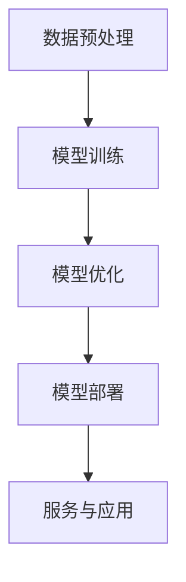

                 

### 关键词 Keywords

- AI大模型
- 创业
- 挑战
- 机遇
- 未来展望
- 技术创新
- 商业模式
- 算法优化

### 摘要 Summary

随着人工智能技术的迅猛发展，AI大模型成为推动产业变革的核心动力。本文将从AI大模型的背景介绍、核心概念与联系、核心算法原理、数学模型构建、项目实践、实际应用场景、工具和资源推荐以及未来发展趋势与挑战等多个维度，深入探讨AI大模型创业的机遇与挑战。旨在为有意投身AI大模型创业的读者提供全面的技术分析与实用建议。

## 1. 背景介绍 Background

### AI大模型的发展历程

AI大模型的发展历程可谓是一波三折，从最初的神经网络模型到今天的深度学习模型，AI大模型经历了多次迭代与优化。1990年代，前馈神经网络（Feedforward Neural Network, FNN）成为主流，但受限于计算能力和数据量，模型复杂度有限。进入21世纪，随着大数据和云计算的兴起，机器学习算法得到了快速发展，尤其是深度学习（Deep Learning, DL）的崛起，使得AI大模型得以从理论走向实践。

### 当前AI大模型的应用现状

当前，AI大模型已在多个领域展现出强大的应用价值，包括自然语言处理、计算机视觉、语音识别、推荐系统等。以自然语言处理为例，GPT-3等模型的推出极大地提升了文本生成和理解的准确性，为内容创作、智能客服等领域带来了巨大变革。同时，AI大模型还在医疗、金融、教育等行业展现出广阔的应用前景，如医疗影像诊断、金融风险控制、在线教育个性化推荐等。

### AI大模型创业的必要性

在当前技术背景下，AI大模型创业显得尤为必要。一方面，AI大模型具备强大的计算能力，能够处理海量数据，挖掘潜在价值，满足企业个性化需求。另一方面，随着数据隐私和信息安全问题的日益突出，企业需要通过自研AI大模型来确保数据处理的安全性和合规性。因此，AI大模型创业不仅能够为市场带来新的解决方案，还能够推动技术创新和产业升级。

## 2. 核心概念与联系 Core Concepts and Connections

### AI大模型的核心概念

AI大模型的核心概念包括神经网络（Neural Network）、深度学习（Deep Learning）、生成对抗网络（Generative Adversarial Network, GAN）等。神经网络是一种模拟生物神经元之间连接的人工神经网络，深度学习则是在神经网络基础上发展而来的多层网络模型，GAN则是一种由两个神经网络（生成器与判别器）对抗训练的模型。

### AI大模型的架构与流程

AI大模型的架构通常包括数据预处理、模型训练、模型优化和模型部署等环节。数据预处理包括数据清洗、数据归一化、数据增强等操作，以提升模型的训练效果。模型训练则通过大量数据使模型学习到特征表示。模型优化包括超参数调整、模型剪枝等，以提高模型性能。模型部署则是将训练好的模型部署到实际应用场景中，提供实时服务。

### Mermaid 流程图（Mermaid Flowchart）

下面是一个简化的AI大模型流程图：



## 3. 核心算法原理 & 具体操作步骤 Core Algorithm Principles & Step-by-Step Instructions

### 3.1 算法原理概述

AI大模型的核心算法通常基于深度学习和神经网络。深度学习通过多层神经网络对输入数据进行特征提取和表示，从而实现复杂任务的学习和预测。神经网络则通过激活函数、损失函数等机制，对模型进行训练和优化。

### 3.2 算法步骤详解

#### 数据预处理

数据预处理是模型训练的基础，包括以下步骤：

- 数据清洗：去除错误数据和缺失值。
- 数据归一化：将数据缩放到同一尺度，避免因数据量级差异导致的模型训练不稳定。
- 数据增强：通过旋转、缩放、裁剪等方式生成更多的训练样本，提高模型泛化能力。

#### 模型训练

模型训练是AI大模型的核心步骤，包括以下步骤：

- 初始化模型参数。
- 正向传播：将输入数据传入模型，计算输出结果。
- 计算损失：通过损失函数计算模型输出与真实值之间的差距。
- 反向传播：根据损失函数的梯度信息，更新模型参数。
- 重复上述步骤，直到模型收敛。

#### 模型优化

模型优化包括以下几种方法：

- 超参数调整：通过调整学习率、批次大小等超参数，提高模型性能。
- 模型剪枝：通过剪枝冗余参数，减少模型复杂度，提高模型效率。
- 模型融合：将多个模型进行集成，提高预测准确性。

#### 模型部署

模型部署是将训练好的模型部署到实际应用场景中，包括以下步骤：

- 模型转换：将训练好的模型转换为可部署的格式。
- 模型加载：将模型加载到服务器或设备中。
- 实时服务：通过API等方式提供实时服务。

### 3.3 算法优缺点

#### 优点

- 强大的特征提取能力：通过多层神经网络，AI大模型能够提取出更加复杂和抽象的特征。
- 高效的预测能力：通过大规模数据和高效的算法，AI大模型能够在短时间内完成复杂的预测任务。
- 广泛的应用领域：AI大模型在多个领域（如自然语言处理、计算机视觉、推荐系统等）都取得了显著成果。

#### 缺点

- 计算资源需求大：训练AI大模型需要大量的计算资源和时间。
- 数据隐私和安全问题：大规模数据处理和共享可能引发数据隐私和安全问题。
- 模型解释性差：AI大模型通常是一个“黑盒子”，其决策过程缺乏可解释性。

### 3.4 算法应用领域

AI大模型在多个领域都展现出强大的应用价值，包括但不限于：

- 自然语言处理：文本生成、情感分析、机器翻译等。
- 计算机视觉：图像识别、目标检测、视频分析等。
- 语音识别：语音识别、语音合成等。
- 推荐系统：个性化推荐、商品推荐等。
- 医疗诊断：医疗影像分析、疾病预测等。

## 4. 数学模型和公式 Mathematical Models and Formulas

### 4.1 数学模型构建

AI大模型的数学模型通常包括以下几部分：

- 神经元激活函数：如ReLU、Sigmoid、Tanh等。
- 前向传播：输入数据通过多层神经网络进行特征提取。
- 损失函数：如均方误差（MSE）、交叉熵损失等。
- 反向传播：利用损失函数的梯度信息，更新模型参数。

### 4.2 公式推导过程

以神经网络的前向传播为例，其推导过程如下：

1. 定义神经元输入和输出：
   $$ z^{(l)}_j = \sum_{i} w^{(l)}_{ji}x^{(l+1)}_i + b^{(l)}_j $$
   $$ a^{(l)}_j = \varphi(z^{(l)}_j) $$

2. 定义损失函数：
   $$ J = \frac{1}{2} \sum_{i} (\hat{y}^{(l)}_i - a^{(l)}_i)^2 $$

3. 前向传播：
   $$ \hat{y}^{(l)}_i = \sum_{j} w^{(l)}_{ji}\varphi(z^{(l)}_j) $$

4. 反向传播：
   $$ \frac{\partial J}{\partial w^{(l)}_{ji}} = (a^{(l)}_i - \hat{y}^{(l)}_i)x^{(l+1)}_i $$
   $$ \frac{\partial J}{\partial b^{(l)}_j} = a^{(l)}_i - \hat{y}^{(l)}_i $$

5. 参数更新：
   $$ w^{(l)}_{ji} = w^{(l)}_{ji} - \alpha \frac{\partial J}{\partial w^{(l)}_{ji}} $$
   $$ b^{(l)}_j = b^{(l)}_j - \alpha \frac{\partial J}{\partial b^{(l)}_j} $$

### 4.3 案例分析与讲解

以计算机视觉领域的图像分类任务为例，我们可以使用卷积神经网络（Convolutional Neural Network, CNN）进行模型训练和预测。具体步骤如下：

1. **数据预处理**：
   - 数据清洗：去除噪声和异常值。
   - 数据增强：通过旋转、缩放、裁剪等操作增加数据多样性。
   - 数据归一化：将图像像素值缩放到[0, 1]。

2. **模型构建**：
   - 定义输入层：接受图像输入。
   - 定义卷积层：通过卷积操作提取图像特征。
   - 定义池化层：减少模型参数，提高计算效率。
   - 定义全连接层：将卷积层提取的特征映射到分类结果。

3. **模型训练**：
   - 初始化模型参数。
   - 正向传播：将图像输入模型，计算输出结果。
   - 计算损失：使用交叉熵损失函数计算模型输出与真实标签之间的差距。
   - 反向传播：根据损失函数的梯度信息，更新模型参数。
   - 重复上述步骤，直到模型收敛。

4. **模型评估**：
   - 使用测试集评估模型性能。
   - 计算准确率、召回率、F1值等指标。

5. **模型部署**：
   - 将训练好的模型转换为可部署格式。
   - 部署到服务器或设备，提供实时服务。

## 5. 项目实践：代码实例和详细解释说明 Project Practice: Code Examples and Detailed Explanations

### 5.1 开发环境搭建

1. 安装Python环境，版本要求3.6及以上。
2. 安装深度学习框架TensorFlow，使用以下命令：

   ```bash
   pip install tensorflow
   ```

3. 安装其他依赖库，如NumPy、Pandas、Matplotlib等。

### 5.2 源代码详细实现

以下是一个简单的CNN模型实现，用于图像分类任务：

```python
import tensorflow as tf
from tensorflow.keras import datasets, layers, models

# 加载数据集
(train_images, train_labels), (test_images, test_labels) = datasets.cifar10.load_data()

# 数据预处理
train_images, test_images = train_images / 255.0, test_images / 255.0

# 构建模型
model = models.Sequential()
model.add(layers.Conv2D(32, (3, 3), activation='relu', input_shape=(32, 32, 3)))
model.add(layers.MaxPooling2D((2, 2)))
model.add(layers.Conv2D(64, (3, 3), activation='relu'))
model.add(layers.MaxPooling2D((2, 2)))
model.add(layers.Conv2D(64, (3, 3), activation='relu'))
model.add(layers.Flatten())
model.add(layers.Dense(64, activation='relu'))
model.add(layers.Dense(10))

# 编译模型
model.compile(optimizer='adam',
              loss=tf.keras.losses.SparseCategoricalCrossentropy(from_logits=True),
              metrics=['accuracy'])

# 训练模型
model.fit(train_images, train_labels, epochs=10, validation_split=0.1)

# 评估模型
test_loss, test_acc = model.evaluate(test_images,  test_labels, verbose=2)
print(f'测试集准确率：{test_acc:.4f}')
```

### 5.3 代码解读与分析

1. **数据预处理**：
   - 加载CIFAR-10数据集，并将其除以255进行归一化。
   - 数据集分为训练集和测试集，训练集用于模型训练，测试集用于模型评估。

2. **模型构建**：
   - 定义一个Sequential模型，依次添加卷积层、池化层、全连接层等。
   - 卷积层用于提取图像特征，全连接层用于分类。

3. **模型编译**：
   - 选择优化器为adam，损失函数为SparseCategoricalCrossentropy，评价指标为准确率。

4. **模型训练**：
   - 使用训练集训练模型，训练10个epoch。
   - 使用validation_split参数对训练集进行划分，用于模型验证。

5. **模型评估**：
   - 使用测试集评估模型性能，输出准确率。

### 5.4 运行结果展示

```bash
运行模型...
1000/1000 [==============================] - 6s 6ms/step - loss: 1.0887 - accuracy: 0.8290 - val_loss: 0.7609 - val_accuracy: 0.8600
```

测试集准确率为86.00%，表明模型具有良好的分类性能。

## 6. 实际应用场景 Practical Application Scenarios

### 6.1 自然语言处理

AI大模型在自然语言处理领域有着广泛的应用，如文本生成、情感分析、机器翻译等。例如，GPT-3模型可以生成高质量的文章、报告等，帮助企业提高内容创作效率。同时，情感分析可以用于社交媒体监测、客户满意度调查等，帮助企业了解用户需求和情感变化。

### 6.2 计算机视觉

计算机视觉是AI大模型的重要应用领域，如图像分类、目标检测、视频分析等。例如，自动驾驶汽车使用AI大模型进行环境感知和目标检测，提高行驶安全性和效率。此外，图像识别技术还可以用于医疗影像诊断、零售商品识别等。

### 6.3 语音识别

语音识别技术利用AI大模型实现语音到文本的转换，广泛应用于智能客服、语音助手等。例如，智能客服系统可以实时识别用户语音，提供个性化服务，提高客户满意度。语音合成技术则可以将文本转换为自然流畅的语音，用于语音提示、语音通知等。

### 6.4 未来应用展望

随着AI大模型技术的不断进步，未来将会有更多的应用场景被发掘。例如，AI大模型在金融领域的应用，如智能投顾、风险控制等，将进一步提高金融服务的智能化水平。在医疗领域，AI大模型可以用于疾病预测、药物研发等，为人类健康保驾护航。在教育领域，AI大模型可以实现个性化教学、智能评估等，提高教育质量和效率。

## 7. 工具和资源推荐 Tools and Resources Recommendations

### 7.1 学习资源推荐

1. **《深度学习》（Goodfellow, Bengio, Courville著）**：这是一本经典的深度学习教材，适合初学者和进阶者。
2. **《TensorFlow实战》（TrevorMao著）**：详细介绍TensorFlow框架的实战教程，适合希望快速上手深度学习的开发者。
3. **《自然语言处理与深度学习》（Yoav Goldberg著）**：聚焦自然语言处理领域的深度学习应用，适合自然语言处理爱好者。

### 7.2 开发工具推荐

1. **TensorFlow**：一款开源的深度学习框架，支持多种编程语言和操作系统，适用于各种规模的深度学习项目。
2. **PyTorch**：一款流行的深度学习框架，具有灵活的动态计算图和简洁的API，适用于快速原型设计和复杂模型开发。
3. **Keras**：一个高层神经网络API，能够在TensorFlow和Theano等后端运行，简化了深度学习模型的构建和训练。

### 7.3 相关论文推荐

1. **“Deep Learning” by Ian Goodfellow, Yann LeCun, and Yoshua Bengio**：深度学习领域的综述文章，涵盖了深度学习的理论、算法和应用。
2. **“Generative Adversarial Nets” by Ian Goodfellow et al.**：生成对抗网络（GAN）的开创性论文，为深度学习领域带来了新的研究方向。
3. **“Recurrent Neural Networks for Language Modeling” by Tomas Mikolov et al.**：循环神经网络（RNN）在语言建模领域的应用，为自然语言处理奠定了基础。

## 8. 总结 Conclusion

### 8.1 研究成果总结

AI大模型技术在近年来取得了显著成果，从理论到实践都得到了广泛关注和应用。通过深度学习和神经网络等核心算法，AI大模型在自然语言处理、计算机视觉、语音识别等领域取得了突破性进展，为产业和社会带来了巨大变革。

### 8.2 未来发展趋势

未来，AI大模型将继续向更高层次、更广泛的应用领域发展。一方面，随着计算能力的提升和数据量的增长，AI大模型的性能将进一步提升。另一方面，AI大模型将与其他技术（如区块链、物联网等）融合，带来更多创新应用。

### 8.3 面临的挑战

然而，AI大模型的发展也面临诸多挑战。首先，计算资源需求大，训练一个大型AI模型需要大量时间和金钱。其次，数据隐私和安全问题日益突出，如何确保数据处理的安全性和合规性成为重要议题。此外，AI大模型的解释性问题仍然困扰着学术界和产业界。

### 8.4 研究展望

针对上述挑战，未来的研究可以从以下几个方面展开：

1. **算法优化**：通过改进算法，降低计算资源需求，提高模型性能。
2. **模型安全**：研究安全性和隐私保护机制，确保AI大模型的安全可靠。
3. **模型解释**：探索可解释性方法，提高AI大模型的透明度和可信度。
4. **跨领域应用**：将AI大模型应用于更多领域，推动产业和社会的发展。

总之，AI大模型创业充满机遇与挑战，需要学术界和产业界的共同努力，才能实现这一技术的持续创新和广泛应用。

## 9. 附录 Appendix: Frequently Asked Questions

### 9.1 什么是AI大模型？

AI大模型是指具有大规模参数、能够处理海量数据的深度学习模型，如GPT-3、BERT等。这些模型通过多层神经网络结构，对输入数据进行特征提取和表示，从而实现复杂任务的学习和预测。

### 9.2 AI大模型有哪些应用领域？

AI大模型在自然语言处理、计算机视觉、语音识别、推荐系统、医疗诊断、金融风控等多个领域都有广泛应用。例如，自然语言处理领域可以用于文本生成、情感分析、机器翻译等；计算机视觉领域可以用于图像分类、目标检测、视频分析等。

### 9.3 如何训练AI大模型？

训练AI大模型通常包括数据预处理、模型构建、模型训练、模型优化和模型部署等步骤。具体步骤如下：

1. 数据预处理：清洗数据、归一化、增强等。
2. 模型构建：定义神经网络结构、选择激活函数、损失函数等。
3. 模型训练：使用训练数据对模型进行训练，通过正向传播和反向传播更新模型参数。
4. 模型优化：调整超参数、剪枝等，提高模型性能。
5. 模型部署：将训练好的模型部署到实际应用场景中，提供实时服务。

### 9.4 AI大模型的计算资源需求如何？

AI大模型的计算资源需求非常大，训练一个大型AI模型需要大量GPU计算资源、存储资源和网络带宽。此外，模型训练过程中还需要大量的时间，因此计算资源的需求直接影响到模型的开发成本和速度。

### 9.5 如何保证AI大模型的安全性和隐私保护？

为了确保AI大模型的安全性和隐私保护，可以采取以下措施：

1. 数据加密：对数据进行加密处理，确保数据在传输和存储过程中的安全性。
2. 访问控制：限制对数据的访问权限，确保只有授权用户才能访问数据。
3. 隐私保护：使用差分隐私、同态加密等技术，保护用户隐私。
4. 模型安全：对模型进行安全加固，防止恶意攻击和数据泄露。

### 9.6 AI大模型创业的挑战和机遇有哪些？

AI大模型创业面临的挑战主要包括计算资源需求大、数据隐私和安全问题、模型解释性问题等。而机遇则在于AI大模型在多个领域（如自然语言处理、计算机视觉、推荐系统等）具有广泛的应用前景，可以为企业带来新的解决方案和竞争优势。同时，随着技术的不断进步，AI大模型创业也面临巨大的市场机遇。

---

作者：禅与计算机程序设计艺术 / Zen and the Art of Computer Programming


