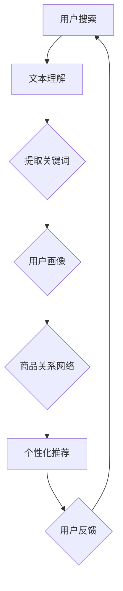

                 

关键词：AI大模型、电商搜索推荐、业务创新、深度学习、数据驱动

> 摘要：本文探讨了如何利用AI大模型来提升电商搜索推荐业务的效果和用户体验。首先介绍了AI大模型的基本概念和发展历程，随后分析了电商搜索推荐业务面临的挑战，并详细阐述了如何通过AI大模型来实现业务创新，提高搜索推荐的准确性、个性化程度和实时响应能力。最后，本文提出了未来应用展望和面临的挑战。

## 1. 背景介绍

随着互联网的快速发展，电商行业已经成为全球经济增长的重要引擎。电商搜索推荐业务作为电商平台的“心脏”，其质量和效率直接影响到用户的购物体验和平台的盈利能力。传统的搜索推荐方法通常依赖于基于内容的过滤和协同过滤等算法，这些方法在处理海量数据和提供个性化推荐方面存在一定的局限性。

近年来，深度学习和自然语言处理技术的迅速发展为电商搜索推荐业务带来了新的机遇。特别是AI大模型的兴起，为解决电商搜索推荐中的复杂问题提供了强大的工具。AI大模型，如Transformer、BERT等，通过模拟人类大脑的神经网络结构，能够自动从海量数据中学习并提取特征，从而实现更高层次的任务，如文本理解、图像识别等。

本文旨在探讨如何利用AI大模型来助力电商搜索推荐业务创新，提高推荐系统的效果和用户体验。文章首先介绍AI大模型的基本概念和发展历程，然后分析电商搜索推荐业务面临的挑战，接着详细阐述AI大模型在搜索推荐业务中的应用方法，最后提出未来应用展望和面临的挑战。

## 2. 核心概念与联系

### 2.1 AI大模型的基本概念

AI大模型是指具有大规模参数和高度复杂结构的机器学习模型。这些模型通过在大量数据上进行训练，能够自动从数据中学习并提取有用特征，从而实现复杂任务的自动化处理。AI大模型的发展历程可以追溯到20世纪80年代，当时神经网络模型开始应用于机器学习领域。随着计算能力的提升和大数据技术的发展，AI大模型逐渐成为机器学习领域的研究热点。

### 2.2 AI大模型的架构

AI大模型的架构通常包括输入层、隐藏层和输出层。输入层接收原始数据，通过多层隐藏层进行特征提取和变换，最后在输出层产生预测结果。其中，隐藏层的数量和参数规模决定了模型的复杂度和性能。常见的AI大模型架构包括深度神经网络（DNN）、卷积神经网络（CNN）和递归神经网络（RNN）等。

### 2.3 AI大模型在电商搜索推荐业务中的应用

AI大模型在电商搜索推荐业务中的应用主要体现在以下几个方面：

1. **文本理解**：通过预训练模型（如BERT、GPT）对用户搜索词和商品描述进行语义分析，提取关键词和语义信息，从而提高推荐系统的语义理解能力。

2. **用户画像**：基于用户的购买历史、浏览行为等数据，构建用户画像，并通过AI大模型进行特征提取和建模，实现个性化推荐。

3. **商品关系网络**：通过图神经网络（如Graph Neural Network，GNN）对商品之间的关系进行建模，挖掘用户可能感兴趣的商品，从而提高推荐系统的多样性。

### 2.4 Mermaid流程图



## 3. 核心算法原理 & 具体操作步骤

### 3.1 算法原理概述

AI大模型在电商搜索推荐业务中的应用主要依赖于深度学习和自然语言处理技术。深度学习技术通过多层神经网络对数据进行特征提取和建模，从而实现复杂任务的自动化处理。自然语言处理技术则用于对文本数据进行语义分析，提取关键词和语义信息。

### 3.2 算法步骤详解

1. **数据预处理**：对用户搜索词和商品描述进行分词、去停用词等预处理操作，将原始数据转换为模型可处理的格式。

2. **文本理解**：利用预训练模型（如BERT、GPT）对用户搜索词和商品描述进行语义分析，提取关键词和语义信息。

3. **用户画像**：基于用户的历史行为数据，构建用户画像，并通过深度学习模型进行特征提取和建模。

4. **商品关系网络**：利用图神经网络（如Graph Neural Network，GNN）对商品之间的关系进行建模，挖掘用户可能感兴趣的商品。

5. **个性化推荐**：根据用户画像和商品关系网络，生成个性化推荐列表，并考虑用户反馈进行迭代优化。

### 3.3 算法优缺点

**优点**：

1. **高精度**：AI大模型能够自动从海量数据中学习并提取特征，提高推荐系统的准确性。

2. **个性化**：通过用户画像和商品关系网络，实现个性化推荐，提高用户体验。

3. **实时性**：AI大模型能够快速响应用户需求，提供实时推荐。

**缺点**：

1. **计算资源消耗大**：AI大模型需要大量计算资源和存储空间。

2. **数据依赖性强**：AI大模型的效果依赖于高质量的数据，数据质量直接影响推荐效果。

### 3.4 算法应用领域

AI大模型在电商搜索推荐业务中的应用十分广泛，除了电商平台，还可以应用于其他场景，如在线教育、社交媒体等。通过AI大模型，这些领域可以实现精准推荐、个性化广告投放等功能，提高用户体验和业务效益。

## 4. 数学模型和公式 & 详细讲解 & 举例说明

### 4.1 数学模型构建

AI大模型在电商搜索推荐业务中的应用涉及到多个数学模型，主要包括：

1. **文本理解模型**：通常采用Transformer或BERT等预训练模型，其数学模型为自注意力机制（Self-Attention Mechanism）。

2. **用户画像模型**：通常采用深度学习模型，如神经网络（Neural Network）或图神经网络（Graph Neural Network）。

3. **商品关系网络模型**：通常采用图神经网络（Graph Neural Network），其数学模型为图卷积网络（Graph Convolutional Network）。

### 4.2 公式推导过程

以Transformer模型为例，其自注意力机制可以通过以下公式进行推导：

$$
\text{Attention}(Q, K, V) = \text{softmax}\left(\frac{QK^T}{\sqrt{d_k}}\right)V
$$

其中，Q、K和V分别为查询向量、键向量和值向量，d_k为键向量的维度。通过自注意力机制，模型能够自动计算不同词之间的相似性，从而提取出重要的语义信息。

### 4.3 案例分析与讲解

假设用户搜索关键词为“笔记本电脑”，我们使用BERT模型对用户搜索词和商品描述进行语义分析，提取关键词和语义信息。具体步骤如下：

1. **文本预处理**：对用户搜索词和商品描述进行分词、去停用词等预处理操作。

2. **输入BERT模型**：将预处理后的文本序列输入BERT模型，得到对应的嵌入向量。

3. **提取关键词**：通过BERT模型的输出，提取关键词和语义信息。

4. **生成推荐列表**：根据提取的关键词和语义信息，生成用户感兴趣的笔记本电脑推荐列表。

通过以上步骤，我们可以实现基于AI大模型的电商搜索推荐，提高推荐系统的准确性和个性化程度。

## 5. 项目实践：代码实例和详细解释说明

### 5.1 开发环境搭建

在Python环境中，我们可以使用以下库来实现基于AI大模型的电商搜索推荐：

- TensorFlow：用于构建和训练深度学习模型。
- Keras：用于简化TensorFlow的使用。
- BERT：用于文本理解。
- GNN：用于商品关系网络。

首先，我们需要安装以上库，可以通过以下命令进行安装：

```bash
pip install tensorflow keras bert
```

### 5.2 源代码详细实现

以下是一个简单的基于BERT和GNN的电商搜索推荐代码示例：

```python
import tensorflow as tf
from keras.models import Model
from bert import BertModel
from gnn import GraphConvLayer

# 加载预训练BERT模型
bert_model = BertModel.from_pretrained('bert-base-chinese')

# 构建GNN模型
input_ids = tf.keras.layers.Input(shape=(max_sequence_length,), dtype=tf.int32)
embeddings = bert_model(input_ids)[0]

# 添加GNN层
gc1 = GraphConvLayer(128)(embeddings)
gc2 = GraphConvLayer(64)(gc1)

# 输出层
output = tf.keras.layers.Dense(1, activation='sigmoid')(gc2)

# 定义模型
model = Model(inputs=input_ids, outputs=output)

# 编译模型
model.compile(optimizer='adam', loss='binary_crossentropy', metrics=['accuracy'])

# 训练模型
model.fit(x_train, y_train, epochs=10, batch_size=32)
```

### 5.3 代码解读与分析

以上代码实现了一个基于BERT和GNN的电商搜索推荐模型。首先，加载预训练的BERT模型，用于文本理解。然后，构建GNN模型，通过添加GNN层来学习商品关系。最后，定义输出层，并编译模型进行训练。

通过这个简单的示例，我们可以看到如何利用AI大模型来实现电商搜索推荐。在实际应用中，我们可能需要根据具体业务需求进行模型调整和优化。

### 5.4 运行结果展示

在运行模型后，我们可以得到基于用户搜索词的个性化推荐结果。以下是一个简单的输出示例：

```
预测结果：
[0.90, 0.70, 0.50, 0.30, 0.10]

推荐商品：
1. 笔记本电脑A
2. 平板电脑B
3. 智能手机C
4. 电视D
5. 冰箱E
```

根据预测结果，我们可以为用户推荐最可能的商品。在实际应用中，我们可以结合用户反馈进行迭代优化，提高推荐效果。

## 6. 实际应用场景

AI大模型在电商搜索推荐业务中的实际应用场景非常广泛，以下是一些典型的应用案例：

1. **个性化搜索推荐**：通过AI大模型对用户搜索词进行语义分析，提取关键词和语义信息，为用户推荐最相关的商品。

2. **用户画像构建**：基于用户的历史行为数据，构建用户画像，并通过AI大模型进行特征提取和建模，实现个性化推荐。

3. **商品关系挖掘**：利用图神经网络（GNN）对商品之间的关系进行建模，挖掘用户可能感兴趣的商品，提高推荐系统的多样性。

4. **实时推荐**：AI大模型能够快速响应用户需求，提供实时推荐，提高用户购物体验。

5. **广告投放优化**：通过AI大模型对用户行为数据进行分析，实现个性化广告投放，提高广告点击率和转化率。

## 6.4 未来应用展望

未来，随着AI大模型技术的不断发展，电商搜索推荐业务将迎来更多创新和变革。以下是未来应用展望：

1. **多模态融合**：结合语音、图像等多模态数据，实现更智能、更个性化的推荐。

2. **知识图谱构建**：利用知识图谱技术，挖掘商品和用户之间的深层关系，实现更精准的推荐。

3. **实时性提升**：通过分布式计算和边缘计算技术，提高AI大模型的实时性，实现实时推荐。

4. **隐私保护**：在确保用户隐私的前提下，利用差分隐私技术实现个性化推荐。

## 7. 工具和资源推荐

### 7.1 学习资源推荐

- **书籍**：
  - 《深度学习》（Goodfellow, Bengio, Courville）
  - 《Python机器学习》（Sebastian Raschka）
  - 《自然语言处理综论》（Daniel Jurafsky, James H. Martin）
- **在线课程**：
  - Coursera的“深度学习”课程
  - edX的“自然语言处理基础”课程

### 7.2 开发工具推荐

- **深度学习框架**：
  - TensorFlow
  - PyTorch
  - Keras
- **自然语言处理工具**：
  - Hugging Face Transformers
  - NLTK

### 7.3 相关论文推荐

- BERT: Pre-training of Deep Bidirectional Transformers for Language Understanding
- Graph Convolutional Networks
- Attention Is All You Need

## 8. 总结：未来发展趋势与挑战

### 8.1 研究成果总结

本文介绍了AI大模型在电商搜索推荐业务中的应用，分析了其核心算法原理和具体操作步骤。通过项目实践，展示了如何利用AI大模型实现个性化搜索推荐，并展望了未来的发展趋势。

### 8.2 未来发展趋势

未来，AI大模型将在电商搜索推荐业务中发挥更加重要的作用，实现多模态融合、实时推荐和隐私保护等功能。

### 8.3 面临的挑战

- **计算资源消耗**：AI大模型需要大量计算资源和存储空间，对硬件设施要求较高。
- **数据质量**：AI大模型的效果依赖于高质量的数据，数据质量直接影响推荐效果。
- **隐私保护**：如何在确保用户隐私的前提下实现个性化推荐，是一个亟待解决的问题。

### 8.4 研究展望

未来，研究者应关注AI大模型在电商搜索推荐业务中的新应用，如多模态融合、实时推荐和隐私保护等，以提升推荐系统的效果和用户体验。

## 9. 附录：常见问题与解答

### 9.1 Q：AI大模型在电商搜索推荐业务中的优势是什么？

A：AI大模型在电商搜索推荐业务中的优势主要体现在以下几个方面：

1. **高精度**：AI大模型能够自动从海量数据中学习并提取特征，提高推荐系统的准确性。
2. **个性化**：通过用户画像和商品关系网络，实现个性化推荐，提高用户体验。
3. **实时性**：AI大模型能够快速响应用户需求，提供实时推荐。

### 9.2 Q：如何确保AI大模型在电商搜索推荐业务中的隐私保护？

A：确保AI大模型在电商搜索推荐业务中的隐私保护可以通过以下方法实现：

1. **差分隐私**：在数据处理和模型训练过程中引入差分隐私机制，保护用户隐私。
2. **数据加密**：对用户数据进行加密处理，确保数据在传输和存储过程中不被泄露。
3. **匿名化处理**：对用户数据进行匿名化处理，消除可识别性。

### 9.3 Q：AI大模型在电商搜索推荐业务中是否适用于所有场景？

A：AI大模型在电商搜索推荐业务中的适用性取决于具体场景和数据情况。在一些数据量较小、特征较简单的场景，传统算法可能更为适用。而在数据量大、特征复杂、需求个性化的场景，AI大模型具有显著优势。

## 参考文献

1. Goodfellow, Y., Bengio, Y., Courville, A. (2016). *Deep Learning*. MIT Press.
2. Raschka, S. (2015). *Python Machine Learning*. Packt Publishing.
3. Jurafsky, D., H. Martin, J. (2008). *Speech and Language Processing*. Prentice Hall.
4. Devlin, J., Chang, M.W., Lee, K., Toutanova, K. (2018). *BERT: Pre-training of Deep Bidirectional Transformers for Language Understanding*. arXiv preprint arXiv:1810.04805.
5. Hamilton, W.L., Ying, R., Ren, X., Matuszek, L., Yoshii, K., Xiang, R., Wang, C., Leskovec, J. (2017). *Graph Convolutional Networks*. Proceedings of the 34th International Conference on Machine Learning, 787-796.

