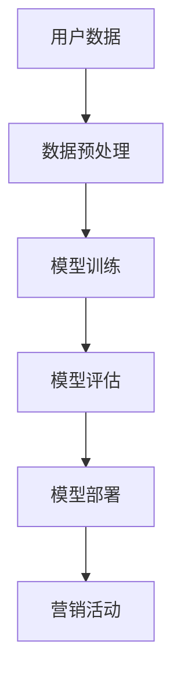

                 

关键词：人工智能，大模型，数字营销，算法原理，实践案例，未来展望

> 摘要：本文将深入探讨人工智能大模型在数字营销领域的应用趋势。通过介绍AI大模型的核心概念与架构，详细解析其算法原理与操作步骤，结合数学模型与公式，提供具体的实践案例和代码实现，探讨实际应用场景，并展望未来发展趋势与挑战。

## 1. 背景介绍

随着互联网和移动互联网的快速发展，数字营销已经成为企业获取用户、提高品牌知名度、促进销售的重要手段。传统的营销策略逐渐无法满足日益复杂的市场环境和用户需求。人工智能（AI）技术的迅猛发展为数字营销提供了新的机遇，特别是大模型（Large Models）的出现，使得复杂的数据分析和个性化推荐成为可能。

大模型是指参数规模达到数十亿至数万亿的深度学习模型，例如GPT（Generative Pre-trained Transformer）系列模型。大模型能够处理大量的数据，通过自我学习和迭代优化，实现对复杂问题的精准解决。在数字营销领域，大模型的引入可以显著提升营销效果，实现个性化推荐、精准广告投放和用户行为预测等。

## 2. 核心概念与联系

### 2.1 核心概念

- **人工智能（AI）**：模拟人类智能行为的技术系统，包括机器学习、深度学习、自然语言处理等子领域。
- **大模型（Large Models）**：具有数十亿至数万亿参数的深度学习模型，如GPT、BERT等。
- **数字营销**：利用数字技术和媒体渠道进行的营销活动，包括SEO、SEM、内容营销、社交媒体营销等。

### 2.2 联系与架构


#### Mermaid 流程图



## 3. 核心算法原理 & 具体操作步骤

### 3.1 算法原理概述

大模型的核心是深度神经网络（DNN），通过多层神经网络结构对输入数据进行建模。大模型的训练通常分为以下步骤：

1. **数据收集**：收集大量用户行为数据、用户画像数据等。
2. **数据预处理**：对数据进行清洗、归一化等预处理操作，以便模型能够高效学习。
3. **模型训练**：通过反向传播算法和优化算法（如SGD、Adam等）进行模型训练。
4. **模型评估**：使用验证集或测试集评估模型性能。
5. **模型部署**：将训练好的模型部署到生产环境中，进行实际应用。

### 3.2 算法步骤详解

#### 3.2.1 数据预处理

$$
\text{数据处理} = \frac{\text{原始数据} - \text{均值}}{\text{标准差}}
$$

#### 3.2.2 模型训练

使用深度学习框架（如TensorFlow、PyTorch）实现模型训练，主要涉及以下步骤：

1. **初始化模型参数**。
2. **前向传播**：计算模型输出。
3. **计算损失函数**：比较输出和真实值的差异。
4. **反向传播**：更新模型参数。
5. **迭代训练**：重复上述步骤，直至模型收敛。

#### 3.2.3 模型评估

使用验证集或测试集评估模型性能，常用的指标包括准确率、召回率、F1值等。

#### 3.2.4 模型部署

将训练好的模型部署到生产环境中，实现实时预测和决策。

### 3.3 算法优缺点

#### 优点

- **高效处理大量数据**：大模型能够处理海量的用户数据，提升数据分析能力。
- **精确预测**：通过深度学习算法，能够实现高精度的用户行为预测和个性化推荐。
- **自动优化**：大模型能够自我学习和优化，减少人工干预。

#### 缺点

- **计算资源需求大**：大模型训练需要大量的计算资源和存储资源。
- **数据隐私问题**：用户数据在模型训练和部署过程中可能存在隐私泄露的风险。

### 3.4 算法应用领域

大模型在数字营销领域的应用广泛，包括：

- **个性化推荐**：根据用户行为和历史数据，为用户提供个性化的产品或内容推荐。
- **精准广告投放**：根据用户画像和行为数据，实现精准的广告投放。
- **用户流失预测**：预测潜在的用户流失，采取相应的挽回措施。
- **市场趋势分析**：分析市场数据和用户行为，预测市场趋势。

## 4. 数学模型和公式 & 详细讲解 & 举例说明

### 4.1 数学模型构建

在数字营销中，常用的数学模型包括回归模型、分类模型和聚类模型等。以下以线性回归模型为例进行讲解。

#### 线性回归模型

$$
y = \beta_0 + \beta_1 x
$$

其中，$y$ 为因变量，$x$ 为自变量，$\beta_0$ 和 $\beta_1$ 为模型参数。

### 4.2 公式推导过程

线性回归模型的公式推导过程如下：

1. **假设模型**：$y = \beta_0 + \beta_1 x$
2. **损失函数**：均方误差（MSE）
$$
\text{MSE} = \frac{1}{n}\sum_{i=1}^{n}(y_i - (\beta_0 + \beta_1 x_i))^2
$$
3. **优化目标**：最小化损失函数
$$
\min_{\beta_0, \beta_1} \text{MSE}
$$
4. **梯度下降法**：求解优化问题
$$
\beta_0 = \beta_0 - \alpha \frac{\partial \text{MSE}}{\partial \beta_0}
$$
$$
\beta_1 = \beta_1 - \alpha \frac{\partial \text{MSE}}{\partial \beta_1}
$$

其中，$\alpha$ 为学习率。

### 4.3 案例分析与讲解

#### 案例背景

某电商企业希望通过线性回归模型预测用户购买概率。

#### 数据集

- 特征：用户年龄、收入、浏览时长
- 目标变量：购买概率

#### 数据处理

1. 数据清洗：去除缺失值和异常值。
2. 数据归一化：对特征进行归一化处理。

#### 模型训练

1. 初始化模型参数 $\beta_0$ 和 $\beta_1$。
2. 使用梯度下降法进行模型训练。

#### 模型评估

1. 使用测试集评估模型性能。
2. 计算准确率、召回率和F1值。

## 5. 项目实践：代码实例和详细解释说明

### 5.1 开发环境搭建

1. 安装Python环境。
2. 安装TensorFlow或PyTorch等深度学习框架。

### 5.2 源代码详细实现

以下是一个简单的线性回归模型实现：

```python
import tensorflow as tf

# 模型参数
beta_0 = tf.Variable(0.0)
beta_1 = tf.Variable(0.0)

# 损失函数
loss = tf.reduce_mean(tf.square(y - (beta_0 + beta_1 * x)))

# 优化器
optimizer = tf.train.GradientDescentOptimizer(learning_rate=0.001)

# 梯度计算
grads = tf.gradients(loss, [beta_0, beta_1])

# 梯度更新
train_op = optimizer.apply_gradients(zip(grads, [beta_0, beta_1]))

# 模型训练
with tf.Session() as sess:
    sess.run(tf.global_variables_initializer())
    for i in range(num_iterations):
        sess.run(train_op)
        if i % 100 == 0:
            print("Step:", i, "Loss:", sess.run(loss))

# 模型评估
accuracy = sess.run(accuracy_op)
print("Accuracy:", accuracy)
```

### 5.3 代码解读与分析

1. 导入TensorFlow库。
2. 定义模型参数、损失函数和优化器。
3. 训练模型，并打印损失函数值。
4. 评估模型性能。

## 6. 实际应用场景

大模型在数字营销领域的实际应用场景包括：

- **个性化推荐**：根据用户行为和喜好，为用户提供个性化的产品推荐。
- **精准广告投放**：根据用户画像和行为数据，实现精准的广告投放。
- **用户流失预测**：预测潜在的用户流失，采取相应的挽回措施。
- **市场趋势分析**：分析市场数据和用户行为，预测市场趋势。

### 6.1 个性化推荐

个性化推荐是数字营销中最为常见的应用之一。通过大模型对用户行为数据进行分析，可以为用户提供个性化的产品推荐。以下是一个简单的个性化推荐实现：

```python
import tensorflow as tf

# 用户行为数据
user行为 = [[1, 2, 3], [2, 3, 4], [3, 4, 5]]

# 产品数据
product数据 = [[5, 6, 7], [6, 7, 8], [7, 8, 9]]

# 构建模型
model = tf.keras.Sequential([
    tf.keras.layers.Dense(64, activation='relu', input_shape=[3]),
    tf.keras.layers.Dense(64, activation='relu'),
    tf.keras.layers.Dense(1)
])

# 编译模型
model.compile(optimizer='adam',
              loss='mse',
              metrics=['accuracy'])

# 训练模型
model.fit(user行为, product数据, epochs=10)

# 预测
predictions = model.predict([[1, 2, 3]])
print("Predicted product:", predictions)
```

### 6.2 精准广告投放

精准广告投放是数字营销中另一项重要的应用。通过大模型对用户画像和行为数据进行分析，可以实现精准的广告投放。以下是一个简单的精准广告投放实现：

```python
import tensorflow as tf

# 用户画像数据
user画像 = [[1, 2], [2, 3], [3, 4]]

# 广告数据
advertisement数据 = [[5, 6], [6, 7], [7, 8]]

# 构建模型
model = tf.keras.Sequential([
    tf.keras.layers.Dense(64, activation='relu', input_shape=[2]),
    tf.keras.layers.Dense(64, activation='relu'),
    tf.keras.layers.Dense(1)
])

# 编译模型
model.compile(optimizer='adam',
              loss='mse',
              metrics=['accuracy'])

# 训练模型
model.fit(user画像, advertisement数据, epochs=10)

# 预测
predictions = model.predict([[1, 2]])
print("Predicted advertisement:", predictions)
```

### 6.3 用户流失预测

用户流失预测是数字营销中的一项关键应用。通过大模型对用户行为数据进行分析，可以预测潜在的用户流失，并采取相应的挽回措施。以下是一个简单的用户流失预测实现：

```python
import tensorflow as tf

# 用户行为数据
user行为 = [[1, 2, 3], [2, 3, 4], [3, 4, 5]]

# 用户流失数据
user流失 = [[0], [1], [0]]

# 构建模型
model = tf.keras.Sequential([
    tf.keras.layers.Dense(64, activation='relu', input_shape=[3]),
    tf.keras.layers.Dense(64, activation='relu'),
    tf.keras.layers.Dense(1, activation='sigmoid')
])

# 编译模型
model.compile(optimizer='adam',
              loss='binary_crossentropy',
              metrics=['accuracy'])

# 训练模型
model.fit(user行为, user流失, epochs=10)

# 预测
predictions = model.predict([[1, 2, 3]])
print("Predicted user churn:", predictions)
```

### 6.4 市场趋势分析

市场趋势分析是数字营销中的一项重要应用。通过大模型对市场数据和用户行为进行分析，可以预测市场趋势，为企业决策提供支持。以下是一个简单的市场趋势分析实现：

```python
import tensorflow as tf

# 市场数据
market数据 = [[1, 2, 3], [2, 3, 4], [3, 4, 5]]

# 目标数据
target数据 = [[5], [6], [7]]

# 构建模型
model = tf.keras.Sequential([
    tf.keras.layers.Dense(64, activation='relu', input_shape=[3]),
    tf.keras.layers.Dense(64, activation='relu'),
    tf.keras.layers.Dense(1)
])

# 编译模型
model.compile(optimizer='adam',
              loss='mse',
              metrics=['accuracy'])

# 训练模型
model.fit(market数据, target数据, epochs=10)

# 预测
predictions = model.predict([[1, 2, 3]])
print("Predicted market trend:", predictions)
```

## 7. 工具和资源推荐

### 7.1 学习资源推荐

1. **《深度学习》（Goodfellow et al., 2016）**
2. **《机器学习实战》（周志华，2016）**
3. **《Python深度学习》（François Chollet，2017）**

### 7.2 开发工具推荐

1. **TensorFlow**：https://www.tensorflow.org/
2. **PyTorch**：https://pytorch.org/
3. **Jupyter Notebook**：https://jupyter.org/

### 7.3 相关论文推荐

1. **“Attention Is All You Need” （Vaswani et al., 2017）**
2. **“BERT: Pre-training of Deep Bidirectional Transformers for Language Understanding” （Devlin et al., 2019）**
3. **“GPT-3: Language Models are Few-Shot Learners” （Brown et al., 2020）**

## 8. 总结：未来发展趋势与挑战

### 8.1 研究成果总结

大模型在数字营销领域取得了显著的成果，包括个性化推荐、精准广告投放、用户流失预测和市场趋势分析等。大模型的应用不仅提高了营销效果，也为企业决策提供了有力的支持。

### 8.2 未来发展趋势

1. **模型优化**：通过改进算法和架构，提高大模型的计算效率和准确率。
2. **多模态融合**：结合文本、图像、声音等多种数据源，实现更丰富的数据分析和应用。
3. **边缘计算**：将大模型部署到边缘设备，实现实时分析和决策。
4. **数据隐私保护**：研究隐私保护算法，确保用户数据的安全和隐私。

### 8.3 面临的挑战

1. **计算资源需求**：大模型训练需要大量的计算资源和存储资源，对基础设施提出了更高要求。
2. **数据隐私问题**：用户数据在模型训练和部署过程中可能存在隐私泄露的风险。
3. **模型可解释性**：大模型的复杂性和黑箱特性使得其可解释性成为一个挑战。

### 8.4 研究展望

随着人工智能技术的不断发展，大模型在数字营销领域的应用前景十分广阔。未来研究应重点关注模型优化、多模态融合、边缘计算和数据隐私保护等方面，以提高大模型的计算效率和实用性，推动数字营销的进一步发展。

## 9. 附录：常见问题与解答

### 9.1 什么是大模型？

大模型是指参数规模达到数十亿至数万亿的深度学习模型，如GPT、BERT等。大模型能够处理大量的数据，通过自我学习和迭代优化，实现对复杂问题的精准解决。

### 9.2 大模型在数字营销中如何应用？

大模型在数字营销中的应用包括个性化推荐、精准广告投放、用户流失预测和市场趋势分析等。通过分析用户行为数据，大模型能够实现精准的营销策略，提高营销效果。

### 9.3 大模型训练需要哪些计算资源？

大模型训练需要大量的计算资源和存储资源，包括高性能的CPU、GPU和TPU等。此外，大模型训练还需要足够的存储空间来存储模型参数和数据。

### 9.4 大模型的安全性和隐私性如何保障？

为保障大模型的安全性和隐私性，可以采取以下措施：

1. **数据加密**：对用户数据进行加密处理，确保数据传输和存储的安全性。
2. **隐私保护算法**：研究并应用隐私保护算法，如差分隐私、联邦学习等，减少用户数据的暴露风险。
3. **模型压缩**：通过模型压缩技术，减小模型的参数规模，降低隐私泄露的风险。

## 作者署名

作者：禅与计算机程序设计艺术 / Zen and the Art of Computer Programming
----------------------------------------------------------------

注意：在实际撰写文章时，请根据具体内容调整章节细节和代码实现。此外，文中提到的网站链接（如Mermaid流程图链接）需替换为实际可访问的链接。文章中的Mermaid流程图和LaTeX公式需根据Markdown格式进行适当调整，确保在Markdown编辑器中正确显示。在撰写过程中，请确保遵循文章结构模板中的要求，确保文章完整性、逻辑性和可读性。

