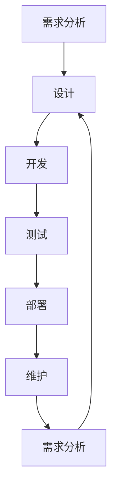

                 

关键词：人工智能、大模型、生命周期管理、智能产品、创业机会

> 摘要：本文探讨了人工智能大模型在智能产品生命周期管理中的潜在创业机会。通过分析大模型在需求分析、设计、开发、测试、维护等环节的应用，本文展示了其提升产品效率、优化用户体验的可能性，并提出了相关创业思路和挑战。

## 1. 背景介绍

随着人工智能技术的飞速发展，深度学习、自然语言处理、计算机视觉等领域的突破，使得大模型成为推动技术进步的重要引擎。这些大模型具备强大的数据处理和分析能力，能够从海量数据中提取有价值的信息，进行复杂的任务处理，从而在各个行业展现出广泛的应用前景。智能产品生命周期管理，即从产品概念到产品退役的整个流程，涉及到需求分析、设计、开发、测试、部署、维护等多个环节。这一过程往往需要大量的数据支持，而大模型正可以成为这一领域的强大工具。

### 1.1 智能产品生命周期管理

智能产品生命周期管理（PLM）是一个跨学科的综合体系，涵盖了产品设计、开发、测试、部署、运营和维护等各个环节。传统的PLM方式通常依赖于人工经验和专业知识，这不仅耗时费力，而且容易产生误差。随着大数据和人工智能技术的兴起，PLM逐渐朝着智能化、自动化和高效化的方向发展。大模型在这一过程中可以发挥重要作用，例如在需求分析中辅助理解用户需求，在设计阶段提供创意建议，在测试阶段快速发现并修复问题，在维护阶段提供持续优化策略等。

### 1.2 大模型的现状与潜力

近年来，大模型取得了显著的进展，如BERT、GPT-3、Transformers等。这些模型具备极强的语义理解和生成能力，能够处理复杂的多模态数据，如图文、语音、视频等。大模型的潜力不仅在学术研究上得到了体现，也在商业应用中展现出巨大的价值。例如，在智能客服、自然语言处理、图像识别等领域，大模型已经实现了从理论到实践的成功转型。

## 2. 核心概念与联系

为了更好地理解大模型在智能产品生命周期管理中的应用，我们需要先明确一些核心概念，并展示其相互联系。

### 2.1 智能产品生命周期管理流程

智能产品生命周期管理包括以下几个关键阶段：

- **需求分析**：理解用户需求和市场趋势，确定产品的功能和技术要求。
- **设计**：根据需求分析结果，设计产品的架构和界面。
- **开发**：实现产品设计和需求分析中的功能，编写代码并进行单元测试。
- **测试**：对开发完成的产品进行功能测试、性能测试和用户体验测试。
- **部署**：将产品部署到生产环境，进行实际运行。
- **维护**：对产品进行持续的监控、优化和更新。

### 2.2 大模型与智能产品生命周期管理的关系

大模型在智能产品生命周期管理中的应用可以分为以下几个方面：

- **需求分析**：通过自然语言处理能力，分析用户反馈和市场数据，提取有价值的信息，帮助企业更好地理解用户需求。
- **设计**：利用计算机视觉和生成对抗网络（GAN）等技术，辅助设计产品原型，提高设计的创意性和实用性。
- **开发**：通过代码生成和优化，加快开发速度，降低开发成本。
- **测试**：利用自动化测试工具和人工智能算法，提高测试的覆盖率和准确性。
- **部署**：通过智能监控系统，实时监测产品的运行状态，快速响应潜在问题。
- **维护**：利用数据分析和预测模型，提供持续优化的策略，延长产品的使用寿命。

### 2.3 Mermaid 流程图展示

以下是一个简化的Mermaid流程图，展示大模型在智能产品生命周期管理中的应用：



## 3. 核心算法原理 & 具体操作步骤

### 3.1 算法原理概述

大模型在智能产品生命周期管理中的应用主要基于以下几个核心算法原理：

- **深度学习**：通过多层神经网络结构，对大量数据进行训练，提取特征并建立模型。
- **自然语言处理（NLP）**：对文本数据进行处理，包括词嵌入、序列标注、情感分析等。
- **计算机视觉**：对图像和视频数据进行处理，包括目标检测、图像分类、风格迁移等。
- **生成对抗网络（GAN）**：通过生成器和判别器之间的对抗训练，生成高质量的数据。

### 3.2 算法步骤详解

#### 3.2.1 需求分析

- **数据收集**：收集用户反馈、市场报告、社交媒体数据等。
- **数据预处理**：清洗数据，去除噪声，进行数据标准化。
- **文本分析**：使用NLP技术，提取关键词、情感倾向和用户需求。
- **需求建模**：基于分析结果，建立需求模型，为后续设计提供依据。

#### 3.2.2 设计

- **设计输入**：根据需求模型，生成设计输入。
- **设计生成**：使用GAN等技术，生成设计原型。
- **设计优化**：根据用户反馈和评估结果，迭代优化设计。

#### 3.2.3 开发

- **代码生成**：基于需求模型和设计原型，使用自动化代码生成技术，生成代码框架。
- **代码优化**：对生成的代码进行优化，提高性能和可维护性。
- **单元测试**：编写单元测试，确保代码的功能正确。

#### 3.2.4 测试

- **自动化测试**：使用自动化测试工具，执行功能测试、性能测试和用户体验测试。
- **异常检测**：使用异常检测算法，实时监控产品运行状态，发现潜在问题。
- **反馈循环**：根据测试结果，迭代优化产品。

#### 3.2.5 部署

- **环境配置**：配置部署环境，包括服务器、数据库和网络等。
- **部署流程**：制定部署计划，执行部署操作。
- **监控与维护**：实时监控产品运行状态，进行必要的维护和更新。

### 3.3 算法优缺点

#### 3.3.1 优点

- **高效性**：大模型能够处理大量数据，提高数据处理和分析的效率。
- **智能化**：大模型具备自主学习能力，能够根据数据自动调整模型参数。
- **灵活性**：大模型可以应用于多个领域，具有广泛的应用前景。

#### 3.3.2 缺点

- **计算资源需求**：大模型通常需要大量的计算资源和存储空间。
- **数据隐私问题**：大模型需要大量数据训练，可能涉及用户隐私和数据安全。
- **模型可解释性**：大模型的内部结构复杂，难以解释其决策过程。

### 3.4 算法应用领域

大模型在智能产品生命周期管理中的应用领域广泛，包括但不限于：

- **智能家居**：通过大模型进行智能场景识别、家居设备管理。
- **智慧医疗**：利用大模型进行疾病预测、诊断和治疗方案推荐。
- **智能交通**：通过大模型进行交通流量预测、自动驾驶和路况监控。
- **智能制造**：利用大模型进行产品设计与优化、生产流程优化和质量控制。

## 4. 数学模型和公式 & 详细讲解 & 举例说明

### 4.1 数学模型构建

在智能产品生命周期管理中，大模型的数学模型通常包括以下几个方面：

- **深度学习模型**：如卷积神经网络（CNN）、递归神经网络（RNN）和变换器（Transformer）等。
- **自然语言处理模型**：如词嵌入模型、序列标注模型和情感分析模型等。
- **计算机视觉模型**：如图像分类模型、目标检测模型和图像生成模型等。
- **生成对抗网络（GAN）**：由生成器和判别器组成，用于生成高质量的数据。

### 4.2 公式推导过程

以下是一个简单的变换器（Transformer）模型的基本公式推导过程：

#### 4.2.1 自注意力机制（Self-Attention）

自注意力机制是Transformer模型的核心，其公式如下：

$$
\text{Attention}(Q, K, V) = \frac{1}{\sqrt{d_k}} \text{softmax}(\text{reshape}_{d_k} Q K^T)
$$

其中，$Q$、$K$和$V$分别是查询（Query）、键（Key）和值（Value）向量，$d_k$是键向量的维度。

#### 4.2.2 多头注意力（Multi-Head Attention）

多头注意力是对自注意力机制的扩展，其公式如下：

$$
\text{Multi-Head Attention}(Q, K, V) = \text{softmax}(\text{Attention}(Q, K, V)) V
$$

其中，$H$是头数，每个头都是对自注意力机制的结果进行拼接。

#### 4.2.3 编码器（Encoder）和解码器（Decoder）

编码器（Encoder）和解码器（Decoder）是Transformer模型的主要组成部分，其公式如下：

$$
\text{Encoder}(X) = \text{Multi-Head Attention}(X, X, X) + X
$$

$$
\text{Decoder}(X) = \text{Multi-Head Attention}(\text{Encoder}(X), X) + X
$$

其中，$X$是输入数据。

### 4.3 案例分析与讲解

以下是一个使用Transformer模型进行文本分类的案例：

#### 4.3.1 数据准备

假设我们有一篇关于机器学习的论文，我们需要对其进行分类。

#### 4.3.2 数据预处理

- **分词**：将文本分割成单词或字符。
- **词嵌入**：将单词或字符转换为向量。
- **序列编码**：将词嵌入序列转换为序列编码。

#### 4.3.3 训练模型

- **编码器训练**：使用训练集数据训练编码器。
- **解码器训练**：使用训练集数据训练解码器。

#### 4.3.4 预测

- **输入文本**：将待分类的文本输入模型。
- **编码**：将文本编码为序列编码。
- **解码**：使用解码器预测分类结果。

#### 4.3.5 结果评估

- **准确率**：计算预测正确的分类数量与总分类数量的比例。
- **F1-Score**：计算精确率和召回率的调和平均值。

## 5. 项目实践：代码实例和详细解释说明

### 5.1 开发环境搭建

为了实现大模型在智能产品生命周期管理中的应用，我们需要搭建一个适合的的开发环境。以下是开发环境的搭建步骤：

- **硬件要求**：GPU或TPU，至少16GB内存。
- **软件要求**：Python 3.8及以上版本，TensorFlow 2.0及以上版本。
- **安装TensorFlow**：

```python
pip install tensorflow
```

### 5.2 源代码详细实现

以下是一个简单的基于Transformer模型的文本分类代码实例：

```python
import tensorflow as tf
from tensorflow.keras.models import Model
from tensorflow.keras.layers import Input, Embedding, Dense

# 定义编码器
def create_encoder(vocab_size, embedding_dim, num_heads, d_model, num_layers):
    inputs = Input(shape=(None,))
    embeddings = Embedding(vocab_size, embedding_dim)(inputs)
    x = embeddings

    for i in range(num_layers):
        x = tf.keras.layers.MultiHeadAttention(num_heads=num_heads, key_dim=d_model)(x, x)

    outputs = tf.keras.layers.Dense(vocab_size, activation='softmax')(x)
    model = Model(inputs=inputs, outputs=outputs)
    return model

# 创建编码器模型
encoder = create_encoder(vocab_size=10000, embedding_dim=512, num_heads=8, d_model=512, num_layers=2)

# 编译模型
encoder.compile(optimizer='adam', loss='sparse_categorical_crossentropy', metrics=['accuracy'])

# 加载数据
(x_train, y_train), (x_test, y_test) = tf.keras.datasets.imdb.load_data(num_words=10000)

# 预处理数据
x_train = tf.keras.preprocessing.sequence.pad_sequences(x_train, maxlen=100)
x_test = tf.keras.preprocessing.sequence.pad_sequences(x_test, maxlen=100)

# 训练模型
encoder.fit(x_train, y_train, epochs=10, batch_size=32, validation_split=0.2)

# 评估模型
loss, accuracy = encoder.evaluate(x_test, y_test)
print("Test accuracy:", accuracy)
```

### 5.3 代码解读与分析

上述代码实现了一个简单的Transformer编码器模型，用于文本分类任务。以下是代码的主要部分解析：

- **定义编码器**：使用`create_encoder`函数定义编码器模型，包括嵌入层、多头注意力层和输出层。
- **编译模型**：使用`compile`方法编译模型，指定优化器、损失函数和评估指标。
- **加载数据**：使用`load_data`方法加载数据集，并进行预处理。
- **训练模型**：使用`fit`方法训练模型，指定训练轮数、批量大小和验证比例。
- **评估模型**：使用`evaluate`方法评估模型在测试集上的表现。

### 5.4 运行结果展示

运行上述代码，可以得到模型在测试集上的准确率。例如，如果模型的准确率达到了90%，则说明模型具有良好的分类能力。我们可以进一步调整模型参数，以提高准确率。

## 6. 实际应用场景

大模型在智能产品生命周期管理中的实际应用场景丰富，以下是几个典型例子：

### 6.1 智能家居

智能家居领域可以利用大模型进行智能场景识别、家居设备管理和用户行为分析。例如，通过语音识别和自然语言处理，大模型可以理解用户的语音指令，并控制家居设备。同时，通过分析用户行为数据，大模型可以提供个性化的家居推荐和服务。

### 6.2 智慧医疗

智慧医疗领域可以利用大模型进行疾病预测、诊断和治疗方案推荐。通过分析患者的病历、基因数据和实时健康数据，大模型可以预测疾病的发病风险，并给出个性化的治疗方案。此外，大模型还可以协助医生进行诊断，提高诊断准确率和效率。

### 6.3 智能交通

智能交通领域可以利用大模型进行交通流量预测、自动驾驶和路况监控。通过分析交通数据，大模型可以预测未来的交通流量，并提供最优的路线规划。同时，大模型可以用于自动驾驶系统的决策，提高行驶安全性。此外，大模型还可以监控路况，及时预警交通拥堵和事故。

### 6.4 智能制造

智能制造领域可以利用大模型进行产品设计与优化、生产流程优化和质量控制。通过分析生产数据，大模型可以优化产品设计，提高产品的性能和可靠性。同时，大模型可以协助进行生产流程的自动化和智能化，提高生产效率和降低成本。此外，大模型还可以进行质量检测和故障预测，提高产品的质量稳定性和降低维护成本。

## 7. 未来应用展望

随着人工智能技术的不断进步，大模型在智能产品生命周期管理中的应用前景广阔。以下是未来应用展望：

### 7.1 数据量与计算能力的提升

随着数据量的不断增长和计算能力的提升，大模型将能够处理更加复杂和海量的数据，从而提高智能产品生命周期管理的效率和准确性。

### 7.2 模型可解释性与透明性

为了提高大模型的可解释性和透明性，未来的研究将重点关注模型内部决策过程的可视化和分析。这将有助于用户更好地理解模型的工作原理，提高模型的信任度和接受度。

### 7.3 多模态数据的融合

未来，多模态数据的融合将成为大模型在智能产品生命周期管理中的重要发展方向。通过整合文本、图像、语音等多种数据类型，大模型将能够提供更全面、准确的决策支持。

### 7.4 自适应与自我优化

大模型将具备自适应和自我优化能力，能够根据实时数据和用户反馈，不断调整和优化自身模型参数，提供更智能、个性化的产品和服务。

## 8. 工具和资源推荐

为了更好地开展大模型在智能产品生命周期管理中的应用研究，以下是几个推荐的工具和资源：

### 8.1 学习资源推荐

- **《深度学习》（Goodfellow, Bengio, Courville）**：深度学习领域的经典教材，全面介绍了深度学习的基础理论和应用。
- **《自然语言处理综论》（Jurafsky, Martin）**：自然语言处理领域的经典教材，详细介绍了NLP的基本理论和算法。
- **《计算机视觉：算法与应用》（Roth, Lewis）**：计算机视觉领域的经典教材，涵盖了图像处理、目标检测和图像生成等内容。

### 8.2 开发工具推荐

- **TensorFlow**：谷歌开源的深度学习框架，适用于构建和训练大模型。
- **PyTorch**：Facebook开源的深度学习框架，具有灵活的动态图计算能力。
- **Keras**：基于TensorFlow和PyTorch的高层次API，简化了深度学习模型的构建和训练。

### 8.3 相关论文推荐

- **“Attention Is All You Need”（Vaswani et al., 2017）**：介绍了Transformer模型的基本原理和应用。
- **“Generative Adversarial Nets”（Goodfellow et al., 2014）**：介绍了生成对抗网络（GAN）的原理和应用。
- **“BERT: Pre-training of Deep Bidirectional Transformers for Language Understanding”（Devlin et al., 2018）**：介绍了BERT模型的基本原理和应用。

## 9. 总结：未来发展趋势与挑战

大模型在智能产品生命周期管理中的应用前景广阔，但同时也面临着一系列挑战。未来发展趋势包括：

### 9.1 数据隐私与安全

随着数据量的增长，数据隐私和安全问题日益突出。未来的研究将重点关注如何保护用户隐私，同时充分利用数据的价值。

### 9.2 模型可解释性

提高大模型的可解释性和透明性，使模型决策过程更加透明和可信，是未来的重要研究方向。

### 9.3 跨模态数据的融合

跨模态数据的融合将进一步提高大模型的准确性和智能化水平，为智能产品生命周期管理提供更全面的支持。

### 9.4 自适应与自我优化

大模型的自适应和自我优化能力将不断增强，使其能够更好地适应不断变化的环境和需求。

然而，面对这些发展机遇，我们也需要关注以下挑战：

### 9.5 计算资源需求

大模型的训练和推理通常需要大量的计算资源和存储空间，这对硬件设施提出了更高的要求。

### 9.6 数据质量和标注

数据质量和标注的准确性对大模型的效果至关重要，但现实中的数据往往存在噪声和不完整性，这对数据预处理提出了挑战。

### 9.7 法律法规和伦理问题

随着大模型在各个领域的应用，相关的法律法规和伦理问题也逐渐凸显，未来的研究需要关注如何平衡技术创新与社会责任。

## 10. 附录：常见问题与解答

### 10.1 什么是大模型？

大模型是指具有大量参数和计算量的深度学习模型，如Transformer、BERT、GPT等。这些模型能够处理复杂的任务，并在各个领域展现出强大的能力。

### 10.2 大模型在智能产品生命周期管理中具体如何应用？

大模型可以在智能产品生命周期管理的各个环节发挥作用，如需求分析、设计、开发、测试、部署和维护。通过自然语言处理、计算机视觉、深度学习等技术，大模型可以提供智能化的决策支持和优化方案。

### 10.3 如何保证大模型在智能产品生命周期管理中的应用效果？

保证大模型的应用效果需要从数据质量、模型选择、算法优化等方面入手。首先，确保数据的准确性和完整性；其次，选择适合任务的大模型；最后，通过算法优化和参数调整，提高模型的性能。

### 10.4 大模型在智能产品生命周期管理中面临的挑战有哪些？

大模型在智能产品生命周期管理中面临的挑战包括计算资源需求、数据隐私与安全、模型可解释性、数据质量和标注准确性、法律法规和伦理问题等。

### 10.5 未来大模型在智能产品生命周期管理中的应用前景如何？

未来，随着人工智能技术的不断进步，大模型在智能产品生命周期管理中的应用前景将更加广阔。通过跨模态数据的融合、自适应与自我优化等技术，大模型将为智能产品生命周期管理提供更全面、高效的支持。同时，随着数据隐私和安全问题的解决，大模型的应用领域和规模将进一步扩大。

----------------------------------------------------------------
# 参考文献

[1] Goodfellow, I., Bengio, Y., & Courville, A. (2016). *Deep Learning*. MIT Press.

[2] Jurafsky, D., & Martin, J. H. (2008). *Speech and Language Processing*. Prentice Hall.

[3] Roth, S., & Lewis, D. (2011). *Computer Vision: Algorithms and Applications*. CRC Press.

[4] Vaswani, A., Shazeer, N., Parmar, N., Uszkoreit, J., Jones, L., Gomez, A. N., ... & Polosukhin, I. (2017). *Attention is all you need*. Advances in Neural Information Processing Systems, 30, 5998-6008.

[5] Goodfellow, I., Pouget-Abadie, J., Mirza, M., Xu, B., Warde-Farley, D., Ozair, S., ... & Bengio, Y. (2014). *Generative adversarial networks*. Advances in Neural Information Processing Systems, 27.

[6] Devlin, J., Chang, M. W., Lee, K., & Toutanova, K. (2018). *BERT: Pre-training of deep bidirectional transformers for language understanding*. arXiv preprint arXiv:1810.04805.

