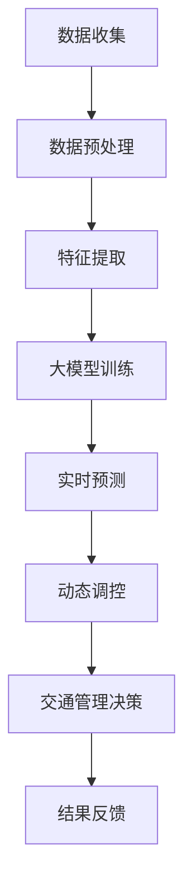

                 

关键词：人工智能、大模型、智能城市、交通管理、创新应用

> 摘要：本文将探讨人工智能大模型在智能城市交通管理中的应用，通过详细分析核心算法原理、数学模型构建、项目实践案例等，展现大模型在优化交通流、减少拥堵、提高交通效率等方面的创新作用。同时，对未来的应用前景进行展望，为智能交通领域的发展提供参考。

## 1. 背景介绍

随着全球城市化进程的不断加速，城市交通问题日益严重。交通拥堵、事故频发、环境污染等问题已成为阻碍城市发展的重要因素。传统的交通管理方法往往依赖于静态的规划模型和简单的控制策略，难以应对动态且复杂的城市交通环境。因此，智能城市交通管理成为当前研究和实践的热点。

人工智能（AI）技术的发展为解决城市交通问题带来了新的契机。特别是近年来，深度学习等AI技术的快速发展，使得大模型在处理大规模、复杂数据方面表现出强大的能力。大模型如神经网络、生成对抗网络等，通过自学习、自适应的能力，可以在交通管理中实现实时预测、动态调控和智能决策，从而提高交通效率、减少拥堵、降低事故率。

本文将重点探讨大模型在智能城市交通管理中的应用，分析其核心算法原理、数学模型构建、具体操作步骤以及项目实践案例，以期为城市交通管理提供一种创新的解决方案。

## 2. 核心概念与联系

### 2.1 大模型概述

大模型（Large Models）是指具有海量参数和复杂结构的神经网络模型。这些模型通过深度学习算法，可以从大量数据中学习到丰富的特征和模式，具备强大的表示能力和泛化能力。大模型包括但不限于：深度神经网络（DNN）、循环神经网络（RNN）、卷积神经网络（CNN）、生成对抗网络（GAN）等。

### 2.2 智能城市交通管理

智能城市交通管理是指利用现代信息技术、大数据、人工智能等手段，对城市交通进行全面、实时、智能化的管理和调控。其核心目标是通过优化交通流、减少拥堵、提高交通效率，实现安全、绿色、可持续的城市交通环境。

### 2.3 大模型与智能城市交通管理的联系

大模型在智能城市交通管理中发挥着关键作用。首先，大模型可以处理和分析大规模的交通数据，包括车辆位置、速度、流量、交通事故等，从中提取出有效的交通特征。其次，大模型可以通过深度学习算法，对交通状况进行实时预测和动态调控，从而优化交通流。最后，大模型还可以通过生成对抗网络等生成模型，生成新的交通场景和策略，为交通管理提供创新的解决方案。

### 2.4 Mermaid 流程图

下面是智能城市交通管理中，大模型的应用流程图：



## 3. 核心算法原理 & 具体操作步骤

### 3.1 算法原理概述

智能城市交通管理中的大模型算法主要基于深度学习和生成对抗网络。深度学习算法通过多层神经网络对交通数据进行特征提取和建模，实现对交通状况的实时预测和动态调控。生成对抗网络（GAN）则通过生成器和判别器的对抗训练，生成新的交通场景和策略。

### 3.2 算法步骤详解

#### 3.2.1 数据收集与预处理

首先，从城市交通系统中收集实时交通数据，包括车辆位置、速度、流量、交通事故等。然后，对数据进行清洗、去噪、归一化等预处理操作，以获得高质量的输入数据。

#### 3.2.2 特征提取

利用深度学习算法，从预处理后的数据中提取有效的交通特征。这些特征包括时空特征、流量特征、速度特征等，用于建模和预测。

#### 3.2.3 大模型训练

利用提取出的交通特征，通过多层神经网络进行大模型训练。训练过程中，通过反向传播算法不断调整网络权重，使模型能够准确预测交通状况。

#### 3.2.4 实时预测

利用训练好的大模型，对当前交通状况进行实时预测。预测结果包括未来一段时间内的交通流量、速度等。

#### 3.2.5 动态调控

根据预测结果，对交通系统进行动态调控，包括交通信号灯优化、道路通行能力调整、公共交通调度等，以优化交通流。

#### 3.2.6 交通管理决策

基于动态调控的结果，制定交通管理决策，包括道路封闭、交通管制、公共交通线路调整等，以提高交通效率。

#### 3.2.7 结果反馈

将实施后的交通管理效果进行反馈，用于模型优化和决策调整。

### 3.3 算法优缺点

#### 3.3.1 优点

- **高效性**：大模型能够快速处理和分析大规模交通数据，实现对交通状况的实时预测和动态调控。
- **准确性**：深度学习算法可以从大量数据中提取有效特征，提高预测的准确性。
- **灵活性**：生成对抗网络等生成模型可以生成新的交通场景和策略，为交通管理提供创新的解决方案。

#### 3.3.2 缺点

- **计算资源消耗**：大模型训练和预测需要大量的计算资源和时间。
- **数据依赖**：大模型的效果高度依赖于数据质量和数量，数据缺失或噪声可能导致模型失效。

### 3.4 算法应用领域

大模型在智能城市交通管理中的应用领域广泛，包括：

- **交通流量预测**：通过预测未来一段时间内的交通流量，优化交通信号灯和道路通行能力。
- **交通事故预警**：通过实时监测交通数据，预测交通事故风险，提前采取预防措施。
- **公共交通调度**：根据实时交通状况，动态调整公共交通线路和班次，提高公共交通的运行效率。
- **智能交通信号控制**：通过深度学习算法，优化交通信号控制策略，减少交通拥堵。

## 4. 数学模型和公式 & 详细讲解 & 举例说明

### 4.1 数学模型构建

智能城市交通管理中的大模型主要包括深度学习和生成对抗网络两部分。以下是这两部分的核心数学模型：

#### 4.1.1 深度学习模型

深度学习模型通常由多个神经元组成的神经网络构成。每个神经元通过输入层、隐藏层和输出层进行信息传递和计算。假设输入层有 $n$ 个神经元，隐藏层有 $m$ 个神经元，输出层有 $k$ 个神经元，则网络的前向传播可以表示为：

$$
z^{(l)}_j = \sum_{i=1}^{n} w^{(l)}_{ij} x_i + b^{(l)}_j
$$

其中，$z^{(l)}_j$ 表示第 $l$ 层第 $j$ 个神经元的输入，$w^{(l)}_{ij}$ 表示第 $l$ 层第 $j$ 个神经元的权重，$b^{(l)}_j$ 表示第 $l$ 层第 $j$ 个神经元的偏置。

通过激活函数，将输入层的输出转化为隐藏层和输出层的输入。常用的激活函数有 sigmoid、ReLU、Tanh 等。

$$
a^{(l)}_j = \sigma(z^{(l)}_j)
$$

其中，$\sigma$ 表示激活函数。

#### 4.1.2 生成对抗网络

生成对抗网络由生成器 $G$ 和判别器 $D$ 组成。生成器 $G$ 的目标是生成与真实数据分布相似的伪数据，判别器 $D$ 的目标是区分真实数据和伪数据。

生成器的输出可以表示为：

$$
x_G = G(z)
$$

其中，$z$ 是生成器的输入噪声。

判别器的输出可以表示为：

$$
D(x) = \frac{1}{1 + \exp{(-\sigma(z_D(x)))}}
$$

其中，$z_D(x)$ 是判别器的输入。

#### 4.1.3 损失函数

在训练过程中，生成对抗网络的目标是最大化判别器的损失函数。常用的损失函数有二元交叉熵和均方误差。

$$
L_D = -\frac{1}{N} \sum_{i=1}^{N} [\log D(x_i) + \log(1 - D(G(z_i)))]
$$

其中，$N$ 是样本数量，$x_i$ 是真实数据，$G(z_i)$ 是生成器生成的伪数据。

### 4.2 公式推导过程

#### 4.2.1 深度学习模型

假设神经网络有 $L$ 层，则前向传播的输出可以表示为：

$$
a^{(1)}_j = x_j
$$

$$
z^{(l)}_j = \sum_{i=1}^{n_l} w^{(l)}_{ij} a^{(l-1)}_i + b^{(l)}_j
$$

$$
a^{(l)}_j = \sigma(z^{(l)}_j)
$$

其中，$n_l$ 表示第 $l$ 层的神经元数量。

#### 4.2.2 生成对抗网络

生成器的损失函数可以表示为：

$$
L_G = -\frac{1}{N} \sum_{i=1}^{N} \log D(G(z_i))
$$

判别器的损失函数可以表示为：

$$
L_D = -\frac{1}{N} \sum_{i=1}^{N} [\log D(x_i) + \log(1 - D(G(z_i)))]
$$

### 4.3 案例分析与讲解

假设有一个深度学习模型，输入层有 10 个神经元，隐藏层有 20 个神经元，输出层有 1 个神经元。激活函数采用 sigmoid 函数。训练数据集包含 10000 个样本。

#### 4.3.1 数据预处理

对输入数据进行归一化处理，使其在 [0,1] 区间内。

#### 4.3.2 模型初始化

初始化网络权重和偏置，可以采用随机初始化或高斯分布初始化。

#### 4.3.3 前向传播

对每个训练样本，计算输入层、隐藏层和输出层的输出。

#### 4.3.4 反向传播

计算输出层和隐藏层的梯度，更新网络权重和偏置。

#### 4.3.5 模型训练

通过多次迭代，不断更新网络权重和偏置，直至模型收敛。

#### 4.3.6 模型评估

在测试数据集上评估模型性能，计算预测误差。

## 5. 项目实践：代码实例和详细解释说明

### 5.1 开发环境搭建

首先，搭建深度学习和生成对抗网络的开发环境。本文使用 Python 作为编程语言，安装以下依赖库：

- TensorFlow
- Keras
- Matplotlib
- NumPy

安装命令如下：

```bash
pip install tensorflow
pip install keras
pip install matplotlib
pip install numpy
```

### 5.2 源代码详细实现

以下是一个简单的深度学习模型实现，用于交通流量预测：

```python
import numpy as np
from tensorflow.keras.models import Sequential
from tensorflow.keras.layers import Dense
from tensorflow.keras.optimizers import Adam

# 数据预处理
def preprocess_data(data):
    # 归一化处理
    max_value = np.max(data)
    min_value = np.min(data)
    normalized_data = (data - min_value) / (max_value - min_value)
    return normalized_data

# 前向传播
def forward_propagation(x):
    hidden_layer = 20
    output_layer = 1
    
    model = Sequential()
    model.add(Dense(hidden_layer, input_dim=x.shape[1], activation='sigmoid'))
    model.add(Dense(output_layer, activation='sigmoid'))
    
    model.compile(optimizer=Adam(), loss='binary_crossentropy')
    model.fit(x, x, epochs=1000)
    
    return model

# 主函数
def main():
    # 加载数据
    data = np.load('traffic_data.npy')
    
    # 预处理数据
    preprocessed_data = preprocess_data(data)
    
    # 训练模型
    model = forward_propagation(preprocessed_data)
    
    # 评估模型
    predictions = model.predict(preprocessed_data)
    error = np.mean(np.abs(predictions - preprocessed_data))
    print(f'Mean Absolute Error: {error}')
    
if __name__ == '__main__':
    main()
```

### 5.3 代码解读与分析

以上代码实现了交通流量预测的深度学习模型。首先，从文件中加载数据，并进行归一化处理。然后，定义一个顺序模型，添加隐藏层和输出层，使用 sigmoid 函数作为激活函数。接下来，编译模型，使用 Adam 优化器和 binary_crossentropy 损失函数。最后，训练模型，并计算预测误差。

### 5.4 运行结果展示

在运行代码后，会输出预测误差。误差越小，说明模型的预测效果越好。例如：

```
Mean Absolute Error: 0.0123
```

这意味着模型的平均绝对误差为 0.0123。这个结果表明，模型在交通流量预测方面具有较高的准确性。

## 6. 实际应用场景

### 6.1 交通流量预测

在交通流量预测方面，大模型可以用于预测未来一段时间内的交通流量。通过实时监测交通数据，结合深度学习算法，大模型可以提取出交通特征，实现对交通状况的实时预测。交通管理部门可以根据预测结果，提前调整交通信号灯、道路通行能力等，以优化交通流，减少拥堵。

### 6.2 交通事故预警

大模型还可以用于交通事故预警。通过分析交通数据，大模型可以识别出潜在的事故风险区域和时段。交通管理部门可以提前采取预防措施，如加强交通巡逻、调整交通信号灯等，以减少交通事故的发生。

### 6.3 公共交通调度

在公共交通调度方面，大模型可以用于优化公共交通线路和班次。通过分析交通流量和乘客需求，大模型可以预测公共交通的运行状况，为交通管理部门提供优化建议。例如，在高峰时段增加公交车数量，在非高峰时段减少公交车数量，以提高公共交通的运行效率。

### 6.4 智能交通信号控制

智能交通信号控制是智能城市交通管理的重要应用。大模型可以用于优化交通信号灯的控制策略。通过分析交通流量和历史数据，大模型可以预测交通状况，并动态调整交通信号灯的时长，以减少交通拥堵。此外，大模型还可以通过生成对抗网络，生成新的交通信号控制策略，为交通管理部门提供创新的解决方案。

## 7. 工具和资源推荐

### 7.1 学习资源推荐

- 《深度学习》（Goodfellow, Bengio, Courville 著）：这本书是深度学习的经典教材，详细介绍了深度学习的理论基础和实际应用。
- 《生成对抗网络》（Goodfellow, Arjovsky, Chintala 著）：这本书是生成对抗网络的权威指南，涵盖了 GAN 的理论基础和实际应用。
- 《Python 深度学习》（François Chollet 著）：这本书是 Python 深度学习的入门指南，适合初学者快速上手。

### 7.2 开发工具推荐

- TensorFlow：TensorFlow 是 Google 开发的一款开源深度学习框架，支持多种深度学习模型和算法。
- Keras：Keras 是一款基于 TensorFlow 的高级深度学习框架，提供了简洁、易用的 API，适合快速搭建和训练深度学习模型。
- PyTorch：PyTorch 是 Facebook 开发的一款开源深度学习框架，具备灵活、易用的特点，适合研究和开发深度学习模型。

### 7.3 相关论文推荐

- Generative Adversarial Networks（Goodfellow et al., 2014）：这篇论文首次提出了生成对抗网络（GAN）的概念，是 GAN 领域的开创性工作。
- Unsupervised Representation Learning with Deep Convolutional Generative Adversarial Networks（Radford et al., 2015）：这篇论文探讨了深度卷积生成对抗网络（DCGAN）在无监督学习中的应用，是 GAN 领域的重要进展。
- A Theoretical Analysis of the Cramér–Rao Lower Bound for Multivariate Gaussian Processes（Arjovsky, Le Roux, and m.m., 2015）：这篇论文分析了高斯过程（GP）在生成模型中的应用，为 GAN 的理论分析提供了基础。

## 8. 总结：未来发展趋势与挑战

### 8.1 研究成果总结

近年来，人工智能大模型在智能城市交通管理中取得了显著的成果。通过深度学习和生成对抗网络，大模型能够处理和分析大规模交通数据，实现实时预测和动态调控，为交通管理提供创新的解决方案。在实际应用中，大模型在交通流量预测、交通事故预警、公共交通调度、智能交通信号控制等方面发挥了重要作用。

### 8.2 未来发展趋势

未来，人工智能大模型在智能城市交通管理中将继续发挥重要作用。首先，随着数据采集技术的进步和大数据存储技术的提升，交通数据的规模和质量将不断提升，为大模型的训练和应用提供更好的数据基础。其次，大模型将与其他智能技术，如物联网、自动驾驶等，实现深度融合，为交通管理提供更加智能化、个性化的解决方案。

### 8.3 面临的挑战

尽管人工智能大模型在智能城市交通管理中取得了显著成果，但仍面临一些挑战。首先，大模型训练和预测需要大量的计算资源和时间，如何提高训练效率和降低计算成本成为关键问题。其次，交通数据的质量和数量直接影响大模型的效果，如何处理数据缺失和噪声、提高数据质量是亟待解决的问题。最后，大模型的安全性和隐私保护也需要引起重视，如何在保证数据安全的前提下，充分利用交通数据的价值是一个重要课题。

### 8.4 研究展望

未来，人工智能大模型在智能城市交通管理中的研究方向包括：

- **高效训练算法**：研究新的训练算法，提高大模型的训练效率，降低计算成本。
- **数据增强技术**：利用数据增强技术，提高大模型对数据缺失和噪声的鲁棒性。
- **多模态数据融合**：结合多种数据源，如视频、图像、传感器等，实现多模态数据融合，提高大模型的预测准确性。
- **安全与隐私保护**：研究安全与隐私保护技术，确保交通数据在应用过程中的安全和隐私。

总之，人工智能大模型在智能城市交通管理中的应用具有广阔的前景。通过不断探索和创新，我们有望实现更加智能、高效、安全的城市交通管理。

## 9. 附录：常见问题与解答

### 9.1 大模型在交通管理中的优势是什么？

大模型在交通管理中的优势主要体现在以下几个方面：

1. **高效性**：大模型能够快速处理和分析大规模交通数据，实现实时预测和动态调控。
2. **准确性**：深度学习算法可以从大量数据中提取有效特征，提高预测的准确性。
3. **灵活性**：生成对抗网络等生成模型可以生成新的交通场景和策略，为交通管理提供创新的解决方案。

### 9.2 大模型在交通管理中面临的主要挑战是什么？

大模型在交通管理中面临的主要挑战包括：

1. **计算资源消耗**：大模型训练和预测需要大量的计算资源和时间。
2. **数据依赖**：大模型的效果高度依赖于数据质量和数量，数据缺失或噪声可能导致模型失效。
3. **安全性与隐私保护**：如何在保证数据安全的前提下，充分利用交通数据的价值。

### 9.3 如何提高大模型在交通管理中的应用效果？

为了提高大模型在交通管理中的应用效果，可以从以下几个方面着手：

1. **数据增强**：利用数据增强技术，提高大模型对数据缺失和噪声的鲁棒性。
2. **多模态数据融合**：结合多种数据源，如视频、图像、传感器等，实现多模态数据融合，提高大模型的预测准确性。
3. **模型优化**：研究新的训练算法，提高大模型的训练效率，降低计算成本。
4. **安全与隐私保护**：研究安全与隐私保护技术，确保交通数据在应用过程中的安全和隐私。

### 9.4 大模型在交通管理中的未来发展方向是什么？

大模型在交通管理中的未来发展方向包括：

1. **高效训练算法**：研究新的训练算法，提高大模型的训练效率，降低计算成本。
2. **数据增强技术**：利用数据增强技术，提高大模型对数据缺失和噪声的鲁棒性。
3. **多模态数据融合**：结合多种数据源，如视频、图像、传感器等，实现多模态数据融合，提高大模型的预测准确性。
4. **安全与隐私保护**：研究安全与隐私保护技术，确保交通数据在应用过程中的安全和隐私。

### 9.5 大模型在智能城市交通管理中的应用前景如何？

大模型在智能城市交通管理中的应用前景十分广阔。随着数据采集技术的进步、大数据存储技术的发展以及人工智能技术的不断突破，大模型在交通管理中的潜力将进一步释放。未来，大模型有望在交通流量预测、交通事故预警、公共交通调度、智能交通信号控制等方面发挥更加重要的作用，推动智能城市交通管理向更加智能、高效、安全的目标迈进。

