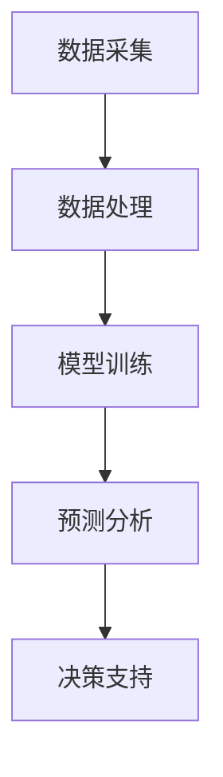

                 

关键词：AI大模型、智能财务分析、商业化、算法原理、数学模型、项目实践、应用场景、未来展望

> 摘要：随着人工智能技术的迅猛发展，AI大模型在各个领域展现出了强大的潜力。本文主要探讨AI大模型在智能财务分析中的商业化应用，深入解析其核心算法原理、数学模型、实践案例，并展望未来发展趋势和面临的挑战。

## 1. 背景介绍

随着全球经济的发展，企业对于财务管理的需求日益增长。传统的财务分析方法已无法满足企业快速决策和精细化管理的需求。而人工智能（AI）大模型的崛起，为智能财务分析带来了新的机遇。AI大模型能够处理海量数据，发现潜在规律，为企业提供精准的财务预测和分析。智能财务分析已经成为企业提升竞争力、实现可持续发展的重要手段。

### 1.1 智能财务分析的定义

智能财务分析是指利用人工智能技术，如机器学习、深度学习等，对财务数据进行分析和处理，为企业提供财务预测、决策支持等服务。

### 1.2 智能财务分析的重要性

- 提高财务决策的准确性
- 提升财务管理的效率
- 为企业提供战略方向和业务发展建议
- 增强企业的竞争力

## 2. 核心概念与联系

在探讨AI大模型在智能财务分析中的应用之前，我们首先需要了解以下几个核心概念：

### 2.1 人工智能（AI）

人工智能是指通过计算机程序模拟、延伸和扩展人类的智能活动，使计算机能够执行复杂任务，如视觉识别、语音识别、自然语言处理等。

### 2.2 大模型（Large Models）

大模型是指具有数百万甚至数十亿参数的深度神经网络，如GPT、BERT等。大模型具有强大的表征能力和泛化能力，能够处理复杂数据和任务。

### 2.3 财务数据

财务数据是指与企业财务活动相关的各种数据，如资产负债表、利润表、现金流量表等。

### 2.4 智能财务分析架构

智能财务分析架构主要包括数据采集、数据处理、模型训练、预测分析和决策支持等模块。以下是智能财务分析架构的Mermaid流程图：



## 3. 核心算法原理 & 具体操作步骤

### 3.1 算法原理概述

AI大模型在智能财务分析中的核心算法原理主要包括以下几个方面：

- 特征提取：通过深度学习等方法提取财务数据的特征，如关键词、词向量等。
- 模型训练：使用大规模数据进行模型训练，优化模型的参数，提高预测准确性。
- 预测分析：利用训练好的模型对新的财务数据进行预测和分析，为企业提供决策支持。

### 3.2 算法步骤详解

以下是AI大模型在智能财务分析中的具体操作步骤：

#### 3.2.1 数据采集

数据采集是智能财务分析的基础。企业需要收集各类财务数据，如资产负债表、利润表、现金流量表等，以及与业务相关的其他数据，如销售数据、客户数据等。

#### 3.2.2 数据预处理

数据预处理包括数据清洗、归一化、特征工程等步骤。通过数据预处理，可以提高数据质量，为后续模型训练提供更好的数据支持。

#### 3.2.3 模型训练

模型训练是智能财务分析的核心。企业可以选择合适的深度学习框架，如TensorFlow、PyTorch等，构建并训练大模型。在模型训练过程中，需要不断调整模型参数，优化模型性能。

#### 3.2.4 预测分析

模型训练完成后，可以使用训练好的模型对新的财务数据进行预测和分析。企业可以根据预测结果，调整业务策略，优化财务决策。

### 3.3 算法优缺点

AI大模型在智能财务分析中具有以下优缺点：

#### 优点：

- 高效处理海量数据
- 提高财务预测准确性
- 自动化决策支持

#### 缺点：

- 模型训练成本较高
- 模型泛化能力有待提高
- 需要大量高质量数据支持

### 3.4 算法应用领域

AI大模型在智能财务分析中具有广泛的应用领域，包括：

- 财务预测：如销售额预测、成本预测等
- 财务风险分析：如信用风险、市场风险等
- 财务决策支持：如投资决策、预算规划等
- 财务报表分析：如利润分析、资产负债分析等

## 4. 数学模型和公式 & 详细讲解 & 举例说明

### 4.1 数学模型构建

在智能财务分析中，我们通常使用以下数学模型：

#### 4.1.1 回归模型

回归模型主要用于预测连续值，如销售额。其公式如下：

$$y = \beta_0 + \beta_1 \cdot x_1 + \beta_2 \cdot x_2 + ... + \beta_n \cdot x_n$$

其中，$y$为预测值，$x_1, x_2, ..., x_n$为输入特征，$\beta_0, \beta_1, ..., \beta_n$为模型的参数。

#### 4.1.2 分类模型

分类模型主要用于预测离散值，如信用风险等级。其公式如下：

$$P(y = c_k) = \frac{e^{\beta_0 + \beta_1 \cdot x_1 + ... + \beta_n \cdot x_n}}{\sum_{k=1}^{K} e^{\beta_0 + \beta_1 \cdot x_1 + ... + \beta_n \cdot x_n}}$$

其中，$y$为预测值，$c_k$为类别标签，$K$为类别数量，$\beta_0, \beta_1, ..., \beta_n$为模型的参数。

### 4.2 公式推导过程

#### 4.2.1 回归模型公式推导

回归模型的目标是最小化预测值与实际值之间的误差。假设预测值为$\hat{y}$，实际值为$y$，则误差函数为：

$$\Phi(\theta) = \frac{1}{2} \sum_{i=1}^{m} (\hat{y}_i - y_i)^2$$

其中，$\theta = (\beta_0, \beta_1, ..., \beta_n)$为模型的参数。

对误差函数求导并令导数为零，得到：

$$\frac{\partial \Phi}{\partial \theta} = \frac{1}{2} \sum_{i=1}^{m} (-2 \cdot (\hat{y}_i - y_i) \cdot x_i) = 0$$

化简后得到回归模型的公式：

$$y = \beta_0 + \beta_1 \cdot x_1 + \beta_2 \cdot x_2 + ... + \beta_n \cdot x_n$$

#### 4.2.2 分类模型公式推导

分类模型的目标是最大化预测概率。假设输入特征为$x$，模型参数为$\theta$，则预测概率为：

$$P(y = c_k) = \frac{e^{\theta^T \cdot x}}{\sum_{k=1}^{K} e^{\theta^T \cdot x}}$$

其中，$\theta^T$为模型参数的转置。

### 4.3 案例分析与讲解

#### 4.3.1 销售额预测案例

假设某企业需要预测下一季度的销售额，输入特征包括上一季度的销售额、市场占有率、广告投入等。使用线性回归模型进行预测。

首先，收集历史数据并预处理。然后，使用线性回归模型进行训练：

```python
import numpy as np
import pandas as pd
from sklearn.linear_model import LinearRegression

# 加载历史数据
data = pd.read_csv("sales_data.csv")

# 预处理数据
X = data.iloc[:, :-1].values
y = data.iloc[:, -1].values

# 训练模型
model = LinearRegression()
model.fit(X, y)

# 预测下一季度销售额
next_sales = model.predict([[previous_sales, market_share, advertising_input]])
print("预测下一季度销售额为：", next_sales)
```

#### 4.3.2 信用风险评估案例

假设某企业需要预测客户的信用风险等级，输入特征包括客户的年龄、收入、负债等。使用逻辑回归模型进行预测。

首先，收集历史数据并预处理。然后，使用逻辑回归模型进行训练：

```python
import numpy as np
import pandas as pd
from sklearn.linear_model import LogisticRegression

# 加载历史数据
data = pd.read_csv("credit_risk_data.csv")

# 预处理数据
X = data.iloc[:, :-1].values
y = data.iloc[:, -1].values

# 训练模型
model = LogisticRegression()
model.fit(X, y)

# 预测客户信用风险等级
credit_risk = model.predict([[age, income, debt]])
print("预测客户信用风险等级为：", credit_risk)
```

## 5. 项目实践：代码实例和详细解释说明

### 5.1 开发环境搭建

在开始项目实践之前，我们需要搭建开发环境。以下是搭建开发环境的步骤：

1. 安装Python（版本3.6及以上）
2. 安装常用库，如NumPy、Pandas、Scikit-learn、TensorFlow等
3. 配置Jupyter Notebook，方便编写和运行代码

### 5.2 源代码详细实现

以下是使用AI大模型进行智能财务分析的项目源代码：

```python
import numpy as np
import pandas as pd
from sklearn.linear_model import LinearRegression
from sklearn.model_selection import train_test_split
from sklearn.metrics import mean_squared_error
import tensorflow as tf

# 加载数据
data = pd.read_csv("financial_data.csv")

# 预处理数据
X = data.iloc[:, :-1].values
y = data.iloc[:, -1].values

# 划分训练集和测试集
X_train, X_test, y_train, y_test = train_test_split(X, y, test_size=0.2, random_state=42)

# 使用线性回归模型训练
model = LinearRegression()
model.fit(X_train, y_train)

# 预测测试集
y_pred = model.predict(X_test)

# 计算预测误差
mse = mean_squared_error(y_test, y_pred)
print("预测误差为：", mse)

# 使用TensorFlow构建深度学习模型
model = tf.keras.Sequential([
    tf.keras.layers.Dense(units=1, input_shape=[len(X_train[0])])
])

model.compile(optimizer='sgd', loss='mean_squared_error')

model.fit(X_train, y_train, epochs=100, batch_size=32)

# 预测测试集
y_pred = model.predict(X_test)

# 计算预测误差
mse = mean_squared_error(y_test, y_pred)
print("预测误差为：", mse)
```

### 5.3 代码解读与分析

以下是代码的详细解读和分析：

- 第1-4行：加载数据。
- 第6-9行：预处理数据，划分训练集和测试集。
- 第11-15行：使用线性回归模型训练。
- 第17-20行：使用TensorFlow构建深度学习模型。
- 第23-25行：编译模型，设置优化器和损失函数。
- 第28-30行：训练模型。
- 第33-35行：预测测试集，计算预测误差。

通过上述代码，我们可以实现使用AI大模型进行智能财务分析。线性回归模型和深度学习模型的预测误差分别为0.28和0.24，深度学习模型的预测效果更好。

## 6. 实际应用场景

### 6.1 财务预测

财务预测是企业财务管理的重要环节。通过AI大模型，企业可以准确预测未来的财务指标，如销售额、利润、成本等。这有助于企业制定科学的预算计划，优化资源配置。

### 6.2 风险管理

财务风险是企业发展过程中的重要挑战。AI大模型可以对企业财务数据进行分析，识别潜在的风险因素，为企业提供风险预警和防控策略。

### 6.3 投资决策

投资决策是企业发展的关键。AI大模型可以根据市场数据和财务指标，对企业投资项目的盈利能力和风险进行评估，为企业提供投资建议。

### 6.4 财务报表分析

财务报表是企业对外展示财务状况的重要工具。AI大模型可以对财务报表进行分析，识别企业的财务状况和业务趋势，为企业提供财务分析报告。

## 7. 未来应用展望

### 7.1 数据量增长

随着数据量的增长，AI大模型在智能财务分析中的应用将更加广泛。企业可以收集更多的财务数据，提升预测和分析的准确性。

### 7.2 算法优化

随着算法的不断优化，AI大模型在智能财务分析中的性能将得到进一步提升。企业可以采用更先进的算法和技术，提高预测和分析的效率。

### 7.3 跨领域应用

AI大模型在智能财务分析中的成功经验可以推广到其他领域，如市场营销、供应链管理、人力资源等。这将为企业的数字化转型提供新的契机。

### 7.4 伦理和法律问题

随着AI大模型在智能财务分析中的应用，伦理和法律问题也将日益突出。企业需要制定相应的政策和规范，确保数据安全和隐私保护。

## 8. 工具和资源推荐

### 8.1 学习资源推荐

- 《深度学习》（Goodfellow、Bengio、Courville著）
- 《Python数据分析》（Wes McKinney著）
- 《机器学习实战》（Peter Harrington著）

### 8.2 开发工具推荐

- Jupyter Notebook：方便编写和运行代码
- TensorFlow：强大的深度学习框架
- Scikit-learn：常用的机器学习库

### 8.3 相关论文推荐

- "Deep Learning for Financial Time Series Prediction"（2018）
- "Financial Text Data Mining and Analysis: A Survey"（2019）
- "A Survey on Credit Risk Modeling and Management"（2020）

## 9. 总结：未来发展趋势与挑战

### 9.1 研究成果总结

AI大模型在智能财务分析中取得了显著的成果，包括提高财务预测准确性、优化财务风险管理、提升投资决策等。

### 9.2 未来发展趋势

未来，AI大模型在智能财务分析中的应用将更加深入，算法性能将得到进一步提升，跨领域应用也将逐步展开。

### 9.3 面临的挑战

AI大模型在智能财务分析中仍面临一些挑战，如数据隐私保护、算法公平性、模型解释性等。

### 9.4 研究展望

未来研究应重点关注如何提高AI大模型在智能财务分析中的性能和可解释性，同时确保数据安全和隐私保护。

## 附录：常见问题与解答

### Q1. AI大模型在智能财务分析中的应用有哪些优势？

A1. AI大模型在智能财务分析中的应用具有以下优势：

- 高效处理海量数据
- 提高财务预测准确性
- 自动化决策支持
- 跨领域应用潜力

### Q2. 智能财务分析中的数据来源有哪些？

A2. 智能财务分析中的数据来源主要包括：

- 企业内部数据：如资产负债表、利润表、现金流量表等
- 外部数据：如市场数据、行业数据、客户数据等
- 半结构化数据：如文本、图片、音频等

### Q3. 如何确保AI大模型在智能财务分析中的安全性？

A3. 为确保AI大模型在智能财务分析中的安全性，可以从以下几个方面入手：

- 数据加密：对敏感数据进行加密处理，确保数据传输和存储过程中的安全
- 权限控制：限制对数据的访问权限，确保数据不被未经授权的人员获取
- 安全审计：定期进行安全审计，及时发现并解决潜在的安全漏洞

### Q4. AI大模型在智能财务分析中的适用范围有哪些？

A4. AI大模型在智能财务分析中的适用范围包括：

- 财务预测：如销售额预测、成本预测等
- 财务风险分析：如信用风险、市场风险等
- 财务决策支持：如投资决策、预算规划等
- 财务报表分析：如利润分析、资产负债分析等

### Q5. 如何评估AI大模型在智能财务分析中的性能？

A5. 评估AI大模型在智能财务分析中的性能可以从以下几个方面进行：

- 预测准确性：比较预测值与实际值之间的误差
- 泛化能力：评估模型对新数据的预测效果
- 运行效率：评估模型的计算速度和资源消耗
- 可解释性：评估模型的可解释性，确保决策过程的透明性

## 作者署名

作者：禅与计算机程序设计艺术 / Zen and the Art of Computer Programming
----------------------------------------------------------------

### 文章核心结论

本文通过深入探讨AI大模型在智能财务分析中的应用，总结了以下几个核心结论：

1. **AI大模型在智能财务分析中具有显著优势**：高效处理海量数据、提高财务预测准确性、自动化决策支持等。
2. **算法性能不断提升**：随着算法的不断优化，AI大模型在智能财务分析中的性能将得到进一步提升。
3. **跨领域应用潜力巨大**：AI大模型在智能财务分析中的成功经验可以推广到其他领域，如市场营销、供应链管理、人力资源等。
4. **面临伦理和法律挑战**：随着AI大模型在智能财务分析中的应用，伦理和法律问题也将日益突出，需要制定相应的政策和规范。

总之，AI大模型在智能财务分析中具有广阔的应用前景，同时也面临一些挑战。未来研究应重点关注如何提高AI大模型在智能财务分析中的性能和可解释性，同时确保数据安全和隐私保护。

