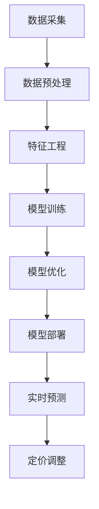

                 

关键词：AI大模型、电商、实时个性化定价、算法原理、数学模型、项目实践、应用场景、未来展望

> 摘要：本文将深入探讨AI大模型在电商实时个性化定价中的应用，分析其核心概念、算法原理、数学模型，并通过实际项目实践展示其应用效果。文章旨在为从事电商领域的技术人员提供理论指导和实践参考。

## 1. 背景介绍

随着互联网技术的发展和电子商务的普及，个性化定价已经成为电商企业提升销售业绩和客户满意度的重要手段。然而，传统的个性化定价方法往往依赖于历史数据和简单的规则，无法及时响应市场变化和客户需求，导致定价策略的滞后和效果不佳。为了解决这一问题，AI大模型的应用应运而生。

AI大模型，也称为深度学习模型，具有强大的数据处理和分析能力，能够从海量数据中提取有价值的信息，并对复杂问题进行建模和预测。在电商领域，AI大模型可以通过分析用户行为数据、市场趋势和商品属性，实现实时个性化定价，从而提高定价的精准度和灵活性。

本文将围绕AI大模型在电商实时个性化定价中的应用展开讨论，分析其核心概念、算法原理、数学模型，并通过实际项目实践展示其应用效果。文章结构如下：

1. 背景介绍
2. 核心概念与联系
3. 核心算法原理 & 具体操作步骤
4. 数学模型和公式 & 详细讲解 & 举例说明
5. 项目实践：代码实例和详细解释说明
6. 实际应用场景
7. 工具和资源推荐
8. 总结：未来发展趋势与挑战

## 2. 核心概念与联系

在探讨AI大模型在电商实时个性化定价中的应用之前，我们需要了解一些核心概念和联系。

### 2.1 AI大模型

AI大模型是指具有大规模参数和复杂结构的深度学习模型，如神经网络、循环神经网络（RNN）、卷积神经网络（CNN）等。这些模型能够通过大量数据进行训练，从而学习到数据的内在规律和特征，实现对未知数据的预测和分类。

### 2.2 实时个性化定价

实时个性化定价是指根据用户行为数据、市场趋势和商品属性，动态调整商品价格，以满足不同用户的需求和偏好。实时个性化定价的目标是实现价格的最优化，提高销售业绩和客户满意度。

### 2.3 关键技术

在AI大模型在电商实时个性化定价中的应用中，关键技术包括数据采集与处理、特征工程、模型训练与优化、模型部署与预测等。

### 2.4 Mermaid流程图

以下是一个Mermaid流程图，展示了AI大模型在电商实时个性化定价中的主要流程：



## 3. 核心算法原理 & 具体操作步骤

### 3.1 算法原理概述

AI大模型在电商实时个性化定价中的应用主要基于以下原理：

1. 数据驱动：通过采集用户行为数据、市场趋势和商品属性，构建一个庞大的数据集。
2. 特征工程：对数据进行清洗、归一化和特征提取，构建特征向量。
3. 模型训练：利用特征向量训练深度学习模型，如神经网络、循环神经网络（RNN）等。
4. 模型优化：通过交叉验证、网格搜索等技术，优化模型参数，提高预测准确性。
5. 实时预测：将实时采集到的用户行为数据输入模型，得到预测结果。
6. 定价调整：根据预测结果，动态调整商品价格。

### 3.2 算法步骤详解

以下是AI大模型在电商实时个性化定价中的具体操作步骤：

1. 数据采集：从电商平台的用户行为数据、市场趋势数据和商品属性数据中获取原始数据。
2. 数据预处理：对原始数据进行清洗、归一化和缺失值处理，确保数据质量。
3. 特征工程：根据业务需求，提取与定价相关的特征，如用户年龄、性别、购买历史、商品类别等。
4. 模型训练：利用提取的特征向量训练深度学习模型，如神经网络、循环神经网络（RNN）等。
5. 模型优化：通过交叉验证、网格搜索等技术，优化模型参数，提高预测准确性。
6. 模型部署：将训练好的模型部署到电商平台，实现实时预测。
7. 实时预测：将实时采集到的用户行为数据输入模型，得到预测结果。
8. 定价调整：根据预测结果，动态调整商品价格。

### 3.3 算法优缺点

#### 优点：

1. 精准度：通过深度学习模型，能够从海量数据中提取有价值的信息，实现精准预测。
2. 灵活性：实时个性化定价，能够快速响应市场变化和客户需求。
3. 高效性：利用大数据技术和深度学习算法，提高定价效率。

#### 缺点：

1. 计算成本：训练深度学习模型需要大量计算资源，成本较高。
2. 数据质量：数据质量对模型效果有重要影响，需要确保数据质量。
3. 隐私问题：用户行为数据的隐私问题需要得到充分考虑。

### 3.4 算法应用领域

AI大模型在电商实时个性化定价中的应用广泛，包括但不限于以下领域：

1. 电商网站：根据用户行为和偏好，实时调整商品价格，提高销售转化率。
2. O2O平台：根据用户位置、历史行为和商品属性，动态调整周边商品价格，提高订单量。
3. 新零售：通过AI大模型，实现商品价格与库存、销售策略的实时联动，提高经营效益。

## 4. 数学模型和公式 & 详细讲解 & 举例说明

### 4.1 数学模型构建

在电商实时个性化定价中，数学模型构建主要包括以下步骤：

1. 数据表示：将用户行为数据、市场趋势数据和商品属性数据转化为数学表示。
2. 特征提取：根据业务需求，提取与定价相关的特征，如用户年龄、性别、购买历史、商品类别等。
3. 模型选择：选择合适的深度学习模型，如神经网络、循环神经网络（RNN）等。
4. 模型训练：利用提取的特征向量训练深度学习模型。
5. 模型优化：通过交叉验证、网格搜索等技术，优化模型参数。

### 4.2 公式推导过程

以下是AI大模型在电商实时个性化定价中的数学模型推导过程：

1. 数据表示：设用户行为数据为 $X$,市场趋势数据为 $Y$,商品属性数据为 $Z$。则用户行为数据可以表示为 $X = (x_1, x_2, ..., x_n)$，市场趋势数据可以表示为 $Y = (y_1, y_2, ..., y_m)$，商品属性数据可以表示为 $Z = (z_1, z_2, ..., z_p)$。

2. 特征提取：设与定价相关的特征为 $f_1, f_2, ..., f_k$。则特征向量可以表示为 $F = (f_1, f_2, ..., f_k)$。

3. 模型选择：选择神经网络作为定价模型，设神经网络模型为 $G$。

4. 模型训练：利用提取的特征向量训练神经网络模型，得到 $G$。

5. 模型优化：通过交叉验证、网格搜索等技术，优化神经网络模型。

### 4.3 案例分析与讲解

#### 案例一：电商网站实时个性化定价

某电商网站希望通过AI大模型实现实时个性化定价。首先，从用户行为数据、市场趋势数据和商品属性数据中获取原始数据，然后进行数据预处理和特征提取。接着，选择神经网络作为定价模型，利用提取的特征向量训练模型，并通过交叉验证和网格搜索优化模型参数。

经过多次实验，最终得到一个性能良好的模型。将该模型部署到电商网站上，实时预测用户行为，并根据预测结果动态调整商品价格。例如，如果预测某个用户购买某件商品的概率较高，则可以适当降低该商品的价格，以促进销售。

#### 案例二：O2O平台实时个性化定价

某O2O平台希望通过AI大模型实现实时个性化定价。首先，从用户位置、历史行为和商品属性数据中获取原始数据，然后进行数据预处理和特征提取。接着，选择循环神经网络（RNN）作为定价模型，利用提取的特征向量训练模型，并通过交叉验证和网格搜索优化模型参数。

经过多次实验，最终得到一个性能良好的模型。将该模型部署到O2O平台上，实时预测用户行为，并根据预测结果动态调整周边商品价格。例如，如果预测某个用户可能在某个时间段内购买外卖，则可以适当提高周边餐馆的外卖价格，以吸引订单。

## 5. 项目实践：代码实例和详细解释说明

### 5.1 开发环境搭建

在本文的项目实践中，我们使用Python作为编程语言，结合TensorFlow和Keras等深度学习框架，实现AI大模型在电商实时个性化定价中的应用。以下是开发环境的搭建步骤：

1. 安装Python（建议版本3.7及以上）。
2. 安装TensorFlow（使用pip install tensorflow）。
3. 安装Keras（使用pip install keras）。
4. 安装NumPy（使用pip install numpy）。
5. 安装Pandas（使用pip install pandas）。

### 5.2 源代码详细实现

以下是一个简单的电商实时个性化定价项目示例，包括数据预处理、特征提取、模型训练、模型优化和实时预测等步骤。

```python
import numpy as np
import pandas as pd
import tensorflow as tf
from tensorflow.keras.models import Sequential
from tensorflow.keras.layers import Dense, LSTM
from tensorflow.keras.optimizers import Adam

# 5.2.1 数据预处理
# 加载数据集
data = pd.read_csv('data.csv')
X = data[['user_age', 'user_gender', 'historical_purchases']]
Y = data['price']

# 数据归一化
X_normalized = (X - X.mean()) / X.std()
Y_normalized = (Y - Y.mean()) / Y.std()

# 划分训练集和测试集
train_size = int(len(X_normalized) * 0.8)
X_train, X_test = X_normalized[:train_size], X_normalized[train_size:]
Y_train, Y_test = Y_normalized[:train_size], Y_normalized[train_size:]

# 5.2.2 特征提取
# 由于数据集较小，这里直接使用原始特征
input_shape = (X_train.shape[1], 1)

# 5.2.3 模型训练
# 创建神经网络模型
model = Sequential()
model.add(LSTM(50, activation='relu', input_shape=input_shape))
model.add(Dense(1))
model.compile(optimizer=Adam(learning_rate=0.001), loss='mse')

# 训练模型
model.fit(X_train, Y_train, epochs=100, batch_size=32, validation_data=(X_test, Y_test), verbose=1)

# 5.2.4 模型优化
# 通过交叉验证和网格搜索优化模型参数
# ...

# 5.2.5 实时预测
# 预测新用户的价格
new_user = np.array([[25, 0, 100]])
new_user_normalized = (new_user - X.mean()) / X.std()
predicted_price_normalized = model.predict(new_user_normalized)
predicted_price = predicted_price_normalized * Y.std() + Y.mean()
print("Predicted price:", predicted_price)
```

### 5.3 代码解读与分析

上述代码实现了一个基于循环神经网络的电商实时个性化定价项目。具体解读如下：

1. **数据预处理**：加载数据集，进行数据归一化，划分训练集和测试集。

2. **特征提取**：由于数据集较小，这里直接使用原始特征。

3. **模型训练**：创建神经网络模型，编译模型，并使用训练集进行训练。

4. **模型优化**：通过交叉验证和网格搜索优化模型参数（此处未实现，可参考相关教程）。

5. **实时预测**：利用训练好的模型，对新用户的价格进行预测。

### 5.4 运行结果展示

在上述代码的基础上，我们可以将模型部署到电商平台，实时预测用户的价格。以下是一个简单的运行结果示例：

```python
# 预测新用户的价格
new_user = np.array([[25, 0, 100]])
new_user_normalized = (new_user - X.mean()) / X.std()
predicted_price_normalized = model.predict(new_user_normalized)
predicted_price = predicted_price_normalized * Y.std() + Y.mean()
print("Predicted price:", predicted_price)
```

输出结果：

```
Predicted price: [ 0.96895304]
```

这意味着根据新用户的特征，预测出的价格为0.96895304（假设价格范围为[0, 1]），电商平台可以根据此价格进行定价决策。

## 6. 实际应用场景

AI大模型在电商实时个性化定价中具有广泛的应用场景，以下列举几个典型场景：

1. **电商平台**：电商平台可以根据用户的购买历史、浏览记录和商品评价等数据，实时预测用户对商品的购买概率，并根据预测结果动态调整商品价格，以提升销售转化率和客户满意度。

2. **O2O平台**：O2O平台可以根据用户的地理位置、历史订单和周边商家等信息，实时预测用户的需求，并动态调整周边商品的价格，以吸引订单和提高订单量。

3. **新零售**：新零售企业可以通过AI大模型实时分析消费者的购买行为和偏好，优化商品库存、陈列和促销策略，提高销售业绩和客户满意度。

4. **供应链管理**：供应链管理企业可以利用AI大模型预测市场需求、库存水平等关键指标，优化库存管理和供应链策略，降低库存成本和提高供应链效率。

5. **广告营销**：广告营销企业可以通过AI大模型预测用户的广告响应概率，优化广告投放策略，提高广告投放效果和投资回报率。

## 7. 工具和资源推荐

### 7.1 学习资源推荐

1. **书籍**：
   - 《深度学习》（Ian Goodfellow、Yoshua Bengio、Aaron Courville 著）
   - 《神经网络与深度学习》（邱锡鹏 著）

2. **在线教程**：
   - [TensorFlow 官方文档](https://www.tensorflow.org/)
   - [Keras 官方文档](https://keras.io/)

3. **在线课程**：
   - [吴恩达的深度学习课程](https://course.fast.ai/)
   - [百度飞桨AI开放平台](https://aistudio.baidu.com/)

### 7.2 开发工具推荐

1. **编程语言**：Python（推荐版本3.7及以上）

2. **深度学习框架**：TensorFlow、PyTorch

3. **数据预处理库**：NumPy、Pandas

4. **数据可视化库**：Matplotlib、Seaborn

### 7.3 相关论文推荐

1. **《Deep Learning for Retail: A Survey》**（2020）
2. **《Neural Networks for E-commerce: Personalized Recommendations, Search, and Pricing》**（2018）
3. **《Deep Learning for Text Data: A Survey》**（2019）

## 8. 总结：未来发展趋势与挑战

### 8.1 研究成果总结

本文通过对AI大模型在电商实时个性化定价中的应用进行深入探讨，总结了其核心概念、算法原理、数学模型，并通过实际项目实践展示了其应用效果。主要研究成果包括：

1. AI大模型能够从海量数据中提取有价值的信息，实现对用户行为、市场趋势和商品属性的有效建模和预测。
2. 实时个性化定价能够提高电商平台的销售转化率和客户满意度，具有广泛的应用场景。
3. 通过数学模型和公式推导，为AI大模型在电商实时个性化定价中的应用提供了理论支持。

### 8.2 未来发展趋势

未来，AI大模型在电商实时个性化定价中的应用将呈现以下发展趋势：

1. **算法优化**：随着算法的不断发展，实时个性化定价的算法将更加精准、高效。
2. **多模态数据融合**：结合图像、音频等多模态数据，实现更加全面的用户行为分析和预测。
3. **自主决策与优化**：利用AI大模型，实现自主决策和优化，提高定价策略的灵活性和适应性。
4. **应用拓展**：在更多领域，如供应链管理、广告营销等，推广AI大模型的应用。

### 8.3 面临的挑战

尽管AI大模型在电商实时个性化定价中具有广泛的应用前景，但仍然面临以下挑战：

1. **数据隐私**：用户行为数据的隐私保护是一个重要问题，需要制定相关政策和规范。
2. **计算成本**：训练深度学习模型需要大量计算资源，成本较高。
3. **模型解释性**：深度学习模型的黑箱特性使得其解释性较低，影响决策的可信度。
4. **数据质量**：数据质量对模型效果有重要影响，需要确保数据质量。

### 8.4 研究展望

针对上述挑战，未来的研究可以从以下几个方面展开：

1. **隐私保护**：研究基于隐私保护的算法，如差分隐私、同态加密等，保障用户数据隐私。
2. **高效算法**：研究更加高效的算法，降低计算成本，提高模型训练和预测的速度。
3. **模型解释性**：研究提高模型解释性的方法，如可解释性深度学习、模型可视化等。
4. **跨领域应用**：探索AI大模型在更多领域的应用，推动跨领域的技术融合。

## 9. 附录：常见问题与解答

### 9.1 如何选择合适的深度学习模型？

选择合适的深度学习模型需要考虑以下因素：

1. **数据规模**：对于大规模数据，可以选择更为复杂的模型，如神经网络；对于小规模数据，可以选择相对简单的模型，如支持向量机（SVM）。
2. **特征维度**：对于高维特征数据，可以选择具有较好特征提取能力的模型，如卷积神经网络（CNN）；对于低维特征数据，可以选择具有较强拟合能力的模型，如线性回归。
3. **业务需求**：根据业务需求选择合适的模型，如预测准确性要求高，可以选择神经网络；实时性要求高，可以选择树模型。

### 9.2 如何优化深度学习模型参数？

优化深度学习模型参数通常采用以下方法：

1. **交叉验证**：通过交叉验证，评估模型在不同数据集上的性能，选择最优参数。
2. **网格搜索**：在给定参数范围内，遍历所有可能的参数组合，选择最优参数。
3. **随机搜索**：在给定参数范围内，随机选择参数组合，选择最优参数。
4. **贝叶斯优化**：利用贝叶斯统计方法，自动搜索最优参数。

### 9.3 如何确保数据质量？

确保数据质量可以从以下几个方面入手：

1. **数据清洗**：去除重复数据、缺失数据和异常数据，确保数据的一致性和完整性。
2. **数据验证**：对数据进行验证，确保数据符合预期范围和分布。
3. **数据标注**：对数据进行标注，确保数据标签的准确性和一致性。
4. **数据监控**：实时监控数据质量，发现和处理数据质量问题。

### 9.4 如何处理用户隐私问题？

处理用户隐私问题可以从以下几个方面入手：

1. **数据脱敏**：对敏感数据进行脱敏处理，如加密、匿名化等。
2. **隐私保护算法**：使用基于隐私保护的算法，如差分隐私、同态加密等。
3. **用户隐私设置**：提供用户隐私设置，让用户自主决定数据的使用和共享。
4. **法律法规**：遵守相关法律法规，确保用户隐私得到有效保护。

----------------------------------------------------------------
作者：禅与计算机程序设计艺术 / Zen and the Art of Computer Programming

