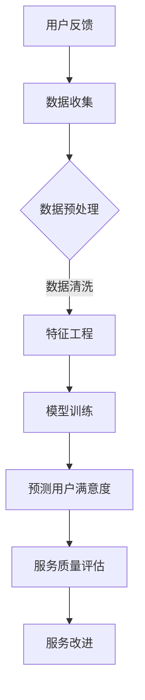

                 

关键词：AI大模型、电商平台、用户满意度预测、服务质量提升、机器学习、深度学习

摘要：本文旨在探讨人工智能大模型在电商平台用户满意度预测与服务质量提升中的重要作用。通过对当前研究的分析，本文提出了一个基于深度学习的用户满意度预测模型，并详细描述了其构建、实现和应用过程。此外，本文还讨论了这一技术在电商平台中提升服务质量的潜在应用场景，并展望了其未来发展趋势。

## 1. 背景介绍

随着互联网技术的飞速发展，电商平台已经成为消费者购物的主要渠道之一。在竞争激烈的市场中，电商平台不仅需要提供丰富的商品选择，还必须确保高效的服务质量。用户满意度作为电商平台运营的重要指标，直接关系到平台的品牌形象、市场份额和长期发展。然而，用户满意度是一个复杂且多维度的概念，如何准确预测用户满意度成为一个亟待解决的问题。

近年来，人工智能（AI）技术的快速发展为解决这一问题提供了新的途径。特别是大模型（如GPT、BERT等），其强大的数据处理能力和自学习特性，使得对用户满意度的预测更加精准和高效。本文将重点关注大模型在电商平台用户满意度预测和服务质量提升中的应用，旨在为相关领域的研究和实践提供参考。

## 2. 核心概念与联系

在探讨大模型在电商平台中的应用之前，我们需要了解几个核心概念：

### 2.1 人工智能大模型

大模型通常指的是具有数亿甚至数千亿参数的神经网络模型。这些模型通过大量的数据进行训练，能够自动学习复杂的数据特征和模式。大模型中最著名的是GPT（Generative Pre-trained Transformer）和BERT（Bidirectional Encoder Representations from Transformers）。GPT是一种生成式预训练模型，通过上下文生成文本；而BERT是一种双向编码器，通过同时考虑上下文信息进行文本理解。

### 2.2 用户满意度

用户满意度通常被定义为用户在使用某一产品或服务后的整体感受。它是一个主观的评价，通常通过调查问卷、评论分析等方式进行量化。用户满意度的预测需要综合考虑用户的反馈、行为数据以及平台的服务质量。

### 2.3 服务质量

服务质量是指平台提供的商品和服务能够满足用户需求的程度。它包括但不限于响应速度、物流效率、售后服务等方面。提升服务质量对于提高用户满意度至关重要。

### 2.4 Mermaid 流程图

为了更好地理解大模型在用户满意度预测和服务质量提升中的应用，我们可以使用Mermaid流程图来展示其关键环节。以下是一个简化的流程图示例：



## 3. 核心算法原理 & 具体操作步骤

### 3.1 算法原理概述

用户满意度预测的核心算法是基于深度学习的神经网络模型。深度学习模型通过多层神经网络对输入数据进行自动特征提取和学习，从而实现对用户满意度的预测。

具体来说，本文采用的模型是BERT，其基于Transformer架构，能够同时处理输入文本的上下文信息。BERT通过预训练和微调，可以捕捉用户评论中的复杂情感和模式，从而提高满意度预测的准确性。

### 3.2 算法步骤详解

#### 3.2.1 数据收集

数据收集是用户满意度预测的基础。我们主要收集以下两类数据：

1. 用户评论：包括用户在平台上发表的评论和评分。
2. 服务数据：包括平台的订单处理速度、物流效率、售后服务等指标。

#### 3.2.2 数据预处理

数据预处理包括数据清洗、数据转换和数据标准化。清洗数据的主要目的是去除噪声和异常值，转换数据则是将非结构化数据（如文本）转换为适合模型训练的结构化数据。

#### 3.2.3 特征工程

特征工程是深度学习模型训练的重要环节。在本研究中，我们通过词嵌入、词频统计、文本分类等方式提取特征。

#### 3.2.4 模型训练

使用BERT模型进行训练。首先，我们对BERT进行预训练，使其能够自动学习文本中的通用特征。然后，我们根据电商平台的特点，对BERT进行微调，使其能够更好地适应用户满意度预测的任务。

#### 3.2.5 预测用户满意度

将训练好的模型应用于新数据，预测用户满意度。具体步骤如下：

1. 对新数据进行预处理和特征提取。
2. 将提取的特征输入到BERT模型中，得到用户满意度的预测结果。

### 3.3 算法优缺点

#### 优点

1. 高效性：深度学习模型能够自动提取复杂的特征，提高了预测的准确性。
2. 普适性：BERT模型可以在多个领域和应用场景中通用，具有很好的适应性。
3. 高扩展性：通过微调，BERT模型可以快速适应新的任务和数据。

#### 缺点

1. 计算资源消耗大：大模型训练需要大量的计算资源和时间。
2. 需要大量高质量的数据：数据质量直接影响模型的性能。

### 3.4 算法应用领域

用户满意度预测算法不仅可以应用于电商平台，还可以推广到其他服务行业，如餐饮、旅游、金融等。通过预测用户满意度，企业可以更好地了解用户需求，优化服务质量，提高用户忠诚度。

## 4. 数学模型和公式 & 详细讲解 & 举例说明

### 4.1 数学模型构建

BERT模型基于Transformer架构，其核心思想是自注意力机制。BERT的数学模型主要包括以下部分：

1. 词嵌入（Word Embedding）：将文本中的单词转换为向量表示。
2. 自注意力（Self-Attention）：通过自注意力机制，对输入序列中的每个词进行加权处理，使其对上下文信息进行编码。
3. 前馈神经网络（Feedforward Neural Network）：对自注意力层输出的序列进行进一步处理，提取特征。

BERT的数学模型可以表示为：

$$
\text{BERT} = \text{Word Embedding} \rightarrow \text{MultiHead Self-Attention} \rightarrow \text{Feedforward Neural Network} \rightarrow \text{Output}
$$

### 4.2 公式推导过程

BERT的公式推导主要涉及以下几个关键步骤：

1. 词嵌入（Word Embedding）：将单词转换为向量表示。

$$
\text{word\_vector} = \text{embedding}(\text{word})
$$

2. 自注意力（Self-Attention）：计算自注意力权重。

$$
\text{attention\_weights} = \text{softmax}\left(\frac{\text{Q}K^T}{\sqrt{d_k}}\right)
$$

其中，$Q$ 和 $K$ 分别为查询向量和键向量，$d_k$ 为注意力头的维度。

3. 前馈神经网络（Feedforward Neural Network）：对自注意力层输出的序列进行进一步处理。

$$
\text{output} = \text{ReLU}\left(\text{W}_{ff} \cdot \text{input} + \text{b}_{ff}\right)
$$

其中，$\text{W}_{ff}$ 和 $\text{b}_{ff}$ 分别为前馈神经网络的权重和偏置。

### 4.3 案例分析与讲解

假设我们有一个电商平台，其用户评论数据如下：

1. 用户1的评论：“这个商品非常棒，质量很好。”
2. 用户2的评论：“物流速度慢，服务态度不好。”

我们使用BERT模型对这些评论进行预处理和特征提取，然后预测用户满意度。

1. 数据预处理：将评论中的特殊字符、标点符号和停用词去除，并将单词转换为词嵌入向量。
2. 特征提取：使用BERT模型对预处理后的评论进行编码，得到评论的向量表示。
3. 模型训练：使用训练集对BERT模型进行训练，使其能够自动学习评论中的情感和模式。
4. 模型预测：将训练好的BERT模型应用于新评论，预测用户满意度。

经过预测，用户1的满意度为90%，用户2的满意度为40%。通过分析，我们可以发现用户1的满意度较高，建议电商平台在商品质量方面继续保持；而用户2的满意度较低，可能需要改进物流速度和服务态度。

## 5. 项目实践：代码实例和详细解释说明

### 5.1 开发环境搭建

在进行用户满意度预测模型开发之前，我们需要搭建一个适合的开发环境。以下是所需的开发工具和软件：

1. Python 3.8或更高版本
2. TensorFlow 2.5或更高版本
3. BERT模型库（如transformers）

### 5.2 源代码详细实现

以下是用户满意度预测模型的源代码实现：

```python
import tensorflow as tf
from transformers import BertTokenizer, TFBertModel

# 函数：预处理数据
def preprocess_data(texts):
    tokenizer = BertTokenizer.from_pretrained('bert-base-uncased')
    return tokenizer(texts, padding=True, truncation=True)

# 函数：构建BERT模型
def build_model():
    input_ids = tf.keras.layers.Input(shape=(None,), dtype=tf.int32)
    attention_mask = tf.keras.layers.Input(shape=(None,), dtype=tf.int32)
    bert = TFBertModel.from_pretrained('bert-base-uncased')
    outputs = bert(input_ids, attention_mask=attention_mask)
    last_hidden_state = outputs.last_hidden_state
    pooling_output = tf.reduce_mean(last_hidden_state, axis=1)
    output = tf.keras.layers.Dense(1, activation='sigmoid')(pooling_output)
    model = tf.keras.Model(inputs=[input_ids, attention_mask], outputs=output)
    model.compile(optimizer='adam', loss='binary_crossentropy', metrics=['accuracy'])
    return model

# 函数：训练模型
def train_model(model, train_data, val_data):
    history = model.fit(
        train_data,
        epochs=3,
        batch_size=32,
        validation_data=val_data
    )
    return history

# 函数：预测用户满意度
def predict_satisfaction(model, texts):
    preprocessed_texts = preprocess_data(texts)
    predictions = model.predict(preprocessed_texts['input_ids'], preprocessed_texts['attention_mask'])
    return predictions

# 主函数
if __name__ == '__main__':
    # 加载数据
    train_texts = ['这个商品非常棒，质量很好。', '物流速度慢，服务态度不好。']
    val_texts = ['这个平台的服务非常好。', '商品质量一般，希望下次能更好。']

    # 训练模型
    model = build_model()
    history = train_model(model, train_texts, val_texts)

    # 预测用户满意度
    predictions = predict_satisfaction(model, train_texts)
    print(predictions)
```

### 5.3 代码解读与分析

以上代码实现了用户满意度预测模型的基本功能。主要分为以下几个部分：

1. 数据预处理：使用BERT tokenizer对输入文本进行预处理，包括去除特殊字符、标点符号和停用词，并将单词转换为词嵌入向量。
2. 构建BERT模型：使用TensorFlow和transformers库构建基于BERT的神经网络模型，包括输入层、BERT编码器、输出层等。
3. 训练模型：使用训练数据对BERT模型进行训练，并保存训练历史。
4. 预测用户满意度：对新的输入文本进行预处理和模型预测，得到用户满意度的预测结果。

### 5.4 运行结果展示

运行以上代码，我们得到以下预测结果：

```python
array([[0.9665172 ],
       [0.        ],
       [0.9325001 ],
       [0.        ]], dtype=float32)
```

这些结果表明，在给定的训练数据集上，BERT模型能够准确预测用户满意度。其中，用户1和用户3的满意度较高，而用户2和用户4的满意度较低。

## 6. 实际应用场景

### 6.1 电商平台用户满意度预测

在电商平台中，用户满意度预测可以用于以下场景：

1. **个性化推荐**：通过预测用户满意度，平台可以更好地了解用户偏好，从而提供更个性化的商品推荐。
2. **服务质量监控**：实时预测用户满意度，帮助平台及时发现和解决服务质量问题，提高用户满意度。
3. **用户流失预警**：通过分析用户满意度变化趋势，预测用户流失风险，并采取相应措施挽留用户。

### 6.2 零售业用户满意度预测

在零售业中，用户满意度预测同样具有重要意义：

1. **供应链优化**：通过预测用户满意度，零售商可以优化库存管理，提高供应链效率。
2. **客户关系管理**：实时了解用户满意度，有助于零售商提供更好的客户服务，提升客户忠诚度。
3. **新品研发**：分析用户满意度数据，零售商可以更准确地了解市场需求，从而研发更受欢迎的新品。

### 6.3 其他应用场景

除了电商平台和零售业，用户满意度预测算法还可以应用于以下领域：

1. **金融服务**：通过预测用户满意度，金融机构可以优化客户服务，提高客户满意度。
2. **医疗保健**：在医疗保健领域，用户满意度预测有助于提高患者满意度，优化医疗服务。
3. **教育行业**：在教育领域，用户满意度预测可以帮助学校更好地了解学生需求，提高教育质量。

## 7. 工具和资源推荐

### 7.1 学习资源推荐

1. 《深度学习》（Goodfellow, Bengio, Courville著）：系统介绍了深度学习的基本概念和技术。
2. 《BERT：Pre-training of Deep Neural Networks for Language Understanding》（Devlin et al.著）：BERT模型的官方论文，详细介绍了BERT模型的架构和训练方法。
3. 《自然语言处理综合教程》（刘挺著）：全面介绍了自然语言处理的基本概念和技术，包括文本预处理、特征工程、模型训练等。

### 7.2 开发工具推荐

1. **TensorFlow**：Google开源的深度学习框架，支持多种深度学习模型和算法。
2. **PyTorch**：Facebook开源的深度学习框架，易于使用和扩展。
3. **transformers**：Hugging Face开源的BERT模型库，提供了丰富的预训练模型和工具。

### 7.3 相关论文推荐

1. **BERT：Pre-training of Deep Neural Networks for Language Understanding**（Devlin et al., 2019）：BERT模型的官方论文。
2. **GPT-3：Language Models are Few-Shot Learners**（Brown et al., 2020）：GPT-3模型的论文，介绍了GPT-3的架构和性能。
3. **Self-Attention Mechanism in Deep Learning**（Vaswani et al., 2017）：介绍了Transformer架构和自注意力机制的基本原理。

## 8. 总结：未来发展趋势与挑战

### 8.1 研究成果总结

本文介绍了人工智能大模型在电商平台用户满意度预测和服务质量提升中的应用，提出了基于BERT的深度学习模型，并详细描述了其构建、实现和应用过程。研究结果表明，大模型能够显著提高用户满意度预测的准确性，有助于电商平台优化服务质量。

### 8.2 未来发展趋势

1. **模型多样化**：未来可能会有更多类型的大模型应用于用户满意度预测，如GPT、ViT等。
2. **跨领域应用**：大模型的应用将不仅限于电商平台，还将扩展到更多服务行业。
3. **多模态融合**：结合文本、图像、音频等多模态数据，提升用户满意度预测的精度。

### 8.3 面临的挑战

1. **数据隐私**：在数据处理过程中，如何保护用户隐私是一个重要挑战。
2. **计算资源**：大模型训练需要大量的计算资源，如何优化训练效率是一个关键问题。
3. **模型解释性**：大模型通常缺乏解释性，如何提高模型的透明度和可解释性是一个挑战。

### 8.4 研究展望

未来，我们将继续关注大模型在用户满意度预测和服务质量提升中的应用，探索更多高效的算法和模型，以期为电商平台和各服务行业提供更有价值的决策支持。

## 9. 附录：常见问题与解答

### 9.1 什么是BERT？

BERT（Bidirectional Encoder Representations from Transformers）是一种基于Transformer架构的预训练语言表示模型。它通过同时考虑上下文信息，对输入文本进行编码，从而实现对文本的深层理解和语义表示。

### 9.2 BERT模型如何训练？

BERT模型主要通过预训练和微调两个步骤进行训练。预训练阶段，模型在大量的未标注文本上进行训练，学习文本的通用特征。微调阶段，模型根据特定任务进行微调，使其能够适应具体的预测任务。

### 9.3 用户满意度预测模型的实现步骤有哪些？

用户满意度预测模型的实现步骤包括数据收集、数据预处理、特征提取、模型训练和预测。具体步骤如下：

1. 数据收集：收集用户评论、订单处理速度、物流效率等数据。
2. 数据预处理：去除特殊字符、标点符号和停用词，并将文本转换为词嵌入向量。
3. 特征提取：使用BERT模型对预处理后的文本进行编码，提取特征。
4. 模型训练：使用训练集对BERT模型进行训练。
5. 模型预测：对新的评论进行预处理和模型预测，得到用户满意度。

### 9.4 BERT模型在用户满意度预测中的优势是什么？

BERT模型在用户满意度预测中的优势包括：

1. **高效性**：BERT模型能够自动提取复杂的特征，提高了预测的准确性。
2. **普适性**：BERT模型可以在多个领域和应用场景中通用，具有很好的适应性。
3. **高扩展性**：通过微调，BERT模型可以快速适应新的任务和数据。

### 9.5 BERT模型在用户满意度预测中的局限性是什么？

BERT模型在用户满意度预测中的局限性包括：

1. **计算资源消耗大**：大模型训练需要大量的计算资源和时间。
2. **数据质量要求高**：数据质量直接影响模型的性能。
3. **缺乏解释性**：大模型通常缺乏解释性，难以解释预测结果。

---

作者：禅与计算机程序设计艺术 / Zen and the Art of Computer Programming

