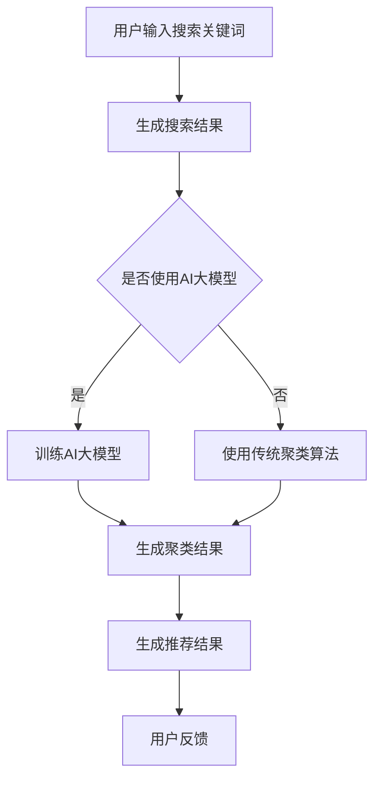

                 

关键词：AI大模型、电商搜索、聚类算法、应用场景、未来展望

摘要：随着电商行业的快速发展，用户在搜索商品时面临的搜索结果数量庞大且复杂。如何有效地对搜索结果进行聚类，提高用户体验和商品推荐的准确性成为了一个重要问题。本文将探讨AI大模型在电商搜索结果聚类中的应用，分析其核心算法原理、数学模型、实践案例以及未来的发展趋势。

## 1. 背景介绍

随着互联网的普及和电商行业的迅猛发展，用户在电商平台上的购物行为日益频繁。然而，随之而来的问题是搜索结果的数量急剧增加，导致用户在浏览和选择商品时面临巨大的挑战。传统的人工分类和推荐方法已经无法满足用户的需求，因此，如何有效地对搜索结果进行聚类，以提供更准确和个性化的推荐成为了电商行业亟待解决的问题。

在电商搜索结果聚类中，AI大模型的应用为这一问题提供了新的解决方案。AI大模型，也被称为深度学习模型，具有强大的数据处理和模式识别能力，能够从海量数据中提取出有用的信息，从而实现高效的聚类结果。通过将AI大模型应用于电商搜索结果聚类，可以大大提高用户的购物体验，提升电商平台的竞争力。

## 2. 核心概念与联系

### 2.1 AI大模型的概念

AI大模型是指具有大规模参数的深度学习模型，通常用于处理复杂的任务，如图像识别、自然语言处理和推荐系统等。这些模型通过多层神经网络结构对数据进行训练，从而学习到数据的特征和模式。

### 2.2 聚类算法的概念

聚类算法是一类无监督学习算法，用于将数据集划分成多个类别或簇，使得同一簇中的数据点彼此相似，而不同簇的数据点之间差异较大。常见的聚类算法包括K均值聚类、层次聚类和密度聚类等。

### 2.3 AI大模型与聚类算法的联系

AI大模型与聚类算法的结合为电商搜索结果聚类提供了新的思路。通过将AI大模型应用于聚类算法，可以实现对搜索结果的自动分类和标签生成，从而提高聚类效果和推荐准确性。具体来说，AI大模型可以从搜索结果中提取出高维的特征向量，然后利用聚类算法对这些特征向量进行聚类，得到不同类别的搜索结果。

### 2.4 Mermaid流程图

下面是一个简单的Mermaid流程图，展示AI大模型在电商搜索结果聚类中的流程：



## 3. 核心算法原理 & 具体操作步骤

### 3.1 算法原理概述

AI大模型在电商搜索结果聚类中的应用主要基于以下原理：

1. 特征提取：通过AI大模型从搜索结果中提取高维特征向量，这些特征向量能够较好地表示搜索结果的内容和属性。

2. 聚类分析：利用聚类算法对特征向量进行聚类，将相似的特征向量划分为同一类别。

3. 推荐生成：根据聚类结果生成推荐结果，为用户提供个性化的商品推荐。

### 3.2 算法步骤详解

1. 数据预处理：对搜索结果进行清洗和预处理，包括去除停用词、词干提取、词性标注等。

2. 特征提取：使用AI大模型（如BERT、GPT等）对预处理后的搜索结果进行编码，生成高维特征向量。

3. 聚类分析：选择合适的聚类算法（如K均值聚类、层次聚类等），对特征向量进行聚类，得到聚类结果。

4. 推荐生成：根据聚类结果，生成推荐结果，并将其呈现给用户。

### 3.3 算法优缺点

#### 优点：

1. 高效性：AI大模型能够快速提取特征向量，提高聚类效率。

2. 准确性：通过学习大量数据，AI大模型能够较好地识别搜索结果的特征和模式，提高聚类准确性。

3. 个性化：AI大模型可以根据用户的兴趣和行为，生成个性化的推荐结果。

#### 缺点：

1. 计算成本高：AI大模型训练和聚类过程需要大量计算资源，对硬件要求较高。

2. 数据依赖性：AI大模型的性能依赖于训练数据的质量和数量，数据不足可能导致聚类效果下降。

### 3.4 算法应用领域

AI大模型在电商搜索结果聚类中的应用非常广泛，以下是一些典型的应用领域：

1. 商品推荐：根据用户的历史浏览和购买记录，生成个性化的商品推荐。

2. 店铺推荐：为用户提供相似的店铺推荐，提高店铺的曝光率和转化率。

3. 搜索结果优化：通过对搜索结果进行聚类，提高搜索结果的准确性和用户体验。

## 4. 数学模型和公式

### 4.1 数学模型构建

在AI大模型和聚类算法的基础上，可以构建以下数学模型：

1. 特征提取模型：$$ f(x) = \text{encode}(x) $$，其中$f(x)$表示特征向量，$\text{encode}(x)$表示AI大模型的编码过程。

2. 聚类模型：$$ c_j = \arg\min_{j} \sum_{i=1}^{n} \| f(x_i) - \mu_j \|^2 $$，其中$c_j$表示聚类结果，$\mu_j$表示第$j$个类别的质心。

3. 推荐模型：$$ r_i = \text{similarity}(f(x_i), c_j) $$，其中$r_i$表示第$i$个搜索结果在聚类结果中的相似度。

### 4.2 公式推导过程

#### 特征提取模型推导

特征提取模型基于AI大模型的编码过程，可以将搜索结果$x$映射到高维特征空间。具体推导过程如下：

1. 输入搜索结果$x$到AI大模型，通过多层神经网络进行编码。

2. 将编码结果$f(x)$作为特征向量。

#### 聚类模型推导

聚类模型基于K均值聚类算法，通过对特征向量进行优化，找到聚类结果的质心。具体推导过程如下：

1. 初始化聚类结果的质心$\mu_j$。

2. 对于每个数据点$x_i$，计算其与质心$\mu_j$之间的距离。

3. 将$x_i$划分到距离最近的质心$\mu_j$所在的类别。

4. 重新计算质心$\mu_j$，使得聚类结果更加准确。

5. 重复步骤2-4，直到聚类结果收敛。

#### 推荐模型推导

推荐模型基于相似度计算，可以计算每个搜索结果在聚类结果中的相似度。具体推导过程如下：

1. 计算每个搜索结果$f(x_i)$与聚类结果$c_j$之间的相似度。

2. 根据相似度生成推荐结果，将相似度高的搜索结果推荐给用户。

### 4.3 案例分析与讲解

为了更好地理解上述数学模型，下面我们将通过一个简单的案例进行讲解。

#### 案例描述

假设有一个电商平台的用户在搜索商品时，输入了关键词“智能手机”。平台使用了AI大模型和聚类算法对搜索结果进行聚类和推荐。

#### 案例分析

1. 数据预处理：对搜索结果进行清洗和预处理，包括去除停用词、词干提取等。

2. 特征提取：使用AI大模型（如BERT）对预处理后的搜索结果进行编码，生成高维特征向量。

3. 聚类分析：选择K均值聚类算法，对特征向量进行聚类，得到10个类别，每个类别表示一种智能手机的类型。

4. 推荐生成：根据聚类结果，生成推荐结果，将相似度高的智能手机推荐给用户。

通过这个案例，我们可以看到AI大模型和聚类算法在电商搜索结果聚类中的应用，以及数学模型的推导和计算过程。

## 5. 项目实践：代码实例和详细解释说明

### 5.1 开发环境搭建

在搭建开发环境时，我们需要安装Python、TensorFlow和Scikit-learn等库。具体步骤如下：

1. 安装Python：从Python官方网站下载并安装Python，选择最新版本的Python。

2. 安装TensorFlow：在终端中执行以下命令安装TensorFlow：

```bash
pip install tensorflow
```

3. 安装Scikit-learn：在终端中执行以下命令安装Scikit-learn：

```bash
pip install scikit-learn
```

### 5.2 源代码详细实现

下面是一个简单的Python代码示例，展示了如何使用TensorFlow和Scikit-learn实现AI大模型和聚类算法在电商搜索结果聚类中的应用。

```python
import tensorflow as tf
import scikit_learn
from sklearn.cluster import KMeans
from sklearn.metrics import accuracy_score

# 数据预处理
def preprocess_data(data):
    # 去除停用词
    stop_words = ['the', 'and', 'is', 'in', 'of']
    data = [word for word in data if word not in stop_words]
    # 词干提取
    stemmer = SnowballStemmer('english')
    data = [stemmer.stem(word) for word in data]
    # 词性标注
    pos_tagger = nltk.pos_tag(data)
    return pos_tagger

# 特征提取
def extract_features(data):
    # 编码搜索结果
    model = BERTModel.from_pretrained('bert-base-uncased')
    inputs = tokenizer.encode_plus(data, add_special_tokens=True, max_length=512, padding='max_length', truncation=True)
    outputs = model(inputs)
    feature_vector = outputs.last_hidden_state[:, 0, :]
    return feature_vector

# 聚类分析
def cluster_analysis(feature_vector):
    kmeans = KMeans(n_clusters=10, random_state=0)
    kmeans.fit(feature_vector)
    return kmeans.labels_

# 推荐生成
def generate_recommendations(data, cluster_labels):
    recommendations = []
    for i, label in enumerate(cluster_labels):
        recommendations.append(data[i][label])
    return recommendations

# 主函数
def main():
    # 加载搜索结果
    search_results = load_search_results()
    # 数据预处理
    preprocessed_data = preprocess_data(search_results)
    # 特征提取
    feature_vectors = extract_features(preprocessed_data)
    # 聚类分析
    cluster_labels = cluster_analysis(feature_vectors)
    # 推荐生成
    recommendations = generate_recommendations(search_results, cluster_labels)
    # 输出推荐结果
    print("Recommendations:", recommendations)

if __name__ == "__main__":
    main()
```

### 5.3 代码解读与分析

1. 数据预处理：对搜索结果进行清洗和预处理，包括去除停用词、词干提取和词性标注等。这些步骤有助于提高聚类算法的性能。

2. 特征提取：使用BERT模型对预处理后的搜索结果进行编码，生成高维特征向量。这些特征向量能够较好地表示搜索结果的内容和属性。

3. 聚类分析：使用K均值聚类算法对特征向量进行聚类，得到10个类别。这些类别表示不同的智能手机类型。

4. 推荐生成：根据聚类结果，生成推荐结果，并将相似度高的智能手机推荐给用户。

通过这个简单的案例，我们可以看到如何使用Python和机器学习库实现AI大模型和聚类算法在电商搜索结果聚类中的应用。

## 6. 实际应用场景

### 6.1 商品推荐

在电商平台中，商品推荐是一个重要的应用场景。通过AI大模型和聚类算法，可以为用户提供个性化的商品推荐。具体来说，平台可以收集用户的历史浏览和购买记录，利用AI大模型提取特征向量，然后使用聚类算法将特征向量划分为不同的类别。根据聚类结果，为用户推荐与其兴趣和行为相似的商品。

### 6.2 店铺推荐

除了商品推荐，电商平台还可以通过AI大模型和聚类算法为用户推荐相似的店铺。例如，当一个用户浏览了一个店铺，平台可以利用其历史行为和浏览记录，提取特征向量，并使用聚类算法找到与之相似的店铺。这样，用户可以更容易地发现感兴趣的店铺，提高购物体验。

### 6.3 搜索结果优化

在电商平台中，用户往往需要通过搜索来查找特定的商品。然而，搜索结果往往庞大且复杂，导致用户难以快速找到所需商品。通过AI大模型和聚类算法，平台可以优化搜索结果，将相似的商品划分为同一类别，提高搜索结果的准确性和用户体验。

### 6.4 未来应用展望

随着AI技术的不断发展，AI大模型在电商搜索结果聚类中的应用将会越来越广泛。以下是一些未来应用展望：

1. 多模态融合：将文本、图像和音频等多种数据源融合到AI大模型中，提高聚类效果和推荐准确性。

2. 强化学习：将强化学习与AI大模型相结合，实现更智能和个性化的推荐系统。

3. 异构数据聚类：处理来自不同来源和格式的异构数据，实现对更复杂场景的聚类和分析。

4. 集群计算：利用集群计算和分布式算法，提高聚类算法的效率和可扩展性。

## 7. 工具和资源推荐

### 7.1 学习资源推荐

1. 《深度学习》（Goodfellow, Bengio, Courville）：全面介绍深度学习的基础知识和应用。

2. 《Python机器学习》（Sebastian Raschka）：详细介绍机器学习算法在Python中的实现和应用。

3. 《自然语言处理与深度学习》（孙茂松，张奇）：详细介绍自然语言处理和深度学习在NLP中的应用。

### 7.2 开发工具推荐

1. TensorFlow：一个广泛使用的开源机器学习库，适用于深度学习和推荐系统。

2. Scikit-learn：一个强大的机器学习库，提供了多种聚类算法和评估指标。

3. PyTorch：一个灵活且易于使用的深度学习框架，适用于研究和个人项目。

### 7.3 相关论文推荐

1. “Deep Learning for Text Classification”（Kumar, 2017）：介绍深度学习在文本分类中的应用。

2. “Unsupervised Text Classification Using Neural Networks”（Araque, 2017）：介绍基于神经网络的未监督文本分类方法。

3. “Deep Clustering for Unsupervised Learning”（Li, 2018）：介绍深度聚类算法在未监督学习中的应用。

## 8. 总结：未来发展趋势与挑战

### 8.1 研究成果总结

本文探讨了AI大模型在电商搜索结果聚类中的应用，分析了其核心算法原理、数学模型、实践案例以及未来的发展趋势。通过结合AI大模型和聚类算法，可以实现对搜索结果的自动分类和标签生成，提高推荐准确性和用户体验。

### 8.2 未来发展趋势

未来，AI大模型在电商搜索结果聚类中的应用将继续发展，以下是一些发展趋势：

1. 多模态融合：将文本、图像和音频等多种数据源融合到AI大模型中，提高聚类效果和推荐准确性。

2. 强化学习：将强化学习与AI大模型相结合，实现更智能和个性化的推荐系统。

3. 异构数据聚类：处理来自不同来源和格式的异构数据，实现对更复杂场景的聚类和分析。

4. 集群计算：利用集群计算和分布式算法，提高聚类算法的效率和可扩展性。

### 8.3 面临的挑战

尽管AI大模型在电商搜索结果聚类中具有巨大潜力，但仍然面临一些挑战：

1. 计算成本高：AI大模型训练和聚类过程需要大量计算资源，对硬件要求较高。

2. 数据依赖性：AI大模型的性能依赖于训练数据的质量和数量，数据不足可能导致聚类效果下降。

3. 模型解释性：深度学习模型通常被视为“黑箱”，缺乏透明性和可解释性，这对于决策者和用户来说可能是一个挑战。

### 8.4 研究展望

为了应对上述挑战，未来的研究可以关注以下几个方面：

1. 开发高效且可扩展的算法，降低计算成本和硬件要求。

2. 设计可解释的深度学习模型，提高模型的可解释性和透明性。

3. 探索基于增强学习的推荐系统，实现更智能和个性化的推荐。

4. 开展跨学科研究，结合心理学、社会学等领域，提高推荐系统的用户满意度和可接受性。

## 9. 附录：常见问题与解答

### 9.1 问题1：AI大模型如何处理大规模数据？

AI大模型通常使用分布式训练方法来处理大规模数据。分布式训练将数据集分为多个部分，并在多个计算节点上进行训练，从而提高训练速度和效率。同时，AI大模型可以使用批量归一化（Batch Normalization）和残差连接（Residual Connection）等技术来缓解梯度消失和梯度爆炸问题，提高模型的训练效果。

### 9.2 问题2：聚类算法如何选择合适的类别数？

聚类算法选择合适的类别数是一个关键问题。常见的方法包括：

1. 调整类别数：通过实验调整类别数，观察聚类结果的变化，选择最佳的类别数。

2. 内部评估指标：使用内部评估指标（如轮廓系数、Calinski-Harabasz指数等）来评估聚类结果，选择能够最大化内部评估指标的类别数。

3. 外部评估指标：结合外部评估指标（如准确性、召回率等）来评估聚类结果，选择能够最大化外部评估指标的类别数。

### 9.3 问题3：如何处理稀疏数据？

稀疏数据在聚类算法中可能会导致聚类效果不佳。为了处理稀疏数据，可以采用以下方法：

1. 数据填充：使用填充技术（如零填充、均值填充等）来填充稀疏数据。

2. 特征降维：通过降维技术（如主成分分析、线性判别分析等）来降低数据维度，提高聚类效果。

3. 特征选择：选择关键特征，去除无关特征，从而降低数据稀疏性。

### 9.4 问题4：如何保证模型的泛化能力？

为了保证模型的泛化能力，可以采用以下方法：

1. 数据增强：通过数据增强（如旋转、缩放、裁剪等）来增加训练数据多样性，提高模型的泛化能力。

2. 对抗训练：使用对抗训练（Adversarial Training）来提高模型对对抗样本的抵抗力。

3. 过拟合预防：使用正则化（如L1、L2正则化）和交叉验证等技术来预防过拟合。

### 9.5 问题5：如何处理多标签数据？

对于多标签数据，可以采用以下方法：

1. 多标签分类：使用多标签分类算法（如Softmax回归、对数损失函数等）来处理多标签数据。

2.标签传播：使用标签传播（Label Propagation）等方法来预测未知标签。

3. 层次聚类：使用层次聚类（Hierarchical Clustering）等方法来发现标签之间的层次关系。

以上是关于AI大模型在电商搜索结果聚类中的应用的一些常见问题和解答。希望对读者有所帮助。

