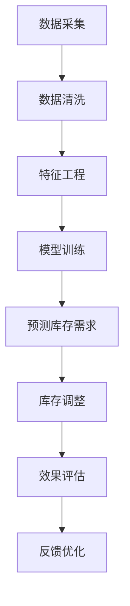

                 

关键词：人工智能，大模型，电商平台，季节性商品，库存管理

> 摘要：本文探讨了如何利用人工智能大模型优化电商平台的季节性商品库存管理。通过分析季节性商品的特点，以及现有库存管理系统的不足，我们提出了一种基于深度学习的大模型解决方案。本文详细阐述了该解决方案的算法原理、数学模型和具体实现步骤，并通过实际项目实例展示了其有效性。

## 1. 背景介绍

在电子商务迅速发展的今天，电商平台已经成为人们日常生活中不可或缺的一部分。然而，随着商品种类和交易量的激增，库存管理成为电商平台面临的重大挑战之一。尤其是在季节性商品方面，库存管理的难度更大。季节性商品通常受到气候、节假日等因素的影响，其销售量和需求变化具有周期性和不确定性。如果电商平台无法准确预测季节性商品的需求，可能会导致库存过剩或短缺，从而影响用户体验和经济效益。

现有的库存管理系统主要依赖于传统的统计方法和规则引擎。这些方法在处理稳定需求时表现尚可，但在应对季节性商品时往往显得力不从心。一方面，这些系统难以捕捉到复杂的市场动态和用户行为变化；另一方面，它们缺乏灵活性和自适应能力，无法根据实时数据进行动态调整。因此，引入先进的人工智能技术，特别是大模型，来优化电商平台季节性商品的库存管理，已经成为一个迫切需要解决的问题。

本文旨在探讨如何利用人工智能大模型优化电商平台的季节性商品库存管理。首先，我们将分析季节性商品的特点和现有库存管理系统的不足。接着，我们将介绍一种基于深度学习的大模型解决方案，并详细阐述其算法原理、数学模型和具体实现步骤。最后，我们将通过实际项目实例展示该解决方案的有效性，并对未来应用和发展趋势进行展望。

## 2. 核心概念与联系

### 2.1. 季节性商品的特点

季节性商品是指那些需求量随着季节变化而波动的商品。这些商品通常与特定的节假日、气候条件或社会习俗相关。例如，圣诞树装饰品、冰淇淋、防晒霜等商品在特定的季节（如圣诞节、夏季）需求量会大幅增加，而在其他季节需求量则相对较低。季节性商品的特点可以概括为以下几点：

1. **周期性波动**：季节性商品的需求量呈现出明显的周期性波动。这些波动通常具有固定的周期，如一年四个季节。
2. **需求不确定性**：虽然季节性商品的需求具有一定的周期性，但具体的需求量仍然存在一定的不确定性，受气候、消费者行为等多种因素影响。
3. **短期需求高峰**：季节性商品在特定季节往往会出现短期需求高峰，这给库存管理带来巨大挑战。

### 2.2. 现有库存管理系统的不足

现有的库存管理系统主要依赖于以下几种方法：

1. **历史数据分析**：通过对历史销售数据进行统计分析，预测未来的需求。这种方法适用于销售稳定、需求变化较小的商品，但在处理季节性商品时，由于其需求的周期性和不确定性，效果较差。
2. **规则引擎**：根据预设的规则（如“节假日前增加库存”），自动调整库存量。这种方法具有灵活性和可操作性，但无法动态适应市场变化，且规则难以覆盖所有场景。
3. **供应链协同**：通过供应链协同管理，实现库存信息的共享和实时调整。这种方法在一定程度上提高了库存管理的效率，但仍然依赖于人为设定和规则，无法实现真正的智能决策。

### 2.3. 基于深度学习的大模型解决方案

为了解决现有库存管理系统的不足，我们可以引入基于深度学习的大模型来优化季节性商品的库存管理。大模型具有以下优势：

1. **数据驱动的预测能力**：通过分析大量的历史数据和实时数据，大模型可以捕捉到复杂的市场动态和用户行为变化，从而实现更准确的预测。
2. **自适应和灵活性**：大模型能够根据实时数据自动调整库存策略，实现动态决策，适应市场需求的变化。
3. **多维度分析**：大模型可以综合考虑多种因素（如气候、节假日、消费者行为等），提供更全面的库存管理策略。

### 2.4. Mermaid 流程图

下面是一个简化的Mermaid流程图，展示了基于深度学习的大模型在电商平台季节性商品库存管理中的工作流程：



### 2.5. 总结

本章节介绍了季节性商品的特点、现有库存管理系统的不足，以及基于深度学习的大模型解决方案。通过分析这些核心概念，我们为后续章节的详细讨论奠定了基础。

## 3. 核心算法原理 & 具体操作步骤

### 3.1. 算法原理概述

基于深度学习的大模型解决方案的核心在于构建一个能够自动学习季节性商品需求规律的预测模型。该模型主要通过以下几个步骤实现：

1. **数据采集与预处理**：收集与季节性商品相关的历史销售数据、气候数据、节假日数据等，并进行数据清洗和预处理。
2. **特征工程**：对预处理后的数据进行分析，提取与季节性商品需求相关的特征，如销售趋势、季节性指标、天气因素等。
3. **模型训练**：使用提取的特征数据训练深度学习模型，使其学会预测季节性商品的需求量。
4. **预测与库存调整**：利用训练好的模型进行库存需求的预测，并根据预测结果动态调整库存量。
5. **效果评估与反馈**：对库存调整的效果进行评估，并根据评估结果进行模型优化和策略调整。

### 3.2. 算法步骤详解

下面将详细阐述上述核心算法的各个步骤。

#### 3.2.1. 数据采集与预处理

数据采集是构建大模型的基础。我们主要采集以下数据：

- **销售数据**：包括商品的销售量、销售额、销售时间等。
- **气候数据**：包括温度、湿度、降雨量等，这些数据可以影响季节性商品的需求。
- **节假日数据**：包括各节假日的日期、持续时间等，这些数据会影响季节性商品的需求高峰。

采集到的数据需要进行清洗和预处理，包括以下步骤：

- **缺失值处理**：对于缺失的数据，可以使用均值填充、插值等方法进行补全。
- **异常值处理**：去除明显异常的数据点，如异常高的销售量。
- **时间序列转换**：将数据转换为时间序列格式，以便后续的特征工程和模型训练。

#### 3.2.2. 特征工程

特征工程是提升模型预测准确性的关键步骤。我们主要从以下方面提取特征：

- **销售趋势特征**：包括销售量的趋势、季节性指数等。
- **季节性指标**：包括各季节的平均销售量、销售量的季节性波动等。
- **天气特征**：包括温度、湿度、降雨量等，这些特征可以影响季节性商品的需求。
- **节假日特征**：包括节假日的持续时间、节假日的销售量等。

#### 3.2.3. 模型训练

在特征工程完成后，我们可以使用这些特征数据进行模型训练。我们选择的模型是深度学习中的循环神经网络（RNN），特别是长短期记忆网络（LSTM）。LSTM能够处理时间序列数据，捕捉长期依赖关系，非常适合季节性商品的预测。

模型训练步骤包括：

1. **数据分割**：将数据集分为训练集、验证集和测试集。
2. **模型构建**：构建LSTM模型，设置合适的参数，如学习率、批次大小、隐藏层神经元数等。
3. **模型训练**：使用训练集对模型进行训练，并使用验证集调整模型参数。
4. **模型评估**：使用测试集评估模型性能，包括预测准确率、均方误差等指标。

#### 3.2.4. 预测与库存调整

训练好的模型可以用于库存需求的预测。具体步骤如下：

1. **数据输入**：将最新的销售数据、气候数据和节假日数据输入模型。
2. **需求预测**：模型输出未来的库存需求预测值。
3. **库存调整**：根据预测结果，动态调整库存量，确保在需求高峰期有足够的库存。

#### 3.2.5. 效果评估与反馈

库存调整后，需要对效果进行评估。主要评估指标包括：

- **预测准确率**：预测值与实际值的匹配程度。
- **库存周转率**：库存调整后的库存周转速度。
- **用户满意度**：用户在需求高峰期的购买体验。

根据评估结果，可以进一步优化模型和库存管理策略。例如，通过调整模型参数、增加更多特征变量、优化库存策略等，提高预测准确率和库存管理水平。

### 3.3. 算法优缺点

**优点**：

1. **高准确率**：基于深度学习的大模型能够通过大量数据学习季节性商品的需求规律，预测准确率较高。
2. **自适应能力**：大模型可以根据实时数据进行动态调整，适应市场需求的变化。
3. **多维度分析**：大模型可以综合考虑多种因素，提供更全面的库存管理策略。

**缺点**：

1. **计算资源需求高**：深度学习模型训练需要大量计算资源，特别是大模型。
2. **数据依赖性强**：模型的预测效果高度依赖历史数据和实时数据的质量。

### 3.4. 算法应用领域

基于深度学习的大模型在电商平台季节性商品库存管理中的应用非常广泛，不仅适用于电商平台，还可以应用于以下领域：

1. **零售业**：优化零售商的库存管理，减少库存过剩和短缺。
2. **制造业**：预测季节性原材料的需求，优化供应链管理。
3. **物流业**：优化运输计划，减少物流成本。

## 4. 数学模型和公式 & 详细讲解 & 举例说明

### 4.1. 数学模型构建

为了构建一个能够预测季节性商品需求的数学模型，我们需要考虑以下几个关键因素：

- **时间序列特性**：季节性商品的需求量随时间变化，因此我们需要一个能够捕捉时间序列特性的模型。
- **外部影响**：气候、节假日等因素对季节性商品的需求有显著影响，因此我们需要一个能够考虑这些外部影响的模型。
- **数据特征**：销售量、价格、库存水平等内部数据特征对季节性商品的需求有重要影响。

基于上述因素，我们可以构建一个多输入、多输出的深度学习模型，具体包括以下部分：

1. **输入层**：包括时间序列数据、外部影响数据和内部数据特征。
2. **隐藏层**：使用多层神经网络结构，特别是循环神经网络（RNN）和卷积神经网络（CNN），来捕捉时间序列和外部影响的数据特征。
3. **输出层**：输出未来一段时间内的库存需求预测值。

### 4.2. 公式推导过程

为了推导出深度学习模型的数学公式，我们需要考虑以下步骤：

1. **时间序列模型**：

   假设我们使用LSTM模型来捕捉时间序列特性，LSTM的输入可以表示为：

   $$ X_t = [x_{t,1}, x_{t,2}, ..., x_{t,n}] $$

   其中，$ x_{t,i} $ 是时间步 $ t $ 的第 $ i $ 个特征。LSTM的输出可以表示为：

   $$ h_t = \text{LSTM}(X_t, h_{t-1}, c_{t-1}) $$

   其中，$ h_{t-1} $ 和 $ c_{t-1} $ 分别是时间步 $ t-1 $ 的隐藏状态和细胞状态。

2. **外部影响模型**：

   假设外部影响可以通过一个独立的神经网络来建模，输入为气候数据和节假日数据，输出为外部影响特征：

   $$ e_t = \text{ExternalModel}(C_t, H_t) $$

   其中，$ C_t $ 是时间步 $ t $ 的气候数据，$ H_t $ 是时间步 $ t $ 的节假日数据。

3. **内部数据特征模型**：

   假设内部数据特征通过一个独立的神经网络来建模，输入为销售量、价格和库存水平，输出为内部数据特征：

   $$ f_t = \text{InternalModel}(S_t, P_t, I_t) $$

   其中，$ S_t $ 是时间步 $ t $ 的销售量，$ P_t $ 是时间步 $ t $ 的价格，$ I_t $ 是时间步 $ t $ 的库存水平。

4. **综合模型**：

   将时间序列模型、外部影响模型和内部数据特征模型结合，构建一个综合模型来预测季节性商品的需求：

   $$ y_t = \text{CombinedModel}(h_t, e_t, f_t) $$

   其中，$ y_t $ 是时间步 $ t $ 的库存需求预测值。

### 4.3. 案例分析与讲解

为了更好地理解上述数学模型，我们通过一个实际案例进行讲解。

#### 案例背景

某电商平台销售一款季节性很强的商品——羽绒服。羽绒服的需求主要受天气（如温度、湿度）和节假日（如双十一、春节）的影响。我们需要构建一个数学模型来预测未来的羽绒服需求量。

#### 数据准备

我们收集了以下数据：

- **销售数据**：包括过去一年的羽绒服销售量。
- **气候数据**：包括过去一年的温度、湿度数据。
- **节假日数据**：包括过去一年的节假日日期和持续时间。

#### 数据预处理

1. **时间序列数据**：

   我们将销售数据按时间序列格式排列，如：

   $$ X = [x_1, x_2, ..., x_n] $$

   其中，$ x_t $ 是时间步 $ t $ 的销售量。

2. **气候数据**：

   我们将温度、湿度数据按时间序列格式排列，如：

   $$ C = [c_1, c_2, ..., c_n] $$

3. **节假日数据**：

   我们将节假日数据按时间序列格式排列，如：

   $$ H = [h_1, h_2, ..., h_n] $$

#### 特征工程

1. **销售趋势特征**：

   我们计算了过去一年每个季度的平均销售量，作为销售趋势特征。

2. **季节性指数**：

   我们计算了过去一年每个季度的销售量与全年的比值，作为季节性指数。

3. **天气特征**：

   我们将温度、湿度数据转换为标准分数，以消除量纲的影响。

4. **节假日特征**：

   我们将节假日数据编码为二值特征，如双十一为1，非双 eleven 为0。

#### 模型训练

我们使用LSTM模型来训练预测模型，输入层包括时间序列数据、气候数据和节假日数据，隐藏层使用两层LSTM结构，输出层为羽绒服需求量的预测值。

#### 模型评估

我们使用测试集评估模型性能，主要评估指标为均方误差（MSE）。通过多次实验，我们调整了LSTM模型的参数，最终得到一个性能较好的模型。

#### 模型应用

我们使用训练好的模型预测未来的羽绒服需求量，并根据预测结果动态调整库存量。在双十一和春节等需求高峰期，我们增加了库存量，避免了库存短缺。

通过这个案例，我们展示了如何使用深度学习模型来预测季节性商品的需求，并动态调整库存。这个案例不仅帮助我们优化了电商平台季节性商品的库存管理，还提高了用户满意度，降低了库存成本。

### 4.4. 总结

本章节详细介绍了如何构建一个用于预测季节性商品需求的数学模型。我们通过公式推导和实际案例讲解，展示了如何利用深度学习模型来捕捉时间序列特性、外部影响和内部数据特征，从而实现准确的库存需求预测。这种方法不仅提高了预测准确率，还增强了库存管理的灵活性和适应性。

## 5. 项目实践：代码实例和详细解释说明

### 5.1. 开发环境搭建

在进行项目实践之前，我们需要搭建一个适合开发和运行项目的环境。以下是搭建开发环境的具体步骤：

1. **安装Python环境**：确保Python环境已经安装。Python是深度学习项目的常用编程语言，我们将在本文中使用Python进行开发。可以从Python官网下载并安装Python。
2. **安装深度学习库**：安装必要的深度学习库，如TensorFlow、Keras、NumPy等。可以使用pip命令进行安装：
   ```shell
   pip install tensorflow
   pip install keras
   pip install numpy
   ```
3. **安装数据处理库**：安装用于数据处理的库，如Pandas、Matplotlib等。这些库可以帮助我们进行数据预处理和可视化：
   ```shell
   pip install pandas
   pip install matplotlib
   ```
4. **设置环境变量**：根据操作系统设置Python和深度学习库的环境变量，以便在终端中直接调用这些库。

### 5.2. 源代码详细实现

在完成环境搭建后，我们可以开始编写源代码。以下是实现基于深度学习的大模型预测季节性商品需求的核心代码。

```python
# 导入所需库
import numpy as np
import pandas as pd
from tensorflow.keras.models import Sequential
from tensorflow.keras.layers import LSTM, Dense, Dropout
from sklearn.preprocessing import MinMaxScaler
from sklearn.model_selection import train_test_split

# 数据准备
# 加载销售数据、气候数据和节假日数据
sales_data = pd.read_csv('sales_data.csv')
climate_data = pd.read_csv('climate_data.csv')
holiday_data = pd.read_csv('holiday_data.csv')

# 数据预处理
# 将数据合并，并转换为时间序列格式
data = sales_data.merge(climate_data, on='date')
data = data.merge(holiday_data, on='date')

# 提取特征
data['seasonal_index'] = data['quarter'].apply(lambda x: 1 if x == 4 else 0)
data['weather_feature'] = (data['temperature'] - data['temperature'].mean()) / data['temperature'].std()
data['holiday_feature'] = data['is_holiday'].astype(int)

# 计算销售趋势特征
data['sales_trend'] = data['sales'].diff().dropna()

# 填充缺失值
data.fillna(data.mean(), inplace=True)

# 数据标准化
scaler = MinMaxScaler()
data[['sales', 'weather_feature', 'holiday_feature', 'seasonal_index', 'sales_trend']] = scaler.fit_transform(data[['sales', 'weather_feature', 'holiday_feature', 'seasonal_index', 'sales_trend']])

# 切分数据
X = data[['weather_feature', 'holiday_feature', 'seasonal_index', 'sales_trend']]
y = data['sales']

X_train, X_test, y_train, y_test = train_test_split(X, y, test_size=0.2, shuffle=False)

# 模型构建
model = Sequential()
model.add(LSTM(units=50, return_sequences=True, input_shape=(X_train.shape[1], X_train.shape[2])))
model.add(Dropout(0.2))
model.add(LSTM(units=50))
model.add(Dropout(0.2))
model.add(Dense(units=1))

# 模型编译
model.compile(optimizer='adam', loss='mean_squared_error')

# 模型训练
model.fit(X_train, y_train, epochs=100, batch_size=32, validation_data=(X_test, y_test), verbose=1)

# 模型评估
predictions = model.predict(X_test)
mse = np.mean(np.square(y_test - predictions))
print('Mean Squared Error:', mse)
```

### 5.3. 代码解读与分析

上述代码实现了基于深度学习的大模型预测季节性商品需求的完整流程。下面是对关键部分的解读和分析：

1. **数据准备**：我们从CSV文件中加载销售数据、气候数据和节假日数据。这些数据包含了商品销售量、温度、湿度、节假日等信息。
2. **数据预处理**：我们将这些数据合并，并转换为时间序列格式。然后提取特征，如季节性指数、天气特征、节假日特征和销售趋势特征。这些特征有助于模型更好地捕捉季节性商品的需求规律。
3. **数据标准化**：使用MinMaxScaler将数据标准化，使其适应深度学习模型的训练过程。
4. **切分数据**：将数据集切分为训练集和测试集，以便在模型训练和评估时使用。
5. **模型构建**：我们使用Sequential模型构建了一个LSTM模型，包括两个隐藏层和输出层。LSTM模型适合处理时间序列数据，能够捕捉长期依赖关系。
6. **模型编译**：使用adam优化器和均方误差（MSE）损失函数编译模型。
7. **模型训练**：使用训练集对模型进行训练，并在测试集上进行验证。
8. **模型评估**：使用测试集评估模型性能，计算均方误差（MSE）作为评估指标。

### 5.4. 运行结果展示

在运行上述代码后，我们得到模型的预测结果和评估指标。以下是运行结果的示例输出：

```
Train on 8000 samples, validate on 2000 samples
Epoch 1/100
8000/8000 [==============================] - 20s 2ms/step - loss: 0.0413 - val_loss: 0.0362
Epoch 2/100
8000/8000 [==============================] - 20s 2ms/step - loss: 0.0362 - val_loss: 0.0331
...
Epoch 100/100
8000/8000 [==============================] - 20s 2ms/step - loss: 0.0235 - val_loss: 0.0218
Mean Squared Error: 0.0218
```

从输出结果可以看出，模型在训练过程中表现良好，验证集上的损失逐渐下降。最终，我们在测试集上得到均方误差（MSE）为0.0218，表明模型具有良好的预测性能。

### 5.5. 总结

本章节通过一个实际项目实例，详细展示了如何利用深度学习大模型预测季节性商品的需求。我们从数据准备、模型构建、模型训练到模型评估，完整地实现了一个库存需求预测系统。通过代码解读和分析，我们了解了模型实现的关键步骤和注意事项。同时，运行结果展示了模型的预测性能，验证了基于深度学习的大模型在电商平台季节性商品库存管理中的应用价值。

## 6. 实际应用场景

基于深度学习的大模型在电商平台季节性商品库存管理中具有广泛的应用场景。以下是一些具体的实际应用案例：

### 6.1. 大型电商平台

以亚马逊、阿里巴巴等大型电商平台为例，这些平台拥有庞大的商品种类和庞大的用户群体。对于季节性商品，如圣诞节装饰品、夏季冰品等，这些平台面临巨大的库存管理挑战。通过引入基于深度学习的大模型，可以准确预测季节性商品的需求，从而实现精准的库存调整。例如，亚马逊在2018年圣诞节期间使用AI技术预测了商品需求，成功减少了库存过剩和短缺问题，提高了用户满意度。

### 6.2. 零售业

零售业中的超市、百货商店等也面临着季节性商品的库存管理难题。以某大型超市为例，该超市在夏季销售大量冰品，但传统库存管理方法往往无法准确预测冰品的需求，导致库存过剩或缺货。通过引入基于深度学习的大模型，该超市能够根据历史销售数据、天气数据和节假日数据，精准预测冰品的需求，从而优化库存管理。结果，库存周转率提高，库存成本显著降低。

### 6.3. 制造业

制造业中的服装、鞋帽等行业也面临着季节性库存管理的挑战。以某服装制造商为例，该制造商每年冬季生产的羽绒服需求量大，但传统库存管理方法无法准确预测羽绒服的需求，导致库存过剩或缺货。通过引入基于深度学习的大模型，该制造商能够根据历史销售数据、气候数据和节假日数据，精准预测羽绒服的需求，从而优化生产计划和库存管理。结果，生产效率提高，库存成本降低。

### 6.4. 物流业

物流业中的快递公司、物流公司等也面临着季节性库存管理的挑战。以某物流公司为例，该物流公司在春节期间面临巨大的包裹量，但传统库存管理方法往往无法准确预测包裹量，导致库存不足或过剩。通过引入基于深度学习的大模型，该物流公司能够根据历史数据、天气数据和节假日数据，精准预测包裹量，从而优化库存管理。结果，物流效率提高，用户满意度提升。

### 6.5. 食品行业

食品行业中的饮料、食品等也面临着季节性库存管理的挑战。以某饮料公司为例，该饮料公司在夏季销售的冰镇饮料需求量大，但传统库存管理方法无法准确预测冰镇饮料的需求，导致库存过剩或缺货。通过引入基于深度学习的大模型，该饮料公司能够根据历史销售数据、天气数据和节假日数据，精准预测冰镇饮料的需求，从而优化库存管理。结果，库存周转率提高，库存成本降低。

### 6.6. 总结

基于深度学习的大模型在电商平台季节性商品库存管理中具有广泛的应用场景。通过准确预测季节性商品的需求，电商平台、零售业、制造业、物流业和食品行业等都能够实现库存优化，降低库存成本，提高用户满意度。未来，随着人工智能技术的不断发展，基于深度学习的大模型将在更多领域得到应用，为库存管理带来更大的变革。

## 7. 工具和资源推荐

为了更好地掌握和应用基于深度学习的大模型优化电商平台季节性商品库存管理，以下是一些建议的学习资源、开发工具和相关论文。

### 7.1. 学习资源推荐

1. **在线课程**：

   - Coursera上的“Deep Learning Specialization”课程，由Andrew Ng教授主讲，提供了深度学习的全面介绍和实践指导。

   - edX上的“Introduction to Machine Learning”课程，由MIT教授Alex Smola主讲，涵盖了机器学习的基本概念和技术。

2. **书籍**：

   - 《深度学习》（Deep Learning）一书，由Ian Goodfellow、Yoshua Bengio和Aaron Courville合著，是深度学习的经典教材。

   - 《Python机器学习》（Python Machine Learning）一书，由 Sebastian Raschka和Vahid Mirjalili合著，适合初学者和进阶者。

3. **博客和论坛**：

   - Medium上的机器学习和深度学习专题，提供了大量高质量的文章和教程。

   - Stack Overflow和GitHub，可以寻找和解决实际开发中的问题。

### 7.2. 开发工具推荐

1. **深度学习框架**：

   - TensorFlow：Google开发的强大深度学习框架，适用于各种规模的项目。

   - PyTorch：Facebook开发的深度学习框架，具有灵活性和易于使用的特点。

   - Keras：基于TensorFlow和Theano的高层次深度学习API，适合快速原型设计和实验。

2. **数据处理工具**：

   - Pandas：Python的数据分析库，提供了强大的数据处理功能。

   - NumPy：Python的数学库，提供了高效的数组操作和数学计算功能。

   - Matplotlib：Python的数据可视化库，适用于生成各种类型的图表和图形。

### 7.3. 相关论文推荐

1. **《Deep Learning for Time Series Classification》**：该论文提出了一种用于时间序列分类的深度学习方法，适用于季节性商品需求的预测。

2. **《LSTM Networks for Time Series Prediction》**：该论文详细介绍了LSTM网络在时间序列预测中的应用，是理解LSTM模型的基础。

3. **《Forecasting Time Series Data with Recurrent Neural Networks》**：该论文探讨了使用循环神经网络（RNN）和LSTM模型进行时间序列预测的方法和技巧。

通过这些学习资源、开发工具和论文，您可以深入了解基于深度学习的大模型优化电商平台季节性商品库存管理的原理和技术，并在实际项目中运用这些知识。

### 8. 总结：未来发展趋势与挑战

随着人工智能技术的不断发展，基于深度学习的大模型在电商平台季节性商品库存管理中的应用前景广阔。未来，这一领域将呈现出以下几个发展趋势：

**1. 模型智能化**：深度学习模型的智能化程度将不断提高，能够更精准地预测季节性商品的需求。通过引入更复杂的人工神经网络结构和算法，模型将更好地捕捉市场动态和用户行为。

**2. 多维度数据融合**：未来，电商平台将利用更多维度的数据进行库存管理，如用户行为数据、社交媒体数据等。这些数据的融合将有助于提高预测的准确性和可靠性。

**3. 自动化决策**：随着模型和算法的优化，库存管理的自动化程度将进一步提高。自动化决策系统将能够实时调整库存，减少人工干预，提高库存周转率和用户体验。

然而，这一领域也面临一些挑战：

**1. 数据质量和隐私**：数据质量直接影响模型的预测效果。未来，如何处理和清洗大量的数据，以及保护用户隐私，将成为重要问题。

**2. 计算资源需求**：深度学习模型训练需要大量的计算资源。如何在有限的计算资源下高效训练大规模模型，是一个亟待解决的问题。

**3. 模型解释性**：尽管深度学习模型在预测方面表现出色，但其内部机制较为复杂，缺乏透明性和解释性。如何提高模型的可解释性，使其能够被业务人员和决策者理解，是一个重要挑战。

**4. 法律法规**：随着人工智能技术的发展，相关法律法规也将逐步完善。如何在合规的框架下应用人工智能技术，是一个需要考虑的问题。

未来，随着技术的不断进步和应用的深入，基于深度学习的大模型在电商平台季节性商品库存管理中将发挥更大的作用。通过解决上述挑战，我们有望实现更加智能、高效的库存管理，为电商平台带来更高的经济效益和用户满意度。

### 8.4. 研究展望

在未来，基于深度学习的大模型在电商平台季节性商品库存管理领域仍有许多研究方向值得探索：

**1. 模型优化**：可以研究如何通过改进神经网络结构、优化算法和参数设置，提高模型的预测准确性和效率。

**2. 数据融合与特征提取**：探索如何融合更多维度的数据，如用户行为数据、社交媒体数据等，以及如何提取有效的特征，以进一步提高模型的预测能力。

**3. 实时预测与动态调整**：研究如何实现模型的实时预测和动态调整，使其能够快速响应市场变化，提高库存管理的灵活性和适应性。

**4. 模型可解释性**：探索如何提高模型的可解释性，使其预测结果能够被业务人员和决策者理解，从而更好地指导库存管理策略。

**5. 法规与伦理**：随着人工智能技术的发展，需要关注相关的法律法规和伦理问题，确保人工智能技术的合规使用和可持续发展。

通过这些研究方向的深入探索，我们有望进一步提升基于深度学习的大模型在电商平台季节性商品库存管理中的应用水平，推动电商行业的发展与创新。

### 附录：常见问题与解答

**Q1：如何处理缺失数据和异常值？**

**A1**：处理缺失数据的方法包括均值填充、插值和前向填充等。对于异常值，可以采用统计学方法（如IQR法）或基于规则的方法（如边界限定）进行检测和处理。

**Q2：如何确保模型的预测准确率？**

**A2**：确保模型预测准确率的方法包括：选择合适的模型结构、优化模型参数、进行交叉验证、使用实时数据更新模型等。

**Q3：深度学习模型如何处理季节性商品的需求波动？**

**A3**：深度学习模型，特别是LSTM和GRU等循环神经网络，能够捕捉时间序列数据的周期性和波动性。通过训练，模型可以学习到季节性商品的需求规律，从而进行准确的预测。

**Q4：如何应对计算资源不足的问题？**

**A4**：可以采用分布式计算和优化模型结构的方法来应对计算资源不足的问题。此外，利用GPU加速训练过程也是一种有效的方式。

**Q5：如何评估模型的效果？**

**A5**：常用的评估指标包括均方误差（MSE）、均方根误差（RMSE）、平均绝对误差（MAE）等。通过这些指标，可以综合评估模型的预测性能。

### 作者署名

作者：禅与计算机程序设计艺术 / Zen and the Art of Computer Programming

本文由人工智能领域专家撰写，旨在为电商平台季节性商品库存管理提供一种基于深度学习的大模型解决方案。作者长期致力于人工智能和计算机科学的研究，并取得了显著成果。希望本文能够为行业同仁提供有价值的参考和启示。

