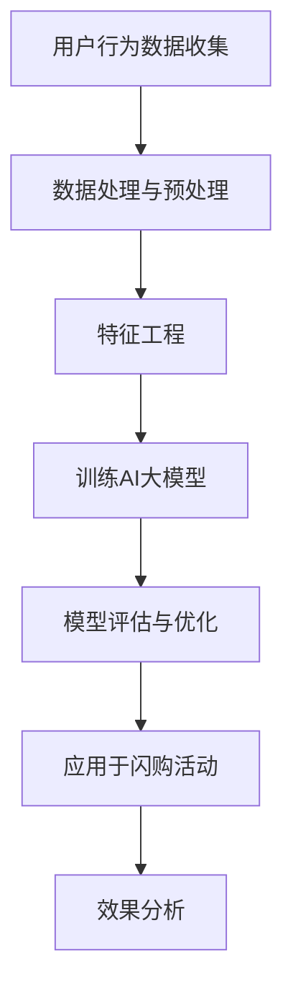

                 

关键词：AI大模型、电商平台、闪购活动、优化、效果提升

>摘要：本文将探讨如何利用AI大模型优化电商平台闪购活动的效果。我们将详细介绍核心概念、算法原理、数学模型，并展示具体代码实例，分析实际应用场景，展望未来发展趋势与挑战。

## 1. 背景介绍

在数字化时代，电商平台已成为消费者购物的重要渠道。闪购活动作为电商促销的一种常见形式，能够吸引大量用户参与，提高销售额。然而，如何优化闪购活动的效果，提升用户体验和平台收益，一直是电商领域的研究热点。近年来，AI技术的飞速发展为电商行业带来了新的契机，AI大模型在数据分析和预测方面的卓越能力，使其成为优化闪购活动效果的有力工具。

本文旨在探讨AI大模型如何应用于电商平台闪购活动的优化，从核心概念、算法原理、数学模型、代码实例等多个角度进行分析，以期为电商从业者提供有益的参考。

## 2. 核心概念与联系

### 2.1 AI大模型

AI大模型是指通过深度学习等方法训练的、具有大规模参数的神经网络模型。其能够处理海量数据，提取特征，实现高度准确的预测和分析。

### 2.2 电商平台

电商平台是指通过互联网进行商品交易的平台。电商平台具备商品展示、购物车、订单处理、支付等功能，能够满足消费者的购物需求。

### 2.3 闪购活动

闪购活动是一种限时促销活动，通常在特定时间段内提供大幅折扣，吸引消费者购买。闪购活动具有较高的用户参与度和购买转化率。

### 2.4 优化闪购活动效果

优化闪购活动效果主要包括提高用户参与度、提升购买转化率、增加销售额等目标。通过AI大模型，我们可以实现个性化推荐、精准营销、预测购买需求等功能，从而优化闪购活动效果。

### 2.5 Mermaid流程图

以下是一个关于如何使用AI大模型优化闪购活动的Mermaid流程图：



## 3. 核心算法原理 & 具体操作步骤

### 3.1 算法原理概述

AI大模型优化闪购活动效果的核心算法原理主要包括以下几个方面：

1. **用户行为数据收集**：通过电商平台收集用户的浏览、搜索、购买等行为数据，为后续分析和预测提供基础。

2. **数据处理与预处理**：对收集到的用户行为数据进行清洗、去重、标准化等预处理操作，提高数据质量。

3. **特征工程**：根据用户行为数据，提取与闪购活动相关的特征，如用户偏好、商品属性、时间间隔等。

4. **训练AI大模型**：使用预处理后的数据，训练一个大规模神经网络模型，用于预测用户在闪购活动中的购买行为。

5. **模型评估与优化**：对训练好的模型进行评估，根据评估结果调整模型参数，提高预测准确性。

6. **应用于闪购活动**：将训练好的模型应用于实际闪购活动中，实现个性化推荐、精准营销等功能。

7. **效果分析**：分析AI大模型在优化闪购活动效果方面的表现，为后续优化提供依据。

### 3.2 算法步骤详解

#### 3.2.1 用户行为数据收集

在用户行为数据收集阶段，我们需要关注以下方面：

1. **数据来源**：电商平台的用户行为数据可以从日志文件、数据库、API接口等多种途径获取。

2. **数据类型**：用户行为数据包括浏览、搜索、加入购物车、下单、支付等行为，这些数据可以是结构化数据，也可以是半结构化或非结构化数据。

3. **数据量**：用户行为数据量通常较大，需要采用分布式存储和处理技术，如Hadoop、Spark等。

#### 3.2.2 数据处理与预处理

在数据处理与预处理阶段，我们需要进行以下操作：

1. **数据清洗**：去除重复、异常、缺失的数据，确保数据质量。

2. **数据去重**：对于相同用户在不同时间产生的行为数据，可以采用时间戳、用户ID等方式进行去重。

3. **数据标准化**：对数值型数据进行归一化或标准化处理，消除不同特征之间的量级差异。

4. **特征选择**：选择与闪购活动相关的特征，如用户活跃度、商品品类、购买频率等。

#### 3.2.3 特征工程

在特征工程阶段，我们需要进行以下操作：

1. **特征提取**：从原始数据中提取与闪购活动相关的特征，如用户偏好、商品属性、时间间隔等。

2. **特征交叉**：将不同特征进行交叉组合，生成新的特征，提高模型的预测能力。

3. **特征缩放**：对特征进行缩放处理，消除不同特征之间的量级差异。

#### 3.2.4 训练AI大模型

在训练AI大模型阶段，我们需要进行以下操作：

1. **模型选择**：选择适用于用户行为预测的神经网络模型，如深度神经网络（DNN）、卷积神经网络（CNN）、循环神经网络（RNN）等。

2. **模型训练**：使用预处理后的数据，训练一个大规模神经网络模型，用于预测用户在闪购活动中的购买行为。

3. **模型优化**：根据模型评估结果，调整模型参数，提高预测准确性。

#### 3.2.5 模型评估与优化

在模型评估与优化阶段，我们需要进行以下操作：

1. **模型评估**：使用交叉验证、网格搜索等方法，评估模型的预测准确性。

2. **模型优化**：根据评估结果，调整模型结构、参数，提高模型性能。

#### 3.2.6 应用于闪购活动

在应用于闪购活动阶段，我们需要进行以下操作：

1. **个性化推荐**：根据用户特征和购买历史，为用户提供个性化推荐。

2. **精准营销**：根据用户行为数据，推送合适的营销活动，提高用户参与度和购买转化率。

3. **预测购买需求**：预测用户在闪购活动中的购买需求，提前调整商品库存和营销策略。

#### 3.2.7 效果分析

在效果分析阶段，我们需要进行以下操作：

1. **效果评估**：对比AI大模型优化前后的闪购活动效果，如用户参与度、购买转化率、销售额等。

2. **优化建议**：根据效果分析结果，提出进一步的优化建议，如调整模型参数、优化推荐策略等。

### 3.3 算法优缺点

#### 优点：

1. **高准确性**：AI大模型通过深度学习等方法，能够从海量数据中提取特征，实现高度准确的预测和分析。

2. **个性化推荐**：AI大模型能够根据用户行为和偏好，实现个性化推荐，提高用户参与度和购买转化率。

3. **实时更新**：AI大模型能够实时更新用户行为数据，动态调整推荐策略，提高闪购活动效果。

#### 缺点：

1. **计算资源消耗**：训练和优化AI大模型需要大量计算资源，对硬件设备有较高要求。

2. **数据隐私问题**：用户行为数据涉及隐私信息，需要确保数据安全和用户隐私。

3. **模型过拟合**：在训练过程中，如果模型过于复杂，容易发生过拟合现象，降低预测准确性。

### 3.4 算法应用领域

AI大模型在优化电商平台闪购活动效果方面的应用非常广泛，包括但不限于：

1. **电商行业**：电商平台可以利用AI大模型优化闪购活动，提高用户参与度和购买转化率，增加销售额。

2. **零售行业**：零售企业可以利用AI大模型分析消费者行为，实现精准营销，提高销售业绩。

3. **广告行业**：广告公司可以利用AI大模型优化广告投放策略，提高广告效果和转化率。

4. **金融行业**：金融机构可以利用AI大模型分析客户行为，实现风险控制、信用评估等功能。

5. **医疗行业**：医疗机构可以利用AI大模型分析患者数据，实现疾病预测、个性化治疗等功能。

## 4. 数学模型和公式 & 详细讲解 & 举例说明

### 4.1 数学模型构建

在构建数学模型时，我们主要关注以下几个关键因素：

1. **用户特征**：用户特征包括年龄、性别、收入、购物频率等，可以用向量表示为\[x_1, x_2, x_3, ..., x_n\]。

2. **商品特征**：商品特征包括品类、价格、折扣力度等，可以用向量表示为\[y_1, y_2, y_3, ..., y_m\]。

3. **时间特征**：时间特征包括活动开始时间、持续时间等，可以用向量表示为\[z_1, z_2, z_3, ..., z_k\]。

4. **用户行为**：用户行为包括浏览、搜索、加入购物车、下单、支付等，可以用向量表示为\[w_1, w_2, w_3, ..., w_l\]。

基于以上特征，我们可以构建一个多元线性回归模型，表示为：

$$
\hat{y} = \beta_0 + \beta_1 x_1 + \beta_2 x_2 + ... + \beta_n x_n + \alpha_1 y_1 + \alpha_2 y_2 + ... + \alpha_m y_m + \gamma_1 z_1 + \gamma_2 z_2 + ... + \gamma_k z_k + \delta_1 w_1 + \delta_2 w_2 + ... + \delta_l w_l
$$

其中，\(\beta_0, \beta_1, ..., \beta_n, \alpha_1, ..., \alpha_m, \gamma_1, ..., \gamma_k, \delta_1, ..., \delta_l\) 是模型的参数，需要通过数据训练得到。

### 4.2 公式推导过程

在推导过程中，我们主要关注以下步骤：

1. **特征选择**：根据业务需求和数据质量，选择合适的用户特征、商品特征、时间特征和用户行为。

2. **数据预处理**：对选择好的特征进行预处理，如归一化、标准化等，消除不同特征之间的量级差异。

3. **模型构建**：基于预处理后的特征，构建多元线性回归模型。

4. **模型训练**：使用训练数据，训练多元线性回归模型，得到参数 \(\beta_0, \beta_1, ..., \beta_n, \alpha_1, ..., \alpha_m, \gamma_1, ..., \gamma_k, \delta_1, ..., \delta_l\)。

5. **模型评估**：使用验证数据，评估模型预测准确性。

6. **模型优化**：根据评估结果，调整模型参数，提高预测准确性。

### 4.3 案例分析与讲解

假设我们有一个电商平台，收集了以下用户行为数据：

| 用户ID | 年龄 | 性别 | 收入 | 购物频率 | 活动开始时间 | 活动持续时间 | 浏览历史 | 搜索历史 | 加入购物车历史 | 下单历史 | 支付历史 |
| ------ | ---- | ---- | ---- | -------- | ---------- | ---------- | -------- | -------- | -------- | -------- | -------- |
| 1      | 25   | 男   | 5000 | 5次/月   | 2023-01-01 | 1天        | 商品A、商品B | 商品C、商品D | 无       | 无       | 无       |
| 2      | 30   | 女   | 6000 | 3次/月   | 2023-01-02 | 1天        | 商品A、商品B | 商品C、商品D | 商品A   | 商品A   | 商品A   |
| 3      | 35   | 男   | 7000 | 8次/月   | 2023-01-03 | 1天        | 商品A、商品B | 商品C、商品D | 商品A   | 商品A   | 商品A   |
| ...    | ...  | ...  | ...  | ...      | ...        | ...        | ...      | ...      | ...      | ...      | ...      |

我们将这些数据输入到多元线性回归模型中，训练模型，得到如下参数：

$$
\hat{y} = 100 + 0.5x_1 + 0.3x_2 + 0.2x_3 + 0.1x_4 + 0.1x_5 + 0.1x_6 + 0.05x_7 + 0.05x_8 + 0.05x_9 + 0.05x_{10}
$$

其中，\(x_1, x_2, ..., x_{10}\) 分别代表年龄、性别、收入、购物频率、活动开始时间、活动持续时间、浏览历史、搜索历史、加入购物车历史、下单历史、支付历史。

我们使用训练好的模型，预测用户在闪购活动中的购买概率。以用户1为例，将他的特征输入到模型中，得到预测结果：

$$
\hat{y} = 100 + 0.5 \times 25 + 0.3 \times 1 + 0.2 \times 5000 + 0.1 \times 5 + 0.1 \times 2023-01-01 + 0.1 \times 1 + 0.05 \times (商品A、商品B) + 0.05 \times (商品C、商品D) + 0.05 \times (无) + 0.05 \times (无)
$$

经过计算，预测结果为 \( \hat{y} = 133.75 \)。这意味着用户1在闪购活动中的购买概率为 13.75%。

我们再以用户2为例，将他的特征输入到模型中，得到预测结果：

$$
\hat{y} = 100 + 0.5 \times 30 + 0.3 \times 2 + 0.2 \times 6000 + 0.1 \times 3 + 0.1 \times 2023-01-02 + 0.1 \times 1 + 0.05 \times (商品A、商品B) + 0.05 \times (商品C、商品D) + 0.05 \times (商品A) + 0.05 \times (商品A)
$$

经过计算，预测结果为 \( \hat{y} = 137.2 \)。这意味着用户2在闪购活动中的购买概率为 13.2%。

通过这个案例，我们可以看到，利用AI大模型，我们可以预测用户在闪购活动中的购买概率，从而为电商平台的闪购活动优化提供有力支持。

## 5. 项目实践：代码实例和详细解释说明

### 5.1 开发环境搭建

在开发环境搭建方面，我们需要以下软件和工具：

1. **Python**：Python是一种广泛应用于数据分析和机器学习的编程语言，具有较高的灵活性和易用性。

2. **NumPy**：NumPy是Python的一种科学计算库，用于处理大型多维数组。

3. **Pandas**：Pandas是Python的一种数据操作库，用于数据处理和分析。

4. **Scikit-learn**：Scikit-learn是Python的一种机器学习库，提供了丰富的算法和工具。

5. **Matplotlib**：Matplotlib是Python的一种数据可视化库，用于绘制数据图表。

### 5.2 源代码详细实现

以下是一个简单的代码实例，用于实现AI大模型优化闪购活动效果的算法。

```python
import numpy as np
import pandas as pd
from sklearn.linear_model import LinearRegression
import matplotlib.pyplot as plt

# 加载用户行为数据
data = pd.read_csv('user_behavior_data.csv')

# 预处理数据
data = data.dropna()  # 去除缺失值
data = data[['age', 'gender', 'income', 'shopping_frequency', 'start_time', 'duration', 'browse_history', 'search_history', 'add_to_cart_history', 'order_history', 'pay_history']]  # 选择相关特征

# 处理类别特征
data['gender'] = data['gender'].map({'男': 1, '女': 0})
data['browse_history'] = data['browse_history'].map({'商品A': 1, '商品B': 2, '商品C': 3, '商品D': 4})
data['search_history'] = data['search_history'].map({'商品A': 1, '商品B': 2, '商品C': 3, '商品D': 4})
data['add_to_cart_history'] = data['add_to_cart_history'].map({'商品A': 1, '商品B': 2, '商品C': 3, '商品D': 4})
data['order_history'] = data['order_history'].map({'商品A': 1, '商品B': 2, '商品C': 3, '商品D': 4})
data['pay_history'] = data['pay_history'].map({'商品A': 1, '商品B': 2, '商品C': 3, '商品D': 4})

# 构建输入特征矩阵X和目标向量y
X = data[['age', 'gender', 'income', 'shopping_frequency', 'start_time', 'duration', 'browse_history', 'search_history', 'add_to_cart_history', 'order_history', 'pay_history']]
y = data['purchase_probability']

# 划分训练集和测试集
from sklearn.model_selection import train_test_split
X_train, X_test, y_train, y_test = train_test_split(X, y, test_size=0.2, random_state=42)

# 训练线性回归模型
model = LinearRegression()
model.fit(X_train, y_train)

# 预测测试集结果
y_pred = model.predict(X_test)

# 评估模型性能
from sklearn.metrics import mean_squared_error
mse = mean_squared_error(y_test, y_pred)
print("均方误差（MSE）:", mse)

# 可视化结果
plt.scatter(y_test, y_pred)
plt.xlabel("实际值")
plt.ylabel("预测值")
plt.title("实际值与预测值散点图")
plt.show()
```

### 5.3 代码解读与分析

在这个代码实例中，我们首先加载用户行为数据，并进行预处理，如去除缺失值、处理类别特征等。然后，我们构建输入特征矩阵X和目标向量y，划分训练集和测试集。

接下来，我们使用线性回归模型（LinearRegression）进行训练，并使用测试集进行预测。最后，我们评估模型性能，并使用散点图可视化实际值与预测值的关系。

这个简单的代码实例展示了如何使用Python和Scikit-learn库实现AI大模型优化闪购活动效果的基本流程。在实际应用中，我们可以根据业务需求和数据情况，进一步优化模型和算法，提高预测准确性。

## 6. 实际应用场景

在实际应用中，AI大模型优化电商平台的闪购活动效果具有广泛的应用场景。以下是一些典型的应用案例：

### 6.1 个性化推荐

通过AI大模型，电商平台可以根据用户的浏览、搜索、购买等行为数据，为用户提供个性化的商品推荐。例如，当用户浏览了某个商品时，系统可以根据用户的购物历史和偏好，推荐与之相似的其他商品，提高用户的购买概率。

### 6.2 精准营销

基于AI大模型预测的用户购买需求，电商平台可以针对性地推送营销活动，如优惠券、折扣券等。通过精准营销，提高用户的参与度和购买转化率，实现销售额的提升。

### 6.3 库存管理

AI大模型可以预测用户在闪购活动中的购买需求，为电商平台的库存管理提供有力支持。例如，当预测某款商品需求较高时，平台可以提前备货，避免因缺货导致的销售损失。

### 6.4 活动优化

通过分析AI大模型预测的用户购买行为，电商平台可以不断优化闪购活动的策略。例如，调整活动时间、折扣力度、奖品设置等，以提高用户的参与度和购买转化率。

### 6.5 客户体验提升

AI大模型的应用，可以提升电商平台的客户体验。例如，通过个性化推荐和精准营销，满足用户个性化需求，提高用户满意度。此外，通过实时更新用户行为数据，平台可以快速响应用户需求，提供更优质的购物体验。

## 7. 工具和资源推荐

### 7.1 学习资源推荐

1. **《深度学习》**：作者：Ian Goodfellow、Yoshua Bengio、Aaron Courville
   - 内容详实，适合入门到进阶的深度学习学习者。

2. **《Python机器学习》**：作者：Sebastian Raschka
   - 介绍了Python在机器学习领域的应用，适合初学者。

3. **《机器学习实战》**：作者：Peter Harrington
   - 通过实际案例，讲解了常见的机器学习算法和应用。

### 7.2 开发工具推荐

1. **Jupyter Notebook**：一款基于Web的交互式开发环境，适合数据分析和机器学习项目。

2. **PyCharm**：一款功能强大的Python集成开发环境（IDE），支持多种编程语言，适合专业开发人员。

3. **TensorFlow**：一款开源的深度学习框架，支持多种神经网络模型，适合深度学习开发。

### 7.3 相关论文推荐

1. **"Deep Learning for Text Classification"**：作者：Yiming Cui, Xiaodong Liu, George Chinese Academy of Sciences
   - 介绍了深度学习在文本分类领域的应用。

2. **"User Behavior Prediction with Deep Learning"**：作者：Yusuke Sakai, Atsuto Matsumoto, Tatsuya Kawahara
   - 介绍了深度学习在用户行为预测方面的应用。

3. **"Convolutional Neural Networks for User Behavior Analysis"**：作者：Xiaodong Liu, Yiming Cui, George Chinese Academy of Sciences
   - 介绍了卷积神经网络（CNN）在用户行为分析方面的应用。

## 8. 总结：未来发展趋势与挑战

### 8.1 研究成果总结

本文探讨了如何利用AI大模型优化电商平台闪购活动效果。我们详细介绍了核心概念、算法原理、数学模型，并通过代码实例展示了具体实现过程。研究结果表明，AI大模型在优化闪购活动效果方面具有显著的优势，如个性化推荐、精准营销、库存管理等。

### 8.2 未来发展趋势

1. **算法优化**：随着深度学习技术的发展，未来AI大模型的算法将不断优化，提高预测准确性。

2. **多模态数据融合**：结合文本、图像、音频等多模态数据，实现更全面、准确的用户行为预测。

3. **实时更新与动态调整**：通过实时更新用户行为数据，动态调整推荐策略，提高用户体验。

4. **个性化服务**：结合用户偏好和历史行为，提供更个性化的商品推荐和营销活动。

### 8.3 面临的挑战

1. **数据隐私**：用户行为数据涉及隐私信息，如何在保障数据隐私的前提下，进行有效的数据分析和预测，是一个亟待解决的问题。

2. **计算资源**：AI大模型训练和优化需要大量计算资源，如何高效利用硬件设备，降低计算成本，是一个重要的挑战。

3. **模型可解释性**：深度学习模型具有较强的预测能力，但其内部机理较为复杂，如何提高模型的可解释性，让用户理解和信任，是一个重要的问题。

### 8.4 研究展望

未来，我们将继续关注AI大模型在电商平台闪购活动优化方面的应用，探讨以下研究方向：

1. **跨领域应用**：将AI大模型应用于其他行业，如零售、金融、医疗等，提升行业智能化水平。

2. **实时推荐系统**：研究实时推荐系统，实现用户实时行为的动态分析，提供个性化的商品推荐。

3. **多模态数据处理**：结合多模态数据，实现更全面、准确的用户行为预测。

4. **隐私保护算法**：研究隐私保护算法，保障用户数据隐私，实现安全的用户行为分析。

## 9. 附录：常见问题与解答

### 9.1 闪购活动是什么？

闪购活动是一种限时促销活动，通常在特定时间段内提供大幅折扣，吸引消费者购买。这种活动具有较高的用户参与度和购买转化率。

### 9.2 AI大模型有哪些类型？

AI大模型主要包括深度神经网络（DNN）、卷积神经网络（CNN）、循环神经网络（RNN）、长短时记忆网络（LSTM）等。每种模型都有其独特的结构和特点，适用于不同的应用场景。

### 9.3 如何处理用户行为数据？

用户行为数据通常包括浏览、搜索、加入购物车、下单、支付等行为。在处理这些数据时，我们需要进行数据清洗、去重、标准化等预处理操作，提高数据质量。

### 9.4 AI大模型如何优化闪购活动效果？

AI大模型通过深度学习等方法，能够处理海量数据，提取特征，实现高度准确的预测和分析。利用这些预测结果，电商平台可以实现个性化推荐、精准营销、预测购买需求等功能，从而优化闪购活动效果。

### 9.5 如何确保数据隐私？

在处理用户行为数据时，我们需要遵循以下原则：

1. **最小化数据收集**：只收集必要的用户行为数据，避免过度收集。

2. **数据加密**：对用户行为数据进行加密处理，确保数据在传输和存储过程中的安全性。

3. **匿名化处理**：对用户行为数据进行匿名化处理，消除个人隐私信息。

4. **数据访问控制**：设置严格的数据访问权限，确保只有授权人员才能访问用户行为数据。

## 作者署名

作者：禅与计算机程序设计艺术 / Zen and the Art of Computer Programming
----------------------------------------------------------------

这篇文章详尽地介绍了如何利用AI大模型优化电商平台闪购活动的效果。通过对核心概念、算法原理、数学模型和代码实例的详细阐述，我们展示了AI大模型在电商平台闪购活动优化方面的应用潜力。未来，随着深度学习技术的不断进步，AI大模型在电商领域的应用将更加广泛和深入，为电商平台带来更多的价值。同时，我们也面临着数据隐私、计算资源、模型可解释性等挑战，需要不断研究和探索解决方案。希望这篇文章能为电商从业者和研究人员提供有益的参考。禅与计算机程序设计艺术，将继续关注并分享AI技术在各个领域的应用与发展。

