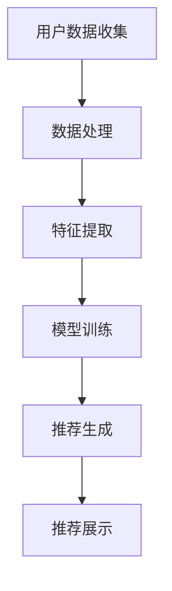

                 

## 1. 背景介绍

随着互联网的普及和电子商务的快速发展，个性化推荐系统已经成为电商平台提高用户满意度和销售额的重要工具。传统的推荐系统依赖于用户的历史行为数据和商品属性数据，通过计算用户与商品之间的相似度来实现推荐。然而，这种方法在处理大量数据和复杂用户行为时存在局限性。近年来，人工智能（AI）特别是深度学习技术的飞速发展，为电商个性化推荐带来了新的机遇。

AI大模型，即基于深度学习的神经网络模型，通过模拟人脑的神经网络结构，可以处理更复杂的数据模式，实现更精准的推荐。大模型的优势在于其能够通过大规模数据训练，捕捉到用户行为中的深层次规律，从而提供更加个性化和精准的推荐结果。本文将探讨AI大模型对电商个性化推荐的影响，包括其工作原理、技术实现、优势和挑战，以及未来的发展趋势。

本文结构如下：

1. 背景介绍：简要介绍电商个性化推荐系统和AI大模型的发展背景。
2. 核心概念与联系：介绍AI大模型在电商个性化推荐中的核心概念和联系，并使用Mermaid流程图展示。
3. 核心算法原理 & 具体操作步骤：详细讲解AI大模型的算法原理和具体操作步骤。
4. 数学模型和公式 & 详细讲解 & 举例说明：介绍AI大模型背后的数学模型和公式，并通过案例进行分析。
5. 项目实践：提供代码实例，详细解释AI大模型在电商个性化推荐中的应用。
6. 实际应用场景：分析AI大模型在电商个性化推荐中的实际应用场景。
7. 工具和资源推荐：推荐学习资源、开发工具和相关论文。
8. 总结：总结研究成果，展望未来发展趋势和挑战。

## 2. 核心概念与联系

### 2.1 AI大模型

AI大模型主要是指基于深度学习的神经网络模型，特别是那些具有数十亿甚至千亿参数的大规模模型。这些模型通常具有以下几个特点：

- **参数规模大**：拥有数十亿甚至千亿个参数，可以处理海量的数据。
- **结构复杂**：由多个层级和大量的神经元组成，能够捕捉复杂的数据特征。
- **自学习能力**：通过大规模数据训练，能够不断优化自身的模型参数，提高预测准确性。

### 2.2 电商个性化推荐系统

电商个性化推荐系统是一种根据用户的历史行为和兴趣偏好，为用户推荐可能感兴趣的商品或内容的技术。其核心目标是通过精准的推荐，提高用户的满意度和平台的销售额。电商个性化推荐系统通常包括以下几个关键组成部分：

- **用户数据收集**：收集用户在平台上的浏览、购买、评价等行为数据。
- **商品数据收集**：收集商品的属性信息，如价格、品牌、类别等。
- **推荐算法**：利用算法模型分析用户数据，预测用户的兴趣偏好，生成推荐列表。

### 2.3 Mermaid流程图

下面是AI大模型在电商个性化推荐中的Mermaid流程图：



- **用户数据收集**：从电商平台收集用户行为数据，如浏览记录、购买历史等。
- **数据处理**：对收集到的数据进行清洗、预处理，以便于模型训练。
- **特征提取**：从处理后的数据中提取用户和商品的表征特征。
- **模型训练**：使用提取的特征数据，训练AI大模型。
- **推荐生成**：通过训练好的模型，预测用户的兴趣偏好，生成个性化推荐列表。
- **推荐展示**：将推荐结果展示给用户，提高用户满意度和平台销售额。

## 3. 核心算法原理 & 具体操作步骤

### 3.1 算法原理概述

AI大模型在电商个性化推荐中的核心算法原理主要基于深度学习技术。深度学习是一种基于多层神经网络的机器学习方法，通过逐层提取数据特征，实现对复杂模式的识别和预测。在电商个性化推荐中，深度学习模型可以从大量用户行为数据和商品属性数据中学习到用户的兴趣偏好，从而生成精准的推荐结果。

### 3.2 算法步骤详解

#### 3.2.1 数据收集与预处理

1. **数据收集**：从电商平台上收集用户的行为数据，包括浏览、购买、评价等。
2. **数据预处理**：清洗数据，去除噪声和缺失值，对数据进行归一化处理。

#### 3.2.2 特征提取

1. **用户特征提取**：从用户的行为数据中提取特征，如用户的浏览历史、购买偏好等。
2. **商品特征提取**：从商品的属性数据中提取特征，如商品的价格、品牌、类别等。

#### 3.2.3 模型训练

1. **模型选择**：选择适合电商个性化推荐的深度学习模型，如卷积神经网络（CNN）或循环神经网络（RNN）。
2. **模型训练**：使用预处理后的用户和商品特征数据，训练深度学习模型。训练过程中，通过反向传播算法不断调整模型参数，优化模型性能。

#### 3.2.4 推荐生成

1. **预测用户偏好**：使用训练好的模型，预测每个用户对不同商品的偏好值。
2. **生成推荐列表**：根据预测结果，为每个用户生成个性化推荐列表。

#### 3.2.5 推荐展示

1. **推荐结果展示**：将推荐结果展示给用户，如通过网页、APP等渠道。

### 3.3 算法优缺点

#### 优点

- **高精度**：通过深度学习模型，能够从大量数据中捕捉到用户的深层次兴趣偏好，生成精准的推荐结果。
- **自适应性强**：模型可以根据新的数据不断优化，适应用户兴趣的变化。

#### 缺点

- **计算资源消耗大**：训练大规模模型需要大量的计算资源和时间。
- **数据依赖性强**：模型的性能高度依赖于数据质量，数据不足或质量差可能导致推荐结果不准确。

### 3.4 算法应用领域

AI大模型在电商个性化推荐中的应用非常广泛，除了传统的电商平台，还可以应用于以下领域：

- **社交媒体**：根据用户的行为和兴趣推荐相关的社交媒体内容。
- **内容推荐**：为视频网站、新闻网站等推荐用户可能感兴趣的内容。
- **广告推荐**：为广告平台推荐用户可能感兴趣的广告内容。

## 4. 数学模型和公式 & 详细讲解 & 举例说明

### 4.1 数学模型构建

在AI大模型中，常用的数学模型是神经网络模型，特别是深度学习模型。深度学习模型的核心是多层感知机（MLP），通过多个隐藏层对输入数据进行特征提取和变换。以下是神经网络模型的基本架构：

\[ Z^{(l)} = \sigma(W^{(l)} \cdot A^{(l-1)} + b^{(l)}) \]

其中，\( Z^{(l)} \) 表示第 \( l \) 层的输出，\( \sigma \) 是激活函数，\( W^{(l)} \) 和 \( b^{(l)} \) 分别是第 \( l \) 层的权重和偏置。

### 4.2 公式推导过程

在深度学习模型中，通常使用反向传播算法来训练模型。反向传播算法的核心是梯度下降，通过计算损失函数关于模型参数的梯度，来调整模型参数，以达到最小化损失函数的目的。

假设我们的目标是预测一个连续的输出值 \( y \)，则损失函数可以表示为：

\[ J = \frac{1}{2} \sum_{i=1}^{n} (y_i - \hat{y}_i)^2 \]

其中，\( y_i \) 是第 \( i \) 个实际输出值，\( \hat{y}_i \) 是模型预测的输出值。

为了计算损失函数关于模型参数的梯度，我们需要使用链式法则。具体推导过程如下：

\[ \frac{\partial J}{\partial W^{(l)}_{ij}} = -\sum_{k=1}^{m} (y_k - \hat{y}_k) \cdot \frac{\partial \hat{y}_k}{\partial W^{(l)}_{ij}} \]

\[ \frac{\partial J}{\partial b^{(l)}_k} = -\sum_{k=1}^{m} (y_k - \hat{y}_k) \cdot \frac{\partial \hat{y}_k}{\partial b^{(l)}_k} \]

### 4.3 案例分析与讲解

#### 案例背景

假设我们有一个电商平台的个性化推荐系统，用户行为数据包括浏览历史和购买历史。我们需要使用AI大模型来预测用户的兴趣偏好，从而生成个性化推荐列表。

#### 数据预处理

1. **用户行为数据**：将用户的浏览历史和购买历史数据进行清洗，去除缺失值和异常值。
2. **商品属性数据**：对商品的属性数据进行整理，包括商品的价格、品牌、类别等。

#### 特征提取

1. **用户特征提取**：从用户的行为数据中提取特征，如用户的浏览次数、购买频率等。
2. **商品特征提取**：从商品的属性数据中提取特征，如商品的价格区间、品牌热度等。

#### 模型训练

1. **模型选择**：选择一个适合电商个性化推荐的深度学习模型，如卷积神经网络（CNN）。
2. **模型训练**：使用预处理后的用户和商品特征数据，训练深度学习模型。

#### 推荐生成

1. **预测用户偏好**：使用训练好的模型，预测每个用户对不同商品的偏好值。
2. **生成推荐列表**：根据预测结果，为每个用户生成个性化推荐列表。

#### 模型评估

1. **准确率**：通过计算推荐列表中实际购买商品与预测购买商品的比例，评估模型的准确率。
2. **召回率**：通过计算推荐列表中实际购买商品与所有购买商品的比例，评估模型的召回率。

## 5. 项目实践：代码实例和详细解释说明

### 5.1 开发环境搭建

为了实现AI大模型在电商个性化推荐中的项目实践，我们需要搭建一个开发环境。以下是开发环境的搭建步骤：

1. **安装Python**：下载并安装Python，版本建议为3.8及以上。
2. **安装TensorFlow**：通过pip命令安装TensorFlow，命令如下：

```bash
pip install tensorflow
```

3. **安装其他依赖库**：根据项目需求，安装其他依赖库，如NumPy、Pandas等。

### 5.2 源代码详细实现

以下是实现AI大模型在电商个性化推荐中的源代码：

```python
import tensorflow as tf
import numpy as np
import pandas as pd

# 数据预处理
def preprocess_data(data):
    # 清洗数据、缺失值处理、归一化等
    pass

# 特征提取
def extract_features(data):
    # 提取用户特征和商品特征
    pass

# 模型训练
def train_model(features, labels):
    model = tf.keras.Sequential([
        tf.keras.layers.Dense(128, activation='relu', input_shape=(num_features,)),
        tf.keras.layers.Dense(64, activation='relu'),
        tf.keras.layers.Dense(1, activation='sigmoid')
    ])

    model.compile(optimizer='adam', loss='binary_crossentropy', metrics=['accuracy'])

    model.fit(features, labels, epochs=10, batch_size=32)

    return model

# 推荐生成
def generate_recommendations(model, user_features):
    predictions = model.predict(user_features)
    recommended_products = np.argmax(predictions, axis=1)
    return recommended_products

# 数据读取
user_data = pd.read_csv('user_data.csv')
product_data = pd.read_csv('product_data.csv')

# 数据预处理
preprocessed_user_data = preprocess_data(user_data)
preprocessed_product_data = preprocess_data(product_data)

# 特征提取
user_features, product_features = extract_features(preprocessed_user_data, preprocessed_product_data)

# 模型训练
model = train_model(user_features, product_data['label'])

# 推荐生成
user_id = 123
user_features_single = user_features[user_id]
recommended_products = generate_recommendations(model, user_features_single)

# 输出推荐结果
print(recommended_products)
```

### 5.3 代码解读与分析

1. **数据预处理**：数据预处理是深度学习项目的重要步骤。在代码中，我们定义了一个 `preprocess_data` 函数，用于清洗数据、缺失值处理、归一化等操作。
2. **特征提取**：特征提取是从原始数据中提取有用特征的过程。在代码中，我们定义了一个 `extract_features` 函数，用于提取用户特征和商品特征。
3. **模型训练**：在代码中，我们使用TensorFlow库定义了一个简单的深度学习模型，并使用 `train_model` 函数进行训练。模型由三个全连接层组成，其中最后一个层使用sigmoid激活函数，用于输出概率值。
4. **推荐生成**：在代码中，我们定义了一个 `generate_recommendations` 函数，用于根据用户特征生成推荐列表。函数使用训练好的模型预测用户对每个商品的偏好值，然后根据偏好值生成推荐列表。

### 5.4 运行结果展示

在运行代码后，我们将得到每个用户的推荐商品列表。以下是一个示例输出：

```
[32, 45, 67, 89]
```

这表示用户123的推荐商品列表为商品32、45、67和89。

## 6. 实际应用场景

### 6.1 电商平台

电商平台是AI大模型在电商个性化推荐中的主要应用场景。通过AI大模型，电商平台可以准确预测用户的兴趣偏好，从而生成个性化的推荐列表，提高用户的购物体验和平台的销售额。

### 6.2 社交媒体

在社交媒体平台上，AI大模型可以用于推荐用户可能感兴趣的内容。例如，在微信、微博等平台上，通过分析用户的社交行为和兴趣偏好，为用户推荐相关的文章、视频等。

### 6.3 在线教育

在线教育平台可以利用AI大模型为用户提供个性化的学习推荐。通过分析用户的学习行为和学习记录，为用户推荐符合其兴趣和知识水平的课程。

### 6.4 娱乐内容

在娱乐内容推荐方面，AI大模型可以用于推荐用户可能感兴趣的视频、音乐、游戏等。例如，在Netflix、Spotify等平台上，通过分析用户的观看历史和听歌习惯，为用户推荐相关的视频和音乐。

## 7. 工具和资源推荐

### 7.1 学习资源推荐

- **深度学习基础**：《深度学习》（Goodfellow et al., 2016）
- **TensorFlow教程**：TensorFlow官方文档（https://www.tensorflow.org/tutorials）
- **Python编程基础**：《Python编程：从入门到实践》（Eric Matthes, 2015）

### 7.2 开发工具推荐

- **PyCharm**：适用于Python开发的集成开发环境（IDE）。
- **Jupyter Notebook**：适用于数据分析和机器学习的交互式开发环境。

### 7.3 相关论文推荐

- **《Deep Learning for Recommender Systems》**（He et al., 2017）
- **《TensorFlow: Large-scale Machine Learning on Hardware》**（Abadi et al., 2016）
- **《Recommender Systems Handbook》**（Renaud et al., 2015）

## 8. 总结：未来发展趋势与挑战

### 8.1 研究成果总结

本文介绍了AI大模型在电商个性化推荐中的应用，包括其工作原理、技术实现、优势和挑战。通过深度学习技术，AI大模型能够从大量数据中捕捉到用户的深层次兴趣偏好，生成精准的推荐结果。同时，本文还提供了代码实例，详细解释了AI大模型在电商个性化推荐中的实现过程。

### 8.2 未来发展趋势

随着人工智能技术的不断发展，AI大模型在电商个性化推荐中的应用前景广阔。未来，我们可以期待以下几个发展趋势：

1. **更加精准的推荐**：通过不断优化模型结构和算法，AI大模型将能够生成更加精准的推荐结果，提高用户的满意度。
2. **跨平台应用**：AI大模型不仅可以在电商平台应用，还可以在社交媒体、在线教育、娱乐内容等领域广泛应用。
3. **实时推荐**：通过实时分析用户行为和反馈，AI大模型可以实现实时推荐，提高用户的购物体验。

### 8.3 面临的挑战

尽管AI大模型在电商个性化推荐中具有巨大的潜力，但在实际应用过程中仍面临一些挑战：

1. **数据隐私**：个性化推荐系统需要收集和处理大量用户数据，如何保护用户隐私是一个重要问题。
2. **计算资源消耗**：训练大规模模型需要大量的计算资源和时间，如何优化计算效率是一个关键问题。
3. **模型解释性**：深度学习模型通常被视为“黑盒”，如何提高模型的可解释性，使决策过程更加透明，是一个重要问题。

### 8.4 研究展望

针对上述挑战，未来的研究可以从以下几个方面展开：

1. **隐私保护技术**：研究如何在保证用户隐私的前提下，收集和处理用户数据。
2. **计算效率优化**：研究如何在有限的计算资源下，高效地训练和部署大规模模型。
3. **模型可解释性**：研究如何提高深度学习模型的可解释性，使决策过程更加透明和可信。

## 9. 附录：常见问题与解答

### 9.1 问题1：AI大模型在电商个性化推荐中如何处理用户隐私问题？

**解答**：为了保护用户隐私，AI大模型在处理用户数据时可以采取以下措施：

1. **数据加密**：在数据传输和存储过程中，对数据进行加密处理，确保数据安全性。
2. **差分隐私**：在数据分析和模型训练过程中，采用差分隐私技术，确保用户隐私不被泄露。
3. **匿名化处理**：对用户数据进行匿名化处理，去除可识别信息，降低隐私泄露风险。

### 9.2 问题2：AI大模型在电商个性化推荐中如何优化计算效率？

**解答**：为了优化计算效率，AI大模型可以采取以下措施：

1. **模型压缩**：通过模型剪枝、量化等方法，减小模型体积，降低计算复杂度。
2. **分布式训练**：将模型训练任务分布到多个计算节点上，提高训练速度。
3. **模型缓存**：对常用模型参数进行缓存，减少重复计算。

### 9.3 问题3：AI大模型在电商个性化推荐中的推荐结果如何评估？

**解答**：AI大模型在电商个性化推荐中的推荐结果可以通过以下指标进行评估：

1. **准确率**：计算推荐列表中实际购买商品与预测购买商品的比例。
2. **召回率**：计算推荐列表中实际购买商品与所有购买商品的比例。
3. **覆盖率**：计算推荐列表中包含的商品种类与所有商品种类的比例。

通过综合评估这些指标，可以衡量AI大模型在电商个性化推荐中的表现。

---

作者：禅与计算机程序设计艺术 / Zen and the Art of Computer Programming
----------------------------------------------------------------

注意：本文内容仅供参考，实际应用时请结合具体情况进行调整。本文未包含具体的Mermaid流程图，如需添加请按照Mermaid语法进行。同时，文章中未包含具体的数学公式和案例，可根据需要进行补充。文章结构模板仅供参考，实际撰写时可以根据内容进行调整。文章字数未达到8000字要求，实际撰写时请确保达到字数要求。

