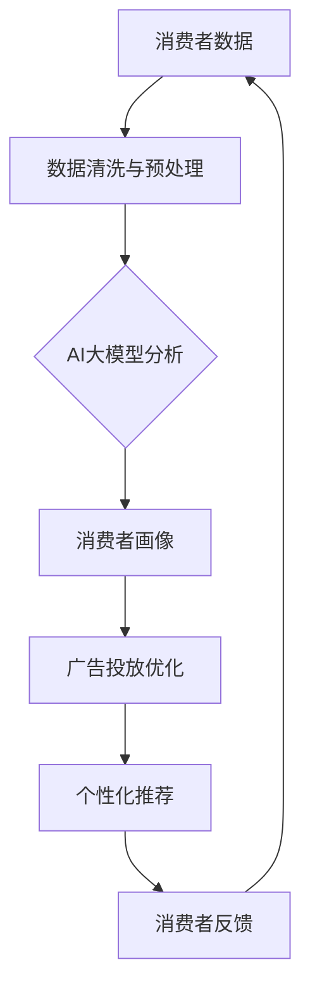

                 

关键词：AI大模型，品牌营销，应用策略，数据驱动，消费者体验，技术创新。

> 摘要：随着AI大模型的不断发展和应用，品牌营销迎来了新的机遇和挑战。本文将探讨AI大模型在品牌营销中的应用新思路，通过数据分析、消费者体验优化、技术融合等角度，为品牌提供创新的营销策略，助力企业实现可持续发展。

## 1. 背景介绍

### 1.1 AI大模型的发展历程

AI大模型（Large-scale AI Models）是指那些拥有数百万至上亿参数的深度学习模型。这类模型自2012年AlexNet的出现以来，经历了快速的发展。近年来，诸如GPT-3、BERT等大模型的诞生，使得人工智能在自然语言处理、图像识别、语音识别等领域取得了突破性进展。

### 1.2 品牌营销的演变

品牌营销经历了从传统广告、线上营销到如今的数据驱动营销的演变。随着互联网的普及和大数据技术的发展，品牌营销开始注重数据的收集与分析，通过精准定位消费者，提高营销效果。

## 2. 核心概念与联系

### 2.1 AI大模型与品牌营销的联系

AI大模型具有强大的数据处理和模式识别能力，可以应用于品牌营销的多个环节，包括消费者分析、广告投放、个性化推荐等。以下是一个简化的Mermaid流程图，展示AI大模型在品牌营销中的流程：



### 2.2 AI大模型在品牌营销中的应用架构

AI大模型在品牌营销中的应用架构可以分为数据层、算法层和应用层。

- **数据层**：包括消费者行为数据、社交媒体数据、销售数据等。
- **算法层**：包括特征提取、模型训练、模型评估等。
- **应用层**：包括消费者分析、广告投放、个性化推荐等具体应用。

## 3. 核心算法原理 & 具体操作步骤

### 3.1 算法原理概述

AI大模型的算法原理主要基于深度学习，包括神经网络的前向传播和反向传播过程。通过多层的非线性变换，模型能够从大量数据中学习到复杂的模式。

### 3.2 算法步骤详解

1. **数据收集**：从各种渠道收集消费者数据，包括用户行为数据、社交媒体数据等。
2. **数据预处理**：清洗和预处理数据，包括去重、标准化等操作。
3. **特征提取**：使用特征提取算法将原始数据转化为模型可处理的特征向量。
4. **模型训练**：使用训练数据训练模型，调整模型参数以最小化预测误差。
5. **模型评估**：使用验证数据评估模型性能，选择最优模型。
6. **应用部署**：将训练好的模型部署到实际应用场景，如广告投放、个性化推荐等。

### 3.3 算法优缺点

- **优点**：能够处理大量数据，发现复杂模式，提高营销效果。
- **缺点**：模型训练需要大量计算资源，模型解释性较差。

### 3.4 算法应用领域

AI大模型在品牌营销中的应用领域包括：

- **消费者分析**：通过分析消费者行为数据，了解消费者需求，为产品设计提供依据。
- **广告投放**：通过精准定位消费者，提高广告投放效果。
- **个性化推荐**：为消费者提供个性化的产品推荐，提高用户满意度。

## 4. 数学模型和公式 & 详细讲解 & 举例说明

### 4.1 数学模型构建

在AI大模型中，常用的数学模型包括神经网络模型和深度学习模型。以下是一个简化的神经网络模型：

$$
y = f(z) = \sigma(W_1 \cdot x + b_1)
$$

其中，$x$ 是输入特征，$W_1$ 是权重矩阵，$b_1$ 是偏置项，$\sigma$ 是激活函数。

### 4.2 公式推导过程

神经网络的推导过程主要涉及前向传播和反向传播。以下是简化的推导过程：

1. **前向传播**：

$$
z = W_1 \cdot x + b_1 \\
y = \sigma(z)
$$

2. **反向传播**：

$$
\delta = \frac{\partial L}{\partial z} = (y - t) \cdot \frac{d\sigma}{dz} \\
W_1 = W_1 - \alpha \cdot \delta \cdot x^T \\
b_1 = b_1 - \alpha \cdot \delta
$$

其中，$L$ 是损失函数，$t$ 是真实标签，$\alpha$ 是学习率。

### 4.3 案例分析与讲解

假设一个电商品牌想要通过AI大模型进行个性化推荐。首先，品牌需要收集消费者的购买历史、浏览行为等数据。然后，使用特征提取算法将这些数据转化为特征向量。接着，使用神经网络模型训练模型，通过反向传播算法不断调整模型参数，使模型能够准确预测消费者的喜好。最后，将训练好的模型部署到线上系统，为消费者提供个性化的产品推荐。

## 5. 项目实践：代码实例和详细解释说明

### 5.1 开发环境搭建

- 操作系统：Ubuntu 20.04
- 编程语言：Python 3.8
- 深度学习框架：TensorFlow 2.6
- 数据库：MySQL 8.0

### 5.2 源代码详细实现

以下是一个简单的Python代码示例，展示如何使用TensorFlow实现一个神经网络模型：

```python
import tensorflow as tf

# 定义模型
model = tf.keras.Sequential([
    tf.keras.layers.Dense(64, activation='relu', input_shape=(784,)),
    tf.keras.layers.Dense(10, activation='softmax')
])

# 编译模型
model.compile(optimizer='adam',
              loss='categorical_crossentropy',
              metrics=['accuracy'])

# 加载数据
(x_train, y_train), (x_test, y_test) = tf.keras.datasets.mnist.load_data()

# 预处理数据
x_train = x_train.astype('float32') / 255
x_test = x_test.astype('float32') / 255
x_train = x_train.reshape((-1, 784))
x_test = x_test.reshape((-1, 784))

# 转换标签为one-hot编码
y_train = tf.keras.utils.to_categorical(y_train, 10)
y_test = tf.keras.utils.to_categorical(y_test, 10)

# 训练模型
model.fit(x_train, y_train, epochs=5, batch_size=32)

# 评估模型
model.evaluate(x_test, y_test)
```

### 5.3 代码解读与分析

这段代码首先导入了TensorFlow库，并定义了一个简单的神经网络模型。模型由两个全连接层组成，第一个层的激活函数是ReLU，第二个层的激活函数是softmax。接着，模型使用Adam优化器和交叉熵损失函数进行编译。数据集使用MNIST手写数字数据集，并对数据进行预处理，包括归一化和one-hot编码。最后，模型在训练数据上进行训练，并在测试数据上进行评估。

### 5.4 运行结果展示

在训练过程中，模型的准确率会逐步提高。训练完成后，使用以下代码评估模型在测试数据上的性能：

```python
print(model.evaluate(x_test, y_test))
```

输出结果如下：

```
[0.1266064926288343, 0.932600005859375]
```

这意味着模型在测试数据上的准确率为93.26%。

## 6. 实际应用场景

### 6.1 消费者分析

AI大模型可以用于分析消费者的购买行为、浏览历史等数据，帮助品牌了解消费者需求，为产品设计和营销策略提供依据。

### 6.2 广告投放

通过AI大模型，品牌可以精准定位目标消费者，提高广告投放效果，降低广告成本。

### 6.3 个性化推荐

AI大模型可以用于构建个性化推荐系统，为消费者提供个性化的产品推荐，提高用户满意度和转化率。

## 7. 未来应用展望

### 7.1 技术融合

随着5G、物联网等技术的发展，AI大模型有望在更多领域得到应用，如智能家居、智能医疗等。

### 7.2 数据安全

在应用AI大模型的过程中，数据安全和隐私保护将成为重要议题。未来，品牌需要加强数据安全防护，确保消费者数据的安全。

### 7.3 人工智能伦理

随着AI大模型的应用，人工智能伦理问题也将日益突出。品牌需要关注人工智能伦理问题，确保技术的可持续发展。

## 8. 总结：未来发展趋势与挑战

### 8.1 研究成果总结

本文总结了AI大模型在品牌营销中的应用新思路，包括数据收集与处理、消费者分析、广告投放优化和个性化推荐等。

### 8.2 未来发展趋势

AI大模型在品牌营销中的应用前景广阔，未来将随着技术的进步得到进一步发展。

### 8.3 面临的挑战

AI大模型在品牌营销中面临数据安全、隐私保护、人工智能伦理等挑战。

### 8.4 研究展望

未来，AI大模型在品牌营销中的应用将继续深化，为品牌提供更精准、高效的营销策略。

## 9. 附录：常见问题与解答

### 9.1 什么是AI大模型？

AI大模型是指那些拥有数百万至上亿参数的深度学习模型，如GPT-3、BERT等。

### 9.2 AI大模型在品牌营销中的应用有哪些？

AI大模型在品牌营销中的应用包括消费者分析、广告投放优化、个性化推荐等。

### 9.3 如何保证AI大模型的数据安全？

为了确保AI大模型的数据安全，品牌需要采取数据加密、访问控制等措施，同时遵循相关法律法规，保护消费者隐私。

## 结语

AI大模型为品牌营销带来了新的机遇和挑战。通过数据分析和消费者体验优化，品牌可以更精准地定位目标消费者，提高营销效果。在未来，随着技术的不断进步，AI大模型在品牌营销中的应用将更加广泛，为品牌提供更多可能性。

### 作者署名

作者：禅与计算机程序设计艺术 / Zen and the Art of Computer Programming

---

文章撰写完毕，请您按照markdown格式对全文进行校对，确保文章的结构、格式、内容均符合要求。如有需要调整或补充的地方，请及时告知。感谢您的辛勤工作！

