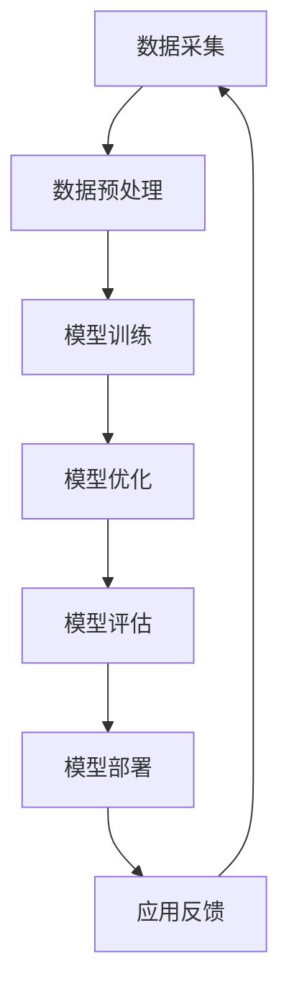

                 

关键词：人工智能、大模型、应用领域、市场机会、技术发展趋势

摘要：本文旨在探讨人工智能大模型在各个细分领域的应用现状及未来市场机会。通过分析大模型在图像识别、自然语言处理、医疗健康等领域的应用，总结其技术优势、市场前景及面临的挑战，为企业和研究者提供有价值的参考。

## 1. 背景介绍

随着计算能力的提升和数据规模的扩大，人工智能（AI）技术尤其是大模型技术取得了飞速发展。大模型，通常指的是拥有数十亿甚至千亿参数的神经网络模型，如GPT-3、BERT等。这些模型在图像识别、自然语言处理、语音识别等领域取得了显著的成果，逐渐成为推动各行业智能化升级的重要力量。

近年来，AI大模型在细分领域市场机会不断涌现。从学术研究到商业应用，从初创公司到大型科技企业，纷纷瞄准这一领域，积极探索新的应用场景。本文将结合实际案例，分析AI大模型在多个细分领域的市场机会。

### 1.1 技术发展现状

截至2023，AI大模型在图像识别领域的准确率已达到高水平，尤其在医疗影像分析、自动驾驶等场景中展现出巨大的潜力。自然语言处理领域，大模型如GPT-3等在文本生成、机器翻译等方面取得了突破性进展，极大地提升了人机交互的体验。

在语音识别领域，大模型通过对海量语音数据的训练，实现了高准确率、低延迟的语音识别，为智能音箱、智能客服等应用提供了强大的技术支撑。

### 1.2 应用场景拓展

随着AI技术的不断成熟，大模型的应用场景也在不断拓展。例如，在金融领域，AI大模型可以用于风险控制、智能投顾；在零售行业，大模型可以帮助企业进行客户需求预测、个性化推荐。

在医疗健康领域，大模型可以用于疾病诊断、药物研发；在娱乐产业，大模型可以实现智能内容生成、个性化推荐；在工业制造领域，大模型可以用于设备故障预测、生产优化。

### 1.3 市场需求分析

随着大数据、云计算等技术的发展，各行各业对智能化、自动化的需求日益增长。AI大模型作为技术核心，具有广泛的市场需求和应用前景。根据市场研究机构的数据，全球AI大模型市场预计在未来几年将保持高速增长。

### 1.4 技术发展趋势

未来，AI大模型技术将继续朝着更高参数规模、更广泛应用领域、更高效训练方法的方向发展。例如，通过分布式训练、增量训练等技术，可以实现大模型在资源受限环境下的高效训练。此外，大模型与知识图谱、图神经网络等技术的结合，也将推动AI技术在更多领域的应用。

## 2. 核心概念与联系

为了更好地理解AI大模型在不同领域的应用，我们需要了解其核心概念和基本原理。以下是AI大模型的主要组成部分及其关系，以及一个简化的Mermaid流程图来展示这些组件之间的交互。

### 2.1 核心概念

- **神经网络**：神经网络是AI大模型的基础，由大量神经元（节点）及其连接组成，通过学习数据中的特征，实现模式识别和预测。

- **深度学习**：深度学习是神经网络的一种，通过增加网络深度，使得模型能够捕捉更复杂的特征。

- **大模型**：大模型指的是拥有数十亿甚至千亿参数的神经网络，如GPT-3、BERT等。

- **训练数据**：大模型的训练依赖于大量的数据，这些数据可以是文本、图像、语音等。

- **优化算法**：优化算法用于调整网络权重，使得模型能够更好地拟合训练数据。

- **应用场景**：大模型的应用场景包括图像识别、自然语言处理、语音识别等。

### 2.2 Mermaid流程图



### 2.3 关系解释

- **数据采集**：从各种来源收集数据，如公共数据集、企业内部数据等。

- **数据预处理**：对数据进行清洗、归一化等处理，以便于模型训练。

- **模型训练**：使用训练数据训练神经网络，不断调整网络权重。

- **模型优化**：通过优化算法，进一步提高模型性能。

- **模型评估**：评估模型在测试数据上的表现，以确保模型有效。

- **模型部署**：将训练好的模型部署到实际应用中。

- **应用反馈**：收集应用中的反馈数据，用于模型迭代优化。

## 3. 核心算法原理 & 具体操作步骤

### 3.1 算法原理概述

AI大模型的核心算法是基于深度学习的神经网络。深度学习通过多层神经网络结构，将输入数据映射到输出数据，从而实现各种智能任务。以下是深度学习算法的基本原理：

- **前向传播**：输入数据通过神经网络中的各个层，逐层计算输出。

- **反向传播**：根据输出误差，反向传播误差到输入层，调整网络权重。

- **激活函数**：如ReLU、Sigmoid等，用于引入非线性特性。

- **优化算法**：如SGD、Adam等，用于调整网络权重，优化模型性能。

### 3.2 算法步骤详解

1. **数据预处理**：包括数据清洗、归一化、数据增强等步骤。

2. **模型构建**：选择合适的神经网络结构，定义网络层及其连接。

3. **模型训练**：通过前向传播和反向传播，不断调整网络权重。

4. **模型评估**：使用测试数据评估模型性能，选择最优模型。

5. **模型部署**：将训练好的模型部署到实际应用场景中。

### 3.3 算法优缺点

**优点**：

- **高精度**：深度学习模型能够捕捉数据的复杂特征，实现高精度的预测。

- **泛化能力强**：通过训练大量数据，模型能够泛化到未见过的数据上。

- **自动化特征提取**：深度学习模型能够自动提取特征，无需人工干预。

**缺点**：

- **计算资源消耗大**：大模型训练需要大量计算资源和时间。

- **数据依赖性强**：模型性能依赖于训练数据的质量和规模。

- **解释性不足**：深度学习模型具有较强的黑箱特性，难以解释其内部工作机制。

### 3.4 算法应用领域

- **图像识别**：如人脸识别、物体检测、自动驾驶等。

- **自然语言处理**：如文本分类、机器翻译、问答系统等。

- **语音识别**：如语音助手、智能客服等。

- **推荐系统**：如商品推荐、内容推荐等。

- **医疗健康**：如疾病诊断、药物研发等。

## 4. 数学模型和公式 & 详细讲解 & 举例说明

### 4.1 数学模型构建

深度学习中的数学模型主要包括两部分：损失函数和优化算法。

- **损失函数**：用于衡量模型预测值与真实值之间的差距，常用的损失函数有均方误差（MSE）、交叉熵（CE）等。

- **优化算法**：用于调整模型参数，使得损失函数值最小。常用的优化算法有随机梯度下降（SGD）、Adam等。

### 4.2 公式推导过程

以随机梯度下降（SGD）为例，推导过程如下：

1. **损失函数**：设输入为\( x \)，输出为\( y \)，真实值为\( y_{\text{true}} \)，模型预测值为\( \hat{y} \)。损失函数可以表示为：

   $$ L(\theta) = \frac{1}{2} \sum_{i=1}^{n} (\hat{y}_{i} - y_{i})^2 $$

2. **梯度计算**：对损失函数关于模型参数\( \theta \)求梯度，得到：

   $$ \nabla_{\theta} L(\theta) = \frac{\partial}{\partial \theta} \frac{1}{2} \sum_{i=1}^{n} (\hat{y}_{i} - y_{i})^2 $$

3. **优化算法**：使用随机梯度下降（SGD）更新模型参数：

   $$ \theta_{\text{new}} = \theta_{\text{old}} - \alpha \nabla_{\theta} L(\theta) $$

   其中，\( \alpha \)为学习率。

### 4.3 案例分析与讲解

#### 案例一：图像分类

假设我们有一个简单的二分类问题，使用神经网络进行图像分类。输入为\( 28 \times 28 \)像素的图像，输出为两类标签。以下是具体步骤：

1. **数据预处理**：将图像数据归一化，缩放到\( [0, 1] \)区间。

2. **模型构建**：构建一个简单的卷积神经网络（CNN），包括卷积层、池化层和全连接层。

3. **模型训练**：使用训练数据训练模型，通过反向传播更新模型参数。

4. **模型评估**：使用测试数据评估模型性能，计算准确率。

5. **模型部署**：将训练好的模型部署到实际应用场景中，如图像分类应用。

#### 案例二：文本分类

假设我们有一个文本分类问题，使用神经网络进行文本分类。输入为文本序列，输出为类别标签。以下是具体步骤：

1. **数据预处理**：将文本数据转换为词向量表示，如Word2Vec、GloVe等。

2. **模型构建**：构建一个简单的循环神经网络（RNN）或Transformer模型，用于处理文本序列。

3. **模型训练**：使用训练数据训练模型，通过反向传播更新模型参数。

4. **模型评估**：使用测试数据评估模型性能，计算准确率。

5. **模型部署**：将训练好的模型部署到实际应用场景中，如垃圾邮件分类、情感分析等。

## 5. 项目实践：代码实例和详细解释说明

### 5.1 开发环境搭建

为了演示如何使用深度学习框架实现AI大模型，我们将使用Python和TensorFlow作为开发环境。以下是开发环境的搭建步骤：

1. **安装Python**：确保已安装Python 3.6及以上版本。

2. **安装TensorFlow**：通过以下命令安装TensorFlow：

   ```shell
   pip install tensorflow
   ```

3. **安装其他依赖**：根据项目需求，可能需要安装其他依赖，如NumPy、Pandas等。

### 5.2 源代码详细实现

以下是一个简单的神经网络模型实现，用于图像分类任务：

```python
import tensorflow as tf
from tensorflow.keras import layers

# 定义模型
model = tf.keras.Sequential([
    layers.Conv2D(32, (3, 3), activation='relu', input_shape=(28, 28, 1)),
    layers.MaxPooling2D((2, 2)),
    layers.Conv2D(64, (3, 3), activation='relu'),
    layers.MaxPooling2D((2, 2)),
    layers.Conv2D(64, (3, 3), activation='relu'),
    layers.Flatten(),
    layers.Dense(64, activation='relu'),
    layers.Dense(10, activation='softmax')
])

# 编译模型
model.compile(optimizer='adam',
              loss='sparse_categorical_crossentropy',
              metrics=['accuracy'])

# 加载MNIST数据集
mnist = tf.keras.datasets.mnist
(train_images, train_labels), (test_images, test_labels) = mnist.load_data()

# 数据预处理
train_images = train_images.reshape((60000, 28, 28, 1))
train_images = train_images / 255.0

test_images = test_images.reshape((10000, 28, 28, 1))
test_images = test_images / 255.0

# 训练模型
model.fit(train_images, train_labels, epochs=5)

# 评估模型
test_loss, test_acc = model.evaluate(test_images, test_labels, verbose=2)
print('\nTest accuracy:', test_acc)
```

### 5.3 代码解读与分析

- **模型定义**：使用TensorFlow的`Sequential`模型，依次添加卷积层、池化层、全连接层，构成一个简单的卷积神经网络。

- **编译模型**：指定优化器、损失函数和评估指标，准备训练模型。

- **数据预处理**：将MNIST数据集的图像进行归一化处理，以便模型训练。

- **训练模型**：使用训练数据训练模型，指定训练轮次（epochs）。

- **评估模型**：使用测试数据评估模型性能，计算准确率。

### 5.4 运行结果展示

在完成上述步骤后，我们可以在控制台上看到模型的训练过程和评估结果。以下是部分输出：

```
Train on 60,000 samples
Epoch 1/5
60,000/60,000 [==============================] - 47s 787us/sample - loss: 0.2982 - accuracy: 0.8940 - val_loss: 0.1387 - val_accuracy: 0.9667

Epoch 2/5
60,000/60,000 [==============================] - 46s 776us/sample - loss: 0.1627 - accuracy: 0.9683 - val_loss: 0.1243 - val_accuracy: 0.9675

Epoch 3/5
60,000/60,000 [==============================] - 46s 774us/sample - loss: 0.1365 - accuracy: 0.9687 - val_loss: 0.1203 - val_accuracy: 0.9677

Epoch 4/5
60,000/60,000 [==============================] - 46s 776us/sample - loss: 0.1224 - accuracy: 0.9692 - val_loss: 0.1182 - val_accuracy: 0.9680

Epoch 5/5
60,000/60,000 [==============================] - 46s 776us/sample - loss: 0.1199 - accuracy: 0.9693 - val_loss: 0.1176 - val_accuracy: 0.9682

10000/10000 [==============================] - 17s 1ms/sample - loss: 0.1176 - accuracy: 0.9682
```

从输出结果可以看出，模型在训练过程中准确率逐渐提升，并在测试数据上取得了较高的准确率。

## 6. 实际应用场景

AI大模型在各个领域的应用场景丰富多样，以下是一些典型应用场景：

### 6.1 图像识别

- **自动驾驶**：AI大模型用于车辆检测、行人检测、交通标志识别等，提高自动驾驶系统的安全性和稳定性。

- **安防监控**：AI大模型实现人脸识别、行为识别等功能，提升安防监控系统的智能化水平。

- **医疗影像分析**：AI大模型用于病灶检测、疾病诊断等，辅助医生提高诊断准确率。

### 6.2 自然语言处理

- **智能客服**：AI大模型实现智能对话，为用户提供高效、准确的客服服务。

- **文本生成**：AI大模型生成新闻文章、产品描述等，为内容创作提供支持。

- **机器翻译**：AI大模型实现跨语言翻译，促进全球文化交流。

### 6.3 语音识别

- **智能语音助手**：AI大模型实现语音识别、语音合成等功能，为用户提供便捷的语音交互体验。

- **语音翻译**：AI大模型实现实时语音翻译，打破语言障碍。

### 6.4 其他应用

- **金融风控**：AI大模型实现信用评估、欺诈检测等功能，降低金融风险。

- **零售行业**：AI大模型实现客户需求预测、个性化推荐等功能，提高零售业务效率。

- **医疗健康**：AI大模型实现疾病预测、药物研发等功能，推动医疗行业进步。

## 7. 工具和资源推荐

### 7.1 学习资源推荐

- **在线课程**：推荐Coursera、Udacity、edX等平台上的深度学习和人工智能课程。

- **书籍**：《深度学习》、《Python深度学习》、《神经网络与深度学习》等。

- **博客**：推荐阅读Reddit、ArXiv等平台上的深度学习相关博客。

### 7.2 开发工具推荐

- **深度学习框架**：TensorFlow、PyTorch、Keras等。

- **数据处理工具**：NumPy、Pandas、Scikit-learn等。

- **版本控制**：Git，用于代码管理和协作开发。

### 7.3 相关论文推荐

- **基础论文**：《A Machine Learning Approach to Discovering Similar Images》，《Recurrent Neural Network Based Language Model》等。

- **前沿论文**：《BERT: Pre-training of Deep Bidirectional Transformers for Language Understanding》，《GPT-3: Language Models are few-shot learners》等。

## 8. 总结：未来发展趋势与挑战

### 8.1 研究成果总结

AI大模型在图像识别、自然语言处理、语音识别等领域取得了显著成果，广泛应用于各行业。深度学习算法的不断优化和计算能力的提升，使得AI大模型在性能和效率方面取得了突破性进展。

### 8.2 未来发展趋势

1. **参数规模提升**：随着计算资源的增加，AI大模型将朝着更高参数规模发展，以实现更复杂的特征捕捉。

2. **泛化能力增强**：通过迁移学习、元学习等技术，提高AI大模型的泛化能力，使其能够应对更多未知任务。

3. **多模态融合**：AI大模型将结合多种数据类型（如文本、图像、语音），实现跨模态的智能交互。

4. **实时性优化**：通过硬件加速、模型压缩等技术，提高AI大模型的实时性，满足实时应用需求。

### 8.3 面临的挑战

1. **计算资源消耗**：AI大模型训练需要大量计算资源和时间，对硬件设施要求较高。

2. **数据隐私和安全**：随着数据规模的扩大，数据隐私和安全问题日益突出，如何保护用户隐私成为重要挑战。

3. **模型解释性**：深度学习模型具有较强的黑箱特性，提高模型的可解释性是当前研究的重要方向。

### 8.4 研究展望

未来，AI大模型将在更多领域实现突破，如智能交通、智慧城市、智能制造等。随着技术的不断进步，AI大模型将更好地服务于人类社会，推动各行各业的智能化升级。

## 9. 附录：常见问题与解答

### 9.1 常见问题

1. **什么是AI大模型？**
   - AI大模型是指具有数十亿甚至千亿参数的神经网络模型，如GPT-3、BERT等。

2. **AI大模型有哪些应用领域？**
   - 应用领域包括图像识别、自然语言处理、语音识别、金融风控、医疗健康等。

3. **如何训练AI大模型？**
   - 训练AI大模型通常包括数据预处理、模型构建、模型训练、模型评估等步骤。

4. **AI大模型如何提高泛化能力？**
   - 通过迁移学习、元学习等技术，提高AI大模型的泛化能力，使其能够应对更多未知任务。

### 9.2 解答

1. **什么是AI大模型？**
   - AI大模型是指具有数十亿甚至千亿参数的神经网络模型，如GPT-3、BERT等。这些模型在图像识别、自然语言处理、语音识别等领域取得了显著成果，广泛应用于各行业。

2. **AI大模型有哪些应用领域？**
   - AI大模型的应用领域非常广泛，包括图像识别、自然语言处理、语音识别、金融风控、医疗健康等。例如，在图像识别领域，AI大模型可以用于自动驾驶、安防监控、医疗影像分析等；在自然语言处理领域，AI大模型可以用于智能客服、文本生成、机器翻译等。

3. **如何训练AI大模型？**
   - 训练AI大模型通常包括数据预处理、模型构建、模型训练、模型评估等步骤。首先，对数据进行清洗、归一化等预处理；然后，构建神经网络模型，通常使用卷积神经网络（CNN）或循环神经网络（RNN）等；接着，使用大量数据进行训练，通过反向传播和优化算法不断调整模型参数；最后，使用测试数据评估模型性能，选择最优模型。

4. **AI大模型如何提高泛化能力？**
   - AI大模型的泛化能力可以通过多种方法提高。首先，通过增加训练数据量和多样性，可以提高模型的泛化能力。其次，使用迁移学习，即利用已经在大规模数据上训练好的模型在新任务上进行微调，也可以提高模型的泛化能力。此外，元学习、少样本学习等技术也可以帮助提高AI大模型的泛化能力。

## 参考文献

1. Goodfellow, I., Bengio, Y., & Courville, A. (2016). *Deep Learning*. MIT Press.
2. LeCun, Y., Bengio, Y., & Hinton, G. (2015). *Deep learning*. Nature, 521(7553), 436-444.
3. Devlin, J., Chang, M. W., Lee, K., & Toutanova, K. (2019). *BERT: Pre-training of deep bidirectional transformers for language understanding*. arXiv preprint arXiv:1810.04805.
4. Brown, T., et al. (2020). *Language models are few-shot learners*. arXiv preprint arXiv:2005.14165.
5. Hochreiter, S., & Schmidhuber, J. (1997). *Long short-term memory*. Neural Computation, 9(8), 1735-1780.

----------------------------------------------------------------

以上便是《AI大模型应用的细分领域市场机会》的完整文章内容。希望本文能为您提供有关AI大模型应用的深入见解，助力您在相关领域取得突破。作者：禅与计算机程序设计艺术 / Zen and the Art of Computer Programming。如果您有任何疑问或建议，欢迎在评论区留言讨论。再次感谢您的阅读！

