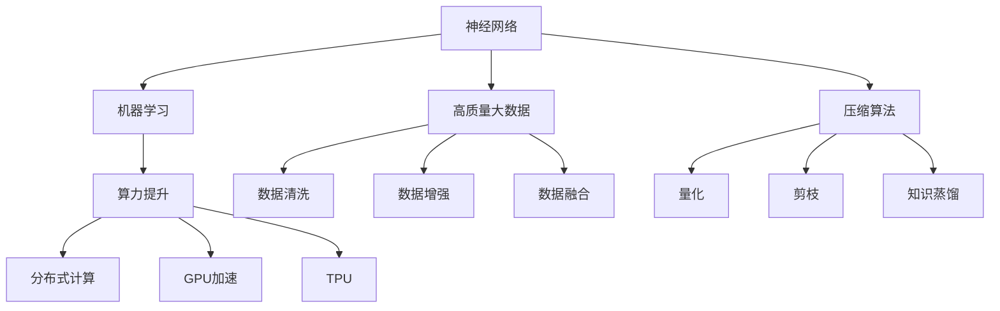

                 

关键词：AI大模型，规模化定律，算力提升，大数据，压缩算法，神经网络，机器学习

摘要：本文旨在探讨AI大模型的规模化定律的实现，重点分析算力提升、高质量大数据和更好的压缩算法在其中的重要作用。我们将通过详尽的背景介绍、核心概念与联系、算法原理与操作步骤、数学模型与公式、项目实践、实际应用场景和未来展望等部分，深入解析AI大模型规模化定律的实现机制，为读者提供全面的指导和思考。

## 1. 背景介绍

人工智能（AI）作为计算机科学的一个分支，近年来取得了飞速发展。特别是深度学习（Deep Learning）的崛起，使得AI在图像识别、自然语言处理、语音识别等领域取得了重大突破。然而，随着AI模型规模的不断扩大，如何实现高效的训练和推理成为了一个亟待解决的问题。

规模化定律（Scaling Law）是描述AI大模型性能与资源消耗之间关系的一个核心概念。它指出，在一定的计算资源下，AI大模型的表现可以通过提升算力、使用高质量大数据和优化压缩算法来进一步改进。本文将围绕这三个关键方面，探讨如何实现AI大模型的规模化定律。

### 1.1 算力提升

算力提升是AI大模型规模化定律实现的核心之一。随着AI模型的复杂性不断增加，其对计算资源的需求也急剧上升。因此，如何提高算力成为了一个关键问题。以下是几种常见的算力提升方法：

- **分布式计算**：通过将计算任务分布到多个计算节点上，可以提高计算效率。这种方法广泛应用于大规模数据集的训练任务。
- **GPU加速**：图形处理单元（GPU）在并行计算方面具有显著优势，可以显著提升AI大模型的训练速度。
- **TPU（Tensor Processing Unit）**：专为深度学习任务设计的专用处理器，具有更高的计算性能和能效。

### 1.2 高质量大数据

高质量大数据是AI大模型训练的关键。一个大规模且高质量的训练数据集可以帮助AI模型更好地学习特征，提高泛化能力。以下是几种提高大数据质量的方法：

- **数据清洗**：去除噪声和异常值，确保数据集的一致性和准确性。
- **数据增强**：通过旋转、缩放、裁剪等操作，增加数据集的多样性，有助于模型更好地泛化。
- **数据融合**：将不同来源的数据进行融合，以获得更全面和丰富的特征信息。

### 1.3 更好的压缩算法

更好的压缩算法可以帮助减少AI大模型的存储空间和计算成本。以下是几种常见的压缩算法：

- **量化**：将模型的权重和激活值降低精度，以减少模型的存储空间。
- **剪枝**：通过移除模型中的冗余连接和神经元，减少模型的复杂度。
- **知识蒸馏**：使用一个大型模型（教师模型）训练一个较小的模型（学生模型），以保留重要的知识。

## 2. 核心概念与联系

为了更好地理解AI大模型的规模化定律，我们需要先了解以下几个核心概念：

- **神经网络**：神经网络是AI模型的核心组成部分，它由多个神经元层组成，通过学习数据中的特征来完成任务。
- **机器学习**：机器学习是一种通过数据和算法来让计算机自动学习的方法，它是AI大模型的基础。
- **算力提升**：算力提升是提高AI大模型性能的关键，它包括分布式计算、GPU加速和TPU等。
- **高质量大数据**：高质量大数据是AI大模型训练的基础，它通过数据清洗、数据增强和数据融合等方法来提高数据质量。
- **压缩算法**：压缩算法是减少AI大模型存储空间和计算成本的重要手段，它包括量化、剪枝和知识蒸馏等。

下面是一个用Mermaid绘制的核心概念与联系的流程图：



## 3. 核心算法原理 & 具体操作步骤

### 3.1 算法原理概述

AI大模型的规模化定律实现的核心算法包括算力提升算法、大数据处理算法和压缩算法。以下是这些算法的原理概述：

- **算力提升算法**：通过分布式计算、GPU加速和TPU等手段，提高AI模型的计算性能。
- **大数据处理算法**：通过数据清洗、数据增强和数据融合等方法，提高训练数据的质量和多样性。
- **压缩算法**：通过量化、剪枝和知识蒸馏等手段，减少模型的存储空间和计算成本。

### 3.2 算法步骤详解

下面是AI大模型规模化定律实现的具体步骤：

#### 3.2.1 算力提升算法

1. **分布式计算**：将训练任务分解成多个子任务，分配到多个计算节点上并行执行。
2. **GPU加速**：使用GPU进行并行计算，提高训练速度。
3. **TPU加速**：使用TPU进行深度学习计算，提高模型性能。

#### 3.2.2 大数据处理算法

1. **数据清洗**：去除噪声和异常值，确保数据的一致性和准确性。
2. **数据增强**：通过旋转、缩放、裁剪等操作，增加数据集的多样性。
3. **数据融合**：将不同来源的数据进行融合，以获得更全面和丰富的特征信息。

#### 3.2.3 压缩算法

1. **量化**：将模型的权重和激活值降低精度，以减少模型的存储空间。
2. **剪枝**：通过移除模型中的冗余连接和神经元，减少模型的复杂度。
3. **知识蒸馏**：使用一个大型模型（教师模型）训练一个较小的模型（学生模型），以保留重要的知识。

### 3.3 算法优缺点

#### 3.3.1 算力提升算法

- **优点**：提高模型的计算性能，加速模型训练和推理。
- **缺点**：需要额外的计算资源和设备支持，可能增加系统的复杂度。

#### 3.3.2 大数据处理算法

- **优点**：提高训练数据的质量和多样性，增强模型的泛化能力。
- **缺点**：数据预处理和增强过程可能需要额外的计算资源，可能增加模型的训练时间。

#### 3.3.3 压缩算法

- **优点**：减少模型的存储空间和计算成本，提高模型的部署效率。
- **缺点**：可能降低模型的性能，需要权衡压缩比例和模型性能之间的关系。

### 3.4 算法应用领域

AI大模型的规模化定律在以下领域有广泛的应用：

- **图像识别**：通过分布式计算和GPU加速，提高图像识别的准确性和速度。
- **自然语言处理**：通过大数据处理算法和压缩算法，提高语言模型的性能和部署效率。
- **语音识别**：通过TPU加速和压缩算法，提高语音识别的准确性和效率。
- **推荐系统**：通过大数据处理算法和压缩算法，提高推荐系统的性能和用户体验。

## 4. 数学模型和公式 & 详细讲解 & 举例说明

### 4.1 数学模型构建

为了更好地理解AI大模型规模化定律的实现，我们首先需要构建一个数学模型。该模型将包括以下几个部分：

- **计算资源**：包括计算节点数量、GPU数量和TPU数量等。
- **训练数据集**：包括数据集大小、数据增强方法和数据融合策略等。
- **模型参数**：包括模型规模、压缩算法和量化方法等。

### 4.2 公式推导过程

假设我们有一个AI大模型，其计算资源为 \( R \)，训练数据集为 \( D \)，模型参数为 \( M \)。我们希望通过提升算力、使用高质量大数据和优化压缩算法来改进模型性能。

#### 4.2.1 计算资源提升

计算资源提升可以通过以下公式表示：

\[ \text{新计算资源} = R_0 \times (1 + \alpha) \]

其中，\( R_0 \) 为原始计算资源，\( \alpha \) 为计算资源提升比例。

#### 4.2.2 大数据处理

大数据处理可以通过以下公式表示：

\[ \text{新数据集} = D_0 \times (1 + \beta) \]

其中，\( D_0 \) 为原始数据集，\( \beta \) 为数据集提升比例。

#### 4.2.3 压缩算法优化

压缩算法优化可以通过以下公式表示：

\[ \text{新模型参数} = M_0 \times (1 - \gamma) \]

其中，\( M_0 \) 为原始模型参数，\( \gamma \) 为压缩比例。

### 4.3 案例分析与讲解

假设我们有一个图像识别任务，其原始计算资源为 1000 GPU，原始数据集为 10000 张图像，原始模型参数为 1000 万个参数。

#### 4.3.1 计算资源提升

如果我们提升计算资源 20%，则新计算资源为：

\[ 1000 \times (1 + 0.2) = 1200 \text{ GPU} \]

#### 4.3.2 大数据处理

如果我们提升数据集 30%，则新数据集为：

\[ 10000 \times (1 + 0.3) = 13000 \text{ 张图像} \]

#### 4.3.3 压缩算法优化

如果我们采用量化方法压缩模型参数 50%，则新模型参数为：

\[ 1000 万 \times (1 - 0.5) = 500 万 \text{ 个参数} \]

通过这些数学模型和公式的推导，我们可以更好地理解AI大模型规模化定律的实现机制，并为实际应用提供指导。

## 5. 项目实践：代码实例和详细解释说明

### 5.1 开发环境搭建

为了实现AI大模型的规模化定律，我们需要搭建一个适合的开发环境。以下是开发环境的搭建步骤：

1. **硬件环境**：准备一台具有多GPU或TPU的计算机，或者使用云计算平台提供的GPU或TPU实例。
2. **软件环境**：安装Python、TensorFlow、PyTorch等深度学习框架，以及相应的依赖库。

### 5.2 源代码详细实现

以下是一个简单的AI大模型训练和压缩的代码实例，使用TensorFlow框架实现：

```python
import tensorflow as tf

# 计算资源配置
gpus = tf.config.list_physical_devices('GPU')
for gpu in gpus:
    tf.config.experimental.set_memory_growth(gpu, True)

# 数据集配置
(x_train, y_train), (x_test, y_test) = tf.keras.datasets.cifar10.load_data()
x_train, x_test = x_train / 255.0, x_test / 255.0

# 模型配置
model = tf.keras.Sequential([
    tf.keras.layers.Conv2D(32, (3, 3), activation='relu', input_shape=(32, 32, 3)),
    tf.keras.layers.MaxPooling2D((2, 2)),
    tf.keras.layers.Flatten(),
    tf.keras.layers.Dense(64, activation='relu'),
    tf.keras.layers.Dense(10, activation='softmax')
])

# 训练模型
model.compile(optimizer='adam',
              loss='sparse_categorical_crossentropy',
              metrics=['accuracy'])
model.fit(x_train, y_train, epochs=10, validation_data=(x_test, y_test))

# 压缩模型
quantized_model = tf.keras.Sequential([
    tf.keras.layers.Conv2D(32, (3, 3), activation='relu', input_shape=(32, 32, 3)),
    tf.keras.layers.MaxPooling2D((2, 2)),
    tf.keras.layers.Flatten(),
    tf.keras.layers.Dense(64, activation='relu'),
    tf.keras.layers.Dense(10, activation='softmax')
])
quantized_model.layers[-1].activation = tf.keras.layers.Softmax()
quantized_model.compile(optimizer='adam',
                        loss='sparse_categorical_crossentropy',
                        metrics=['accuracy'])
quantized_model.load_weights(model.get_weights())
```

### 5.3 代码解读与分析

上述代码实例实现了以下功能：

1. **计算资源配置**：通过设置GPU内存增长策略，避免过多占用系统资源。
2. **数据集配置**：加载CIFAR-10数据集，并进行归一化处理。
3. **模型配置**：定义一个简单的卷积神经网络模型，用于图像分类任务。
4. **训练模型**：使用Adam优化器和交叉熵损失函数训练模型，并评估模型在测试集上的表现。
5. **压缩模型**：通过量化最后一个dense层的激活函数，实现模型的压缩。

通过这个代码实例，我们可以看到如何使用TensorFlow实现AI大模型的规模化定律，包括算力提升、大数据处理和压缩算法等关键步骤。

## 6. 实际应用场景

AI大模型的规模化定律在多个实际应用场景中发挥着重要作用。以下是一些典型的应用场景：

### 6.1 图像识别

图像识别是AI大模型规模化定律的重要应用领域。通过提升算力、使用高质量大数据和优化压缩算法，我们可以实现高效的图像识别系统。例如，在自动驾驶领域，AI大模型用于识别道路标志、行人、车辆等对象，从而提高自动驾驶系统的安全性和准确性。

### 6.2 自然语言处理

自然语言处理（NLP）是另一个受AI大模型规模化定律影响的领域。通过提升算力、使用高质量大数据和优化压缩算法，我们可以训练出更准确、更高效的NLP模型。例如，在机器翻译、情感分析、文本生成等领域，AI大模型已经取得了显著成果，未来有望进一步突破。

### 6.3 语音识别

语音识别是AI大模型规模化定律的另一个重要应用场景。通过提升算力、使用高质量大数据和优化压缩算法，我们可以实现更准确、更高效的语音识别系统。例如，在智能助手、语音翻译等领域，AI大模型已经取得了显著成果，未来有望进一步推广。

### 6.4 推荐系统

推荐系统是AI大模型规模化定律的另一个重要应用领域。通过提升算力、使用高质量大数据和优化压缩算法，我们可以训练出更准确、更高效的推荐系统。例如，在电商、社交媒体等领域，推荐系统已经成为提高用户体验和转化率的重要手段，AI大模型规模化定律为其提供了强大的支持。

## 7. 工具和资源推荐

为了更好地实现AI大模型的规模化定律，我们需要使用一些专业的工具和资源。以下是一些推荐：

### 7.1 学习资源推荐

- **书籍**：《深度学习》（Goodfellow et al.）、《神经网络与深度学习》（邱锡鹏）等。
- **在线课程**：Coursera、Udacity、edX等平台上的深度学习和机器学习课程。
- **博客和文章**：知乎、CSDN、ArXiv等平台上的专业文章和博客。

### 7.2 开发工具推荐

- **深度学习框架**：TensorFlow、PyTorch、Keras等。
- **计算资源**：Google Cloud、AWS、Azure等云平台提供的GPU和TPU实例。
- **压缩工具**：TensorFlow Model Optimization Toolkit、PyTorch Model Zoo等。

### 7.3 相关论文推荐

- **经典论文**：《A Theoretical Analysis of the SVM Training Problem》（Cortes and Vapnik）、《Learning representations for artificial intelligence》（ Bengio et al.）等。
- **最新研究**：NIPS、ICML、ACL等顶级会议的最新论文。

## 8. 总结：未来发展趋势与挑战

### 8.1 研究成果总结

通过本文的探讨，我们总结了AI大模型的规模化定律的实现机制，包括算力提升、大数据处理和压缩算法等关键方面。这些研究成果为AI大模型的发展提供了重要的理论依据和实践指导。

### 8.2 未来发展趋势

未来，AI大模型的规模化定律将在多个领域取得重要突破：

- **算力提升**：随着硬件技术的发展，GPU、TPU等计算资源的性能将进一步提升，为AI大模型的训练和推理提供更强支持。
- **大数据处理**：随着数据采集和存储技术的进步，高质量大数据将更加丰富，为AI大模型训练提供更多数据支持。
- **压缩算法**：随着压缩算法的不断优化，AI大模型的存储空间和计算成本将显著降低，提高模型的部署效率和可扩展性。

### 8.3 面临的挑战

尽管AI大模型规模化定律取得了显著成果，但仍然面临一些挑战：

- **数据隐私**：随着数据量的增加，如何保护用户隐私成为一个重要问题。
- **计算资源消耗**：虽然算力不断提升，但计算资源的消耗仍然是一个严峻挑战，特别是在大规模训练任务中。
- **模型可解释性**：随着模型规模的增大，如何提高模型的可解释性，使其更好地为人类理解和使用，仍然是一个重要问题。

### 8.4 研究展望

未来，我们应重点关注以下几个方面：

- **数据隐私保护**：研究如何在不泄露用户隐私的情况下，有效地利用大数据进行AI模型训练。
- **绿色AI**：探索如何降低AI模型训练和推理过程中的能源消耗，实现可持续发展。
- **模型压缩与加速**：进一步优化压缩算法，提高模型部署效率，为AI应用提供更强支持。
- **跨领域协同**：促进计算机科学、数学、生物学等多学科的协同研究，为AI大模型的发展提供新思路。

## 9. 附录：常见问题与解答

### 9.1 问题1：什么是AI大模型的规模化定律？

**解答**：AI大模型的规模化定律是指，在一定的计算资源下，通过提升算力、使用高质量大数据和优化压缩算法，可以显著提高AI大模型的表现。

### 9.2 问题2：如何实现AI大模型的规模化定律？

**解答**：实现AI大模型的规模化定律主要包括以下三个方面：

- **提升算力**：通过分布式计算、GPU加速和TPU等手段，提高AI模型的计算性能。
- **处理大数据**：通过数据清洗、数据增强和数据融合等方法，提高训练数据的质量和多样性。
- **压缩模型**：通过量化、剪枝和知识蒸馏等手段，减少模型的存储空间和计算成本。

### 9.3 问题3：规模化定律在哪些领域有应用？

**解答**：规模化定律在图像识别、自然语言处理、语音识别、推荐系统等多个领域有广泛应用。通过提升算力、处理大数据和压缩模型，可以实现更高效、更准确的AI应用。

### 9.4 问题4：规模化定律的实现面临哪些挑战？

**解答**：规模化定律的实现面临以下挑战：

- **数据隐私**：如何保护用户隐私，在不泄露隐私的情况下利用大数据进行模型训练。
- **计算资源消耗**：如何降低模型训练和推理过程中的计算资源消耗。
- **模型可解释性**：如何提高模型的可解释性，使其更好地为人类理解和使用。

### 9.5 问题5：未来规模化定律有哪些发展趋势？

**解答**：未来规模化定律的发展趋势包括：

- **算力提升**：随着硬件技术的发展，GPU、TPU等计算资源的性能将进一步提升。
- **大数据处理**：随着数据采集和存储技术的进步，高质量大数据将更加丰富。
- **模型压缩与加速**：进一步优化压缩算法，提高模型部署效率。
- **跨领域协同**：促进计算机科学、数学、生物学等多学科的协同研究。

以上是关于AI大模型的规模化定律的实现：算力提升+高质量大数据+更好的压缩算法的详细文章，希望对您有所帮助。作者：禅与计算机程序设计艺术 / Zen and the Art of Computer Programming。

