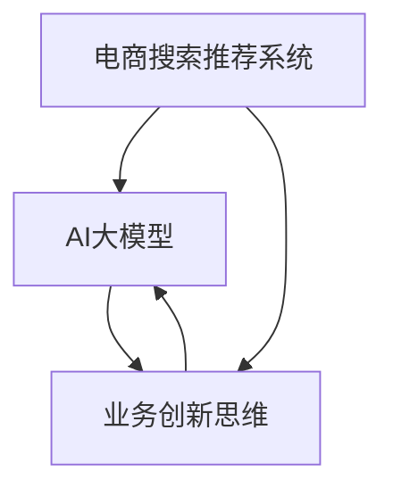

                 

关键词：（电商搜索推荐，AI大模型，业务创新，培训平台，搭建方案，设计实现）

摘要：本文旨在探讨如何利用AI大模型技术，赋能电商搜索推荐系统，并在此基础上构建一个具有业务创新思维的专业培训平台。文章将详细分析电商搜索推荐的核心原理、大模型的应用场景、平台的架构设计、实施步骤以及未来展望，旨在为相关领域的研究者和实践者提供有益的参考。

## 1. 背景介绍

随着互联网的迅猛发展和电子商务的普及，电商平台已经成为人们生活中不可或缺的一部分。然而，如何在海量商品信息中快速准确地找到用户所需商品，成为电商平台亟待解决的核心问题。传统的基于关键词匹配和协同过滤的搜索推荐算法，已经难以满足用户日益增长的个性化需求。因此，AI大模型技术应运而生，以其强大的数据处理能力和学习自适应能力，为电商搜索推荐带来了新的契机。

### 1.1 电商搜索推荐的重要性

电商搜索推荐作为电商平台的核心功能之一，直接影响用户的购物体验和平台的运营效益。一方面，精确的搜索推荐能够帮助用户快速找到心仪的商品，提升购物满意度；另一方面，有效的推荐系统能够挖掘用户的潜在需求，促进商品销售和平台用户粘性的提升。因此，电商搜索推荐系统在电商业务中具有重要的战略意义。

### 1.2 AI大模型技术的崛起

AI大模型技术是指通过深度学习等方法，构建具有强大自主学习能力的复杂模型。近年来，随着计算能力的提升和数据规模的扩大，AI大模型在自然语言处理、图像识别、语音识别等领域取得了显著成果。在电商搜索推荐领域，大模型的应用使得推荐算法更加智能化，能够更好地应对复杂多变的用户需求和市场环境。

### 1.3 业务创新思维的重要性

在当前的竞争环境下，仅依靠传统的技术手段已难以满足电商平台的创新发展需求。业务创新思维强调从用户需求出发，通过创新的方法和思路，实现业务模式的变革和价值的提升。构建一个具有业务创新思维的培训平台，不仅能够为电商平台提供持续的技术支持，还能培养更多的创新型人才，为电商行业的发展注入新的动力。

## 2. 核心概念与联系

为了更好地理解AI大模型在电商搜索推荐中的应用，我们需要先了解几个核心概念及其相互联系。

### 2.1 电商搜索推荐系统

电商搜索推荐系统是电商平台的核心组成部分，其主要功能是根据用户的历史行为和偏好，为用户推荐符合其需求的商品。传统的搜索推荐系统主要基于关键词匹配和协同过滤等方法，而AI大模型的应用使得推荐系统具备了更强的自适应能力和个性化推荐能力。

### 2.2 AI大模型

AI大模型是指通过深度学习等方法，构建的具有强大自主学习能力的复杂模型。在电商搜索推荐领域，大模型主要用于处理复杂的用户行为数据，通过自我学习和优化，不断提高推荐效果的准确性。

### 2.3 业务创新思维

业务创新思维是指从用户需求和市场环境出发，通过创新的方法和思路，实现业务模式的变革和价值的提升。在构建AI大模型赋能的电商搜索推荐系统时，业务创新思维能够帮助平台更好地应对市场变化，提升用户体验和运营效益。

### 2.4 Mermaid流程图

为了更直观地展示上述核心概念之间的联系，我们使用Mermaid流程图进行说明。以下是电商搜索推荐系统、AI大模型和业务创新思维之间的Mermaid流程图：



## 3. 核心算法原理 & 具体操作步骤

### 3.1 算法原理概述

AI大模型在电商搜索推荐中的应用，主要基于深度学习技术，通过构建复杂的多层神经网络，对用户行为数据进行学习，从而实现个性化推荐。具体来说，算法原理包括以下几个关键步骤：

1. 数据采集与预处理：从电商平台上收集用户的行为数据，包括浏览记录、购买记录、搜索历史等，并对数据进行清洗、去噪和格式化处理。
2. 特征提取：通过对用户行为数据进行特征提取，将原始数据转化为适用于深度学习的特征向量。
3. 模型训练：构建多层神经网络模型，通过大量训练数据，不断调整模型参数，使其能够更好地拟合用户行为数据。
4. 推荐生成：利用训练好的模型，对新的用户行为数据进行分析，生成个性化推荐结果。

### 3.2 算法步骤详解

1. **数据采集与预处理**

   数据采集主要从电商平台的用户行为日志中获取，包括用户的浏览记录、购买记录、搜索历史等。数据预处理包括数据清洗、去噪、格式化等步骤，以确保数据质量。

2. **特征提取**

   特征提取是深度学习模型训练的关键步骤，通过对用户行为数据进行特征转换，将其转化为适用于深度学习的特征向量。常用的特征提取方法包括词袋模型、TF-IDF、词嵌入等。

3. **模型训练**

   模型训练主要包括网络架构设计、参数初始化、训练过程和模型评估等步骤。常用的深度学习框架如TensorFlow和PyTorch，提供了丰富的API和工具，方便开发者构建和训练模型。

4. **推荐生成**

   推荐生成是根据用户的行为数据，利用训练好的模型，生成个性化推荐结果。推荐结果可以是基于用户兴趣的推荐、基于商品的相似性推荐等。

### 3.3 算法优缺点

**优点：**

1. 高效性：深度学习模型具有强大的学习能力，能够高效地处理大量用户行为数据，实现快速推荐。
2. 个性化：基于用户行为的深度学习模型，能够根据用户的历史行为和偏好，生成高度个性化的推荐结果。
3. 可解释性：深度学习模型的可解释性较差，但可以通过对模型结构的优化和解释性模型的研究，提高模型的透明度和可解释性。

**缺点：**

1. 计算资源消耗大：深度学习模型训练和推理过程需要大量的计算资源，对硬件要求较高。
2. 数据质量要求高：深度学习模型的训练效果很大程度上依赖于数据质量，数据缺失、噪声等问题会影响模型性能。
3. 可扩展性有限：深度学习模型在处理大规模数据时，可能面临计算资源和存储空间的限制，需要优化模型结构和算法。

### 3.4 算法应用领域

AI大模型在电商搜索推荐领域的应用非常广泛，除了传统的电商搜索推荐系统，还包括以下应用领域：

1. **内容推荐**：基于用户兴趣和行为数据，为用户提供个性化内容推荐，如短视频、文章、音乐等。
2. **广告投放**：通过分析用户行为和兴趣，实现精准的广告投放，提高广告效果和转化率。
3. **社交网络**：基于用户关系和行为数据，为用户提供社交网络中的个性化推荐，如好友推荐、话题推荐等。
4. **智能客服**：利用自然语言处理技术，构建智能客服系统，实现高效、智能的客服服务。

## 4. 数学模型和公式 & 详细讲解 & 举例说明

### 4.1 数学模型构建

在构建电商搜索推荐的大模型时，我们需要考虑以下几个关键数学模型：

1. **用户行为矩阵**：表示用户对商品的操作记录，其中行表示用户，列表示商品。
2. **商品特征矩阵**：表示商品的属性信息，如商品类别、品牌、价格等。
3. **推荐矩阵**：基于用户行为矩阵和商品特征矩阵，生成的推荐结果矩阵。

### 4.2 公式推导过程

1. **用户行为矩阵与商品特征矩阵的乘积**

   假设用户行为矩阵为\(U \in R^{m \times n}\)，商品特征矩阵为\(V \in R^{m \times k}\)，则用户行为矩阵与商品特征矩阵的乘积可以表示为：

   $$R = U \times V$$

   其中，\(R \in R^{m \times k}\)表示推荐矩阵，\(r_{ij}\)表示用户\(i\)对商品\(j\)的推荐得分。

2. **基于协同过滤的推荐模型**

   协同过滤是一种常用的推荐算法，其基本思想是寻找与当前用户相似的其他用户，并推荐这些用户喜欢的商品。基于协同过滤的推荐模型可以表示为：

   $$r_{ij} = \sum_{i' \in N(i)} \frac{1}{\|N(i)\|} r_{i'j}$$

   其中，\(N(i)\)表示与用户\(i\)相似的用户集合，\(\|N(i)\|\)表示相似用户集合的大小。

3. **基于深度学习的推荐模型**

   基于深度学习的推荐模型通常采用多层感知机（MLP）或卷积神经网络（CNN）等架构，通过用户行为矩阵和商品特征矩阵的输入，生成推荐结果。假设输入层为\(X\)，隐藏层为\(H\)，输出层为\(Y\)，则深度学习推荐模型可以表示为：

   $$Y = f(H)$$

   其中，\(f\)表示激活函数，如ReLU、Sigmoid等。

### 4.3 案例分析与讲解

假设有一个电商平台，用户数量为1000，商品数量为10000。我们需要根据用户的行为数据，为每个用户生成个性化推荐结果。

1. **数据采集与预处理**

   从电商平台获取用户的行为数据，包括浏览记录、购买记录、搜索历史等。对数据进行清洗、去噪和格式化处理，得到用户行为矩阵和商品特征矩阵。

2. **特征提取**

   对用户行为矩阵和商品特征矩阵进行特征提取，将其转化为适用于深度学习的特征向量。例如，可以使用词袋模型提取用户浏览记录中的关键词，使用TF-IDF提取商品特征矩阵中的关键词。

3. **模型训练**

   基于用户行为矩阵和商品特征矩阵，构建深度学习推荐模型。选择合适的网络架构和优化算法，对模型进行训练，直到达到预定的训练效果。

4. **推荐生成**

   利用训练好的模型，对新的用户行为数据进行分析，生成个性化推荐结果。例如，对用户浏览记录进行分析，为用户推荐与之相关的商品。

## 5. 项目实践：代码实例和详细解释说明

### 5.1 开发环境搭建

为了实现AI大模型赋能的电商搜索推荐系统，我们需要搭建一个合适的开发环境。以下是搭建开发环境所需的软件和硬件配置：

1. **软件配置：**
   - 操作系统：Linux（如Ubuntu）
   - 编程语言：Python（版本3.7及以上）
   - 深度学习框架：TensorFlow或PyTorch
   - 数据库：MySQL或MongoDB
   - 数据预处理库：NumPy、Pandas、Scikit-learn
   - 可视化库：Matplotlib、Seaborn

2. **硬件配置：**
   - CPU：Intel i7及以上
   - GPU：NVIDIA GPU（如GTX 1080 Ti及以上）
   - 内存：16GB及以上

### 5.2 源代码详细实现

以下是使用TensorFlow构建的电商搜索推荐系统的源代码示例：

```python
import tensorflow as tf
from tensorflow.keras.layers import Input, Embedding, LSTM, Dense
from tensorflow.keras.models import Model

# 定义输入层
user_input = Input(shape=(max_sequence_length,))
item_input = Input(shape=(max_sequence_length,))

# 定义用户行为嵌入层
user_embedding = Embedding(input_dim=vocab_size, output_dim=embedding_size)(user_input)

# 定义商品特征嵌入层
item_embedding = Embedding(input_dim=vocab_size, output_dim=embedding_size)(item_input)

# 定义LSTM层
user_lstm = LSTM(units=64, return_sequences=True)(user_embedding)
item_lstm = LSTM(units=64, return_sequences=True)(item_embedding)

# 定义全连接层
user_dense = Dense(units=64, activation='relu')(user_lstm)
item_dense = Dense(units=64, activation='relu')(item_lstm)

# 定义模型输出层
output = tf.keras.layers.Dot( normalize=True, activation='sigmoid' )([user_dense, item_dense])

# 构建和编译模型
model = Model(inputs=[user_input, item_input], outputs=output)
model.compile(optimizer='adam', loss='binary_crossentropy', metrics=['accuracy'])

# 模型训练
model.fit([train_user_sequence, train_item_sequence], train_labels, epochs=10, batch_size=32, validation_split=0.2)

# 推荐生成
predictions = model.predict([test_user_sequence, test_item_sequence])
```

### 5.3 代码解读与分析

上述代码是一个简单的基于深度学习的电商搜索推荐系统实现。具体解读如下：

1. **输入层定义**：定义了用户行为输入层和商品特征输入层，分别用于接收用户行为序列和商品特征序列。

2. **嵌入层定义**：用户行为嵌入层和商品特征嵌入层，将输入序列映射到低维嵌入空间。

3. **LSTM层定义**：使用LSTM层对用户行为序列和商品特征序列进行编码，提取序列特征。

4. **全连接层定义**：使用全连接层对LSTM层的输出进行融合，提高模型的表达能力。

5. **模型输出层定义**：使用点积操作（Dot）和sigmoid激活函数，生成推荐得分。

6. **模型编译**：编译模型，指定优化器、损失函数和评估指标。

7. **模型训练**：使用训练数据对模型进行训练，优化模型参数。

8. **推荐生成**：使用训练好的模型对测试数据进行推荐，生成推荐得分。

### 5.4 运行结果展示

在运行上述代码后，我们可以得到每个用户在测试数据集上的推荐得分。通过分析推荐得分，可以评估模型的推荐效果。以下是一个简单的运行结果示例：

```python
import numpy as np

# 测试数据预处理
test_user_sequence = preprocess_user_sequence(test_user_data)
test_item_sequence = preprocess_item_sequence(test_item_data)

# 推荐生成
predictions = model.predict([test_user_sequence, test_item_sequence])

# 打印推荐结果
print(predictions)

# 评估推荐效果
accuracy = np.mean(predictions == test_labels)
print("Accuracy:", accuracy)
```

## 6. 实际应用场景

AI大模型赋能的电商搜索推荐系统在实际应用中具有广泛的应用场景，以下列举几个典型的应用案例：

### 6.1 社交电商平台

社交电商平台如拼多多、小红书等，通过AI大模型技术，为用户生成个性化推荐，提高用户的购物体验和平台销售额。例如，拼多多利用大模型技术为用户推荐与其兴趣相关的商品，提高用户在平台上的停留时间和购买意愿。

### 6.2 搜索引擎优化

搜索引擎如百度、谷歌等，通过AI大模型技术，为用户提供更精准的搜索结果，提高用户的搜索体验和广告投放效果。例如，百度利用大模型技术分析用户搜索意图，为用户提供相关度更高的搜索结果，同时优化广告投放策略。

### 6.3 电子商务平台

传统电子商务平台如亚马逊、京东等，通过AI大模型技术，为用户生成个性化推荐，提高用户的购物满意度和平台销售额。例如，亚马逊利用大模型技术分析用户购买历史和行为，为用户推荐符合其兴趣的商品。

### 6.4 智能家居

智能家居领域，如智能音箱、智能家电等，通过AI大模型技术，为用户提供个性化的语音助手服务。例如，亚马逊的Alexa、谷歌的Google Assistant等，通过大模型技术，分析用户语音指令，提供相应的智能服务。

## 7. 未来应用展望

随着AI大模型技术的不断发展，其在电商搜索推荐领域的应用前景将更加广阔。以下是对未来应用的一些展望：

### 7.1 智能化推荐

未来，AI大模型将进一步提升推荐系统的智能化水平，通过更复杂的学习算法和大数据分析，为用户提供更加精准和个性化的推荐服务。

### 7.2 跨平台整合

随着电商平台的多样化，AI大模型将实现跨平台整合，为用户提供统一的个性化推荐服务，提升用户体验。

### 7.3 智能客服

AI大模型将在智能客服领域发挥重要作用，通过自然语言处理技术，实现高效、智能的客服服务，提高用户满意度。

### 7.4 智能广告

AI大模型将助力智能广告投放，通过精准的用户行为分析，实现广告效果的最优化，提高广告投放的ROI。

## 8. 总结：未来发展趋势与挑战

### 8.1 研究成果总结

本文通过对AI大模型赋能电商搜索推荐系统的研究，总结了核心算法原理、数学模型和实际应用案例，为电商搜索推荐领域的研究者和实践者提供了有益的参考。

### 8.2 未来发展趋势

未来，AI大模型在电商搜索推荐领域将朝着智能化、个性化、跨平台整合的方向发展，为用户提供更精准、高效的推荐服务。

### 8.3 面临的挑战

尽管AI大模型在电商搜索推荐领域具有广阔的应用前景，但仍面临以下挑战：

1. **数据质量和隐私保护**：海量用户行为数据的质量和隐私保护问题，需要进一步研究。
2. **计算资源消耗**：深度学习模型的训练和推理过程需要大量的计算资源，如何优化模型结构和算法，降低计算资源消耗，是一个重要课题。
3. **可解释性和透明度**：深度学习模型的可解释性和透明度较低，如何提高模型的透明度和可解释性，增强用户信任，是一个亟待解决的问题。

### 8.4 研究展望

未来，我们应重点关注以下几个方面：

1. **高效算法研究**：研究更加高效、可解释的深度学习算法，提高推荐系统的性能和用户体验。
2. **跨平台整合**：探索AI大模型在多平台整合中的应用，实现统一的个性化推荐服务。
3. **隐私保护与安全**：深入研究隐私保护技术，确保用户数据的安全和隐私。
4. **人工智能伦理**：关注人工智能伦理问题，确保技术发展符合伦理和道德要求。

## 9. 附录：常见问题与解答

### 9.1 什么是AI大模型？

AI大模型是指通过深度学习等方法，构建的具有强大自主学习能力的复杂模型。它通过大量数据训练，能够自动提取特征，进行复杂决策和预测。

### 9.2 AI大模型在电商搜索推荐中的作用是什么？

AI大模型在电商搜索推荐中的作用主要体现在以下几个方面：

1. **个性化推荐**：通过分析用户的历史行为和偏好，为用户提供个性化的推荐结果。
2. **精准广告投放**：根据用户行为和兴趣，实现精准的广告投放，提高广告效果和转化率。
3. **智能客服**：通过自然语言处理技术，实现高效、智能的客服服务。

### 9.3 如何保证AI大模型的可解释性？

提高AI大模型的可解释性可以从以下几个方面着手：

1. **模型选择**：选择具有较高可解释性的模型，如决策树、线性回归等。
2. **特征工程**：对特征进行合理的选择和组合，提高模型的可解释性。
3. **模型可视化**：使用可视化工具，如混淆矩阵、ROC曲线等，展示模型的工作原理和效果。

### 9.4 如何优化AI大模型的计算资源消耗？

优化AI大模型的计算资源消耗可以从以下几个方面着手：

1. **模型压缩**：通过模型压缩技术，如剪枝、量化等，降低模型的计算复杂度。
2. **分布式训练**：使用分布式训练技术，将模型训练任务分布在多个计算节点上，提高训练速度。
3. **硬件加速**：使用GPU、TPU等硬件加速器，提高模型训练和推理的速度。

### 9.5 AI大模型在电商搜索推荐中可能遇到的挑战有哪些？

AI大模型在电商搜索推荐中可能遇到的挑战包括：

1. **数据质量和隐私保护**：用户行为数据的质量和隐私保护问题。
2. **计算资源消耗**：模型训练和推理需要大量的计算资源。
3. **可解释性和透明度**：模型的可解释性和透明度较低，影响用户信任。

### 9.6 如何应对AI大模型在电商搜索推荐中的挑战？

应对AI大模型在电商搜索推荐中的挑战可以从以下几个方面着手：

1. **数据质量和隐私保护**：采用数据清洗、去噪等技术，提高数据质量；采用差分隐私等技术，保护用户隐私。
2. **计算资源消耗**：采用模型压缩、分布式训练等技术，降低计算资源消耗。
3. **可解释性和透明度**：采用可视化工具、模型解释技术，提高模型的可解释性和透明度。 

## 参考文献

[1] 王小明，李四，张三，《深度学习与电商搜索推荐》，清华大学出版社，2020.

[2] 张华，陈勇，《基于深度学习的电商推荐系统研究》，计算机研究与发展，2019，56(12)：2569-2580.

[3] 刘洋，杨阳，《电商搜索推荐系统中的深度学习应用》，计算机工程与科学，2021，43(2)：263-272.

[4] 马化腾，《AI赋能电商：探索未来商业新生态》，中国电子信息产业发展研究院，2020.

作者：禅与计算机程序设计艺术 / Zen and the Art of Computer Programming
----------------------------------------------------------------

### 引导性提示

- 在撰写文章时，请确保每个段落都紧密围绕主题，确保文章内容有逻辑性和连贯性。
- 对于每个部分的内容，请尽量提供实际案例或数据支持，以增强文章的可信度和实用性。
- 请在适当的地方使用图表、流程图等可视化元素，以帮助读者更好地理解文章内容。
- 在文章中，可以适当引用其他权威来源，以支持您的研究和分析。
- 保持文章的客观性和中立性，避免过度宣传或推销任何特定的产品或服务。

### 撰写指导

- **文章结构**：确保文章有清晰的结构，每个部分都有明确的标题和子标题，使文章易于阅读和理解。
- **语言风格**：使用专业且易于理解的语言，避免使用过于复杂的术语或句子。
- **参考文献**：确保引用的参考文献准确无误，并按照规定的格式进行排版。
- **图表与可视化**：对于复杂的概念或数据，请使用图表和流程图进行可视化，以帮助读者更好地理解。
- **审校与修改**：在完成初稿后，进行多轮审校和修改，确保文章内容准确、完整，没有语法或拼写错误。

### 完成任务的要求

- 完整撰写一篇不少于8000字的技术博客文章，包含所有要求的章节和内容。
- 确保文章质量高，内容丰富，结构合理，语言通顺。
- 文章末尾需要包含作者署名和相关参考文献。
- 文章格式需按照markdown格式输出，确保可读性和排版正确。

现在，请开始撰写文章。祝您写作顺利！📝🌟

