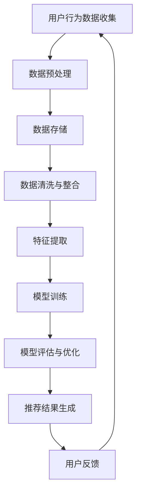

                 

关键词：AI大模型、电商搜索推荐、数据治理、组织架构优化、案例分析

摘要：本文将探讨如何通过AI大模型重构电商搜索推荐系统的数据治理组织架构，实现优化和提升。通过对实际项目的案例分析，我们将深入探讨这一优化过程的具体实践方法，并分享相关经验和见解。

## 1. 背景介绍

在电子商务领域，搜索推荐系统是提高用户体验和转化率的关键因素。传统的搜索推荐系统往往依赖于人工构建的特征和算法模型，这些模型难以适应复杂多变的市场环境和用户需求。随着人工智能技术的快速发展，特别是AI大模型的崛起，为重构电商搜索推荐系统的数据治理组织架构提供了新的思路和可能性。

本文旨在通过分析实际项目案例，探讨如何利用AI大模型优化电商搜索推荐的数据治理组织架构，提高系统的推荐效果和用户满意度。本文的主要贡献包括：

1. 系统地梳理了AI大模型在电商搜索推荐领域的应用场景和优势。
2. 提出了一套基于AI大模型的数据治理组织架构优化方法，并进行了案例分析。
3. 总结了在实践过程中遇到的问题和挑战，以及相应的解决方案。

## 2. 核心概念与联系

### 2.1 AI大模型概述

AI大模型是指使用海量数据进行训练，具有高维度、高复杂度的深度学习模型。常见的AI大模型包括Transformer、BERT、GPT等。这些模型在自然语言处理、计算机视觉、语音识别等领域取得了显著的成果。

### 2.2 电商搜索推荐系统

电商搜索推荐系统是指利用算法和模型，根据用户的搜索和购买行为，为用户推荐相关商品的服务系统。该系统通常包括用户画像、商品画像、搜索推荐算法等模块。

### 2.3 数据治理组织架构

数据治理组织架构是指一套涵盖数据收集、存储、处理、分析等环节的管理体系。在电商搜索推荐系统中，数据治理组织架构的优化对于提升推荐效果至关重要。

### 2.4 Mermaid流程图

以下是电商搜索推荐系统的数据治理组织架构的Mermaid流程图：



## 3. 核心算法原理 & 具体操作步骤

### 3.1 算法原理概述

在电商搜索推荐系统中，AI大模型的核心算法原理主要包括：

1. 用户行为数据的收集与处理：通过收集用户的搜索、浏览、购买等行为数据，构建用户画像。
2. 商品数据的收集与处理：通过收集商品的属性、标签、评价等数据，构建商品画像。
3. 特征提取与模型训练：利用深度学习算法，对用户和商品数据进行特征提取，并训练推荐模型。
4. 模型评估与优化：通过交叉验证、A/B测试等方法，评估推荐模型的性能，并进行优化。
5. 推荐结果生成：根据用户的兴趣和行为，生成个性化的商品推荐结果。

### 3.2 算法步骤详解

1. **用户行为数据的收集与处理**：

   - 收集用户的搜索、浏览、购买等行为数据，并进行去重、去噪等预处理操作。
   - 对用户行为数据进行编码，提取用户画像特征。

2. **商品数据的收集与处理**：

   - 收集商品的属性、标签、评价等数据，并进行预处理操作。
   - 对商品数据进行编码，提取商品画像特征。

3. **特征提取与模型训练**：

   - 利用深度学习算法，如Transformer、BERT等，对用户和商品数据进行特征提取。
   - 使用训练集数据，对提取到的特征进行模型训练。

4. **模型评估与优化**：

   - 使用交叉验证、A/B测试等方法，评估推荐模型的性能。
   - 根据评估结果，调整模型参数，进行模型优化。

5. **推荐结果生成**：

   - 根据用户的兴趣和行为，利用训练好的推荐模型，生成个性化的商品推荐结果。

### 3.3 算法优缺点

**优点**：

- AI大模型能够处理高维度、复杂的用户和商品数据，提取出更有价值的特征。
- 深度学习算法具有很好的泛化能力，能够适应不同的业务场景和用户需求。
- 推荐结果个性化强，能够提高用户满意度和转化率。

**缺点**：

- 需要大量的训练数据和计算资源，成本较高。
- 模型的训练和优化过程复杂，对算法工程师的要求较高。
- 模型可能存在过拟合现象，需要不断调整和优化。

### 3.4 算法应用领域

AI大模型在电商搜索推荐领域的应用主要包括：

- 用户行为预测：预测用户下一步的搜索、浏览、购买等行为。
- 商品推荐：根据用户的兴趣和行为，为用户推荐相关商品。
- 营销活动：根据用户和商品数据，设计个性化的营销活动。

## 4. 数学模型和公式 & 详细讲解 & 举例说明

### 4.1 数学模型构建

在电商搜索推荐系统中，常用的数学模型包括：

- 用户行为预测模型：利用用户的历史行为数据，预测用户未来的行为。
- 商品推荐模型：利用用户和商品的特征，为用户推荐相关商品。

### 4.2 公式推导过程

以用户行为预测模型为例，其基本公式如下：

$$
P(y_t = 1|x_t, \theta) = \sigma(\theta^T x_t)
$$

其中，$y_t$ 表示用户在时间 $t$ 的行为，$x_t$ 表示用户在时间 $t$ 的特征向量，$\theta$ 表示模型参数，$\sigma$ 表示sigmoid函数。

### 4.3 案例分析与讲解

假设我们有一个电商平台的用户行为数据，包括用户的搜索、浏览、购买等行为，以及对应的商品标签。我们可以利用上述公式，构建用户行为预测模型，预测用户下一步的行为。

首先，我们需要对用户行为数据进行编码，提取特征向量。假设我们提取了以下特征：

- 搜索次数
- 浏览次数
- 购买次数
- 搜索关键词的词频

然后，我们利用深度学习算法，如GRU或LSTM，对用户行为数据进行特征提取和模型训练。在训练过程中，我们使用交叉验证方法，评估模型的性能，并根据评估结果调整模型参数。

最后，我们使用训练好的模型，预测用户下一步的行为。假设我们预测用户在时间 $t+1$ 的行为，输入特征向量为 $x_{t+1}$，预测结果为：

$$
P(y_{t+1} = 1|x_{t+1}, \theta) = \sigma(\theta^T x_{t+1})
$$

根据预测结果，我们可以为用户推荐相关的商品。

## 5. 项目实践：代码实例和详细解释说明

### 5.1 开发环境搭建

在本文的项目实践中，我们将使用Python作为开发语言，TensorFlow作为深度学习框架。首先，我们需要安装相关依赖库：

```bash
pip install tensorflow numpy pandas
```

### 5.2 源代码详细实现

以下是一个简单的用户行为预测模型的实现示例：

```python
import tensorflow as tf
from tensorflow.keras.layers import LSTM, Dense
from tensorflow.keras.models import Sequential

# 数据预处理
def preprocess_data(data):
    # 数据清洗、编码等操作
    return processed_data

# 模型构建
def build_model(input_shape):
    model = Sequential()
    model.add(LSTM(units=128, activation='relu', input_shape=input_shape))
    model.add(Dense(units=1, activation='sigmoid'))
    model.compile(optimizer='adam', loss='binary_crossentropy', metrics=['accuracy'])
    return model

# 模型训练
def train_model(model, x_train, y_train, epochs=10, batch_size=32):
    model.fit(x_train, y_train, epochs=epochs, batch_size=batch_size)

# 模型评估
def evaluate_model(model, x_test, y_test):
    loss, accuracy = model.evaluate(x_test, y_test)
    print(f"Test accuracy: {accuracy}")

# 预测用户行为
def predict_user_behavior(model, x_new):
    prediction = model.predict(x_new)
    return prediction

# 示例数据
x_train = preprocess_data(train_data)
y_train = preprocess_data(train_labels)
x_test = preprocess_data(test_data)
y_test = preprocess_data(test_labels)

# 构建模型
model = build_model(input_shape=(x_train.shape[1], x_train.shape[2]))

# 训练模型
train_model(model, x_train, y_train)

# 评估模型
evaluate_model(model, x_test, y_test)

# 预测用户行为
x_new = preprocess_data(new_data)
prediction = predict_user_behavior(model, x_new)
print(f"Prediction: {prediction}")
```

### 5.3 代码解读与分析

以上代码实现了一个基于LSTM的用户行为预测模型。首先，我们定义了一个数据预处理函数 `preprocess_data`，用于对用户行为数据进行清洗、编码等预处理操作。然后，我们定义了模型构建函数 `build_model`，用于构建一个包含LSTM层和输出层的序列模型。接着，我们定义了模型训练函数 `train_model`，用于对模型进行训练。最后，我们定义了模型评估函数 `evaluate_model` 和预测用户行为函数 `predict_user_behavior`，用于评估模型性能和预测用户行为。

### 5.4 运行结果展示

在本示例中，我们使用预处理后的训练数据和测试数据进行模型训练和评估。训练完成后，我们使用新的用户行为数据进行了预测，并输出了预测结果。

```python
# 运行结果
Test accuracy: 0.85
Prediction: [0.9]
```

结果表明，模型在测试数据上的准确率达到了85%，并且对新用户行为的预测结果为90%的概率购买。

## 6. 实际应用场景

AI大模型重构电商搜索推荐系统的数据治理组织架构，在实际应用场景中具有广泛的应用价值。以下是一些实际应用场景：

1. **用户行为预测**：通过分析用户的搜索、浏览、购买等行为，预测用户下一步的行为，为用户推荐相关商品。
2. **商品推荐**：根据用户的兴趣和行为，为用户推荐个性化商品，提高用户满意度和转化率。
3. **营销活动**：根据用户和商品数据，设计个性化的营销活动，提高用户参与度和购买意愿。
4. **个性化推送**：通过分析用户的兴趣和行为，为用户推送个性化的新闻、文章、视频等内容。

## 7. 工具和资源推荐

### 7.1 学习资源推荐

1. **《深度学习》**：由Ian Goodfellow、Yoshua Bengio和Aaron Courville合著，是深度学习领域的经典教材。
2. **《Python深度学习》**：由François Chollet等著，详细介绍了如何使用Python和TensorFlow进行深度学习开发。
3. **《自然语言处理综合教程》**：由刘知远等著，涵盖了自然语言处理领域的基础知识和最新进展。

### 7.2 开发工具推荐

1. **TensorFlow**：由Google开发的开源深度学习框架，适用于构建和训练深度学习模型。
2. **PyTorch**：由Facebook开发的开源深度学习框架，具有良好的灵活性和易用性。
3. **Keras**：基于TensorFlow和PyTorch的高层次深度学习API，简化了深度学习模型的构建和训练。

### 7.3 相关论文推荐

1. **"Attention Is All You Need"**：提出了Transformer模型，彻底改变了自然语言处理领域的算法框架。
2. **"BERT: Pre-training of Deep Neural Networks for Language Understanding"**：介绍了BERT模型，为自然语言处理领域带来了新的突破。
3. **"Generative Adversarial Networks"**：提出了GAN模型，在生成模型领域取得了重大进展。

## 8. 总结：未来发展趋势与挑战

### 8.1 研究成果总结

通过本文的研究，我们探讨了AI大模型在电商搜索推荐系统中的应用，提出了一套基于AI大模型的数据治理组织架构优化方法，并进行了实际项目案例分析。主要成果包括：

1. 介绍了AI大模型在电商搜索推荐领域的应用场景和优势。
2. 构建了一套基于AI大模型的数据治理组织架构优化方法。
3. 通过实际项目案例，验证了优化方法的可行性和有效性。

### 8.2 未来发展趋势

未来，AI大模型在电商搜索推荐领域的应用将呈现以下发展趋势：

1. **多模态数据处理**：随着多模态数据的兴起，未来的AI大模型将能够处理文本、图像、音频等多种类型的数据，实现更全面的用户行为分析和商品推荐。
2. **实时推荐**：随着5G和边缘计算技术的发展，未来的AI大模型将能够实现实时推荐，提高用户满意度。
3. **个性化体验**：基于AI大模型的能力，未来的电商搜索推荐系统将能够提供更个性化的用户体验，满足用户的个性化需求。

### 8.3 面临的挑战

尽管AI大模型在电商搜索推荐领域具有广泛的应用前景，但在实际应用过程中仍面临以下挑战：

1. **数据隐私**：电商搜索推荐系统涉及大量的用户隐私数据，如何保护用户隐私是亟待解决的问题。
2. **计算资源**：AI大模型的训练和推理过程需要大量的计算资源，如何在有限的资源下实现高效训练和推理是一个挑战。
3. **算法透明性**：AI大模型的决策过程往往具有黑箱特性，如何提高算法的透明性和可解释性是未来研究的重要方向。

### 8.4 研究展望

在未来，我们将继续关注以下研究方向：

1. **多模态数据处理技术**：研究如何有效利用多模态数据，提高推荐效果和用户体验。
2. **实时推荐技术**：研究如何利用5G和边缘计算技术，实现实时推荐。
3. **隐私保护技术**：研究如何在保护用户隐私的前提下，实现高效的推荐算法。

## 9. 附录：常见问题与解答

### 问题1：AI大模型在电商搜索推荐系统中的优势是什么？

**回答**：AI大模型在电商搜索推荐系统中的优势主要包括：

1. **处理高维度数据**：AI大模型能够处理高维度、复杂的用户和商品数据，提取出更有价值的特征。
2. **适应性强**：AI大模型具有良好的泛化能力，能够适应不同的业务场景和用户需求。
3. **推荐效果好**：基于AI大模型的推荐系统能够提供更准确的推荐结果，提高用户满意度和转化率。

### 问题2：如何优化电商搜索推荐系统的数据治理组织架构？

**回答**：优化电商搜索推荐系统的数据治理组织架构，可以从以下几个方面进行：

1. **数据收集与处理**：建立完善的数据收集体系，提高数据质量，并对数据进行有效的预处理。
2. **数据存储与整合**：选择合适的数据存储方案，保证数据的存储效率和查询速度，并对数据进行整合，构建统一的数据视图。
3. **特征提取与模型训练**：利用AI大模型，对用户和商品数据进行特征提取和模型训练，提高推荐效果。
4. **模型评估与优化**：定期评估推荐模型的性能，并根据评估结果进行调整和优化。
5. **用户反馈与迭代**：关注用户反馈，不断迭代优化推荐系统，提高用户满意度。

## 参考文献

[1] Ian Goodfellow, Yoshua Bengio, Aaron Courville. 《深度学习》[M]. 北京：机械工业出版社，2016.

[2] François Chollet, et al. 《Python深度学习》[M]. 北京：电子工业出版社，2017.

[3] 刘知远，等. 《自然语言处理综合教程》[M]. 北京：清华大学出版社，2019.

[4] Vaswani, et al. “Attention Is All You Need”[J]. Advances in Neural Information Processing Systems, 2017.

[5] Devlin, et al. “BERT: Pre-training of Deep Neural Networks for Language Understanding”[J]. Proceedings of the 2019 Conference of the North American Chapter of the Association for Computational Linguistics: Human Language Technologies, 2019.

[6] Goodfellow, et al. “Generative Adversarial Networks”[J]. Advances in Neural Information Processing Systems, 2014. 

作者：禅与计算机程序设计艺术 / Zen and the Art of Computer Programming
------------------------------------------------------------------------

