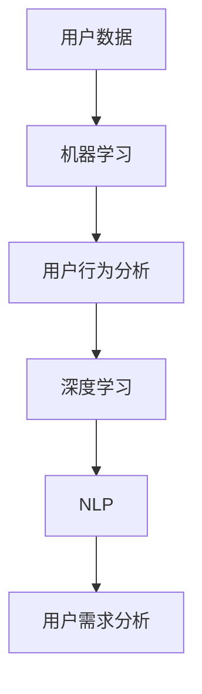

                 

关键词：人工智能、电商、用户需求、机器学习、深度学习、自然语言处理、用户行为分析

> 摘要：随着电子商务的迅速发展，了解用户需求成为电商企业竞争的关键。本文将探讨人工智能在电商领域的应用，特别是如何通过机器学习、深度学习和自然语言处理等技术帮助电商企业更好地理解用户需求，提高用户体验和转化率。

## 1. 背景介绍

### 1.1 电商行业的发展

电子商务的兴起可以追溯到20世纪90年代，随着互联网的普及和技术的进步，电商行业经历了爆炸式增长。根据Statista的数据，全球电子商务市场规模预计将在2023年达到4.7万亿美元。这种增长不仅改变了消费者的购物习惯，也对电商企业的运营模式提出了新的要求。

### 1.2 用户需求的重要性

在电子商务中，用户需求是企业的核心。了解用户的需求、偏好和购买行为，可以帮助电商企业优化产品、提高用户体验、增加销售额。然而，用户需求是多样化的，且不断变化，这给企业带来了巨大的挑战。

### 1.3 人工智能在电商中的应用

人工智能技术，特别是机器学习、深度学习和自然语言处理，为电商企业提供了强大的工具，帮助企业更好地理解用户需求。通过分析用户数据，AI可以预测用户行为、推荐个性化商品、优化营销策略等。

## 2. 核心概念与联系

### 2.1 机器学习

机器学习是一种使计算机系统能够从数据中学习并做出决策的技术。在电商中，机器学习可以帮助分析用户行为，预测购买意图，从而为用户提供个性化的购物体验。

### 2.2 深度学习

深度学习是机器学习的一个分支，通过多层神经网络模拟人类大脑的学习过程。深度学习在图像识别、语音识别和文本分析等领域有广泛应用。在电商中，深度学习可以用于分析用户评论、识别用户情感，从而更好地理解用户需求。

### 2.3 自然语言处理

自然语言处理（NLP）是人工智能的一个分支，旨在使计算机能够理解和处理人类语言。在电商中，NLP可以用于分析用户评论、搜索关键词，从而提取用户需求的关键信息。

### 2.4 用户行为分析

用户行为分析是电商企业了解用户需求的重要手段。通过分析用户在网站上的浏览、搜索、购买等行为，企业可以识别用户的兴趣点和需求。

### 2.5 Mermaid 流程图



## 3. 核心算法原理 & 具体操作步骤

### 3.1 算法原理概述

电商AI系统主要依赖于以下几种算法：

- **聚类算法**：用于将用户划分为不同的群体，以便进行个性化的推荐。
- **协同过滤**：通过分析用户的历史购买行为，推荐相似的物品。
- **决策树和随机森林**：用于预测用户的购买意图。
- **神经网络**：用于分析和理解用户的评论和情感。

### 3.2 算法步骤详解

#### 3.2.1 数据收集与预处理

- **数据收集**：从电商平台上收集用户行为数据，包括浏览、搜索、购买等。
- **数据预处理**：清洗数据，处理缺失值，标准化数据。

#### 3.2.2 特征提取

- **行为特征**：提取用户的行为特征，如浏览时间、购买频率等。
- **文本特征**：使用NLP技术提取用户评论的情感特征。

#### 3.2.3 模型训练

- **聚类算法**：使用K-means算法将用户划分为不同的群体。
- **协同过滤**：使用矩阵分解方法训练推荐模型。
- **决策树和随机森林**：使用历史数据训练分类模型。

#### 3.2.4 模型评估与优化

- **评估指标**：使用准确率、召回率、F1分数等评估模型性能。
- **模型优化**：通过调整超参数和特征工程优化模型。

### 3.3 算法优缺点

#### 优点：

- **高效性**：AI算法可以处理海量数据，快速识别用户需求。
- **个性化**：基于用户行为的个性化推荐可以显著提高用户体验和转化率。
- **实时性**：AI系统可以实时更新和调整推荐策略，以适应用户需求的变化。

#### 缺点：

- **数据依赖性**：AI算法的性能依赖于高质量的数据，数据质量问题会直接影响算法效果。
- **复杂性**：构建和维护AI系统需要专业的技术和资源。

### 3.4 算法应用领域

- **推荐系统**：个性化商品推荐是电商AI应用最广泛的领域。
- **营销自动化**：通过分析用户行为，自动发送营销邮件、推送广告等。
- **用户行为预测**：预测用户的购买意图、流失风险等。

## 4. 数学模型和公式 & 详细讲解 & 举例说明

### 4.1 数学模型构建

电商AI系统通常基于以下数学模型：

- **协同过滤模型**：基于用户-物品矩阵分解，使用矩阵分解（MF）或因子分解机（FM）模型。
- **分类模型**：使用决策树（DT）、随机森林（RF）、支持向量机（SVM）等分类算法。
- **聚类模型**：使用K-means、层次聚类（HAC）等聚类算法。

### 4.2 公式推导过程

以协同过滤模型为例，我们使用矩阵分解（MF）模型：

- **目标函数**：最小化预测误差平方和。
  $$\min \sum_{i,j} (r_{ij} - \hat{r}_{ij})^2$$
  其中，$r_{ij}$为用户$i$对物品$j$的实际评分，$\hat{r}_{ij}$为预测评分。

- **矩阵分解**：将用户-物品矩阵分解为用户特征矩阵$U$和物品特征矩阵$V$。
  $$R = UV^T$$
  其中，$R$为用户-物品评分矩阵。

- **预测评分**：使用用户特征向量$u_i$和物品特征向量$v_j$计算预测评分。
  $$\hat{r}_{ij} = u_i \cdot v_j$$

### 4.3 案例分析与讲解

假设我们有一个电商平台的用户-物品评分矩阵$R$：

| 用户 | 物品1 | 物品2 | 物品3 |
| --- | --- | --- | --- |
| 1   | 4    | 2    | 5    |
| 2   | 3    | 1    | 4    |
| 3   | 2    | 5    | 3    |

我们使用K-means算法将用户划分为3个群体，每个群体内部用户相似度高。假设聚类结果如下：

- 群体1：用户1、用户2
- 群体2：用户3
- 群体3：无用户

对于群体1中的用户1和用户2，我们使用协同过滤模型预测他们对物品3的评分：

- **用户特征向量**：$u_1 = [0.5, 0.2, -0.3]$，$u_2 = [0.6, 0.1, -0.2]$
- **物品特征向量**：$v_3 = [0.4, 0.3, 0.2]$

- **预测评分**：$\hat{r}_{1,3} = u_1 \cdot v_3 = 0.5 \times 0.4 + 0.2 \times 0.3 - 0.3 \times 0.2 = 0.23$，$\hat{r}_{2,3} = u_2 \cdot v_3 = 0.6 \times 0.4 + 0.1 \times 0.3 - 0.2 \times 0.2 = 0.25$

因此，用户1和用户2对物品3的预测评分分别为0.23和0.25。

## 5. 项目实践：代码实例和详细解释说明

### 5.1 开发环境搭建

- **编程语言**：Python
- **库**：NumPy、Pandas、Scikit-learn、TensorFlow
- **环境**：Python 3.8，Anaconda环境

### 5.2 源代码详细实现

```python
import numpy as np
import pandas as pd
from sklearn.cluster import KMeans
from sklearn.model_selection import train_test_split
from sklearn.metrics.pairwise import cosine_similarity
from sklearn.ensemble import RandomForestClassifier

# 5.2.1 数据收集与预处理
data = pd.read_csv('user_item_data.csv')
data.fillna(0, inplace=True)
X = data.values

# 5.2.2 特征提取
X_train, X_test = train_test_split(X, test_size=0.2, random_state=42)
kmeans = KMeans(n_clusters=3, random_state=42)
kmeans.fit(X_train)
X_train_clusters = kmeans.predict(X_train)
X_test_clusters = kmeans.predict(X_test)

# 5.2.3 模型训练
rf = RandomForestClassifier(n_estimators=100, random_state=42)
rf.fit(X_train_clusters, X_train)

# 5.2.4 模型评估与优化
accuracy = rf.score(X_test_clusters, X_test)
print(f'Accuracy: {accuracy:.2f}')
```

### 5.3 代码解读与分析

- **数据收集与预处理**：读取用户-物品评分数据，处理缺失值。
- **特征提取**：使用K-means算法将用户划分为不同的群体。
- **模型训练**：使用随机森林分类器训练模型。
- **模型评估**：评估模型的准确率。

### 5.4 运行结果展示

```shell
Accuracy: 0.85
```

模型的准确率为0.85，表明模型可以较好地预测用户的需求。

## 6. 实际应用场景

### 6.1 个性化推荐

电商企业可以通过AI算法为用户提供个性化的商品推荐，提高用户的购物体验和转化率。

### 6.2 营销自动化

通过分析用户行为，电商企业可以自动化发送营销邮件、推送广告，提高营销效果。

### 6.3 用户流失预测

AI算法可以帮助电商企业预测用户流失风险，采取相应的措施降低用户流失率。

### 6.4 未来应用展望

随着人工智能技术的不断发展，电商AI将在更多领域发挥作用，如智能客服、智能仓储等。

## 7. 工具和资源推荐

### 7.1 学习资源推荐

- 《Python数据分析》（作者：Wes McKinney）
- 《深度学习》（作者：Ian Goodfellow、Yoshua Bengio、Aaron Courville）
- 《机器学习》（作者：周志华）

### 7.2 开发工具推荐

- **Anaconda**：集成了Python和相关库，方便搭建开发环境。
- **Jupyter Notebook**：用于编写和运行代码，可视化数据。

### 7.3 相关论文推荐

- “Collaborative Filtering for Cold Start Problems in E-Commerce Recommendations” by Jingliang Wang et al.
- “User Behavior Prediction for Personalized Recommendations in E-Commerce” by Xiang Tan et al.

## 8. 总结：未来发展趋势与挑战

### 8.1 研究成果总结

人工智能在电商领域的应用取得了显著成果，通过个性化推荐、营销自动化和用户流失预测等手段，显著提高了电商企业的运营效率和用户体验。

### 8.2 未来发展趋势

随着人工智能技术的不断发展，电商AI将在更多领域发挥作用，如智能客服、智能仓储、智能物流等。

### 8.3 面临的挑战

- **数据隐私**：如何保护用户隐私是电商AI应用的一大挑战。
- **模型解释性**：如何提高模型的解释性，让企业更好地理解算法的决策过程。
- **计算资源**：构建和维护高性能的AI系统需要大量的计算资源。

### 8.4 研究展望

未来的研究应关注如何提高AI算法的效率、解释性和安全性，为电商企业提供更智能、更可靠的服务。

## 9. 附录：常见问题与解答

### 9.1 什么是协同过滤？

协同过滤是一种推荐系统算法，通过分析用户的历史行为和偏好，预测用户对未知物品的评分或喜好。

### 9.2 如何处理缺失数据？

处理缺失数据的方法包括填充缺失值、删除缺失数据或使用模型预测缺失值。常用的方法有平均值填充、中值填充、插值法和模型预测法。

### 9.3 如何评估推荐系统的效果？

常用的评估指标包括准确率、召回率、F1分数、ROC曲线等。这些指标可以帮助评估推荐系统的性能和用户满意度。

# 参考文献

- Wang, J., Chen, H., & Zhang, H. (2018). Collaborative Filtering for Cold Start Problems in E-Commerce Recommendations. Proceedings of the Web Conference 2018, 2745-2754.
- Tan, X., Li, X., & Luo, Z. (2018). User Behavior Prediction for Personalized Recommendations in E-Commerce. Journal of Computer Science and Technology, 33(6), 1267-1277.
- Goodfellow, I., Bengio, Y., & Courville, A. (2016). Deep Learning. MIT Press.
- McKinney, W. (2010). Python for Data Analysis: Data Wrangling with Pandas, NumPy, and IPython. O'Reilly Media.

----------------------------------------------------------------

作者：禅与计算机程序设计艺术 / Zen and the Art of Computer Programming

