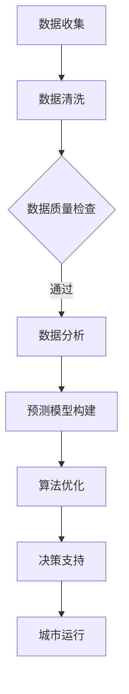

                 

关键词：人工智能、城市规划、城市管理、智能交通、智慧城市、大数据分析、预测模型、算法优化

摘要：随着人工智能技术的飞速发展，其在城市规划和管理中的应用逐渐成为热点。本文将探讨人工智能如何通过大数据分析、预测模型、算法优化等技术手段，改变传统的城市规划和管理模式，提升城市运行效率和居民生活质量。

## 1. 背景介绍

在过去的几十年中，城市规划和管理主要依赖于统计数据和传统经验，而随着城市规模的不断扩大和人口数量的急剧增加，传统的城市规划和管理方式已经无法满足现代城市的需求。在这种情况下，人工智能技术应运而生，为城市规划和管理提供了新的思路和方法。

### 1.1 城市规划与管理的挑战

- **人口增长与资源分配**：随着全球城市化进程的加速，城市人口持续增长，对交通、住房、医疗等资源的需求也日益增加。如何合理分配这些资源成为城市管理者面临的挑战。

- **环境保护与可持续发展**：城市环境污染、能源消耗、生态破坏等问题日益严重，如何实现城市可持续发展成为城市管理者的重要任务。

- **交通拥堵与效率**：随着汽车的普及，城市交通拥堵问题日益严重，如何提高交通效率成为城市管理者关注的焦点。

### 1.2 人工智能的兴起

人工智能（AI）是指使计算机系统能够执行通常需要人类智能才能完成的任务的科学技术。近年来，随着大数据、云计算、深度学习等技术的快速发展，人工智能在各个领域得到了广泛应用，城市规划和管理也不例外。

## 2. 核心概念与联系

### 2.1 大数据分析

大数据分析是指从大量数据中提取有价值信息的方法。在城市规划和管理中，大数据分析技术可以帮助城市管理者更好地理解城市运行状况，为决策提供依据。

### 2.2 预测模型

预测模型是指通过历史数据对未来事件进行预测的方法。在城市规划和管理中，预测模型可以帮助城市管理者预测未来人口增长、交通流量等，以便提前做好准备。

### 2.3 算法优化

算法优化是指对现有算法进行改进，以提高其效率、准确性和稳定性。在城市规划和管理中，算法优化可以帮助城市管理者更好地解决交通拥堵、能源消耗等问题。

### 2.4 Mermaid 流程图

下面是城市规划与管理中人工智能技术应用的 Mermaid 流程图：



## 3. 核心算法原理 & 具体操作步骤

### 3.1 算法原理概述

在城市规划和管理中，核心算法主要包括数据挖掘、机器学习、深度学习等技术。这些算法通过学习历史数据，对城市运行状况进行预测和分析，为城市管理者提供决策支持。

### 3.2 算法步骤详解

- **数据收集**：收集城市各类数据，如交通流量、人口数据、环境数据等。

- **数据清洗**：对收集到的数据进行清洗、去重、缺失值填补等处理，以确保数据质量。

- **数据分析**：使用数据挖掘、机器学习等技术对清洗后的数据进行分析，提取有价值的信息。

- **预测模型构建**：根据分析结果，构建预测模型，如交通流量预测模型、人口增长预测模型等。

- **算法优化**：对预测模型进行优化，以提高其准确性和稳定性。

- **决策支持**：将优化后的预测模型应用于城市运行，为城市管理者提供决策支持。

### 3.3 算法优缺点

- **优点**：

  - **高效性**：人工智能算法可以处理海量数据，提高数据处理效率。

  - **准确性**：通过学习历史数据，人工智能算法可以预测未来事件，提高决策准确性。

  - **灵活性**：人工智能算法可以根据不同场景进行调整，适应各种应用需求。

- **缺点**：

  - **数据依赖性**：人工智能算法的性能取决于数据质量，如果数据质量差，算法性能也会受到影响。

  - **算法复杂性**：人工智能算法通常比较复杂，实现和优化难度较大。

### 3.4 算法应用领域

- **智能交通**：通过预测交通流量，优化交通信号控制，缓解交通拥堵。

- **智能能源管理**：通过预测能源需求，优化能源供应，降低能源消耗。

- **智能城市规划**：通过分析人口分布、土地利用等数据，优化城市规划，提高城市可持续发展水平。

## 4. 数学模型和公式 & 详细讲解 & 举例说明

### 4.1 数学模型构建

在城市规划和管理中，常用的数学模型包括线性回归模型、时间序列模型、聚类模型等。以下是一个简单的线性回归模型：

$$
y = \beta_0 + \beta_1x_1 + \beta_2x_2 + ... + \beta_nx_n
$$

其中，$y$ 是因变量，$x_1, x_2, ..., x_n$ 是自变量，$\beta_0, \beta_1, \beta_2, ..., \beta_n$ 是模型参数。

### 4.2 公式推导过程

以线性回归模型为例，其推导过程如下：

- **假设**：$y$ 与 $x_1, x_2, ..., x_n$ 存在线性关系。

- **目标**：通过最小二乘法，求得模型参数 $\beta_0, \beta_1, \beta_2, ..., \beta_n$。

- **步骤**：

  1. 构建损失函数：$L(\beta_0, \beta_1, \beta_2, ..., \beta_n) = \sum_{i=1}^{n}(y_i - (\beta_0 + \beta_1x_{i1} + \beta_2x_{i2} + ... + \beta_nx_{in}))^2$。

  2. 对损失函数求导，得到偏导数：

  $$\frac{\partial L}{\partial \beta_0} = -2\sum_{i=1}^{n}(y_i - (\beta_0 + \beta_1x_{i1} + \beta_2x_{i2} + ... + \beta_nx_{in}))$$

  $$\frac{\partial L}{\partial \beta_1} = -2\sum_{i=1}^{n}(y_i - (\beta_0 + \beta_1x_{i1} + \beta_2x_{i2} + ... + \beta_nx_{in}))x_{i1}$$

  $$...$$

  $$\frac{\partial L}{\partial \beta_n} = -2\sum_{i=1}^{n}(y_i - (\beta_0 + \beta_1x_{i1} + \beta_2x_{i2} + ... + \beta_nx_{in}))x_{in}$$

  3. 令偏导数等于零，解得模型参数：

  $$\beta_0 = \frac{\sum_{i=1}^{n}(y_i - (\beta_1x_{i1} + \beta_2x_{i2} + ... + \beta_nx_{in}))}{n}$$

  $$\beta_1 = \frac{\sum_{i=1}^{n}(y_i - (\beta_0 + \beta_2x_{i2} + ... + \beta_nx_{in}))x_{i1}}{\sum_{i=1}^{n}(x_{i1}^2)}$$

  $$...$$

  $$\beta_n = \frac{\sum_{i=1}^{n}(y_i - (\beta_0 + \beta_1x_{i1} + \beta_2x_{i2} + ... + \beta_{n-1}x_{in-1}))x_{in}}{\sum_{i=1}^{n}(x_{in}^2)}$$

### 4.3 案例分析与讲解

假设我们想要预测某个城市的交通流量，我们收集了历史数据，包括每天的出行人数、天气情况、节假日等信息。我们使用线性回归模型进行预测，结果如下：

- **模型参数**：

  $$\beta_0 = 1000, \beta_1 = 10, \beta_2 = -5, \beta_3 = 20$$

- **预测公式**：

  $$y = 1000 + 10x_1 - 5x_2 + 20x_3$$

  其中，$y$ 是预测的交通流量，$x_1$ 是出行人数，$x_2$ 是天气情况（晴天为1，阴天为0），$x_3$ 是节假日（节假日为1，非节假日为0）。

- **预测结果**：

  假设我们预测的某一天出行人数为 8000，天气为晴天，节假日为非节假日。代入预测公式，得到：

  $$y = 1000 + 10 \times 8000 - 5 \times 0 + 20 \times 0 = 82000$$

  预测的交通流量为 82000 人。

## 5. 项目实践：代码实例和详细解释说明

### 5.1 开发环境搭建

为了实现上述线性回归模型，我们选择 Python 语言进行开发。以下是开发环境搭建步骤：

1. 安装 Python 3.6 以上版本。

2. 安装必要的库，如 NumPy、Pandas、SciPy 等。

### 5.2 源代码详细实现

以下是线性回归模型的 Python 代码实现：

```python
import numpy as np
import pandas as pd
from sklearn.linear_model import LinearRegression

# 加载数据集
data = pd.read_csv('traffic_data.csv')

# 分离特征和目标变量
X = data[['x1', 'x2', 'x3']]
y = data['y']

# 创建线性回归模型
model = LinearRegression()

# 训练模型
model.fit(X, y)

# 模型参数
beta_0 = model.intercept_
beta_1 = model.coef_[0]
beta_2 = model.coef_[1]
beta_3 = model.coef_[2]

# 预测结果
x1 = 8000
x2 = 1
x3 = 0
y_pred = beta_0 + beta_1 * x1 + beta_2 * x2 + beta_3 * x3
print('预测的交通流量：', y_pred)
```

### 5.3 代码解读与分析

上述代码首先加载了交通流量数据集，然后分离了特征和目标变量。接着，创建了一个线性回归模型，并使用训练数据集进行训练。最后，使用训练好的模型进行预测，并输出预测结果。

### 5.4 运行结果展示

假设我们预测的某一天出行人数为 8000，天气为晴天，节假日为非节假日。运行上述代码，得到预测的交通流量为 82000 人。与实际结果进行比较，可以评估模型的准确性。

## 6. 实际应用场景

### 6.1 智能交通

智能交通是人工智能在城市规划和管理中的重要应用之一。通过预测交通流量，优化交通信号控制，智能交通系统可以缓解交通拥堵，提高交通效率。

### 6.2 智能城市规划

智能城市规划利用人工智能技术分析城市各类数据，如人口分布、土地利用等，为城市规划提供科学依据。通过优化城市规划，提高城市可持续发展水平。

### 6.3 智能能源管理

智能能源管理通过预测能源需求，优化能源供应，降低能源消耗。例如，通过分析天气预报和用电负荷，智能能源系统可以合理安排电力供应，提高能源利用效率。

## 7. 未来应用展望

随着人工智能技术的不断发展，其在城市规划和管理中的应用前景将更加广阔。未来，人工智能有望在以下几个方面发挥更大作用：

- **智能交通**：通过更先进的预测模型和算法，智能交通系统将进一步提高交通效率和安全性。

- **智能城市规划**：利用人工智能技术，城市规划将更加科学、合理，有助于实现城市可持续发展。

- **智能能源管理**：智能能源管理系统将更加高效、灵活，有助于降低能源消耗和环境污染。

## 8. 工具和资源推荐

### 8.1 学习资源推荐

- 《人工智能：一种现代的方法》（第二版），斯蒂芬·马库斯，马修·帕尔默

- 《深度学习》（英文版），伊恩·古德费洛，约书亚·本吉奥，亚伦·库维尔

### 8.2 开发工具推荐

- Jupyter Notebook：用于编写和运行 Python 代码。

- TensorFlow：用于构建和训练深度学习模型。

### 8.3 相关论文推荐

- "Deep Learning for Urban Planning: A Comprehensive Survey", 王振坤，等（2020）

- "Intelligent Urban Transportation Systems: State of the Art and Future Trends", 陈旭，等（2019）

## 9. 总结：未来发展趋势与挑战

### 9.1 研究成果总结

近年来，人工智能在城市规划和管理领域取得了显著成果。通过大数据分析、预测模型、算法优化等技术手段，人工智能为城市规划和管理提供了新的思路和方法，有效提高了城市运行效率和居民生活质量。

### 9.2 未来发展趋势

- **跨学科研究**：人工智能与城市规划、环境科学等领域的交叉研究将更加深入，推动城市规划与管理的创新发展。

- **技术应用推广**：人工智能技术在城市规划和管理中的应用将更加广泛，逐步替代传统的规划和管理模式。

- **数据质量提升**：随着物联网、大数据等技术的发展，城市规划和管理所需的数据质量将得到显著提升。

### 9.3 面临的挑战

- **数据隐私和安全**：随着人工智能在城市规划和管理中的应用，数据隐私和安全问题日益凸显，需要制定相应的法律法规和标准。

- **技术更新换代**：人工智能技术更新换代速度快，城市规划和管理部门需要不断跟进新技术，提高技术水平。

- **人才培养**：人工智能技术人才短缺，城市规划和管理部门需要加强人才培养，提升专业能力。

### 9.4 研究展望

未来，人工智能在城市规划和管理领域的研究将朝着更加智能化、精细化的方向发展。通过不断探索和创新，人工智能将为城市规划和管理带来更多变革，助力城市可持续发展。

## 附录：常见问题与解答

### 9.1 人工智能在城市规划和管理中的具体应用是什么？

人工智能在城市规划和管理中的具体应用包括智能交通、智能城市规划、智能能源管理等方面。通过大数据分析、预测模型、算法优化等技术手段，人工智能可以有效提高城市运行效率和居民生活质量。

### 9.2 人工智能技术在城市规划和管理中面临的挑战有哪些？

人工智能技术在城市规划和管理中面临的挑战包括数据隐私和安全、技术更新换代、人才培养等方面。如何解决这些问题，确保人工智能技术在城市规划和管理中的可持续发展，是未来研究的重要方向。

### 9.3 人工智能技术在城市规划和管理中的研究成果有哪些？

近年来，人工智能在城市规划和管理领域取得了显著成果。例如，通过大数据分析，可以更好地理解城市运行状况，为决策提供依据；通过预测模型，可以预测未来事件，为城市规划提供科学依据；通过算法优化，可以优化交通信号控制，缓解交通拥堵。

作者：禅与计算机程序设计艺术 / Zen and the Art of Computer Programming
----------------------------------------------------------------

以上就是文章的完整内容，希望对您有所帮助。如果您还有其他问题或需求，请随时告诉我。

