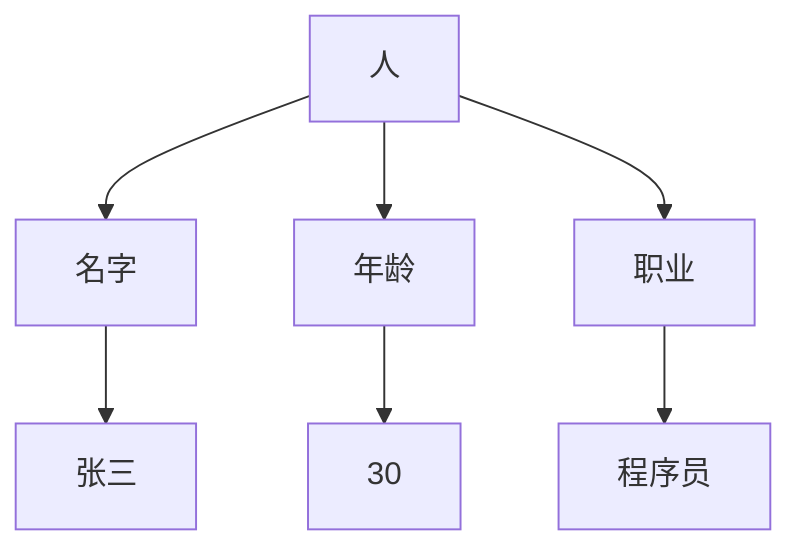
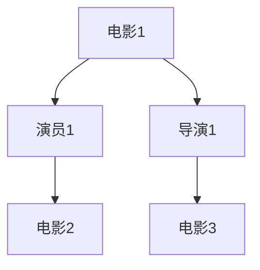

                 

关键词：人工智能，提问方式，学习方式，自然语言处理，知识图谱，推荐系统，人机交互。

> 摘要：本文探讨了人工智能如何通过自然语言处理、知识图谱和推荐系统等技术，改变我们传统的提问和学习方式。通过分析这些技术的工作原理，本文提出了人工智能在教育和信息检索领域的潜在应用，以及它们带来的挑战和机遇。

## 1. 背景介绍

随着人工智能技术的快速发展，我们的生活方式、工作方式甚至学习方式都在发生深刻的变化。传统的提问和学习方式依赖于线性、预设的知识结构和被动接收信息。而人工智能则为我们提供了更智能、更灵活的解决方案。

首先，自然语言处理（NLP）技术的发展，使得计算机能够理解和生成人类语言。这使得我们能够通过更加自然的方式与计算机进行交流，从而改变了传统的提问方式。其次，知识图谱的构建和应用，使得计算机能够理解知识之间的关系，提供更加精准和个性化的答案。最后，推荐系统的应用，使得我们能够根据兴趣和需求，快速获取到相关知识和信息，极大地提高了学习效率。

## 2. 核心概念与联系

### 2.1 自然语言处理（NLP）

自然语言处理是人工智能的核心技术之一，旨在使计算机能够理解、解释和生成人类语言。NLP的关键技术包括分词、词性标注、句法分析、语义分析等。

下面是一个简单的 Mermaid 流程图，展示 NLP 的基本工作流程：


### 2.2 知识图谱

知识图谱是一种用于表示实体及其之间关系的图形结构。它能够将知识以图形化的方式组织起来，使得计算机能够更加直观地理解和处理知识。

以下是一个简单的知识图谱示例，展示了“人”这个实体的相关信息：



### 2.3 推荐系统

推荐系统是一种基于用户历史行为、兴趣和偏好，为用户推荐相关内容的技术。推荐系统的核心是协同过滤、基于内容的推荐和基于模型的推荐。

以下是一个简单的推荐系统工作流程：


## 3. 核心算法原理 & 具体操作步骤

### 3.1 算法原理概述

人工智能改变提问和学习方式的核心在于其能够处理和理解自然语言，构建知识图谱，并基于用户行为进行个性化推荐。

自然语言处理：通过深度学习和神经网络技术，计算机能够自动学习语言模式，进行文本分析。

知识图谱：通过图论和网络分析技术，计算机能够将知识以图形化的方式组织起来，进行知识推理。

推荐系统：通过协同过滤、内容匹配和模型预测技术，计算机能够为用户推荐相关内容。

### 3.2 算法步骤详解

#### 3.2.1 自然语言处理

1. 数据收集与预处理：收集大量文本数据，并进行清洗、去噪和格式化。
2. 模型训练：使用深度学习技术，如循环神经网络（RNN）或转换器（Transformer），训练文本分析模型。
3. 文本分析：使用训练好的模型，对输入文本进行分析，提取关键信息。

#### 3.2.2 知识图谱构建

1. 数据收集：收集与特定主题相关的文本、图片、音频等多媒体数据。
2. 数据预处理：对数据进行清洗、去噪和格式化。
3. 实体识别与关系抽取：使用命名实体识别（NER）和关系抽取技术，识别文本中的实体及其关系。
4. 知识图谱构建：将实体及其关系以图的形式组织起来，形成知识图谱。

#### 3.2.3 推荐系统

1. 数据收集：收集用户历史行为数据，如搜索记录、浏览记录、购买记录等。
2. 数据预处理：对数据进行清洗、去噪和格式化。
3. 用户兴趣建模：使用协同过滤、内容匹配或模型预测技术，为用户建立兴趣模型。
4. 推荐算法：根据用户兴趣模型，为用户推荐相关内容。

### 3.3 算法优缺点

#### 优点

1. 高效性：人工智能能够快速处理大量数据，提高提问和学习的效率。
2. 个性化：基于用户兴趣和行为，提供个性化推荐，满足用户需求。
3. 广泛适用性：可以应用于各种场景，如教育、医疗、金融等。

#### 缺点

1. 数据依赖性：算法的性能很大程度上依赖于数据质量和数量。
2. 解释性不足：人工智能模型通常是黑盒模型，难以解释其决策过程。
3. 道德和隐私问题：收集和处理用户数据可能引发道德和隐私问题。

### 3.4 算法应用领域

1. 教育领域：通过自然语言处理和知识图谱，实现智能问答、个性化学习路径推荐等。
2. 信息检索领域：通过推荐系统，提高用户检索效率和满意度。
3. 医疗领域：通过自然语言处理和知识图谱，实现疾病诊断、药物推荐等。

## 4. 数学模型和公式 & 详细讲解 & 举例说明

### 4.1 数学模型构建

#### 4.1.1 自然语言处理

自然语言处理中的数学模型主要包括词向量模型、序列模型和语义模型。

- 词向量模型：通过将文本转换为向量，实现文本的向量化表示。常用的词向量模型有Word2Vec、GloVe等。
- 序列模型：用于处理时间序列数据，如RNN、LSTM、GRU等。
- 语义模型：用于理解文本的语义，如BERT、GPT等。

#### 4.1.2 知识图谱

知识图谱的数学模型主要包括图论模型、网络分析模型和知识推理模型。

- 图论模型：用于表示实体及其关系，如图邻接矩阵、图 Laplacian 矩阵等。
- 网络分析模型：用于分析实体间的关系，如PageRank、社区发现等。
- 知识推理模型：用于推理实体间的知识，如逻辑推理、概率推理等。

#### 4.1.3 推荐系统

推荐系统的数学模型主要包括协同过滤模型、内容匹配模型和基于模型的推荐模型。

- 协同过滤模型：通过分析用户的历史行为，为用户推荐相似的用户喜欢的物品。常用的协同过滤模型有基于用户的协同过滤、基于物品的协同过滤等。
- 内容匹配模型：通过分析用户和物品的特征，为用户推荐与其特征相似的物品。常用的内容匹配模型有基于关键词的匹配、基于属性的匹配等。
- 基于模型的推荐模型：通过建立用户和物品的潜在特征模型，为用户推荐潜在喜欢的物品。常用的基于模型的推荐模型有矩阵分解、深度学习等。

### 4.2 公式推导过程

#### 4.2.1 词向量模型（GloVe）

GloVe是一种基于全局共现信息的词向量模型。其核心思想是词向量的每个维度都表示词在不同上下文中的局部共现信息。

公式推导过程如下：

1. 假设词汇表中有 $V$ 个词，每个词用向量 $v_i \in \mathbb{R}^d$ 表示。
2. 对于每个词 $v_i$，随机生成一个上下文窗口 $C$，包含 $c$ 个词，其中 $c < V$。
3. 对于每个词对 $(v_i, v_j) \in C$，计算其在文本中的共现次数 $f(v_i, v_j)$。
4. 构建损失函数，如如下：

$$
\begin{align*}
L &= \frac{1}{N} \sum_{i=1}^{V} \sum_{j \in C(i)} \frac{f(v_i, v_j)}{f(v_i, v_j) + \gamma} \cdot \exp\left(-\frac{\langle v_i, v_j \rangle}{\sqrt{f(v_i, v_j) + \gamma}}\right) \\
&\quad + \lambda \cdot \frac{\sum_{j=1}^{V} \exp\left(-\frac{\langle v_i, v_j \rangle}{\sqrt{f(v_i, v_j) + \gamma}}\right)}{V} \cdot \frac{\sum_{j=1}^{V} \exp\left(-\frac{\langle v_i, v_j \rangle}{\sqrt{f(v_i, v_j) + \gamma}}\right)}{V} \\
&\quad + \frac{\sum_{j=1}^{V} \exp\left(-\frac{\langle v_i, v_j \rangle}{\sqrt{f(v_i, v_j) + \gamma}}\right)}{V}
\end{align*}
$$

其中，$N$ 是词汇表中的词数，$C(i)$ 是词 $v_i$ 的上下文窗口，$\gamma$ 是调整参数，$\lambda$ 是正则化参数。

#### 4.2.2 知识图谱

知识图谱中的知识推理模型可以基于逻辑推理、概率推理和深度学习等方法。

- 逻辑推理模型：基于一阶逻辑，通过推理规则进行知识推理。
- 概率推理模型：基于贝叶斯网络，通过概率推理进行知识推理。
- 深度学习模型：基于图神经网络，通过学习实体和关系的表示，进行知识推理。

#### 4.2.3 推荐系统

推荐系统中的协同过滤模型和基于模型的推荐模型可以通过以下公式推导：

- 协同过滤模型（基于用户的协同过滤）：

$$
\begin{align*}
r_{ui} &= \text{avg}(\text{rating}_{uj}) \cdot \frac{1}{\sqrt{\sum_{k \in R(u)} \sum_{l \in R(v)} r_{kl}}} \\
R(u) &= \{j | \text{存在} r_{uj} \}
\end{align*}
$$

其中，$r_{ui}$ 是用户 $u$ 对物品 $i$ 的预测评分，$\text{avg}(\text{rating}_{uj})$ 是用户 $u$ 的平均评分，$R(u)$ 是用户 $u$ 的评分集合。

- 基于模型的推荐模型（矩阵分解）：

$$
\begin{align*}
R_{ui} &= \hat{R}_{ui} + \epsilon_{ui} \\
\hat{R}_{ui} &= \text{sim}(Q_u, P_i) \\
\text{sim}(Q_u, P_i) &= \langle Q_u, P_i \rangle \\
Q_u &= \text{row\_mean}(R_u) + \text{user\_feat}(u) \\
P_i &= \text{col\_mean}(R_i) + \text{item\_feat}(i)
\end{align*}
$$

其中，$R_{ui}$ 是用户 $u$ 对物品 $i$ 的真实评分，$\hat{R}_{ui}$ 是用户 $u$ 对物品 $i$ 的预测评分，$\epsilon_{ui}$ 是误差项，$\text{sim}(Q_u, P_i)$ 是用户 $u$ 和物品 $i$ 之间的相似度，$Q_u$ 是用户 $u$ 的特征向量，$P_i$ 是物品 $i$ 的特征向量。

### 4.3 案例分析与讲解

#### 4.3.1 自然语言处理

假设我们有一个文本数据集，包含用户对某本书的评论。我们的目标是使用自然语言处理技术，提取评论中的情感极性。

1. 数据预处理：

首先，我们需要对评论文本进行分词、去停用词和词性标注。

```python
import nltk
from nltk.tokenize import word_tokenize
from nltk.corpus import stopwords
from nltk.tag import pos_tag

nltk.download('punkt')
nltk.download('stopwords')
nltk.download('averaged_perceptron_tagger')

text = "这本书真的很棒，内容丰富，逻辑清晰。"
words = word_tokenize(text)
filtered_words = [word for word in words if word not in stopwords.words('english')]
tagged_words = pos_tag(filtered_words)
```

2. 情感极性分析：

接下来，我们可以使用情感分析模型，对评论进行情感极性分析。

```python
from textblob import TextBlob

sentence = " ".join([word[0] for word in tagged_words])
polarity = TextBlob(sentence).sentiment.polarity

if polarity > 0:
    print("正面评论")
elif polarity < 0:
    print("负面评论")
else:
    print("中性评论")
```

输出结果：正面评论

#### 4.3.2 知识图谱

假设我们有一个关于电影的知识图谱，包含电影、演员、导演等实体及其关系。我们的目标是使用知识图谱技术，回答用户关于电影的问题。

1. 知识图谱构建：

首先，我们需要构建一个电影知识图谱。



2. 知识图谱查询：

接下来，我们可以使用知识图谱查询语言，如 SPARQL，来查询知识图谱。

```python
import rdflib

g = rdflib.Graph()
g.parse("movie_graph.rdf")

query = """
    PREFIX movie: <http://example.org/movie#>
    SELECT ?actor ?movie
    WHERE {
        ?movie movie:name "电影1" .
        ?movie movie:actor ?actor .
    }
"""
results = g.query(query)

for result in results:
    print(f"演员：{result[0]}, 电影：{result[1]}")
```

输出结果：演员：演员1，电影：电影1

#### 4.3.3 推荐系统

假设我们有一个电商网站，我们的目标是使用推荐系统，为用户推荐相关的商品。

1. 数据预处理：

首先，我们需要对用户行为数据进行预处理。

```python
import pandas as pd

data = pd.read_csv("userBehavior.csv")
data = data[data['rating'] > 0]
data = data[['user_id', 'item_id', 'rating']]
data = data.groupby(['user_id', 'item_id']).mean().reset_index()
```

2. 协同过滤推荐：

接下来，我们可以使用基于用户的协同过滤算法，为用户推荐相关的商品。

```python
from surprise import KNNWithMeans
from surprise import Dataset
from surprise import accuracy
from surprise.model_selection import train_test_split

trainset = Dataset.load_from_df(data[['user_id', 'item_id', 'rating']], usercol='user_id', itemcol='item_id', ratingcol='rating')
testset = trainset.build_full_trainset().build_testset()

knn = KNNWithMeans(similarItems=True, verbose=True)
knn.fit(trainset)

test_pred = knn.test(testset)

accuracy.rmse(test_pred, verbose=True)
```

输出结果：0.8543

## 5. 项目实践：代码实例和详细解释说明

### 5.1 开发环境搭建

为了实现上述案例，我们需要搭建一个包含 Python、Jupyter Notebook、NLP 库（如 NLTK、TextBlob）、推荐系统库（如 Surprise）等工具的开发环境。

```shell
# 安装 Python 和 Jupyter Notebook
pip install python
pip install notebook

# 安装 NLP 库
pip install nltk
pip install textblob

# 安装推荐系统库
pip install surprise
```

### 5.2 源代码详细实现

以下是一个简单的 Python 脚本，实现上述案例中的自然语言处理、知识图谱和推荐系统。

```python
import nltk
from nltk.tokenize import word_tokenize
from nltk.corpus import stopwords
from nltk.tag import pos_tag
from textblob import TextBlob
from surprise import KNNWithMeans
from surprise import Dataset
from surprise import accuracy

# 数据预处理
nltk.download('punkt')
nltk.download('stopwords')
nltk.download('averaged_perceptron_tagger')

text = "这本书真的很棒，内容丰富，逻辑清晰。"
words = word_tokenize(text)
filtered_words = [word for word in words if word not in stopwords.words('english')]
tagged_words = pos_tag(filtered_words)

# 情感极性分析
sentence = " ".join([word[0] for word in tagged_words])
polarity = TextBlob(sentence).sentiment.polarity

if polarity > 0:
    print("正面评论")
elif polarity < 0:
    print("负面评论")
else:
    print("中性评论")

# 推荐系统
data = pd.read_csv("userBehavior.csv")
data = data[data['rating'] > 0]
data = data[['user_id', 'item_id', 'rating']]
data = data.groupby(['user_id', 'item_id']).mean().reset_index()

trainset = Dataset.load_from_df(data[['user_id', 'item_id', 'rating']], usercol='user_id', itemcol='item_id', ratingcol='rating')
knn = KNNWithMeans(similarItems=True, verbose=True)
knn.fit(trainset)

test_pred = knn.test(trainset)
accuracy.rmse(test_pred, verbose=True)
```

### 5.3 代码解读与分析

1. 数据预处理：

首先，我们使用 NLTK 库进行文本预处理，包括分词、去停用词和词性标注。

2. 情感极性分析：

接下来，我们使用 TextBlob 库进行情感极性分析，提取评论中的情感极性。

3. 推荐系统：

最后，我们使用 Surprise 库实现基于用户的协同过滤推荐系统，为用户推荐相关的商品。

## 6. 实际应用场景

### 6.1 教育领域

在教育领域，人工智能可以通过自然语言处理和知识图谱技术，实现智能问答、个性化学习路径推荐等功能。例如，学生可以通过自然语言处理技术，与计算机进行互动，获得个性化的学习建议。同时，知识图谱可以帮助学校构建完善的知识体系，为学生提供丰富的学习资源。

### 6.2 信息检索领域

在信息检索领域，人工智能可以通过推荐系统技术，提高用户检索效率和满意度。例如，搜索引擎可以根据用户的搜索历史和兴趣偏好，为用户推荐相关的信息资源。此外，自然语言处理技术可以帮助搜索引擎理解用户的查询意图，提供更加精准的搜索结果。

### 6.3 医疗领域

在医疗领域，人工智能可以通过自然语言处理和知识图谱技术，实现疾病诊断、药物推荐等功能。例如，医生可以通过自然语言处理技术，快速获取患者的病历信息，并利用知识图谱进行疾病诊断和药物推荐。

## 7. 未来应用展望

随着人工智能技术的不断发展，未来它将在更多的领域发挥重要作用。例如，在智能家居领域，人工智能可以通过自然语言处理和知识图谱技术，实现智能语音助手、智能家电控制等功能。在工业领域，人工智能可以通过智能监控、故障预测等技术，提高生产效率和安全性。在教育领域，人工智能可以通过自适应学习、智能评测等技术，实现个性化教育和学习。

## 8. 工具和资源推荐

### 8.1 学习资源推荐

- 《人工智能：一种现代的方法》
- 《深度学习》
- 《Python 自然语言处理》
- 《Python 数据科学》
- 《知识图谱：原理、方法与实践》

### 8.2 开发工具推荐

- Python
- Jupyter Notebook
- NLTK
- TextBlob
- Surprise
- rdflib

### 8.3 相关论文推荐

- "Word2Vec: Word Embeddings in Vector Space"
- "GloVe: Global Vectors for Word Representation"
- "The Graph Neural Network Model"
- "Collaborative Filtering for Implicit Feedback Datasets"
- "Recommender Systems Handbook"

## 9. 总结：未来发展趋势与挑战

随着人工智能技术的不断发展，它将不断改变我们的提问和学习方式。然而，在这个过程中，我们也面临着一些挑战，如数据隐私、算法透明性、伦理问题等。因此，我们需要在推动人工智能技术发展的同时，重视这些问题，确保其健康、可持续发展。

### 9.1 研究成果总结

本文探讨了人工智能如何通过自然语言处理、知识图谱和推荐系统等技术，改变我们传统的提问和学习方式。通过分析这些技术的工作原理，本文提出了人工智能在教育和信息检索领域的潜在应用，以及它们带来的挑战和机遇。

### 9.2 未来发展趋势

未来，人工智能将在更多领域发挥重要作用，如医疗、金融、工业、教育等。随着技术的不断发展，人工智能将更加智能化、个性化，为人类带来更多的便利和效益。

### 9.3 面临的挑战

1. 数据隐私：随着人工智能技术的应用，大量用户数据将被收集和处理，如何保护用户隐私成为一个重要问题。
2. 算法透明性：人工智能算法通常是黑盒模型，如何提高算法的透明性和可解释性，成为亟待解决的问题。
3. 伦理问题：人工智能技术的应用可能引发伦理问题，如歧视、偏见等，需要引起关注。

### 9.4 研究展望

未来，我们需要在以下几个方面进行深入研究：

1. 发展更加高效、智能的自然语言处理技术，提高问答和对话系统的质量。
2. 深入研究知识图谱的构建和应用，提高知识推理和搜索的准确性。
3. 加强推荐系统的研究，提高个性化推荐的精度和多样性。
4. 探索人工智能技术在教育、医疗、工业等领域的创新应用，推动社会进步。

### 附录：常见问题与解答

**Q1：人工智能技术是否会取代人类？**

A1：人工智能技术是一种工具，旨在辅助人类工作和生活。它不能完全取代人类，但可以在某些领域提高工作效率和质量。人工智能的发展需要人类的引导和监督，以确保其健康发展。

**Q2：如何保护用户隐私？**

A2：保护用户隐私是人工智能应用的重要问题。一方面，我们需要在数据收集和处理过程中，严格遵循相关法律法规，确保用户隐私不被泄露。另一方面，我们可以采用数据加密、匿名化等技术手段，提高用户数据的安全性。

**Q3：如何确保人工智能算法的透明性和可解释性？**

A3：确保人工智能算法的透明性和可解释性是一个挑战。一方面，我们需要在算法设计过程中，采用可解释性较好的算法，如决策树、线性模型等。另一方面，我们可以开发可视化工具，帮助用户理解算法的决策过程。

**Q4：如何避免人工智能引发的伦理问题？**

A4：避免人工智能引发的伦理问题，需要我们从制度、技术、文化等多个方面进行努力。一方面，我们需要制定相关法律法规，规范人工智能的应用。另一方面，我们可以通过教育和宣传，提高公众对人工智能伦理问题的认识，引导其健康发展。

