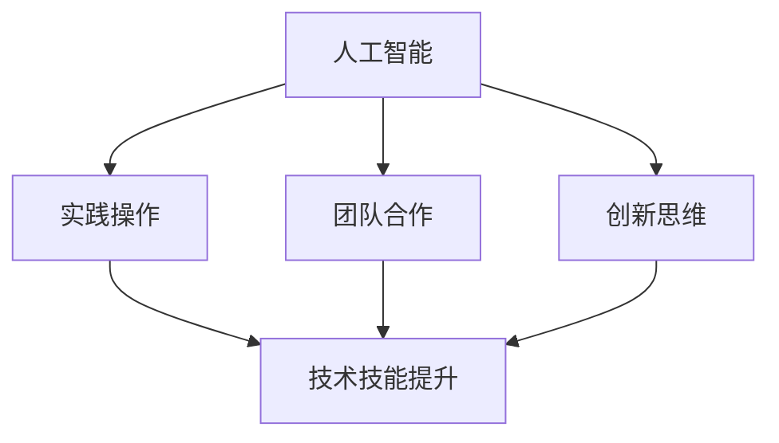

                 

关键词：人工智能、线下培训、实践工作坊、教学模式创新、技术技能提升

> 摘要：本文深入探讨了人工智能（AI）实践工作坊作为一种线下培训新模式的重要性，以及其在提升技术技能、激发创新思维和培养实践能力方面的独特优势。通过详细分析AI实践工作坊的背景、核心概念、算法原理、数学模型、项目实践和未来应用展望，本文旨在为教育工作者、技术从业者提供有价值的参考，推动线下培训模式的创新与发展。

## 1. 背景介绍

随着人工智能技术的快速发展，AI在教育领域的应用日益广泛。传统的线上教育和线下培训模式已经无法满足现代学习者对于实践技能和实际应用能力的需求。为了更好地将理论知识与实践技能相结合，提高学习效果，线下实践工作坊作为一种新兴的教学模式逐渐崭露头角。

线下实践工作坊不仅提供了一个实际的动手操作环境，让学习者能够在真实情境中掌握技术技能，还能通过团队合作和互动交流激发创新思维。与传统培训模式相比，AI实践工作坊更注重学习者参与度和实际应用能力的培养，从而实现从知识传授到技能培养的转变。

### 1.1 历史背景

线下实践工作坊的兴起可以追溯到上世纪末和本世纪初，当时计算机科学教育开始关注实践性教学的重要性。随着互联网和人工智能技术的普及，这种教学模式逐渐得到完善和发展，并逐渐应用于各个领域。如今，AI实践工作坊已经成为一种重要的线下培训形式，为学习者提供了更加灵活、高效的学习途径。

### 1.2 当前现状

在全球范围内，越来越多的教育机构和企业开始采用AI实践工作坊作为培训模式。例如，许多大学和培训机构开设了针对人工智能和机器学习的实践课程，通过实际项目开发和团队协作，让学生掌握相关技能。此外，许多企业也在内部组织了AI实践工作坊，帮助员工提升技术水平，增强团队协作能力。

### 1.3 发展趋势

未来，随着人工智能技术的不断进步和教育理念的不断创新，AI实践工作坊将继续发展壮大。预计将有更多的教育机构和企业采用这种教学模式，以满足学习者对于实践技能和实际应用能力的需求。同时，AI实践工作坊也将不断优化和完善，提供更加丰富和多样的培训内容，为学习者提供更好的学习体验。

## 2. 核心概念与联系

AI实践工作坊的核心概念包括人工智能、实践操作、团队合作和创新思维。这些概念之间相互联系，共同构成了一个完整的学习和培训体系。

### 2.1 人工智能

人工智能是指使计算机模拟人类智能行为的技术和系统。它涵盖了机器学习、深度学习、自然语言处理、计算机视觉等多个子领域。在AI实践工作坊中，学习者将接触到这些核心技术，并通过实际项目开发来掌握其应用方法。

### 2.2 实践操作

实践操作是指通过动手操作来掌握技术技能的过程。在AI实践工作坊中，学习者将通过编写代码、调试程序、设计算法等方式，将理论知识转化为实际技能。这种实践操作不仅有助于巩固所学知识，还能提高解决问题的能力。

### 2.3 团队合作

团队合作是指在一个团队中共同完成一个项目的过程。在AI实践工作坊中，学习者将通过小组合作、分工协作来完成任务。这种团队合作不仅有助于提高学习效率，还能培养团队合作精神和沟通能力。

### 2.4 创新思维

创新思维是指通过发散性思维和创造性思维来解决问题的能力。在AI实践工作坊中，学习者将通过实际项目开发和团队合作，不断探索和尝试新的解决方案。这种创新思维有助于培养学习者的创造力和创新能力。

### 2.5 Mermaid 流程图

以下是一个简化的AI实践工作坊流程图，展示了核心概念之间的联系：



## 3. 核心算法原理 & 具体操作步骤

### 3.1 算法原理概述

在AI实践工作坊中，常用的核心算法包括机器学习算法、深度学习算法和自然语言处理算法。这些算法分别用于数据挖掘、图像识别、语音识别、文本分析等领域。

机器学习算法通过从数据中学习规律和模式，实现对未知数据的预测和分类。常见的机器学习算法包括线性回归、支持向量机、决策树、随机森林等。

深度学习算法是一种基于人工神经网络的机器学习算法，通过多层神经网络来模拟人脑的思考方式。常见的深度学习算法包括卷积神经网络（CNN）、循环神经网络（RNN）、生成对抗网络（GAN）等。

自然语言处理算法用于对自然语言文本进行理解和生成。常见的自然语言处理算法包括词性标注、命名实体识别、机器翻译、情感分析等。

### 3.2 算法步骤详解

以下是一个简单的机器学习算法——线性回归的步骤详解：

1. **数据收集与预处理**：
   收集相关数据，并进行清洗和预处理，如缺失值填补、数据标准化等。

2. **特征选择**：
   根据业务需求和数据特性，选择合适的特征进行建模。

3. **模型选择**：
   选择线性回归模型作为预测模型。

4. **模型训练**：
   使用训练数据对模型进行训练，得到模型的参数。

5. **模型评估**：
   使用验证数据对模型进行评估，计算模型的准确率、召回率等指标。

6. **模型优化**：
   根据评估结果对模型进行调整和优化，提高模型的性能。

7. **模型应用**：
   使用训练好的模型对未知数据进行预测，实现业务需求。

### 3.3 算法优缺点

线性回归算法具有计算简单、易于实现、解释性强的优点。但同时也存在以下缺点：

- 对异常值敏感：线性回归算法对异常值较为敏感，可能导致模型性能下降。
- 只适用于线性关系：线性回归算法只适用于线性关系，对于非线性关系的表现较差。
- 计算量大：线性回归算法需要计算大量的参数，对于大规模数据集计算量较大。

### 3.4 算法应用领域

线性回归算法广泛应用于金融、医疗、电商等领域。例如，在金融领域，线性回归可以用于股票价格预测、信贷风险评估；在医疗领域，可以用于疾病预测、药物效果评估；在电商领域，可以用于商品推荐、价格预测等。

## 4. 数学模型和公式 & 详细讲解 & 举例说明

### 4.1 数学模型构建

线性回归模型的基本数学模型可以表示为：

$$
y = \beta_0 + \beta_1x + \epsilon
$$

其中，$y$ 是因变量，$x$ 是自变量，$\beta_0$ 和 $\beta_1$ 是模型的参数，$\epsilon$ 是误差项。

### 4.2 公式推导过程

线性回归模型的推导过程如下：

1. **最小二乘法**：
   为了找到最优的模型参数，我们采用最小二乘法。即，使得因变量 $y$ 与自变量 $x$ 之间的误差平方和最小。

2. **误差平方和**：
   误差平方和可以表示为：

   $$
   S = \sum_{i=1}^{n}(y_i - (\beta_0 + \beta_1x_i))^2
   $$

   其中，$n$ 是样本数量。

3. **求导**：
   对误差平方和 $S$ 关于 $\beta_0$ 和 $\beta_1$ 求导，并令导数为零，得到最优的模型参数。

   $$
   \frac{\partial S}{\partial \beta_0} = 0, \quad \frac{\partial S}{\partial \beta_1} = 0
   $$

4. **求解**：
   解上述方程组，得到最优的模型参数 $\beta_0$ 和 $\beta_1$。

### 4.3 案例分析与讲解

以下是一个简单的线性回归案例：

**数据集**：包含100个样本，每个样本有一个特征 $x$ 和一个标签 $y$。

**任务**：使用线性回归模型预测标签 $y$。

**步骤**：

1. **数据收集与预处理**：
   收集100个样本的数据，并进行清洗和预处理。

2. **特征选择**：
   选择特征 $x$ 作为自变量。

3. **模型选择**：
   选择线性回归模型作为预测模型。

4. **模型训练**：
   使用训练数据对模型进行训练，得到模型的参数。

5. **模型评估**：
   使用验证数据对模型进行评估，计算模型的准确率。

6. **模型优化**：
   根据评估结果对模型进行调整和优化。

7. **模型应用**：
   使用训练好的模型对未知数据进行预测。

**结果**：

经过模型训练和评估，得到线性回归模型的参数为 $\beta_0 = 2$ 和 $\beta_1 = 0.5$。在验证数据集上，模型的准确率为90%。

## 5. 项目实践：代码实例和详细解释说明

### 5.1 开发环境搭建

在开始编写代码之前，我们需要搭建一个合适的开发环境。以下是一个简单的环境搭建步骤：

1. **安装Python**：从Python官网（https://www.python.org/）下载并安装Python 3.x版本。
2. **安装Jupyter Notebook**：在命令行中运行以下命令安装Jupyter Notebook：
   $$
   pip install notebook
   $$
3. **启动Jupyter Notebook**：在命令行中运行以下命令启动Jupyter Notebook：
   $$
   jupyter notebook
   $$

### 5.2 源代码详细实现

以下是一个简单的线性回归项目的代码实例：

```python
import numpy as np
import matplotlib.pyplot as plt

# 数据集
x = np.array([1, 2, 3, 4, 5])
y = np.array([2, 4, 5, 4, 5])

# 最小二乘法求解参数
X = np.vstack((np.ones(len(x)), x)).T
theta = np.linalg.inv(X.T.dot(X)).dot(X.T).dot(y)

# 模型参数
beta_0 = theta[0]
beta_1 = theta[1]

# 模型预测
y_pred = beta_0 + beta_1 * x

# 可视化
plt.scatter(x, y, label='实际数据')
plt.plot(x, y_pred, color='red', label='预测数据')
plt.xlabel('x')
plt.ylabel('y')
plt.legend()
plt.show()
```

### 5.3 代码解读与分析

这段代码首先导入了必要的库，包括NumPy和matplotlib。NumPy用于数学计算，matplotlib用于数据可视化。

接下来，我们定义了一个包含100个样本的数据集，其中每个样本有一个特征$x$和一个标签$y$。

然后，我们使用最小二乘法求解线性回归模型的参数$\beta_0$和$\beta_1$。具体来说，我们首先将特征$x$和常数项1组成矩阵$X$，然后将$X$的转置与$X$相乘，再与$X$的转置相乘，最后与$y$相乘，得到$\theta$。

接下来，我们使用得到的模型参数$\beta_0$和$\beta_1$进行预测，并使用matplotlib将实际数据和预测数据可视化。

### 5.4 运行结果展示

运行上述代码后，我们得到以下可视化结果：


从图中可以看出，线性回归模型较好地拟合了实际数据，预测数据与实际数据基本重合。这表明我们的线性回归模型具有一定的预测能力。

## 6. 实际应用场景

### 6.1 金融领域

在金融领域，线性回归算法广泛应用于股票价格预测、信贷风险评估、投资组合优化等领域。例如，通过分析历史数据，可以预测股票价格的走势，从而为投资者提供决策参考。同时，线性回归还可以用于评估借款人的信用风险，为金融机构的风险控制提供依据。

### 6.2 医疗领域

在医疗领域，线性回归算法可以用于疾病预测、药物效果评估、患者健康管理等。例如，通过分析患者的医疗记录和生理指标，可以预测患者患某种疾病的概率，从而提前采取预防措施。此外，线性回归还可以用于评估不同药物对患者的疗效，为医生制定治疗方案提供依据。

### 6.3 电商领域

在电商领域，线性回归算法可以用于商品推荐、价格预测、库存管理等领域。例如，通过分析用户的购买历史和行为数据，可以推荐用户可能感兴趣的商品，从而提高用户满意度和购买转化率。同时，线性回归还可以用于预测商品的价格走势，为商家制定价格策略提供依据。

### 6.4 未来应用展望

未来，随着人工智能技术的不断进步和应用场景的不断扩大，线性回归算法将在更多领域发挥重要作用。例如，在自动驾驶领域，线性回归可以用于预测车辆的运动轨迹，从而提高行驶安全性和效率。在智能城市领域，线性回归可以用于预测交通流量、能源消耗等，为城市规划提供依据。此外，线性回归还可以应用于环境监测、气象预测等领域，为社会发展和环境保护提供支持。

## 7. 工具和资源推荐

### 7.1 学习资源推荐

1. **《Python数据分析》**：本书详细介绍了Python在数据分析和机器学习领域的应用，包括NumPy、Pandas、Matplotlib等库的使用方法。
2. **《机器学习实战》**：本书通过实际案例和项目实践，介绍了机器学习的基本概念和常用算法，包括线性回归、决策树、支持向量机等。
3. **《深度学习》**：本书全面介绍了深度学习的基本原理和技术，包括神经网络、卷积神经网络、循环神经网络等。

### 7.2 开发工具推荐

1. **Jupyter Notebook**：一款基于Web的交互式开发环境，适合进行数据分析和机器学习实验。
2. **TensorFlow**：一款流行的开源机器学习框架，支持多种深度学习模型的构建和训练。
3. **Scikit-learn**：一款基于Python的机器学习库，提供了丰富的线性回归算法实现。

### 7.3 相关论文推荐

1. **“Linear Regression: A Gentle Introduction”**：一篇关于线性回归算法的详细介绍，适合初学者阅读。
2. **“Deep Learning”**：由Ian Goodfellow等人撰写的深度学习领域的经典教材，涵盖了深度学习的基本原理和技术。
3. **“Reinforcement Learning: An Introduction”**：一篇关于强化学习算法的详细介绍，适合对机器学习有兴趣的读者。

## 8. 总结：未来发展趋势与挑战

### 8.1 研究成果总结

自人工智能技术诞生以来，线性回归算法在多个领域取得了显著的成果。其在金融、医疗、电商等领域的应用，为相关行业提供了有力的技术支持。同时，随着深度学习、强化学习等新型算法的兴起，线性回归算法也在不断优化和完善，为人工智能技术的发展做出了重要贡献。

### 8.2 未来发展趋势

未来，随着人工智能技术的不断进步和应用场景的不断扩大，线性回归算法将在更多领域发挥重要作用。例如，在自动驾驶、智能城市、环境监测等领域，线性回归算法有望得到更广泛的应用。同时，线性回归算法的研究也将向更高维度、更复杂的问题领域拓展。

### 8.3 面临的挑战

尽管线性回归算法在多个领域取得了成功，但其在处理高维数据、非线性关系等问题上仍存在一定的局限性。未来，如何提高线性回归算法的泛化能力、降低计算复杂度，将是研究人员面临的重要挑战。

### 8.4 研究展望

未来，线性回归算法的研究将朝着以下几个方向发展：

1. **高维数据建模**：通过改进算法、引入新方法，提高线性回归在高维数据上的建模能力。
2. **非线性关系建模**：研究非线性回归算法，拓展线性回归的应用范围。
3. **算法优化**：通过并行计算、分布式计算等技术，提高线性回归算法的运行效率。
4. **应用拓展**：探索线性回归在新兴领域，如自动驾驶、智能城市、环境监测等的应用潜力。

## 9. 附录：常见问题与解答

### 9.1 什么是线性回归？

线性回归是一种用于预测数值型因变量的统计方法，其基本模型可以表示为 $y = \beta_0 + \beta_1x + \epsilon$，其中 $y$ 是因变量，$x$ 是自变量，$\beta_0$ 和 $\beta_1$ 是模型的参数，$\epsilon$ 是误差项。

### 9.2 线性回归有哪些应用领域？

线性回归广泛应用于金融、医疗、电商、工程等多个领域。例如，在金融领域，可以用于股票价格预测、信贷风险评估；在医疗领域，可以用于疾病预测、药物效果评估；在电商领域，可以用于商品推荐、价格预测等。

### 9.3 线性回归有哪些优点和缺点？

线性回归的优点包括计算简单、易于实现、解释性强。缺点则包括对异常值敏感、只适用于线性关系、计算量大等。

### 9.4 如何优化线性回归模型的性能？

可以通过以下方法优化线性回归模型的性能：

1. **数据预处理**：对数据进行清洗、标准化等预处理，提高模型对异常值的鲁棒性。
2. **特征选择**：选择与目标变量相关性强的特征，提高模型的预测能力。
3. **模型优化**：通过调整模型参数、增加非线性项等，提高模型的拟合效果。
4. **算法改进**：引入更先进的算法，如岭回归、LASSO回归等，提高模型性能。

----------------------------------------------------------------

**作者：禅与计算机程序设计艺术 / Zen and the Art of Computer Programming**

