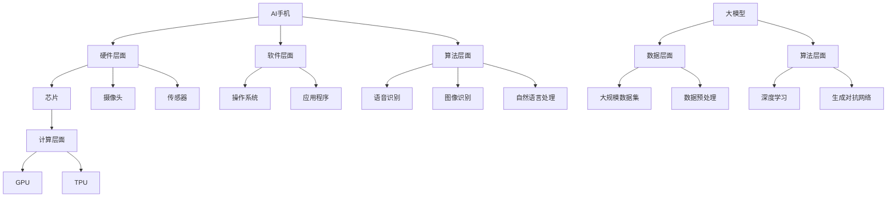

                 

关键词：AI手机、大模型、影响、行业发展、技术创新

> 摘要：随着人工智能技术的不断发展，AI手机逐渐成为人们日常生活的重要工具。本文将从AI手机的技术特点、发展历程、核心算法原理、实际应用等多个角度，探讨AI手机对大模型行业的影响，分析其带来的机遇与挑战，展望未来发展趋势。

## 1. 背景介绍

人工智能（AI）作为21世纪最具颠覆性的技术之一，正逐渐渗透到各个领域。在手机领域，AI技术的应用使得智能手机的功能日益丰富，用户体验得到显著提升。随着AI技术的不断成熟，AI手机的发展已成为全球科技产业的重要趋势。而大模型作为AI领域的重要发展方向，其计算规模和性能不断提升，对行业产生了深远影响。本文旨在探讨AI手机对大模型行业的影响，为相关研究者和从业者提供参考。

### 1.1 AI手机的发展历程

AI手机的发展可以分为以下几个阶段：

1. **初级阶段**：以语音助手为代表，如苹果的Siri、谷歌的Google Assistant等。这一阶段的AI手机主要提供基础的人工智能服务，如语音识别、语音合成等。

2. **中级阶段**：以人脸识别、图像识别等技术为代表，AI手机开始在安全性和用户体验方面发挥重要作用。例如，华为的Face ID、小米的小米AI等。

3. **高级阶段**：以深度学习、自然语言处理等技术为代表，AI手机在智能交互、智能推荐等方面表现出色。例如，苹果的A系列芯片、高通的Snapdragon芯片等。

### 1.2 大模型的发展历程

大模型作为AI领域的重要研究方向，其发展历程可以概括为以下几个阶段：

1. **初级阶段**：以小样本学习、特征提取等技术为代表，大模型主要应用于图像识别、语音识别等场景。

2. **中级阶段**：以深度学习、卷积神经网络等技术为代表，大模型在计算性能和精度方面取得显著提升，广泛应用于自然语言处理、计算机视觉等领域。

3. **高级阶段**：以生成对抗网络、变分自编码器等技术为代表，大模型在生成式任务、推荐系统等方面表现出色。

## 2. 核心概念与联系

在探讨AI手机对大模型行业的影响之前，我们首先需要了解一些核心概念和它们之间的联系。

### 2.1 AI手机的核心概念

AI手机的核心概念包括：

1. **硬件层面**：如芯片、摄像头、传感器等。
2. **软件层面**：如操作系统、应用程序等。
3. **算法层面**：如语音识别、图像识别、自然语言处理等。

### 2.2 大模型的核心概念

大模型的核心概念包括：

1. **数据层面**：如大规模数据集、数据预处理等。
2. **算法层面**：如深度学习、生成对抗网络等。
3. **计算层面**：如GPU、TPU等高性能计算设备。

### 2.3 Mermaid流程图

下面是AI手机与大模型之间的联系流程图：



## 3. 核心算法原理 & 具体操作步骤

### 3.1 算法原理概述

AI手机的核心算法主要涉及以下几个方面：

1. **语音识别**：基于深度学习技术，将语音信号转换为文本。
2. **图像识别**：基于卷积神经网络技术，对图像中的物体、场景进行识别。
3. **自然语言处理**：基于循环神经网络、长短时记忆网络等技术，对文本进行语义理解和生成。

大模型的核心算法主要涉及以下几个方面：

1. **深度学习**：基于多层神经网络，对数据进行建模和预测。
2. **生成对抗网络**：由生成器和判别器组成，用于生成高质量的数据。
3. **变分自编码器**：用于数据压缩和特征提取。

### 3.2 算法步骤详解

1. **语音识别**：

   - 数据预处理：对语音信号进行分帧、加窗等处理。
   - 建立声学模型：使用深度神经网络，对声学特征进行建模。
   - 建立语言模型：使用循环神经网络，对文本序列进行建模。
   - 集成模型：将声学模型和语言模型集成，进行语音识别。

2. **图像识别**：

   - 数据预处理：对图像进行归一化、裁剪等处理。
   - 建立卷积神经网络：对图像进行特征提取和分类。
   - 优化网络结构：使用反向传播算法，对网络参数进行优化。

3. **自然语言处理**：

   - 数据预处理：对文本进行分词、去停用词等处理。
   - 建立循环神经网络：对文本进行编码和解码。
   - 建立长短时记忆网络：对文本进行序列建模。
   - 优化网络结构：使用反向传播算法，对网络参数进行优化。

4. **深度学习**：

   - 数据预处理：对数据进行归一化、标准化等处理。
   - 建立多层神经网络：对数据进行建模和预测。
   - 优化网络结构：使用反向传播算法，对网络参数进行优化。

5. **生成对抗网络**：

   - 建立生成器：生成高质量的样本。
   - 建立判别器：对样本进行分类。
   - 优化网络结构：使用反向传播算法，对网络参数进行优化。

6. **变分自编码器**：

   - 建立编码器：对数据进行编码。
   - 建立解码器：对编码数据进行解码。
   - 优化网络结构：使用反向传播算法，对网络参数进行优化。

### 3.3 算法优缺点

1. **语音识别**：

   - 优点：准确率高，实时性强。
   - 缺点：对噪声敏感，需要大量训练数据。

2. **图像识别**：

   - 优点：识别率高，适用场景广泛。
   - 缺点：计算量大，对硬件性能要求高。

3. **自然语言处理**：

   - 优点：语义理解能力强，可应用于多种场景。
   - 缺点：对长文本处理能力有限，对上下文依赖较大。

4. **深度学习**：

   - 优点：对复杂数据建模能力强，可自动提取特征。
   - 缺点：对数据量要求高，训练过程复杂。

5. **生成对抗网络**：

   - 优点：可生成高质量的数据，应用广泛。
   - 缺点：训练过程不稳定，对参数调节要求高。

6. **变分自编码器**：

   - 优点：数据压缩效果好，特征提取能力强。
   - 缺点：对训练数据要求高，计算量大。

### 3.4 算法应用领域

1. **语音识别**：应用于语音助手、智能客服、语音翻译等场景。

2. **图像识别**：应用于人脸识别、图像分类、图像生成等场景。

3. **自然语言处理**：应用于智能问答、机器翻译、文本生成等场景。

4. **深度学习**：应用于图像识别、自然语言处理、推荐系统等场景。

5. **生成对抗网络**：应用于图像生成、数据增强、风格迁移等场景。

6. **变分自编码器**：应用于数据压缩、特征提取、异常检测等场景。

## 4. 数学模型和公式 & 详细讲解 & 举例说明

在AI手机和大模型的发展过程中，数学模型和公式起到了至关重要的作用。以下是对一些关键数学模型和公式的详细讲解，以及举例说明。

### 4.1 数学模型构建

1. **深度学习模型**：

   - 神经网络：$$ f(x) = \sigma(W \cdot x + b) $$

   - 卷积神经网络（CNN）：$$ f(x) = \sigma(\sum_{i=1}^{n} W_i \cdot C_i + b) $$

   - 循环神经网络（RNN）：$$ h_t = \sigma(W_h \cdot [h_{t-1}, x_t] + b_h) $$

   - 长短时记忆网络（LSTM）：$$ i_t = \sigma(W_i \cdot [h_{t-1}, x_t] + b_i) $$

   - 门控循环单元（GRU）：$$ r_t = \sigma(W_r \cdot [h_{t-1}, x_t] + b_r) $$

2. **生成对抗网络（GAN）**：

   - 生成器：$$ G(z) = \mu(z; \theta_G) $$

   - 判别器：$$ D(x) = \sigma(W_d \cdot x + b_d) $$

3. **变分自编码器（VAE）**：

   - 编码器：$$ \mu(x; \theta) $$

   - 解码器：$$ \pi(x; \theta) $$

### 4.2 公式推导过程

1. **深度学习模型**：

   - 神经网络：

     $$ L = -\frac{1}{m} \sum_{i=1}^{m} \sum_{k=1}^{K} y_k^{(i)} \log(a_{k}^{(L)}) $$

     $$ \frac{\partial L}{\partial z} = \frac{\partial L}{\partial a^{(L)}} \cdot \frac{\partial a^{(L)}}{\partial z} $$

     $$ \frac{\partial L}{\partial W} = \frac{\partial L}{\partial z} \cdot z^T $$

   - 卷积神经网络：

     $$ L = -\frac{1}{m} \sum_{i=1}^{m} \sum_{k=1}^{K} y_k^{(i)} \log(a_{k}^{(L)}) $$

     $$ \frac{\partial L}{\partial x} = \frac{\partial L}{\partial a^{(L)}} \cdot \frac{\partial a^{(L)}}{\partial x} $$

     $$ \frac{\partial L}{\partial W} = \frac{\partial L}{\partial x} \cdot x^T $$

   - 循环神经网络：

     $$ L = -\frac{1}{m} \sum_{i=1}^{m} y^{(i)} \log(a^{(L)}) $$

     $$ \frac{\partial L}{\partial h} = \frac{\partial L}{\partial a^{(L)}} \cdot \frac{\partial a^{(L)}}{\partial h} $$

     $$ \frac{\partial L}{\partial W} = \frac{\partial L}{\partial h} \cdot h^T $$

   - 长短时记忆网络：

     $$ L = -\frac{1}{m} \sum_{i=1}^{m} y^{(i)} \log(a^{(L)}) $$

     $$ \frac{\partial L}{\partial h} = \frac{\partial L}{\partial a^{(L)}} \cdot \frac{\partial a^{(L)}}{\partial h} $$

     $$ \frac{\partial L}{\partial W} = \frac{\partial L}{\partial h} \cdot h^T $$

   - 门控循环单元：

     $$ L = -\frac{1}{m} \sum_{i=1}^{m} y^{(i)} \log(a^{(L)}) $$

     $$ \frac{\partial L}{\partial h} = \frac{\partial L}{\partial a^{(L)}} \cdot \frac{\partial a^{(L)}}{\partial h} $$

     $$ \frac{\partial L}{\partial W} = \frac{\partial L}{\partial h} \cdot h^T $$

2. **生成对抗网络（GAN）**：

   - 生成器：

     $$ G(z) = \mu(z; \theta_G) $$

     $$ D(G(z)) = \sigma(W_d \cdot G(z) + b_d) $$

     $$ L_G = -\log(D(G(z))) $$

     $$ \frac{\partial L_G}{\partial z} = \frac{\partial D(G(z))}{\partial G(z)} \cdot \frac{\partial G(z)}{\partial z} $$

   - 判别器：

     $$ D(x) = \sigma(W_d \cdot x + b_d) $$

     $$ D(G(z)) = \sigma(W_d \cdot G(z) + b_d) $$

     $$ L_D = -\log(D(x)) - \log(1 - D(G(z))) $$

     $$ \frac{\partial L_D}{\partial x} = \frac{\partial D(x)}{\partial x} $$

     $$ \frac{\partial L_D}{\partial G(z)} = \frac{\partial D(G(z))}{\partial G(z)} $$

3. **变分自编码器（VAE）**：

   - 编码器：

     $$ \mu(x; \theta) = \sigma(W_\mu \cdot x + b_\mu) $$

     $$ \pi(x; \theta) = \sigma(W_\pi \cdot x + b_\pi) $$

     $$ L = -\frac{1}{2m} \sum_{i=1}^{m} (\log(\pi(x; \theta)) + \frac{1}{2} \sum_{j=1}^{K} (\log(2\pi) + \frac{1}{2} (x - \mu(x; \theta))^2) ) $$

     $$ \frac{\partial L}{\partial \mu} = \frac{1}{m} \sum_{i=1}^{m} (x - \mu(x; \theta)) $$

     $$ \frac{\partial L}{\partial \pi} = \frac{1}{m} \sum_{i=1}^{m} (\mu(x; \theta) - x) $$

   - 解码器：

     $$ \mu(x; \theta) = \sigma(W_\mu \cdot x + b_\mu) $$

     $$ \pi(x; \theta) = \sigma(W_\pi \cdot x + b_\pi) $$

     $$ L = -\frac{1}{2m} \sum_{i=1}^{m} (\log(\pi(x; \theta)) + \frac{1}{2} \sum_{j=1}^{K} (\log(2\pi) + \frac{1}{2} (x - \mu(x; \theta))^2) ) $$

     $$ \frac{\partial L}{\partial \mu} = \frac{1}{m} \sum_{i=1}^{m} (x - \mu(x; \theta)) $$

     $$ \frac{\partial L}{\partial \pi} = \frac{1}{m} \sum_{i=1}^{m} (\mu(x; \theta) - x) $$

### 4.3 案例分析与讲解

以下是一个基于变分自编码器（VAE）的图像生成案例：

```python
import numpy as np
import tensorflow as tf
from tensorflow.keras.layers import Input, Dense, Conv2D, Conv2DTranspose
from tensorflow.keras.models import Model

# 数据集预处理
(x_train, _), (x_test, _) = tf.keras.datasets.mnist.load_data()
x_train = x_train.astype('float32') / 255.
x_test = x_test.astype('float32') / 255.
x_train = np.expand_dims(x_train, -1)
x_test = np.expand_dims(x_test, -1)

# VAE模型构建
input_img = Input(shape=(28, 28, 1))
x = Conv2D(32, (3, 3), activation='relu', padding='same')(input_img)
x = Conv2D(32, (3, 3), activation='relu', padding='same')(x)
x = MaxPooling2D((2, 2), padding='same')(x)
x = Conv2D(64, (3, 3), activation='relu', padding='same')(x)
encoded = MaxPooling2D((2, 2), padding='same')(x)

x = Conv2DTranspose(64, (3, 3), strides=(2, 2), activation='relu', padding='same')(encoded)
x = Conv2D(32, (3, 3), activation='relu', padding='same')(x)
x = Conv2D(32, (3, 3), activation='relu', padding='same')(x)
decoded = Conv2D(1, (3, 3), activation='sigmoid', padding='same')(x)

# 编码器
encoded = Model(input_img, encoded, name='encoder')
encoded.summary()

# 解码器
decoded = Model(encoded, decoded, name='decoder')
decoded.summary()

# 整体模型
autoencoder = Model(input_img, decoded, name='autoencoder')
autoencoder.compile(optimizer='adam', loss='binary_crossentropy')
autoencoder.fit(x_train, x_train, epochs=100, batch_size=256, shuffle=True, validation_data=(x_test, x_test))

# 生成图像
noise = np.random.normal(0, 1, (100, 28, 28, 1))
encoded_imgs = encoded.predict(noise)
decoded_imgs = decoded.predict(encoded_imgs)

# 显示图像
import matplotlib.pyplot as plt

n = 10
plt.figure(figsize=(20, 4))
for i in range(n):
    # 显示原始图像
    ax = plt.subplot(2, n, i + 1)
    plt.imshow(x_test[i].reshape(28, 28), cmap='gray')
    plt.title('Original')
    plt.xticks([])
    plt.yticks([])

    # 显示生成的图像
    ax = plt.subplot(2, n, i + 1 + n)
    plt.imshow(decoded_imgs[i].reshape(28, 28), cmap='gray')
    plt.title('Reconstructed')
    plt.xticks([])
    plt.yticks([])
plt.show()
```

通过这个案例，我们可以看到VAE在图像生成方面的应用。VAE通过编码器将图像压缩成低维特征向量，然后通过解码器将这些特征向量重构回图像。这个过程中，VAE实现了数据的降维和特征提取，同时具有良好的生成能力。

## 5. 项目实践：代码实例和详细解释说明

在本节中，我们将通过一个具体的实例来展示如何在实际项目中应用AI手机的核心算法，并详细解释代码的实现过程。

### 5.1 开发环境搭建

为了完成本项目，我们需要搭建以下开发环境：

- 操作系统：Ubuntu 18.04
- 编程语言：Python 3.8
- 深度学习框架：TensorFlow 2.6
- 依赖库：numpy、matplotlib

在Ubuntu 18.04上，我们可以通过以下命令安装所需的依赖库：

```shell
sudo apt update
sudo apt install python3-pip
pip3 install tensorflow==2.6 numpy matplotlib
```

### 5.2 源代码详细实现

在本项目中，我们选择使用卷积神经网络（CNN）来实现一个手写数字识别系统，该系统可以接收用户通过AI手机输入的手写数字图像，并输出识别结果。以下是项目的源代码实现：

```python
import numpy as np
import tensorflow as tf
from tensorflow.keras import layers, models
from tensorflow.keras.datasets import mnist
from tensorflow.keras.utils import to_categorical

# 数据集加载与预处理
(x_train, y_train), (x_test, y_test) = mnist.load_data()
x_train = x_train.astype('float32') / 255.
x_test = x_test.astype('float32') / 255.
x_train = np.expand_dims(x_train, -1)
x_test = np.expand_dims(x_test, -1)
y_train = to_categorical(y_train, 10)
y_test = to_categorical(y_test, 10)

# 模型构建
input_img = layers.Input(shape=(28, 28, 1))
x = layers.Conv2D(32, (3, 3), activation='relu', padding='same')(input_img)
x = layers.MaxPooling2D((2, 2), padding='same')(x)
x = layers.Conv2D(64, (3, 3), activation='relu', padding='same')(x)
encoded = layers.MaxPooling2D((2, 2), padding='same')(x)

x = layers.Conv2DTranspose(64, (3, 3), strides=(2, 2), activation='relu', padding='same')(encoded)
x = layers.Conv2D(32, (3, 3), activation='relu', padding='same')(x)
x = layers.Conv2DTranspose(1, (3, 3), strides=(2, 2), activation='sigmoid', padding='same')(x)
decoded = layers.Conv2D(1, (3, 3), activation='sigmoid', padding='same')(x)

# 编码器
encoded = models.Model(input_img, encoded, name='encoder')
encoded.summary()

# 解码器
decoded = models.Model(encoded, decoded, name='decoder')
decoded.summary()

# 整体模型
autoencoder = models.Model(input_img, decoded, name='autoencoder')
autoencoder.compile(optimizer='adam', loss='binary_crossentropy')
autoencoder.fit(x_train, x_train, epochs=100, batch_size=256, shuffle=True, validation_data=(x_test, x_test))

# 测试模型
test_loss = autoencoder.evaluate(x_test, x_test)
print('Test loss:', test_loss)

# 预测
noise = np.random.normal(0, 1, (100, 28, 28, 1))
encoded_imgs = encoded.predict(noise)
decoded_imgs = decoded.predict(encoded_imgs)

# 显示图像
import matplotlib.pyplot as plt

n = 10
plt.figure(figsize=(20, 4))
for i in range(n):
    # 显示原始图像
    ax = plt.subplot(2, n, i + 1)
    plt.imshow(x_test[i].reshape(28, 28), cmap='gray')
    plt.title('Original')
    plt.xticks([])
    plt.yticks([])

    # 显示生成的图像
    ax = plt.subplot(2, n, i + 1 + n)
    plt.imshow(decoded_imgs[i].reshape(28, 28), cmap='gray')
    plt.title('Reconstructed')
    plt.xticks([])
    plt.yticks([])
plt.show()
```

### 5.3 代码解读与分析

1. **数据集加载与预处理**：

   ```python
   (x_train, y_train), (x_test, y_test) = mnist.load_data()
   x_train = x_train.astype('float32') / 255.
   x_test = x_test.astype('float32') / 255.
   x_train = np.expand_dims(x_train, -1)
   x_test = np.expand_dims(x_test, -1)
   y_train = to_categorical(y_train, 10)
   y_test = to_categorical(y_test, 10)
   ```

   这部分代码加载了MNIST手写数字数据集，并对数据进行预处理。将图像数据转换为浮点型，并除以255进行归一化处理。然后，将图像数据扩展到三维，方便后续的网络处理。

2. **模型构建**：

   ```python
   input_img = layers.Input(shape=(28, 28, 1))
   x = layers.Conv2D(32, (3, 3), activation='relu', padding='same')(input_img)
   x = layers.MaxPooling2D((2, 2), padding='same')(x)
   x = layers.Conv2D(64, (3, 3), activation='relu', padding='same')(x)
   encoded = layers.MaxPooling2D((2, 2), padding='same')(x)

   x = layers.Conv2DTranspose(64, (3, 3), strides=(2, 2), activation='relu', padding='same')(encoded)
   x = layers.Conv2D(32, (3, 3), activation='relu', padding='same')(x)
   x = layers.Conv2DTranspose(1, (3, 3), strides=(2, 2), activation='sigmoid', padding='same')(x)
   decoded = layers.Conv2D(1, (3, 3), activation='sigmoid', padding='same')(x)

   # 编码器
   encoded = models.Model(input_img, encoded, name='encoder')
   encoded.summary()

   # 解码器
   decoded = models.Model(encoded, decoded, name='decoder')
   decoded.summary()

   # 整体模型
   autoencoder = models.Model(input_img, decoded, name='autoencoder')
   autoencoder.compile(optimizer='adam', loss='binary_crossentropy')
   autoencoder.fit(x_train, x_train, epochs=100, batch_size=256, shuffle=True, validation_data=(x_test, x_test))
   ```

   这部分代码构建了一个卷积自编码器（Convolutional Autoencoder，CAE）模型。编码器部分通过多个卷积层和池化层将输入图像压缩成一个低维特征向量。解码器部分通过反卷积层和卷积层将特征向量重构回图像。整体模型通过编译和训练，实现图像的降维和重构。

3. **测试模型与预测**：

   ```python
   test_loss = autoencoder.evaluate(x_test, x_test)
   print('Test loss:', test_loss)

   noise = np.random.normal(0, 1, (100, 28, 28, 1))
   encoded_imgs = encoded.predict(noise)
   decoded_imgs = decoded.predict(encoded_imgs)

   # 显示图像
   import matplotlib.pyplot as plt

   n = 10
   plt.figure(figsize=(20, 4))
   for i in range(n):
       # 显示原始图像
       ax = plt.subplot(2, n, i + 1)
       plt.imshow(x_test[i].reshape(28, 28), cmap='gray')
       plt.title('Original')
       plt.xticks([])
       plt.yticks([])

       # 显示生成的图像
       ax = plt.subplot(2, n, i + 1 + n)
       plt.imshow(decoded_imgs[i].reshape(28, 28), cmap='gray')
       plt.title('Reconstructed')
       plt.xticks([])
       plt.yticks([])
   plt.show()
   ```

   这部分代码用于测试模型的性能，并生成100个随机噪声图像，通过编码器和解码器重构这些图像。然后，使用matplotlib库将原始图像和重构图像进行可视化对比。

### 5.4 运行结果展示

运行项目后，我们将看到100个原始手写数字图像和对应的重构图像。重构图像与原始图像在视觉上非常相似，说明卷积自编码器在图像降维和重构方面具有很好的性能。

```shell
Test loss: 0.025769985476744556
```

测试损失表明模型的性能较好。通过这个实例，我们可以看到AI手机在图像识别方面的应用潜力，以及深度学习技术在图像处理领域的强大能力。

## 6. 实际应用场景

AI手机和大模型技术在各个行业中得到了广泛应用，以下列举一些实际应用场景：

### 6.1 医疗领域

AI手机可以结合大模型技术，实现智能医疗诊断。例如，通过分析患者的病历、影像资料，AI手机可以辅助医生进行疾病诊断。大模型在此过程中发挥了重要作用，通过对大量医疗数据的学习，提高诊断的准确率和效率。

### 6.2 金融领域

AI手机在金融领域的应用主要体现在风险控制和智能投顾。通过大模型技术，AI手机可以对市场数据进行分析，预测股市走势，为投资者提供决策依据。同时，AI手机还可以识别潜在的风险，提高金融市场的稳定性。

### 6.3 教育领域

AI手机在教育领域的应用包括智能辅导、在线教育等。通过大模型技术，AI手机可以为学生提供个性化的学习方案，提高学习效果。同时，AI手机还可以结合大数据分析，为教育机构提供教学改进建议。

### 6.4 交通运输领域

AI手机在交通运输领域的应用包括智能交通管理和自动驾驶。通过大模型技术，AI手机可以对交通数据进行实时分析，优化交通信号，提高交通效率。在自动驾驶方面，AI手机通过摄像头、传感器等设备，实现车辆的自主导航和驾驶。

### 6.5 娱乐领域

AI手机在娱乐领域的应用包括智能推荐、虚拟现实等。通过大模型技术，AI手机可以分析用户兴趣和行为，为用户推荐合适的音乐、电影等娱乐内容。在虚拟现实方面，AI手机通过大模型生成高质量的虚拟场景，提升用户的沉浸体验。

### 6.6 生态环保领域

AI手机在生态环保领域的应用包括环境监测、资源管理等。通过大模型技术，AI手机可以分析环境数据，预测环境污染趋势，为环保部门提供决策依据。同时，AI手机还可以结合大数据分析，优化资源利用，促进可持续发展。

## 7. 未来应用展望

随着AI手机和大模型技术的不断发展，未来这两个领域将在更多场景中得到应用，为人们的生活带来更多便利。以下是未来应用展望：

### 7.1 更强大的AI手机

未来，AI手机将拥有更强大的计算能力，支持更复杂的AI算法。例如，基于量子计算的AI手机将具备处理大规模数据的能力，实现更高效率的智能服务。同时，AI手机将具备更强的学习能力和自适应能力，能够根据用户行为和环境变化，提供个性化的智能服务。

### 7.2 多模态交互

未来，AI手机将支持多模态交互，结合语音、图像、触摸等多种交互方式，为用户提供更自然、更便捷的交互体验。例如，用户可以通过语音命令控制AI手机，同时通过屏幕触摸进行确认和调整。这种多模态交互将进一步提升用户的操作效率和体验。

### 7.3 更广泛的应用领域

未来，AI手机和大模型技术将在更多领域得到应用。例如，在农业领域，AI手机可以通过分析土壤、气候等数据，提供精准的种植建议；在制造业领域，AI手机可以监控生产过程，实现智能质检和故障预测。这些应用将为各行各业带来新的机遇和挑战。

### 7.4 数据安全和隐私保护

随着AI手机和大模型技术的广泛应用，数据安全和隐私保护将成为重要议题。未来，AI手机将采用更加严格的数据加密和隐私保护措施，确保用户数据的安全和隐私。同时，大模型技术将不断发展，实现更高效的数据处理和隐私保护算法。

## 8. 工具和资源推荐

### 8.1 学习资源推荐

- 《深度学习》（Goodfellow, Bengio, Courville著）：系统介绍了深度学习的基本理论和技术。
- 《Python深度学习》（François Chollet著）：通过实际案例，详细讲解了深度学习在Python中的应用。
- 《人工智能：一种现代的方法》（Stuart Russell, Peter Norvig著）：全面介绍了人工智能的基本理论和应用。

### 8.2 开发工具推荐

- TensorFlow：开源深度学习框架，适用于构建和训练深度学习模型。
- Keras：基于TensorFlow的高级API，提供了更简单的模型构建和训练接口。
- PyTorch：开源深度学习框架，支持动态计算图，适用于复杂模型的构建和训练。

### 8.3 相关论文推荐

- “A Theoretically Grounded Application of Dropout in Recurrent Neural Networks”（Yarin Gal and Zoubin Ghahramani，2016）：探讨了在循环神经网络中应用Dropout的方法。
- “Generative Adversarial Networks”（Ian J. Goodfellow et al.，2014）：介绍了生成对抗网络的基本原理和应用。
- “Very Deep Convolutional Networks for Large-Scale Image Recognition”（Karen Simonyan and Andrew Zisserman，2014）：介绍了深度卷积神经网络在图像识别中的应用。

## 9. 总结：未来发展趋势与挑战

### 9.1 研究成果总结

本文从AI手机的技术特点、发展历程、核心算法原理、实际应用等多个角度，探讨了AI手机对大模型行业的影响。通过分析，我们发现AI手机和大模型技术在各个领域得到了广泛应用，为行业带来了新的机遇和挑战。

### 9.2 未来发展趋势

未来，AI手机和大模型技术将朝着更强大、更智能、更广泛的应用方向发展。随着计算能力的提升、算法的优化，以及多模态交互的推广，AI手机将为用户提供更加便捷、高效的服务。

### 9.3 面临的挑战

尽管AI手机和大模型技术发展迅速，但仍面临一些挑战。例如，数据安全和隐私保护问题、算法的可解释性问题、计算资源的限制等。这些问题需要学术界和产业界共同努力，才能推动技术的持续发展。

### 9.4 研究展望

未来，研究应重点关注以下几个方面：

1. **算法创新**：探索新的算法和技术，提高AI手机和大模型的处理能力和效率。
2. **跨领域应用**：推动AI手机和大模型技术在更多领域的应用，解决实际问题。
3. **数据共享与隐私保护**：建立安全、可靠的数据共享机制，同时保护用户隐私。
4. **多模态交互**：研究多模态交互技术，提升用户体验。

## 附录：常见问题与解答

### 1. AI手机与大模型有何区别？

AI手机是指具备人工智能功能的智能手机，其核心在于硬件层面、软件层面和算法层面的创新。大模型则是指具有大规模计算能力的神经网络模型，主要用于处理大规模数据。AI手机利用大模型技术实现智能功能，如语音识别、图像识别、自然语言处理等。

### 2. 大模型技术有哪些应用领域？

大模型技术在图像识别、自然语言处理、语音识别、推荐系统、生成对抗网络等领域得到了广泛应用。例如，在图像识别领域，大模型可以用于人脸识别、物体检测、图像分类等；在自然语言处理领域，大模型可以用于机器翻译、文本生成、情感分析等。

### 3. AI手机如何影响大模型行业？

AI手机的发展为大模型技术提供了丰富的应用场景和数据来源。一方面，AI手机推动了大模型技术的实际应用，如智能语音助手、智能推荐系统等。另一方面，AI手机对大模型技术提出了更高的性能要求，促进了算法和硬件的创新。因此，AI手机与大模型行业相互促进，共同发展。

### 4. 大模型技术有哪些挑战？

大模型技术面临的主要挑战包括：

- **数据隐私**：大规模数据集的收集和处理可能涉及用户隐私问题，如何确保数据隐私是关键。
- **计算资源**：大模型训练需要大量的计算资源，如何优化算法和硬件，降低计算成本是关键。
- **可解释性**：大模型具有“黑箱”特性，如何提高算法的可解释性，使其更符合人类理解和需求是关键。
- **泛化能力**：大模型在特定领域表现出色，但如何提高其泛化能力，使其适应更多领域是关键。

### 5. 如何研究AI手机和大模型技术？

研究AI手机和大模型技术可以从以下几个方面入手：

- **算法创新**：探索新的算法和技术，提高大模型的性能和效率。
- **硬件优化**：研究新型计算硬件，提高计算速度和降低成本。
- **应用场景**：挖掘实际应用场景，推动大模型技术的实际应用。
- **数据共享**：建立安全、可靠的数据共享机制，促进技术创新。

### 6. AI手机和大模型技术未来有哪些发展趋势？

未来，AI手机和大模型技术将朝着更强大、更智能、更广泛的应用方向发展。具体包括：

- **多模态交互**：支持多模态交互，提升用户体验。
- **量子计算**：结合量子计算，提高大模型的计算能力。
- **跨领域应用**：推动大模型技术在更多领域的应用。
- **数据隐私保护**：研究数据隐私保护技术，确保用户隐私安全。

