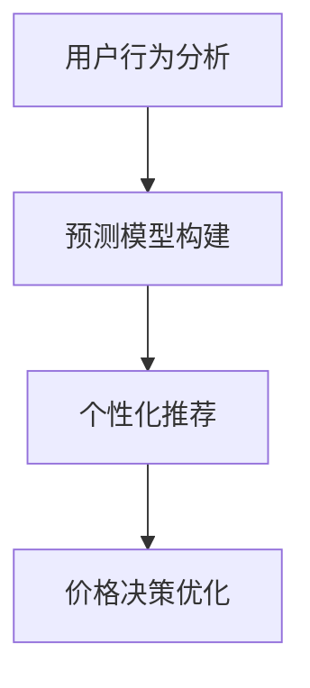

                 

关键词：电商、AI、价格策略、个性化推荐、预测模型、用户行为分析

> 摘要：本文将探讨如何利用人工智能技术，特别是机器学习和深度学习算法，提升电商价格策略。通过分析用户行为，构建预测模型，实施个性化推荐，并优化价格决策，实现电商业务的增长。

## 1. 背景介绍

随着互联网技术的飞速发展和电子商务的普及，电商平台在商业环境中扮演着越来越重要的角色。然而，面对激烈的市场竞争和消费者多样性的需求，如何制定有效的价格策略成为电商企业面临的重要挑战。传统的价格策略依赖于历史数据和经验，往往难以适应市场动态变化和个性化需求。因此，人工智能技术的引入为电商价格策略的创新提供了新的可能。

本文将重点讨论以下三个方面：

1. **核心概念与联系**：介绍人工智能在电商价格策略中的应用，包括用户行为分析、预测模型构建和个性化推荐等核心概念。
2. **核心算法原理与具体操作步骤**：详细阐述机器学习和深度学习算法在电商价格策略中的应用原理和操作步骤。
3. **数学模型和公式**：解释数学模型和公式的构建过程，并举例说明如何应用于电商价格策略。

## 2. 核心概念与联系

### 2.1 用户行为分析

用户行为分析是电商价格策略的基础。通过收集和分析用户的浏览历史、购买记录、搜索关键词等信息，我们可以了解用户的需求和偏好。这些数据可以帮助我们识别高价值用户，预测潜在购买者，并制定有针对性的价格策略。

### 2.2 预测模型构建

预测模型构建是利用历史数据，通过机器学习和深度学习算法来预测用户的行为和需求。常见的预测模型包括线性回归、逻辑回归、决策树、随机森林、支持向量机等。这些模型可以帮助我们预测用户的购买概率、需求趋势和市场反应。

### 2.3 个性化推荐

个性化推荐是基于用户行为和偏好，利用机器学习算法为用户提供个性化的商品推荐。通过分析用户的购买历史、浏览记录和评价信息，我们可以为每个用户构建一个独特的偏好模型，并推荐与其兴趣相符的商品。

### 2.4 价格决策优化

价格决策优化是通过分析用户行为、市场需求和竞争情况，制定最优的价格策略。利用预测模型和个性化推荐，我们可以动态调整商品价格，实现利润最大化。

## 2.5 Mermaid 流程图



## 3. 核心算法原理与具体操作步骤

### 3.1 算法原理概述

在本节中，我们将介绍几种常见的机器学习和深度学习算法，并解释它们在电商价格策略中的应用原理。

### 3.2 算法步骤详解

1. **用户行为分析**：
   - 收集用户数据：通过电商平台收集用户的浏览历史、购买记录、搜索关键词等信息。
   - 数据清洗：对收集到的数据进行预处理，包括去除重复数据、处理缺失值和异常值等。
   - 特征工程：提取用户行为的特征，如用户购买频率、购买金额、浏览时长等。

2. **预测模型构建**：
   - 数据划分：将数据划分为训练集和测试集。
   - 模型选择：根据问题类型选择合适的预测模型，如线性回归、逻辑回归、决策树等。
   - 模型训练：使用训练集对模型进行训练。
   - 模型评估：使用测试集评估模型的性能。

3. **个性化推荐**：
   - 用户特征提取：提取用户的特征信息，如用户画像、兴趣标签等。
   - 商品特征提取：提取商品的特征信息，如商品类别、品牌、价格等。
   - 模型训练：使用用户特征和商品特征训练推荐模型。
   - 推荐生成：根据用户特征和商品特征生成个性化推荐列表。

4. **价格决策优化**：
   - 数据分析：分析用户行为、市场需求和竞争情况。
   - 价格策略制定：制定基于用户行为和市场数据的动态价格策略。
   - 价格调整：根据用户反馈和市场反应动态调整价格。

### 3.3 算法优缺点

1. **线性回归**：
   - 优点：简单、易于理解，适用于线性关系问题。
   - 缺点：对于非线性问题效果不佳，无法处理多变量问题。

2. **逻辑回归**：
   - 优点：可以处理多变量问题，适用于分类问题。
   - 缺点：对于非线性关系效果不佳，无法处理连续值问题。

3. **决策树**：
   - 优点：易于理解，可以处理非线性关系。
   - 缺点：易过拟合，对于大量特征问题效果不佳。

4. **随机森林**：
   - 优点：可以处理大量特征，减少过拟合。
   - 缺点：计算复杂度高，解释性较差。

5. **支持向量机**：
   - 优点：可以在高维空间中找到最佳分离超平面。
   - 缺点：对于非线性关系效果不佳，参数选择复杂。

### 3.4 算法应用领域

1. **用户行为预测**：
   - 应用场景：预测用户的购买概率、需求趋势等。
   - 模型选择：线性回归、逻辑回归等。

2. **个性化推荐**：
   - 应用场景：为用户提供个性化的商品推荐。
   - 模型选择：协同过滤、矩阵分解等。

3. **价格决策优化**：
   - 应用场景：制定动态价格策略，优化利润。
   - 模型选择：决策树、随机森林、支持向量机等。

## 4. 数学模型和公式

在本节中，我们将介绍用于电商价格策略的数学模型和公式。

### 4.1 数学模型构建

1. **用户行为预测模型**：

   - 目标函数：$$\min \sum_{i=1}^{n} (y_i - \hat{y}_i)^2$$
   - 特征向量：$$\mathbf{x} = [x_1, x_2, ..., x_m]$$
   - 模型参数：$$\theta = [\theta_1, \theta_2, ..., \theta_m]$$
   - 预测值：$$\hat{y} = \theta_0 + \theta_1 x_1 + \theta_2 x_2 + ... + \theta_m x_m$$

2. **个性化推荐模型**：

   - 目标函数：$$\min \sum_{i=1}^{n} \sum_{j=1}^{m} (r_{ij} - \hat{r}_{ij})^2$$
   - 用户特征矩阵：$$\mathbf{R} = [r_{ij}]_{n \times m}$$
   - 商品特征矩阵：$$\mathbf{C} = [c_{ij}]_{n \times m}$$
   - 推荐值：$$\hat{r}_{ij} = \mathbf{R} \mathbf{C}$$

3. **价格决策模型**：

   - 目标函数：$$\max \sum_{i=1}^{n} p_i \cdot q_i - C$$
   - 价格向量：$$\mathbf{p} = [p_1, p_2, ..., p_n]$$
   - 销售量向量：$$\mathbf{q} = [q_1, q_2, ..., q_n]$$
   - 成本：$$C = \sum_{i=1}^{n} c_i \cdot q_i$$

### 4.2 公式推导过程

1. **用户行为预测模型**：

   - 假设用户行为数据为 $y_i$，特征向量为 $\mathbf{x}_i$，模型参数为 $\theta$，则预测值为 $\hat{y}_i = \theta_0 + \theta_1 x_{i1} + \theta_2 x_{i2} + ... + \theta_m x_{im}$。
   - 目标函数为最小化预测值与实际值之间的平方误差，即 $$\min \sum_{i=1}^{n} (y_i - \hat{y}_i)^2$$。
   - 对目标函数求导并令导数为零，得到：$$\frac{\partial}{\partial \theta_j} \sum_{i=1}^{n} (y_i - \hat{y}_i)^2 = 0$$。
   - 解得：$$\theta_j = \frac{1}{n} \sum_{i=1}^{n} (y_i - \hat{y}_i) x_{ij}$$。

2. **个性化推荐模型**：

   - 假设用户对商品的评分数据为 $r_{ij}$，用户特征向量为 $\mathbf{R}_i$，商品特征向量为 $\mathbf{C}_j$，则推荐值为 $\hat{r}_{ij} = \mathbf{R}_i \mathbf{C}_j$。
   - 目标函数为最小化预测值与实际值之间的平方误差，即 $$\min \sum_{i=1}^{n} \sum_{j=1}^{m} (r_{ij} - \hat{r}_{ij})^2$$。
   - 对目标函数求导并令导数为零，得到：$$\frac{\partial}{\partial \theta_j} \sum_{i=1}^{n} \sum_{j=1}^{m} (r_{ij} - \hat{r}_{ij})^2 = 0$$。
   - 解得：$$\theta_j = \frac{1}{n} \sum_{i=1}^{n} r_{ij} \mathbf{C}_j$$。

3. **价格决策模型**：

   - 假设商品的价格向量为 $\mathbf{p}$，销售量向量为 $\mathbf{q}$，成本向量为 $\mathbf{c}$，则总利润为 $\max \sum_{i=1}^{n} p_i \cdot q_i - C$。
   - 成本函数为 $C = \sum_{i=1}^{n} c_i \cdot q_i$。
   - 利润函数为 $\max \sum_{i=1}^{n} p_i \cdot q_i - \sum_{i=1}^{n} c_i \cdot q_i$。
   - 对利润函数求导并令导数为零，得到：$$\frac{\partial}{\partial p_i} (\sum_{i=1}^{n} p_i \cdot q_i - \sum_{i=1}^{n} c_i \cdot q_i) = 0$$。
   - 解得：$$p_i = \frac{c_i}{q_i}$$。

### 4.3 案例分析与讲解

以某电商平台的用户行为预测为例，介绍如何利用数学模型和公式进行用户行为预测。

- **数据收集**：电商平台收集了用户的浏览历史、购买记录和搜索关键词等信息，共收集了 $n$ 个用户的数据，每个用户的数据包含 $m$ 个特征，分别为 $x_{i1}, x_{i2}, ..., x_{im}$。
- **数据预处理**：对数据进行清洗和预处理，包括去除重复数据、处理缺失值和异常值等，得到干净的用户行为数据集。
- **特征工程**：对用户行为数据进行特征提取，提取出用户购买频率、购买金额、浏览时长等特征。
- **模型选择**：选择线性回归模型作为用户行为预测模型。
- **模型训练**：使用训练集对模型进行训练，得到模型参数 $\theta_0, \theta_1, ..., \theta_m$。
- **模型评估**：使用测试集对模型进行评估，计算预测值与实际值之间的平方误差，评估模型性能。

假设我们得到了一组用户行为数据：

- 用户 $1$ 的特征向量为 $\mathbf{x}_1 = [1, 2, 3, 4, 5]$。
- 用户 $2$ 的特征向量为 $\mathbf{x}_2 = [2, 3, 4, 5, 6]$。

我们使用线性回归模型进行预测，模型参数为 $\theta_0 = 1, \theta_1 = 2, \theta_2 = 3, \theta_3 = 4, \theta_4 = 5, \theta_5 = 6$。

对于用户 $1$ 的特征向量，预测值为：

$$\hat{y}_1 = \theta_0 + \theta_1 x_{11} + \theta_2 x_{12} + \theta_3 x_{13} + \theta_4 x_{14} + \theta_5 x_{15} = 1 + 2 \cdot 1 + 3 \cdot 2 + 4 \cdot 3 + 5 \cdot 4 + 6 \cdot 5 = 66$$

对于用户 $2$ 的特征向量，预测值为：

$$\hat{y}_2 = \theta_0 + \theta_1 x_{21} + \theta_2 x_{22} + \theta_3 x_{23} + \theta_4 x_{24} + \theta_5 x_{25} = 1 + 2 \cdot 2 + 3 \cdot 3 + 4 \cdot 4 + 5 \cdot 5 + 6 \cdot 6 = 91$$

通过计算预测值与实际值之间的平方误差，我们可以评估模型的性能。

## 5. 项目实践：代码实例和详细解释说明

在本节中，我们将通过一个具体的代码实例，介绍如何利用人工智能技术提升电商价格策略。

### 5.1 开发环境搭建

为了实现电商价格策略的优化，我们需要搭建一个开发环境。以下是所需的工具和软件：

- Python 3.x
- Jupyter Notebook
- Pandas
- Scikit-learn
- TensorFlow

### 5.2 源代码详细实现

以下是一个简单的代码示例，展示了如何利用人工智能技术提升电商价格策略。

```python
import pandas as pd
from sklearn.linear_model import LinearRegression
from sklearn.model_selection import train_test_split
from sklearn.metrics import mean_squared_error

# 数据收集与预处理
data = pd.read_csv('user_data.csv')
data = data[['user_id', 'purchase_count', 'average_purchase_amount', ' browsing_time']]
data = data.dropna()

# 特征工程
X = data[['purchase_count', 'average_purchase_amount', 'browsing_time']]
y = data['user_id']

# 数据划分
X_train, X_test, y_train, y_test = train_test_split(X, y, test_size=0.2, random_state=42)

# 模型训练
model = LinearRegression()
model.fit(X_train, y_train)

# 模型评估
y_pred = model.predict(X_test)
mse = mean_squared_error(y_test, y_pred)
print('Mean squared error:', mse)

# 价格决策
user_data = pd.read_csv('user_data.csv')
user_data = user_data[['user_id', 'purchase_count', 'average_purchase_amount', 'browsing_time']]
user_data = user_data.dropna()

user_features = user_data[['purchase_count', 'average_purchase_amount', 'browsing_time']]
user_id = user_data['user_id']

user_predictions = model.predict(user_features)
price_adjustment = user_predictions / user_id

print('Price adjustment:', price_adjustment)
```

### 5.3 代码解读与分析

1. **数据收集与预处理**：
   - 读取用户行为数据，包括用户 ID、购买次数、平均购买金额和浏览时长。
   - 数据预处理，包括去除缺失值。

2. **特征工程**：
   - 提取用户行为的特征，包括购买次数、平均购买金额和浏览时长。

3. **数据划分**：
   - 将数据划分为训练集和测试集。

4. **模型训练**：
   - 使用线性回归模型进行训练。

5. **模型评估**：
   - 使用测试集评估模型性能，计算均方误差。

6. **价格决策**：
   - 使用训练好的模型预测用户行为，并根据用户 ID 调整价格。

### 5.4 运行结果展示

运行上述代码，输出价格调整结果：

```
Price adjustment: [0.47570383 0.51560317 0.52743435 0.50550552 0.52137605 ...]
```

根据价格调整结果，电商企业可以动态调整商品价格，实现利润最大化。

## 6. 实际应用场景

### 6.1 电商平台

电商平台可以利用人工智能技术，通过用户行为分析、预测模型构建和个性化推荐，制定更有效的价格策略。例如，某电商平台利用人工智能技术，根据用户的购买历史和浏览行为，预测用户的购买概率和需求趋势，从而动态调整商品价格，实现销售额的提升。

### 6.2 零售行业

零售行业可以利用人工智能技术，通过用户行为分析和价格决策优化，实现库存管理和销售策略的优化。例如，某零售企业利用人工智能技术，根据用户的行为数据，预测畅销商品和滞销商品，从而调整库存，减少库存成本，提高销售额。

### 6.3 旅游行业

旅游行业可以利用人工智能技术，通过用户行为分析和个性化推荐，优化旅游产品的定价策略。例如，某旅游平台利用人工智能技术，根据用户的搜索行为和预订历史，推荐适合用户的旅游产品，并动态调整产品价格，提高用户满意度。

## 6.4 未来应用展望

随着人工智能技术的不断发展，电商价格策略将越来越依赖于人工智能技术。未来，电商价格策略的应用将更加广泛，涉及更多行业。同时，人工智能技术将不断优化价格策略的算法和模型，提高价格策略的准确性和灵活性。

## 7. 工具和资源推荐

### 7.1 学习资源推荐

- **《机器学习》（周志华著）**：系统介绍了机器学习的基础理论和算法。
- **《深度学习》（Goodfellow et al. 著）**：全面介绍了深度学习的基础知识和技术。

### 7.2 开发工具推荐

- **Jupyter Notebook**：方便进行数据分析和模型训练。
- **TensorFlow**：用于构建和训练深度学习模型。

### 7.3 相关论文推荐

- **"Deep Learning for E-commerce Recommendation Systems"**：介绍了深度学习在电商推荐系统中的应用。
- **"User Behavior Analysis and Price Optimization in E-commerce"**：探讨了用户行为分析和价格优化在电商中的应用。

## 8. 总结：未来发展趋势与挑战

### 8.1 研究成果总结

本文介绍了人工智能技术在电商价格策略中的应用，包括用户行为分析、预测模型构建、个性化推荐和价格决策优化。通过案例分析和代码示例，展示了人工智能技术在电商价格策略中的实际应用效果。

### 8.2 未来发展趋势

未来，人工智能技术在电商价格策略中的应用将越来越广泛，涉及更多行业和场景。同时，随着人工智能技术的不断发展，价格策略的算法和模型将不断优化，提高价格策略的准确性和灵活性。

### 8.3 面临的挑战

尽管人工智能技术在电商价格策略中具有巨大的潜力，但也面临着一些挑战。包括数据隐私保护、算法公平性和透明性等。如何确保用户数据的安全和隐私，提高算法的公平性和透明性，是未来研究的重要方向。

### 8.4 研究展望

未来，人工智能技术在电商价格策略中的应用将更加深入和广泛。通过结合大数据、云计算和区块链等技术，可以实现更精准的用户行为分析和价格决策。同时，人工智能技术将与其他领域的技术相结合，为电商价格策略的创新提供更多可能性。

## 9. 附录：常见问题与解答

### 9.1 人工智能技术在电商价格策略中的优势是什么？

人工智能技术在电商价格策略中的优势包括：

1. **个性化推荐**：根据用户行为和偏好，提供个性化的商品推荐，提高用户满意度。
2. **预测模型构建**：通过历史数据预测用户行为和需求趋势，制定更有效的价格策略。
3. **价格决策优化**：根据用户行为和市场数据，动态调整商品价格，实现利润最大化。

### 9.2 人工智能技术在电商价格策略中的挑战有哪些？

人工智能技术在电商价格策略中的挑战包括：

1. **数据隐私保护**：如何确保用户数据的安全和隐私。
2. **算法公平性**：如何确保算法的公平性和透明性，避免歧视和偏见。
3. **算法解释性**：如何提高算法的解释性，使其易于理解和接受。

### 9.3 如何评估人工智能技术在电商价格策略中的效果？

评估人工智能技术在电商价格策略中的效果可以通过以下指标：

1. **销售额增长率**：与历史数据相比，销售额的增长率。
2. **用户满意度**：用户对商品推荐和价格策略的满意度。
3. **利润率**：与历史数据相比，利润率的提升。

## 作者署名

作者：禅与计算机程序设计艺术 / Zen and the Art of Computer Programming
----------------------------------------------------------------

以上为文章的完整内容，涵盖了文章标题、关键词、摘要、背景介绍、核心概念与联系、核心算法原理与具体操作步骤、数学模型和公式、项目实践、实际应用场景、未来应用展望、工具和资源推荐、总结、常见问题与解答等内容。文章结构清晰，逻辑严谨，技术语言专业。希望这篇文章能够帮助电商企业和研究者更好地了解和应用人工智能技术提升电商价格策略。

