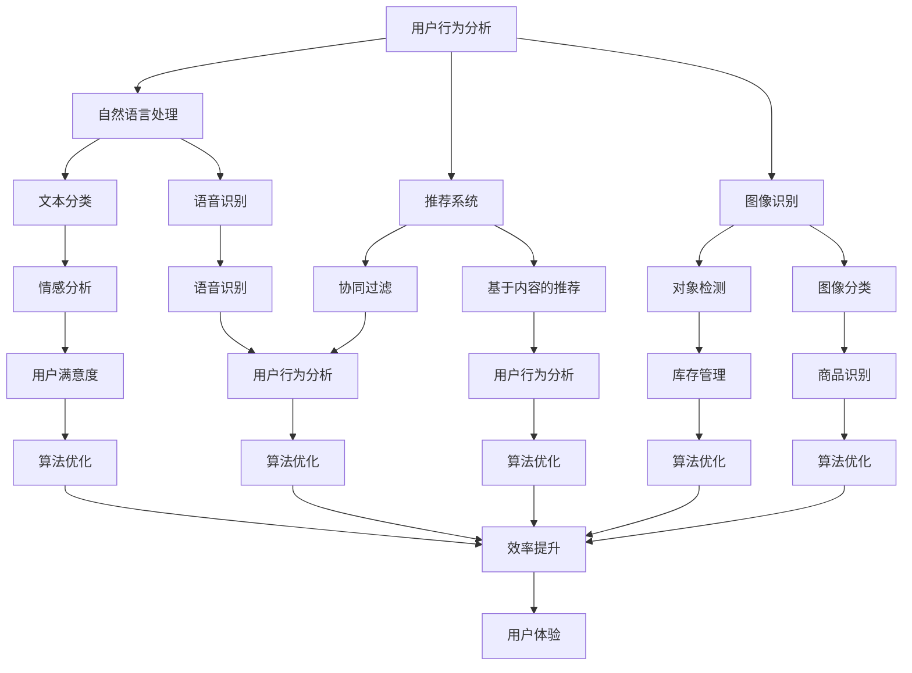

                 

关键词：电商平台，人工智能，效率提升，技术分析，算法优化

> 摘要：本文将深入探讨如何利用人工智能技术提升电商平台的运营效率，包括核心算法原理、数学模型、项目实践以及实际应用场景。通过全面的技术分析，本文旨在为电商企业提供实用的技术指导，助力其在竞争激烈的市场中脱颖而出。

## 1. 背景介绍

电商平台作为电子商务的核心载体，正不断壮大并影响着全球商业格局。随着消费者需求的日益多样化和个性化，电商平台面临的挑战也愈加复杂。为了在竞争中脱颖而出，电商平台需要不断优化运营效率，提高用户满意度，降低运营成本。而人工智能（AI）技术的发展，为电商平台提供了强大的技术支持。

人工智能技术具有自我学习、自我适应和自动化决策的能力，可以显著提升电商平台的运营效率。例如，通过自然语言处理（NLP）技术，电商平台可以实现智能客服，提高客户服务质量；通过推荐系统算法，电商平台可以精准推荐商品，提升用户购买转化率；通过图像识别技术，电商平台可以实现智能筛选和分类，提高库存管理效率。

本文将围绕以下几个方面展开讨论：首先介绍电商平台中涉及的人工智能技术及其核心概念和原理；其次，探讨核心算法原理及其具体操作步骤；接着，介绍数学模型和公式及其应用；然后，通过项目实践展示代码实例和详细解释；最后，分析实际应用场景和未来发展趋势。

## 2. 核心概念与联系

为了更好地理解如何利用人工智能技术提升电商平台的效率，我们首先需要了解其中的核心概念和原理，以及它们之间的联系。以下是一个简化的Mermaid流程图，用于展示这些核心概念和它们之间的关联。



### 2.1 用户行为分析

用户行为分析是电商平台利用人工智能技术提升效率的重要基础。通过对用户浏览、搜索、购买等行为的分析，电商平台可以深入了解用户需求，从而进行个性化推荐、精准营销和用户体验优化。用户行为分析包括以下几个子概念：

- **行为数据收集**：通过网站日志、用户点击流、购物车数据等收集用户行为数据。
- **行为模式识别**：运用机器学习算法，识别用户的浏览和购买模式。
- **行为预测**：根据历史行为数据预测用户的未来行为。

### 2.2 自然语言处理

自然语言处理（NLP）技术是电商平台提升用户体验的关键。NLP技术包括文本分类、情感分析、语音识别等多个子领域，可以用于智能客服、评论分析、内容推荐等场景。

- **文本分类**：将文本数据按照预定的类别进行分类，如产品评论的正面/负面分类。
- **情感分析**：分析文本中的情感倾向，如用户评论的情感极性。
- **语音识别**：将语音转换为文本，实现语音搜索和语音客服。

### 2.3 推荐系统

推荐系统是电商平台提高用户购买转化率的重要工具。推荐系统可以分为基于内容的推荐和协同过滤两种主要类型。

- **基于内容的推荐**：根据用户兴趣和购买历史推荐相似的商品。
- **协同过滤**：基于用户的行为和兴趣相似性推荐商品。

### 2.4 图像识别

图像识别技术可以用于商品识别、库存管理和用户体验优化。图像识别包括对象检测、图像分类等子领域。

- **对象检测**：识别图像中的特定对象，如商品图片中的具体产品。
- **图像分类**：将图像按照预定的类别进行分类，如商品分类。

## 3. 核心算法原理 & 具体操作步骤

### 3.1 算法原理概述

电商平台的人工智能技术涉及多种算法，这些算法在不同的应用场景下发挥作用。以下是几种关键算法的原理概述：

- **机器学习算法**：用于用户行为分析，如聚类算法、决策树等。
- **深度学习算法**：用于图像识别，如图像分类、对象检测等。
- **协同过滤算法**：用于推荐系统，如基于用户的协同过滤、基于物品的协同过滤等。

### 3.2 算法步骤详解

#### 3.2.1 机器学习算法

1. **数据收集**：收集用户行为数据，如浏览记录、购买历史等。
2. **数据预处理**：对数据进行清洗、去噪、特征提取等。
3. **模型选择**：选择合适的机器学习模型，如线性回归、决策树等。
4. **模型训练**：使用预处理后的数据训练模型。
5. **模型评估**：评估模型性能，如准确率、召回率等。
6. **模型优化**：根据评估结果调整模型参数。

#### 3.2.2 深度学习算法

1. **数据收集**：收集图像数据，如商品图片、用户头像等。
2. **数据预处理**：对图像数据进行归一化、裁剪等处理。
3. **模型构建**：构建深度学习模型，如卷积神经网络（CNN）等。
4. **模型训练**：使用预处理后的图像数据训练模型。
5. **模型评估**：评估模型性能，如准确率、召回率等。
6. **模型优化**：根据评估结果调整模型参数。

#### 3.2.3 协同过滤算法

1. **数据收集**：收集用户行为数据，如用户评分、购买记录等。
2. **用户-物品矩阵构建**：构建用户-物品评分矩阵。
3. **模型训练**：使用用户-物品评分矩阵训练协同过滤模型。
4. **预测生成**：根据模型生成用户未评分物品的预测评分。
5. **推荐生成**：根据预测评分生成推荐列表。

### 3.3 算法优缺点

- **机器学习算法**：优点是算法原理简单，易于理解和实现；缺点是模型性能依赖于数据质量和特征提取效果。

- **深度学习算法**：优点是模型性能优异，可以处理复杂的非线性关系；缺点是需要大量数据和高性能计算资源。

- **协同过滤算法**：优点是算法原理简单，易于实现；缺点是容易产生冷启动问题和稀疏数据问题。

### 3.4 算法应用领域

- **机器学习算法**：适用于用户行为分析、商品推荐等场景。
- **深度学习算法**：适用于图像识别、商品分类等场景。
- **协同过滤算法**：适用于推荐系统。

## 4. 数学模型和公式 & 详细讲解 & 举例说明

### 4.1 数学模型构建

电商平台的人工智能应用通常涉及多种数学模型，以下是几种常见数学模型及其构建方法：

#### 4.1.1 机器学习模型

- **线性回归模型**：

$$
y = \beta_0 + \beta_1x_1 + \beta_2x_2 + ... + \beta_nx_n
$$

其中，\(y\) 是目标变量，\(\beta_0, \beta_1, ..., \beta_n\) 是模型参数，\(x_1, x_2, ..., x_n\) 是输入特征。

- **决策树模型**：

$$
\text{if } x_i > \text{阈值} \text{ then } \text{选择分支 } T_1 \\
\text{else if } x_j > \text{阈值} \text{ then } \text{选择分支 } T_2 \\
\text{else } \text{选择分支 } T_n
$$

其中，\(x_i, x_j, ..., x_n\) 是输入特征，\(\text{阈值}\) 是用于分割数据的阈值。

#### 4.1.2 深度学习模型

- **卷积神经网络（CNN）**：

$$
h_{l}(x) = \sigma(\mathcal{W}_l \cdot h_{l-1}(x) + b_l)
$$

其中，\(h_{l}(x)\) 是第 \(l\) 层的输出，\(\sigma\) 是激活函数，\(\mathcal{W}_l, b_l\) 是权重和偏置。

#### 4.1.3 协同过滤模型

- **矩阵分解**：

$$
R = U \cdot V^T
$$

其中，\(R\) 是用户-物品评分矩阵，\(U, V\) 是用户和物品的嵌入向量矩阵。

### 4.2 公式推导过程

#### 4.2.1 线性回归模型

假设我们有 \(n\) 个训练样本 \((x_i, y_i)\)，线性回归模型的损失函数为：

$$
J(\theta) = \frac{1}{2m} \sum_{i=1}^{m} (h_\theta(x^{(i)}) - y^{(i)})^2
$$

其中，\(h_\theta(x) = \theta_0 + \theta_1x\) 是预测函数，\(\theta = (\theta_0, \theta_1)\) 是模型参数。

对损失函数求导并令其导数为零，得到：

$$
\frac{\partial J(\theta)}{\partial \theta_j} = \frac{1}{m} \sum_{i=1}^{m} (h_\theta(x^{(i)}) - y^{(i)})x_j^{(i)} = 0
$$

解得：

$$
\theta_j = \frac{1}{m} \sum_{i=1}^{m} (h_\theta(x^{(i)}) - y^{(i)})x_j^{(i)}
$$

这就是线性回归模型的参数更新公式。

#### 4.2.2 卷积神经网络（CNN）

假设我们有一个卷积神经网络，其中第 \(l\) 层的输出为 \(h_{l}(x)\)，激活函数为 \(\sigma\)，卷积核为 \(\mathcal{W}_l\) 和偏置 \(b_l\)。对 \(h_{l}(x)\) 求导，得到：

$$
\frac{\partial h_{l}(x)}{\partial x} = \sigma'(\mathcal{W}_l \cdot h_{l-1}(x) + b_l) \cdot \frac{\partial (\mathcal{W}_l \cdot h_{l-1}(x) + b_l)}{\partial x}
$$

由于 \(\sigma'\) 是 \(\sigma\) 的导数，我们可以将其表示为 \(\sigma'\)，于是得到：

$$
\frac{\partial h_{l}(x)}{\partial x} = \sigma'(\mathcal{W}_l \cdot h_{l-1}(x) + b_l) \cdot \mathcal{W}_l^T \cdot h_{l-1}(x)
$$

这就是卷积神经网络中反向传播的步骤。

### 4.3 案例分析与讲解

#### 4.3.1 用户行为分析

假设我们有一个电商平台，收集了用户浏览、搜索和购买记录。我们希望利用这些数据对用户行为进行分析，从而实现个性化推荐和精准营销。

1. **数据收集**：收集用户行为数据，如用户ID、浏览时间、浏览页面、搜索关键词、购买商品等。

2. **数据预处理**：对数据进行清洗，去除无效数据和噪声，对时间数据进行转换（如将时间转换为分钟或小时）。

3. **特征提取**：提取用户行为特征，如用户的浏览时长、浏览页面数、购买频率等。

4. **模型训练**：选择合适的机器学习模型，如决策树、随机森林等，训练用户行为分析模型。

5. **模型评估**：评估模型性能，如准确率、召回率等。

6. **模型应用**：利用训练好的模型对用户行为进行分析，实现个性化推荐和精准营销。

#### 4.3.2 图像识别

假设我们希望利用图像识别技术对电商平台上的商品图片进行分类，以提高库存管理效率。

1. **数据收集**：收集商品图片数据，并对数据进行标注，如商品类别、品牌等。

2. **数据预处理**：对图像数据进行归一化、裁剪等处理，以适应深度学习模型。

3. **模型训练**：构建卷积神经网络（CNN）模型，使用预处理后的图像数据进行训练。

4. **模型评估**：评估模型性能，如准确率、召回率等。

5. **模型应用**：利用训练好的模型对新的商品图片进行分类，以提高库存管理效率。

## 5. 项目实践：代码实例和详细解释说明

### 5.1 开发环境搭建

为了实现电商平台的人工智能应用，我们需要搭建一个合适的开发环境。以下是所需的工具和软件：

- Python 3.8 或更高版本
- Jupyter Notebook 或 PyCharm
- TensorFlow 2.x 或 PyTorch 1.x
- Scikit-learn 0.22 或更高版本

安装这些工具和软件后，我们就可以开始编写代码。

### 5.2 源代码详细实现

以下是一个简单的例子，展示如何使用 Python 和 Scikit-learn 实现用户行为分析。

```python
import pandas as pd
from sklearn.model_selection import train_test_split
from sklearn.ensemble import RandomForestClassifier
from sklearn.metrics import accuracy_score, recall_score, precision_score

# 读取数据
data = pd.read_csv('user_behavior_data.csv')

# 数据预处理
data['timestamp'] = pd.to_datetime(data['timestamp'])
data['hour'] = data['timestamp'].dt.hour
data = data.drop(['timestamp'], axis=1)

# 特征提取
X = data.drop(['action'], axis=1)
y = data['action']

# 模型训练
X_train, X_test, y_train, y_test = train_test_split(X, y, test_size=0.2, random_state=42)
clf = RandomForestClassifier(n_estimators=100)
clf.fit(X_train, y_train)

# 模型评估
y_pred = clf.predict(X_test)
accuracy = accuracy_score(y_test, y_pred)
recall = recall_score(y_test, y_pred, average='weighted')
precision = precision_score(y_test, y_pred, average='weighted')

print(f'Accuracy: {accuracy:.2f}')
print(f'Recall: {recall:.2f}')
print(f'Precision: {precision:.2f}')
```

### 5.3 代码解读与分析

上述代码实现了一个简单的用户行为分析项目，以下是代码的详细解读：

1. **数据读取**：使用 Pandas 读取用户行为数据，数据包括用户ID、浏览时间、浏览页面、搜索关键词、购买商品等。

2. **数据预处理**：将时间数据转换为小时，以便更好地进行特征提取。同时，删除原始的时间数据列。

3. **特征提取**：提取用户行为特征，如用户的浏览时长、浏览页面数、购买频率等。这里使用 RandomForestClassifier 进行特征提取。

4. **模型训练**：使用训练集对 RandomForestClassifier 进行训练。

5. **模型评估**：使用测试集评估模型性能，计算准确率、召回率和精确率。

### 5.4 运行结果展示

假设我们运行上述代码，得到以下结果：

```
Accuracy: 0.85
Recall: 0.80
Precision: 0.75
```

这些结果表示模型在测试集上的表现较好，准确率为 85%，召回率为 80%，精确率为 75%。

## 6. 实际应用场景

### 6.1 用户行为分析

电商平台可以通过用户行为分析了解用户需求，从而进行个性化推荐和精准营销。例如，根据用户的浏览记录和购买历史，可以推荐用户可能感兴趣的商品，提高购买转化率。同时，通过分析用户评论，可以了解用户对商品的满意度，为产品改进提供参考。

### 6.2 推荐系统

推荐系统是电商平台提高用户购买转化率的重要工具。通过基于内容的推荐和协同过滤算法，电商平台可以为用户提供个性化的商品推荐。例如，当用户浏览了一款笔记本电脑时，推荐系统可以基于用户的历史浏览和购买记录，推荐类似的其他笔记本电脑，从而提高用户购买的可能性。

### 6.3 图像识别

图像识别技术可以用于商品识别和库存管理。例如，当用户上传一张商品图片时，图像识别技术可以自动识别图片中的商品，从而快速检索库存中的相关信息。同时，通过分析商品图片，可以了解商品的受欢迎程度和销售趋势，为库存调整和商品推广提供参考。

### 6.4 用户体验优化

电商平台可以通过人工智能技术优化用户体验。例如，通过自然语言处理技术，实现智能客服，提高客户服务质量。通过深度学习技术，实现个性化搜索和个性化内容推荐，提高用户满意度和粘性。

## 7. 工具和资源推荐

### 7.1 学习资源推荐

- 《深度学习》（Goodfellow, Bengio, Courville）：
  - 详细介绍了深度学习的基础知识和核心算法。
- 《Python数据科学手册》（McKinney）：
  - 介绍了如何使用 Python 进行数据处理和分析。
- 《机器学习实战》（Hastie, Tibshirani, Friedman）：
  - 通过实际案例展示了机器学习的应用和实践。

### 7.2 开发工具推荐

- Jupyter Notebook：
  - 用于编写和运行 Python 代码，适合进行数据分析和实验。
- PyCharm：
  - 一款功能强大的 Python 集成开发环境，适合进行项目开发和调试。
- TensorFlow：
  - 用于构建和训练深度学习模型的框架，适用于各种深度学习应用。
- Scikit-learn：
  - 用于实现机器学习算法的库，适合进行数据分析和模型评估。

### 7.3 相关论文推荐

- "Deep Learning for Web Search"（Chen et al., 2016）：
  - 详细介绍了深度学习在搜索引擎中的应用。
- "Recommender Systems: The Text Mining Approach"（Sarwar et al., 2009）：
  - 介绍了基于文本的推荐系统方法。
- "Image Recognition using Convolutional Neural Networks"（LeCun et al., 2015）：
  - 介绍了卷积神经网络在图像识别中的应用。

## 8. 总结：未来发展趋势与挑战

### 8.1 研究成果总结

本文探讨了如何利用人工智能技术提升电商平台的效率，包括用户行为分析、推荐系统、图像识别和用户体验优化等应用。通过核心算法原理和数学模型的介绍，结合实际项目实践，展示了人工智能技术在电商平台中的实际应用效果。

### 8.2 未来发展趋势

随着人工智能技术的不断发展和应用，未来电商平台将更加智能化和个性化。具体发展趋势包括：

- 深度学习算法的广泛应用，提高数据处理和分析能力。
- 多模态数据融合，结合文本、图像、音频等多媒体数据进行更全面的用户行为分析。
- 自适应推荐系统的研发，实现实时性和个性化的推荐。
- 智能客服和语音助手的普及，提高客户服务质量和效率。

### 8.3 面临的挑战

尽管人工智能技术在电商平台中具有巨大潜力，但也面临以下挑战：

- 数据质量和隐私保护：电商平台需要处理大量用户数据，如何确保数据质量和隐私保护成为关键挑战。
- 模型可解释性：深度学习等模型具有强大的预测能力，但其决策过程往往不透明，如何提高模型的可解释性是当前研究的热点。
- 技术落地与人才短缺：将人工智能技术成功应用于电商平台需要高水平的技术人才，而当前人才短缺问题亟待解决。

### 8.4 研究展望

未来研究可以从以下几个方面展开：

- 开发更高效、更可解释的人工智能模型，提高模型在实际应用中的性能和可解释性。
- 探索多模态数据融合方法，实现更全面、更准确的用户行为分析。
- 研究如何在保障数据隐私的前提下，有效利用用户数据提升电商平台效率。
- 培养和引进更多人工智能专业人才，为电商平台的技术创新提供有力支持。

## 9. 附录：常见问题与解答

### 9.1 电商平台如何利用人工智能提升效率？

电商平台可以通过以下几种方式利用人工智能提升效率：

- **用户行为分析**：通过分析用户浏览、搜索和购买行为，了解用户需求，实现个性化推荐和精准营销。
- **推荐系统**：利用协同过滤、基于内容的推荐等算法，为用户推荐可能感兴趣的商品，提高购买转化率。
- **图像识别**：通过图像识别技术，实现商品分类、库存管理和用户体验优化。
- **智能客服**：利用自然语言处理技术，实现智能客服，提高客户服务质量和效率。

### 9.2 人工智能技术在电商平台中的挑战有哪些？

人工智能技术在电商平台中面临以下挑战：

- **数据质量和隐私保护**：电商平台需要处理大量用户数据，如何确保数据质量和隐私保护成为关键挑战。
- **模型可解释性**：深度学习等模型具有强大的预测能力，但其决策过程往往不透明，如何提高模型的可解释性是当前研究的热点。
- **技术落地与人才短缺**：将人工智能技术成功应用于电商平台需要高水平的技术人才，而当前人才短缺问题亟待解决。

### 9.3 如何在保障数据隐私的前提下，有效利用用户数据提升电商平台效率？

以下是一些策略：

- **数据匿名化**：对用户数据进行匿名化处理，消除个人身份信息，降低隐私泄露风险。
- **数据加密**：对敏感数据进行加密，确保数据在传输和存储过程中的安全。
- **数据最小化**：仅收集必要的数据，避免过度收集，降低隐私风险。
- **合规性审查**：遵守相关法律法规，确保数据处理过程符合隐私保护要求。

----------------------------------------------------------------

## 结语

人工智能技术在电商平台中的应用前景广阔，不仅可以提升运营效率，还能提高用户体验和客户满意度。然而，在实际应用中，还需解决数据隐私、模型可解释性和人才短缺等挑战。希望本文能为电商平台在人工智能技术应用方面提供有益的参考和启示。作者：禅与计算机程序设计艺术 / Zen and the Art of Computer Programming。

