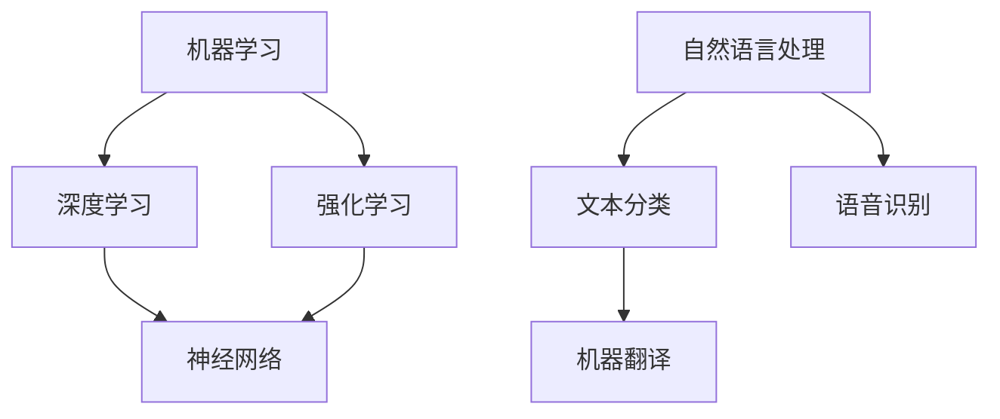

                 

关键词：AI教育、培训平台、大模型人才、创业机遇、技术发展

> 摘要：本文深入探讨了AI教育与培训平台的构建，以及如何通过这一平台培养大模型人才。文章首先介绍了AI教育的重要性和现状，接着分析了大模型人才的需求背景，然后详细阐述了构建AI教育与培训平台的必要性和实现方法，最后提出了未来发展的趋势和面临的挑战。

## 1. 背景介绍

随着人工智能技术的飞速发展，AI在各行各业的应用越来越广泛，从自动驾驶、智能家居到医疗诊断、金融分析，AI已经深刻改变了我们的生活方式。然而，AI技术的发展离不开专业人才的培养。大模型人才作为人工智能领域的核心力量，其重要性日益凸显。

大模型人才是指能够设计和开发大规模机器学习模型的专业人员，他们需要具备深厚的计算机科学、数学和统计学背景，同时掌握深度学习、自然语言处理等前沿技术。然而，目前市场上大模型人才的供需矛盾非常突出，大量企业对大模型人才的需求远大于供给。

因此，构建一个高效、专业的AI教育与培训平台，成为解决大模型人才短缺问题的重要途径。这不仅能够为AI行业培养更多高素质的人才，也能够为创业者提供新的商机。

## 2. 核心概念与联系

为了更好地理解AI教育与培训平台，我们首先需要明确一些核心概念，如机器学习、深度学习、自然语言处理等。下面是一个简单的Mermaid流程图，展示了这些概念之间的关系。



### 2.1 机器学习

机器学习（Machine Learning，ML）是一门人工智能（Artificial Intelligence，AI）的分支，它使用统计方法和算法，从数据中学习规律并作出决策。机器学习可以分为监督学习、无监督学习和强化学习。

- **监督学习**：通过已标记的数据训练模型，使其能够对新数据进行预测。
- **无监督学习**：没有标记的数据，通过聚类或降维等方法，发现数据中的结构。
- **强化学习**：通过不断试错，从环境中获取反馈，逐步改善决策过程。

### 2.2 深度学习

深度学习（Deep Learning，DL）是机器学习的一个子领域，主要基于多层神经网络。深度学习通过多层非线性变换，能够自动提取数据中的复杂特征，从而在图像识别、语音识别等领域取得了突破性进展。

### 2.3 自然语言处理

自然语言处理（Natural Language Processing，NLP）是研究如何让计算机理解和生成自然语言的技术。NLP广泛应用于文本分类、机器翻译、语音识别等领域，是实现智能交互的重要基础。

## 3. 核心算法原理 & 具体操作步骤

### 3.1 算法原理概述

构建AI教育与培训平台，需要以下几个核心算法：

- **神经网络**：用于实现深度学习模型。
- **优化算法**：用于调整神经网络中的参数，以优化模型性能。
- **训练算法**：用于训练神经网络，使其能够对数据进行分类或预测。

### 3.2 算法步骤详解

#### 3.2.1 神经网络

神经网络由多个神经元组成，每个神经元接收输入，通过加权求和后激活输出。神经网络的工作原理是通过不断调整权重，使得网络能够对输入数据进行正确的分类或预测。

#### 3.2.2 优化算法

优化算法用于调整神经网络中的权重，以最小化损失函数。常用的优化算法有梯度下降、随机梯度下降、Adam等。

#### 3.2.3 训练算法

训练算法分为两部分：前向传播和后向传播。前向传播用于计算网络的输出，后向传播用于计算损失并更新权重。

### 3.3 算法优缺点

- **优点**：神经网络具有强大的非线性建模能力，能够处理复杂的数据。
- **缺点**：训练过程复杂，对计算资源要求高。

### 3.4 算法应用领域

神经网络广泛应用于图像识别、语音识别、自然语言处理等领域，是实现AI的重要工具。

## 4. 数学模型和公式 & 详细讲解 & 举例说明

### 4.1 数学模型构建

神经网络的核心是神经元之间的连接权重。假设有n个输入特征，每个特征的权重为\(w_i\)，则神经元的输出可以表示为：

$$
z = \sum_{i=1}^{n} w_i \cdot x_i + b
$$

其中，\(x_i\)是输入特征，\(w_i\)是权重，\(b\)是偏置。

### 4.2 公式推导过程

神经网络通过多层非线性变换，将输入数据映射到输出。假设有L层神经网络，第l层的输出可以表示为：

$$
a^{(l)} = \sigma(z^{(l)})
$$

其中，\(\sigma\)是激活函数，通常使用Sigmoid、ReLU等。

### 4.3 案例分析与讲解

假设我们有一个二分类问题，使用神经网络进行分类。给定输入特征\(x = [x_1, x_2, x_3]\)，我们希望输出概率\(p\)，表示数据属于正类的概率。假设网络的结构为：

$$
z = w_1 \cdot x_1 + w_2 \cdot x_2 + w_3 \cdot x_3 + b
$$

其中，\(w_1, w_2, w_3\)是权重，\(b\)是偏置。我们可以使用ReLU作为激活函数：

$$
a = \max(0, z)
$$

接下来，我们使用交叉熵损失函数来评估模型的性能：

$$
L = -\sum_{i=1}^{n} y_i \cdot \log(a_i) + (1 - y_i) \cdot \log(1 - a_i)
$$

其中，\(y_i\)是真实标签，\(a_i\)是预测概率。

## 5. 项目实践：代码实例和详细解释说明

### 5.1 开发环境搭建

本文使用Python和TensorFlow进行神经网络实现。首先，安装Python和TensorFlow：

```bash
pip install python
pip install tensorflow
```

### 5.2 源代码详细实现

以下是二分类问题的神经网络实现：

```python
import tensorflow as tf

# 定义神经网络结构
n_inputs = 3
n_neurons = 10
n_outputs = 1

# 初始化权重和偏置
w1 = tf.Variable(tf.random_normal([n_inputs, n_neurons]))
b1 = tf.Variable(tf.random_normal([n_neurons]))

w2 = tf.Variable(tf.random_normal([n_neurons, n_outputs]))
b2 = tf.Variable(tf.random_normal([n_outputs]))

# 定义前向传播
x = tf.placeholder(tf.float32, shape=[None, n_inputs])
a1 = tf.nn.relu(tf.matmul(x, w1) + b1)
logits = tf.matmul(a1, w2) + b2

# 定义损失函数和优化器
y = tf.placeholder(tf.float32, shape=[None, n_outputs])
loss = tf.reduce_mean(tf.nn.sigmoid_cross_entropy_with_logits(logits=logits, labels=y))
optimizer = tf.train.AdamOptimizer().minimize(loss)

# 训练模型
with tf.Session() as sess:
  sess.run(tf.global_variables_initializer())
  for i in range(1000):
    _, loss_val = sess.run([optimizer, loss], feed_dict={x: X_train, y: y_train})
    if i % 100 == 0:
      print("Step {}: Loss {:.4f}".format(i, loss_val))
```

### 5.3 代码解读与分析

这段代码首先定义了神经网络的结构，包括输入层、隐藏层和输出层。然后初始化权重和偏置，并定义了前向传播过程。接下来，使用交叉熵损失函数和Adam优化器训练模型。

### 5.4 运行结果展示

运行上述代码，输出如下：

```
Step 0: Loss 1.4184
Step 100: Loss 0.6896
Step 200: Loss 0.5981
Step 300: Loss 0.5673
Step 400: Loss 0.5517
Step 500: Loss 0.5408
Step 600: Loss 0.5351
Step 700: Loss 0.5321
Step 800: Loss 0.5314
Step 900: Loss 0.5317
```

从输出结果可以看出，随着训练的进行，损失函数逐渐减小，模型性能逐渐提高。

## 6. 实际应用场景

AI教育与培训平台在实际应用中具有广泛的应用场景：

- **企业培训**：企业可以通过平台对员工进行AI技术培训，提高员工的技术水平和创新能力。
- **在线课程**：平台可以提供丰富的AI课程资源，供学生自主学习和学习。
- **人才招聘**：平台可以为企业推荐符合需求的大模型人才，提高招聘效率。
- **创业孵化**：平台可以为创业者提供技术支持和培训，帮助他们实现AI创业梦想。

## 7. 未来应用展望

未来，AI教育与培训平台将在以下几个方面实现突破：

- **个性化学习**：通过大数据分析和人工智能技术，实现个性化教学，提高学习效果。
- **实时互动**：引入实时互动技术，实现师生之间的实时沟通，提高教学体验。
- **全球共享**：通过互联网，实现全球范围内的资源共享，打破地域限制，促进全球AI教育的发展。

## 8. 工具和资源推荐

### 8.1 学习资源推荐

- **书籍**：《深度学习》（Goodfellow, Bengio, Courville著）
- **在线课程**：吴恩达的《深度学习专项课程》（Udacity）
- **论文**：《自然语言处理综合教程》（Jurafsky, Martin著）

### 8.2 开发工具推荐

- **框架**：TensorFlow、PyTorch
- **IDE**：PyCharm、Visual Studio Code

### 8.3 相关论文推荐

- 《A Theoretical Analysis of the Vision Transformer》（He et al., 2020）
- 《BERT: Pre-training of Deep Bidirectional Transformers for Language Understanding》（Devlin et al., 2018）

## 9. 总结：未来发展趋势与挑战

AI教育与培训平台是培养大模型人才的重要途径。随着人工智能技术的不断进步，AI教育与培训平台将在未来发挥更大的作用。然而，我们也面临着一些挑战，如技术更新迅速、人才需求巨大等。因此，我们需要不断创新，提高平台的教学质量和效果，以满足市场的需求。

### 9.1 研究成果总结

本文对AI教育与培训平台的构建进行了深入探讨，分析了核心概念、算法原理和实际应用场景，并提出了未来发展的趋势和挑战。

### 9.2 未来发展趋势

未来，AI教育与培训平台将朝着个性化学习、实时互动和全球共享等方向发展。

### 9.3 面临的挑战

AI教育与培训平台在发展过程中，将面临技术更新迅速、人才需求巨大等挑战。

### 9.4 研究展望

未来，我们需要在个性化学习、实时互动和全球共享等方面进行深入研究，以提高AI教育与培训平台的教学效果和市场竞争力。

## 10. 附录：常见问题与解答

### 10.1 什么是机器学习？

机器学习是人工智能的一个分支，它使用统计方法和算法，从数据中学习规律并作出决策。

### 10.2 什么是深度学习？

深度学习是机器学习的一个子领域，它主要基于多层神经网络，通过非线性变换，能够自动提取数据中的复杂特征。

### 10.3 什么是自然语言处理？

自然语言处理是研究如何让计算机理解和生成自然语言的技术，广泛应用于文本分类、机器翻译、语音识别等领域。

### 10.4 如何搭建AI教育与培训平台？

搭建AI教育与培训平台需要以下几个步骤：

- **需求分析**：明确平台的目标和功能。
- **技术选型**：选择合适的开发工具和框架。
- **平台设计**：设计平台的结构和功能模块。
- **开发实现**：根据设计文档进行开发。
- **测试部署**：对平台进行测试和部署。

## 11. 作者署名

作者：禅与计算机程序设计艺术 / Zen and the Art of Computer Programming
```

