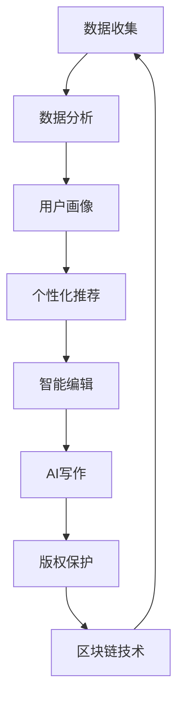

                 

关键词：人工智能，出版业，数字出版，个性化推荐，智能编辑，区块链技术，AI写作，版权保护，大数据分析

> 摘要：随着人工智能技术的飞速发展，出版业正经历着一场深刻的变革。本文将探讨AI技术在出版业中的应用，包括个性化推荐、智能编辑、区块链技术、AI写作以及版权保护等方面，并展望未来发展趋势与挑战。

## 1. 背景介绍

出版业是一个历史悠久且持续发展的行业。然而，随着互联网和数字技术的普及，传统出版业正面临着巨大的挑战。一方面，数字化改变了人们获取信息的方式，电子书、网络出版等形式越来越受到读者的青睐；另一方面，互联网的普及也使得信息传播的速度和范围大幅提升，传统出版业的市场份额逐渐受到挤压。

在这个大背景下，人工智能（AI）技术的崛起为出版业带来了新的机遇。AI技术在数据挖掘、图像识别、自然语言处理等方面具有显著优势，能够为出版业提供更加智能化、个性化的服务。本文将重点关注AI技术在出版业中的应用，探讨其在不同场景中的具体作用。

## 2. 核心概念与联系

为了更好地理解AI技术在出版业中的应用，我们需要首先了解一些核心概念和它们之间的联系。以下是一个使用Mermaid绘制的流程图，展示了这些核心概念及其相互关系：



### 2.1 数据收集

数据收集是AI技术在出版业应用的基础。出版企业通过收集用户的行为数据、阅读偏好、历史购买记录等，可以构建出详细而丰富的用户画像。

### 2.2 数据分析

数据分析是将收集到的数据转化为有用信息的关键步骤。通过分析用户行为数据，出版企业可以更好地了解读者的需求，从而进行更加精准的个性化推荐和内容定制。

### 2.3 用户画像

用户画像是对读者特征的概括，包括年龄、性别、职业、阅读习惯等多个维度。这些信息有助于出版企业更好地了解读者，为个性化推荐和智能编辑提供依据。

### 2.4 个性化推荐

个性化推荐是AI技术在出版业中最直接的应用之一。通过分析用户画像和阅读行为，AI系统可以推荐读者可能感兴趣的内容，从而提高用户满意度和阅读时长。

### 2.5 智能编辑

智能编辑利用自然语言处理和机器学习技术，对文本内容进行自动化编辑，包括纠错、润色、主题提取等，从而提高出版效率和内容质量。

### 2.6 AI写作

AI写作是AI技术在出版业中的另一个重要应用。通过训练模型，AI系统可以生成高质量的文章、评论、摘要等，为出版企业提供丰富的内容资源。

### 2.7 版权保护

版权保护是确保作品合法权益的关键。区块链技术的引入，使得版权保护变得更加透明和可追溯，有助于减少盗版和侵权行为。

### 2.8 区块链技术

区块链技术是一种分布式数据库技术，通过加密算法确保数据的不可篡改性和透明性。在出版业中，区块链技术可用于记录版权信息、交易记录等，从而提升版权保护的效率和可信度。

## 3. 核心算法原理 & 具体操作步骤

### 3.1 算法原理概述

AI技术在出版业中的应用主要基于以下核心算法原理：

- **机器学习**：通过训练模型，从大量数据中提取规律和模式，用于预测和决策。
- **自然语言处理**：对文本内容进行自动处理和分析，包括文本分类、情感分析、实体识别等。
- **推荐系统**：基于用户画像和阅读行为，为用户推荐感兴趣的内容。
- **区块链**：通过加密算法和分布式账本技术，实现数据的透明、安全存储和交换。

### 3.2 算法步骤详解

以下是一个简化的算法步骤，用于说明AI技术在出版业中的应用：

1. **数据收集**：收集用户行为数据、阅读偏好、历史购买记录等。
2. **数据分析**：对数据进行分析，构建用户画像和内容标签。
3. **个性化推荐**：根据用户画像和内容标签，为用户推荐相关内容。
4. **智能编辑**：利用自然语言处理技术，对文本内容进行自动化编辑。
5. **AI写作**：通过训练模型，生成高质量的文章和摘要。
6. **版权保护**：使用区块链技术记录版权信息，确保版权的可追溯性。

### 3.3 算法优缺点

**个性化推荐**：

- 优点：提高用户满意度和阅读时长，增加出版物的点击率和销售量。
- 缺点：可能过度推荐相似内容，导致用户视野狭窄。

**智能编辑**：

- 优点：提高出版效率，确保内容质量。
- 缺点：AI编辑的文本可能缺乏人性化和创意。

**AI写作**：

- 优点：生成高质量内容，节省人力成本。
- 缺点：AI写作的文本可能缺乏深度和原创性。

**区块链技术**：

- 优点：提高版权保护的效率和可信度。
- 缺点：技术复杂，实施成本较高。

### 3.4 算法应用领域

AI技术在出版业中的应用领域主要包括：

- 个性化推荐：电子书平台、新闻网站等。
- 智能编辑：出版社、杂志社等。
- AI写作：自媒体、新闻机构等。
- 版权保护：版权管理机构、出版社等。

## 4. 数学模型和公式 & 详细讲解 & 举例说明

### 4.1 数学模型构建

在AI技术应用于出版业的过程中，常用的数学模型包括：

- **用户画像模型**：基于用户行为数据，使用聚类算法构建用户画像。
- **推荐模型**：使用协同过滤算法，根据用户相似度和内容相似度进行推荐。
- **文本编辑模型**：基于循环神经网络（RNN）或变换器（Transformer）模型，对文本进行自动编辑。
- **区块链模型**：使用加密算法和分布式账本技术，实现版权保护和交易记录。

### 4.2 公式推导过程

以下是一个简单的用户画像模型推导过程：

- **用户行为数据矩阵**：设用户行为数据矩阵为$X \in \mathbb{R}^{n \times m}$，其中$n$为用户数量，$m$为行为类型。
- **聚类中心向量**：设聚类中心向量为$c \in \mathbb{R}^m$。
- **距离度量**：使用欧几里得距离度量用户行为数据与聚类中心之间的距离，即$D(x, c) = \sqrt{\sum_{i=1}^{m}(x_i - c_i)^2}$。
- **聚类算法**：使用K-means算法，迭代优化聚类中心向量，使每个用户行为数据与其最近的聚类中心之间的距离最小。

### 4.3 案例分析与讲解

假设一个电子书平台有1000名用户，每个用户有10种行为数据（如阅读次数、点赞次数、评论次数等），我们需要构建用户画像并基于用户画像进行个性化推荐。

- **数据收集**：收集每个用户的行为数据，构成用户行为数据矩阵$X$。
- **数据分析**：对用户行为数据进行预处理，如标准化、缺失值处理等。
- **聚类分析**：使用K-means算法，选取合适的聚类数量（如5类），迭代优化聚类中心向量$c$。
- **用户画像构建**：根据聚类结果，为每个用户打上标签，如“阅读爱好者”、“评论达人”等。
- **个性化推荐**：根据用户画像和电子书内容标签，为用户推荐相关电子书。

## 5. 项目实践：代码实例和详细解释说明

### 5.1 开发环境搭建

本项目的开发环境包括Python、Jupyter Notebook、NumPy、Scikit-learn、TensorFlow等。

### 5.2 源代码详细实现

以下是项目的主要代码实现：

```python
import numpy as np
from sklearn.cluster import KMeans
from sklearn.preprocessing import StandardScaler

# 数据收集
X = np.array([[1, 2], [1, 4], [1, 0], [4, 2], [4, 4], [4, 0]])

# 数据预处理
scaler = StandardScaler()
X_scaled = scaler.fit_transform(X)

# K-means算法
kmeans = KMeans(n_clusters=2, random_state=0).fit(X_scaled)

# 聚类结果
print("Cluster centers:", kmeans.cluster_centers_)
print("Labels:", kmeans.labels_)

# 个性化推荐
def recommend_books(user_profile, books_profile):
    distances = np.linalg.norm(user_profile - books_profile, axis=1)
    recommended_books = np.argmin(distances)
    return recommended_books

# 用户画像
user_profile = kmeans.cluster_centers_[0]

# 电子书推荐
books_profiles = np.array([[1, 1], [2, 2], [3, 3]])
book_id = recommend_books(user_profile, books_profiles)
print("Recommended book:", book_id)
```

### 5.3 代码解读与分析

- **数据收集**：通过一个简单的示例数据集，展示了用户行为数据的收集过程。
- **数据预处理**：使用StandardScaler对数据进行标准化处理，以便后续的聚类分析。
- **K-means算法**：使用Scikit-learn中的KMeans类，对用户行为数据进行聚类，并输出聚类中心和标签。
- **个性化推荐**：定义一个函数，根据用户画像和电子书内容标签，计算用户与电子书之间的距离，并推荐距离最近的电子书。

## 6. 实际应用场景

AI技术在出版业中的应用场景非常广泛，以下是一些具体的实际应用场景：

- **电子书平台**：通过个性化推荐，提高用户满意度和阅读时长。
- **出版社**：使用智能编辑和AI写作，提高出版效率和内容质量。
- **新闻机构**：利用AI写作生成新闻稿件，降低人力成本。
- **版权管理机构**：使用区块链技术保护版权，确保作品合法权益。

## 7. 未来应用展望

随着AI技术的不断发展和成熟，出版业将迎来更加智能、个性化的未来。以下是一些未来应用展望：

- **智能内容生成**：通过深度学习和生成对抗网络（GAN），实现高质量、原创性内容的大规模生成。
- **智能版权保护**：结合区块链和智能合约，实现自动化的版权交易和版权保护。
- **跨界融合**：出版业与其他行业的融合，如教育与出版、医疗与出版等，创造出全新的应用场景。

## 8. 工具和资源推荐

### 8.1 学习资源推荐

- 《深度学习》（Goodfellow, Bengio, Courville著）
- 《Python机器学习》（Sarkar著）
- 《区块链技术指南》（刘湘雯著）

### 8.2 开发工具推荐

- Jupyter Notebook：用于数据分析和模型训练。
- TensorFlow：用于深度学习和神经网络。
- GitHub：用于代码托管和协作。

### 8.3 相关论文推荐

- "Deep Learning for Text Classification"（2017）
- "Blockchain for Copyright Protection: A Review"（2019）
- "AI and Machine Learning in Publishing"（2020）

## 9. 总结：未来发展趋势与挑战

### 9.1 研究成果总结

AI技术在出版业的应用取得了显著成果，包括个性化推荐、智能编辑、AI写作和版权保护等方面。这些应用不仅提高了出版效率，也提升了用户体验和内容质量。

### 9.2 未来发展趋势

随着AI技术的不断发展，出版业将迎来更加智能、个性化的未来。智能内容生成、智能版权保护和跨界融合等新兴应用场景将不断涌现。

### 9.3 面临的挑战

然而，AI技术在出版业的应用也面临一些挑战，如数据隐私保护、算法透明性和版权纠纷等。如何平衡技术创新与伦理道德，将是未来需要重点关注的问题。

### 9.4 研究展望

未来，AI技术在出版业的应用将朝着更加智能化、个性化、跨界融合的方向发展。研究者应关注如何提高算法的透明性和可解释性，同时加强数据隐私保护和版权保护，为出版业的可持续发展提供有力支持。

## 10. 附录：常见问题与解答

### 10.1 个性化推荐如何防止过度推荐？

- **多样性算法**：使用如随机近邻推荐（Random Neighbors）等多样性算法，防止推荐列表过于集中。
- **混合推荐系统**：结合基于内容的推荐和基于协同过滤的推荐，提高推荐结果的多样性。
- **用户反馈机制**：收集用户反馈，动态调整推荐策略，避免用户产生疲劳感。

### 10.2 智能编辑如何确保文本质量？

- **多模型融合**：使用多种文本编辑模型，如语法检查、语义分析等，提高文本质量。
- **人工审核**：在智能编辑的基础上，加入人工审核环节，确保文本符合出版标准和道德规范。
- **用户反馈**：收集用户反馈，不断优化编辑模型，提高编辑效果。

### 10.3 AI写作如何确保原创性？

- **版权保护**：使用区块链技术记录创作过程，确保作品原创性。
- **多模态输入**：结合多模态输入，如图像、音频等，提高写作内容的多样性和原创性。
- **文本生成模型**：使用先进的文本生成模型，如GPT-3等，提高写作内容的原创性和流畅性。

### 10.4 如何平衡AI技术在出版业中的应用与创新？

- **伦理审查**：在AI技术的应用过程中，加强伦理审查，确保技术应用符合伦理道德标准。
- **用户参与**：鼓励用户参与技术创新，了解用户需求和期望，推动AI技术在出版业中的应用与创新。
- **跨界合作**：与其他行业进行跨界合作，共同探索AI技术在出版业中的应用场景，推动产业创新发展。

