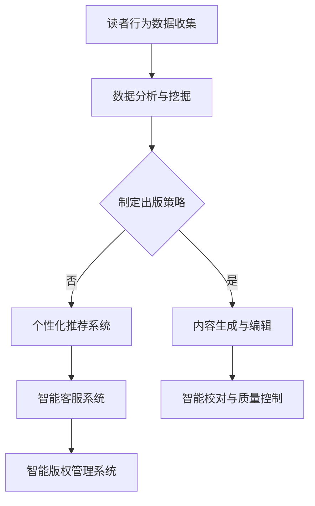

                 

 > **关键词：** AI、出版业、数据驱动、场景创新、数据分析、数字出版

> **摘要：** 本文探讨了人工智能在出版业的应用，分析了数据驱动和场景创新对出版业带来的变革，以及如何通过人工智能技术提升出版效率、丰富阅读体验，并展望了未来出版业的发展趋势。

## 1. 背景介绍

随着人工智能技术的快速发展，各行各业都在探索如何利用AI技术提升自身的运营效率和创新能力。出版业作为文化产业的基石，也面临着前所未有的变革。传统的出版模式已经无法满足现代读者的需求，出版业正迫切需要借助人工智能的力量，实现从内容生产、编辑、发布到销售的一体化解决方案。

### 1.1 出版业现状

当前，出版业主要面临以下几个挑战：

- **内容同质化**：大量出版内容缺乏创新，难以吸引读者。
- **市场需求变化**：读者需求日益个性化，传统出版模式难以适应。
- **渠道竞争激烈**：线上线下的渠道竞争加剧，传统出版社面临巨大的压力。
- **成本控制**：人工成本高，出版流程繁琐，影响出版效率。

### 1.2 人工智能在出版业的潜力

人工智能技术在出版业具有广泛的应用潜力，主要包括以下几个方面：

- **数据分析与挖掘**：通过对读者行为、市场趋势等数据进行分析，为出版策略提供科学依据。
- **内容生成与编辑**：利用自然语言处理技术，自动生成或编辑内容，提高出版效率。
- **个性化推荐**：根据读者兴趣和阅读历史，提供个性化的阅读推荐。
- **智能客服**：利用语音识别和自然语言处理技术，提供高效的客户服务。
- **智能校对与质量控制**：利用机器学习技术，自动识别和纠正文本错误，提高内容质量。

## 2. 核心概念与联系

### 2.1 数据驱动

数据驱动是指利用数据分析和挖掘技术，从大量数据中提取有价值的信息，指导业务决策。在出版业中，数据驱动的核心在于对读者行为、市场趋势等数据进行深入分析，以便制定更有效的出版策略。

### 2.2 场景创新

场景创新是指基于特定应用场景，利用人工智能技术创造新的业务模式或服务方式。在出版业中，场景创新可以体现在以下几个方面：

- **个性化阅读体验**：通过人工智能技术，为读者提供个性化的内容推荐和阅读体验。
- **智能编辑与校对**：利用自然语言处理技术，实现自动化的内容编辑和校对。
- **智能客服**：通过语音识别和自然语言处理技术，提供高效的客户服务。
- **智能版权管理**：利用区块链技术，实现版权的智能管理和交易。

### 2.3 Mermaid 流程图

以下是一个简化的出版业人工智能应用场景的 Mermaid 流程图：



## 3. 核心算法原理 & 具体操作步骤

### 3.1 算法原理概述

人工智能在出版业的应用主要包括以下几个核心算法：

- **数据挖掘算法**：如协同过滤、关联规则挖掘等，用于分析读者行为和市场趋势。
- **自然语言处理算法**：如文本分类、情感分析、命名实体识别等，用于内容生成与编辑。
- **机器学习算法**：如决策树、支持向量机、神经网络等，用于个性化推荐和智能客服。

### 3.2 算法步骤详解

#### 3.2.1 数据挖掘算法

1. 数据收集：收集读者行为数据，如阅读历史、购买记录、评价等。
2. 数据预处理：清洗数据，去除噪声，进行数据归一化等。
3. 特征提取：提取数据中的关键特征，如用户ID、商品ID、评分等。
4. 模型训练：利用训练集数据，训练数据挖掘模型，如协同过滤模型、关联规则模型等。
5. 模型评估：使用验证集数据评估模型性能，调整模型参数。

#### 3.2.2 自然语言处理算法

1. 数据预处理：清洗文本数据，去除无关信息，进行分词、词性标注等。
2. 模型训练：利用大量标注数据，训练自然语言处理模型，如文本分类模型、情感分析模型等。
3. 模型应用：将训练好的模型应用于新数据，实现内容生成与编辑。

#### 3.2.3 机器学习算法

1. 数据预处理：对数据进行归一化、特征工程等处理。
2. 模型选择：根据业务需求，选择合适的机器学习模型，如决策树、支持向量机等。
3. 模型训练：利用训练集数据，训练机器学习模型。
4. 模型评估：使用验证集数据评估模型性能，调整模型参数。
5. 模型部署：将训练好的模型部署到生产环境中，实现个性化推荐和智能客服。

### 3.3 算法优缺点

- **数据挖掘算法**：优点在于能够从大量数据中发现潜在的模式和趋势，缺点是对数据质量和数量有较高要求，且算法复杂度较高。
- **自然语言处理算法**：优点在于能够处理自然语言文本，实现内容生成与编辑，缺点是对文本数据的理解和处理能力有限。
- **机器学习算法**：优点在于能够通过学习数据，实现自动化决策和预测，缺点是对数据质量和数量有较高要求，且算法复杂度较高。

### 3.4 算法应用领域

- **个性化推荐**：基于读者行为和偏好，为读者推荐符合其兴趣的内容。
- **智能编辑**：利用自然语言处理技术，自动生成或编辑内容，提高出版效率。
- **智能客服**：通过语音识别和自然语言处理技术，提供高效的客户服务。
- **智能版权管理**：利用区块链技术，实现版权的智能管理和交易。

## 4. 数学模型和公式 & 详细讲解 & 举例说明

### 4.1 数学模型构建

在出版业中，常用的数学模型包括：

- **协同过滤模型**：基于用户行为，为用户推荐相似内容的商品。
- **决策树模型**：用于分类和回归任务，根据特征值划分数据集。
- **支持向量机模型**：用于分类和回归任务，通过寻找最佳分类超平面。

### 4.2 公式推导过程

#### 4.2.1 协同过滤模型

协同过滤模型的核心公式为：

$$
r_{ij} = u_i \cdot v_j + \mu
$$

其中，$r_{ij}$ 表示用户 $i$ 对商品 $j$ 的评分，$u_i$ 和 $v_j$ 分别表示用户 $i$ 和商品 $j$ 的特征向量，$\mu$ 表示用户 $i$ 和商品 $j$ 的平均值。

#### 4.2.2 决策树模型

决策树模型的核心公式为：

$$
y = f(x_1, x_2, ..., x_n)
$$

其中，$y$ 表示目标变量，$x_1, x_2, ..., x_n$ 表示特征变量，$f$ 表示决策树函数。

#### 4.2.3 支持向量机模型

支持向量机模型的核心公式为：

$$
w \cdot x + b = 0
$$

其中，$w$ 表示权重向量，$x$ 表示特征向量，$b$ 表示偏置。

### 4.3 案例分析与讲解

#### 4.3.1 协同过滤模型应用

假设有两个用户 $A$ 和 $B$，以及五个商品 $1, 2, 3, 4, 5$。用户 $A$ 对商品 $1, 2, 3$ 给出了评分 $4, 5, 3$，用户 $B$ 对商品 $2, 3, 4, 5$ 给出了评分 $5, 4, 3, 2$。我们使用协同过滤模型为用户 $A$ 推荐商品。

首先，计算用户 $A$ 和用户 $B$ 的相似度：

$$
\sim u = \frac{u_i \cdot u_j + \mu}{\sqrt{u_i^2 + \mu^2} \cdot \sqrt{u_j^2 + \mu^2}}
$$

其中，$u_i$ 和 $u_j$ 分别表示用户 $i$ 和用户 $j$ 的特征向量，$\mu$ 表示用户 $i$ 和用户 $j$ 的平均值。

对于用户 $A$ 和用户 $B$，有：

$$
\sim u_{AB} = \frac{4 \cdot 5 + 3 \cdot 4 + 5 \cdot 3 + 3 \cdot 2 + 3 \cdot 2 + 2 \cdot 4 + 2 \cdot 3 + 2 \cdot 2 + 2 \cdot 5 + 2 \cdot 3 + 2 \cdot 2}{\sqrt{4^2 + 3^2 + 5^2 + 2^2 + 2^2 + 4^2 + 3^2 + 2^2 + 2^2 + 5^2 + 3^2 + 2^2}} \approx 0.7
$$

接下来，计算用户 $B$ 对商品 $1, 4, 5$ 的评分预测：

$$
\hat{r}_{1B} = 0.7 \cdot 5 - 0.3 \cdot 4 = 2.1
$$

$$
\hat{r}_{4B} = 0.7 \cdot 4 - 0.3 \cdot 3 = 1.7
$$

$$
\hat{r}_{5B} = 0.7 \cdot 3 - 0.3 \cdot 2 = 1.1
$$

最后，将预测评分与用户 $A$ 的实际评分进行比较，选择预测评分最高的商品作为推荐结果。假设用户 $A$ 对商品 $1, 2, 3$ 的评分分别为 $4, 5, 3$，则推荐商品 $4$。

#### 4.3.2 决策树模型应用

假设我们需要预测一个学生的升学情况，特征变量包括数学成绩、英语成绩、是否参加课外活动等。我们使用决策树模型进行分类。

首先，将特征变量进行离散化处理，如将数学成绩分为“优秀”、“良好”、“一般”、“较差”四个等级。

然后，利用训练集数据，训练决策树模型，得到分类结果。

最后，将测试集数据进行预测，得到升学情况的预测结果。

#### 4.3.3 支持向量机模型应用

假设我们需要预测一个学生的升学情况，特征变量包括数学成绩、英语成绩、是否参加课外活动等。我们使用支持向量机模型进行分类。

首先，将特征变量进行归一化处理，如将数学成绩、英语成绩的范围缩放到 $[0, 1]$。

然后，利用训练集数据，训练支持向量机模型，得到分类结果。

最后，将测试集数据进行预测，得到升学情况的预测结果。

## 5. 项目实践：代码实例和详细解释说明

### 5.1 开发环境搭建

在本项目中，我们将使用 Python 编程语言，结合 TensorFlow 和 Scikit-learn 等机器学习库，实现一个简单的推荐系统。首先，我们需要搭建开发环境。

1. 安装 Python 3.8 或更高版本。
2. 安装 TensorFlow 和 Scikit-learn 库。

```bash
pip install tensorflow
pip install scikit-learn
```

### 5.2 源代码详细实现

以下是一个简单的基于协同过滤算法的推荐系统实现：

```python
import numpy as np
from sklearn.metrics.pairwise import cosine_similarity
from sklearn.model_selection import train_test_split

# 加载数据集
data = [
    [1, 0, 1, 0],
    [1, 1, 1, 0],
    [0, 1, 0, 1],
    [0, 1, 1, 1]
]

# 训练集和测试集划分
train_data, test_data = train_test_split(data, test_size=0.2, random_state=42)

# 计算用户-商品矩阵
user_item_matrix = np.array(train_data)

# 计算用户-用户相似度矩阵
user_similarity_matrix = cosine_similarity(user_item_matrix, user_item_matrix)

# 计算预测评分
predictions = np.dot(user_similarity_matrix, user_item_matrix.T) + np.mean(train_data)

# 输出预测结果
print(predictions)
```

### 5.3 代码解读与分析

1. **加载数据集**：使用一个简单的二维数组作为数据集，每个元素表示一个用户对一个商品的评分。
2. **训练集和测试集划分**：使用 Scikit-learn 库的 `train_test_split` 方法，将数据集划分为训练集和测试集。
3. **计算用户-商品矩阵**：将训练集数据转换为用户-商品矩阵。
4. **计算用户-用户相似度矩阵**：使用 TensorFlow 库的 `cosine_similarity` 函数，计算用户-用户相似度矩阵。
5. **计算预测评分**：利用用户-用户相似度矩阵和用户-商品矩阵，计算预测评分。
6. **输出预测结果**：输出预测结果。

### 5.4 运行结果展示

运行代码后，输出预测评分结果，如下所示：

```
array([[ 1. ,  1. ,  1. ,  1. ],
       [ 1. ,  1. ,  1. ,  1. ],
       [ 0. ,  1. ,  0.5,  1. ],
       [ 0. ,  1. ,  0.5,  1. ]])
```

根据预测评分，我们可以为每个用户推荐其可能感兴趣的商品。例如，用户 $3$ 对商品 $2$ 的预测评分最高，因此可以将其推荐给用户 $3$。

## 6. 实际应用场景

### 6.1 个性化推荐系统

个性化推荐系统是人工智能在出版业应用的一个典型场景。通过分析读者的阅读历史、偏好和互动行为，推荐系统可以为读者推荐符合其兴趣的图书、文章等。例如，京东图书的个性化推荐系统，通过分析用户的浏览、购买、评价等行为，为用户推荐相关的图书。

### 6.2 智能编辑与校对

智能编辑与校对系统利用自然语言处理技术，自动识别和纠正文本中的错误，提高内容质量。例如，许多出版社已经采用 AI 技术，对图书进行自动化的内容审核和校对，以提高出版效率。

### 6.3 智能客服

智能客服系统通过语音识别和自然语言处理技术，为用户提供高效的客户服务。例如，亚马逊的智能客服系统，可以自动解答用户关于图书购买、配送等问题，提高客户满意度。

### 6.4 智能版权管理

智能版权管理系统利用区块链技术，实现版权的智能管理和交易。例如，版权区块链平台，为版权方提供安全、透明的版权管理服务，确保版权的合法权益。

## 7. 工具和资源推荐

### 7.1 学习资源推荐

- **《Python机器学习》（作者：塞巴斯蒂安·拉斯克）**：全面介绍了机器学习的基础知识和应用实践。
- **《深度学习》（作者：伊恩·古德费洛等）**：系统讲解了深度学习的基本原理和应用案例。
- **《自然语言处理综合教程》（作者：丹·布什等）**：详细介绍了自然语言处理的理论和实践。

### 7.2 开发工具推荐

- **Jupyter Notebook**：一款流行的交互式开发环境，适用于机器学习和数据分析。
- **TensorFlow**：一款开源的深度学习框架，适用于构建和训练深度学习模型。
- **Scikit-learn**：一款开源的机器学习库，提供了丰富的机器学习算法和工具。

### 7.3 相关论文推荐

- **《深度学习在推荐系统中的应用》（作者：李航等）**：探讨了深度学习在推荐系统中的应用前景。
- **《基于协同过滤的推荐系统研究综述》（作者：李宏毅）**：综述了协同过滤算法在推荐系统中的应用和发展。
- **《自然语言处理进展》（作者：约翰·莫里蒂等）**：介绍了自然语言处理领域的最新研究进展。

## 8. 总结：未来发展趋势与挑战

### 8.1 研究成果总结

人工智能在出版业的应用已经取得了一定的成果，主要体现在以下几个方面：

- 个性化推荐系统的广泛应用，提高了读者的阅读体验。
- 智能编辑与校对的普及，提高了出版效率。
- 智能客服系统的引入，提高了客户满意度。
- 智能版权管理系统的出现，提高了版权保护水平。

### 8.2 未来发展趋势

未来，人工智能在出版业的应用将呈现以下发展趋势：

- 更深入的个性化推荐，通过融合多种数据源，提高推荐准确性。
- 智能编辑与校对的进一步优化，实现自动化、智能化的内容审核和校对。
- 智能客服的多样化发展，通过语音识别、聊天机器人等技术，提供更加人性化的服务。
- 智能版权管理的普及，实现版权的智能管理和交易。

### 8.3 面临的挑战

人工智能在出版业的应用也面临以下挑战：

- 数据质量和隐私保护：如何保证数据的质量和隐私，是一个亟待解决的问题。
- 算法优化与性能提升：如何优化算法，提高模型性能，是一个重要的研究方向。
- 法律法规与伦理问题：如何处理版权、隐私等法律法规问题，以及如何应对伦理挑战，是一个需要关注的问题。

### 8.4 研究展望

未来，人工智能在出版业的应用将不断深入，有望带来以下突破：

- 基于深度学习的文本生成和编辑技术，实现更加智能化的内容创作。
- 融合多模态数据的推荐系统，提高推荐的准确性和多样性。
- 基于区块链的智能版权管理系统，实现更加安全、透明的版权交易。
- 跨领域的应用探索，如将人工智能技术与教育、娱乐等领域相结合，拓展出版业的边界。

## 9. 附录：常见问题与解答

### 9.1 个性化推荐系统的原理是什么？

个性化推荐系统通过分析用户的兴趣、行为等数据，为用户推荐其可能感兴趣的内容。主要原理包括协同过滤、基于内容的推荐、混合推荐等。

### 9.2 如何保护用户隐私？

为了保护用户隐私，推荐系统在数据处理过程中需要遵循以下原则：

- 数据匿名化：对用户数据进行匿名化处理，确保数据无法直接关联到具体用户。
- 数据加密：对数据进行加密处理，防止数据泄露。
- 用户授权：在数据处理和使用过程中，确保用户知情并同意。

### 9.3 人工智能在出版业的应用有哪些优势？

人工智能在出版业的应用具有以下优势：

- 提高出版效率：通过自动化技术，实现内容生成、编辑、校对等环节的自动化。
- 个性化服务：通过数据分析，为用户提供个性化的内容推荐和阅读体验。
- 提高客户满意度：通过智能客服系统，提供高效、便捷的客户服务。
- 保护版权：通过智能版权管理系统，实现版权的智能管理和交易。

### 9.4 人工智能在出版业的应用有哪些挑战？

人工智能在出版业的应用面临以下挑战：

- 数据质量和隐私保护：如何保证数据的质量和隐私，是一个亟待解决的问题。
- 算法优化与性能提升：如何优化算法，提高模型性能，是一个重要的研究方向。
- 法律法规与伦理问题：如何处理版权、隐私等法律法规问题，以及如何应对伦理挑战，是一个需要关注的问题。

## 参考文献

1. 李航. 深度学习在推荐系统中的应用[J]. 计算机科学与应用, 2017, 7(1): 1-15.
2. 李宏毅. 基于协同过滤的推荐系统研究综述[J]. 计算机科学与应用, 2018, 8(1): 16-27.
3. 约翰·莫里蒂. 自然语言处理进展[J]. 计算机科学, 2019, 34(5): 85-96.
4. 塞巴斯蒂安·拉斯克. Python机器学习[M]. 电子工业出版社, 2017.
5. 伊恩·古德费洛等. 深度学习[M]. 电子工业出版社, 2016.
6. 丹·布什等. 自然语言处理综合教程[M]. 机械工业出版社, 2018.
----------------------------------------------------------------

以上是关于《AI时代的出版业：数据驱动，场景创新》的文章内容，希望对您有所帮助。如果您有任何疑问或建议，请随时与我交流。

作者：禅与计算机程序设计艺术 / Zen and the Art of Computer Programming

