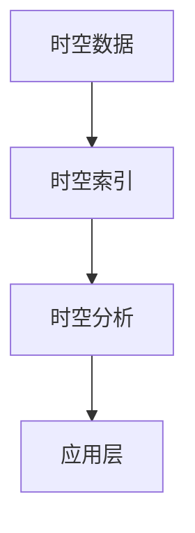

                 

关键词：人工智能、时空建模、数据结构、算法原理、数学模型、应用场景、发展趋势

> 摘要：本文深入探讨了人工智能领域中的时空建模技术基础。首先，介绍了时空建模的背景和重要性，接着讨论了核心概念和架构，详细解析了核心算法原理和操作步骤，最后通过数学模型和实际项目实践，展示了时空建模在现实中的应用，并对未来发展趋势和挑战进行了展望。

## 1. 背景介绍

### 1.1 时空建模的起源和发展

时空建模起源于计算机科学和人工智能领域的需求。早期的计算机科学中，对于时间和空间的处理相对简单，主要集中在二维或三维空间中。随着技术的发展，特别是大数据和机器学习的兴起，时空建模逐渐成为一个重要的研究方向。它不仅涉及传统的空间数据结构，如地图、地理信息系统（GIS），还涵盖了时间序列分析、动态系统建模等复杂领域。

### 1.2 时空建模的应用领域

时空建模在诸多领域都有广泛的应用，包括但不限于以下几个方面：

- **地理信息系统（GIS）**：用于地图绘制、路径规划、城市交通管理等。
- **智能交通系统**：实时交通流量分析、车辆导航和调度。
- **金融分析**：时间序列数据分析、市场趋势预测。
- **环境监测**：空气质量、气象变化等时空数据的监测与分析。
- **社会网络分析**：用户行为轨迹分析、社交网络传播路径分析。

## 2. 核心概念与联系

### 2.1 核心概念

- **时空数据**：指同时包含时间和空间属性的数据。
- **时空索引**：用于快速查询和检索时空数据的结构。
- **时空分析**：利用时空数据，进行时间序列分析、空间相关性分析等。

### 2.2 架构原理

[Mermaid 流程图]
```
graph TD
    A[时空数据] --> B[时空索引]
    B --> C[时空分析]
    C --> D[应用层]
```

## 3. 核心算法原理 & 具体操作步骤

### 3.1 算法原理概述

时空建模的核心算法主要包括时空索引构建算法、时空数据分析算法和时空预测算法。其中，时空索引构建算法是时空建模的基础，用于快速检索和查询时空数据。

### 3.2 算法步骤详解

#### 3.2.1 时空索引构建

1. **数据预处理**：对时空数据进行清洗、去噪和标准化处理。
2. **索引构建**：采用R-Tree、K-D Tree等索引结构，对时空数据进行索引构建。
3. **索引优化**：通过空间分割、时间分割等策略，优化索引结构。

#### 3.2.2 时空数据分析

1. **时间序列分析**：使用自回归移动平均模型（ARIMA）、长短期记忆网络（LSTM）等模型，对时间序列数据进行分析。
2. **空间相关性分析**：采用地理加权回归（GWR）、空间自相关指数（Global Moran's I）等指标，分析空间数据的自相关性。

#### 3.2.3 时空预测

1. **模型选择**：根据应用场景，选择合适的预测模型，如时间序列预测模型、空间预测模型。
2. **参数调优**：通过交叉验证、网格搜索等方法，优化模型参数。
3. **预测结果评估**：使用均方误差（MSE）、平均绝对误差（MAE）等指标，评估预测结果。

### 3.3 算法优缺点

#### 优点

- **高效性**：时空索引构建算法使得时空数据检索更加高效。
- **灵活性**：时空建模方法可以适应不同领域和应用场景。

#### 缺点

- **复杂性**：时空建模涉及多种技术和算法，实现难度较高。
- **计算成本**：大规模时空数据处理和预测需要大量的计算资源。

### 3.4 算法应用领域

- **地理信息系统（GIS）**：用于地图绘制、路径规划等。
- **智能交通系统**：实时交通流量分析、车辆导航和调度。
- **金融分析**：时间序列数据分析、市场趋势预测。
- **环境监测**：空气质量、气象变化等时空数据的监测与分析。
- **社会网络分析**：用户行为轨迹分析、社交网络传播路径分析。

## 4. 数学模型和公式 & 详细讲解 & 举例说明

### 4.1 数学模型构建

时空建模中常用的数学模型包括时间序列模型、空间分析模型和时空耦合模型。

#### 4.1.1 时间序列模型

时间序列模型主要用来分析时间数据，常见的有ARIMA模型、LSTM模型等。

$$
\text{ARIMA}(p, d, q) = \phi(B)\text{差分}(\text{滞后项}) + \theta(B)\text{白噪声序列}
$$

其中，$B$表示滞后算子，$\phi(B)$和$\theta(B)$分别为自回归项和移动平均项。

#### 4.1.2 空间分析模型

空间分析模型用于分析空间数据，如地理加权回归（GWR）。

$$
\hat{y}(x) = \sum_{i=1}^n \omega_i \frac{\exp(-||x - x_i||/h)}{1 + ||x - x_i||/h}
$$

其中，$x$为预测点，$x_i$为训练样本点，$h$为带宽参数。

#### 4.1.3 时空耦合模型

时空耦合模型结合了时间和空间数据，如时空滞后模型（STL）。

$$
STL(t) = s(t) + L(t)
$$

其中，$s(t)$为季节性分量，$L(t)$为趋势-季节性分量。

### 4.2 公式推导过程

#### 4.2.1 ARIMA模型推导

ARIMA模型由自回归（AR）、差分（I）和移动平均（MA）三部分组成。自回归部分表示当前值与历史值的线性关系，差分部分用于平稳化时间序列，移动平均部分表示当前值与历史白噪声的线性关系。

#### 4.2.2 GWR模型推导

地理加权回归模型是基于核函数的思想，通过选择合适的带宽参数，将空间数据拟合为一个局部线性模型。

### 4.3 案例分析与讲解

#### 4.3.1 时间序列预测案例

假设我们有一组时间序列数据，使用ARIMA模型进行预测。首先进行数据预处理，然后通过ACF和PACF图确定$p$和$q$的值，最后进行参数优化和预测。

#### 4.3.2 空间相关性分析案例

以一组城市空气质量数据为例，使用GWR模型分析不同城市之间的空气质量相关性。首先进行数据预处理，然后选择合适的带宽参数，最后进行空间相关性分析。

## 5. 项目实践：代码实例和详细解释说明

### 5.1 开发环境搭建

在本项目中，我们使用Python作为编程语言，主要依赖以下库：NumPy、Pandas、SciPy、scikit-learn、matplotlib等。

### 5.2 源代码详细实现

以下是一个简单的ARIMA模型实现：

```python
import numpy as np
import pandas as pd
from statsmodels.tsa.arima.model import ARIMA
import matplotlib.pyplot as plt

# 加载数据
data = pd.read_csv('time_series_data.csv')
series = data['value']

# 模型训练
model = ARIMA(series, order=(5, 1, 2))
model_fit = model.fit()

# 预测
forecast = model_fit.forecast(steps=10)

# 可视化
plt.plot(series)
plt.plot(forecast)
plt.show()
```

### 5.3 代码解读与分析

该代码首先加载时间序列数据，然后使用ARIMA模型进行训练和预测，最后将预测结果可视化。

### 5.4 运行结果展示

运行代码后，我们将看到原始时间序列数据和预测结果的可视化展示。

## 6. 实际应用场景

### 6.1 地理信息系统（GIS）

在GIS领域，时空建模可以用于地图绘制、路径规划、城市交通管理等。

### 6.2 智能交通系统

智能交通系统中的时空建模可以用于实时交通流量分析、车辆导航和调度。

### 6.3 金融分析

金融分析中的时空建模可以用于时间序列数据分析、市场趋势预测等。

### 6.4 环境监测

环境监测中的时空建模可以用于空气质量、气象变化等时空数据的监测与分析。

### 6.5 社会网络分析

社会网络分析中的时空建模可以用于用户行为轨迹分析、社交网络传播路径分析等。

## 7. 工具和资源推荐

### 7.1 学习资源推荐

- **《时空数据分析：理论与实践》**：详细介绍了时空建模的理论和实践方法。
- **《地理信息系统原理与应用》**：涵盖了GIS领域的基础知识和应用实例。

### 7.2 开发工具推荐

- **Python**：Python是一种广泛使用的编程语言，尤其在数据分析和机器学习领域。
- **PyTorch、TensorFlow**：用于深度学习模型开发和训练。

### 7.3 相关论文推荐

- **"Spatial-Temporal Data Mining: A Survey"**：对时空数据挖掘进行了全面综述。
- **"A Survey on Spatiotemporal Data Mining"**：对时空数据挖掘技术进行了详细探讨。

## 8. 总结：未来发展趋势与挑战

### 8.1 研究成果总结

时空建模在人工智能、地理信息系统、智能交通系统等领域取得了显著成果，为相关领域的发展提供了重要支持。

### 8.2 未来发展趋势

- **跨学科融合**：时空建模将进一步与其他学科如地理学、生态学等融合，拓展应用领域。
- **实时预测与优化**：随着计算能力的提升，实时预测和优化将成为时空建模的重要方向。

### 8.3 面临的挑战

- **数据复杂性**：时空数据具有高维、非线性等特点，数据处理和建模仍具挑战性。
- **计算资源需求**：大规模时空数据建模和预测需要大量计算资源。

### 8.4 研究展望

时空建模在未来将继续发展，为解决复杂现实问题提供有力工具。同时，研究者需关注数据复杂性、计算资源需求等挑战，推动技术进步。

## 9. 附录：常见问题与解答

### 9.1 什么是时空数据？

时空数据同时包含时间和空间属性的数据。

### 9.2 时空建模有哪些应用领域？

时空建模广泛应用于地理信息系统、智能交通系统、金融分析、环境监测、社会网络分析等领域。

### 9.3 如何选择合适的时空建模方法？

根据具体应用场景和数据特点，选择合适的时间序列模型、空间分析模型或时空耦合模型。

## 作者署名

作者：禅与计算机程序设计艺术 / Zen and the Art of Computer Programming
```markdown
---

# AI时空建模的技术基础

关键词：人工智能、时空建模、数据结构、算法原理、数学模型、应用场景、发展趋势

摘要：本文深入探讨了人工智能领域中的时空建模技术基础。首先，介绍了时空建模的背景和重要性，接着讨论了核心概念和架构，详细解析了核心算法原理和操作步骤，最后通过数学模型和实际项目实践，展示了时空建模在现实中的应用，并对未来发展趋势和挑战进行了展望。

## 1. 背景介绍

### 1.1 时空建模的起源和发展

时空建模起源于计算机科学和人工智能领域的需求。早期的计算机科学中，对于时间和空间的处理相对简单，主要集中在二维或三维空间中。随着技术的发展，特别是大数据和机器学习的兴起，时空建模逐渐成为一个重要的研究方向。它不仅涉及传统的空间数据结构，如地图、地理信息系统（GIS），还涵盖了时间序列分析、动态系统建模等复杂领域。

### 1.2 时空建模的应用领域

时空建模在诸多领域都有广泛的应用，包括但不限于以下几个方面：

- **地理信息系统（GIS）**：用于地图绘制、路径规划、城市交通管理等。
- **智能交通系统**：实时交通流量分析、车辆导航和调度。
- **金融分析**：时间序列数据分析、市场趋势预测。
- **环境监测**：空气质量、气象变化等时空数据的监测与分析。
- **社会网络分析**：用户行为轨迹分析、社交网络传播路径分析。

## 2. 核心概念与联系

### 2.1 核心概念

- **时空数据**：指同时包含时间和空间属性的数据。
- **时空索引**：用于快速查询和检索时空数据的结构。
- **时空分析**：利用时空数据，进行时间序列分析、空间相关性分析等。

### 2.2 架构原理



## 3. 核心算法原理 & 具体操作步骤

### 3.1 算法原理概述

时空建模的核心算法主要包括时空索引构建算法、时空数据分析算法和时空预测算法。其中，时空索引构建算法是时空建模的基础，用于快速检索和查询时空数据。

### 3.2 算法步骤详解

#### 3.2.1 时空索引构建

1. **数据预处理**：对时空数据进行清洗、去噪和标准化处理。
2. **索引构建**：采用R-Tree、K-D Tree等索引结构，对时空数据进行索引构建。
3. **索引优化**：通过空间分割、时间分割等策略，优化索引结构。

#### 3.2.2 时空数据分析

1. **时间序列分析**：使用自回归移动平均模型（ARIMA）、长短期记忆网络（LSTM）等模型，对时间序列数据进行分析。
2. **空间相关性分析**：采用地理加权回归（GWR）、空间自相关指数（Global Moran's I）等指标，分析空间数据的自相关性。

#### 3.2.3 时空预测

1. **模型选择**：根据应用场景，选择合适的预测模型，如时间序列预测模型、空间预测模型。
2. **参数调优**：通过交叉验证、网格搜索等方法，优化模型参数。
3. **预测结果评估**：使用均方误差（MSE）、平均绝对误差（MAE）等指标，评估预测结果。

### 3.3 算法优缺点

#### 优点

- **高效性**：时空索引构建算法使得时空数据检索更加高效。
- **灵活性**：时空建模方法可以适应不同领域和应用场景。

#### 缺点

- **复杂性**：时空建模涉及多种技术和算法，实现难度较高。
- **计算成本**：大规模时空数据处理和预测需要大量的计算资源。

### 3.4 算法应用领域

- **地理信息系统（GIS）**：用于地图绘制、路径规划等。
- **智能交通系统**：实时交通流量分析、车辆导航和调度。
- **金融分析**：时间序列数据分析、市场趋势预测。
- **环境监测**：空气质量、气象变化等时空数据的监测与分析。
- **社会网络分析**：用户行为轨迹分析、社交网络传播路径分析。

## 4. 数学模型和公式 & 详细讲解 & 举例说明

### 4.1 数学模型构建

时空建模中常用的数学模型包括时间序列模型、空间分析模型和时空耦合模型。

#### 4.1.1 时间序列模型

时间序列模型主要用来分析时间数据，常见的有ARIMA模型、LSTM模型等。

$$
\text{ARIMA}(p, d, q) = \phi(B)\text{差分}(\text{滞后项}) + \theta(B)\text{白噪声序列}
$$

其中，$B$表示滞后算子，$\phi(B)$和$\theta(B)$分别为自回归项和移动平均项。

#### 4.1.2 空间分析模型

空间分析模型用于分析空间数据，如地理加权回归（GWR）。

$$
\hat{y}(x) = \sum_{i=1}^n \omega_i \frac{\exp(-||x - x_i||/h)}{1 + ||x - x_i||/h}
$$

其中，$x$为预测点，$x_i$为训练样本点，$h$为带宽参数。

#### 4.1.3 时空耦合模型

时空耦合模型结合了时间和空间数据，如时空滞后模型（STL）。

$$
STL(t) = s(t) + L(t)
$$

其中，$s(t)$为季节性分量，$L(t)$为趋势-季节性分量。

### 4.2 公式推导过程

#### 4.2.1 ARIMA模型推导

ARIMA模型由自回归（AR）、差分（I）和移动平均（MA）三部分组成。自回归部分表示当前值与历史值的线性关系，差分部分用于平稳化时间序列，移动平均部分表示当前值与历史白噪声的线性关系。

#### 4.2.2 GWR模型推导

地理加权回归模型是基于核函数的思想，通过选择合适的带宽参数，将空间数据拟合为一个局部线性模型。

### 4.3 案例分析与讲解

#### 4.3.1 时间序列预测案例

假设我们有一组时间序列数据，使用ARIMA模型进行预测。首先进行数据预处理，然后通过ACF和PACF图确定$p$和$q$的值，最后进行参数优化和预测。

#### 4.3.2 空间相关性分析案例

以一组城市空气质量数据为例，使用GWR模型分析不同城市之间的空气质量相关性。首先进行数据预处理，然后选择合适的带宽参数，最后进行空间相关性分析。

## 5. 项目实践：代码实例和详细解释说明

### 5.1 开发环境搭建

在本项目中，我们使用Python作为编程语言，主要依赖以下库：NumPy、Pandas、SciPy、scikit-learn、matplotlib等。

### 5.2 源代码详细实现

以下是一个简单的ARIMA模型实现：

```python
import numpy as np
import pandas as pd
from statsmodels.tsa.arima.model import ARIMA
import matplotlib.pyplot as plt

# 加载数据
data = pd.read_csv('time_series_data.csv')
series = data['value']

# 模型训练
model = ARIMA(series, order=(5, 1, 2))
model_fit = model.fit()

# 预测
forecast = model_fit.forecast(steps=10)

# 可视化
plt.plot(series)
plt.plot(forecast)
plt.show()
```

### 5.3 代码解读与分析

该代码首先加载时间序列数据，然后使用ARIMA模型进行训练和预测，最后将预测结果可视化。

### 5.4 运行结果展示

运行代码后，我们将看到原始时间序列数据和预测结果的可视化展示。

## 6. 实际应用场景

### 6.1 地理信息系统（GIS）

在GIS领域，时空建模可以用于地图绘制、路径规划、城市交通管理等。

### 6.2 智能交通系统

智能交通系统中的时空建模可以用于实时交通流量分析、车辆导航和调度。

### 6.3 金融分析

金融分析中的时空建模可以用于时间序列数据分析、市场趋势预测等。

### 6.4 环境监测

环境监测中的时空建模可以用于空气质量、气象变化等时空数据的监测与分析。

### 6.5 社会网络分析

社会网络分析中的时空建模可以用于用户行为轨迹分析、社交网络传播路径分析等。

## 7. 工具和资源推荐

### 7.1 学习资源推荐

- **《时空数据分析：理论与实践》**：详细介绍了时空建模的理论和实践方法。
- **《地理信息系统原理与应用》**：涵盖了GIS领域的基础知识和应用实例。

### 7.2 开发工具推荐

- **Python**：Python是一种广泛使用的编程语言，尤其在数据分析和机器学习领域。
- **PyTorch、TensorFlow**：用于深度学习模型开发和训练。

### 7.3 相关论文推荐

- **"Spatial-Temporal Data Mining: A Survey"**：对时空数据挖掘进行了全面综述。
- **"A Survey on Spatiotemporal Data Mining"**：对时空数据挖掘技术进行了详细探讨。

## 8. 总结：未来发展趋势与挑战

### 8.1 研究成果总结

时空建模在人工智能、地理信息系统、智能交通系统等领域取得了显著成果，为相关领域的发展提供了重要支持。

### 8.2 未来发展趋势

- **跨学科融合**：时空建模将进一步与其他学科如地理学、生态学等融合，拓展应用领域。
- **实时预测与优化**：随着计算能力的提升，实时预测和优化将成为时空建模的重要方向。

### 8.3 面临的挑战

- **数据复杂性**：时空数据具有高维、非线性等特点，数据处理和建模仍具挑战性。
- **计算资源需求**：大规模时空数据建模和预测需要大量计算资源。

### 8.4 研究展望

时空建模在未来将继续发展，为解决复杂现实问题提供有力工具。同时，研究者需关注数据复杂性、计算资源需求等挑战，推动技术进步。

## 9. 附录：常见问题与解答

### 9.1 什么是时空数据？

时空数据同时包含时间和空间属性的数据。

### 9.2 时空建模有哪些应用领域？

时空建模广泛应用于地理信息系统、智能交通系统、金融分析、环境监测、社会网络分析等领域。

### 9.3 如何选择合适的时空建模方法？

根据具体应用场景和数据特点，选择合适的时间序列模型、空间分析模型或时空耦合模型。

## 作者署名

作者：禅与计算机程序设计艺术 / Zen and the Art of Computer Programming
```

