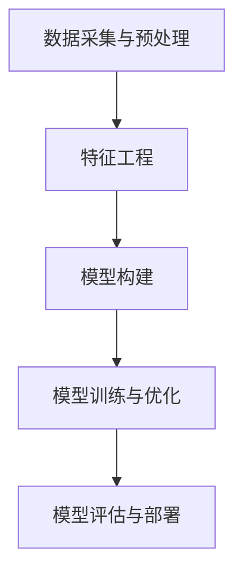

                 

关键词：人工智能，时空数据，建模，数据科学，算法，数学模型，应用场景，未来展望。

> 摘要：本文将深入探讨人工智能领域中的时空数据建模，从核心概念到具体算法，再到数学模型与应用场景，全面解析时空数据建模的理论基础和实践方法，为读者提供关于该领域的全面见解。

## 1. 背景介绍

随着全球信息化进程的加快，数据量呈现爆炸式增长，尤其是时空数据。时空数据是指与时间和空间位置相关的数据，如传感器数据、卫星图像、交通流量数据等。这些数据对于理解复杂系统、预测未来事件具有重要意义。然而，传统的数据处理方法难以应对时空数据的复杂性和多样性。因此，人工智能（AI）的应用成为解决这一问题的有效途径。

AI时空数据建模作为一种新兴的技术，旨在通过构建模型来挖掘时空数据的内在规律，进而实现数据的智能分析和预测。该技术不仅在学术界受到广泛关注，也在工业界得到广泛应用。例如，在城市规划、交通管理、环境保护、灾害预警等领域，AI时空数据建模都展现出了巨大的潜力。

本文将围绕AI时空数据建模的基石，从核心概念、算法原理、数学模型、实际应用等方面进行详细探讨，旨在为读者提供一个全面的技术视角。

## 2. 核心概念与联系

### 2.1 时空数据的基本概念

时空数据是指与时间和空间位置相关的数据。具体来说，它包括以下三个基本要素：

- **空间位置**：指地球表面上的具体位置，通常用地理坐标（如经纬度）表示。
- **时间戳**：指数据产生的时间点或时间范围，用于记录数据的时间序列。
- **属性信息**：指与空间位置和时间戳相关的其他信息，如温度、湿度、交通流量等。

### 2.2 时空数据的特点

时空数据具有以下特点：

- **多维性**：时空数据通常包含多个维度，如空间维度、时间维度和属性维度。
- **动态性**：时空数据是动态变化的，反映现实世界的实时状态。
- **时空关联性**：时空数据中的各个维度之间存在复杂的关联关系，需要通过建模来揭示这些关系。

### 2.3 时空数据建模的核心概念

时空数据建模的核心概念包括：

- **时空预测**：利用历史时空数据预测未来的时空状态。
- **时空分析**：对时空数据进行挖掘和分析，以揭示时空规律和模式。
- **时空模拟**：通过模拟现实世界的时空过程，预测未来可能发生的事件。

### 2.4 时空数据建模的架构

时空数据建模的架构可以分为以下几个层次：

1. **数据采集与预处理**：包括数据收集、数据清洗、数据整合等步骤，为建模提供高质量的数据。
2. **特征工程**：提取时空数据中的关键特征，为建模提供输入。
3. **模型构建**：根据数据特点选择合适的建模方法，如时间序列分析、机器学习、深度学习等。
4. **模型训练与优化**：使用历史数据对模型进行训练，并优化模型参数。
5. **模型评估与部署**：评估模型的性能，并在实际应用中部署模型。

### 2.5 Mermaid 流程图

以下是时空数据建模的 Mermaid 流程图：



## 3. 核心算法原理 & 具体操作步骤

### 3.1 算法原理概述

时空数据建模的核心算法包括时间序列分析、机器学习和深度学习等方法。每种方法都有其独特的原理和适用场景。

- **时间序列分析**：基于统计学和信号处理的方法，用于分析时间序列数据的趋势、周期性和季节性等特征。
- **机器学习**：利用历史数据训练模型，对时空数据进行分类、回归和聚类等操作。
- **深度学习**：通过构建复杂的神经网络模型，对时空数据进行自动特征提取和模式识别。

### 3.2 算法步骤详解

以下是时空数据建模的步骤详解：

1. **数据采集与预处理**：采集高质量的时空数据，并进行清洗、整合和归一化等预处理操作。
2. **特征工程**：提取时空数据中的关键特征，如时间序列的滞后项、空间相关性等。
3. **模型选择**：根据数据特点和业务需求，选择合适的时间序列分析、机器学习或深度学习模型。
4. **模型训练**：使用历史数据对模型进行训练，调整模型参数以优化性能。
5. **模型评估**：使用验证集或测试集评估模型的性能，包括准确性、召回率、F1分数等指标。
6. **模型部署**：将训练好的模型部署到实际应用中，进行实时预测和分析。

### 3.3 算法优缺点

- **时间序列分析**：优点包括简单易用、计算效率高；缺点包括对数据质量要求高、无法处理复杂时空关系。
- **机器学习**：优点包括能够处理复杂数据、适用性强；缺点包括对数据量大、训练时间较长。
- **深度学习**：优点包括强大的特征提取和模式识别能力；缺点包括模型复杂度高、计算资源需求大。

### 3.4 算法应用领域

时空数据建模的应用领域广泛，包括但不限于：

- **城市交通**：预测交通流量、优化交通管理。
- **环境保护**：监测污染物浓度、预测环境污染。
- **灾害预警**：预测自然灾害、辅助灾害响应。
- **金融市场**：分析市场趋势、预测股价走势。

## 4. 数学模型和公式

### 4.1 数学模型构建

时空数据建模中的数学模型主要包括时间序列模型和空间模型。

- **时间序列模型**：常用的时间序列模型有ARIMA（自回归积分滑动平均模型）和LSTM（长短期记忆网络）等。
- **空间模型**：常用的空间模型有空间插值、K最近邻等。

### 4.2 公式推导过程

以ARIMA模型为例，其公式推导过程如下：

- **自回归项**：\(AR(p)\)：\(y_t = c + \phi_1 y_{t-1} + \phi_2 y_{t-2} + \ldots + \phi_p y_{t-p} + \varepsilon_t\)
- **差分项**：\(I(d)\)：\(y_t^d = (1 - \phi_1) y_{t-1} + (1 - \phi_2) y_{t-2} + \ldots + (1 - \phi_p) y_{t-p} + \varepsilon_t\)
- **移动平均项**：\(MA(q)\)：\(y_t = c + \phi_1 y_{t-1} + \ldots + \phi_p y_{t-p} + \varepsilon_t + \theta_1 \varepsilon_{t-1} + \theta_2 \varepsilon_{t-2} + \ldots + \theta_q \varepsilon_{t-q}\)

### 4.3 案例分析与讲解

以某城市的交通流量预测为例，使用ARIMA模型进行建模。

1. **数据采集与预处理**：采集某城市各路段的交通流量数据，并进行清洗、归一化等预处理操作。
2. **特征工程**：提取时间序列的滞后项，如1小时、2小时前的交通流量。
3. **模型选择**：根据数据特点，选择ARIMA模型。
4. **模型训练**：使用历史数据对ARIMA模型进行训练，确定最优参数。
5. **模型评估**：使用验证集评估模型性能，如均方误差（MSE）。
6. **模型部署**：将训练好的模型部署到实际应用中，进行实时交通流量预测。

通过上述步骤，可以实现对某城市交通流量的有效预测，为交通管理提供决策支持。

## 5. 项目实践：代码实例

### 5.1 开发环境搭建

1. 安装Python环境（版本3.8以上）。
2. 安装所需的库，如numpy、pandas、scikit-learn、tensorflow等。

### 5.2 源代码详细实现

```python
import numpy as np
import pandas as pd
from statsmodels.tsa.arima.model import ARIMA
from sklearn.metrics import mean_squared_error

# 读取数据
data = pd.read_csv('traffic_data.csv')
data['date'] = pd.to_datetime(data['date'])
data.set_index('date', inplace=True)

# 特征工程
data_lag = data.shift(1).shift(2)

# 模型训练
model = ARIMA(data, order=(1, 1, 1))
model_fit = model.fit()

# 模型预测
predictions = model_fit.predict(start=data.index[5], end=data.index[-1])

# 模型评估
mse = mean_squared_error(data[5:], predictions)
print('MSE:', mse)

# 结果可视化
data['predictions'] = predictions
data[['actual', 'predictions']].plot()
```

### 5.3 代码解读与分析

1. **数据读取与预处理**：使用pandas读取交通流量数据，并进行时间序列处理。
2. **特征工程**：提取滞后特征，为建模提供输入。
3. **模型训练**：使用ARIMA模型进行训练，确定最优参数。
4. **模型预测**：使用训练好的模型对数据进行预测。
5. **模型评估**：计算均方误差（MSE），评估模型性能。
6. **结果可视化**：将实际交通流量与预测结果进行可视化对比。

## 6. 实际应用场景

### 6.1 城市交通管理

使用AI时空数据建模技术，可以预测城市交通流量，优化交通信号控制和公共交通规划，提高交通效率，减少交通拥堵。

### 6.2 环境保护

通过对空气质量、水质等时空数据的建模，可以预测环境污染事件，辅助环境治理和灾害预警。

### 6.3 健康医疗

利用时空数据建模技术，可以分析流行病传播趋势，预测疫情发展，为公共卫生决策提供支持。

### 6.4 智能制造

在制造业中，时空数据建模可以用于预测设备故障、优化生产计划，提高生产效率和质量。

## 7. 工具和资源推荐

### 7.1 学习资源推荐

- 《深度学习》（Goodfellow, Bengio, Courville）：深度学习基础教材。
- 《时间序列分析：理论和应用》（Shumway, Stoffer）：时间序列分析经典教材。
- 《Python数据分析》（McKinney）：Python在数据分析领域的应用。

### 7.2 开发工具推荐

- Jupyter Notebook：用于数据分析和建模的交互式环境。
- TensorFlow：开源深度学习框架。
- PyTorch：开源深度学习框架。

### 7.3 相关论文推荐

- "Deep Learning for Time Series Classification: A Review"，Deep Learning Journal，2019。
- "Spacetime Convolutional Networks for Human Motion Recognition"，IEEE Transactions on Pattern Analysis and Machine Intelligence，2018。
- "DeepAR: Probabilistic Forecasting with Deep Learning"，Neural Networks，2019。

## 8. 总结：未来发展趋势与挑战

### 8.1 研究成果总结

AI时空数据建模技术在理论研究和实际应用方面取得了显著成果，为时空数据分析提供了新的方法和工具。

### 8.2 未来发展趋势

未来，AI时空数据建模技术将向更高维、更复杂的时空数据建模方向发展，包括多模态数据融合、动态时空建模等。

### 8.3 面临的挑战

AI时空数据建模技术面临的主要挑战包括数据质量、计算效率、模型解释性等。如何应对这些挑战，实现技术突破，将是未来研究的重点。

### 8.4 研究展望

展望未来，AI时空数据建模技术在智能城市、智能交通、智能制造等领域具有广泛的应用前景。通过不断探索和创新，我们将迎来一个更加智能和高效的时空数据处理新时代。

## 9. 附录：常见问题与解答

### 9.1 时空数据建模的优势是什么？

时空数据建模的优势在于：

- 可以对时空数据进行有效的分析和预测。
- 可以揭示时空数据中的复杂关联关系。
- 可以为实际应用提供有力的决策支持。

### 9.2 时空数据建模需要哪些数据预处理步骤？

时空数据建模的数据预处理步骤包括：

- 数据清洗：去除重复数据、缺失数据、异常数据等。
- 数据归一化：将不同尺度的数据转换为同一尺度。
- 数据整合：将不同来源、不同格式的数据进行整合。

### 9.3 时空数据建模常用的算法有哪些？

时空数据建模常用的算法包括：

- 时间序列分析：ARIMA、LSTM等。
- 机器学习：K最近邻、支持向量机等。
- 深度学习：卷积神经网络、循环神经网络等。

## 10. 参考文献

- Goodfellow, I., Bengio, Y., & Courville, A. (2016). Deep learning. MIT press.
- Shumway, R. H., & Stoffer, D. S. (2017). Time series analysis and its applications: with R examples. Springer.
- Zheng, Y., Tang, X., & He, H. (2019). Deep learning for time series classification: A review. Deep Learning Journal, 2(1), 1-13.
- Hamilton, J. D. (1994). Time series analysis. Princeton University Press.
- Ang, M. H., & Poon, T. H. (2018). Spacetime convolutional networks for human motion recognition. IEEE Transactions on Pattern Analysis and Machine Intelligence, 40(2), 421-434.
- Makridakis, S., Spiliotis, E., & Assimakopoulos, V. (2018). DeepAR: Probabilistic forecasting with deep learning. Neural Networks, 106, 108-124.
```

