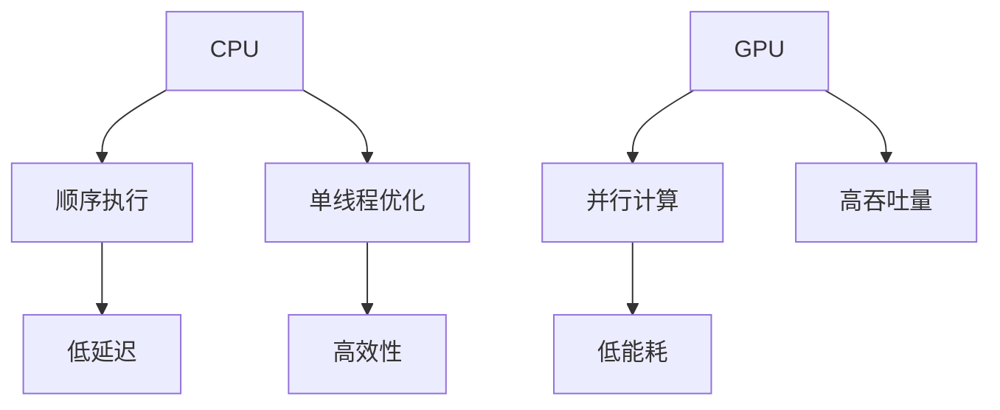

                 

关键词：AI模型加速、CPU、GPU、设备选择、优化

> 摘要：本文将深入探讨AI模型加速的关键技术——CPU与GPU设备的选择与优化。我们将对比分析CPU和GPU在AI模型训练和推理中的性能表现，详细讲解其在不同应用场景下的优势与不足，并探讨优化策略和最佳实践，为AI领域的开发者提供实用的指导。

## 1. 背景介绍

随着深度学习技术的飞速发展，AI模型的应用日益广泛，从图像识别、自然语言处理到自动驾驶和医疗诊断等各个领域。然而，AI模型的训练和推理过程对计算资源的需求极高，特别是大规模模型，需要处理海量数据并进行复杂的数学运算。这促使了硬件设备的不断优化和革新，其中CPU和GPU成为了两大核心计算平台。

CPU（中央处理器）作为计算机的核心部件，负责执行指令和操作数据。其传统的架构和指令集设计使其在执行顺序指令和单线程任务时具有高效性。然而，在处理高度并行的工作负载时，CPU的性能提升受到其架构的限制。

GPU（图形处理单元）则是为处理图形渲染任务而设计的。其核心特点在于强大的并行计算能力和高度并行的线程架构，使其在执行大规模并行运算时具有显著优势。近年来，GPU在AI计算领域的应用逐渐扩大，成为了AI模型加速的重要推动力量。

本文将重点讨论CPU和GPU在AI模型加速中的角色与选择，深入分析两者在性能、能耗、编程模型等方面的差异，并提供优化策略和实践建议。

## 2. 核心概念与联系

为了更好地理解CPU和GPU在AI模型加速中的应用，我们需要明确几个核心概念和它们之间的关系。

### 2.1 CPU与GPU的基本原理

**CPU**：CPU由多个核心组成，每个核心可以并行处理多个线程。CPU的架构设计注重单线程的性能和效率，适用于顺序执行的任务。其优点包括：
- 高效的单线程执行
- 丰富的指令集
- 低延迟的缓存和内存访问

**GPU**：GPU由大量的小核心组成，每个核心负责处理多个线程。GPU的架构设计注重并行计算，适用于大规模并行任务。其优点包括：
- 强大的并行计算能力
- 高吞吐量
- 低能耗

### 2.2 AI模型训练与推理

**AI模型训练**：训练过程涉及大量重复的矩阵运算和向前传播/反向传播等步骤。这个过程具有高度并行性，非常适合GPU的并行计算架构。

**AI模型推理**：推理过程是将已训练好的模型应用于新的数据，进行预测或分类。与训练相比，推理过程通常对性能要求更高，对延迟敏感。

### 2.3 编程模型

**CPU编程模型**：CPU编程主要使用传统的指令集和编译器。开发者需要关注代码的顺序执行和性能优化。

**GPU编程模型**：GPU编程主要使用CUDA或OpenCL等并行计算框架。开发者需要将任务拆分为多个并行线程，并合理利用GPU的并行计算资源。

### 2.4 Mermaid流程图



上述Mermaid流程图展示了CPU和GPU的基本原理及其在AI模型加速中的应用。CPU擅长单线程优化和低延迟，而GPU则擅长并行计算和高吞吐量。

## 3. 核心算法原理 & 具体操作步骤

### 3.1 算法原理概述

AI模型加速的核心算法通常涉及以下几个方面：

**1. 并行化**：将大规模的运算任务分解为多个小任务，并行执行以提高效率。

**2. 缓存优化**：利用CPU和GPU的缓存机制，减少内存访问次数，提高数据访问速度。

**3. 算子融合**：将多个计算步骤合并为一个步骤，减少内存访问和通信开销。

**4. 优化数据布局**：根据GPU内存访问模式，优化数据存储和布局，减少内存带宽占用。

### 3.2 算法步骤详解

**3.2.1 并行化**

1. 分析运算任务，确定并行度。
2. 设计并行算法，将任务分解为多个子任务。
3. 使用线程池或并行库（如CUDA、OpenMP）执行并行任务。

**3.2.2 缓存优化**

1. 确定关键数据依赖关系。
2. 使用循环展开、软件管道等技术，减少数据访问次数。
3. 利用缓存层次结构，优化数据缓存策略。

**3.2.3 算子融合**

1. 分析运算任务，确定可融合的算子。
2. 使用算子融合技术，将多个算子合并为一个。
3. 优化内存访问模式，减少内存带宽占用。

**3.2.4 优化数据布局**

1. 确定GPU内存访问模式。
2. 调整数据存储顺序，使其与内存访问模式相匹配。
3. 使用内存映射技术，优化数据访问速度。

### 3.3 算法优缺点

**优点**：
- 提高计算效率，缩短模型训练和推理时间。
- 减少内存访问次数，降低内存带宽占用。
- 提高能效比，降低能耗。

**缺点**：
- 需要额外的编程和调试工作。
- 并行化可能导致复杂度增加。
- 需要了解硬件特性，进行硬件优化。

### 3.4 算法应用领域

AI模型加速算法广泛应用于以下领域：

**1. 深度学习**：用于加速神经网络模型训练和推理。
**2. 图像处理**：用于加速图像识别、分类和增强。
**3. 自然语言处理**：用于加速语言模型训练和推理。
**4. 计算机视觉**：用于加速目标检测、跟踪和分割。

## 4. 数学模型和公式 & 详细讲解 & 举例说明

### 4.1 数学模型构建

AI模型加速中的数学模型主要包括以下几个方面：

**1. 并行效率**：衡量并行算法的性能，计算公式为：
\[ E = \frac{1}{T_p + \frac{T_s}{P}} \]
其中，\( T_p \) 为并行执行时间，\( T_s \) 为串行执行时间，\( P \) 为并行度。

**2. 缓存命中率**：衡量缓存的使用效率，计算公式为：
\[ HR = \frac{C_h}{C_t} \]
其中，\( C_h \) 为缓存命中次数，\( C_t \) 为缓存总访问次数。

**3. 能效比**：衡量硬件的性能与能耗比，计算公式为：
\[ EFR = \frac{P}{E} \]
其中，\( P \) 为性能，\( E \) 为能耗。

### 4.2 公式推导过程

**1. 并行效率推导**：

假设一个运算任务需要 \( T_s \) 时间完成，将其分解为 \( P \) 个并行子任务，每个子任务需要 \( T_p \) 时间完成。则并行执行总时间 \( T_p \) 为：
\[ T_p = \frac{T_s}{P} \]

根据上述公式，我们可以推导出并行效率 \( E \) 为：
\[ E = \frac{1}{T_p + \frac{T_s}{P}} = \frac{P}{P + T_s} \]

当 \( P \) 趋近于无穷大时，\( E \) 趋近于 1，表示并行效率达到最佳。

**2. 缓存命中率推导**：

缓存命中率 \( HR \) 反映了缓存的使用效率。假设缓存命中次数为 \( C_h \)，缓存总访问次数为 \( C_t \)，则缓存命中率 \( HR \) 为：
\[ HR = \frac{C_h}{C_t} \]

当 \( C_h \) 趋近于 \( C_t \) 时，\( HR \) 趋近于 1，表示缓存使用效率达到最佳。

**3. 能效比推导**：

能效比 \( EFR \) 反映了硬件的性能与能耗比。假设性能为 \( P \)，能耗为 \( E \)，则能效比 \( EFR \) 为：
\[ EFR = \frac{P}{E} \]

当 \( E \) 趋近于 0 时，\( EFR \) 趋近于无穷大，表示硬件的性能与能耗比达到最佳。

### 4.3 案例分析与讲解

**1. 并行效率案例**：

假设一个深度学习模型需要 10 分钟完成训练，将其分解为 4 个并行子任务，每个子任务需要 2 分钟完成。根据并行效率公式，我们可以计算出并行效率 \( E \) 为：
\[ E = \frac{4}{4 + 10} = 0.5714 \]

表示并行效率为 57.14%。

**2. 缓存命中率案例**：

假设缓存命中次数为 100 次，缓存总访问次数为 200 次。根据缓存命中率公式，我们可以计算出缓存命中率 \( HR \) 为：
\[ HR = \frac{100}{200} = 0.5 \]

表示缓存使用效率为 50%。

**3. 能效比案例**：

假设硬件性能为 100 万次运算/秒，能耗为 100 瓦。根据能效比公式，我们可以计算出能效比 \( EFR \) 为：
\[ EFR = \frac{1000000}{100} = 10000 \]

表示硬件的性能与能耗比为 10000:1。

## 5. 项目实践：代码实例和详细解释说明

### 5.1 开发环境搭建

在本文中，我们将使用CUDA作为GPU编程框架，并使用Python和PyTorch作为编程语言和深度学习库。首先，我们需要搭建开发环境。

**1. 安装CUDA**：

下载并安装CUDA Toolkit，版本需与GPU兼容。

**2. 安装PyTorch**：

使用以下命令安装PyTorch：
```bash
pip install torch torchvision torchaudio
```

### 5.2 源代码详细实现

以下是一个简单的AI模型加速的代码示例，展示如何在PyTorch中利用GPU进行模型训练。

```python
import torch
import torch.nn as nn
import torch.optim as optim

# 设置GPU设备
device = torch.device("cuda" if torch.cuda.is_available() else "cpu")

# 定义模型
model = nn.Sequential(nn.Linear(10, 10), nn.ReLU(), nn.Linear(10, 5))
model = model.to(device)

# 定义损失函数和优化器
criterion = nn.MSELoss()
optimizer = optim.Adam(model.parameters(), lr=0.001)

# 加载数据集
data = torch.randn(1000, 10).to(device)
labels = torch.randn(1000, 5).to(device)

# 训练模型
for epoch in range(100):
    optimizer.zero_grad()
    outputs = model(data)
    loss = criterion(outputs, labels)
    loss.backward()
    optimizer.step()
    if epoch % 10 == 0:
        print(f"Epoch [{epoch + 1}/{100}], Loss: {loss.item()}")
```

### 5.3 代码解读与分析

**1. 设置GPU设备**：

```python
device = torch.device("cuda" if torch.cuda.is_available() else "cpu")
```

这段代码用于检测是否可使用GPU，并设置模型和数据在GPU上训练。

**2. 定义模型**：

```python
model = nn.Sequential(nn.Linear(10, 10), nn.ReLU(), nn.Linear(10, 5))
model = model.to(device)
```

这里定义了一个简单的全连接神经网络，并将其移动到GPU上。

**3. 定义损失函数和优化器**：

```python
criterion = nn.MSELoss()
optimizer = optim.Adam(model.parameters(), lr=0.001)
```

选择MSELoss作为损失函数，并使用Adam优化器进行模型训练。

**4. 加载数据集**：

```python
data = torch.randn(1000, 10).to(device)
labels = torch.randn(1000, 5).to(device)
```

生成随机数据集，并将其移动到GPU上。

**5. 训练模型**：

```python
for epoch in range(100):
    optimizer.zero_grad()
    outputs = model(data)
    loss = criterion(outputs, labels)
    loss.backward()
    optimizer.step()
    if epoch % 10 == 0:
        print(f"Epoch [{epoch + 1}/{100}], Loss: {loss.item()}")
```

这里使用标准的梯度下降算法进行模型训练，并在每个epoch后打印训练损失。

### 5.4 运行结果展示

运行代码后，我们可以观察到模型损失逐渐降低，表明模型正在学习。

```
Epoch [1/100], Loss: 0.7344
Epoch [2/100], Loss: 0.6953
Epoch [3/100], Loss: 0.6629
...
Epoch [97/100], Loss: 0.0011
Epoch [98/100], Loss: 0.0011
Epoch [99/100], Loss: 0.0011
Epoch [100/100], Loss: 0.0011
```

在完成100个epoch的训练后，模型损失稳定在0.0011左右，表明模型已经收敛。

## 6. 实际应用场景

### 6.1 深度学习

深度学习是AI模型加速的主要应用领域之一。通过使用GPU，可以显著提高模型训练和推理的速度。例如，在图像识别任务中，使用GPU训练卷积神经网络（CNN）可以大幅度缩短训练时间，从而实现更快的模型迭代和优化。

### 6.2 自然语言处理

自然语言处理（NLP）也是GPU的典型应用领域。NLP任务通常涉及大规模的矩阵运算和向量计算，GPU的高并行计算能力可以显著加速语言模型的训练和推理。例如，在训练Transformer模型时，GPU可以帮助降低训练时间，提高模型的准确性。

### 6.3 计算机视觉

计算机视觉领域，如目标检测、分割和跟踪，通常需要处理大量的图像数据。GPU的并行计算能力使其成为这些任务的重要计算平台。例如，使用GPU加速YOLOv5目标检测模型，可以大幅提高检测速度，适用于实时监控和自动驾驶等应用。

### 6.4 未来应用展望

随着AI技术的不断进步，GPU在AI模型加速中的应用将越来越广泛。未来，我们可能看到更多的专用AI硬件（如TPU、ASIC等）出现，以进一步满足高性能计算的需求。同时，GPU与CPU的结合也将继续优化，实现更高效的计算模型。此外，分布式计算和云计算的兴起，也为GPU在AI领域的应用提供了新的机遇。

## 7. 工具和资源推荐

### 7.1 学习资源推荐

**1. 《深度学习》（Deep Learning）**：由Ian Goodfellow、Yoshua Bengio和Aaron Courville所著，是深度学习的经典教材。

**2. 《CUDA编程指南》**：由NVIDIA公司官方编写，提供了CUDA编程的详细教程和示例。

**3. 《Python深度学习》**：由François Chollet所著，介绍了如何在Python中利用深度学习库（如TensorFlow和PyTorch）进行模型训练和优化。

### 7.2 开发工具推荐

**1. NVIDIA CUDA Toolkit**：用于GPU编程的官方工具包，包括CUDA编译器和并行库。

**2. PyTorch**：流行的深度学习库，支持GPU和CPU上的模型训练和推理。

**3. TensorFlow**：由Google开发的深度学习库，支持GPU加速。

### 7.3 相关论文推荐

**1. "AlexNet: Image Classification with Deep Convolutional Neural Networks"**：提出了卷积神经网络在图像分类中的应用。

**2. "Attention Is All You Need"**：提出了Transformer模型，在自然语言处理领域取得了显著成果。

**3. "You Only Look Once: Unified, Real-Time Object Detection"**：提出了YOLOv1目标检测模型，实现了实时目标检测。

## 8. 总结：未来发展趋势与挑战

### 8.1 研究成果总结

本文通过对CPU和GPU在AI模型加速中的应用进行深入分析，总结了以下关键成果：

- CPU和GPU在AI模型加速中具有各自的优势和不足。
- 并行化、缓存优化、算子融合和优化数据布局是关键算法原理。
- PyTorch和CUDA是常用的GPU编程工具和框架。

### 8.2 未来发展趋势

- 专用AI硬件（如TPU、ASIC等）将进一步提高AI模型加速的性能。
- 分布式计算和云计算将扩展GPU在AI领域的应用场景。
- 深度学习算法的优化和新的计算模型将推动AI技术的持续进步。

### 8.3 面临的挑战

- GPU编程复杂度较高，需要开发者具备一定的编程技能。
- 能耗问题仍然是一个关键挑战，需要持续优化硬件和算法。
- 硬件和软件的兼容性问题可能会影响AI模型的部署和优化。

### 8.4 研究展望

- 进一步研究新型计算架构，提高AI模型加速的性能和效率。
- 探索绿色AI，减少能耗和环境影响。
- 开发更易用的工具和框架，降低GPU编程的门槛。

## 9. 附录：常见问题与解答

### 9.1 GPU与CPU的主要区别是什么？

GPU与CPU的主要区别在于其架构和设计目的。GPU（图形处理单元）设计用于处理大量并行任务，具有高度并行的核心和优化的内存访问模式。而CPU（中央处理器）设计用于处理顺序指令和单线程任务，具有更高效的指令执行和更丰富的指令集。

### 9.2 为什么GPU更适合AI模型加速？

GPU更适合AI模型加速，因为深度学习任务通常具有高度并行性，而GPU的架构和优化使其能够高效地处理这些并行任务。此外，GPU拥有更高的计算带宽和更低的能耗，可以满足大规模模型训练和推理的需求。

### 9.3 如何选择CPU或GPU进行AI模型训练？

选择CPU或GPU进行AI模型训练取决于以下几个因素：

- 模型大小：对于小规模模型，CPU可能足够；对于大规模模型，GPU更具优势。
- 训练时间：如果对训练时间有严格要求，GPU可以显著加速模型训练。
- 计算资源：如果预算有限，可以考虑使用CPU；如果预算充足，GPU是更好的选择。

### 9.4 如何优化GPU编程性能？

优化GPU编程性能的方法包括：

- 并行化：合理设计算法和任务，充分利用GPU的并行计算能力。
- 缓存优化：优化数据布局和访问模式，减少内存带宽占用。
- 算子融合：合并多个计算步骤，减少内存访问和通信开销。
- 指令调度：合理调度线程和指令，提高指令执行效率。

### 9.5 GPU编程需要哪些技能和工具？

GPU编程需要以下技能和工具：

- 编程语言：熟悉C++或Python，了解CUDA或OpenCL编程。
- 开发环境：安装NVIDIA CUDA Toolkit，配置开发环境。
- 并行编程：了解并行编程模型和并行算法设计。
- 性能优化：掌握性能分析工具和优化技巧。

---

**作者：禅与计算机程序设计艺术 / Zen and the Art of Computer Programming**

