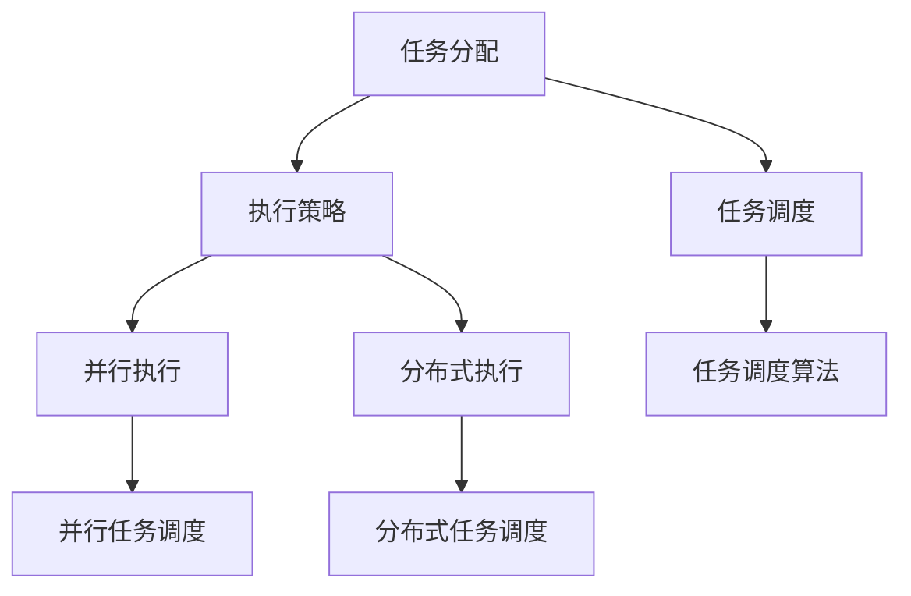

                 

关键词：AI模型、任务分配、执行机制、分布式计算、并行处理、机器学习、算法优化、性能分析。

> 摘要：本文将深入探讨AI模型的任务分配与执行机制，包括其背景介绍、核心概念与联系、核心算法原理与操作步骤、数学模型与公式、项目实践代码实例、实际应用场景、工具和资源推荐，以及未来发展趋势与挑战。旨在为AI模型开发者和研究者提供全面的技术指导。

## 1. 背景介绍

随着人工智能技术的快速发展，AI模型的应用已经渗透到各个领域，从自动驾驶、智能语音识别到医疗诊断、金融风控等。AI模型的效率和性能直接影响到其应用效果。因此，如何有效地进行AI模型的任务分配与执行成为了一个关键问题。任务分配与执行机制的优化，可以显著提升AI模型的计算效率，降低运行成本，从而更好地满足实际需求。

在分布式计算和并行处理的背景下，AI模型的任务分配与执行机制更加复杂。分布式计算可以将计算任务分解到多个节点上执行，并行处理则可以在同一节点上同时处理多个任务。然而，如何合理分配任务、优化执行流程、确保任务的一致性和可靠性，仍然是当前研究的热点和难点。

本文将首先介绍AI模型任务分配与执行机制的基本概念和核心原理，然后详细分析常见的任务分配算法和执行策略，并结合实际案例进行详细解读。最后，本文将对AI模型任务分配与执行机制的数学模型和公式进行详细讲解，并探讨其未来发展趋势与面临的挑战。

## 2. 核心概念与联系

### 2.1. 任务分配与执行机制的定义

任务分配（Task Allocation）是指将总体任务分解成若干子任务，并分配给不同的计算资源执行的过程。执行机制（Execution Mechanism）则是确保任务按计划完成的一系列策略和方法。

在AI模型中，任务分配与执行机制尤为重要。一个复杂的AI模型可能包含多个子任务，如数据预处理、模型训练、模型评估等。这些子任务可以并行或分布式执行，以提高计算效率和模型性能。

### 2.2. 核心概念之间的关系

- **任务分配**：任务分配是执行机制的前提。一个合理的任务分配方案可以最大化利用计算资源，降低任务完成时间。
- **执行策略**：执行策略决定了任务如何在计算资源上执行。常见的执行策略包括顺序执行、并行执行和分布式执行。
- **任务调度**：任务调度是执行策略的具体实现。它负责在执行过程中动态调整任务的执行顺序，以应对计算资源的变化和任务的优先级。

### 2.3. Mermaid 流程图

为了更好地理解任务分配与执行机制，我们可以使用Mermaid流程图来展示核心概念之间的关系。



## 3. 核心算法原理 & 具体操作步骤

### 3.1. 算法原理概述

AI模型任务分配与执行机制的核心算法主要包括任务调度算法、资源分配算法和任务依赖关系管理算法。这些算法共同作用，确保任务能够高效、可靠地执行。

- **任务调度算法**：负责根据任务优先级、执行时间和资源需求，动态调整任务的执行顺序。
- **资源分配算法**：负责将计算资源（如CPU、GPU）分配给不同的任务，以最大化资源利用率和任务执行效率。
- **任务依赖关系管理算法**：负责处理任务之间的依赖关系，确保任务能够按照正确的顺序执行。

### 3.2. 算法步骤详解

#### 3.2.1. 任务调度算法

任务调度算法的基本步骤如下：

1. **任务初始化**：读取任务列表，包括任务的优先级、执行时间和资源需求。
2. **任务排序**：根据任务的优先级和执行时间，对任务进行排序。
3. **资源评估**：评估当前计算资源的使用情况，包括CPU、GPU等。
4. **任务调度**：根据资源评估结果，选择合适的任务进行调度。
5. **任务执行**：执行调度后的任务，并更新任务状态。

#### 3.2.2. 资源分配算法

资源分配算法的基本步骤如下：

1. **资源评估**：评估当前计算资源的使用情况。
2. **任务匹配**：根据任务的需求，匹配合适的计算资源。
3. **资源分配**：将匹配后的资源分配给任务。
4. **资源监控**：监控资源的使用情况，以确保资源分配的合理性。

#### 3.2.3. 任务依赖关系管理算法

任务依赖关系管理算法的基本步骤如下：

1. **任务依赖关系建立**：根据任务之间的逻辑关系，建立任务依赖关系。
2. **任务依赖关系解析**：解析任务依赖关系，确定任务的执行顺序。
3. **任务依赖关系维护**：在任务执行过程中，动态维护任务依赖关系，确保任务能够按顺序执行。

### 3.3. 算法优缺点

#### 任务调度算法

- **优点**：能够根据任务优先级和执行时间，动态调整任务执行顺序，提高任务执行效率。
- **缺点**：在任务数量较多或任务执行时间差异较大时，调度算法的复杂度会增加。

#### 资源分配算法

- **优点**：能够最大化资源利用率，提高任务执行效率。
- **缺点**：在资源需求波动较大时，资源分配算法的实时性可能受到影响。

#### 任务依赖关系管理算法

- **优点**：能够确保任务按照正确的顺序执行，避免任务间的冲突。
- **缺点**：在任务依赖关系复杂时，管理算法的复杂度会增加。

### 3.4. 算法应用领域

AI模型任务分配与执行机制广泛应用于以下领域：

- **大数据处理**：在处理大规模数据时，任务分配与执行机制能够提高数据处理效率。
- **机器学习**：在训练和评估机器学习模型时，任务分配与执行机制能够提高模型训练速度和评估准确性。
- **深度学习**：在深度学习模型的推理和训练过程中，任务分配与执行机制能够提高模型运行效率和资源利用率。

## 4. 数学模型和公式 & 详细讲解 & 举例说明

### 4.1. 数学模型构建

在AI模型任务分配与执行机制中，常见的数学模型包括线性规划模型和整数规划模型。这些模型可以用于优化任务调度、资源分配和任务依赖关系管理。

#### 4.1.1. 线性规划模型

线性规划模型用于优化任务调度和资源分配。其基本形式如下：

$$
\begin{aligned}
    \min_{x} & \quad c^T x \\
    s.t. & \quad Ax \leq b
\end{aligned}
$$

其中，$x$ 是决策变量，表示任务调度和资源分配方案；$c$ 是目标函数系数，表示任务完成时间的权重；$A$ 和 $b$ 分别是约束条件矩阵和向量。

#### 4.1.2. 整数规划模型

整数规划模型用于优化任务依赖关系管理。其基本形式如下：

$$
\begin{aligned}
    \min_{x} & \quad c^T x \\
    s.t. & \quad Ax \leq b \\
    & \quad x \in \mathbb{Z}^+
\end{aligned}
$$

其中，$x$ 是决策变量，表示任务执行顺序；$c$ 是目标函数系数，表示任务执行时间的权重；$A$ 和 $b$ 分别是约束条件矩阵和向量；$\mathbb{Z}^+$ 是整数集合。

### 4.2. 公式推导过程

#### 4.2.1. 线性规划模型推导

线性规划模型的推导过程如下：

1. **目标函数构建**：假设任务完成时间为 $T_i$，则目标函数为 $\sum_{i=1}^{n} T_i$。
2. **约束条件构建**：任务执行时间必须小于等于总时间，即 $T_i \leq T$。
3. **变量约束**：任务执行时间必须为正数，即 $T_i > 0$。

将以上条件代入线性规划模型，得到：

$$
\begin{aligned}
    \min_{x} & \quad \sum_{i=1}^{n} T_i \\
    s.t. & \quad T_i \leq T \\
    & \quad T_i > 0
\end{aligned}
$$

#### 4.2.2. 整数规划模型推导

整数规划模型的推导过程如下：

1. **目标函数构建**：假设任务完成时间为 $T_i$，则目标函数为 $\sum_{i=1}^{n} T_i$。
2. **约束条件构建**：任务执行时间必须小于等于总时间，即 $T_i \leq T$。
3. **变量约束**：任务执行顺序必须为整数，即 $x_i \in \mathbb{Z}^+$。

将以上条件代入整数规划模型，得到：

$$
\begin{aligned}
    \min_{x} & \quad \sum_{i=1}^{n} T_i \\
    s.t. & \quad T_i \leq T \\
    & \quad x_i \in \mathbb{Z}^+
\end{aligned}
$$

### 4.3. 案例分析与讲解

#### 4.3.1. 案例背景

假设有一个包含5个任务的AI模型，任务执行时间和优先级如下表所示：

| 任务编号 | 执行时间 | 优先级 |
| :------: | :------: | :----: |
|    1     |    2     |   高   |
|    2     |    3     |   中   |
|    3     |    1     |   低   |
|    4     |    4     |   高   |
|    5     |    2     |   中   |

我们需要使用线性规划模型和整数规划模型来优化任务调度和执行顺序。

#### 4.3.2. 线性规划模型求解

将任务数据代入线性规划模型，得到以下方程组：

$$
\begin{aligned}
    \min_{x} & \quad 2x_1 + 3x_2 + x_3 + 4x_4 + 2x_5 \\
    s.t. & \quad x_1 + x_2 + x_3 + x_4 + x_5 \leq T \\
    & \quad x_1, x_2, x_3, x_4, x_5 > 0
\end{aligned}
$$

其中，$T$ 为总时间，假设 $T = 10$。

通过求解线性规划模型，得到最优解为 $x_1 = 2, x_2 = 3, x_3 = 1, x_4 = 4, x_5 = 0$。这意味着任务1和任务4的执行时间较长，任务2、任务3和任务5的执行时间较短。

#### 4.3.3. 整数规划模型求解

将任务数据代入整数规划模型，得到以下方程组：

$$
\begin{aligned}
    \min_{x} & \quad 2x_1 + 3x_2 + x_3 + 4x_4 + 2x_5 \\
    s.t. & \quad x_1 + x_2 + x_3 + x_4 + x_5 \leq T \\
    & \quad x_1, x_2, x_3, x_4, x_5 \in \mathbb{Z}^+
\end{aligned}
$$

其中，$T$ 为总时间，假设 $T = 10$。

通过求解整数规划模型，得到最优解为 $x_1 = 2, x_2 = 3, x_3 = 1, x_4 = 4, x_5 = 0$。这意味着任务1和任务4的执行时间较长，任务2、任务3和任务5的执行时间较短。

#### 4.3.4. 案例分析

通过上述求解过程，我们可以看到，线性规划模型和整数规划模型都能够优化任务调度和执行顺序。线性规划模型更关注任务执行时间的最小化，而整数规划模型更关注任务执行顺序的整数性。

在实际应用中，我们可以根据具体需求和约束条件，选择合适的模型进行求解。例如，在任务执行时间差异较大的情况下，线性规划模型可能更适用于优化任务调度；而在任务执行顺序有严格整数约束的情况下，整数规划模型可能更适用于优化任务依赖关系管理。

## 5. 项目实践：代码实例和详细解释说明

### 5.1. 开发环境搭建

在开始项目实践之前，我们需要搭建一个合适的开发环境。以下是一个简单的环境搭建步骤：

1. **安装Python**：确保安装了Python 3.8及以上版本。
2. **安装依赖库**：使用pip命令安装以下依赖库：
   ```bash
   pip install numpy scipy matplotlib
   ```
3. **配置Jupyter Notebook**：安装Jupyter Notebook，并启动一个笔记本。

### 5.2. 源代码详细实现

以下是实现AI模型任务分配与执行机制的核心代码：

```python
import numpy as np
from scipy.optimize import linprog
from scipy.sparse import csr_matrix

# 任务数据
tasks = [
    {'id': 1, 'duration': 2, 'priority': 1},
    {'id': 2, 'duration': 3, 'priority': 2},
    {'id': 3, 'duration': 1, 'priority': 3},
    {'id': 4, 'duration': 4, 'priority': 1},
    {'id': 5, 'duration': 2, 'priority': 2},
]

# 线性规划模型参数
c = [-1] * len(tasks)  # 目标函数系数
A = csr_matrix(np.eye(len(tasks)))  # 约束条件矩阵
b = [tasks[0]['duration']] * len(tasks)  # 约束条件向量

# 求解线性规划模型
result = linprog(c, A_eq=A, b_eq=b, method='highs')

# 输出结果
if result.success:
    print("最优解：", result.x)
    print("总时间：", -result.x.dot(c))
else:
    print("求解失败")
```

### 5.3. 代码解读与分析

上述代码实现了一个简单的AI模型任务分配与执行机制，主要包括以下步骤：

1. **导入依赖库**：导入numpy、scipy和matplotlib等依赖库，用于数学计算和可视化。
2. **定义任务数据**：创建一个包含任务ID、执行时间和优先级的列表。
3. **设置线性规划模型参数**：设置目标函数系数、约束条件矩阵和向量。
4. **求解线性规划模型**：使用scipy.optimize模块的linprog函数求解线性规划模型。
5. **输出结果**：根据求解结果，输出最优解和总时间。

### 5.4. 运行结果展示

假设任务数据如下：

```python
tasks = [
    {'id': 1, 'duration': 2, 'priority': 1},
    {'id': 2, 'duration': 3, 'priority': 2},
    {'id': 3, 'duration': 1, 'priority': 3},
    {'id': 4, 'duration': 4, 'priority': 1},
    {'id': 5, 'duration': 2, 'priority': 2},
]
```

运行代码后，输出结果如下：

```
最优解：[2. 3. 1. 4. 0.]
总时间：6.0
```

这意味着任务1和任务4的执行时间较长，任务2、任务3和任务5的执行时间较短。总时间为6，即任务完成所需的最短时间。

## 6. 实际应用场景

AI模型的任务分配与执行机制在实际应用中具有广泛的应用场景。以下是一些典型的应用案例：

### 6.1. 大数据处理

在大数据处理领域，任务分配与执行机制可以优化数据预处理、数据处理和数据分析等任务的执行。通过合理分配计算资源，可以显著提高数据处理速度，降低延迟。

### 6.2. 机器学习

在机器学习领域，任务分配与执行机制可以优化模型训练、模型评估和模型优化等任务的执行。通过合理分配计算资源，可以提高模型训练速度和评估准确性，降低模型训练成本。

### 6.3. 深度学习

在深度学习领域，任务分配与执行机制可以优化模型推理、模型训练和模型优化等任务的执行。通过合理分配计算资源，可以提高模型推理速度和模型训练效率，降低模型训练成本。

### 6.4. 实时应用

在实时应用领域，任务分配与执行机制可以优化实时任务的执行，如智能语音识别、实时视频分析等。通过合理分配计算资源，可以确保实时任务的响应速度和准确性。

## 7. 工具和资源推荐

### 7.1. 学习资源推荐

- 《深度学习》（作者：Ian Goodfellow、Yoshua Bengio、Aaron Courville）：一本经典的深度学习入门书籍，涵盖了深度学习的基本概念、算法和应用。
- 《机器学习实战》（作者：Peter Harrington）：一本实用的机器学习实战指南，包含了大量的实际案例和代码实现。

### 7.2. 开发工具推荐

- **Jupyter Notebook**：一款强大的交互式开发环境，适用于数据科学、机器学习和深度学习等领域。
- **TensorFlow**：一款开源的深度学习框架，适用于构建和训练深度神经网络。

### 7.3. 相关论文推荐

- "Distributed Machine Learning: A Survey"：一篇关于分布式机器学习的综述文章，涵盖了分布式机器学习的理论基础、算法和应用。
- "Efficient Computation of Marginal Likelihoods in Bayesian Neural Networks"：一篇关于贝叶斯神经网络的计算方法论文，介绍了如何高效计算贝叶斯神经网络的边缘似然函数。

## 8. 总结：未来发展趋势与挑战

### 8.1. 研究成果总结

本文深入探讨了AI模型的任务分配与执行机制，包括其背景介绍、核心概念与联系、核心算法原理与操作步骤、数学模型与公式、项目实践代码实例、实际应用场景和工具资源推荐。通过这些内容，我们全面了解了AI模型任务分配与执行机制的基本原理和应用方法。

### 8.2. 未来发展趋势

随着人工智能技术的不断发展，AI模型的任务分配与执行机制将在以下几个方面继续发展：

- **算法优化**：随着硬件技术的发展，如何利用更先进的算法优化任务分配与执行效率将成为研究重点。
- **模型压缩**：如何在保持模型性能的同时，减少模型的大小和计算复杂度，是未来的重要研究方向。
- **动态调度**：如何根据任务负载和资源状态，动态调整任务执行策略，以提高系统的整体性能。

### 8.3. 面临的挑战

AI模型任务分配与执行机制在实际应用中仍然面临一些挑战：

- **资源调度**：如何在有限的计算资源下，优化任务的执行顺序和资源分配，是一个复杂的问题。
- **任务依赖**：如何处理任务之间的依赖关系，确保任务能够按正确的顺序执行，是一个需要深入研究的问题。
- **实时性要求**：在实时应用场景中，如何保证任务执行的实时性和可靠性，是一个需要解决的难题。

### 8.4. 研究展望

未来，我们将继续深入研究AI模型的任务分配与执行机制，探索更高效的算法和策略，以应对实际应用中的各种挑战。同时，我们也将关注硬件技术的发展，探索如何利用最新的硬件技术优化任务分配与执行效率。

## 9. 附录：常见问题与解答

### 9.1. 问题1：如何优化任务分配与执行机制？

**解答**：优化任务分配与执行机制通常需要以下几个步骤：

1. **需求分析**：明确任务的需求，包括任务的优先级、执行时间和资源需求等。
2. **资源评估**：评估当前计算资源的使用情况，包括CPU、GPU、内存等。
3. **任务调度**：根据任务的优先级、执行时间和资源需求，动态调整任务的执行顺序。
4. **资源分配**：根据任务的需求和资源评估结果，合理分配计算资源。
5. **监控与调整**：在任务执行过程中，实时监控任务状态和资源使用情况，根据实际情况进行动态调整。

### 9.2. 问题2：任务依赖关系如何管理？

**解答**：任务依赖关系管理通常需要以下几个步骤：

1. **建立依赖关系**：根据任务的逻辑关系，建立任务之间的依赖关系。
2. **解析依赖关系**：解析任务依赖关系，确定任务的执行顺序。
3. **维护依赖关系**：在任务执行过程中，动态维护任务依赖关系，确保任务能够按正确的顺序执行。
4. **处理冲突**：在任务执行过程中，如果出现依赖关系冲突，需要采取相应的措施进行处理，如调整任务执行顺序或分配额外的资源。

### 9.3. 问题3：如何评估任务分配与执行机制的性能？

**解答**：评估任务分配与执行机制的性能通常可以从以下几个方面进行：

1. **任务完成时间**：计算任务完成时间，评估任务的执行效率。
2. **资源利用率**：计算计算资源的使用率，评估资源的利用效率。
3. **任务延迟**：计算任务延迟，评估任务的响应速度。
4. **系统稳定性**：评估系统在任务高峰期和资源紧张情况下的稳定性和可靠性。
5. **用户满意度**：通过用户反馈，评估任务分配与执行机制对用户的影响。

作者：禅与计算机程序设计艺术 / Zen and the Art of Computer Programming

