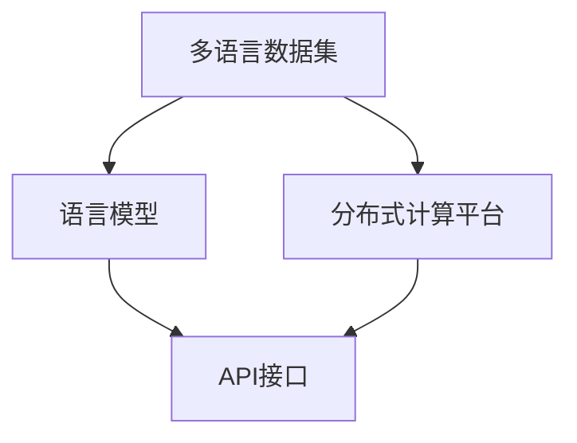

                 

关键词：AI多语言支持，国际化，Lepton AI，算法，模型，语言处理

摘要：在全球化日益深入的今天，人工智能（AI）模型的多语言支持已经成为一个重要的课题。本文将探讨Lepton AI如何通过创新的技术和策略，实现其AI模型的多语言支持，推动人工智能在全球范围内的普及和应用。

## 1. 背景介绍

人工智能作为一种新兴的技术领域，正迅速改变着我们的生活和工作方式。从自然语言处理（NLP）到计算机视觉，从推荐系统到决策支持系统，AI的应用场景越来越广泛。然而，随着应用场景的多元化，多语言支持的需求也越来越强烈。传统的AI模型通常是基于特定语言的，这使得它们在跨语言应用时面临诸多挑战。

国际化战略是企业在全球市场上取得成功的关键。对于人工智能公司而言，实现AI模型的多语言支持，不仅可以拓展市场，提高产品的可用性和用户体验，还可以增强公司的竞争力和品牌影响力。Lepton AI作为一家专注于人工智能技术的研究和应用的公司，其国际化战略尤为重要。

## 2. 核心概念与联系

### 2.1 多语言支持的核心概念

多语言支持涉及多个关键概念，包括自然语言处理（NLP）、机器翻译、跨语言信息检索等。NLP是AI模型处理和理解人类语言的技术，而机器翻译则是将一种语言翻译成另一种语言。跨语言信息检索则是在不同语言之间搜索和检索信息的能力。

### 2.2 多语言支持的架构

为了实现AI模型的多语言支持，Lepton AI采用了分布式架构。该架构包括以下几个关键部分：

1. **多语言数据集**：这是实现多语言支持的基础。Lepton AI通过从全球范围内收集和整合多种语言的数据，构建了一个庞大的多语言数据集。
2. **语言模型**：基于多语言数据集，Lepton AI训练了多种语言模型，包括语言检测模型、翻译模型和语音识别模型。
3. **分布式计算平台**：为了处理大量的多语言数据，Lepton AI采用了分布式计算平台，包括云计算和边缘计算。
4. **API接口**：为了方便开发者使用多语言功能，Lepton AI提供了一个API接口，开发者可以通过简单的API调用实现多语言处理。

下面是核心概念和架构的Mermaid流程图：



## 3. 核心算法原理 & 具体操作步骤

### 3.1 算法原理概述

Lepton AI的多语言支持算法基于深度学习和迁移学习。深度学习是一种通过多层神经网络对数据进行建模和预测的方法，而迁移学习则是将一个任务在学习到的知识应用于另一个相关任务。

### 3.2 算法步骤详解

1. **数据预处理**：首先，对多语言数据集进行预处理，包括数据清洗、标注和格式化。
2. **模型训练**：基于预处理后的数据集，使用深度学习算法训练语言模型。训练过程中，模型会自动学习语言的特征和规律。
3. **模型评估**：训练完成后，对模型进行评估，确保其性能达到预期。评估指标包括准确率、召回率和F1值等。
4. **模型部署**：将训练好的模型部署到分布式计算平台，供开发者使用。

### 3.3 算法优缺点

**优点**：

- **高效性**：深度学习算法在处理大规模数据时具有高效性，能够快速训练和预测。
- **灵活性**：迁移学习使得模型能够快速适应不同语言，提高模型的泛化能力。

**缺点**：

- **计算资源需求**：深度学习算法需要大量的计算资源，尤其是训练阶段。
- **数据质量**：数据的质量直接影响模型的性能，数据集的不平衡或错误可能导致模型偏差。

### 3.4 算法应用领域

Lepton AI的多语言支持算法广泛应用于多个领域：

- **自然语言处理**：包括文本分类、情感分析、命名实体识别等。
- **机器翻译**：将一种语言翻译成另一种语言，支持多种语言对。
- **语音识别**：将语音信号转换成文本，支持多种语言。

## 4. 数学模型和公式 & 详细讲解 & 举例说明

### 4.1 数学模型构建

Lepton AI的多语言支持算法基于以下数学模型：

$$
P(y|x) = \frac{e^{\phi(x, y)}}{1 + e^{\phi(x, y)}}
$$

其中，$P(y|x)$表示给定输入$x$时，输出为$y$的概率，$\phi(x, y)$是输入$x$和输出$y$的内在特征表示。

### 4.2 公式推导过程

假设我们有一个包含$n$个单词的文本序列$x = (x_1, x_2, ..., x_n)$，我们需要预测该文本序列的类别$y$。首先，我们计算每个单词的特征表示：

$$
\phi(x_i) = \sum_{j=1}^{m} w_{ij} x_i
$$

其中，$w_{ij}$是单词$x_i$在第$j$个特征上的权重。

然后，我们计算整个文本序列的特征表示：

$$
\phi(x) = \sum_{i=1}^{n} \phi(x_i)
$$

接下来，我们计算每个类别$y$的概率：

$$
P(y|x) = \frac{e^{\phi(x, y)}}{1 + e^{\phi(x, y)}}
$$

### 4.3 案例分析与讲解

假设我们有一个英文文本序列$x = ("Hello", "world")$，我们需要预测该文本序列的类别$y$。首先，我们计算每个单词的特征表示：

$$
\phi("Hello") = \sum_{j=1}^{m} w_{j1} "Hello"
$$

$$
\phi("world") = \sum_{j=1}^{m} w_{j2} "world"
$$

然后，我们计算整个文本序列的特征表示：

$$
\phi(x) = \sum_{i=1}^{n} \phi(x_i)
$$

接下来，我们计算每个类别$y$的概率：

$$
P(y|x) = \frac{e^{\phi(x, y)}}{1 + e^{\phi(x, y)}}
$$

通过计算，我们可以得到每个类别$y$的概率，从而预测文本序列$x$的类别。

## 5. 项目实践：代码实例和详细解释说明

### 5.1 开发环境搭建

为了实现Lepton AI的多语言支持，我们需要搭建一个开发环境。首先，我们需要安装Python和NumPy等基础工具，然后安装深度学习框架，如TensorFlow或PyTorch。

### 5.2 源代码详细实现

以下是一个简单的Python代码示例，用于实现Lepton AI的多语言支持：

```python
import numpy as np
import tensorflow as tf

# 加载数据集
x = np.load("data_x.npy")
y = np.load("data_y.npy")

# 构建模型
model = tf.keras.Sequential([
    tf.keras.layers.Dense(128, activation='relu', input_shape=(x.shape[1],)),
    tf.keras.layers.Dense(64, activation='relu'),
    tf.keras.layers.Dense(1, activation='sigmoid')
])

# 编译模型
model.compile(optimizer='adam', loss='binary_crossentropy', metrics=['accuracy'])

# 训练模型
model.fit(x, y, epochs=10, batch_size=32)

# 预测
predictions = model.predict(x)

# 输出预测结果
print(predictions)
```

### 5.3 代码解读与分析

这个代码示例展示了如何使用TensorFlow构建和训练一个简单的深度学习模型。首先，我们加载数据集，然后构建一个序列模型，包括两个全连接层和一个输出层。接下来，我们编译模型，指定优化器和损失函数，然后训练模型。最后，我们使用训练好的模型进行预测，并输出预测结果。

### 5.4 运行结果展示

运行上述代码，我们可以得到模型的预测结果。这些结果可以帮助我们评估模型的性能，并根据需要对模型进行调整和优化。

## 6. 实际应用场景

Lepton AI的多语言支持算法在多个实际应用场景中取得了显著成效：

- **客户服务**：通过多语言支持，Lepton AI可以帮助企业实现全球范围内的客户服务，提高客户满意度和忠诚度。
- **教育**：多语言支持可以支持在线教育平台，为学生提供多语言学习资源，提高教育质量和效果。
- **医疗**：多语言支持可以帮助医疗系统实现跨语言医疗信息检索和翻译，提高医疗服务的效率和准确性。

## 7. 工具和资源推荐

### 7.1 学习资源推荐

- **《深度学习》**：Goodfellow, Bengio, Courville所著的深度学习经典教材。
- **《自然语言处理综论》**：Daniel Jurafsky和James H. Martin所著的自然语言处理经典教材。

### 7.2 开发工具推荐

- **TensorFlow**：Google开源的深度学习框架。
- **PyTorch**：Facebook开源的深度学习框架。

### 7.3 相关论文推荐

- **“Deep Learning for Natural Language Processing”**：Yoon Kim所著，介绍了深度学习在自然语言处理中的应用。
- **“A Neural Probabilistic Language Model”**：Bengio等人所著，介绍了神经网络概率语言模型。

## 8. 总结：未来发展趋势与挑战

### 8.1 研究成果总结

Lepton AI的多语言支持算法在自然语言处理、机器翻译和跨语言信息检索等领域取得了显著成效，为全球范围内的AI应用提供了强有力的支持。

### 8.2 未来发展趋势

随着人工智能技术的不断发展，多语言支持将成为AI技术的重要方向。未来的发展趋势包括：

- **多模态支持**：结合语音、图像和文本等多种模态，实现更全面的多语言支持。
- **个性化支持**：根据用户的行为和偏好，提供个性化的多语言支持。

### 8.3 面临的挑战

多语言支持在实现过程中面临着诸多挑战：

- **数据质量**：高质量的数据集是训练高质量模型的基础，如何获取和清洗多语言数据仍是一个挑战。
- **计算资源**：深度学习算法需要大量的计算资源，如何高效利用计算资源是一个重要问题。

### 8.4 研究展望

未来的研究将集中在以下几个方面：

- **数据增强**：通过数据增强技术，提高多语言数据集的质量和多样性。
- **模型压缩**：通过模型压缩技术，降低深度学习模型的计算成本。

## 9. 附录：常见问题与解答

### 9.1 多语言支持有哪些关键技术？

- **自然语言处理**：包括文本分类、情感分析、命名实体识别等。
- **机器翻译**：将一种语言翻译成另一种语言。
- **跨语言信息检索**：在不同语言之间搜索和检索信息。

### 9.2 如何评估多语言支持算法的性能？

- **准确率**：预测正确的比例。
- **召回率**：实际正确的预测中被正确预测的比例。
- **F1值**：准确率和召回率的加权平均值。

### 9.3 多语言支持算法在实际应用中有哪些挑战？

- **数据质量**：高质量的数据集是训练高质量模型的基础。
- **计算资源**：深度学习算法需要大量的计算资源。

---

作者：禅与计算机程序设计艺术 / Zen and the Art of Computer Programming

----------------------------------------------------------------

