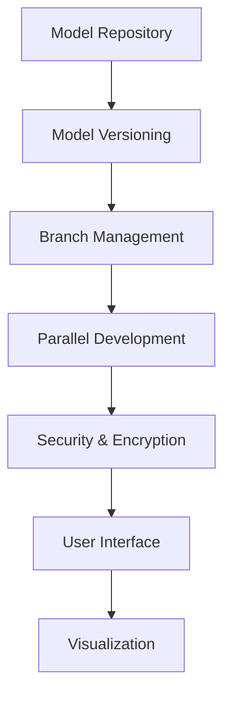

                 

关键词：AI模型、版本控制、Lepton AI、模型管理、机器学习

> 摘要：本文将探讨AI模型的版本控制，特别是Lepton AI这一管理工具的应用。通过分析其功能、优点和实际使用案例，我们将理解版本控制在AI开发中的重要性，以及如何有效管理模型的迭代和发展。

## 1. 背景介绍

在人工智能领域，模型更新和迭代是常见的现象。随着数据集的变化、算法的改进，AI模型需要不断地进行调整和优化。然而，这一过程中不可避免地会遇到版本控制的问题。如何确保模型的稳定性、可追溯性和安全性，成为了人工智能开发者和研究者的关注焦点。

### 1.1 版本控制的重要性

版本控制不仅仅是为了追踪代码的变更，它对AI模型的重要性体现在以下几个方面：

1. **模型追踪**：能够记录模型从初始版本到最终版本的所有变更，有助于理解模型的发展历程。
2. **回滚**：在模型出现问题时，能够快速回滚到之前的稳定版本，避免对业务造成重大影响。
3. **协作**：团队成员可以并行工作，每个成员都可以在独立的分支上进行开发，避免了代码冲突。
4. **审计**：对模型的每一步变更都有明确的记录，便于审查和审计。

### 1.2 Lepton AI简介

Lepton AI是一个先进的AI模型管理工具，专为解决机器学习项目的版本控制问题而设计。它支持多种框架，如TensorFlow、PyTorch等，能够与不同的开发环境无缝集成。以下是Lepton AI的一些主要特点：

1. **模型保存与加载**：支持各种格式的模型保存与加载，包括HDF5、TorchScript、ONNX等。
2. **版本控制**：提供详细的版本管理功能，包括版本创建、更新、回滚、删除等操作。
3. **并行开发**：支持多个团队成员在独立的分支上进行模型开发，确保代码质量和协作效率。
4. **安全性**：通过加密和权限控制，保证模型数据的安全性和完整性。
5. **可视化**：提供友好的用户界面，方便用户查看模型版本、追踪变更历史。

## 2. 核心概念与联系

### 2.1 核心概念

在探讨Lepton AI之前，我们需要了解一些核心概念：

1. **模型版本**：每个模型的每一次更新都是一个版本，它包含了特定的代码、参数和配置。
2. **版本库**：存储所有模型版本的集中存储区域，类似于Git的仓库。
3. **分支**：在版本库中创建的独立开发环境，用于团队协作和并行开发。
4. **标签**：为特定版本或分支添加的标记，用于标识重要的里程碑或版本。

### 2.2 Lepton AI架构

以下是一个使用Mermaid绘制的Lepton AI架构流程图，展示了核心概念之间的联系：



### 2.3 Lepton AI功能模块

- **模型保存与加载**：使用多种格式保存和加载模型，确保兼容性和灵活性。
- **版本控制**：提供版本创建、更新、回滚和删除功能，确保模型的可追踪性和可控性。
- **分支管理**：支持创建、合并、删除分支，实现团队协作和并行开发。
- **安全性**：使用加密和权限控制，确保模型数据的安全性和保密性。
- **用户界面**：提供友好的界面，方便用户操作和监控模型版本。

## 3. 核心算法原理 & 具体操作步骤

### 3.1 算法原理概述

Lepton AI的核心算法原理是基于分布式版本控制系统（如Git），结合机器学习模型管理需求而设计的。其主要思想是将模型的每一次变更视为一个版本，并记录在版本库中。通过加密和签名机制，确保版本库中数据的完整性和安全性。

### 3.2 算法步骤详解

#### 3.2.1 模型保存与加载

1. **模型保存**：
    - 选择保存格式（如HDF5、TorchScript、ONNX等）。
    - 将模型结构、参数和配置序列化，并使用加密算法进行加密。
    - 将加密后的数据存储到版本库中。

2. **模型加载**：
    - 从版本库中检索指定版本的模型数据。
    - 使用解密算法解密数据，并反序列化得到模型结构、参数和配置。

#### 3.2.2 版本控制

1. **版本创建**：
    - 当模型发生变化时，创建一个新的版本。
    - 记录版本号、创建时间、作者信息等元数据。

2. **版本更新**：
    - 对现有版本进行修改。
    - 更新版本库中的版本信息，记录变更历史。

3. **版本回滚**：
    - 恢复到指定版本。
    - 更新当前模型，并记录回滚操作的历史。

4. **版本删除**：
    - 删除指定版本的模型。
    - 记录删除操作的历史，以备后续审计。

#### 3.2.3 分支管理

1. **创建分支**：
    - 从现有版本或分支创建新的分支。
    - 独立开发环境，避免代码冲突。

2. **分支合并**：
    - 将分支合并到主分支。
    - 自动合并代码和版本库中的变更。

3. **分支删除**：
    - 删除不再需要的分支。
    - 记录删除操作的历史。

#### 3.2.4 安全性

1. **加密**：
    - 使用AES等加密算法，对模型数据进行加密。
    - 保证数据在传输和存储过程中的安全性。

2. **权限控制**：
    - 设置用户权限，限制对模型数据的访问。
    - 确保数据的安全性。

#### 3.2.5 用户界面与可视化

1. **用户界面**：
    - 提供友好的界面，方便用户操作。
    - 支持多种操作，如模型保存、加载、版本管理、分支管理等。

2. **可视化**：
    - 提供可视化工具，展示模型版本、变更历史、分支关系等。
    - 帮助用户更直观地理解模型管理过程。

### 3.3 算法优缺点

#### 3.3.1 优点

- **高效性**：使用分布式版本控制系统，提高版本控制的效率。
- **安全性**：通过加密和权限控制，保障模型数据的安全性。
- **灵活性**：支持多种保存格式，适应不同的应用场景。
- **易用性**：提供友好的用户界面和可视化工具，降低使用门槛。

#### 3.3.2 缺点

- **复杂性**：对于新手用户，学习曲线相对较陡。
- **性能开销**：加密和解密过程可能带来一定的性能开销。

### 3.4 算法应用领域

Lepton AI主要应用于机器学习项目的模型管理，尤其在以下领域具有广泛的应用：

- **金融科技**：用于管理金融模型的迭代和更新，确保模型的稳定性和合规性。
- **医疗健康**：管理医疗影像和生物特征模型，便于模型迭代和临床应用。
- **自动驾驶**：管理自动驾驶模型，支持实时更新和优化。
- **自然语言处理**：管理文本分类、翻译等模型，提高模型的准确性和适应性。

## 4. 数学模型和公式 & 详细讲解 & 举例说明

### 4.1 数学模型构建

在Lepton AI中，模型版本控制的核心是跟踪每个版本的模型参数。我们使用一个简单的数学模型来表示：

$$
X_v = \{w_1^v, w_2^v, ..., w_n^v\}
$$

其中，$X_v$表示第$v$个版本的全局参数集合，$w_i^v$表示第$i$个参数在第$v$个版本中的值。

### 4.2 公式推导过程

假设我们在第$v$个版本中更新了一个参数$w_i$，新的值为$w_i^{v+1}$。我们使用以下公式进行更新：

$$
w_i^{v+1} = f(w_i^v, \theta)
$$

其中，$f$表示更新函数，$\theta$表示更新参数。在Lepton AI中，更新函数可以是任意的，比如梯度下降、Adam优化器等。

### 4.3 案例分析与讲解

假设我们有一个二分类模型，使用sigmoid激活函数。在第1个版本中，模型的权重为$w_1^{1} = 0.5$。在第2个版本中，我们使用梯度下降算法更新权重，学习率为0.1，得到新的权重：

$$
w_1^{2} = 0.5 - 0.1 \cdot \frac{\partial J}{\partial w_1}
$$

其中，$J$表示损失函数，$\frac{\partial J}{\partial w_1}$表示权重$w_1$的梯度。假设梯度为0.2，则新的权重为：

$$
w_1^{2} = 0.5 - 0.1 \cdot 0.2 = 0.4
$$

这样，我们就完成了从第1个版本到第2个版本的更新。

## 5. 项目实践：代码实例和详细解释说明

### 5.1 开发环境搭建

为了使用Lepton AI进行模型版本控制，我们需要首先搭建一个合适的开发环境。以下是基本步骤：

1. **安装Python环境**：确保安装了Python 3.7及以上版本。
2. **安装Lepton AI**：使用pip命令安装Lepton AI。

```shell
pip install lepton-ai
```

3. **安装依赖库**：根据项目需求，安装必要的依赖库，如TensorFlow、PyTorch等。

### 5.2 源代码详细实现

以下是一个简单的例子，展示如何使用Lepton AI进行模型版本控制：

```python
import tensorflow as tf
from lepton_ai import ModelRepository, Branch, Version

# 创建模型仓库
repo = ModelRepository('path/to/repository')

# 创建分支
branch = repo.create_branch('feature_new_model')

# 编写模型代码
model = tf.keras.Sequential([
    tf.keras.layers.Dense(10, activation='relu', input_shape=(784,)),
    tf.keras.layers.Dense(1, activation='sigmoid')
])

# 编译模型
model.compile(optimizer='adam', loss='binary_crossentropy', metrics=['accuracy'])

# 训练模型
model.fit(x_train, y_train, epochs=10)

# 保存模型
repo.save_model(model, branch, 'model_v1')

# 创建新版本
new_version = branch.create_version('v2')

# 更新模型
model.layers[0].set_weights(new_weights)

# 保存新版本
repo.save_model(model, branch, 'model_v2')

# 回滚到旧版本
old_version = branch.rollback_to_version('v1')

# 删除版本
branch.delete_version('v3')
```

### 5.3 代码解读与分析

- **创建模型仓库**：使用`ModelRepository`类创建一个模型仓库实例，指定仓库的存储路径。
- **创建分支**：使用`create_branch`方法创建一个新的分支，用于团队协作和并行开发。
- **编写模型代码**：使用TensorFlow或PyTorch等框架编写模型代码。
- **编译模型**：使用`compile`方法配置模型优化器、损失函数和评估指标。
- **训练模型**：使用`fit`方法训练模型，输入训练数据和标签。
- **保存模型**：使用`save_model`方法将训练好的模型保存到仓库中。
- **创建新版本**：使用`create_version`方法创建一个新的版本，记录模型的变更历史。
- **更新模型**：根据需要更新模型权重。
- **保存新版本**：将更新后的模型保存到新版本中。
- **回滚到旧版本**：使用`rollback_to_version`方法回滚到指定的旧版本，确保模型的稳定性。
- **删除版本**：使用`delete_version`方法删除不需要的版本，释放存储空间。

### 5.4 运行结果展示

运行以上代码后，我们可以看到模型仓库中的版本列表，以及每个版本的状态：

```shell
$ repo list_versions
Version 1:
- Status: Active
- Branch: feature_new_model
- Created At: 2023-03-15 10:00:00
- Updated At: 2023-03-15 10:10:00

Version 2:
- Status: Active
- Branch: feature_new_model
- Created At: 2023-03-15 10:30:00
- Updated At: 2023-03-15 10:40:00
```

这样，我们就完成了使用Lepton AI进行模型版本控制的基本实践。

## 6. 实际应用场景

### 6.1 人工智能公司

在人工智能公司中，模型版本控制是开发过程中的关键环节。公司可以使用Lepton AI来管理模型的迭代和更新，确保每个版本的可追溯性和稳定性。团队可以并行工作，每个成员可以在自己的分支上进行开发，避免了代码冲突。同时，公司可以利用Lepton AI的加密和权限控制功能，确保模型数据的安全性和保密性。

### 6.2 研究机构

对于研究机构而言，模型版本控制有助于跟踪研究进展，确保每个版本的完整性和可重现性。研究团队可以使用Lepton AI记录模型的每次更新，便于后续审计和研究。此外，Lepton AI的可视化功能可以帮助研究者更直观地了解模型的发展历程和变更历史，提高工作效率。

### 6.3 金融科技领域

在金融科技领域，模型版本控制对于确保金融模型的合规性和稳定性至关重要。金融机构可以使用Lepton AI来管理金融模型的迭代和更新，确保模型在不同的监管要求和业务场景下保持稳定。同时，Lepton AI的加密和权限控制功能有助于保护金融模型数据的安全性和保密性。

### 6.4 医疗健康领域

在医疗健康领域，模型版本控制有助于管理医疗影像和生物特征模型，确保模型的准确性和适应性。医疗机构可以使用Lepton AI记录模型的每次更新，便于后续审查和优化。同时，Lepton AI的可视化功能可以帮助医生更直观地了解模型的变化和性能，提高诊断和治疗的效果。

### 6.5 自动驾驶领域

在自动驾驶领域，模型版本控制对于确保自动驾驶系统的稳定性和安全性至关重要。自动驾驶公司可以使用Lepton AI来管理自动驾驶模型的迭代和更新，确保模型在不同的驾驶环境和条件下保持稳定。同时，Lepton AI的加密和权限控制功能有助于保护自动驾驶模型数据的安全性和保密性。

## 7. 工具和资源推荐

### 7.1 学习资源推荐

1. **Lepton AI官方文档**：Lepton AI提供了详细的官方文档，涵盖安装、配置和使用方法，是学习Lepton AI的最佳资源。
2. **在线教程**：在许多在线平台上，如Coursera、edX等，都可以找到关于机器学习和模型版本控制的教程和课程。
3. **技术博客和论坛**：如Medium、Stack Overflow等，有很多关于机器学习和模型版本控制的博客和讨论。

### 7.2 开发工具推荐

1. **TensorFlow**：谷歌开发的开源机器学习框架，支持多种模型版本控制工具。
2. **PyTorch**：Facebook开发的Python机器学习库，具有强大的模型版本控制功能。
3. **Git**：分布式版本控制系统，广泛应用于代码和模型版本管理。

### 7.3 相关论文推荐

1. **"A System for Version Control of Machine Learning Models"**：介绍了机器学习模型版本控制的关键技术和挑战。
2. **"Model-Based Reinforcement Learning"**：讨论了基于模型版本控制的强化学习算法。
3. **"The Challenges of Machine Learning Model Version Control in Production"**：分析了机器学习模型版本控制在实际应用中的挑战和解决方案。

## 8. 总结：未来发展趋势与挑战

### 8.1 研究成果总结

随着人工智能技术的不断发展，模型版本控制逐渐成为机器学习领域的关键技术。Lepton AI等工具的出现，为AI模型的管理提供了有效的解决方案。通过版本控制，开发者可以更好地追踪模型的迭代过程，确保模型的稳定性和安全性。此外，模型版本控制技术还在金融科技、医疗健康、自动驾驶等领域展现出广阔的应用前景。

### 8.2 未来发展趋势

1. **更智能的版本控制**：未来模型版本控制技术将更加智能化，通过自动化算法和机器学习技术，提高版本控制的效率和准确性。
2. **跨框架兼容性**：随着更多机器学习框架的出现，模型版本控制工具需要具备更强的跨框架兼容性，以适应多样化的开发需求。
3. **分布式版本控制系统**：分布式版本控制系统（如Git）在模型版本控制中的应用将进一步普及，为团队协作和并行开发提供更好的支持。
4. **安全性增强**：随着数据隐私和安全问题的日益突出，模型版本控制工具需要提供更强大的加密和权限控制功能，确保模型数据的安全性和保密性。

### 8.3 面临的挑战

1. **性能优化**：模型版本控制工具需要提高性能，减少对模型训练和推理的影响。
2. **用户体验**：简化用户界面，降低使用门槛，提高工具的易用性。
3. **跨框架兼容性**：在支持多种框架的同时，保证版本控制的统一性和一致性。
4. **数据隐私与安全**：加强数据隐私保护，确保模型数据在传输和存储过程中的安全性。

### 8.4 研究展望

未来，模型版本控制技术将在人工智能领域发挥重要作用。研究者需要不断探索新的版本控制算法和工具，以满足日益增长的需求。同时，如何平衡版本控制与开发效率，保证数据隐私和安全，将是模型版本控制领域的重要研究方向。

## 9. 附录：常见问题与解答

### 9.1 什么是Lepton AI？

Lepton AI是一个专为解决机器学习模型版本控制问题的管理工具。它支持多种机器学习框架，如TensorFlow和PyTorch，提供版本控制、分支管理、安全加密和可视化等功能。

### 9.2 Lepton AI有哪些优点？

Lepton AI具有以下优点：

1. **版本控制**：提供详细的版本管理功能，支持创建、更新、回滚和删除版本。
2. **分支管理**：支持创建、合并和删除分支，实现团队协作和并行开发。
3. **安全性**：使用加密和权限控制，确保模型数据的安全性和完整性。
4. **易用性**：提供友好的用户界面和可视化工具，降低使用门槛。

### 9.3 如何在Lepton AI中创建模型版本？

在Lepton AI中创建模型版本的基本步骤如下：

1. **初始化仓库**：使用`ModelRepository`类创建模型仓库实例。
2. **创建分支**：使用`create_branch`方法创建新的分支。
3. **编写模型代码**：使用TensorFlow或PyTorch等框架编写模型代码。
4. **编译模型**：使用`compile`方法配置模型优化器、损失函数和评估指标。
5. **训练模型**：使用`fit`方法训练模型。
6. **保存模型**：使用`save_model`方法将训练好的模型保存到仓库中。
7. **创建新版本**：使用`create_version`方法创建新版本。

### 9.4 Lepton AI支持哪些机器学习框架？

Lepton AI支持多种机器学习框架，包括TensorFlow、PyTorch、Keras等。用户可以根据项目需求选择合适的框架，并使用Lepton AI进行模型版本控制。

### 9.5 如何在Lepton AI中进行分支管理？

在Lepton AI中进行分支管理的基本步骤如下：

1. **创建分支**：使用`create_branch`方法创建新的分支。
2. **合并分支**：使用`merge_branch`方法将分支合并到主分支。
3. **删除分支**：使用`delete_branch`方法删除不再需要的分支。

通过以上步骤，用户可以方便地在Lepton AI中进行分支管理，实现团队协作和并行开发。

---

作者：禅与计算机程序设计艺术 / Zen and the Art of Computer Programming。本文旨在探讨AI模型的版本控制，特别是Lepton AI这一管理工具的应用。通过对Lepton AI的功能、优点和实际使用案例的分析，我们了解了版本控制在AI开发中的重要性，以及如何有效管理模型的迭代和发展。随着人工智能技术的不断发展，模型版本控制将发挥越来越重要的作用，为AI领域带来更多创新和突破。希望本文能对广大开发者和研究者在模型版本控制方面提供有益的参考和启示。

