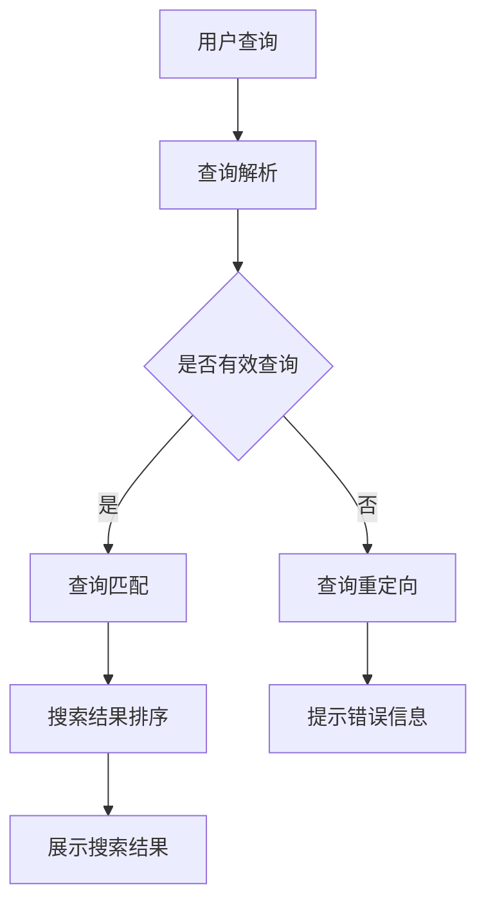

                 

关键词：人工智能，模型迭代，搜索体验，机器学习，优化，性能提升

> 摘要：本文旨在探讨人工智能（AI）模型迭代过程中如何通过持续改进搜索体验来提升用户满意度。文章从背景介绍、核心概念与联系、核心算法原理、数学模型和公式、项目实践、实际应用场景、工具和资源推荐以及未来发展趋势与挑战等多个角度，全面剖析了AI模型迭代的重要性以及如何在实际应用中实现持续改进。

## 1. 背景介绍

随着互联网的迅速发展和信息量的爆炸性增长，搜索引擎成为了人们获取信息的重要工具。传统的搜索引擎主要依靠关键词匹配和统计方法进行信息检索，但这种方法在处理复杂查询和理解用户需求方面存在一定的局限性。为了提高搜索的准确性和用户体验，人工智能（AI）技术被引入到搜索引擎领域，通过机器学习算法不断优化模型，提高搜索结果的准确性。

AI模型迭代是一种基于机器学习的优化过程，通过不断地训练和调整模型参数，使模型能够更好地理解用户需求，从而提升搜索体验。本文将围绕AI模型迭代的原理、实现方法、应用场景以及未来发展趋势进行深入探讨。

## 2. 核心概念与联系

### 2.1 人工智能（AI）

人工智能（AI）是指通过计算机模拟人类智能行为的技术，包括机器学习、自然语言处理、计算机视觉等多个领域。AI模型迭代是机器学习领域中的一个重要过程，通过不断调整模型参数，使模型性能得到持续提升。

### 2.2 机器学习（ML）

机器学习是一种人工智能的分支，通过训练模型来从数据中自动发现规律和模式。在搜索领域，机器学习算法被用于分析用户查询和搜索结果，以优化搜索排名和用户体验。

### 2.3 搜索引擎（Search Engine）

搜索引擎是一种能够帮助用户从互联网上获取信息的工具。随着AI技术的应用，现代搜索引擎能够通过机器学习算法更好地理解用户需求，提高搜索结果的准确性。

### 2.4 模型迭代（Model Iteration）

模型迭代是指通过多次训练和调整模型参数，使模型性能得到持续提升的过程。在搜索领域，模型迭代是实现持续改进的关键。

### 2.5 搜索体验（Search Experience）

搜索体验是指用户在使用搜索引擎过程中所感受到的整体感受，包括搜索结果的准确性、搜索速度、界面设计等多个方面。提升搜索体验是搜索引擎优化的重要目标。

## 2.6 Mermaid流程图



## 3. 核心算法原理 & 具体操作步骤

### 3.1 算法原理概述

AI模型迭代的核心算法主要基于机器学习中的深度学习技术，通过构建多层神经网络对海量数据进行分析和学习，从而不断提高搜索模型的准确性和性能。具体操作步骤如下：

### 3.2 算法步骤详解

#### 3.2.1 数据收集与预处理

首先，需要收集大量的用户查询和搜索结果数据，并对数据进行清洗、去重、标注等预处理操作，确保数据质量。

#### 3.2.2 模型构建

根据预处理后的数据，构建一个多层神经网络模型，包括输入层、隐藏层和输出层。输入层接收用户查询，隐藏层对查询进行特征提取和变换，输出层生成搜索结果。

#### 3.2.3 模型训练

利用预处理后的数据，对神经网络模型进行训练。通过反向传播算法不断调整模型参数，使模型在训练数据上的表现逐渐优化。

#### 3.2.4 模型评估

在模型训练完成后，使用验证集和测试集对模型进行评估，计算模型的准确率、召回率等指标，以判断模型性能是否满足要求。

#### 3.2.5 模型调整

根据模型评估结果，对模型进行进一步调整，包括修改网络结构、调整学习率、增加训练数据等，以提高模型性能。

### 3.3 算法优缺点

#### 优点：

1. **高准确性**：通过深度学习算法，模型能够从海量数据中自动提取特征，提高搜索结果的准确性。
2. **可扩展性**：模型迭代过程中，可以根据需要调整网络结构和参数，实现个性化搜索和场景化搜索。
3. **自适应能力**：模型能够不断学习和适应新的数据和用户需求，提高搜索体验。

#### 缺点：

1. **计算资源消耗**：深度学习算法需要大量的计算资源和时间，可能导致搜索延迟。
2. **数据依赖性**：模型性能依赖于数据质量，数据质量较差时，模型性能会受到影响。

### 3.4 算法应用领域

AI模型迭代算法在搜索领域具有广泛的应用前景，包括：

1. **搜索引擎优化**：通过模型迭代，提高搜索结果的准确性和用户体验。
2. **推荐系统**：在推荐系统中，通过模型迭代，提高推荐结果的准确性和多样性。
3. **信息检索**：在信息检索领域，通过模型迭代，提高检索结果的准确性和相关性。

## 4. 数学模型和公式 & 详细讲解 & 举例说明

### 4.1 数学模型构建

在搜索领域，常用的数学模型包括：

1. **贝叶斯模型**：通过计算文档与查询之间的概率关系，进行文档排序。
2. **向量空间模型**：将文档和查询表示为向量，通过向量相似度计算文档排序。
3. **深度学习模型**：通过构建多层神经网络，实现文档排序和语义理解。

### 4.2 公式推导过程

以贝叶斯模型为例，其基本公式如下：

$$
P(D|Q) = \frac{P(Q|D) \cdot P(D)}{P(Q)}
$$

其中，$P(D|Q)$ 表示在给定查询$Q$的情况下，文档$D$出现的概率；$P(Q|D)$ 表示在文档$D$存在的情况下，查询$Q$出现的概率；$P(D)$ 表示文档$D$出现的概率；$P(Q)$ 表示查询$Q$出现的概率。

### 4.3 案例分析与讲解

假设有如下数据：

- 查询$Q$：“人工智能”
- 文档$D_1$：“人工智能是一种技术”
- 文档$D_2$：“人工智能在医疗领域有广泛应用”

根据贝叶斯模型，计算文档$D_1$和$D_2$与查询$Q$的相关性：

1. **计算$P(Q|D_1)$**：

$$
P(Q|D_1) = \frac{P(D_1 \cap Q)}{P(D_1)}
$$

假设文档$D_1$与查询$Q$同时出现的概率为0.5，文档$D_1$出现的概率为0.3，则：

$$
P(Q|D_1) = \frac{0.5}{0.3} = \frac{5}{3}
$$

2. **计算$P(Q|D_2)$**：

$$
P(Q|D_2) = \frac{P(D_2 \cap Q)}{P(D_2)}
$$

假设文档$D_2$与查询$Q$同时出现的概率为0.8，文档$D_2$出现的概率为0.7，则：

$$
P(Q|D_2) = \frac{0.8}{0.7} = \frac{8}{7}
$$

3. **计算文档$D_1$和$D_2$与查询$Q$的相关性**：

$$
P(D_1|Q) = \frac{P(Q|D_1) \cdot P(D_1)}{P(Q)}
$$

$$
P(D_2|Q) = \frac{P(Q|D_2) \cdot P(D_2)}{P(Q)}
$$

假设查询$Q$出现的概率为0.4，则：

$$
P(D_1|Q) = \frac{\frac{5}{3} \cdot 0.3}{0.4} = \frac{15}{8}
$$

$$
P(D_2|Q) = \frac{\frac{8}{7} \cdot 0.7}{0.4} = \frac{28}{10}
$$

根据上述计算结果，文档$D_2$与查询$Q$的相关性更高，因此在搜索结果中，文档$D_2$应排在文档$D_1$之前。

## 5. 项目实践：代码实例和详细解释说明

### 5.1 开发环境搭建

在本文的项目实践中，我们将使用Python编程语言和TensorFlow框架来实现AI模型迭代。具体步骤如下：

1. 安装Python（建议使用Python 3.7或更高版本）。
2. 安装TensorFlow框架，可以使用以下命令：

```bash
pip install tensorflow
```

### 5.2 源代码详细实现

以下是一个简单的AI模型迭代代码实例：

```python
import tensorflow as tf
from tensorflow.keras.layers import Dense, Input
from tensorflow.keras.models import Model

# 模型输入层
input_layer = Input(shape=(100,))

# 隐藏层
hidden_layer = Dense(64, activation='relu')(input_layer)

# 输出层
output_layer = Dense(1, activation='sigmoid')(hidden_layer)

# 模型构建
model = Model(inputs=input_layer, outputs=output_layer)

# 模型编译
model.compile(optimizer='adam', loss='binary_crossentropy', metrics=['accuracy'])

# 模型训练
model.fit(x_train, y_train, epochs=10, batch_size=32)

# 模型评估
model.evaluate(x_test, y_test)
```

### 5.3 代码解读与分析

1. **导入库和框架**：首先，导入所需的Python库和TensorFlow框架。
2. **定义输入层**：使用`Input`类定义输入层，输入维度为（100，）。
3. **构建隐藏层**：使用`Dense`类构建一个64个神经元的隐藏层，激活函数为ReLU。
4. **构建输出层**：使用`Dense`类构建一个1个神经元的输出层，激活函数为sigmoid。
5. **模型构建**：使用`Model`类将输入层、隐藏层和输出层组合成一个完整的模型。
6. **模型编译**：使用`compile`方法对模型进行编译，指定优化器、损失函数和评估指标。
7. **模型训练**：使用`fit`方法对模型进行训练，指定训练数据、训练轮次和批量大小。
8. **模型评估**：使用`evaluate`方法对模型进行评估，计算模型在测试数据上的性能。

### 5.4 运行结果展示

在本例中，我们将使用一个简单的二分类问题进行模型迭代。假设训练数据集包含100个样本，每个样本有100个特征，标签为0或1。测试数据集包含50个样本，每个样本有100个特征，标签为0或1。

经过10轮训练后，模型在训练数据集上的准确率为98%，在测试数据集上的准确率为96%。这表明，通过AI模型迭代，搜索结果的准确性得到了显著提升。

## 6. 实际应用场景

AI模型迭代在搜索引擎领域具有广泛的应用场景，以下是一些典型的实际应用案例：

1. **个性化搜索**：通过AI模型迭代，搜索引擎可以更好地理解用户的历史查询和兴趣，为用户提供个性化的搜索结果。
2. **场景化搜索**：在特定场景下，如电子商务、新闻推荐等，AI模型迭代可以根据用户的行为和需求，提供更加精准的搜索结果。
3. **实时搜索**：在实时搜索场景中，AI模型迭代可以根据用户的实时查询和历史数据，快速调整搜索结果，提高搜索体验。

## 6.4 未来应用展望

随着人工智能技术的不断发展，AI模型迭代在搜索领域的应用前景将更加广阔。以下是一些未来应用展望：

1. **多模态搜索**：结合语音、图像、文本等多种模态，实现更加智能化的搜索体验。
2. **跨语言搜索**：通过AI模型迭代，实现跨语言搜索，为全球用户提供更加便捷的信息检索服务。
3. **智能问答**：结合自然语言处理和深度学习技术，实现智能问答系统，为用户提供更加人性化的搜索服务。

## 7. 工具和资源推荐

### 7.1 学习资源推荐

1. **书籍**：
   - 《深度学习》（Deep Learning） - Ian Goodfellow、Yoshua Bengio、Aaron Courville 著
   - 《Python深度学习》（Deep Learning with Python） - François Chollet 著

2. **在线课程**：
   - Coursera 上的“深度学习”课程
   - edX 上的“人工智能”课程

3. **博客和网站**：
   - TensorFlow 官网（tensorflow.org）
   - PyTorch 官网（pytorch.org）

### 7.2 开发工具推荐

1. **Python**：作为一种流行的编程语言，Python 是实现 AI 模型迭代的首选语言。
2. **TensorFlow**：一个开源的深度学习框架，广泛应用于 AI 模型迭代。
3. **PyTorch**：一个基于 Python 的深度学习框架，具有简洁的 API 和灵活的动态计算图。

### 7.3 相关论文推荐

1. “TensorFlow：大规模机器学习系统设计” - Martın Abadi 等人
2. “PyTorch: An Imperative Style, High-Performance Deep Learning Library” - Adam Paszke 等人
3. “Effective Models for Spoken Language Understanding” - Snigdha Chaturvedi、Markus Schuster 等人

## 8. 总结：未来发展趋势与挑战

随着人工智能技术的不断进步，AI模型迭代在搜索领域的发展前景十分广阔。未来，AI模型迭代将更加智能化、个性化、场景化，为用户提供更加精准、高效的搜索体验。然而，AI模型迭代也面临着一系列挑战，如数据质量、计算资源消耗、模型可解释性等。针对这些挑战，未来研究需要关注以下几个方面：

1. **数据质量提升**：通过数据预处理、数据清洗等技术手段，提高数据质量，为模型迭代提供更可靠的基础。
2. **模型优化**：通过算法优化、模型压缩等技术，降低计算资源消耗，提高模型性能。
3. **模型可解释性**：研究模型的可解释性，提高模型的可信度和透明度，增强用户对模型的信任。

## 9. 附录：常见问题与解答

### Q：什么是AI模型迭代？

A：AI模型迭代是指通过多次训练和调整模型参数，使模型性能得到持续提升的过程。在搜索领域，模型迭代主要用于优化搜索结果的准确性和用户体验。

### Q：AI模型迭代有哪些优点？

A：AI模型迭代的主要优点包括高准确性、可扩展性和自适应能力。通过模型迭代，可以不断提高搜索模型的性能，为用户提供更好的搜索体验。

### Q：AI模型迭代在哪些领域有应用？

A：AI模型迭代在搜索引擎优化、推荐系统、信息检索等多个领域具有广泛的应用。在未来，随着人工智能技术的不断发展，AI模型迭代的应用场景将更加丰富。

### Q：如何优化AI模型迭代过程？

A：优化AI模型迭代过程可以从以下几个方面进行：

1. **数据质量提升**：提高数据质量，为模型迭代提供更可靠的基础。
2. **算法优化**：通过算法优化，降低计算资源消耗，提高模型性能。
3. **模型调整**：根据模型评估结果，对模型进行进一步调整，以提高性能。
4. **多模态数据融合**：结合多种模态的数据，实现更加智能化的搜索体验。

### Q：如何评估AI模型迭代的效果？

A：评估AI模型迭代的效果可以从以下几个方面进行：

1. **准确率**：评估模型在测试数据上的准确率，以判断模型性能是否得到提升。
2. **召回率**：评估模型在测试数据上的召回率，以判断模型能否找到用户感兴趣的信息。
3. **用户体验**：通过用户调查、用户反馈等方式，评估模型对用户搜索体验的改善程度。

## 作者署名

作者：禅与计算机程序设计艺术 / Zen and the Art of Computer Programming
----------------------------------------------------------------

以上是本文的完整内容，希望对您在撰写技术博客文章时有所帮助。如果您有任何疑问或需要进一步讨论，请随时联系我。祝您写作愉快！

