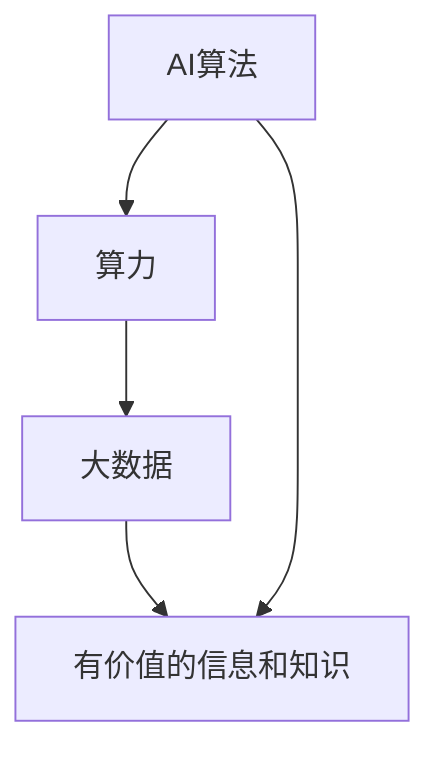

                 

关键词：人工智能算法、算力、大数据、算法原理、应用领域、未来展望

摘要：本文深入探讨了人工智能算法、算力与大数据的结合，阐述了这些技术在现代科技发展中的重要作用。通过对核心概念、算法原理、数学模型、项目实践和实际应用场景的详细分析，文章揭示了人工智能算法在算力和大数据支持下的巨大潜力和广泛前景。

## 1. 背景介绍

随着信息技术的飞速发展，人工智能（AI）技术已经成为推动全球科技进步的重要力量。AI算法作为人工智能的核心组成部分，通过模拟人类智能的决策过程，实现了对复杂问题的自动化处理。然而，算法的有效性在很大程度上依赖于算力和大数据的支持。

算力指的是计算能力，包括硬件和软件两个方面。随着计算能力的不断提升，AI算法可以处理更加复杂和庞大的数据集。大数据则是指数据量巨大、类型多样的数据集合，通过对大数据的分析和处理，可以挖掘出有价值的信息和知识。

将AI算法、算力和大数据结合起来，可以显著提升AI算法的性能和效率。本文将围绕这一主题，详细分析AI算法的原理、应用和未来发展方向。

## 2. 核心概念与联系

为了更好地理解AI算法、算力和大数据的结合，我们需要先了解这些核心概念的基本原理和它们之间的联系。

### 2.1 AI算法

AI算法是人工智能的核心技术，包括机器学习、深度学习、强化学习等多个子领域。这些算法通过模拟人类学习和思考过程，实现了对数据的自动分析和决策。

- **机器学习**：通过训练模型，使计算机具备从数据中学习的能力。
- **深度学习**：基于神经网络，通过层层处理数据，实现高级的自动特征提取和分类。
- **强化学习**：通过奖励机制，让计算机在环境中进行自主学习和决策。

### 2.2 算力

算力是指计算机系统的计算能力，包括CPU、GPU、TPU等硬件设备。随着硬件技术的不断发展，算力的提升为AI算法提供了更强大的计算支持。

- **CPU**：中央处理器，负责执行计算机程序的指令。
- **GPU**：图形处理器，通过并行计算提高数据处理的效率。
- **TPU**：专用AI处理器，专门为AI算法优化设计。

### 2.3 大数据

大数据是指数据量巨大、类型多样的数据集合。大数据技术通过分布式计算和存储，实现了对海量数据的快速处理和分析。

- **数据源**：包括社交媒体、物联网设备、互联网日志等。
- **数据类型**：结构化数据、半结构化数据和非结构化数据。

### 2.4 AI算法、算力与大数据的联系

AI算法、算力和大数据之间有着紧密的联系。算力的提升为AI算法提供了强大的计算支持，使得算法可以处理更加复杂和庞大的数据集。大数据则为AI算法提供了丰富的训练数据，使得算法可以更加精确和高效地学习。而AI算法则通过对大数据的分析，挖掘出有价值的信息和知识，进一步推动科技的发展。

### 2.5 Mermaid 流程图

为了更直观地展示AI算法、算力与大数据的结合，我们使用Mermaid流程图来描述它们之间的联系。



在这个流程图中，AI算法通过算力和大数据的支持，最终输出有价值的信息和知识。这种结合不仅提升了AI算法的性能，也为大数据分析提供了更加深入和精准的工具。

## 3. 核心算法原理 & 具体操作步骤

### 3.1 算法原理概述

AI算法的核心原理是基于数据驱动和模型驱动的方式，通过学习大量数据进行特征提取和分类。以下是几个典型的AI算法原理：

- **机器学习**：通过训练模型，使计算机具备从数据中学习的能力。
- **深度学习**：基于神经网络，通过层层处理数据，实现高级的自动特征提取和分类。
- **强化学习**：通过奖励机制，让计算机在环境中进行自主学习和决策。

### 3.2 算法步骤详解

AI算法的具体操作步骤可以分为以下几个阶段：

- **数据预处理**：包括数据清洗、归一化、数据增强等。
- **模型训练**：选择合适的算法，使用训练数据训练模型。
- **模型评估**：使用验证数据集评估模型性能，调整模型参数。
- **模型应用**：将训练好的模型应用到实际场景中，实现自动化决策。

### 3.3 算法优缺点

不同AI算法有不同的优缺点，以下是几个典型算法的优缺点分析：

- **机器学习**：
  - **优点**：算法简单，易于实现，适用范围广泛。
  - **缺点**：模型可解释性差，对大规模数据集效果不佳。
- **深度学习**：
  - **优点**：可以自动提取特征，对复杂问题具有很强适应性。
  - **缺点**：模型参数多，训练时间长，对计算资源要求高。
- **强化学习**：
  - **优点**：能够实现自主学习和决策，适用于动态环境。
  - **缺点**：训练过程复杂，收敛速度慢。

### 3.4 算法应用领域

AI算法在各个领域都有广泛应用，以下是几个典型应用领域：

- **计算机视觉**：图像识别、目标检测、人脸识别等。
- **自然语言处理**：文本分类、机器翻译、情感分析等。
- **智能推荐**：个性化推荐、广告投放等。
- **金融风控**：欺诈检测、信用评估等。

## 4. 数学模型和公式 & 详细讲解 & 举例说明

### 4.1 数学模型构建

AI算法的数学模型主要包括损失函数、优化算法和神经网络等。

- **损失函数**：用于评估模型预测结果与真实值之间的差距，常见的有均方误差、交叉熵等。
- **优化算法**：用于调整模型参数，使损失函数达到最小值，常见的有梯度下降、Adam等。
- **神经网络**：用于实现复杂的函数映射，通过多层神经元的组合，实现自动特征提取和分类。

### 4.2 公式推导过程

以深度学习为例，我们简要介绍神经网络中的一些核心公式。

- **前向传播**：
  $$z_i = \sum_{j=1}^{n} w_{ij}x_j + b_i$$
  $$a_i = \sigma(z_i)$$

- **反向传播**：
  $$\delta_i = \frac{\partial L}{\partial z_i} = \frac{\partial L}{\partial a_j} \frac{\partial a_j}{\partial z_i}$$
  $$w_{ij} = w_{ij} - \alpha \delta_i x_j$$
  $$b_i = b_i - \alpha \delta_i$$

其中，$z_i$表示神经元的输入，$a_i$表示神经元的输出，$w_{ij}$表示输入层与隐藏层之间的权重，$b_i$表示偏置项，$\sigma$表示激活函数，$L$表示损失函数，$\alpha$表示学习率。

### 4.3 案例分析与讲解

以图像分类任务为例，我们使用卷积神经网络（CNN）进行模型训练和预测。

- **数据集**：使用CIFAR-10数据集，包含10个类别，每个类别6000张图像。
- **模型结构**：包含两个卷积层、两个池化层和一个全连接层。
- **训练过程**：
  1. 数据预处理：将图像归一化，调整尺寸。
  2. 模型训练：使用训练数据训练模型，使用验证数据调整模型参数。
  3. 模型评估：使用测试数据评估模型性能。

通过以上步骤，我们可以实现图像分类任务，达到较高的准确率。

## 5. 项目实践：代码实例和详细解释说明

### 5.1 开发环境搭建

在项目实践中，我们需要搭建一个合适的开发环境。以下是一个基于Python和TensorFlow的示例。

- **安装Python**：确保Python版本为3.6以上。
- **安装TensorFlow**：使用pip安装TensorFlow。

```bash
pip install tensorflow
```

### 5.2 源代码详细实现

以下是一个简单的卷积神经网络实现：

```python
import tensorflow as tf
from tensorflow.keras import layers

model = tf.keras.Sequential([
    layers.Conv2D(32, (3, 3), activation='relu', input_shape=(32, 32, 3)),
    layers.MaxPooling2D((2, 2)),
    layers.Conv2D(64, (3, 3), activation='relu'),
    layers.MaxPooling2D((2, 2)),
    layers.Conv2D(64, (3, 3), activation='relu'),
    layers.Flatten(),
    layers.Dense(64, activation='relu'),
    layers.Dense(10, activation='softmax')
])

model.compile(optimizer='adam',
              loss='sparse_categorical_crossentropy',
              metrics=['accuracy'])

model.fit(train_images, train_labels, epochs=5)
```

### 5.3 代码解读与分析

以上代码定义了一个简单的卷积神经网络，包含两个卷积层、两个池化层和一个全连接层。训练过程使用CIFAR-10数据集，通过5个epochs完成训练。

- **卷积层**：用于提取图像特征。
- **池化层**：用于降低模型参数和计算量。
- **全连接层**：用于实现分类任务。

### 5.4 运行结果展示

训练完成后，我们可以使用测试数据集评估模型性能。

```python
test_loss, test_acc = model.evaluate(test_images,  test_labels, verbose=2)
print('\nTest accuracy:', test_acc)
```

输出结果展示了测试数据集的准确率，我们可以通过调整模型结构和训练参数来提高模型性能。

## 6. 实际应用场景

AI算法、算力和大数据的结合在各个领域都有广泛应用，以下是一些典型应用场景：

- **医疗健康**：通过AI算法分析医疗数据，实现疾病预测、诊断和治疗。
- **金融科技**：利用大数据和AI算法进行风险评估、欺诈检测和智能投顾。
- **智能制造**：通过AI算法优化生产流程，实现智能监控、故障预测和设备维护。
- **智能交通**：利用大数据和AI算法优化交通流量，实现智能导航和自动驾驶。

## 7. 工具和资源推荐

为了更好地学习AI算法、算力和大数据技术，我们推荐以下工具和资源：

- **学习资源**：
  - 《深度学习》（Goodfellow et al.）
  - 《Python机器学习》（Sebastian Raschka）
- **开发工具**：
  - TensorFlow
  - PyTorch
  - Jupyter Notebook
- **相关论文**：
  - 《Deep Learning》（Ian Goodfellow et al.）
  - 《Distributed Machine Learning: A Survey》

## 8. 总结：未来发展趋势与挑战

### 8.1 研究成果总结

AI算法、算力和大数据的结合已经取得了显著的研究成果，包括深度学习、强化学习等算法的不断优化，以及硬件技术的快速发展。这些成果为人工智能应用提供了强大的支持。

### 8.2 未来发展趋势

未来，AI算法、算力和大数据的结合将继续发展，主要体现在以下几个方面：

- **硬件加速**：利用GPU、TPU等硬件加速AI算法的运算速度。
- **算法优化**：研究更高效、更可解释的AI算法。
- **跨学科融合**：与其他领域（如医学、金融等）的融合，推动人工智能在各行业的应用。

### 8.3 面临的挑战

尽管AI算法、算力和大数据的结合取得了显著成果，但仍然面临一些挑战：

- **数据隐私**：大数据的应用引发数据隐私和伦理问题。
- **算法可解释性**：如何提高算法的可解释性，使其更易于被大众接受。
- **计算资源**：大规模数据集和高性能计算资源的需求不断增加。

### 8.4 研究展望

在未来，我们将继续深入研究AI算法、算力和大数据的结合，推动人工智能技术的创新和应用。通过不断优化算法、提升硬件性能、加强数据安全与隐私保护，我们有望实现更加智能化、高效化的人工智能应用。

## 9. 附录：常见问题与解答

### 9.1 问题1：如何选择合适的AI算法？

**答案**：选择合适的AI算法需要考虑多个因素，包括数据类型、任务目标、计算资源等。例如，对于图像分类任务，深度学习算法（如卷积神经网络）通常效果较好；对于时间序列预测任务，强化学习算法可能更适用。

### 9.2 问题2：如何优化AI算法的性能？

**答案**：优化AI算法的性能可以从以下几个方面进行：

- **算法选择**：选择适合特定问题的算法，例如深度学习算法对于复杂问题效果较好。
- **模型优化**：通过调整模型结构、参数和超参数，优化模型性能。
- **数据预处理**：对数据集进行清洗、归一化等预处理操作，提高数据质量。

### 9.3 问题3：如何保障大数据的安全和隐私？

**答案**：保障大数据的安全和隐私可以从以下几个方面进行：

- **数据加密**：对数据进行加密处理，防止数据泄露。
- **隐私保护技术**：使用差分隐私、同态加密等技术保护用户隐私。
- **法律法规**：遵守相关法律法规，加强对数据安全和隐私的保护。

作者：禅与计算机程序设计艺术 / Zen and the Art of Computer Programming

