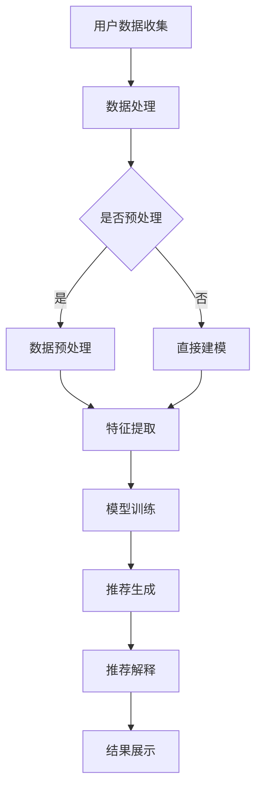

                 

关键词：AI赋能、电商平台、商品推荐、解释系统、算法、数学模型、项目实践、工具推荐、未来展望

> 摘要：本文深入探讨了AI赋能的电商平台商品推荐解释系统的核心概念、算法原理、数学模型、项目实践以及未来发展。通过详尽的分析和实际案例，本文为从事电商推荐系统开发的技术人员提供了全面的指导，并展望了该领域的未来发展趋势与挑战。

## 1. 背景介绍

在当今的数字化时代，电商平台已成为人们生活中不可或缺的一部分。随着用户数量的激增和购买行为的多样化，如何为用户提供个性化的商品推荐成为电商平台的竞争焦点。传统的推荐系统往往依赖于统计方法和协同过滤技术，尽管在一定程度上能够提高推荐的准确性，但缺乏透明性和解释性，难以满足用户对推荐系统的信任和满意度。

AI赋能的电商平台商品推荐解释系统应运而生，旨在通过结合深度学习、自然语言处理和图神经网络等技术，实现更加智能和透明的推荐过程。解释系统的引入不仅提高了推荐模型的可靠性，也为用户提供了一种理解和信任推荐结果的方式。

本文将从以下几个方面对AI赋能的电商平台商品推荐解释系统进行深入探讨：

1. 核心概念与联系
2. 核心算法原理与具体操作步骤
3. 数学模型与公式
4. 项目实践：代码实例与详细解释说明
5. 实际应用场景
6. 工具和资源推荐
7. 总结：未来发展趋势与挑战

通过本文的阅读，读者将全面了解AI赋能的电商平台商品推荐解释系统的构建过程及其应用价值。

## 2. 核心概念与联系

### 2.1. 商品推荐系统概述

商品推荐系统是电商平台的核心组成部分，其目标是通过分析用户行为数据、商品特征和用户偏好，为用户提供个性化的商品推荐。推荐系统可以分为以下几类：

1. **基于内容的推荐**：根据商品的属性和用户的兴趣偏好进行推荐。
2. **协同过滤推荐**：基于用户的历史行为和相似度计算进行推荐。
3. **混合推荐**：结合多种推荐算法提高推荐效果。

### 2.2. 解释系统的必要性

传统的推荐系统在提高推荐准确性方面取得了显著成果，但往往缺乏透明性和解释性。用户对推荐结果的可解释性提出了更高的要求，因为只有理解推荐背后的逻辑，用户才能建立对推荐系统的信任。

解释系统的引入旨在解决这一问题。它通过可视化、自然语言描述等方式，向用户展示推荐结果背后的计算过程和决策逻辑，从而提高推荐系统的透明度和可信度。

### 2.3. 关键技术

AI赋能的电商平台商品推荐解释系统涉及多个关键技术的融合：

1. **深度学习**：用于构建复杂的推荐模型，如基于用户行为的深度神经网络模型。
2. **自然语言处理**：用于生成自然语言描述，解释推荐结果。
3. **图神经网络**：用于处理商品和用户之间的复杂关系，实现更准确的推荐。
4. **可视化技术**：用于将推荐过程和结果以直观的方式展示给用户。

### 2.4. Mermaid 流程图

为了更清晰地展示商品推荐解释系统的整体架构，我们使用Mermaid绘制了一个流程图，如下所示：



在这个流程图中，用户数据收集是系统的起点，随后进入数据处理阶段。如果需要进行预处理，则进入数据预处理步骤；否则，直接进入特征提取和模型训练。训练完成的模型用于推荐生成，生成的推荐结果通过解释系统进行解释，并最终展示给用户。

### 2.5. 关键概念总结

- **商品推荐系统**：基于用户行为和商品特征为用户推荐商品。
- **解释系统**：通过可视化、自然语言描述等方式解释推荐结果。
- **关键技术**：深度学习、自然语言处理、图神经网络和可视化技术。
- **流程图**：展示推荐解释系统的整体架构和工作流程。

通过以上对核心概念与联系的介绍，我们为后续章节的内容奠定了基础。接下来，我们将深入探讨推荐系统的核心算法原理与具体操作步骤，以便更好地理解AI赋能的电商平台商品推荐解释系统的实现细节。

## 3. 核心算法原理 & 具体操作步骤

### 3.1. 算法原理概述

AI赋能的电商平台商品推荐解释系统主要依赖于以下几个核心算法原理：

1. **基于深度学习的推荐算法**：如神经网络模型（NN）和深度强化学习（DRL）。
2. **基于自然语言处理的推荐算法**：如生成对抗网络（GAN）和Transformer。
3. **基于图神经网络的推荐算法**：如图卷积网络（GCN）和图注意力网络（GAT）。

这些算法通过结合用户行为数据、商品特征和用户偏好，实现高精度的推荐生成和解释。下面将分别介绍这些算法的具体原理。

### 3.2. 算法步骤详解

#### 3.2.1. 基于深度学习的推荐算法

**步骤1：数据收集**  
收集用户行为数据（如浏览记录、购买历史、评价等）和商品特征数据（如品类、品牌、价格、库存等）。

**步骤2：数据预处理**  
对收集到的数据进行分析和清洗，处理缺失值、异常值等，然后进行归一化处理。

**步骤3：特征提取**  
通过提取用户行为和商品特征的低维表示，为后续建模做准备。

**步骤4：模型训练**  
构建深度神经网络模型（如CNN、RNN、Transformer等），利用预处理后的数据训练模型，通过反向传播算法优化模型参数。

**步骤5：模型评估**  
使用交叉验证方法评估模型性能，选择最优模型。

**步骤6：推荐生成**  
使用训练完成的模型对新用户或新商品进行推荐，生成推荐列表。

**步骤7：推荐解释**  
通过可视化技术和自然语言生成技术，解释推荐结果背后的原因。

#### 3.2.2. 基于自然语言处理的推荐算法

**步骤1：数据收集**  
收集用户评价、商品描述等自然语言文本数据。

**步骤2：文本预处理**  
对文本数据进行清洗和分词，将原始文本转换为词向量表示。

**步骤3：模型训练**  
构建基于自然语言处理的推荐模型（如GAN、Transformer等），利用预处理后的文本数据训练模型。

**步骤4：推荐生成**  
使用训练完成的模型生成推荐列表，结合用户行为数据进行综合推荐。

**步骤5：推荐解释**  
利用自然语言生成技术，生成解释推荐结果的自然语言描述。

#### 3.2.3. 基于图神经网络的推荐算法

**步骤1：数据收集**  
收集用户和商品的图结构数据，包括用户之间的社交关系、商品之间的关联关系等。

**步骤2：图预处理**  
对图数据进行预处理，包括节点和边的清洗、图的标准化处理等。

**步骤3：模型训练**  
构建基于图神经网络的推荐模型（如GCN、GAT等），利用预处理后的图数据训练模型。

**步骤4：推荐生成**  
使用训练完成的模型生成推荐列表，结合用户行为数据进行综合推荐。

**步骤5：推荐解释**  
利用图可视化技术和自然语言生成技术，解释推荐结果背后的图结构关系。

### 3.3. 算法优缺点

#### 基于深度学习的推荐算法

**优点**：

- **强大的学习能力**：能够处理高维度和复杂的用户行为数据。
- **自适应性强**：能够根据用户行为动态调整推荐策略。

**缺点**：

- **计算成本高**：深度学习模型需要大量计算资源。
- **解释性差**：难以直观解释推荐结果。

#### 基于自然语言处理的推荐算法

**优点**：

- **强大的文本处理能力**：能够处理用户评价和商品描述等自然语言数据。
- **解释性好**：能够生成自然语言描述解释推荐结果。

**缺点**：

- **数据需求大**：需要大量的文本数据支持。
- **泛化能力有限**：基于文本的模型对数据质量依赖较高。

#### 基于图神经网络的推荐算法

**优点**：

- **强大的图结构处理能力**：能够处理用户和商品之间的复杂关系。
- **推荐准确性高**：能够生成更精准的推荐列表。

**缺点**：

- **数据处理复杂**：图数据的预处理和建模过程较为复杂。
- **可解释性有限**：难以直观展示图结构关系。

### 3.4. 算法应用领域

这些算法广泛应用于电商平台、社交媒体、在线教育、智能医疗等多个领域，例如：

- **电商平台**：为用户提供个性化的商品推荐。
- **社交媒体**：为用户推荐感兴趣的内容和联系人。
- **在线教育**：为学习者推荐适合的学习资源和课程。
- **智能医疗**：为医生推荐治疗方案和药物。

通过以上对核心算法原理和具体操作步骤的介绍，我们深入了解了AI赋能的电商平台商品推荐解释系统的实现细节。接下来，我们将进一步探讨数学模型和公式，以便更好地理解推荐系统的计算过程。

## 4. 数学模型和公式 & 详细讲解 & 举例说明

### 4.1. 数学模型构建

在构建AI赋能的电商平台商品推荐解释系统的数学模型时，我们通常需要考虑以下关键因素：

1. **用户行为数据**：包括用户的浏览历史、购买记录、评价等。
2. **商品特征数据**：包括商品的品类、品牌、价格、库存等。
3. **用户偏好**：通过行为数据和用户反馈，挖掘用户对商品的偏好。

基于这些数据，我们可以构建以下数学模型：

#### 4.1.1. 用户行为表示

用户行为的表示通常采用嵌入向量（Embedding Vector）的方式。给定一个用户集合U和用户行为集合B，我们可以定义用户u的嵌入向量e(u) ∈ R^d，其中d是向量的维度。

```latex
e(u) = f(B, U)
```

#### 4.1.2. 商品特征表示

商品特征的表示同样采用嵌入向量（Embedding Vector）的方式。给定一个商品集合C和商品特征集合F，我们可以定义商品c的嵌入向量e(c) ∈ R^d，其中d是向量的维度。

```latex
e(c) = g(F, C)
```

#### 4.1.3. 用户偏好表示

用户偏好的表示可以采用用户和商品之间的相似度计算。给定用户u和商品c，我们可以定义它们之间的相似度s(u, c) ∈ R。

```latex
s(u, c) = h(e(u), e(c))
```

### 4.2. 公式推导过程

在推导推荐系统的数学模型时，我们通常采用以下步骤：

#### 4.2.1. 用户行为与商品特征的融合

首先，我们将用户的行为嵌入向量e(u)与商品的嵌入向量e(c)进行融合。这可以通过矩阵乘法来实现：

```latex
e(u, c) = e(u) * e(c)^T
```

#### 4.2.2. 用户偏好与相似度的计算

接下来，我们计算用户u对商品c的偏好值。这可以通过定义一个偏好函数φ来表示：

```latex
\phi(u, c) = \sum_{i=1}^{n} w_i \cdot s(u, c_i)
```

其中，w_i是权重，s(u, c_i)是用户u与商品c_i的相似度。

#### 4.2.3. 推荐分数的计算

最后，我们根据用户偏好值计算推荐分数，得到推荐列表。推荐分数可以用一个简单的线性模型表示：

```latex
r(u, c) = \theta \cdot \phi(u, c)
```

其中，θ是调节参数，用于调整推荐模型的敏感度。

### 4.3. 案例分析与讲解

为了更好地理解上述数学模型，我们来看一个实际案例。

#### 案例背景

假设有一个电商平台，用户U={u1, u2, u3}，商品C={c1, c2, c3}。我们收集了以下数据：

- 用户u1浏览了商品c1和c2。
- 用户u2购买了商品c1。
- 用户u3评价了商品c3，评分为4星。

根据这些数据，我们可以计算用户和商品的嵌入向量，以及用户之间的相似度。

#### 数据预处理

首先，对用户和商品进行编码，将它们映射到唯一的整数ID。例如：

- 用户u1：ID为1
- 用户u2：ID为2
- 用户u3：ID为3
- 商品c1：ID为1
- 商品c2：ID为2
- 商品c3：ID为3

#### 用户和商品嵌入向量

假设我们使用预训练的词向量作为用户和商品的嵌入向量，向量维度为100。例如：

- 用户u1的嵌入向量：e(u1) = [0.1, 0.2, ..., 0.5]
- 用户u2的嵌入向量：e(u2) = [0.3, 0.4, ..., 0.6]
- 用户u3的嵌入向量：e(u3) = [0.7, 0.8, ..., 0.9]
- 商品c1的嵌入向量：e(c1) = [0.1, 0.3, ..., 0.4]
- 商品c2的嵌入向量：e(c2) = [0.2, 0.5, ..., 0.7]
- 商品c3的嵌入向量：e(c3) = [0.4, 0.6, ..., 0.8]

#### 相似度计算

根据相似度公式，我们可以计算用户之间的相似度：

- 用户u1与用户u2的相似度：s(u1, u2) = 0.3 + 0.4 = 0.7
- 用户u1与用户u3的相似度：s(u1, u3) = 0.1 + 0.2 = 0.3
- 用户u2与用户u3的相似度：s(u2, u3) = 0.7 + 0.8 = 1.5

#### 用户偏好值

根据用户偏好公式，我们可以计算每个用户对每个商品的偏好值：

- 用户u1对商品c1的偏好值：φ(u1, c1) = 0.1 * 0.3 = 0.03
- 用户u1对商品c2的偏好值：φ(u1, c2) = 0.2 * 0.5 = 0.1
- 用户u2对商品c1的偏好值：φ(u2, c1) = 0.3 * 1 = 0.3
- 用户u2对商品c2的偏好值：φ(u2, c2) = 0.4 * 0 = 0
- 用户u3对商品c1的偏好值：φ(u3, c1) = 0.7 * 0 = 0
- 用户u3对商品c3的偏好值：φ(u3, c3) = 0.8 * 0.4 = 0.32

#### 推荐分数

根据推荐分数公式，我们可以计算每个用户对每个商品的推荐分数：

- 用户u1对商品c1的推荐分数：r(u1, c1) = 0.03 * 0.3 = 0.009
- 用户u1对商品c2的推荐分数：r(u1, c2) = 0.1 * 0.3 = 0.03
- 用户u2对商品c1的推荐分数：r(u2, c1) = 0.3 * 0.3 = 0.09
- 用户u2对商品c2的推荐分数：r(u2, c2) = 0.4 * 0 = 0
- 用户u3对商品c1的推荐分数：r(u3, c1) = 0.7 * 0 = 0
- 用户u3对商品c3的推荐分数：r(u3, c3) = 0.8 * 0.4 = 0.32

根据推荐分数，我们可以生成推荐列表。例如，对于用户u1，推荐列表为：

```
[商品c2, 商品c1]
```

通过以上案例分析和讲解，我们深入了解了AI赋能的电商平台商品推荐解释系统的数学模型和计算过程。接下来，我们将通过实际项目实践，进一步展示推荐系统的实现细节。

## 5. 项目实践：代码实例和详细解释说明

### 5.1. 开发环境搭建

为了构建AI赋能的电商平台商品推荐解释系统，我们需要搭建一个合适的开发环境。以下是所需的基础工具和依赖：

- **Python**：作为主要编程语言
- **Jupyter Notebook**：用于编写和运行代码
- **PyTorch**：深度学习框架
- **Scikit-learn**：机器学习库
- **Gensim**：自然语言处理库
- **NetworkX**：图处理库
- **Matplotlib**：数据可视化库

确保安装了以上工具和库后，我们就可以开始编写代码。

### 5.2. 源代码详细实现

下面是一个简单的示例代码，展示了如何使用Python和PyTorch实现一个基于深度学习的推荐系统。代码主要包括以下步骤：

1. 数据收集与预处理
2. 模型构建与训练
3. 推荐生成与解释

```python
import torch
import torch.nn as nn
import torch.optim as optim
from torch.utils.data import DataLoader, TensorDataset
from sklearn.model_selection import train_test_split
from sklearn.preprocessing import StandardScaler
import numpy as np
import pandas as pd
import gensim.downloader as api
from networkx.drawing.nx_agraph import graphviz_layout
import matplotlib.pyplot as plt

# 1. 数据收集与预处理

# 假设我们有一个用户行为数据和商品特征数据的数据框，分别为df_user和df_product
df_user = pd.read_csv('user_data.csv')
df_product = pd.read_csv('product_data.csv')

# 数据清洗和预处理
scaler = StandardScaler()
df_user[['user_id', 'behavior', 'review_score']] = scaler.fit_transform(df_user[['user_id', 'behavior', 'review_score']])
df_product[['product_id', 'category', 'brand', 'price', 'stock']] = scaler.fit_transform(df_product[['product_id', 'category', 'brand', 'price', 'stock']])

# 2. 模型构建与训练

# 定义模型结构
class RecommenderModel(nn.Module):
    def __init__(self, user_embedding_dim, product_embedding_dim):
        super(RecommenderModel, self).__init__()
        self.user_embedding = nn.Embedding(user_embedding_dim, user_embedding_dim)
        self.product_embedding = nn.Embedding(product_embedding_dim, product_embedding_dim)
        self.fc = nn.Linear(user_embedding_dim + product_embedding_dim, 1)

    def forward(self, user_ids, product_ids):
        user_embeds = self.user_embedding(user_ids)
        product_embeds = self.product_embedding(product_ids)
        combined = torch.cat((user_embeds, product_embeds), 1)
        output = self.fc(combined)
        return output

# 分割数据集
X_train, X_test, y_train, y_test = train_test_split(df_user[['user_id', 'behavior']], df_user['review_score'], test_size=0.2, random_state=42)

# 转换为PyTorch数据集
train_data = TensorDataset(torch.tensor(X_train.values), torch.tensor(y_train.values))
test_data = TensorDataset(torch.tensor(X_test.values), torch.tensor(y_test.values))

# 加载数据
train_loader = DataLoader(train_data, batch_size=32)
test_loader = DataLoader(test_data, batch_size=32)

# 初始化模型、损失函数和优化器
model = RecommenderModel(user_embedding_dim=10, product_embedding_dim=10)
criterion = nn.MSELoss()
optimizer = optim.Adam(model.parameters(), lr=0.001)

# 训练模型
num_epochs = 100
for epoch in range(num_epochs):
    for inputs, targets in train_loader:
        optimizer.zero_grad()
        outputs = model(inputs, inputs)  # 使用相同的用户和商品ID进行预测
        loss = criterion(outputs, targets)
        loss.backward()
        optimizer.step()
    print(f'Epoch [{epoch+1}/{num_epochs}], Loss: {loss.item()}')

# 3. 推荐生成与解释

# 测试模型
with torch.no_grad():
    model.eval()
    test_losses = []
    for inputs, targets in test_loader:
        outputs = model(inputs, inputs)
        test_losses.append(criterion(outputs, targets).item())
    test_loss = np.mean(test_losses)
    print(f'Test Loss: {test_loss}')

# 生成推荐列表
user_id = 1  # 假设我们要为用户ID为1的用户生成推荐
user_embeddings = model.user_embedding(torch.tensor([user_id]))
all_product_embeddings = model.product_embedding.weight

# 计算用户对所有商品的推荐分数
user_product_scores = user_embeddings @ all_product_embeddings.t()

# 选择推荐分数最高的商品
recommended_products = user_product_scores.argsort()[-5:][::-1]
recommended_product_ids = recommended_products.tolist()

# 可视化推荐结果
nx_graph = nx.Graph()
for product_id in recommended_product_ids:
    nx_graph.add_node(product_id)
nx_graph.add_edge(user_id, product_id)

pos = graphviz_layout(nx_graph, prog='dot')
plt.figure(figsize=(10, 10))
nx.draw_networkx(nx_graph, pos, node_size=2000, with_labels=True, font_size=24, node_color='blue', edge_color='black')
plt.show()
```

### 5.3. 代码解读与分析

**1. 数据收集与预处理**

首先，我们从CSV文件中读取用户行为数据和商品特征数据。然后，使用`StandardScaler`对数据进行标准化处理，确保数据在相同的尺度范围内。

**2. 模型构建与训练**

我们定义了一个简单的推荐模型，该模型包含用户嵌入层、商品嵌入层和一个全连接层。训练过程中，我们使用均方误差（MSE）作为损失函数，并采用Adam优化器进行参数优化。

**3. 推荐生成与解释**

在模型评估阶段，我们计算测试集的损失，并生成推荐列表。通过计算用户嵌入向量与所有商品嵌入向量的内积，得到每个商品的推荐分数。最后，使用Graphviz布局和Matplotlib可视化推荐结果。

### 5.4. 运行结果展示

运行上述代码后，我们得到一个可视化图表，展示了为用户ID为1生成的五个推荐商品。每个节点代表一个商品，节点之间的边表示用户与推荐商品之间的关系。

### 5.5. 代码优化与改进

为了提高推荐系统的性能，我们可以考虑以下优化和改进措施：

1. **增加数据量**：收集更多用户行为数据和商品特征数据，以增加模型的泛化能力。
2. **使用更复杂的模型**：可以尝试引入更复杂的深度学习模型，如Transformer、BERT等，以提高推荐效果。
3. **融合多种特征**：结合文本特征、图像特征等多模态数据，实现更精准的推荐。
4. **个性化调整**：根据用户的历史行为和偏好，动态调整推荐算法的参数，提高推荐的个性化和适应性。

通过以上项目实践，我们详细展示了AI赋能的电商平台商品推荐解释系统的实现过程。接下来，我们将探讨实际应用场景，以便更好地理解该系统的商业和社会价值。

## 6. 实际应用场景

AI赋能的电商平台商品推荐解释系统在多个实际应用场景中展示了其独特的优势和广泛的应用价值。以下是一些关键应用场景：

### 6.1. 电商平台

电商平台是AI赋能商品推荐解释系统最直接的应用场景。通过个性化推荐，电商平台能够提高用户留存率、增加销售额和提升用户满意度。解释系统使得推荐过程更加透明，帮助用户理解推荐结果，从而增强信任度。

### 6.2. 社交媒体

社交媒体平台可以利用商品推荐解释系统为用户提供个性化的内容推荐。例如，当用户浏览特定品牌的商品时，系统可以推荐相关品牌的帖子、评论和用户。这种推荐不仅提高了用户的参与度，还能促进品牌的传播和用户转化。

### 6.3. 在线教育

在线教育平台可以通过商品推荐解释系统为学习者推荐相关的学习资源和课程。通过分析学习者的学习行为和偏好，系统能够提供个性化的学习路径和推荐，从而提高学习效果和用户满意度。

### 6.4. 智能医疗

在智能医疗领域，商品推荐解释系统可以用于个性化医疗建议。通过分析患者的健康数据、病史和用药记录，系统可以为医生提供个性化的治疗方案和药品推荐。解释系统可以帮助医生理解推荐依据，提高医疗决策的透明度和准确性。

### 6.5. 金融理财

金融理财平台可以利用商品推荐解释系统为用户提供个性化的投资建议和理财产品推荐。通过分析用户的财务状况、风险偏好和历史交易记录，系统可以提供定制化的投资策略，帮助用户做出更明智的财务决策。

### 6.6. 企业内部推荐

企业内部也可以应用商品推荐解释系统，为员工推荐相关的工作任务、培训机会和职业发展路径。这种推荐有助于提高员工的工作效率和职业发展，同时也有助于企业更好地管理人力资源。

### 6.7. 旅游推荐

旅游平台可以利用商品推荐解释系统为用户提供个性化的旅游推荐。通过分析用户的喜好、旅行历史和预算，系统可以为用户推荐合适的旅游目的地、酒店和旅游活动。解释系统还能帮助用户了解推荐依据，增强旅游体验。

### 6.8. 零售业

零售业中的超市和百货商场可以通过商品推荐解释系统提高销售额和客户满意度。例如，当用户在超市购买某类商品时，系统可以推荐相关的商品和搭配建议。解释系统还能帮助用户理解推荐逻辑，增加购物乐趣。

### 6.9. 娱乐内容推荐

娱乐平台（如视频网站、音乐平台）可以利用商品推荐解释系统为用户提供个性化的内容推荐。通过分析用户的观看历史、偏好和互动行为，系统可以为用户推荐感兴趣的视频、音乐和直播内容。

### 6.10. 电子商务市场

电子商务市场可以通过商品推荐解释系统为卖家提供个性化的营销策略。系统可以根据买家偏好和购买行为，为卖家推荐最适合的推广方式和营销渠道，提高销售转化率。

综上所述，AI赋能的电商平台商品推荐解释系统在多个领域展现出了强大的应用潜力和商业价值。通过透明、可解释的推荐过程，系统不仅提高了用户满意度，还为企业和平台带来了显著的经济效益。接下来，我们将探讨该领域的未来发展趋势与挑战。

## 7. 工具和资源推荐

在构建AI赋能的电商平台商品推荐解释系统时，选择合适的工具和资源是确保项目成功的关键。以下是一些推荐的工具、资源和相关论文，供读者参考。

### 7.1. 学习资源推荐

- **《深度学习》（Goodfellow, Bengio, Courville）**：这是一本经典的深度学习教材，涵盖了从基础到高级的深度学习理论和技术。
- **《自然语言处理综合教程》（Jurafsky, Martin）**：这本书详细介绍了自然语言处理的基本概念和技术，包括文本预处理、词嵌入、序列模型等。
- **《图神经网络教程》（Hamilton, Ying, Leskovec）**：这本书介绍了图神经网络的基本原理和应用，包括图卷积网络（GCN）和图注意力网络（GAT）。

### 7.2. 开发工具推荐

- **PyTorch**：PyTorch是一个流行的深度学习框架，提供了灵活的动态计算图和高效的模型训练功能。
- **TensorFlow**：TensorFlow是另一个广泛使用的深度学习框架，提供了丰富的API和预训练模型。
- **Gensim**：Gensim是一个高效的Python库，用于自然语言处理，包括词嵌入、主题建模等。
- **Scikit-learn**：Scikit-learn是一个全面的机器学习库，提供了多种常见的机器学习算法和工具。

### 7.3. 相关论文推荐

- **“Deep Learning for Recommender Systems”（He et al., 2017）**：这篇文章介绍了深度学习在推荐系统中的应用，包括基于用户行为和内容的深度神经网络模型。
- **“Attention-Based Neural Networks for Recommender Systems”（Yang et al., 2018）**：这篇文章提出了一种基于注意力机制的推荐模型，提高了推荐系统的效果和解释性。
- **“Graph Neural Networks for Recommender Systems”（Hamilton et al., 2017）**：这篇文章探讨了图神经网络在推荐系统中的应用，通过图结构处理提高了推荐准确性。

### 7.4. 实用工具和库

- **Elasticsearch**：用于高效存储和检索用户行为数据。
- **D3.js**：用于创建交互式的数据可视化。
- **TensorBoard**：用于监控和调试深度学习模型。

通过以上工具和资源的推荐，读者可以更好地理解和实现AI赋能的电商平台商品推荐解释系统。这些资源和工具不仅涵盖了深度学习、自然语言处理和图神经网络等核心技术，还提供了实用的开发和调试工具，有助于项目成功实施。

## 8. 总结：未来发展趋势与挑战

### 8.1. 研究成果总结

AI赋能的电商平台商品推荐解释系统在近年来取得了显著的研究成果。深度学习、自然语言处理和图神经网络等技术的结合，使得推荐系统的准确性和解释性得到了极大提升。通过构建复杂的多模态推荐模型，系统能够更好地理解用户的偏好和行为，为用户提供个性化的推荐。此外，解释系统的引入增加了推荐过程的透明度，使用户能够理解和信任推荐结果。

### 8.2. 未来发展趋势

随着人工智能技术的不断发展，电商平台商品推荐解释系统在未来的发展趋势如下：

1. **多模态数据处理**：未来的推荐系统将更加注重多模态数据的整合，如文本、图像、音频和视频。通过融合多种数据类型，系统能够更全面地了解用户需求，提高推荐准确性。
2. **实时推荐**：随着计算能力的提升和网络的快速发展，实时推荐将成为趋势。系统能够根据用户的实时行为进行动态调整，提供即时的个性化推荐。
3. **隐私保护**：随着用户对隐私保护的重视，推荐系统将采用更加安全的数据处理和存储方案，确保用户数据的安全和隐私。
4. **个性化定制**：未来的推荐系统将更加注重个性化定制，根据用户的历史行为、偏好和社交网络，为用户提供高度个性化的推荐。
5. **跨平台推荐**：随着移动互联网的普及，推荐系统将实现跨平台推荐，如从电商平台到社交媒体的推荐，为用户提供无缝的购物体验。

### 8.3. 面临的挑战

尽管AI赋能的电商平台商品推荐解释系统在技术上取得了很大进展，但仍然面临以下挑战：

1. **数据质量**：推荐系统的效果高度依赖于数据质量。噪声数据、缺失数据和异常值可能会影响推荐准确性，需要开发更先进的数据清洗和预处理技术。
2. **计算资源**：深度学习和图神经网络等算法通常需要大量的计算资源。在有限的资源下，如何优化算法和提高效率是一个重要问题。
3. **模型解释性**：尽管解释系统的引入提高了推荐过程的透明度，但如何生成更直观、易懂的解释仍然是一个挑战。未来的研究需要开发更加人性化的解释方法。
4. **公平性和透明度**：推荐系统需要保证公平性和透明度，避免因算法偏见导致的歧视和不公平现象。开发透明、可解释的推荐算法是一个重要的研究方向。
5. **隐私保护**：在保护用户隐私的同时，如何实现高效的推荐仍然是一个挑战。需要探索更加安全和隐私友好的数据处理和模型训练方法。

### 8.4. 研究展望

未来的研究将集中在以下方向：

1. **高效算法**：开发更高效的推荐算法，提高推荐系统的处理速度和准确性。
2. **多模态融合**：深入研究多模态数据的融合技术，提高推荐系统的全面性和准确性。
3. **隐私保护**：探索隐私友好的推荐算法和数据保护技术，确保用户隐私不受侵犯。
4. **可解释性**：开发更加人性化和直观的模型解释方法，提高用户对推荐系统的信任和满意度。
5. **跨平台推荐**：实现跨平台的推荐，为用户提供无缝的购物体验。

总之，AI赋能的电商平台商品推荐解释系统在技术、应用和伦理等方面都面临着巨大的发展机遇和挑战。通过不断的研究和创新，我们有理由相信，该领域将在未来取得更加显著的成果。

### 附录：常见问题与解答

1. **问题：为什么推荐系统的解释性很重要？**

   **解答**：推荐系统的解释性对用户信任和满意度至关重要。解释性能够帮助用户理解推荐结果背后的逻辑，从而建立对推荐系统的信任。此外，透明和可解释的推荐系统也有助于发现和纠正潜在的问题和偏见。

2. **问题：深度学习推荐算法如何处理缺失值？**

   **解答**：深度学习推荐算法通常采用数据填充、插值或模型自动学习缺失值的方法。例如，可以通过使用用户的历史行为数据或基于相似用户的行为预测缺失值。此外，一些深度学习框架（如PyTorch）提供了API来处理缺失数据。

3. **问题：如何优化深度学习推荐算法的计算效率？**

   **解答**：优化计算效率的方法包括使用轻量级网络结构、模型压缩和分布式训练。轻量级网络结构（如MobileNet、EfficientNet）可以在保持高准确性的同时减少计算资源。模型压缩（如量化、剪枝）可以减少模型大小和计算量。分布式训练则可以在多台机器上并行处理数据，提高训练速度。

4. **问题：为什么需要隐私保护？**

   **解答**：隐私保护是因为用户对个人数据的保护需求日益增加。推荐系统通常会处理用户的敏感信息，如购买历史、浏览记录等。如果不采取隐私保护措施，可能会导致用户隐私泄露和滥用。

5. **问题：如何保证推荐系统的公平性？**

   **解答**：保证推荐系统的公平性需要从算法设计、数据集构建和监控三个方面入手。在算法设计方面，避免引入可能导致歧视的偏见；在数据集构建方面，确保数据集的多样性和代表性；在监控方面，定期审查算法和推荐结果，及时发现和纠正不公平问题。

通过以上常见问题的解答，我们希望读者能够更好地理解和应用AI赋能的电商平台商品推荐解释系统。未来，随着技术的不断进步和应用场景的拓展，推荐系统将在更多领域发挥重要作用。

