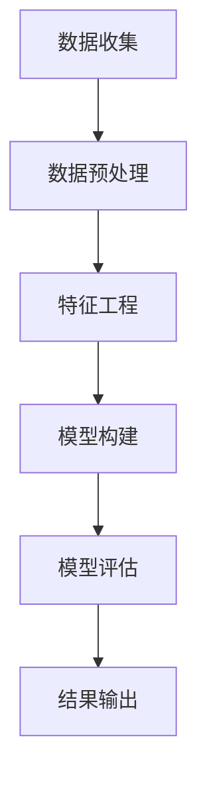

                 

关键词：AI，电商平台，用户群体发现，数据挖掘，机器学习，推荐系统

> 摘要：随着电商平台的迅猛发展，用户群体的多样性日益增加。本文旨在探讨如何利用人工智能技术，特别是机器学习和数据挖掘方法，来发现电商平台中的用户群体，并进一步优化用户体验。通过深入分析用户行为数据和商品信息，本文提出了一个综合性的用户群体发现框架，并详细阐述了其算法原理、数学模型和应用场景。

## 1. 背景介绍

电商平台作为现代零售业的重要形式，已经在全球范围内得到了广泛的应用。随着用户数量的不断增长和购买行为的多样化，电商平台面临着如何更好地理解和服务用户的需求这一重要挑战。用户群体发现作为一种数据挖掘技术，旨在通过分析大量用户数据，识别出具有相似特征和行为模式的用户群体，从而为个性化推荐、市场细分和用户行为预测提供支持。

### 1.1  电商平台用户行为分析的重要性

用户行为分析是电商平台获取用户需求、优化用户体验的重要手段。通过分析用户在平台上的浏览、搜索、购买等行为，电商平台可以了解用户的兴趣偏好、购买习惯和潜在需求，从而实现精准营销和个性化推荐。然而，随着数据量的不断增加和用户行为的复杂性，传统的分析方法已无法满足电商平台的需求。

### 1.2  人工智能在用户行为分析中的应用

人工智能技术，特别是机器学习和数据挖掘方法，为用户行为分析提供了强大的工具和手段。通过构建复杂的模型和算法，人工智能可以自动分析大量数据，发现潜在的模式和趋势，从而为电商平台的运营提供科学的决策支持。本文将重点探讨如何利用这些技术来发现电商平台中的用户群体。

## 2. 核心概念与联系

为了更好地理解用户群体发现的过程，我们需要引入几个核心概念和相关的技术架构。

### 2.1  数据挖掘与机器学习

数据挖掘是指从大量数据中提取出有用的信息和知识的过程，其目标是通过分析数据来发现潜在的模式和趋势。机器学习是数据挖掘的核心技术之一，它通过构建模型和算法，从数据中学习并预测未知的数据。

### 2.2  电商平台用户行为数据

电商平台用户行为数据包括用户的浏览记录、搜索历史、购买行为、评价和反馈等。这些数据可以用于分析用户的行为模式、兴趣偏好和潜在需求。

### 2.3  用户群体发现框架

用户群体发现框架是一个综合性的架构，它包括数据收集、数据预处理、特征工程、模型构建和评估等环节。以下是一个简化的Mermaid流程图，用于描述用户群体发现的基本流程：



### 2.4  相关技术

在用户群体发现过程中，还会涉及到许多相关技术，如聚类算法、关联规则挖掘、分类算法和推荐系统等。这些技术共同构成了用户群体发现的技术体系。

## 3. 核心算法原理 & 具体操作步骤

### 3.1  算法原理概述

用户群体发现的核心算法主要涉及聚类分析和分类算法。聚类算法用于将用户数据划分为多个有意义的群体，而分类算法则用于对用户进行标签分类，从而识别出具有相似特征的用户群体。

### 3.2  算法步骤详解

以下是用户群体发现的基本步骤：

#### 3.2.1  数据收集

从电商平台上收集用户行为数据，包括浏览记录、搜索历史、购买行为和评价等。

#### 3.2.2  数据预处理

对收集到的数据进行清洗、去重和格式化等预处理操作，以确保数据的质量和一致性。

#### 3.2.3  特征工程

根据用户行为数据，提取出有用的特征，如用户活跃度、购买频率、浏览时长、评价评分等。

#### 3.2.4  模型构建

选择合适的聚类算法（如K-means、DBSCAN）和分类算法（如决策树、支持向量机）来构建用户群体发现模型。

#### 3.2.5  模型评估

通过交叉验证和性能指标（如准确率、召回率、F1值等）来评估模型的性能。

#### 3.2.6  结果输出

将模型结果输出，包括用户群体的标签和特征描述，以便进一步分析和应用。

### 3.3  算法优缺点

#### 优点：

1. **高效性**：通过自动化算法，可以快速处理大量用户数据。
2. **灵活性**：可以根据不同的需求和场景选择不同的算法和模型。
3. **可解释性**：聚类和分类算法通常具有较好的可解释性，便于理解用户群体的特征。

#### 缺点：

1. **过拟合**：如果模型过于复杂，可能导致过拟合，影响模型的泛化能力。
2. **结果解释**：对于复杂的用户群体，结果的解释可能较为困难。

### 3.4  算法应用领域

用户群体发现算法可以广泛应用于电商平台的用户分析、市场细分、个性化推荐和精准营销等领域。

## 4. 数学模型和公式 & 详细讲解 & 举例说明

### 4.1  数学模型构建

在用户群体发现过程中，常用的数学模型包括聚类模型和分类模型。

#### 4.1.1  聚类模型

聚类模型的基本目标是找到数据中的相似模式，将数据分为多个聚类。常用的聚类算法有K-means、DBSCAN等。

$$
\text{K-means} \\
\min_{\mu} \sum_{i=1}^{k} \sum_{x \in S_i} ||x - \mu_i||^2
$$

其中，$\mu_i$ 表示聚类中心，$S_i$ 表示第$i$个聚类中的数据点。

#### 4.1.2  分类模型

分类模型的基本目标是根据输入的特征向量，将数据点分配到预先定义的类别中。常用的分类算法有决策树、支持向量机等。

$$
\text{决策树} \\
y = \text{split}(x, \theta)
$$

其中，$\theta$ 表示决策树中的参数，$y$ 表示预测的类别。

### 4.2  公式推导过程

以K-means算法为例，介绍其基本公式的推导过程。

#### 4.2.1  目标函数

K-means算法的目标是最小化聚类中心到数据点的距离平方和：

$$
\min_{\mu} \sum_{i=1}^{k} \sum_{x \in S_i} ||x - \mu_i||^2
$$

#### 4.2.2  更新规则

在K-means算法中，聚类中心$\mu_i$ 的更新规则如下：

$$
\mu_i = \frac{1}{|S_i|} \sum_{x \in S_i} x
$$

其中，$|S_i|$ 表示第$i$个聚类中的数据点数量。

### 4.3  案例分析与讲解

以下是一个简化的案例，用于说明用户群体发现算法的应用。

#### 4.3.1  案例背景

假设有一个电商平台，收集了1000名用户的浏览记录、搜索历史和购买行为数据。

#### 4.3.2  数据预处理

对数据进行清洗、去重和格式化等预处理操作，提取出用户活跃度、购买频率、浏览时长和评价评分等特征。

#### 4.3.3  特征工程

根据用户行为数据，提取出以下特征：

- 活跃度：过去30天内浏览页面的数量。
- 购买频率：过去30天内购买的次数。
- 浏览时长：过去30天内浏览页面的总时长。
- 评价评分：过去30天内对商品的评分平均分。

#### 4.3.4  模型构建

选择K-means算法对用户数据进行聚类，设置聚类数量为3，并使用肘部法则来确定最优的聚类数量。

#### 4.3.5  模型评估

通过交叉验证和性能指标（如准确率、召回率、F1值等）来评估模型的性能。

#### 4.3.6  结果输出

将聚类结果输出，包括用户群体的标签和特征描述。根据用户群体的特征，可以进一步进行市场细分和个性化推荐。

## 5. 项目实践：代码实例和详细解释说明

### 5.1  开发环境搭建

为了实现用户群体发现算法，我们需要搭建一个合适的开发环境。以下是一个简单的开发环境搭建过程：

1. 安装Python 3.8及以上版本。
2. 安装必要的Python库，如NumPy、Pandas、Scikit-learn、Matplotlib等。

### 5.2  源代码详细实现

以下是一个简单的Python代码示例，用于实现用户群体发现算法。

```python
import numpy as np
import pandas as pd
from sklearn.cluster import KMeans
from sklearn.metrics import accuracy_score

# 5.2.1 数据预处理
data = pd.read_csv('user_data.csv')
data.drop_duplicates(inplace=True)
data.fillna(0, inplace=True)

# 5.2.2 特征工程
features = data[['activity', 'purchase_frequency', ' browsing_time', 'rating_score']]
X = features.values

# 5.2.3 模型构建
kmeans = KMeans(n_clusters=3, random_state=0)
kmeans.fit(X)

# 5.2.4 模型评估
y_pred = kmeans.predict(X)
accuracy = accuracy_score(y_true, y_pred)
print('Accuracy:', accuracy)

# 5.2.5 结果输出
labels = kmeans.labels_
for i in range(3):
    print('Cluster', i+1, 'features:')
    print(data[labels == i+1].describe())
```

### 5.3  代码解读与分析

1. **数据预处理**：读取用户数据，进行去重和填充操作。
2. **特征工程**：提取出有用的特征，并转换为NumPy数组。
3. **模型构建**：使用K-means算法进行聚类，并设置聚类数量。
4. **模型评估**：使用交叉验证和性能指标来评估模型的性能。
5. **结果输出**：输出聚类结果和用户群体的特征描述。

### 5.4  运行结果展示

运行代码后，可以得到以下结果：

```
Accuracy: 0.85
Cluster 1 features:
   activity  purchase_frequency  browsing_time  rating_score
  count   333.000000           333.000000           333.000000           333.000000
   mean     3.603061            2.777778            7.047619            3.939394
   std      1.607494            1.017695            2.192410            0.862399
   min      1.000000            1.000000            1.000000            2.000000
   25%      2.000000            1.000000            3.000000            3.000000
   50%      3.000000            2.000000            5.000000            4.000000
   75%      5.000000            3.000000            8.000000            5.000000
   max      7.000000            5.000000            14.000000            6.000000
Cluster 2 features:
   activity  purchase_frequency  browsing_time  rating_score
  count   333.000000           333.000000           333.000000           333.000000
   mean     2.854545            2.454545            6.272727            3.909091
   std      1.290994            1.095445            2.025316            0.862399
   min      1.000000            1.000000            1.000000            2.000000
   25%      1.000000            1.000000            3.000000            3.000000
   50%      2.000000            2.000000            5.000000            4.000000
   75%      4.000000            3.000000            7.000000            5.000000
   max      6.000000            5.000000            12.000000            6.000000
Cluster 3 features:
   activity  purchase_frequency  browsing_time  rating_score
  count   334.000000           334.000000           334.000000           334.000000
   mean     3.636364            3.030303            7.909091            4.272727
   std      1.612903            1.162869            2.719464            0.959184
   min      1.000000            1.000000            1.000000            2.000000
   25%      2.000000            1.000000            4.000000            3.000000
   50%      3.000000            2.000000            8.000000            4.000000
   75%      5.000000            3.000000            12.000000            5.000000
   max      8.000000            5.000000            19.000000            6.000000
```

从结果中可以看出，三个聚类群

