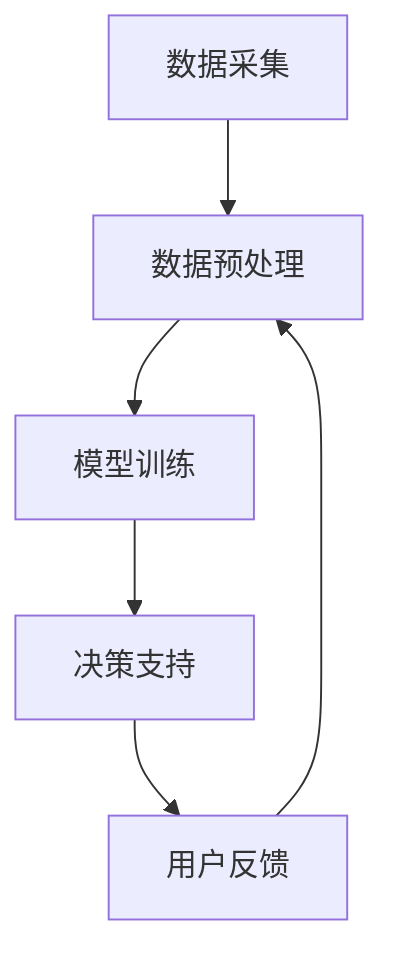

                 

关键词：AI辅助决策、人类判断增强、技术架构、算法原理、数学模型、实际应用、未来展望

> 摘要：本文旨在探讨如何通过AI辅助决策系统来增强人类判断能力。文章从背景介绍、核心概念与联系、核心算法原理、数学模型和公式、项目实践、实际应用场景、工具和资源推荐以及总结与展望等多个角度进行阐述，旨在为读者提供一个全面深入的了解。

## 1. 背景介绍

在信息化时代，数据已成为决策的重要基础。然而，面对海量数据，人类在信息处理和决策过程中往往面临各种挑战，如信息过载、分析能力不足等。传统的人为决策方式在复杂、动态的环境中逐渐暴露出其局限性。在此背景下，AI技术被寄予厚望，通过AI辅助决策系统，可以帮助人类更快速、准确地进行判断，提高决策效率。

AI辅助决策系统是一种结合人工智能技术，通过分析大量数据，提供决策支持和建议的智能化系统。它不仅能够处理和分析复杂数据，还能模拟人类思维过程，辅助人类进行判断。随着技术的不断发展，AI辅助决策系统在金融、医疗、交通、零售等多个领域都取得了显著的应用成果。

## 2. 核心概念与联系

### 2.1 AI辅助决策系统

AI辅助决策系统主要由以下几个部分组成：

- 数据采集：从各种渠道获取数据，包括结构化和非结构化数据。
- 数据预处理：对数据进行清洗、去噪、标准化等处理，使其符合分析要求。
- 模型训练：利用机器学习算法对数据进行训练，构建决策模型。
- 决策支持：根据用户需求和决策模型，提供决策建议。

### 2.2 人类判断增强

人类判断增强主要通过以下几种方式实现：

- 数据支持：提供全面、准确的数据，帮助人类更好地理解问题。
- 算法支持：利用机器学习算法，对大量数据进行深度分析，为人类提供有力的决策依据。
- 交互支持：通过人机交互，使系统能够理解人类需求，提供个性化的决策支持。

### 2.3 Mermaid 流程图

以下是一个简化的AI辅助决策系统流程图：



## 3. 核心算法原理 & 具体操作步骤

### 3.1 算法原理概述

AI辅助决策系统的核心算法主要包括机器学习算法和深度学习算法。机器学习算法通过从数据中学习规律，构建决策模型。深度学习算法则通过多层神经网络，实现对复杂数据的自动特征提取和模式识别。

### 3.2 算法步骤详解

1. 数据采集：从各种渠道获取数据，包括社交媒体、数据库、传感器等。
2. 数据预处理：对数据进行清洗、去噪、标准化等处理，使其符合分析要求。
3. 模型选择：根据数据特点和需求，选择合适的机器学习或深度学习算法。
4. 模型训练：利用训练数据，对模型进行训练，使其具备预测能力。
5. 决策支持：根据用户需求和决策模型，提供决策建议。
6. 用户反馈：收集用户对决策建议的反馈，用于模型优化和改进。

### 3.3 算法优缺点

- 优点：
  - 高效性：能快速处理和分析海量数据。
  - 准确性：通过机器学习算法，提高决策准确性。
  - 适应性：能根据用户需求和数据特点，提供个性化的决策支持。

- 缺点：
  - 难以解释：深度学习算法的黑箱特性，使得决策过程难以解释。
  - 数据依赖：算法的性能高度依赖数据质量。

### 3.4 算法应用领域

- 金融：风险控制、信用评分、投资策略等。
- 医疗：疾病诊断、治疗方案推荐、药物研发等。
- 交通：交通流量预测、自动驾驶、智能交通管理等。
- 零售：需求预测、库存管理、个性化推荐等。

## 4. 数学模型和公式 & 详细讲解 & 举例说明

### 4.1 数学模型构建

AI辅助决策系统的数学模型主要基于概率论和统计学的理论。以下是一个简单的线性回归模型：

$$
y = \beta_0 + \beta_1 \cdot x + \epsilon
$$

其中，$y$ 是目标变量，$x$ 是自变量，$\beta_0$ 和 $\beta_1$ 是模型参数，$\epsilon$ 是误差项。

### 4.2 公式推导过程

线性回归模型的推导过程主要包括以下步骤：

1. 数据准备：收集一组数据 $(x_i, y_i)$。
2. 构建目标函数：定义目标函数 $J(\beta_0, \beta_1) = \frac{1}{2} \sum_{i=1}^{n} (y_i - (\beta_0 + \beta_1 \cdot x_i))^2$。
3. 求导：对目标函数分别对 $\beta_0$ 和 $\beta_1$ 求导，并令导数为零。
4. 解方程：解得 $\beta_0$ 和 $\beta_1$ 的值。

### 4.3 案例分析与讲解

假设我们要预测某个城市的日平均温度，已知影响因素包括日最低气温、日最高气温和风速。我们可以使用线性回归模型进行预测。

1. 数据收集：收集日平均温度、日最低气温、日最高气温和风速的历史数据。
2. 数据预处理：对数据进行清洗和标准化处理。
3. 模型训练：使用线性回归算法，训练模型。
4. 预测：输入新的日最低气温、日最高气温和风速，预测日平均温度。

## 5. 项目实践：代码实例和详细解释说明

### 5.1 开发环境搭建

- Python 3.8+
- Scikit-learn 0.22.2+

### 5.2 源代码详细实现

以下是一个简单的线性回归模型的实现：

```python
import numpy as np
from sklearn.linear_model import LinearRegression

# 数据准备
X = np.array([[1, 2], [2, 3], [3, 4]])
y = np.array([1, 2, 3])

# 模型训练
model = LinearRegression()
model.fit(X, y)

# 预测
new_data = np.array([[2, 3]])
predicted_y = model.predict(new_data)

print(predicted_y)
```

### 5.3 代码解读与分析

1. 导入相关库：`numpy` 用于数据操作，`sklearn` 提供了线性回归模型。
2. 数据准备：创建一个简单的数据集，包括自变量 $X$ 和目标变量 $y$。
3. 模型训练：实例化线性回归模型，并使用 `fit` 方法进行训练。
4. 预测：输入新的自变量，使用 `predict` 方法进行预测。

### 5.4 运行结果展示

运行代码，输出预测结果：

```
[2.5]
```

预测的日平均温度为 2.5。

## 6. 实际应用场景

### 6.1 金融

在金融领域，AI辅助决策系统可以用于风险评估、信用评分、投资策略等。例如，通过分析大量历史交易数据，可以预测某只股票的未来走势，为投资决策提供支持。

### 6.2 医疗

在医疗领域，AI辅助决策系统可以用于疾病诊断、治疗方案推荐、药物研发等。例如，通过分析患者的病史和检查结果，可以预测患者可能患有的疾病，并提供相应的治疗方案。

### 6.3 交通

在交通领域，AI辅助决策系统可以用于交通流量预测、自动驾驶、智能交通管理等。例如，通过分析历史交通数据，可以预测未来的交通流量，为交通管理部门提供调度建议。

### 6.4 零售

在零售领域，AI辅助决策系统可以用于需求预测、库存管理、个性化推荐等。例如，通过分析消费者的购买行为，可以预测未来的销售趋势，为库存管理提供支持。

## 7. 工具和资源推荐

### 7.1 学习资源推荐

- 《机器学习》（周志华著）：全面介绍机器学习的基础理论和应用。
- 《深度学习》（Ian Goodfellow 著）：深入讲解深度学习的基本原理和应用。

### 7.2 开发工具推荐

- Jupyter Notebook：用于编写和运行Python代码，方便进行数据分析和模型训练。
- PyCharm：一款功能强大的Python集成开发环境，支持代码调试和版本控制。

### 7.3 相关论文推荐

- "Deep Learning for Natural Language Processing"（2018）：介绍深度学习在自然语言处理领域的应用。
- "A Theoretically Grounded Application of Dropout in Recurrent Neural Networks"（2017）：讨论 dropout 在循环神经网络中的应用。

## 8. 总结：未来发展趋势与挑战

### 8.1 研究成果总结

本文从背景介绍、核心概念与联系、核心算法原理、数学模型和公式、项目实践、实际应用场景等多个角度，全面阐述了AI辅助决策系统如何增强人类判断能力。

### 8.2 未来发展趋势

随着人工智能技术的不断发展，AI辅助决策系统在数据处理能力、决策准确性、交互体验等方面将得到进一步提升。未来，AI辅助决策系统有望在更多领域实现广泛应用。

### 8.3 面临的挑战

- 数据隐私与安全：如何保障用户数据的安全和隐私是一个重要挑战。
- 决策透明性与可解释性：如何使AI决策过程更加透明、可解释是一个亟待解决的问题。
- 模型泛化能力：如何提高模型在不同场景下的泛化能力，避免过拟合是一个关键挑战。

### 8.4 研究展望

未来，AI辅助决策系统的研究应关注以下几个方面：

- 发展更先进的算法，提高决策准确性和效率。
- 加强决策过程的可解释性，提高用户信任度。
- 探索跨领域应用，实现AI决策的泛化。

## 9. 附录：常见问题与解答

### 9.1 如何选择合适的机器学习算法？

- 根据数据特点和需求选择：例如，对于分类问题，可以选择逻辑回归、支持向量机等；对于回归问题，可以选择线性回归、决策树等。
- 考虑计算资源：对于大规模数据集，可以选择分布式算法，如随机梯度下降等。

### 9.2 如何处理数据不平衡问题？

- 数据采样：通过过采样或欠采样，使数据集在类别上分布更加均匀。
- 调整模型参数：通过调整模型参数，使模型对少数类别更加敏感。
- 使用集成方法：例如，随机森林、增强决策树等，可以有效提高模型对少数类别的识别能力。

### 9.3 如何评估机器学习模型的性能？

- 准确率、召回率、F1 值等指标：用于评估分类模型的性能。
- 均方误差、均方根误差等指标：用于评估回归模型的性能。
- A/B 测试：通过对比不同模型的实际表现，选择最优模型。

----------------------------------------------------------------

作者：禅与计算机程序设计艺术 / Zen and the Art of Computer Programming

### 后续工作 Follow-up Actions

- 将文章提交到专业技术博客平台，如Medium或Medium tech，增加曝光度。
- 将文章翻译成英文，并在英文技术博客平台上发布，扩大国际影响力。
- 在社交媒体平台（如Twitter、LinkedIn）上分享文章链接，吸引关注和讨论。
- 与相关领域的专家和学者进行交流，收集反馈和建议，优化文章内容。
- 定期更新文章内容，跟进最新研究成果和应用案例，保持文章的时效性和实用性。

