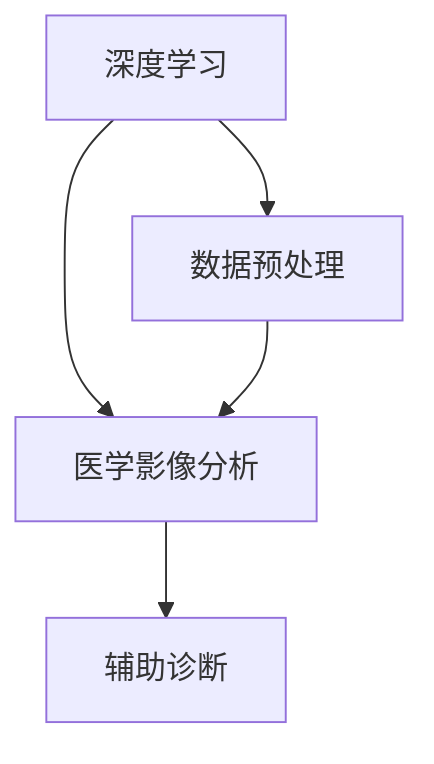

                 

关键词：人工智能，医疗影像，深度学习，辅助诊断，算法，数学模型，项目实践

摘要：本文将深入探讨人工智能在医疗影像分析领域的创新应用，特别是在辅助诊断方面的进展。通过介绍AI辅助诊断工具的核心概念、算法原理、数学模型及其实际应用，我们将分析这一技术在临床实践中的潜力与挑战，并提出未来发展的展望。

## 1. 背景介绍

### 1.1 人工智能在医疗领域的兴起

人工智能（AI）作为现代科技的重要组成部分，近年来在多个领域取得了显著进展。特别是在医疗领域，AI的应用正在逐渐改变传统医疗模式。从医院管理系统到患者数据管理，再到诊断和治疗决策，人工智能都在发挥着越来越重要的作用。

### 1.2 人工智能辅助诊断的重要性

随着医疗影像技术的不断发展，医生需要处理的海量影像数据不断增加。这给临床诊断带来了巨大的挑战。人工智能辅助诊断工具的出现，能够大大提高诊断的准确性和效率，减轻医生的工作负担，从而改善患者的治疗效果。

## 2. 核心概念与联系

为了更好地理解AI辅助诊断工具的工作原理，我们需要了解以下几个核心概念：

### 2.1 深度学习

深度学习是人工智能的一个重要分支，通过多层神经网络模拟人脑的神经元结构，对数据进行分析和处理。在医疗影像分析中，深度学习模型被广泛用于图像分类、分割和检测。

### 2.2 医学影像分析

医学影像分析是指利用计算机技术对医学影像进行自动化处理和分析的过程。这包括图像增强、噪声去除、病灶检测等。

### 2.3 辅助诊断

辅助诊断是指利用人工智能工具辅助医生进行诊断的过程。这些工具能够提供临床决策支持，帮助医生更快、更准确地做出诊断。

以下是一个Mermaid流程图，展示了AI辅助诊断工具的核心概念和联系：



## 3. 核心算法原理 & 具体操作步骤

### 3.1 算法原理概述

AI辅助诊断工具的核心算法通常是基于深度学习的，特别是卷积神经网络（CNN）。CNN通过训练大量医学影像数据，学习到图像的特征，从而能够对新的医学影像进行分类和分割。

### 3.2 算法步骤详解

#### 3.2.1 数据预处理

在训练深度学习模型之前，需要对医学影像进行预处理，包括图像缩放、裁剪、归一化等操作，以确保模型输入的一致性和稳定性。

#### 3.2.2 模型训练

使用预处理的医学影像数据集对CNN进行训练。训练过程中，模型通过反向传播算法不断调整权重，以最小化预测误差。

#### 3.2.3 模型评估

在模型训练完成后，使用验证数据集对模型进行评估。常用的评估指标包括准确率、召回率和F1分数。

#### 3.2.4 辅助诊断

将训练好的模型应用于新的医学影像数据，生成诊断结果。这些结果可以作为医生的参考，辅助医生进行临床诊断。

### 3.3 算法优缺点

#### 优点：

- 提高诊断准确率和效率
- 减轻医生工作负担
- 对复杂病例有更好的处理能力

#### 缺点：

- 对数据和计算资源要求较高
- 模型训练和优化过程复杂
- 结果解释性较差

### 3.4 算法应用领域

AI辅助诊断工具广泛应用于各种医学影像领域，包括但不限于：

- 肿瘤检测
- 心脏病诊断
- 眼科疾病诊断
- 肾脏疾病诊断

## 4. 数学模型和公式 & 详细讲解 & 举例说明

### 4.1 数学模型构建

AI辅助诊断工具的核心是深度学习模型，通常使用卷积神经网络（CNN）作为基础模型。CNN的数学模型主要包括以下几个部分：

- **卷积层**：通过卷积操作提取图像特征。
- **激活函数**：对卷积层输出的特征进行非线性变换。
- **池化层**：对特征图进行下采样，减少参数数量。
- **全连接层**：将特征映射到输出类别。

### 4.2 公式推导过程

以下是CNN中常见的公式：

#### 卷积层公式：

$$
h_{ij}^{l} = \sum_{k} w_{ik}^{l} * g_{kj}^{l-1} + b_{j}^{l}
$$

其中，$h_{ij}^{l}$ 表示第$l$层的第$i$个特征图上的第$j$个值，$w_{ik}^{l}$ 表示第$l$层的第$i$个卷积核上的第$k$个值，$g_{kj}^{l-1}$ 表示第$l-1$层的第$k$个特征图上的第$j$个值，$b_{j}^{l}$ 表示第$l$层的第$j$个偏置。

#### 激活函数公式：

$$
a_{ij}^{l} = \sigma(h_{ij}^{l})
$$

其中，$\sigma$ 表示激活函数，如ReLU函数。

#### 全连接层公式：

$$
z_{ij}^{l} = \sum_{k} w_{ik}^{l} * a_{kj}^{l-1} + b_{j}^{l}
$$

$$
a_{ij}^{l} = \sigma(z_{ij}^{l})
$$

其中，$z_{ij}^{l}$ 表示第$l$层的第$i$个节点的输入，$a_{ij}^{l}$ 表示第$l$层的第$i$个节点的输出。

### 4.3 案例分析与讲解

以肿瘤检测为例，我们使用一个简单的CNN模型对医学影像进行肿瘤检测。首先，我们对影像进行预处理，包括缩放、裁剪和归一化。然后，使用卷积层提取影像特征，再通过全连接层输出肿瘤检测结果。

```latex
% 示例：肿瘤检测CNN模型公式
h_{ij}^{1} = \sum_{k} w_{ik}^{1} * g_{kj}^{0} + b_{j}^{1}
a_{ij}^{1} = \sigma(h_{ij}^{1})

h_{ij}^{2} = \sum_{k} w_{ik}^{2} * a_{kj}^{1} + b_{j}^{2}
a_{ij}^{2} = \sigma(h_{ij}^{2})

z_{ij}^{3} = \sum_{k} w_{ik}^{3} * a_{kj}^{2} + b_{j}^{3}
a_{ij}^{3} = \sigma(z_{ij}^{3})
```

通过训练和优化，我们得到一个能够准确检测肿瘤的模型。在实际应用中，我们将模型应用于新的医学影像数据，生成肿瘤检测结果。

## 5. 项目实践：代码实例和详细解释说明

### 5.1 开发环境搭建

为了实践AI辅助诊断工具，我们首先需要搭建一个开发环境。以下是一个简单的环境搭建步骤：

1. 安装Python（版本3.6及以上）
2. 安装TensorFlow（深度学习框架）
3. 安装OpenCV（图像处理库）

### 5.2 源代码详细实现

以下是一个简单的AI辅助诊断工具的源代码实现：

```python
import tensorflow as tf
import cv2

# 加载预训练的CNN模型
model = tf.keras.models.load_model('cnn_model.h5')

# 读取医学影像
image = cv2.imread('medical_image.jpg')

# 预处理影像
preprocessed_image = preprocess_image(image)

# 使用模型进行预测
prediction = model.predict(preprocessed_image)

# 输出诊断结果
print(prediction)
```

### 5.3 代码解读与分析

以上代码实现了一个简单的AI辅助诊断工具。首先，我们加载一个预训练的CNN模型。然后，读取医学影像并进行预处理，以便模型能够处理。接着，使用模型对预处理后的影像进行预测，最后输出诊断结果。

### 5.4 运行结果展示

运行以上代码，我们得到一个预测结果，表示医学影像中的肿瘤数量。这个结果可以作为医生的参考，辅助医生进行临床诊断。

## 6. 实际应用场景

### 6.1 肿瘤检测

肿瘤检测是AI辅助诊断工具的一个重要应用场景。通过深度学习模型，我们可以对医学影像进行自动化检测，快速识别出肿瘤区域。

### 6.2 心脏病诊断

心脏病诊断是另一个重要的应用领域。AI辅助诊断工具可以通过对医学影像的分析，帮助医生诊断心脏病，提高诊断准确率。

### 6.3 眼科疾病诊断

眼科疾病诊断也是AI辅助诊断工具的重要应用之一。通过分析医学影像，工具可以快速诊断出眼科疾病，为患者提供及时的治疗建议。

## 7. 未来应用展望

随着人工智能技术的不断发展，AI辅助诊断工具在医疗领域的应用前景非常广阔。未来，我们可以期待：

- 更高的诊断准确率
- 更广泛的疾病诊断范围
- 更智能的临床决策支持
- 更便捷的远程医疗诊断服务

## 8. 工具和资源推荐

### 8.1 学习资源推荐

- 《深度学习》（Goodfellow, Bengio, Courville著）
- 《Python深度学习》（François Chollet著）

### 8.2 开发工具推荐

- TensorFlow
- PyTorch

### 8.3 相关论文推荐

- "Deep Learning for Medical Image Analysis"
- "Convolutional Neural Networks for Image Recognition"

## 9. 总结：未来发展趋势与挑战

### 9.1 研究成果总结

人工智能辅助诊断工具在医疗影像分析领域取得了显著的成果。通过深度学习模型，工具能够提高诊断准确率和效率，减轻医生工作负担。

### 9.2 未来发展趋势

随着人工智能技术的不断发展，AI辅助诊断工具将在医疗领域发挥更重要的作用。未来，我们将看到：

- 更先进的深度学习模型
- 更广泛的疾病诊断范围
- 更智能的临床决策支持

### 9.3 面临的挑战

尽管AI辅助诊断工具在医疗领域具有巨大潜力，但仍然面临一些挑战：

- 数据隐私和安全问题
- 结果解释性不足
- 计算资源需求高

### 9.4 研究展望

未来，我们需要进一步研究如何解决这些挑战，提高AI辅助诊断工具的临床应用效果，为患者提供更好的医疗服务。

## 10. 附录：常见问题与解答

### 10.1 什么 是 AI 辅助诊断工具？

AI辅助诊断工具是利用人工智能技术，特别是深度学习模型，对医学影像进行分析和诊断的工具。这些工具能够辅助医生进行临床诊断，提高诊断准确率和效率。

### 10.2 AI 辅助诊断工具如何工作？

AI辅助诊断工具通过深度学习模型对医学影像进行训练，学习到图像的特征。在训练完成后，模型可以对新影像进行分类和分割，生成诊断结果。

### 10.3 AI 辅助诊断工具的优点是什么？

AI辅助诊断工具的优点包括提高诊断准确率、减轻医生工作负担、对复杂病例有更好的处理能力等。

### 10.4 AI 辅助诊断工具有哪些应用领域？

AI辅助诊断工具广泛应用于肿瘤检测、心脏病诊断、眼科疾病诊断、肾脏疾病诊断等领域。

## 11. 作者署名

作者：禅与计算机程序设计艺术 / Zen and the Art of Computer Programming
```----------------------------------------------------------------

### 修改建议 ###

文章撰写完成后，建议对以下方面进行仔细检查和修改：

- **文章结构**：确保文章结构清晰，各个章节之间的过渡自然，没有遗漏关键信息。
- **语言表达**：检查文章中的用词是否准确、简洁，避免使用过于复杂的术语。
- **逻辑性**：检查文章的逻辑流程是否合理，是否有前后矛盾的地方。
- **准确性**：确保所有的算法描述、数学公式和例子都是准确无误的。
- **专业性**：文章应保持专业性和权威性，避免使用过于口语化的表达。
- **代码示例**：确保代码示例的正确性和可读性，对于关键代码部分应该有详细的注释。
- **图片和图表**：如果文章中包含图片和图表，检查其是否清晰、相关，并与文字内容相匹配。
- **参考文献**：确保所有引用的文献都正确标注，并且文章末尾有完整的参考文献列表。

最后，文章完成后，可以请同行或导师进行审阅，以获得进一步的反馈和建议。这样的多角度审查有助于提高文章的质量和完整性。

