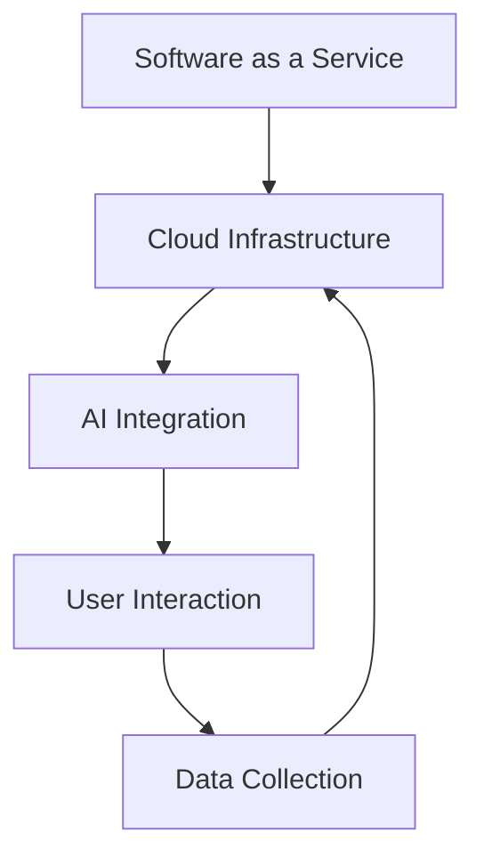

                 

关键词：人工智能，SaaS，创业，机遇，挑战，商业模式，技术架构，数据安全

> 摘要：随着人工智能技术的飞速发展，SaaS（软件即服务）行业迎来了前所未有的机遇。本文将深入探讨AI驱动的SaaS创业所面临的机遇与挑战，从技术、商业模式、数据安全等多个维度进行分析，旨在为创业者提供有价值的参考和指导。

## 1. 背景介绍

### SaaS行业的发展现状

SaaS作为一种新型的软件交付模式，已经在全球范围内得到广泛的应用。根据市场研究公司的数据，SaaS市场的规模持续增长，预计未来几年仍将保持高速扩张。在中国，随着云计算和大数据技术的成熟，SaaS行业也迎来了快速发展期。

### 人工智能的发展背景

人工智能（AI）作为计算机科学的一个重要分支，近年来取得了显著的进展。深度学习、自然语言处理、计算机视觉等技术的突破，使得AI在各个领域都展现出了强大的应用潜力。特别是在SaaS领域，AI技术的引入，不仅提高了软件的服务质量和用户体验，还为创业公司带来了新的商业模式。

## 2. 核心概念与联系

为了更好地理解AI驱动的SaaS创业，我们需要了解以下几个核心概念：

- **SaaS**：软件即服务，用户通过网络访问软件，无需本地安装。
- **人工智能**：模拟人类智能的机器系统，能够感知环境、学习、推理和决策。
- **机器学习**：AI的核心技术之一，通过数据训练模型，使计算机具备自主学习和改进能力。

下面是一个简单的Mermaid流程图，展示SaaS与AI的关联：



## 3. 核心算法原理 & 具体操作步骤

### 3.1 算法原理概述

AI驱动的SaaS创业通常依赖于以下核心算法：

- **深度学习**：通过多层神经网络，对大量数据进行特征提取和模式识别。
- **自然语言处理**：用于理解和生成人类语言，实现人机交互。
- **计算机视觉**：用于图像识别、物体检测等视觉任务。

### 3.2 算法步骤详解

1. **数据收集与预处理**：收集用户数据，并进行清洗、归一化等预处理。
2. **模型训练**：使用预处理后的数据训练深度学习模型。
3. **模型评估**：通过测试数据评估模型性能。
4. **模型部署**：将训练好的模型部署到SaaS平台，提供实时服务。

### 3.3 算法优缺点

- **优点**：提高服务质量和用户体验，降低运营成本。
- **缺点**：需要大量高质量的数据，且模型训练和优化过程复杂。

### 3.4 算法应用领域

AI驱动的SaaS可以在多个领域发挥作用，如客户服务、人力资源、金融分析等。

## 4. 数学模型和公式 & 详细讲解 & 举例说明

### 4.1 数学模型构建

在AI驱动的SaaS中，常用的数学模型包括：

- **线性回归**：用于预测数值型目标变量。
- **决策树**：用于分类和回归任务。
- **神经网络**：用于复杂的模式识别和预测。

### 4.2 公式推导过程

以线性回归为例，其公式推导如下：

$$
y = \beta_0 + \beta_1x
$$

其中，$y$为预测值，$x$为特征值，$\beta_0$和$\beta_1$为模型的参数。

### 4.3 案例分析与讲解

假设我们要预测一个电商平台的用户购买行为，可以使用线性回归模型进行预测。通过收集用户的历史数据，训练模型并评估其性能，最终部署到SaaS平台上。

## 5. 项目实践：代码实例和详细解释说明

### 5.1 开发环境搭建

首先，我们需要搭建一个适合AI驱动的SaaS开发环境，包括：

- **操作系统**：Linux或MacOS
- **编程语言**：Python
- **框架**：TensorFlow或PyTorch
- **数据库**：MySQL或MongoDB

### 5.2 源代码详细实现

以下是一个简单的AI驱动的SaaS项目的代码示例：

```python
import tensorflow as tf
from sklearn.model_selection import train_test_split
import pandas as pd

# 数据预处理
data = pd.read_csv('user_data.csv')
X = data[['age', 'income', 'education']]
y = data['purchased']

X_train, X_test, y_train, y_test = train_test_split(X, y, test_size=0.2, random_state=42)

# 模型训练
model = tf.keras.Sequential([
    tf.keras.layers.Dense(64, activation='relu', input_shape=(3,)),
    tf.keras.layers.Dense(1)
])

model.compile(optimizer='adam', loss='mean_squared_error')
model.fit(X_train, y_train, epochs=10)

# 模型评估
model.evaluate(X_test, y_test)
```

### 5.3 代码解读与分析

这段代码展示了如何使用TensorFlow框架搭建一个简单的线性回归模型，对用户购买行为进行预测。首先，我们加载并预处理数据，然后构建模型并进行训练，最后评估模型性能。

### 5.4 运行结果展示

通过运行上述代码，我们可以得到模型的评估结果，如损失函数值和准确率等指标。这些结果可以帮助我们了解模型的性能，并进行进一步的优化。

## 6. 实际应用场景

### 6.1 客户服务

AI驱动的SaaS可以在客户服务领域发挥重要作用，如智能客服、个性化推荐等。

### 6.2 人力资源

在人力资源领域，AI驱动的SaaS可以用于招聘、绩效评估和员工培训等。

### 6.3 金融分析

在金融领域，AI驱动的SaaS可以用于风险管理、投资分析和信用评估等。

## 7. 工具和资源推荐

### 7.1 学习资源推荐

- 《深度学习》（Goodfellow, Bengio, Courville）
- 《Python机器学习》（Sebastian Raschka）

### 7.2 开发工具推荐

- TensorFlow
- PyTorch
- Jupyter Notebook

### 7.3 相关论文推荐

- “Deep Learning for Customer Service”（DeepMind）
- “AI in Human Resources”（Harvard Business Review）

## 8. 总结：未来发展趋势与挑战

### 8.1 研究成果总结

AI驱动的SaaS创业已经取得了显著的成果，在多个领域都展现出了强大的应用潜力。

### 8.2 未来发展趋势

随着技术的不断进步，AI驱动的SaaS将在更多领域得到应用，带来更高效、更智能的解决方案。

### 8.3 面临的挑战

AI驱动的SaaS创业仍面临一些挑战，如数据安全、模型解释性等。

### 8.4 研究展望

未来，我们需要进一步探索AI与SaaS的深度融合，解决现有问题，推动行业的发展。

## 9. 附录：常见问题与解答

### 9.1 AI驱动的SaaS有哪些优势？

AI驱动的SaaS可以提高服务质量和用户体验，降低运营成本，提供更智能的解决方案。

### 9.2 如何确保AI驱动的SaaS数据安全？

确保数据安全需要采取一系列措施，如数据加密、访问控制等。

### 9.3 AI驱动的SaaS是否适用于所有行业？

AI驱动的SaaS在许多行业都有应用潜力，但并非所有行业都适合。需要根据具体情况进行评估。

[作者：禅与计算机程序设计艺术 / Zen and the Art of Computer Programming]----------------------------------------------------------------

以上便是文章的正文内容部分。接下来，我们将根据文章结构模板，完成各个章节的具体内容，并按照markdown格式进行排版。请注意，这里提供的文章内容仅为示例，实际撰写时需要根据具体情况进行深入分析和拓展。

