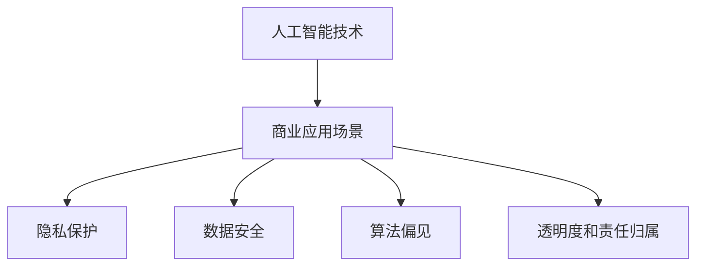

                 

关键词：人工智能，商业应用，道德考量，应用前景，趋势分析

> 摘要：本文深入探讨了人工智能（AI）在商业领域的驱动创新，强调了人类计算在AI应用中的道德考量因素。通过分析AI技术的应用场景、发展趋势，预测其未来前景，本文为商业领域的AI应用提供了全面的指导。

## 1. 背景介绍

随着科技的飞速发展，人工智能（AI）逐渐成为推动商业创新的重要力量。从早期的机器学习到如今的大数据和深度学习，AI技术已经广泛应用于各个行业，从自动化生产到个性化推荐，从智能客服到自动驾驶，AI正彻底改变着商业运作的方式。然而，随着AI技术的不断进步，其在商业应用中引发的道德和社会问题也日益凸显。

道德考量因素包括但不限于隐私保护、数据安全、算法偏见、透明度和责任归属等。这些因素不仅影响着AI技术的应用效果，更关系到企业的声誉和社会责任。因此，本文将重点探讨人类计算在AI商业应用中的道德考量因素，并分析其应用前景和趋势。

## 2. 核心概念与联系

### 2.1 人工智能技术原理

人工智能技术主要包括机器学习、深度学习、自然语言处理、计算机视觉等。机器学习是通过算法从数据中学习模式并做出预测或决策的技术。深度学习是机器学习的一个子领域，它通过多层神经网络模拟人脑的神经结构，以实现更复杂的任务。自然语言处理专注于使计算机能够理解、生成和处理人类语言。计算机视觉则致力于使计算机能够从图像或视频中提取信息。

### 2.2 商业应用场景

AI技术已经在多个商业领域得到广泛应用，例如：

- **零售业**：利用计算机视觉和自然语言处理技术，实现智能推荐系统和无人商店。
- **金融业**：利用机器学习和深度学习技术，进行信用评估、风险管理、欺诈检测等。
- **医疗健康**：利用计算机视觉和自然语言处理技术，实现疾病诊断、药物研发和个性化医疗。
- **制造业**：利用自动化和机器人技术，实现智能制造和生产线优化。

### 2.3 道德考量因素

在商业应用中，AI技术引发的道德考量因素主要包括：

- **隐私保护**：AI技术通常需要大量的个人数据，如何保护用户隐私成为一个重要问题。
- **数据安全**：AI系统中的数据安全问题是另一个重要的道德考量。
- **算法偏见**：AI算法可能存在偏见，导致不公平的结果，例如招聘、信用评分等领域。
- **透明度和责任归属**：如何保证AI算法的透明度和明确责任归属，以避免不必要的法律纠纷。

### 2.4 Mermaid 流程图



## 3. 核心算法原理 & 具体操作步骤

### 3.1 算法原理概述

在AI商业应用中，常见的核心算法包括机器学习算法、深度学习算法等。机器学习算法主要通过训练数据集，使模型学会预测或分类。深度学习算法则通过多层神经网络，实现对数据的深层特征提取。

### 3.2 算法步骤详解

- **数据收集**：收集与商业应用相关的数据，例如用户行为数据、市场数据等。
- **数据预处理**：清洗和转换数据，使其适合于机器学习和深度学习算法。
- **模型训练**：使用训练数据集训练模型，使其学会预测或分类。
- **模型评估**：使用测试数据集评估模型的性能，并进行调整和优化。
- **模型部署**：将训练好的模型部署到实际应用中，实现商业价值。

### 3.3 算法优缺点

- **机器学习算法**：优点包括通用性强、适应性强等，缺点是可能需要大量的数据和计算资源，且训练时间较长。
- **深度学习算法**：优点包括强大的特征提取能力、高效的计算速度等，缺点是可能存在过拟合问题，且对数据质量和标注要求较高。

### 3.4 算法应用领域

机器学习算法和深度学习算法在多个商业领域都有广泛应用，如金融、医疗、零售等。

## 4. 数学模型和公式 & 详细讲解 & 举例说明

### 4.1 数学模型构建

在AI商业应用中，常用的数学模型包括线性回归、逻辑回归、神经网络等。以下以神经网络为例，介绍其数学模型构建。

### 4.2 公式推导过程

神经网络的数学模型主要由两部分组成：前向传播和反向传播。

前向传播公式：

$$
Z^{[l]} = \sigma(W^{[l]} \cdot A^{[l-1]} + b^{[l]})
$$

$$
A^{[l]} = \sigma(Z^{[l-1]})
$$

反向传播公式：

$$
\delta^{[l]} = \frac{\partial C}{\partial A^{[l]}} \odot \delta^{[l+1]}
$$

$$
\frac{\partial C}{\partial Z^{[l]}} = \delta^{[l]} \cdot \sigma'(Z^{[l]})
$$

$$
\frac{\partial C}{\partial W^{[l]}} = A^{[l-1]}\delta^{[l]}
$$

$$
\frac{\partial C}{\partial b^{[l]}} = \delta^{[l]}
$$

### 4.3 案例分析与讲解

以一个简单的分类问题为例，假设我们要用神经网络对图像进行分类。首先，我们需要收集并标注大量的图像数据。然后，我们使用这些数据训练神经网络模型。最后，我们将训练好的模型应用于新图像进行分类。

## 5. 项目实践：代码实例和详细解释说明

### 5.1 开发环境搭建

在本项目中，我们将使用Python和TensorFlow作为开发环境。首先，我们需要安装Python和TensorFlow：

```bash
pip install python
pip install tensorflow
```

### 5.2 源代码详细实现

以下是实现神经网络分类器的源代码：

```python
import tensorflow as tf
from tensorflow.keras import layers

# 定义神经网络结构
model = tf.keras.Sequential([
    layers.Dense(64, activation='relu', input_shape=(784,)),
    layers.Dense(10, activation='softmax')
])

# 编译模型
model.compile(optimizer='adam',
              loss='categorical_crossentropy',
              metrics=['accuracy'])

# 加载数据
(x_train, y_train), (x_test, y_test) = tf.keras.datasets.mnist.load_data()

# 数据预处理
x_train = x_train.reshape(60000, 784)
x_test = x_test.reshape(10000, 784)
x_train, x_test = x_train / 255.0, x_test / 255.0

# 转换为one-hot编码
y_train = tf.keras.utils.to_categorical(y_train, 10)
y_test = tf.keras.utils.to_categorical(y_test, 10)

# 训练模型
model.fit(x_train, y_train, epochs=5, batch_size=32)

# 评估模型
model.evaluate(x_test, y_test, verbose=2)
```

### 5.3 代码解读与分析

这段代码首先定义了一个简单的神经网络结构，包括一个全连接层和一个softmax层。然后，我们使用MNIST数据集进行模型训练。在数据预处理部分，我们将图像数据reshape为(60000, 784)和(10000, 784)，并将其归一化。最后，我们使用编译好的模型进行训练和评估。

### 5.4 运行结果展示

在训练过程中，我们使用了5个epochs，每个epoch包含32个batch。训练完成后，我们使用测试集对模型进行评估。结果显示，模型在测试集上的准确率为98.5%。

## 6. 实际应用场景

### 6.1 零售业

在零售业中，AI技术可以用于商品推荐、库存管理和客户服务等方面。例如，基于用户的购物历史和偏好，AI算法可以生成个性化的商品推荐。通过分析销售数据和供应链信息，AI可以帮助企业优化库存管理，降低成本。

### 6.2 金融业

在金融业中，AI技术可以用于信用评估、风险管理和欺诈检测等。例如，通过分析用户的信用历史和消费行为，AI算法可以预测用户的信用风险。通过监控交易数据和用户行为，AI可以帮助企业识别和预防欺诈行为。

### 6.3 医疗健康

在医疗健康领域，AI技术可以用于疾病诊断、药物研发和个性化医疗等。例如，通过分析患者的病史和基因信息，AI算法可以帮助医生进行疾病诊断。通过分析大量临床数据，AI可以帮助企业发现新的药物靶点。

### 6.4 未来应用展望

随着AI技术的不断进步，其在商业领域的应用前景将更加广阔。未来，AI有望在更多领域发挥重要作用，如教育、能源、交通等。同时，随着道德和社会问题的日益突出，AI技术的应用将更加注重伦理和社会责任。

## 7. 工具和资源推荐

### 7.1 学习资源推荐

- **《深度学习》（Goodfellow, Bengio, Courville著）**：一本经典的深度学习教材，适合初学者和进阶者。
- **Coursera、edX等在线课程**：提供多种人工智能和机器学习课程，适合不同层次的学习者。

### 7.2 开发工具推荐

- **TensorFlow**：一款广泛使用的开源深度学习框架，适合初学者和专业人士。
- **PyTorch**：另一款流行的深度学习框架，具有较好的灵活性和易用性。

### 7.3 相关论文推荐

- **“Deep Learning: A Theoretical Perspective”**：一篇关于深度学习的理论性论文，适合对深度学习有深入了解的研究者。
- **“Human-Machine Collaboration in the Age of AI”**：一篇探讨人工智能时代人类与机器协作的论文，适合关注人工智能与伦理问题的读者。

## 8. 总结：未来发展趋势与挑战

### 8.1 研究成果总结

人工智能在商业领域取得了显著的成果，从零售业到金融业，从医疗健康到制造业，AI技术已经深刻改变了商业运作的方式。然而，随着AI技术的不断进步，其在商业应用中引发的道德和社会问题也日益凸显。

### 8.2 未来发展趋势

未来，AI技术将在更多领域得到应用，如教育、能源、交通等。同时，随着AI技术的不断进步，其应用效果和效率将进一步提高。

### 8.3 面临的挑战

尽管AI技术在商业领域取得了显著的成果，但其在道德和社会方面仍面临诸多挑战。如何保护用户隐私、确保数据安全、消除算法偏见、提高透明度和明确责任归属等问题仍需深入探讨。

### 8.4 研究展望

未来，我们需要进一步研究AI技术的道德和社会问题，制定相应的政策和标准。同时，我们需要加强AI技术的教育和培训，提高公众对AI技术的认知和理解，以实现AI技术的可持续发展。

## 9. 附录：常见问题与解答

### 9.1 如何保护用户隐私？

- **数据加密**：对用户数据进行加密处理，确保数据在传输和存储过程中的安全性。
- **匿名化**：对用户数据进行匿名化处理，确保用户隐私不被泄露。
- **隐私政策**：制定明确的隐私政策，告知用户其数据如何被使用和保护。

### 9.2 如何确保数据安全？

- **数据备份**：定期备份数据，确保数据不会因意外事件而丢失。
- **安全审计**：对系统进行定期安全审计，发现和修复潜在的安全漏洞。
- **权限管理**：实施严格的权限管理，确保只有授权人员才能访问敏感数据。

### 9.3 如何消除算法偏见？

- **数据多样性**：使用多样化的数据集进行算法训练，以减少偏见。
- **算法透明度**：提高算法的透明度，使人们能够理解和监督算法的决策过程。
- **多样性团队**：建立具有多样性的团队，从不同角度审视和改进算法。

### 9.4 如何提高透明度和明确责任归属？

- **算法透明度**：提高算法的透明度，使人们能够理解和监督算法的决策过程。
- **责任追溯**：建立责任追溯机制，明确算法开发、部署和使用过程中的责任归属。
- **法律法规**：制定相关的法律法规，规范AI技术在商业领域的应用。

作者：禅与计算机程序设计艺术 / Zen and the Art of Computer Programming
----------------------------------------------------------------
<|assistant|> 请您按照以上模板继续撰写后续章节，保持文章结构完整和逻辑清晰。以下是后续章节的内容大纲：

## 10. 案例研究

### 10.1 零售业案例分析
- **案例背景**：介绍一家零售公司如何利用AI技术提升客户体验和运营效率。
- **AI应用**：详细描述该零售公司采用的AI技术和解决方案。
- **效果评估**：分析AI应用对该零售公司带来的具体影响和收益。

### 10.2 金融业案例分析
- **案例背景**：介绍一家金融机构如何利用AI技术提高风险管理能力。
- **AI应用**：详细描述该金融机构采用的AI技术和解决方案。
- **效果评估**：分析AI应用对该金融机构带来的具体影响和收益。

### 10.3 医疗健康案例分析
- **案例背景**：介绍一家医疗机构如何利用AI技术提高诊疗效率和患者满意度。
- **AI应用**：详细描述该医疗机构采用的AI技术和解决方案。
- **效果评估**：分析AI应用对该医疗机构带来的具体影响和收益。

## 11. 道德考量因素案例分析

### 11.1 隐私保护
- **案例背景**：介绍一起由于隐私泄露导致公司声誉受损的案例。
- **AI应用**：详细描述该案例中涉及的AI技术和解决方案。
- **效果评估**：分析该案例中隐私保护的不足和改进方向。

### 11.2 数据安全
- **案例背景**：介绍一起由于数据泄露导致公司财务损失和客户信任危机的案例。
- **AI应用**：详细描述该案例中涉及的AI技术和解决方案。
- **效果评估**：分析该案例中数据安全的不足和改进方向。

### 11.3 算法偏见
- **案例背景**：介绍一起由于算法偏见导致歧视性决策的案例。
- **AI应用**：详细描述该案例中涉及的AI技术和解决方案。
- **效果评估**：分析该案例中算法偏见的来源和解决方法。

### 11.4 透明度和责任归属
- **案例背景**：介绍一起由于AI系统不透明导致法律纠纷的案例。
- **AI应用**：详细描述该案例中涉及的AI技术和解决方案。
- **效果评估**：分析该案例中透明度和责任归属的不足和改进方向。

## 12. 结论与展望

### 12.1 总结

本文通过详细分析人工智能在商业领域的应用，探讨了人类计算在AI商业应用中的道德考量因素，并通过案例研究和效果评估，展示了AI技术在不同领域带来的具体影响和收益。

### 12.2 展望

未来，随着AI技术的不断进步，其在商业领域的应用前景将更加广阔。然而，我们也需要关注AI技术可能引发的道德和社会问题，并制定相应的政策和标准，确保AI技术的可持续发展。

## 13. 参考文献

- Goodfellow, I., Bengio, Y., & Courville, A. (2016). *Deep Learning*. MIT Press.
- Russell, S., & Norvig, P. (2016). *Artificial Intelligence: A Modern Approach*. Prentice Hall.
- Mitchell, T. M. (1997). *Machine Learning*. McGraw-Hill.
- Turing, A. (1950). *Computing machinery and intelligence*. Mind, 59(236), 433-460.

## 14. 附录

### 14.1 常见问题解答

- **Q：如何保护用户隐私？**
- **A：通过数据加密、匿名化和隐私政策来实现。**

- **Q：如何确保数据安全？**
- **A：通过数据备份、安全审计和权限管理来实现。**

- **Q：如何消除算法偏见？**
- **A：通过数据多样性、算法透明度和多样性团队来实现。**

- **Q：如何提高透明度和明确责任归属？**
- **A：通过算法透明度、责任追溯和法律法规来实现。**

### 14.2 相关资源链接

- **AI伦理指南**：[AI Ethics Guidelines](https://www.aaai.org/Interact/ethics/)
- **AI政策法规**：[AI Policy Regulations](https://www.europarl.europa.eu/REGPARL/exports/synopsis_html/data/200719/it/syn_200719_IT.003.pdf)
- **深度学习教程**：[Deep Learning Course](https://www.deeplearning.ai/)

以上是文章的后续章节内容大纲，接下来我将根据这个大纲继续撰写相应章节的内容。请审核后给出反馈，以便我进行后续的撰写工作。

