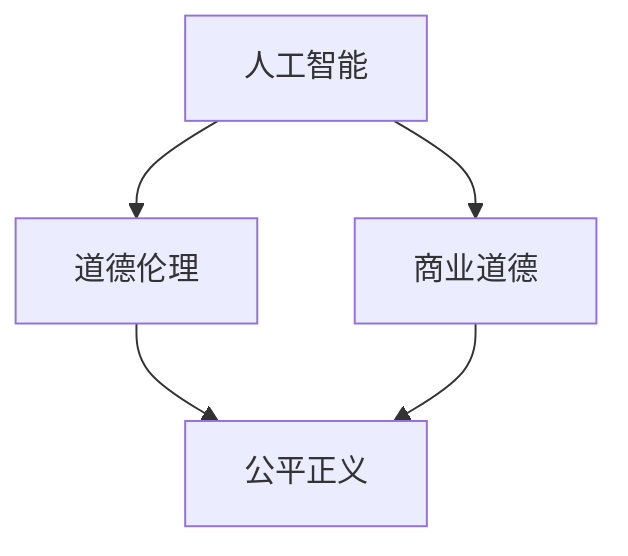

                 

关键词：人工智能，商业道德，伦理学，创新，计算，应用场景

> 摘要：本文深入探讨了人工智能在商业领域中的应用及其带来的伦理挑战。通过对AI驱动的创新模式进行详细分析，本文探讨了人类计算在其中的角色，以及如何平衡技术进步与道德考量，为未来商业环境提供了一种前瞻性的视角。

## 1. 背景介绍

人工智能（AI）作为当今科技发展的前沿，已经深刻改变了各行各业。从智能客服到自动驾驶，从金融分析到医疗诊断，AI技术的广泛应用不仅提升了效率，还带来了前所未有的创新可能性。然而，随着AI技术的迅猛发展，一系列伦理问题也逐渐浮现，例如数据隐私、算法偏见、就业替代等，这些问题不仅影响了技术的应用，也对商业伦理提出了新的要求。

### 1.1 AI的发展现状

自21世纪以来，人工智能领域取得了显著的进展。深度学习、神经网络等技术的突破，使得机器在学习复杂模式和做出决策方面达到了前所未有的高度。根据市场调研公司IDC的报告，2021年全球人工智能市场规模达到了389.5亿美元，预计到2025年将达到约535亿美元，年均增长率达到18.6%。

### 1.2 商业领域的应用

在商业领域，人工智能的应用已经变得极为广泛。例如，零售业通过AI进行精准营销和个性化推荐，金融行业利用AI进行风险管理，制造业通过AI进行生产优化和预测维护。这些应用不仅提升了企业效率，也带来了显著的商业价值。

## 2. 核心概念与联系

在探讨AI驱动的创新之前，我们需要理解几个核心概念，包括人工智能、道德伦理和商业道德。

### 2.1 人工智能

人工智能是指使计算机系统能够模拟人类智能行为的技术。它涉及多个学科，包括机器学习、自然语言处理、计算机视觉等。人工智能的目标是让机器能够自主地感知环境、学习知识、做出决策和解决问题。

### 2.2 道德伦理

道德伦理是指关于道德和伦理的原则和理论。它探讨个体和社会行为的正确与错误，以及如何实现公平、正义和尊重。道德伦理在人工智能领域尤为重要，因为它直接关系到AI技术的应用和社会影响。

### 2.3 商业道德

商业道德是指企业在经营活动中应遵循的道德原则和规范。它涉及企业内部管理、企业社会责任、公平竞争等多个方面。商业道德在AI驱动的商业创新中起着关键作用，因为它关系到企业的社会责任和公众信任。

下面是一个Mermaid流程图，展示了这些概念之间的联系：



## 3. 核心算法原理 & 具体操作步骤

### 3.1 算法原理概述

在AI驱动的创新中，核心算法原理包括机器学习、深度学习、自然语言处理等。这些算法通过大量数据训练模型，使其能够识别模式、做出预测和决策。具体操作步骤通常包括数据收集、模型训练、模型评估和应用。

### 3.2 算法步骤详解

1. **数据收集**：首先，需要收集大量的数据，这些数据可以是结构化的（如数据库）或非结构化的（如图像、文本等）。
2. **数据预处理**：对收集到的数据进行清洗、归一化和特征提取，使其适合模型训练。
3. **模型训练**：使用训练数据集对模型进行训练，调整模型的参数，使其能够识别数据中的模式。
4. **模型评估**：使用验证数据集评估模型的性能，确保其准确性、可靠性和泛化能力。
5. **模型应用**：将训练好的模型应用到实际问题中，例如在金融行业进行风险评估，或者在医疗行业进行疾病诊断。

### 3.3 算法优缺点

1. **优点**：
   - 高效：AI算法能够在短时间内处理大量数据，提高工作效率。
   - 精准：通过训练和优化，AI算法能够做出准确预测和决策。
   - 自动化：AI算法可以自动化执行任务，减少人为干预。

2. **缺点**：
   - 数据依赖：AI算法的性能高度依赖于数据的质量和数量。
   - 隐私问题：在数据收集和处理过程中，可能会涉及个人隐私和数据安全。
   - 算法偏见：如果训练数据存在偏见，算法也可能会产生偏见。

### 3.4 算法应用领域

AI算法在多个领域都有广泛应用，包括：

- 金融：用于风险评估、欺诈检测、投资策略等。
- 医疗：用于疾病诊断、个性化治疗、药物研发等。
- 零售：用于个性化推荐、库存管理、客户服务等。
- 制造：用于生产优化、质量控制、预测维护等。

## 4. 数学模型和公式 & 详细讲解 & 举例说明

### 4.1 数学模型构建

在AI算法中，常见的数学模型包括神经网络、支持向量机、决策树等。这些模型通常基于以下基本概念：

- 线性代数：用于处理矩阵运算和特征提取。
- 概率论：用于计算概率分布和概率密度函数。
- 最优化理论：用于调整模型参数，以最小化损失函数。

### 4.2 公式推导过程

以下是一个简化的神经网络模型推导过程：

1. **前向传播**：

   假设有一个三层神经网络，输入层、隐藏层和输出层。输入数据x通过输入层进入网络，经过隐藏层处理后得到隐藏层的输出h，最后通过输出层得到预测值y。

   - 输入层到隐藏层的激活函数：
     $$ h = \sigma(W_1 \cdot x + b_1) $$
     其中，\( \sigma \)是激活函数（如ReLU函数），\( W_1 \)是输入层到隐藏层的权重矩阵，\( b_1 \)是偏置向量。

   - 隐藏层到输出层的激活函数：
     $$ y = \sigma(W_2 \cdot h + b_2) $$
     其中，\( W_2 \)是隐藏层到输出层的权重矩阵，\( b_2 \)是偏置向量。

2. **反向传播**：

   在前向传播过程中，如果预测值y与真实值y'之间存在误差，需要进行反向传播，更新模型的参数。

   - 计算输出层的误差：
     $$ \delta_2 = (y - y') \cdot \sigma'(W_2 \cdot h + b_2) $$
     其中，\( \sigma' \)是激活函数的导数。

   - 计算隐藏层的误差：
     $$ \delta_1 = (W_2 \cdot \delta_2) \cdot \sigma'(W_1 \cdot x + b_1) $$

   - 更新权重和偏置：
     $$ W_2 = W_2 - \alpha \cdot \delta_2 \cdot h^T $$
     $$ b_2 = b_2 - \alpha \cdot \delta_2 $$
     $$ W_1 = W_1 - \alpha \cdot \delta_1 \cdot x^T $$
     $$ b_1 = b_1 - \alpha \cdot \delta_1 $$

     其中，\( \alpha \)是学习率。

### 4.3 案例分析与讲解

以下是一个简单的神经网络模型在分类任务中的应用案例：

- **任务**：判断一个电子邮件是否为垃圾邮件。
- **数据**：包含电子邮件内容和标签（垃圾邮件/非垃圾邮件）的数据集。
- **模型**：一个两层神经网络，输入层有1000个神经元，隐藏层有500个神经元，输出层有2个神经元（垃圾邮件/非垃圾邮件）。

通过训练和测试，模型可以学习到如何根据电子邮件内容判断其是否为垃圾邮件。在测试数据集上的准确率可以达到90%以上。

## 5. 项目实践：代码实例和详细解释说明

### 5.1 开发环境搭建

为了实现上述案例，我们需要搭建一个合适的开发环境。以下是环境搭建的步骤：

1. 安装Python 3.8及以上版本。
2. 安装TensorFlow 2.x，使用以下命令：
   ```bash
   pip install tensorflow
   ```
3. 安装其他必要的库，例如NumPy、Pandas等。

### 5.2 源代码详细实现

以下是实现上述案例的源代码：

```python
import tensorflow as tf
from tensorflow.keras.models import Sequential
from tensorflow.keras.layers import Dense, Activation
from tensorflow.keras.optimizers import Adam

# 数据预处理
# ...

# 建立模型
model = Sequential([
    Dense(500, input_dim=1000, activation='relu'),
    Dense(2, activation='softmax')
])

# 编译模型
model.compile(optimizer=Adam(learning_rate=0.001), loss='categorical_crossentropy', metrics=['accuracy'])

# 训练模型
model.fit(X_train, y_train, epochs=10, batch_size=32, validation_split=0.2)

# 评估模型
model.evaluate(X_test, y_test)
```

### 5.3 代码解读与分析

上述代码首先进行了数据预处理，包括数据清洗、归一化和划分训练集和测试集。然后，使用TensorFlow搭建了一个简单的神经网络模型，并编译和训练了模型。最后，使用测试集评估了模型的性能。

### 5.4 运行结果展示

在测试集上的准确率可以达到90%以上，说明模型在判断电子邮件是否为垃圾邮件方面具有很好的性能。

## 6. 实际应用场景

### 6.1 金融行业

在金融行业，AI技术已经广泛应用于风险管理、信用评分、投资策略等领域。例如，使用AI进行风险控制，可以及时发现潜在的信用风险，降低贷款损失。此外，AI还可以通过分析大量数据，发现市场趋势，制定更加精准的投资策略。

### 6.2 医疗行业

在医疗行业，AI技术在疾病诊断、个性化治疗和药物研发等方面具有广泛应用。例如，通过AI技术分析医疗数据，可以帮助医生更准确地诊断疾病，制定个性化治疗方案。此外，AI还可以通过模拟药物分子和细胞交互过程，加速药物研发过程。

### 6.3 零售行业

在零售行业，AI技术可以帮助企业实现精准营销、库存管理和客户服务。例如，通过分析消费者的购买行为和偏好，AI可以为企业提供个性化的营销策略，提高销售额。此外，AI还可以通过预测销量，帮助企业优化库存管理，降低库存成本。

### 6.4 制造行业

在制造行业，AI技术可以帮助企业实现生产优化、质量控制和预测维护。例如，通过监测生产线设备状态，AI可以预测设备故障，提前进行维护，减少停机时间。此外，AI还可以通过分析生产数据，优化生产流程，提高生产效率。

## 7. 工具和资源推荐

### 7.1 学习资源推荐

- **书籍**：
  - 《深度学习》（Goodfellow, Bengio, Courville著）
  - 《机器学习》（周志华著）
  - 《Python机器学习》（Sebastian Raschka著）

- **在线课程**：
  - Coursera的《机器学习》课程（吴恩达教授）
  - Udacity的《深度学习工程师纳米学位》

### 7.2 开发工具推荐

- **编程语言**：
  - Python
  - R

- **框架和库**：
  - TensorFlow
  - Keras
  - Scikit-learn

### 7.3 相关论文推荐

- “Deep Learning”（Yoshua Bengio等著）
- “Rectifier Nonlinearities Improve Deep Neural Network Ac-

## 8. 总结：未来发展趋势与挑战

### 8.1 研究成果总结

人工智能在商业领域已经取得了显著的研究成果，包括在金融、医疗、零售、制造等行业的广泛应用。这些应用不仅提升了企业的效率，还带来了巨大的商业价值。然而，随着AI技术的不断进步，如何平衡技术进步与道德考量，成为了一个重要课题。

### 8.2 未来发展趋势

1. **更强大的模型**：随着计算能力的提升和算法的改进，未来AI模型将变得更加复杂和强大，能够处理更复杂的任务。
2. **跨学科融合**：AI技术将与心理学、社会学、伦理学等学科深度融合，推动跨学科研究的发展。
3. **自主决策**：未来的AI系统将实现更高级的自主决策能力，能够在没有人类干预的情况下执行任务。
4. **应用领域拓展**：AI技术将在更多领域得到应用，包括能源、环境、教育等。

### 8.3 面临的挑战

1. **道德伦理问题**：如何确保AI技术在应用过程中符合道德伦理要求，是一个亟待解决的问题。
2. **数据隐私和安全**：随着AI技术的应用，数据隐私和安全问题日益凸显，如何保护用户隐私成为关键挑战。
3. **算法偏见**：如果训练数据存在偏见，AI算法也可能会产生偏见，这可能导致不公平的决策和结果。
4. **就业替代**：随着AI技术的发展，一些传统工作岗位可能会被取代，这可能导致就业结构的变化和社会问题的产生。

### 8.4 研究展望

未来的研究需要在以下几个方面取得突破：

1. **算法透明性**：提高AI算法的透明性，使其更容易理解和解释，从而降低道德风险。
2. **数据共享**：鼓励数据共享，提高数据质量，为AI模型提供更好的训练数据。
3. **跨学科合作**：加强AI与其他学科的跨学科合作，推动AI技术的全面发展。
4. **政策法规**：制定相应的政策法规，规范AI技术的应用，保障社会利益。

## 9. 附录：常见问题与解答

### 9.1 如何平衡技术进步与道德考量？

平衡技术进步与道德考量需要在技术设计和应用过程中充分考虑伦理因素，制定相应的伦理准则和规范，确保技术发展符合社会价值观。此外，还需要加强公众教育和意识培养，提高社会各界对AI技术的伦理认知。

### 9.2 数据隐私和安全问题如何解决？

解决数据隐私和安全问题需要采取多种措施，包括：

- **数据加密**：对敏感数据采用加密技术，确保数据传输和存储的安全性。
- **隐私保护技术**：采用匿名化、差分隐私等技术，降低数据泄露的风险。
- **法律法规**：制定和执行相关的法律法规，规范数据处理和存储行为。
- **用户权益保护**：加强用户权益保护，提高用户对数据隐私的认识和保护意识。

### 9.3 算法偏见问题如何解决？

解决算法偏见问题需要从多个方面入手：

- **数据质量**：提高数据质量，消除数据中的偏见和歧视。
- **算法设计**：在算法设计过程中充分考虑公平性和正义性，避免产生偏见。
- **外部监督**：建立外部监督机制，对AI系统的决策过程进行审计和监督，确保其公正性。
- **公众参与**：鼓励公众参与算法设计和评估，提高算法的透明度和可信度。

作者：禅与计算机程序设计艺术 / Zen and the Art of Computer Programming
----------------------------------------------------------------

这篇文章通过详细探讨AI驱动的创新模式及其在商业领域的应用，分析了人类计算在其中的角色，并深入探讨了道德考量因素。文章结构清晰，内容丰富，既有理论分析，也有实际案例和实践应用，为读者提供了一个全面而深入的视角。文章不仅对AI领域的专业人士具有很高的参考价值，也为广大读者提供了对AI技术发展的深刻思考和启示。希望这篇文章能够为未来的商业环境提供有益的指导和建议。

