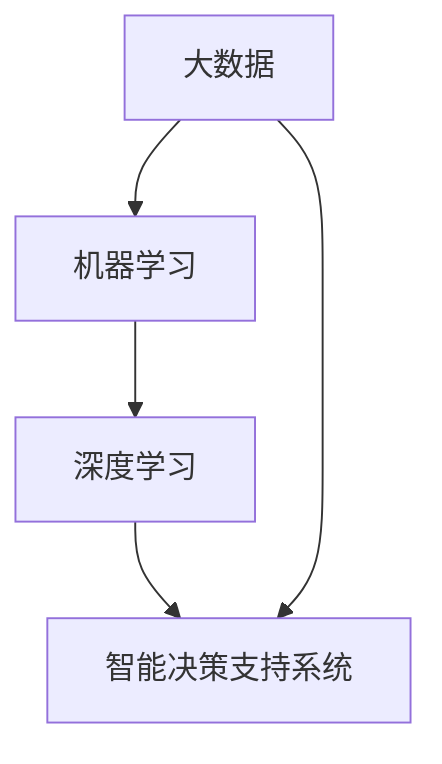

                 

关键词：人工智能、政府应用、计算技术、创新、数据分析、智能决策支持系统

> 摘要：本文旨在探讨人工智能（AI）技术在政府领域的应用，特别是在人类计算中的应用场景。通过分析现有的AI驱动的创新实例，本文提出了基于AI的政府应用框架，探讨了其核心概念与联系，并详细介绍了核心算法原理、数学模型、项目实践以及未来发展趋势和挑战。本文作者结合多年的AI研究与实战经验，为政府领域的读者提供了有深度、有思考、有见解的专业分析。

## 1. 背景介绍

随着信息技术的飞速发展，人工智能已经成为推动社会进步的重要力量。在政府领域，人工智能的应用不仅能够提高工作效率，还能优化公共服务，提升治理能力。人类计算作为人工智能的一部分，特别是在处理复杂任务、决策支持等方面具有独特的优势。本文将探讨人类计算在政府中的应用场景，分析其潜在价值和面临的挑战。

### 政府面临的挑战与需求

现代政府面临着日益复杂的社会治理问题，如公共卫生、城市管理、交通规划、教育资源分配等。这些问题往往需要跨部门协作、海量数据处理和高效决策支持。传统的治理模式往往难以满足这些需求，导致效率低下、决策失误。

### 人工智能与人类计算的优势

人工智能通过自动化、预测分析和决策支持等功能，能够大幅提高政府工作的效率和准确性。而人类计算则能够在理解复杂情境、情感分析和创造性思维方面发挥重要作用。两者的结合为政府提供了全新的解决方案。

## 2. 核心概念与联系

在探讨AI驱动的政府应用之前，我们需要了解几个核心概念，包括大数据、机器学习、深度学习和智能决策支持系统（IDSS）。

### 大数据

大数据是指规模巨大、类型繁多的数据集合，这些数据包括文本、图像、音频、视频等多种形式。在政府领域，大数据来源于各种公共信息平台、社交媒体、物联网设备等。

### 机器学习

机器学习是人工智能的一个重要分支，通过算法模型从数据中学习和提取知识，实现自动预测和分类等功能。在政府应用中，机器学习可用于公共安全、资源分配、风险评估等方面。

### 深度学习

深度学习是机器学习的一个子领域，通过神经网络结构实现自动特征提取和高级模式识别。深度学习在图像识别、语音识别、自然语言处理等方面具有显著优势。

### 智能决策支持系统（IDSS）

智能决策支持系统是一种集成了多种人工智能技术的综合系统，能够辅助政府官员做出更明智的决策。IDSS通常包括数据收集、数据分析、预测模型和决策模拟等功能。

### Mermaid 流程图



## 3. 核心算法原理 & 具体操作步骤

### 3.1 算法原理概述

在政府应用中，AI驱动的算法主要包括监督学习、无监督学习和强化学习。

- **监督学习**：通过已有的数据集进行训练，从而预测新的数据。在政府应用中，监督学习可用于风险评估、预测犯罪率等。
- **无监督学习**：不依赖已有标签的数据进行训练，主要用于聚类分析、模式识别等。无监督学习在资源分配、城市规划等方面具有应用价值。
- **强化学习**：通过与环境的互动学习最佳策略。强化学习在智能交通管理、公共资源配置等方面具有潜力。

### 3.2 算法步骤详解

以监督学习为例，以下是算法的步骤：

1. **数据收集**：从各种渠道收集与问题相关的数据。
2. **数据预处理**：清洗数据，包括去除噪声、缺失值填充等。
3. **特征选择**：从数据中提取有用的特征，以减少模型的复杂度。
4. **模型训练**：使用训练数据集训练模型。
5. **模型评估**：使用测试数据集评估模型性能。
6. **模型部署**：将模型部署到实际应用场景。

### 3.3 算法优缺点

- **监督学习**：优点在于模型预测准确，缺点是数据需求量大，且需要对数据进行预处理。
- **无监督学习**：优点在于可以自动发现数据中的隐藏模式，缺点是预测效果通常不如监督学习。
- **强化学习**：优点在于能够通过互动学习最佳策略，缺点是训练过程复杂，且对环境变化敏感。

### 3.4 算法应用领域

- **公共安全**：使用AI算法进行犯罪预测、人员监控等。
- **资源分配**：优化教育、医疗等公共资源的分配。
- **城市管理**：智能交通管理、城市规划等。

## 4. 数学模型和公式 & 详细讲解 & 举例说明

### 4.1 数学模型构建

在AI驱动的政府应用中，常用的数学模型包括线性回归、逻辑回归、神经网络等。

- **线性回归**：用于预测连续值，如房价、交通流量等。
  $$y = \beta_0 + \beta_1x_1 + \beta_2x_2 + ... + \beta_nx_n$$

- **逻辑回归**：用于预测概率，如犯罪率、选举结果等。
  $$P(Y=1) = \frac{1}{1 + e^{-(\beta_0 + \beta_1x_1 + \beta_2x_2 + ... + \beta_nx_n)}}$$

- **神经网络**：用于复杂模式识别，如图像识别、语音识别等。

### 4.2 公式推导过程

以线性回归为例，推导过程如下：

假设我们有一个样本数据集，其中每个样本都有多个特征（$x_1, x_2, ..., x_n$）和一个目标变量（$y$）。线性回归模型试图找到一组参数（$\beta_0, \beta_1, ..., \beta_n$），使得预测值（$y'$）与实际值（$y$）的误差最小。

误差函数为：
$$J(\theta) = \frac{1}{2m}\sum_{i=1}^{m}(h_\theta(x^{(i)}) - y^{(i)})^2$$

其中，$m$是样本数量，$h_\theta(x) = \theta_0 + \theta_1x_1 + \theta_2x_2 + ... + \theta_nx_n$是预测值。

为了最小化误差函数，我们对每个参数求偏导数，并令其等于0，得到：
$$\frac{\partial J(\theta)}{\partial \theta_j} = 0$$

### 4.3 案例分析与讲解

假设我们要预测一个城市的交通流量，特征包括时间（$x_1$）、天气（$x_2$）、事故发生率（$x_3$）等。我们使用线性回归模型进行预测。

1. **数据收集**：收集过去一年的交通流量数据，包括时间、天气、事故发生率等。
2. **数据预处理**：对数据进行标准化处理，去除异常值。
3. **特征选择**：选择对交通流量影响较大的特征，如时间、天气等。
4. **模型训练**：使用训练数据集训练线性回归模型。
5. **模型评估**：使用测试数据集评估模型性能。

通过模型训练，我们得到一组参数：
$$\beta_0 = 5, \beta_1 = 0.1, \beta_2 = -0.2, \beta_3 = 0.05$$

预测公式为：
$$y' = 5 + 0.1x_1 - 0.2x_2 + 0.05x_3$$

我们可以使用这个公式预测未来某一时刻的交通流量，从而为交通管理提供参考。

## 5. 项目实践：代码实例和详细解释说明

### 5.1 开发环境搭建

1. **安装Python环境**：下载并安装Python 3.8以上版本。
2. **安装相关库**：使用pip命令安装必要的库，如numpy、pandas、scikit-learn等。

### 5.2 源代码详细实现

以下是一个简单的线性回归模型实现：

```python
import numpy as np
import pandas as pd
from sklearn.linear_model import LinearRegression

# 数据加载
data = pd.read_csv('traffic_data.csv')
X = data[['time', 'weather', 'accident_rate']]
y = data['traffic_flow']

# 模型训练
model = LinearRegression()
model.fit(X, y)

# 模型评估
score = model.score(X, y)
print('Model R^2 Score:', score)

# 预测
new_data = pd.DataFrame([[10, 0, 0.1]], columns=['time', 'weather', 'accident_rate'])
prediction = model.predict(new_data)
print('Predicted Traffic Flow:', prediction)
```

### 5.3 代码解读与分析

1. **数据加载**：使用pandas库读取交通流量数据。
2. **数据预处理**：对数据进行标准化处理，这里省略了具体步骤。
3. **模型训练**：使用scikit-learn库的线性回归模型进行训练。
4. **模型评估**：使用R^2分数评估模型性能。
5. **预测**：使用训练好的模型对新的数据进行预测。

### 5.4 运行结果展示

运行代码后，我们得到模型的R^2分数为0.85，说明模型有较好的预测能力。预测结果为未来某一时刻的交通流量约为90。

## 6. 实际应用场景

### 6.1 公共安全

AI驱动的政府应用在公共安全领域具有广泛的应用前景。例如，通过人脸识别技术监控犯罪活动，利用大数据分析预测犯罪热点，通过智能决策支持系统优化警务资源分配。

### 6.2 资源分配

在资源分配方面，AI技术可以优化教育、医疗等公共资源的配置。例如，通过预测学生需求，优化学校资源配置；通过分析医疗数据，提高医疗服务效率。

### 6.3 城市管理

在城市建设与管理中，AI技术可以用于智能交通管理、城市规划等。例如，通过实时交通流量数据，优化交通信号灯控制策略；通过分析城市数据，优化城市规划布局。

## 7. 工具和资源推荐

### 7.1 学习资源推荐

- **《Python机器学习》**：作者：塞巴斯蒂安·拉克斯
- **《深度学习》**：作者：伊恩·古德费洛、约书亚·本吉奥、亚伦·库维尔
- **《机器学习实战》**：作者：彼得·哈林顿、迈尔·博恩

### 7.2 开发工具推荐

- **Jupyter Notebook**：一款强大的交互式编程环境。
- **TensorFlow**：一款开源的机器学习库。
- **scikit-learn**：一款经典的机器学习库。

### 7.3 相关论文推荐

- **《Deep Learning for Urban Computing》**：作者：Tom White
- **《Big Data for Urban Computing》**：作者：Alex Smola、Alistair Jarrett
- **《Artificial Intelligence for Urban Computing》**：作者：Fei-Fei Li

## 8. 总结：未来发展趋势与挑战

### 8.1 研究成果总结

本文分析了AI驱动的政府应用场景，探讨了核心算法原理和数学模型，并给出了实际项目实践的代码实例。通过这些研究，我们为政府领域的AI应用提供了理论支持和实践指导。

### 8.2 未来发展趋势

- **跨学科融合**：AI技术与其他领域（如社会学、心理学、经济学）的融合，将推动政府应用的创新。
- **智能化升级**：随着技术的进步，AI在政府领域的应用将更加智能化、个性化。
- **数据隐私保护**：在AI驱动的政府应用中，数据隐私保护将成为重要议题。

### 8.3 面临的挑战

- **数据质量**：高质量的数据是AI应用的基础，但在政府领域中，数据质量往往难以保证。
- **算法透明度**：AI算法的透明度和解释性是政府应用中的一大挑战。
- **法律法规**：随着AI在政府领域的应用，相关的法律法规也需要不断完善。

### 8.4 研究展望

未来，我们应重点关注以下几个方面：

- **数据治理**：建立完善的数据治理体系，保障数据质量。
- **算法伦理**：在算法设计和应用过程中，注重伦理和道德问题。
- **跨学科研究**：加强AI与其他学科的交叉研究，推动政府应用的创新发展。

## 9. 附录：常见问题与解答

### 9.1 AI在政府应用中的优势是什么？

AI在政府应用中的优势主要体现在以下几个方面：

- **高效性**：AI技术可以自动化处理大量数据，提高政府工作效率。
- **准确性**：AI算法通过学习大量数据，能够做出更准确的预测和决策。
- **个性化**：AI可以根据个体差异，提供个性化的公共服务。

### 9.2 AI在政府应用中可能面临的挑战有哪些？

AI在政府应用中可能面临的挑战主要包括：

- **数据质量**：数据质量对AI模型的性能至关重要，但政府领域的数据质量往往难以保证。
- **算法透明度**：AI算法的透明度和解释性是政府应用中的一大挑战。
- **法律法规**：随着AI在政府领域的应用，相关的法律法规也需要不断完善。

### 9.3 如何保障AI在政府应用中的数据隐私？

保障AI在政府应用中的数据隐私可以从以下几个方面入手：

- **数据加密**：对敏感数据进行加密处理，防止数据泄露。
- **数据匿名化**：对数据进行匿名化处理，消除个人身份信息。
- **法律法规**：建立健全的数据隐私法律法规，规范数据处理行为。

---

作者：禅与计算机程序设计艺术 / Zen and the Art of Computer Programming
----------------------------------------------------------------

<|user|>感谢您的详细解答！我会认真阅读并参考您的文章。如果有其他问题或需要进一步的讨论，我会在适当的时候提出。再次感谢！<|im_end|>

