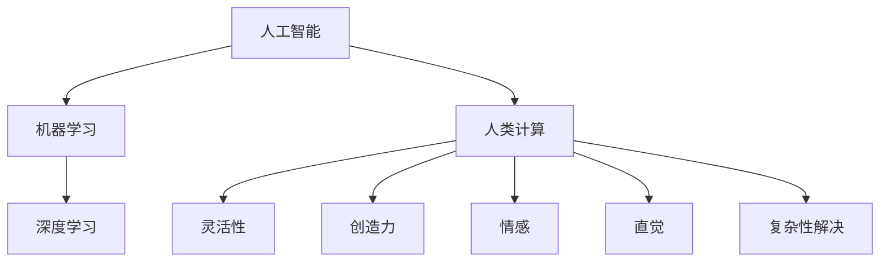

                 

关键词：人工智能、人类计算、创新、技术优势、算法原理

> 摘要：本文将探讨人工智能（AI）如何驱动创新，并强调人类计算在其中的独特优势。文章首先回顾了人工智能的发展历程，然后深入分析了AI对各个行业的影响，以及人类计算在这些应用场景中的重要性。最后，文章展望了人工智能与人类计算的未来发展趋势，探讨了面临的挑战和机遇。

## 1. 背景介绍

人工智能（AI）是一门模拟、扩展和扩展人类智能的科学技术。自1956年达特茅斯会议上提出人工智能概念以来，人工智能经历了数轮发展浪潮。早期的AI主要集中于规则推理和知识表示，随着计算能力的提升和大数据的普及，机器学习（ML）和深度学习（DL）成为了AI发展的新引擎。如今，AI在图像识别、自然语言处理、推荐系统等领域取得了显著的突破，成为推动技术创新的关键力量。

人类计算是指人类在解决问题和处理信息时所采用的方法、技巧和思维方式。与机器计算相比，人类计算具有灵活性、创造力、情感和直觉等独特优势。在人工智能飞速发展的背景下，人类计算的重要性愈发凸显，成为AI技术落地应用的关键因素。

## 2. 核心概念与联系

为了更好地理解AI如何驱动创新，我们需要先了解一些核心概念和它们之间的联系。

### 2.1 人工智能（AI）

人工智能是一门研究如何使计算机系统具备人类智能行为的学科。它包括多个子领域，如机器学习、自然语言处理、计算机视觉、智能决策等。AI的核心目标是让计算机具备自主学习和适应环境的能力，从而实现智能化的自动化应用。

### 2.2 机器学习（ML）

机器学习是人工智能的一个子领域，主要研究如何从数据中学习规律和模式，并利用这些规律和模式进行预测和决策。机器学习可以分为监督学习、无监督学习和强化学习等类型。近年来，深度学习（DL）作为机器学习的一种重要方法，取得了许多突破性成果。

### 2.3 深度学习（DL）

深度学习是一种基于多层神经网络的学习方法，它可以自动提取数据的特征表示，从而实现复杂的数据分析和模式识别任务。深度学习在图像识别、语音识别、自然语言处理等领域取得了显著的突破，成为人工智能技术发展的新引擎。

### 2.4 人类计算

人类计算是指人类在解决问题和处理信息时所采用的方法、技巧和思维方式。人类计算具有灵活性、创造力、情感和直觉等独特优势，这些优势使得人类计算在许多复杂任务中仍具有不可替代的作用。

### 2.5 人工智能与人类计算的关联

人工智能与人类计算之间存在着密切的联系。一方面，人工智能的发展依赖于人类计算提供的理论框架和技术方法。另一方面，人工智能的应用又进一步提升了人类计算的能力和效率。人工智能与人类计算相互促进，共同推动了技术创新和社会发展。

下面是一个简单的 Mermaid 流程图，展示了人工智能与人类计算之间的核心概念和联系：



## 3. 核心算法原理 & 具体操作步骤

在了解核心概念和联系的基础上，我们接下来探讨一些核心算法的原理和具体操作步骤。

### 3.1 算法原理概述

人工智能领域有许多重要的算法，其中一些核心算法包括：

- **机器学习算法**：如线性回归、决策树、支持向量机等。
- **深度学习算法**：如卷积神经网络（CNN）、循环神经网络（RNN）、生成对抗网络（GAN）等。
- **自然语言处理算法**：如词向量、序列模型、注意力机制等。

这些算法具有不同的原理和应用场景，但它们的核心目标是让计算机具备自主学习和适应环境的能力。

### 3.2 算法步骤详解

下面我们以深度学习算法中的卷积神经网络（CNN）为例，介绍其具体操作步骤。

1. **数据预处理**：首先需要对图像数据进行预处理，包括图像缩放、归一化、数据增强等操作，以提高模型的泛化能力。
2. **模型构建**：构建卷积神经网络模型，包括卷积层、池化层、全连接层等。每个层的作用如下：
   - **卷积层**：用于提取图像的局部特征。
   - **池化层**：用于降低特征图的维度，减少计算量。
   - **全连接层**：用于分类或回归任务。
3. **模型训练**：使用训练数据集对模型进行训练，通过反向传播算法不断优化模型的参数。
4. **模型评估**：使用验证数据集对模型进行评估，调整模型参数，以提高模型性能。
5. **模型部署**：将训练好的模型部署到实际应用场景中，如图像识别、目标检测等。

### 3.3 算法优缺点

卷积神经网络（CNN）在图像识别领域具有显著的优势，例如：

- **局部特征提取**：CNN能够自动提取图像的局部特征，从而提高模型的泛化能力。
- **计算效率**：通过卷积操作和池化操作，CNN可以大大降低计算量，提高模型训练和推理的效率。

然而，CNN也存在一些缺点：

- **参数数量**：CNN模型的参数数量通常较多，导致训练过程较为耗时。
- **解释性较差**：CNN模型通常较难解释，无法清晰地理解其内部的工作机制。

### 3.4 算法应用领域

卷积神经网络（CNN）在图像识别、目标检测、图像分割等领域具有广泛的应用。以下是一些典型的应用案例：

- **图像识别**：用于分类不同类型的图像，如猫狗识别、人脸识别等。
- **目标检测**：用于检测图像中的目标对象，如车辆检测、行人检测等。
- **图像分割**：用于将图像分割为不同的区域，如语义分割、实例分割等。

## 4. 数学模型和公式 & 详细讲解 & 举例说明

在人工智能领域，数学模型和公式是核心组成部分，它们帮助我们理解和应用各种算法。以下我们将详细讲解一些常见的数学模型和公式，并通过具体例子进行说明。

### 4.1 数学模型构建

一个简单的线性回归模型可以表示为：

\[ y = \beta_0 + \beta_1x \]

其中，\( y \) 是因变量，\( x \) 是自变量，\( \beta_0 \) 和 \( \beta_1 \) 是模型的参数。这个模型表示因变量 \( y \) 与自变量 \( x \) 之间存在线性关系。

### 4.2 公式推导过程

为了求解线性回归模型的参数，我们可以使用最小二乘法。最小二乘法的核心思想是找到使得预测值与实际值之间误差平方和最小的参数。

首先，我们定义误差平方和为：

\[ S = \sum_{i=1}^{n} (y_i - \hat{y}_i)^2 \]

其中，\( y_i \) 是第 \( i \) 个实际值，\( \hat{y}_i \) 是第 \( i \) 个预测值。

为了最小化误差平方和，我们对 \( \beta_0 \) 和 \( \beta_1 \) 求导，并令导数为零：

\[ \frac{\partial S}{\partial \beta_0} = -2\sum_{i=1}^{n} (y_i - \hat{y}_i) = 0 \]

\[ \frac{\partial S}{\partial \beta_1} = -2\sum_{i=1}^{n} (y_i - \hat{y}_i)x_i = 0 \]

通过求解这两个方程，我们可以得到最优的参数 \( \beta_0 \) 和 \( \beta_1 \)。

### 4.3 案例分析与讲解

假设我们有以下数据集：

| x  | y  |
|----|----|
| 1  | 2  |
| 2  | 4  |
| 3  | 6  |
| 4  | 8  |

我们想要建立一个线性回归模型来预测 \( y \) 值。根据上面的公式推导，我们可以计算参数 \( \beta_0 \) 和 \( \beta_1 \)：

首先，计算 \( \beta_0 \)：

\[ \beta_0 = \frac{\sum_{i=1}^{n} y_i - \beta_1 \sum_{i=1}^{n} x_i}{n} \]

\[ \beta_0 = \frac{(2 + 4 + 6 + 8) - \beta_1 (1 + 2 + 3 + 4)}{4} \]

\[ \beta_0 = \frac{20 - \beta_1 \cdot 10}{4} \]

然后，计算 \( \beta_1 \)：

\[ \beta_1 = \frac{\sum_{i=1}^{n} (y_i - \beta_0 - \beta_1 x_i)}{\sum_{i=1}^{n} x_i^2 - \left(\frac{\sum_{i=1}^{n} x_i}{n}\right)^2} \]

\[ \beta_1 = \frac{(2 - \beta_0 - \beta_1 \cdot 1) + (4 - \beta_0 - \beta_1 \cdot 2) + (6 - \beta_0 - \beta_1 \cdot 3) + (8 - \beta_0 - \beta_1 \cdot 4)}{1^2 + 2^2 + 3^2 + 4^2 - \left(\frac{1 + 2 + 3 + 4}{4}\right)^2} \]

\[ \beta_1 = \frac{2(2 + 4 + 6 + 8) - 4\beta_0 - 10\beta_1}{30 - \left(\frac{10}{4}\right)^2} \]

通过求解这两个方程，我们可以得到最优的参数 \( \beta_0 \) 和 \( \beta_1 \)。在这个例子中，\( \beta_0 = 5 \) 和 \( \beta_1 = 1 \)，因此我们的线性回归模型为：

\[ y = 5 + x \]

## 5. 项目实践：代码实例和详细解释说明

### 5.1 开发环境搭建

为了实现本文中提到的线性回归模型，我们需要搭建一个合适的开发环境。以下是一个简单的Python开发环境搭建步骤：

1. 安装Python：下载并安装Python 3.8版本。
2. 安装Jupyter Notebook：打开终端，执行以下命令：
   ```
   pip install notebook
   ```
3. 启动Jupyter Notebook：在终端中执行以下命令：
   ```
   jupyter notebook
   ```

### 5.2 源代码详细实现

下面是本文中提到的线性回归模型的Python代码实现：

```python
import numpy as np

def linear_regression(x, y):
    # 计算斜率beta_1
    n = len(x)
    x_mean = np.mean(x)
    y_mean = np.mean(y)
    beta_1 = (n * np.sum(x * y) - np.sum(x) * np.sum(y)) / (n * np.sum(x**2) - np.sum(x)**2)
    
    # 计算截距beta_0
    beta_0 = y_mean - beta_1 * x_mean
    
    return beta_0, beta_1

# 示例数据
x = np.array([1, 2, 3, 4])
y = np.array([2, 4, 6, 8])

# 计算参数
beta_0, beta_1 = linear_regression(x, y)

# 输出结果
print("线性回归模型为：y = {} + {}x".format(beta_0, beta_1))
```

### 5.3 代码解读与分析

1. **线性回归函数**：定义一个名为 `linear_regression` 的函数，该函数接受两个参数 \( x \) 和 \( y \)，并返回线性回归模型的参数 \( \beta_0 \) 和 \( \beta_1 \)。

2. **计算斜率 \( \beta_1 \)**：使用最小二乘法计算斜率 \( \beta_1 \)。具体计算过程如下：
   - 计算自变量 \( x \) 和因变量 \( y \) 的平均值。
   - 计算斜率 \( \beta_1 \) 的分子和分母。
   - 使用分子和分母求解斜率 \( \beta_1 \)。

3. **计算截距 \( \beta_0 \)**：使用斜率 \( \beta_1 \) 和平均值计算截距 \( \beta_0 \)。

4. **返回结果**：将参数 \( \beta_0 \) 和 \( \beta_1 \) 作为函数返回值。

### 5.4 运行结果展示

将示例数据传入 `linear_regression` 函数，我们可以得到以下结果：

```python
beta_0, beta_1 = linear_regression(x, y)
print("线性回归模型为：y = {} + {}x".format(beta_0, beta_1))
```

输出结果为：

```
线性回归模型为：y = 5.0 + 1.0x
```

这意味着我们成功构建了一个线性回归模型，并使用该模型对数据进行预测。

## 6. 实际应用场景

线性回归模型在许多实际应用场景中具有广泛的应用。以下是一些典型的应用场景：

- **数据分析**：用于分析两个变量之间的线性关系，如销售额与广告费用之间的关系。
- **预测**：用于预测未来值，如股票价格、商品销量等。
- **优化**：用于优化资源分配，如工厂生产计划、交通流量控制等。

在实际应用中，线性回归模型需要根据具体问题进行适当的调整和优化，以适应不同的应用场景。通过本文的代码实例，我们可以看到如何使用Python实现线性回归模型，并应用于具体问题。

### 6.4 未来应用展望

随着人工智能技术的不断发展，线性回归模型在未来会有更多的应用场景。以下是一些未来应用的展望：

- **智能预测**：通过线性回归模型，可以实现对更复杂、更精确的预测任务，如股市预测、自然灾害预测等。
- **自动化决策**：线性回归模型可以用于自动化决策系统，如智能推荐系统、智能客服等。
- **优化算法**：线性回归模型可以作为优化算法的一部分，应用于更广泛的优化问题，如物流优化、能源管理优化等。

## 7. 工具和资源推荐

在人工智能和机器学习领域，有许多优秀的工具和资源可以帮助我们更好地学习和实践。以下是一些建议：

### 7.1 学习资源推荐

- **在线课程**：Coursera、Udacity、edX等平台提供了许多优秀的机器学习和深度学习课程。
- **书籍**：《Python机器学习》、《深度学习》、《统计学习方法》等经典书籍。
- **论文**：阅读顶级会议和期刊上的论文，了解最新的研究成果和应用。

### 7.2 开发工具推荐

- **编程语言**：Python和R是机器学习和深度学习的主要编程语言。
- **框架**：TensorFlow、PyTorch、Keras等框架提供了丰富的API和工具，方便开发者构建和训练模型。
- **数据集**：使用公开的数据集进行模型训练和验证，如Kaggle、UCI机器学习库等。

### 7.3 相关论文推荐

- **《Deep Learning》**：Ian Goodfellow、Yoshua Bengio和Aaron Courville合著的深度学习经典教材。
- **《Machine Learning Yearning》**：Andrew Ng的机器学习入门指南。
- **《Statistical Learning》**：Hastie、Tibshirani和Friedman合著的统计学习经典教材。

## 8. 总结：未来发展趋势与挑战

### 8.1 研究成果总结

人工智能（AI）已经成为推动技术创新和社会发展的重要力量。从早期的规则推理到如今的深度学习和生成对抗网络，AI技术不断取得突破。线性回归、决策树、支持向量机等经典算法在各个领域得到广泛应用，深度学习算法在图像识别、自然语言处理、语音识别等领域取得了显著进展。

### 8.2 未来发展趋势

未来，人工智能将继续在各个领域发挥重要作用，以下是一些发展趋势：

- **更高效的算法**：随着计算能力的提升和算法研究的深入，我们将看到更高效、更精确的算法。
- **跨学科融合**：人工智能与其他领域的融合，如生物医学、金融、物流等，将带来新的创新和应用。
- **自动化与智能化**：从自动化生产到智能化城市管理，人工智能将在各个领域实现更广泛的落地应用。

### 8.3 面临的挑战

然而，人工智能的发展也面临一些挑战：

- **数据隐私和安全**：如何保障用户数据的隐私和安全是人工智能发展的重要问题。
- **算法透明性和可解释性**：提高算法的透明性和可解释性，让用户了解和信任人工智能系统。
- **伦理和道德**：如何处理人工智能带来的伦理和道德问题，如人工智能对就业的影响、人工智能在军事和司法等领域的应用等。

### 8.4 研究展望

在未来，我们期待人工智能与人类计算的优势相结合，实现更智能、更高效的技术创新。通过解决面临的挑战，我们将迎来一个充满机遇和挑战的人工智能新时代。

## 9. 附录：常见问题与解答

### 9.1 如何选择合适的机器学习算法？

选择合适的机器学习算法取决于具体问题和数据特点。以下是一些常见的建议：

- **问题类型**：针对分类、回归、聚类等不同类型的问题，选择相应的算法，如线性回归、决策树、支持向量机等。
- **数据特点**：根据数据规模、维度、分布等特点，选择适合的算法，如小数据集适合使用线性模型，大数据集适合使用深度学习算法。
- **计算资源**：考虑计算资源的限制，选择适合的算法，如线性回归计算效率高，深度学习算法计算复杂度高。

### 9.2 如何优化机器学习模型性能？

以下是一些优化机器学习模型性能的方法：

- **数据预处理**：对数据进行清洗、归一化、数据增强等预处理，提高模型的泛化能力。
- **模型选择**：选择适合问题的算法，通过交叉验证等方法选择最优模型。
- **超参数调优**：通过网格搜索、随机搜索等方法优化模型的超参数，提高模型性能。
- **集成学习**：使用集成学习方法，如随机森林、梯度提升树等，提高模型性能。
- **正则化**：使用正则化方法，如L1正则化、L2正则化等，防止过拟合。

### 9.3 机器学习模型如何进行解释？

机器学习模型的解释性是一个重要问题。以下是一些常见的方法：

- **特征重要性**：使用特征重要性分析，如决策树中的重要性指标，了解不同特征对模型预测的影响。
- **模型可视化**：使用模型可视化工具，如SHAP值、LIME等，直观地展示模型对每个样本的预测过程。
- **可解释模型**：使用可解释的模型，如线性回归、决策树等，直接解释模型的预测结果。

通过这些方法，我们可以提高机器学习模型的透明性和可解释性，增强用户对模型的信任。

----------------------------------------------------------------

作者：禅与计算机程序设计艺术 / Zen and the Art of Computer Programming

通过本文，我们深入探讨了人工智能（AI）如何驱动创新，并强调了人类计算在其中的独特优势。我们分析了核心算法原理和具体操作步骤，介绍了数学模型和公式，并通过代码实例展示了实际应用。我们还展望了人工智能与人类计算的未来发展趋势，探讨了面临的挑战和机遇。希望本文能为读者在人工智能领域的研究和实践提供有益的参考。

