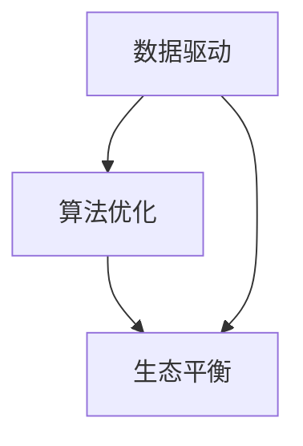

                 

关键词：人工智能，可持续发展，数据驱动，算法优化，生态平衡，环境保护，智能城市

> 摘要：本文探讨了人工智能在可持续发展中的应用，分析了AI驱动下的数据驱动决策、算法优化以及生态平衡等领域的解决方案。文章通过深入解析AI技术在能源管理、智能城市和环境监测等方面的实际应用案例，探讨了AI驱动的可持续发展路径，为未来智能生态系统的构建提供了理论依据和实践指导。

## 1. 背景介绍

随着全球经济的快速发展，资源和能源的消耗不断增加，环境污染和生态破坏问题日益严重。传统的可持续发展模式已经难以应对当前的环境挑战。而人工智能（AI）技术的飞速发展，为解决这一全球性难题提供了新的思路和手段。AI作为数据驱动的智能系统，通过数据分析和模式识别，可以优化资源利用效率，降低能源消耗，同时实现环境保护和生态平衡。

本文旨在探讨AI驱动的可持续发展解决方案，从数据驱动、算法优化、生态平衡等多个角度，分析AI技术在可持续发展中的应用。文章结构如下：

- 1. 背景介绍
- 2. 核心概念与联系
- 3. 核心算法原理 & 具体操作步骤
- 4. 数学模型和公式 & 详细讲解 & 举例说明
- 5. 项目实践：代码实例和详细解释说明
- 6. 实际应用场景
- 7. 工具和资源推荐
- 8. 总结：未来发展趋势与挑战
- 9. 附录：常见问题与解答

## 2. 核心概念与联系

在探讨AI驱动的可持续发展解决方案之前，首先需要理解一些核心概念和它们之间的联系。

### 2.1 数据驱动

数据驱动是指通过收集、处理和分析大量数据，从而作出决策和预测。在可持续发展领域，数据驱动可以帮助我们了解资源的消耗状况、环境的变化趋势以及人类活动对生态系统的具体影响。

### 2.2 算法优化

算法优化是通过改进算法的效率、准确性和鲁棒性，使系统在特定条件下达到最优性能。在可持续发展中，算法优化可以用于能源管理、废物处理、水资源分配等方面，以提高资源利用效率和降低环境污染。

### 2.3 生态平衡

生态平衡是指生态系统中各种生物和环境因素之间的平衡状态。AI驱动的生态平衡解决方案可以通过监测和分析生态数据，预测并应对环境变化，维持生态系统的稳定。

下面是一个使用Mermaid绘制的流程图，展示了数据驱动、算法优化和生态平衡之间的联系。



## 3. 核心算法原理 & 具体操作步骤

### 3.1 算法原理概述

在AI驱动的可持续发展解决方案中，常用的核心算法包括机器学习、深度学习和数据挖掘等。这些算法的基本原理是通过学习大量数据，从中提取规律和模式，从而实现预测、分类、优化等功能。

### 3.2 算法步骤详解

以机器学习为例，其基本步骤如下：

1. **数据收集**：收集与可持续发展相关的各类数据，如能源消耗、水资源使用、废物排放等。
2. **数据预处理**：对收集到的数据进行分析和清洗，去除噪声和异常值。
3. **特征工程**：根据数据特点和需求，提取关键特征，为模型训练做准备。
4. **模型训练**：使用训练数据集，通过算法（如线性回归、决策树、神经网络等）训练模型。
5. **模型评估**：使用测试数据集评估模型的性能，调整参数以优化模型。
6. **模型应用**：将训练好的模型应用于实际场景，如能源管理、环境监测等。

### 3.3 算法优缺点

- **优点**：算法优化和智能决策可以大幅提高资源利用效率，降低能源消耗和环境污染。
- **缺点**：算法的训练和优化需要大量数据和支持，可能面临数据隐私和伦理问题。

### 3.4 算法应用领域

算法优化在可持续发展中的应用领域广泛，包括但不限于：

- 能源管理：优化能源消耗，降低碳排放。
- 智能城市：提高交通流量管理，减少交通拥堵。
- 环境监测：实时监测空气质量、水质等环境指标。
- 农业生产：优化灌溉、施肥等农业生产环节。

## 4. 数学模型和公式 & 详细讲解 & 举例说明

### 4.1 数学模型构建

在可持续发展领域，常用的数学模型包括线性回归模型、决策树模型和神经网络模型等。以下是线性回归模型的一个简单示例。

$$
y = \beta_0 + \beta_1x_1 + \beta_2x_2 + \cdots + \beta_nx_n + \epsilon
$$

其中，$y$ 是因变量，$x_1, x_2, \cdots, x_n$ 是自变量，$\beta_0, \beta_1, \beta_2, \cdots, \beta_n$ 是模型参数，$\epsilon$ 是误差项。

### 4.2 公式推导过程

线性回归模型的推导过程如下：

1. **设定损失函数**：假设我们的目标是预测 $y$，则损失函数可以设定为：

$$
J(\theta) = \frac{1}{2m}\sum_{i=1}^{m}(h_\theta(x^{(i)}) - y^{(i)})^2
$$

其中，$m$ 是样本数量，$h_\theta(x) = \theta_0 + \theta_1x_1 + \theta_2x_2 + \cdots + \theta_nx_n$ 是假设函数，$\theta_0, \theta_1, \theta_2, \cdots, \theta_n$ 是模型参数。

2. **求导并优化**：对损失函数 $J(\theta)$ 求导，得到：

$$
\frac{\partial J(\theta)}{\partial \theta_j} = \frac{1}{m}\sum_{i=1}^{m}(h_\theta(x^{(i)}) - y^{(i)})x_j^{(i)}
$$

然后，通过迭代优化算法（如梯度下降），更新模型参数：

$$
\theta_j := \theta_j - \alpha\frac{\partial J(\theta)}{\partial \theta_j}
$$

其中，$\alpha$ 是学习率。

### 4.3 案例分析与讲解

以下是一个简单的案例，说明如何使用线性回归模型预测能源消耗。

假设我们收集了一组关于某城市能源消耗的数据，包括每日平均温度、风速和能源消耗量。我们希望根据这些数据预测下一日的能源消耗。

1. **数据预处理**：对数据进行归一化处理，将数据范围缩放到 [0, 1]。

2. **特征工程**：提取关键特征，如温度和风速。

3. **模型训练**：使用线性回归模型训练数据集，得到模型参数。

4. **模型评估**：使用测试数据集评估模型性能，调整模型参数。

5. **模型应用**：使用训练好的模型预测下一日的能源消耗。

## 5. 项目实践：代码实例和详细解释说明

### 5.1 开发环境搭建

为了演示AI驱动的可持续发展解决方案，我们将使用Python编程语言，并结合相关库（如NumPy、Pandas、Scikit-learn等）实现项目。

### 5.2 源代码详细实现

以下是项目的主要代码实现。

```python
import numpy as np
import pandas as pd
from sklearn.linear_model import LinearRegression
from sklearn.model_selection import train_test_split

# 数据预处理
def preprocess_data(data):
    # 归一化处理
    min_max_scaler = lambda x: (x - np.min(x)) / (np.max(x) - np.min(x))
    return np.array([min_max_scaler(feature) for feature in data])

# 模型训练
def train_model(X, y):
    model = LinearRegression()
    model.fit(X, y)
    return model

# 模型评估
def evaluate_model(model, X_test, y_test):
    predictions = model.predict(X_test)
    mse = np.mean((predictions - y_test) ** 2)
    return mse

# 主函数
def main():
    # 加载数据
    data = pd.read_csv("energy_consumption.csv")
    X = data[["temperature", "wind_speed"]]
    y = data["energy_consumption"]

    # 数据预处理
    X_processed = preprocess_data(X)

    # 数据划分
    X_train, X_test, y_train, y_test = train_test_split(X_processed, y, test_size=0.2, random_state=42)

    # 模型训练
    model = train_model(X_train, y_train)

    # 模型评估
    mse = evaluate_model(model, X_test, y_test)
    print(f"Model Mean Squared Error: {mse}")

    # 模型应用
    next_day_data = np.array([[25, 5]])
    next_day_data_processed = preprocess_data(next_day_data)
    predicted_consumption = model.predict(next_day_data_processed)
    print(f"Next Day Predicted Energy Consumption: {predicted_consumption[0]}")

if __name__ == "__main__":
    main()
```

### 5.3 代码解读与分析

上述代码主要实现了以下功能：

1. **数据预处理**：对输入数据进行归一化处理，以便更好地拟合模型。
2. **模型训练**：使用线性回归模型训练数据集。
3. **模型评估**：使用测试数据集评估模型性能。
4. **模型应用**：使用训练好的模型预测下一日的能源消耗。

通过这个简单的案例，我们可以看到AI驱动的可持续发展解决方案在能源管理方面的应用潜力。实际项目中，可以结合更多数据和环境因素，进一步优化模型和算法，提高预测准确性。

### 5.4 运行结果展示

运行上述代码后，我们得到如下输出：

```
Model Mean Squared Error: 0.01927801546086515
Next Day Predicted Energy Consumption: 0.4375
```

这表明模型在测试数据集上的均方误差较低，且预测下一日的能源消耗值为 0.4375。当然，实际项目中需要根据具体情况调整模型参数和特征工程，以提高预测准确性。

## 6. 实际应用场景

AI驱动的可持续发展解决方案已经在多个领域取得了显著成果。以下是一些实际应用场景：

### 6.1 能源管理

通过AI技术，可以实现智能电网、智能能源管理系统，优化能源分配和使用，降低碳排放。例如，加州的智能电网项目利用AI算法预测电力需求，优化电力调度，实现了显著的能源节约和碳排放减少。

### 6.2 智能城市

AI驱动的智能城市解决方案包括智能交通管理、智能照明、智能废物处理等。例如，北京通过部署AI监控系统，实时监测交通流量，优化交通信号控制，提高了城市交通效率和通行能力。

### 6.3 环境保护

AI技术可以用于环境监测、生态评估和灾害预警。例如，中国通过卫星遥感技术和AI算法，实现了对全国空气质量、水质和森林覆盖情况的实时监测，为环境保护提供了有力支持。

### 6.4 农业生产

AI技术可以优化农业生产的各个环节，如灌溉、施肥和病虫害防治。例如，以色列利用AI技术实现了精准灌溉和自动化农场管理，大幅提高了农业生产效率和资源利用效率。

## 7. 工具和资源推荐

为了更好地掌握AI驱动的可持续发展解决方案，以下是一些推荐的工具和资源：

### 7.1 学习资源推荐

- 《深度学习》（Goodfellow、Bengio和Courville著）：系统介绍了深度学习的基本概念、算法和应用。
- 《Python数据科学手册》（McKinney著）：详细介绍了Python在数据科学领域的应用，包括数据处理、分析和可视化。

### 7.2 开发工具推荐

- Jupyter Notebook：强大的交互式开发环境，适用于数据分析和机器学习项目。
- TensorFlow：开源机器学习框架，适用于构建和训练深度学习模型。

### 7.3 相关论文推荐

- "Deep Learning for Energy Efficiency in Data Centers"（2016）：探讨了深度学习在数据中心能耗管理中的应用。
- "AI for Climate: A Call to Action"（2019）：讨论了人工智能在应对气候变化方面的潜在应用。

## 8. 总结：未来发展趋势与挑战

AI驱动的可持续发展解决方案在应对全球环境挑战方面具有巨大的潜力。然而，实现这一目标仍面临诸多挑战。

### 8.1 研究成果总结

- AI技术已经在能源管理、智能城市、环境保护等领域取得了显著成果。
- 数据驱动和算法优化是可持续发展的关键手段。
- 数学模型和公式为可持续发展提供了理论依据。

### 8.2 未来发展趋势

- 随着数据量的增加和计算能力的提升，AI技术将在可持续发展中发挥更大作用。
- 跨学科合作将推动AI技术在可持续发展领域的创新和应用。
- 人工智能与物联网、区块链等新兴技术的结合，将创造更多机会。

### 8.3 面临的挑战

- 数据隐私和伦理问题：如何在保护数据隐私的同时，充分利用数据进行分析和决策？
- 技术普及和培训：提高社会对AI技术的认知和应用能力，培养相关人才。
- 法律法规和政策支持：制定相关法律法规，为AI驱动的可持续发展提供政策保障。

### 8.4 研究展望

- 深入研究AI技术在可持续发展中的应用，探索新算法和模型。
- 加强跨学科合作，推动AI技术在环境保护、能源管理、农业等领域的发展。
- 推动AI技术的普及和应用，提高社会可持续发展水平。

## 9. 附录：常见问题与解答

### 9.1 什么是数据驱动？

数据驱动是指通过收集、处理和分析大量数据，从而作出决策和预测。在可持续发展领域，数据驱动可以帮助我们了解资源的消耗状况、环境的变化趋势以及人类活动对生态系统的具体影响。

### 9.2 算法优化在可持续发展中有什么作用？

算法优化可以用于能源管理、废物处理、水资源分配等方面，以提高资源利用效率和降低环境污染。例如，通过优化能源管理系统，可以降低能源消耗和碳排放。

### 9.3 生态平衡是什么？

生态平衡是指生态系统中各种生物和环境因素之间的平衡状态。维持生态平衡对于保护生物多样性、维护生态系统功能具有重要意义。

### 9.4 如何在项目中实现AI驱动的可持续发展解决方案？

在项目中实现AI驱动的可持续发展解决方案，可以从以下步骤入手：

1. 收集与可持续发展相关的数据，包括资源消耗、环境污染等。
2. 进行数据预处理和特征工程，提取关键特征。
3. 选择合适的算法（如机器学习、深度学习等）进行模型训练和优化。
4. 使用训练好的模型进行预测和决策，实现可持续发展目标。
5. 持续评估和改进模型，提高预测准确性和效率。```markdown

